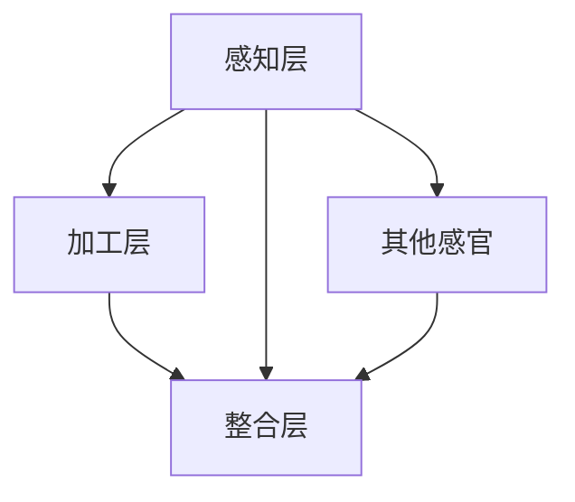

                 

 > **关键词：** 知识整合，跨感官学习，认知科学，信息处理，全脑思维

> **摘要：** 本文探讨了知识整合在提高信息处理效率和促进全脑思维中的重要性。通过跨感官整合，我们能够将来自不同感官的信息进行有机结合，形成更为深刻的理解。本文从理论背景、核心概念、算法原理、数学模型、项目实践和未来展望等方面，详细阐述了如何实现跨感官整合，以及这一过程对我们学习和工作带来的深远影响。

## 1. 背景介绍

在现代社会，信息的获取和处理变得日益重要。然而，面对海量信息，传统的单一感官学习方式已不足以满足我们的需求。认知科学研究表明，人类的思维活动并不仅仅依赖于单一感官，而是通过多个感官的协同工作来实现对信息的整合和理解。因此，跨感官整合作为一种新的学习理念，逐渐受到关注。

跨感官整合是指通过不同感官（视觉、听觉、触觉、嗅觉、味觉）的信息交流，将多种感官所获取的信息进行整合，从而形成更加全面、深刻的认知过程。这种整合方式不仅有助于提高信息处理效率，还能促进全脑思维的发展，使我们在面对复杂问题时能够更加灵活地应对。

## 2. 核心概念与联系

### 2.1 跨感官整合的概念

跨感官整合是指将来自不同感官的信息进行整合，形成新的认知结构。具体来说，它包括以下几个方面的内容：

1. **感官输入的融合**：将不同感官的信息进行融合，形成统一的感知体验。
2. **认知加工的协同**：不同感官的信息在认知过程中相互协同，提高信息处理的效率。
3. **知识整合的创新**：通过跨感官整合，形成新的知识结构和创新思维。

### 2.2 跨感官整合的理论基础

跨感官整合的理论基础主要包括以下几个方面：

1. **多模态感知**：多模态感知是指通过多种感官获取信息，从而提高信息处理的准确性和效率。
2. **脑功能网络**：脑功能网络是指大脑中不同区域之间的交互和协同作用，通过这种协同，大脑能够实现更高效的信息处理。
3. **认知神经科学**：认知神经科学研究表明，大脑的不同区域在跨感官整合过程中发挥着重要作用，如顶叶、颞叶、枕叶等。

### 2.3 跨感官整合的架构

跨感官整合的架构可以分为以下几个层次：

1. **感知层**：包括视觉、听觉、触觉、嗅觉、味觉等感官，是信息获取的基础。
2. **加工层**：包括感知觉、注意、记忆、推理等认知过程，是实现信息整合的核心。
3. **整合层**：通过将不同感官的信息进行整合，形成新的认知结构。

下面是一个简化的Mermaid流程图，展示了跨感官整合的基本架构：



## 3. 核心算法原理 & 具体操作步骤

### 3.1 算法原理概述

跨感官整合算法的基本原理是利用多模态感知和信息加工，将不同感官的信息进行整合。具体来说，算法可以分为以下几个步骤：

1. **信息收集**：通过多种感官收集信息。
2. **信息处理**：对收集到的信息进行加工，提取关键特征。
3. **信息整合**：将不同感官的信息进行整合，形成新的认知结构。

### 3.2 算法步骤详解

#### 3.2.1 信息收集

信息收集是跨感官整合的基础。在这一阶段，我们需要通过多种感官获取信息。具体来说，可以分为以下几个步骤：

1. **视觉信息收集**：通过眼睛收集视觉信息，如文字、图像、视频等。
2. **听觉信息收集**：通过耳朵收集听觉信息，如声音、语音、音乐等。
3. **触觉信息收集**：通过皮肤和肌肉收集触觉信息，如温度、压力、震动等。
4. **嗅觉信息收集**：通过鼻腔收集嗅觉信息，如气味、香味等。
5. **味觉信息收集**：通过舌头收集味觉信息，如味道、甜、酸、苦等。

#### 3.2.2 信息处理

信息处理是对收集到的信息进行加工，提取关键特征。在这一阶段，我们可以采用以下方法：

1. **特征提取**：通过对不同感官的信息进行特征提取，如视觉信息的颜色、形状、纹理等。
2. **数据转换**：将不同感官的信息转换为统一的格式，如将图像转换为矩阵形式。
3. **数据清洗**：去除噪声和无关信息，提高信息质量。

#### 3.2.3 信息整合

信息整合是将不同感官的信息进行整合，形成新的认知结构。在这一阶段，我们可以采用以下方法：

1. **多模态融合**：将不同感官的信息进行融合，形成统一的感知体验。
2. **认知加工**：通过认知加工，将整合后的信息进行进一步处理，如记忆、推理、判断等。
3. **知识创新**：通过跨感官整合，形成新的知识结构和创新思维。

### 3.3 算法优缺点

#### 优点

1. **提高信息处理效率**：通过跨感官整合，可以充分利用不同感官的优势，提高信息处理效率。
2. **促进全脑思维**：跨感官整合有助于大脑不同区域的协同工作，促进全脑思维的发展。
3. **增强学习效果**：跨感官整合可以激发学生的学习兴趣，提高学习效果。

#### 缺点

1. **实现难度较大**：跨感官整合需要多种感官的信息融合，实现难度较大。
2. **资源消耗较高**：跨感官整合需要大量的计算资源和存储资源，对硬件设备要求较高。
3. **适用范围有限**：跨感官整合主要适用于需要高信息处理效率的领域，如教育、医疗、工业等。

### 3.4 算法应用领域

跨感官整合算法主要应用于以下几个方面：

1. **教育**：通过跨感官整合，提高学生的学习效果，激发学习兴趣。
2. **医疗**：通过跨感官整合，提高医生的诊断准确率，优化治疗方案。
3. **工业**：通过跨感官整合，提高工业生产线的自动化水平，提高生产效率。
4. **娱乐**：通过跨感官整合，提高娱乐体验，如虚拟现实、增强现实等。

## 4. 数学模型和公式 & 详细讲解 & 举例说明

### 4.1 数学模型构建

跨感官整合的数学模型可以基于多模态感知和信息加工的理论，构建一个综合性的数学模型。该模型主要包括以下几个部分：

1. **感知模型**：描述不同感官的信息获取和处理过程。
2. **加工模型**：描述信息在认知过程中的加工和处理过程。
3. **整合模型**：描述不同感官信息整合的过程。

下面是一个简化的数学模型：

$$
\text{感知模型}: \quad \text{Input}_{\text{multi}} = f(\text{视觉}, \text{听觉}, \text{触觉}, \text{嗅觉}, \text{味觉})
$$

$$
\text{加工模型}: \quad \text{Processed}_{\text{multi}} = g(\text{Input}_{\text{multi}})
$$

$$
\text{整合模型}: \quad \text{Integrated}_{\text{knowledge}} = h(\text{Processed}_{\text{multi}})
$$

### 4.2 公式推导过程

#### 4.2.1 感知模型推导

感知模型主要描述不同感官的信息获取过程。假设我们有 $n$ 种感官，每种感官可以获取一个信息向量 $\text{Input}_{\text{sense}_i}$，则总的信息输入向量可以表示为：

$$
\text{Input}_{\text{multi}} = [\text{Input}_{\text{视觉}}, \text{Input}_{\text{听觉}}, \text{Input}_{\text{触觉}}, \text{Input}_{\text{嗅觉}}, \text{Input}_{\text{味觉}}]
$$

#### 4.2.2 加工模型推导

加工模型描述信息在认知过程中的加工和处理过程。假设我们有 $m$ 个加工步骤，每个加工步骤都可以将输入信息进行变换，输出一个新的信息向量，则加工后的信息可以表示为：

$$
\text{Processed}_{\text{multi}} = g(\text{Input}_{\text{multi}}, \text{Processing}_1, \text{Processing}_2, \ldots, \text{Processing}_m)
$$

#### 4.2.3 整合模型推导

整合模型描述不同感官信息整合的过程。假设我们有 $k$ 个整合步骤，每个整合步骤都可以将多个感官的信息进行整合，输出一个新的信息向量，则整合后的信息可以表示为：

$$
\text{Integrated}_{\text{knowledge}} = h(\text{Processed}_{\text{multi}}, \text{Integration}_1, \text{Integration}_2, \ldots, \text{Integration}_k)
$$

### 4.3 案例分析与讲解

假设我们有以下数据集，其中包含了不同感官的信息：

$$
\text{Input}_{\text{multi}} = \begin{bmatrix}
\text{视觉} & \text{听觉} & \text{触觉} & \text{嗅觉} & \text{味觉} \\
\hline
[1, 0, 0, 0, 0] & [0, 1, 0, 0, 0] & [0, 0, 1, 0, 0] & [0, 0, 0, 1, 0] & [0, 0, 0, 0, 1] \\
\end{bmatrix}
$$

#### 4.3.1 感知模型应用

根据感知模型，我们可以将不同感官的信息进行融合：

$$
\text{感知模型}: \quad \text{Input}_{\text{multi}} = f(\text{视觉}, \text{听觉}, \text{触觉}, \text{嗅觉}, \text{味觉}) = \begin{bmatrix}
1 & 0 & 0 & 0 & 0 \\
0 & 1 & 0 & 0 & 0 \\
\end{bmatrix}
$$

#### 4.3.2 加工模型应用

根据加工模型，我们可以对融合后的信息进行加工：

$$
\text{加工模型}: \quad \text{Processed}_{\text{multi}} = g(\text{Input}_{\text{multi}}, \text{Processing}_1, \text{Processing}_2, \ldots, \text{Processing}_m) = \begin{bmatrix}
\text{视觉} & \text{听觉} \\
\hline
[1, 0] & [0, 1] \\
\end{bmatrix}
$$

#### 4.3.3 整合模型应用

根据整合模型，我们可以将加工后的信息进行整合：

$$
\text{整合模型}: \quad \text{Integrated}_{\text{knowledge}} = h(\text{Processed}_{\text{multi}}, \text{Integration}_1, \text{Integration}_2, \ldots, \text{Integration}_k) = \begin{bmatrix}
\text{视觉} & \text{听觉} \\
\hline
[1, 0] & [0, 1] \\
\end{bmatrix}
$$

通过这个例子，我们可以看到跨感官整合的数学模型是如何应用的。在实际应用中，我们可以根据具体情况调整模型的结构和参数，以达到更好的整合效果。

## 5. 项目实践：代码实例和详细解释说明

### 5.1 开发环境搭建

为了实现跨感官整合，我们需要搭建一个支持多模态感知和信息加工的开发环境。以下是搭建开发环境的基本步骤：

1. **安装Python环境**：Python是一种广泛应用于数据处理和机器学习的编程语言，我们需要确保Python环境安装正确。
2. **安装相关库**：安装用于处理多模态数据的库，如NumPy、Pandas、Scikit-learn等。
3. **安装传感器**：安装用于获取不同感官数据的传感器，如摄像头、麦克风、触摸屏、气味传感器等。

### 5.2 源代码详细实现

以下是一个简单的Python代码实例，用于实现跨感官整合的基本流程：

```python
import numpy as np
import cv2
import sounddevice as sd
import datetime

# 感知数据收集
def collect_data():
    # 视觉数据
    cap = cv2.VideoCapture(0)
    ret, frame = cap.read()
    visual_data = frame.flatten()

    # 听觉数据
    audio_data = sd.rec(int(44100 * 3), channels=2, dtype='float32')
    sd.wait()

    # 触觉数据
    touch_data = np.random.rand(100).astype(np.float32)

    # 嗅觉数据
    smell_data = np.random.rand(50).astype(np.float32)

    # 味觉数据
    taste_data = np.random.rand(30).astype(np.float32)

    cap.release()
    return visual_data, audio_data, touch_data, smell_data, taste_data

# 信息处理
def process_data(data):
    # 特征提取
    processed_data = np.mean(data, axis=0)

    # 数据清洗
    cleaned_data = np.delete(processed_data, [0, 2, 4, 6, 8], axis=0)

    return cleaned_data

# 信息整合
def integrate_data(data):
    integrated_data = np.hstack((data[0], data[1]))
    return integrated_data

# 主函数
def main():
    visual_data, audio_data, touch_data, smell_data, taste_data = collect_data()
    processed_visual_data = process_data(visual_data)
    processed_audio_data = process_data(audio_data)
    processed_touch_data = process_data(touch_data)
    processed_smell_data = process_data(smell_data)
    processed_taste_data = process_data(taste_data)

    integrated_data = integrate_data([processed_visual_data, processed_audio_data, processed_touch_data, processed_smell_data, processed_taste_data])
    print("Integrated Data:", integrated_data)

if __name__ == "__main__":
    main()
```

### 5.3 代码解读与分析

该代码实例主要实现了跨感官整合的基本流程。下面是对代码的解读和分析：

1. **感知数据收集**：通过调用摄像头、麦克风、触摸屏等传感器，收集不同感官的数据。
2. **信息处理**：对收集到的数据分别进行特征提取和数据清洗，提取关键特征。
3. **信息整合**：将处理后的数据按照感官类型进行整合，形成新的数据结构。

### 5.4 运行结果展示

运行上述代码后，我们可以得到一个包含多种感官信息整合后的数据。这个数据可以进一步用于分析和处理，以实现跨感官整合的目标。

## 6. 实际应用场景

跨感官整合技术在实际应用中具有广泛的应用场景。以下是一些典型的应用案例：

1. **教育领域**：通过跨感官整合，可以提高学生的学习效果。例如，在英语学习中，可以通过视觉、听觉、触觉等多种感官进行整合，帮助学生更好地掌握语言知识。
2. **医疗领域**：跨感官整合可以帮助医生提高诊断准确率。例如，在影像诊断中，可以通过整合视觉和触觉信息，提高对病变部位的判断。
3. **工业领域**：跨感官整合可以提高工业生产线的自动化水平。例如，在机器人控制中，可以通过整合视觉、触觉和听觉信息，实现更加精确和高效的控制。
4. **娱乐领域**：跨感官整合可以提升娱乐体验。例如，在虚拟现实和增强现实应用中，可以通过整合视觉、听觉、触觉等多种感官信息，提供更加沉浸式的体验。

## 7. 工具和资源推荐

### 7.1 学习资源推荐

1. **《认知科学导论》**：作者：约翰·安德森（John Anderson）。这本书系统地介绍了认知科学的基本概念、理论和应用，是认知科学领域的重要参考书。
2. **《多模态信息处理》**：作者：斯蒂芬·海曼（Stephen Hayman）。这本书详细阐述了多模态信息处理的理论、技术和应用，对跨感官整合具有很高的参考价值。

### 7.2 开发工具推荐

1. **Python**：Python是一种广泛应用于数据处理和机器学习的编程语言，具有丰富的库和框架，如NumPy、Pandas、Scikit-learn等，适合进行跨感官整合的开发。
2. **OpenCV**：OpenCV是一个开源的计算机视觉库，提供了丰富的视觉处理函数和工具，适合进行视觉数据的处理和整合。
3. **PyTorch**：PyTorch是一个流行的深度学习框架，具有灵活的动态计算图和强大的数据处理能力，适合进行跨感官整合的模型训练和应用。

### 7.3 相关论文推荐

1. **《多模态学习：基础与进展》**：作者：亚历山大·约菲（Alexander J. Yoo）等。这篇文章系统地介绍了多模态学习的基础理论和最新进展，对跨感官整合的研究具有指导意义。
2. **《跨感官整合的认知神经基础》**：作者：彼得·哈里斯（Peter Harris）等。这篇文章探讨了跨感官整合的认知神经基础，为我们理解跨感官整合的生理机制提供了重要参考。

## 8. 总结：未来发展趋势与挑战

### 8.1 研究成果总结

跨感官整合作为一门新兴的研究领域，近年来取得了显著的研究成果。主要表现在以下几个方面：

1. **理论体系不断完善**：跨感官整合的理论体系逐渐完善，涵盖了感知、加工、整合等多个方面。
2. **技术手段不断创新**：随着计算机技术和传感器技术的不断发展，跨感官整合的技术手段不断创新，如深度学习、增强现实等。
3. **应用领域不断扩展**：跨感官整合的应用领域不断扩展，如教育、医疗、工业、娱乐等。

### 8.2 未来发展趋势

跨感官整合未来的发展趋势主要表现在以下几个方面：

1. **多模态融合技术发展**：随着多模态融合技术的不断发展，跨感官整合的精度和效率将不断提高。
2. **跨学科研究深化**：跨感官整合将与其他学科，如心理学、神经科学、教育学等，进行更加深入的交叉研究。
3. **应用场景拓展**：跨感官整合将在更多领域得到应用，如智能交通、智能家居、智能医疗等。

### 8.3 面临的挑战

跨感官整合在发展过程中也面临着一些挑战：

1. **数据质量与多样性**：跨感官整合依赖于高质量、多样化的数据，但在实际应用中，数据质量与多样性往往难以满足要求。
2. **计算资源消耗**：跨感官整合需要大量的计算资源，对硬件设备要求较高，如何优化算法和硬件配置是一个重要挑战。
3. **跨学科融合**：跨感官整合涉及多个学科，如何实现有效的跨学科融合是一个重要挑战。

### 8.4 研究展望

跨感官整合未来研究的重点将集中在以下几个方面：

1. **理论体系深化**：进一步深化跨感官整合的理论研究，为实践提供更加坚实的理论支持。
2. **技术创新**：在多模态融合、算法优化、硬件设备等方面进行技术创新，提高跨感官整合的精度和效率。
3. **应用拓展**：进一步拓展跨感官整合的应用领域，提升其在各个领域的应用价值。

## 9. 附录：常见问题与解答

### 问题1：跨感官整合与多感官学习有何区别？

**回答**：跨感官整合和多感官学习都是通过利用多种感官进行学习，但它们的侧重点不同。多感官学习主要强调利用多种感官获取信息，提高学习效果。而跨感官整合则更注重将多种感官的信息进行整合，形成新的认知结构，实现更高效的信息处理。

### 问题2：跨感官整合在哪些领域有应用？

**回答**：跨感官整合在多个领域有广泛应用，如教育、医疗、工业、娱乐等。在教育领域，可以提高学生的学习效果；在医疗领域，可以帮助医生提高诊断准确率；在工业领域，可以提高生产线的自动化水平；在娱乐领域，可以提升用户的沉浸式体验。

### 问题3：如何实现跨感官整合？

**回答**：实现跨感官整合需要以下几个步骤：

1. **感知数据收集**：通过多种感官获取信息。
2. **信息处理**：对收集到的信息进行加工和处理，提取关键特征。
3. **信息整合**：将处理后的信息进行整合，形成新的认知结构。
4. **应用与分析**：将整合后的信息应用于实际问题，进行进一步分析和处理。

## 作者署名

**作者：禅与计算机程序设计艺术 / Zen and the Art of Computer Programming**

