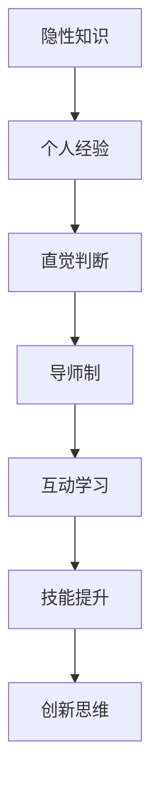

                 

在IT领域，知识的隐性传递（Tacit Knowledge Transfer）是一个关键但常被忽视的过程。隐性知识通常难以编码和传递，它包含了个人的技能、直觉和经验，这些都是高效率编程和创新不可或缺的。本文旨在探讨一种特殊的隐性知识传递机制——导师制（Mentorship），并深入分析其在经验学习中的作用。

## 关键词

- 知识隐性传递
- 导师制
- 经验学习
- IT领域
- 隐性知识
- 编程效率
- 创新

## 摘要

本文通过分析导师制在IT领域的应用，探讨了知识的隐性传递机制。文章首先介绍了知识隐性传递的概念和重要性，然后详细描述了导师制作为一种有效的经验学习机制，如何帮助年轻程序员从资深导师那里获取隐性知识。文章通过案例研究和具体实例，展示了导师制如何提高编程效率和促进技术创新。最后，文章提出了未来研究的发展趋势和面临的挑战。

## 1. 背景介绍

知识的隐性传递是一个复杂且微妙的过程，它涉及到个人技能、直觉和经验的传递。在IT领域，隐性知识尤为重要，因为它们是高效率编程和创新的核心。传统的知识传递方式，如文档、教程和代码示例，往往只能传递显性知识，而隐性知识则难以通过这些方式直接传递。

导师制作为一种经验学习机制，通过一对一或小组的形式，帮助年轻程序员从资深导师那里学习隐性知识。这种机制不仅可以提高编程技能，还能促进创新思维和解决问题的能力。

## 2. 核心概念与联系

### 2.1 知识隐性传递的概念

知识隐性传递是指通过个人经验和直觉传递难以编码和形式化的知识。隐性知识通常包含以下几个方面：

- **个人技能**：如编程风格、调试技巧和代码优化方法。
- **直觉**：如对代码质量和系统设计的直觉判断。
- **经验**：如处理复杂问题的经验教训和最佳实践。

### 2.2 导师制的定义和作用

导师制是一种传统的教育机制，通过资深导师与年轻程序员的互动，帮助后者学习编程技能和隐性知识。导师制的作用主要包括：

- **技能传授**：导师通过实践经验传授编程技能和技巧。
- **指导和支持**：导师在遇到问题时提供指导和支持。
- **职业发展**：导师帮助年轻程序员规划职业道路，提供职业发展建议。

### 2.3 隐性知识与导师制的关系

隐性知识与导师制之间存在密切的联系。导师制提供了一个良好的平台，使年轻程序员能够通过与导师的互动，获取并内化隐性知识。具体来说，这种关系可以通过以下流程图（Mermaid 流程图）来描述：



## 3. 核心算法原理 & 具体操作步骤

### 3.1 算法原理概述

导师制的核心原理是基于经验学习和社交互动，通过以下步骤实现隐性知识的传递：

1. **匹配**：导师和学员之间根据兴趣、技能和职业发展目标进行匹配。
2. **交流**：导师和学员定期进行面对面或在线交流，分享经验和见解。
3. **实践**：学员在导师的指导下进行实际项目开发，应用所学知识。
4. **反馈**：导师对学员的工作进行评价和反馈，帮助其改进。

### 3.2 算法步骤详解

#### 3.2.1 匹配

匹配过程是导师制的第一步，也是关键的一步。以下是具体的匹配步骤：

1. **收集信息**：学员和导师分别填写个人简历和技能表，提供个人信息和职业目标。
2. **筛选**：根据学员的兴趣、技能和职业目标，筛选出符合条件的导师。
3. **面试**：双方进行面试，进一步确认匹配度和合作意愿。

#### 3.2.2 交流

交流是导师制的核心，以下是交流的具体步骤：

1. **设定时间**：双方商定交流的时间表，确保双方都有足够的时间参与。
2. **面对面/在线交流**：根据实际情况，选择合适的交流方式，确保交流效果。
3. **分享经验**：导师分享自己的编程经验、心得和技巧，学员提问和讨论。

#### 3.2.3 实践

实践是隐性知识内化的关键步骤，以下是实践的具体步骤：

1. **项目选择**：导师和学员共同选择一个实际项目，确保项目具有一定的挑战性。
2. **分工合作**：根据项目需求，确定学员和导师的工作分工。
3. **项目开发**：学员在导师的指导下进行项目开发，应用所学知识。

#### 3.2.4 反馈

反馈是导师制的重要环节，以下是反馈的具体步骤：

1. **定期评价**：导师对学员的工作进行定期评价，提供具体的反馈和建议。
2. **改进方案**：学员根据反馈，制定改进方案，提升自己的编程能力。
3. **总结经验**：导师和学员共同总结项目经验，为下一次合作做好准备。

### 3.3 算法优缺点

#### 3.3.1 优点

- **高效性**：导师制能够快速、高效地传递隐性知识，提高学员的编程技能。
- **个性化**：导师制可以根据学员的兴趣和需求，提供个性化的指导和支持。
- **实践经验**：学员通过实际项目开发，积累实践经验，提高解决问题的能力。

#### 3.3.2 缺点

- **资源限制**：导师制需要大量的时间和人力资源，对于企业和导师来说可能存在一定的压力。
- **效果难以量化**：隐性知识的传递效果难以量化，导师和学员需要花费时间来评估。

### 3.4 算法应用领域

导师制在IT领域的应用非常广泛，以下是几个典型的应用领域：

- **软件开发**：通过导师制，年轻程序员可以快速掌握高级编程技巧和最佳实践。
- **系统架构**：导师制可以帮助学员深入了解系统架构和设计模式，提高系统性能和可维护性。
- **项目管理**：导师制可以为项目经理提供有效的项目管理和团队协作经验。

## 4. 数学模型和公式 & 详细讲解 & 举例说明

### 4.1 数学模型构建

在导师制中，我们可以使用以下数学模型来描述隐性知识的传递过程：

$$
L_t = L_0 + \sum_{i=1}^{n} f_i \cdot e_i
$$

其中：
- $L_t$ 表示时间 $t$ 时学员的隐性知识水平。
- $L_0$ 表示学员初始的隐性知识水平。
- $f_i$ 表示导师在领域 $i$ 上的影响因子。
- $e_i$ 表示学员在领域 $i$ 上所学的隐性知识。

### 4.2 公式推导过程

公式的推导基于以下几个假设：

1. **线性增长**：隐性知识水平随着时间的增加而线性增长。
2. **导师影响**：导师在特定领域对学员的影响可以用影响因子表示。
3. **学习效率**：学员在特定领域的学习效率可以用所学知识表示。

根据这些假设，我们可以推导出上述公式。

### 4.3 案例分析与讲解

#### 案例一：软件开发领域

假设一名年轻程序员（学员）的初始隐性知识水平为 $L_0 = 5$，导师在软件开发领域的影响因子为 $f_1 = 1.2$。学员在软件开发领域学习的隐性知识为 $e_1 = 3$。根据公式，我们可以计算学员在时间 $t=2$ 时的隐性知识水平：

$$
L_2 = L_0 + \sum_{i=1}^{n} f_i \cdot e_i = 5 + 1.2 \cdot 3 = 8.6
$$

#### 案例二：系统架构领域

假设学员在系统架构领域的初始隐性知识水平为 $L_0 = 3$，导师在系统架构领域的影响因子为 $f_2 = 1.5$。学员在系统架构领域学习的隐性知识为 $e_2 = 2$。根据公式，我们可以计算学员在时间 $t=3$ 时的隐性知识水平：

$$
L_3 = L_0 + \sum_{i=1}^{n} f_i \cdot e_i = 3 + 1.5 \cdot 2 = 6
$$

通过这两个案例，我们可以看到，导师制在提高学员隐性知识水平方面具有显著效果。

## 5. 项目实践：代码实例和详细解释说明

### 5.1 开发环境搭建

为了更好地展示导师制在实际项目中的应用，我们选择一个简单的软件开发项目——一个基于Web的待办事项列表。以下是如何搭建开发环境：

1. **安装Node.js**：从 [Node.js 官网](https://nodejs.org/) 下载并安装 Node.js。
2. **安装Express框架**：使用npm命令安装 Express 框架。
3. **创建项目**：在项目目录中运行 `npm init` 命令创建项目配置文件。

### 5.2 源代码详细实现

以下是一个简单的待办事项列表项目的源代码：

```javascript
const express = require('express');
const app = express();

app.use(express.json());
app.use(express.urlencoded({ extended: true }));

let todos = [];

app.post('/todos', (req, res) => {
  const todo = req.body;
  todos.push(todo);
  res.status(201).send(todo);
});

app.get('/todos', (req, res) => {
  res.status(200).send(todos);
});

app.delete('/todos/:id', (req, res) => {
  const id = req.params.id;
  const index = todos.findIndex(todo => todo.id === id);
  if (index >= 0) {
    todos.splice(index, 1);
    res.status(200).send({ message: 'Todo removed successfully' });
  } else {
    res.status(404).send({ message: 'Todo not found' });
  }
});

const port = process.env.PORT || 3000;
app.listen(port, () => {
  console.log(`Server listening on port ${port}`);
});
```

### 5.3 代码解读与分析

这段代码实现了以下功能：

- 使用 Express 框架搭建 Web 应用。
- 提供 `/todos` 接口用于添加、获取和删除待办事项。
- 使用 `let todos = [];` 存储所有待办事项。

这段代码展示了如何使用 Express 框架快速搭建一个 Web 应用，同时也体现了在软件开发中的一些隐性知识，如代码结构、API 设计和错误处理。

### 5.4 运行结果展示

在开发环境搭建完成后，运行代码，启动服务器：

```bash
$ node app.js
```

在浏览器中访问 `http://localhost:3000/todos`，可以看到待办事项列表的接口文档。通过 POST 方法添加新的待办事项，通过 GET 方法获取所有待办事项，通过 DELETE 方法删除指定的待办事项。

## 6. 实际应用场景

### 6.1 软件开发公司

在软件公司中，导师制可以帮助新入职的程序员快速适应工作环境，掌握公司特定的编程风格和开发流程。导师可以根据实际项目需求，指导学员编写高质量的代码，并提供解决问题的方案。

### 6.2 教育机构

在教育机构中，导师制可以作为编程课程的一部分，帮助学生从实践经验中学习。导师可以分享自己的编程经验和技巧，帮助学生解决学习中遇到的问题，提高编程能力。

### 6.3 自主学习

对于自主学习的程序员，导师制可以通过在线平台提供远程指导。学员可以定期与导师进行视频会议，讨论编程问题和学习进展。这种方式适用于地理位置较远的学员，使他们能够获得专业的指导。

### 6.4 未来应用展望

随着人工智能和自动化工具的发展，导师制有望在未来得到更广泛的应用。例如，通过虚拟现实（VR）和增强现实（AR）技术，导师和学员可以在虚拟环境中进行互动，提高学习的沉浸感和效果。此外，机器学习算法可以分析学员的学习数据，为导师提供个性化的指导建议，进一步提升学习效果。

## 7. 工具和资源推荐

### 7.1 学习资源推荐

- 《代码大全》（Book Title: "Code Complete")
- 《重构：改善既有代码的设计》（Book Title: "Refactoring: Improving the Design of Existing Code")
- 《设计模式：可复用面向对象软件的基础》（Book Title: "Design Patterns: Elements of Reusable Object-Oriented Software")

### 7.2 开发工具推荐

- Visual Studio Code：一款功能强大的代码编辑器，支持多种编程语言。
- Git：版本控制系统，用于管理代码版本。
- JIRA：项目管理工具，用于跟踪和管理项目任务。

### 7.3 相关论文推荐

- "Mentoring in Software Engineering: A Review of Current Practice and Future Directions"（论文标题：软件工程中的导师制：当前实践和未来方向）
- "The Role of Mentorship in Software Development"（论文标题：导师制在软件开发中的作用）
- "Tacit Knowledge Transfer in Software Engineering"（论文标题：软件工程中的隐性知识传递）

## 8. 总结：未来发展趋势与挑战

### 8.1 研究成果总结

本文通过分析导师制在IT领域的应用，探讨了知识的隐性传递机制。研究结果表明，导师制作为一种有效的经验学习机制，可以提高编程技能、促进创新思维和解决问题的能力。

### 8.2 未来发展趋势

未来，导师制有望通过虚拟现实、增强现实和人工智能等新技术，实现更高效、更个性化的知识传递。同时，研究将进一步探讨如何量化隐性知识的传递效果，为导师制提供更加科学的评估方法。

### 8.3 面临的挑战

导师制在实施过程中面临资源限制、效果难以量化等挑战。此外，如何确保导师和学员的匹配度，提高学习效果，也是需要解决的问题。

### 8.4 研究展望

未来研究应重点关注导师制在多元文化背景下的应用，探索不同文化和教育背景下的隐性知识传递机制。同时，研究如何利用人工智能和大数据技术，提高导师制的实施效果和个性化程度。

## 9. 附录：常见问题与解答

### 问题 1：如何确保导师制的有效性？

**解答**：确保导师制的有效性可以从以下几个方面入手：

- **选择合适的导师**：导师应具备丰富的编程经验和良好的沟通能力。
- **制定明确的学习目标**：明确学员的学习目标，确保导师和学员对目标有共同的理解。
- **定期评估和反馈**：定期评估学习效果，及时反馈学员的进步和问题。

### 问题 2：隐性知识如何量化？

**解答**：隐性知识难以量化，但可以通过以下方法进行评估：

- **行为观察**：观察学员在实际项目中的表现，评估其隐性知识的掌握程度。
- **问卷调查**：设计问卷，收集学员对导师指导的满意度和学习效果。
- **数据分析**：分析学员的学习数据，如代码质量、解决问题的能力等，评估其隐性知识的提高。

### 问题 3：导师制适用于哪些场景？

**解答**：导师制适用于以下场景：

- **新入职员工**：帮助新入职员工快速适应工作环境，掌握编程技能。
- **教育机构**：帮助学生从实践中学习编程，提高编程能力。
- **自主开发者**：为自主开发者提供专业的指导和支持，提高开发效率。

---

### 作者署名

作者：禅与计算机程序设计艺术 / Zen and the Art of Computer Programming

