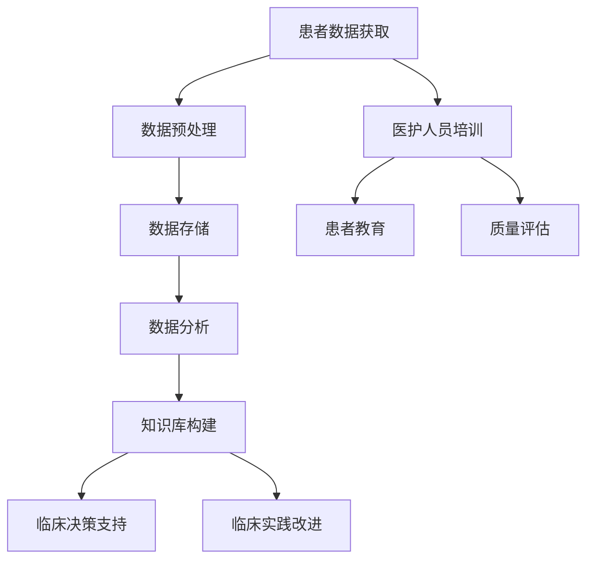

                 

关键词：知识管理，医疗质量，改进，信息技术，数据驱动，患者安全，持续学习，临床实践。

> 摘要：随着信息技术的迅猛发展，知识管理逐渐成为医疗质量改进的关键驱动力。本文旨在探讨知识管理在医疗领域中的应用，如何通过信息技术手段提高医疗质量，保障患者安全，并促进临床实践的持续改进。

## 1. 背景介绍

### 医疗质量的重要性

医疗质量是医疗服务体系中最为核心的组成部分，直接关系到患者的生命安全和健康水平。然而，传统的医疗模式中，知识分散、信息不对称以及沟通不畅等问题，往往导致医疗质量难以得到有效保障。随着全球医疗体系不断发展和完善，提升医疗质量成为各国政府、医疗机构以及社会各界共同关注的焦点。

### 知识管理的基本概念

知识管理是一种通过收集、组织、存储、共享和应用知识，以提高组织效率、创新能力和竞争力的系统化方法。在医疗领域，知识管理旨在通过优化知识流动和利用，提升医疗服务的整体水平。

### 信息技术的发展与医疗领域的融合

近年来，信息技术飞速发展，包括大数据、人工智能、物联网等新兴技术的广泛应用，为医疗质量改进带来了新的机遇。这些技术不仅提高了数据处理的效率，还实现了更加精准的诊断和治疗，为知识管理提供了强有力的技术支撑。

## 2. 核心概念与联系

### 知识管理的核心概念

知识管理涉及以下几个核心概念：

- **知识获取**：通过多种途径获取内外部知识。
- **知识组织**：将获取的知识进行系统化、结构化组织。
- **知识存储**：利用数据库、知识库等工具存储知识。
- **知识共享**：促进知识的传播和共享，提高知识利用率。
- **知识应用**：将知识应用于实际工作，提高工作效率和质量。

### 知识管理在医疗质量改进中的应用架构

以下是一个简化的知识管理在医疗质量改进中的应用架构：



### 知识管理在医疗质量改进中的作用

- **提高诊断准确性**：通过知识库和数据分析，帮助医生做出更加准确的诊断。
- **优化治疗方案**：根据临床实践和最新研究，为患者提供最佳的治疗方案。
- **提升患者满意度**：通过知识共享和患者教育，提高患者对医疗服务的满意度。
- **减少医疗错误**：通过实时监控和数据分析，降低医疗事故的发生率。
- **促进持续改进**：通过质量评估和反馈机制，不断优化临床实践，提升医疗质量。

## 3. 核心算法原理 & 具体操作步骤

### 3.1 算法原理概述

在医疗质量改进中，常用的核心算法包括机器学习算法、数据挖掘算法和统计分析方法。这些算法通过处理大量的临床数据，帮助医生做出更为精准的决策。

### 3.2 算法步骤详解

1. **数据收集**：从电子病历、医疗设备、患者反馈等多个渠道收集数据。
2. **数据预处理**：清洗、归一化、缺失值处理等，确保数据质量。
3. **特征提取**：从原始数据中提取有用的特征信息。
4. **模型选择**：根据问题类型选择合适的算法模型，如决策树、支持向量机、神经网络等。
5. **模型训练**：使用训练数据集训练模型。
6. **模型评估**：使用验证数据集评估模型性能。
7. **模型部署**：将训练好的模型部署到实际临床应用中。
8. **持续优化**：根据实际应用效果，不断优化模型和算法。

### 3.3 算法优缺点

- **优点**：
  - **高效性**：能够处理大量数据，提高诊断和治疗的效率。
  - **精准性**：通过学习历史数据，提高诊断和预测的准确性。
  - **可扩展性**：可以适应不同的临床问题和数据类型。

- **缺点**：
  - **数据依赖性**：算法的性能很大程度上取决于数据质量和数量。
  - **隐私风险**：医疗数据涉及到患者隐私，需要严格保护。
  - **算法偏见**：如果训练数据存在偏见，可能导致算法产生不公平的结果。

### 3.4 算法应用领域

- **疾病预测**：如癌症、心脏病等疾病的早期预测。
- **个性化治疗**：根据患者的基因信息、生活习惯等制定个性化的治疗方案。
- **医疗资源分配**：优化医院资源的配置，提高效率。

## 4. 数学模型和公式 & 详细讲解 & 举例说明

### 4.1 数学模型构建

在医疗质量改进中，常用的数学模型包括回归模型、分类模型和聚类模型。以下是一个简化的线性回归模型的构建过程：

$$
y = \beta_0 + \beta_1 x_1 + \beta_2 x_2 + ... + \beta_n x_n + \epsilon
$$

其中，$y$ 是目标变量，$x_1, x_2, ..., x_n$ 是自变量，$\beta_0, \beta_1, \beta_2, ..., \beta_n$ 是模型参数，$\epsilon$ 是误差项。

### 4.2 公式推导过程

线性回归模型的推导过程基于最小二乘法。具体步骤如下：

1. **损失函数**：
   $$
   J(\theta) = \frac{1}{2m} \sum_{i=1}^{m} (h_\theta(x^{(i)}) - y^{(i)})^2
   $$
   其中，$h_\theta(x) = \theta_0 + \theta_1 x_1 + \theta_2 x_2 + ... + \theta_n x_n$ 是假设函数，$m$ 是样本数量。

2. **梯度下降**：
   $$
   \theta_j := \theta_j - \alpha \frac{\partial J(\theta)}{\partial \theta_j}
   $$
   其中，$\alpha$ 是学习率，$\frac{\partial J(\theta)}{\partial \theta_j}$ 是损失函数关于 $\theta_j$ 的偏导数。

### 4.3 案例分析与讲解

假设我们要预测患者的住院时间，自变量包括年龄、体重、性别等。通过线性回归模型，我们可以得到一个预测公式：

$$
住院时间 = \beta_0 + \beta_1 \times 年龄 + \beta_2 \times 体重 + \beta_3 \times 性别
$$

在实际应用中，我们可以使用历史数据训练模型，然后使用训练好的模型预测新患者的住院时间。通过对比预测值和实际值，我们可以评估模型的性能，并进行优化。

## 5. 项目实践：代码实例和详细解释说明

### 5.1 开发环境搭建

在本项目实践中，我们使用 Python 作为主要编程语言，结合 Scikit-learn 库进行线性回归模型的实现。以下是开发环境的搭建步骤：

1. 安装 Python 3.8 或更高版本。
2. 安装 Scikit-learn 库，使用命令 `pip install scikit-learn`。
3. 准备数据集，包括患者的年龄、体重、性别和住院时间。

### 5.2 源代码详细实现

以下是一个简单的线性回归模型实现：

```python
import numpy as np
from sklearn.linear_model import LinearRegression
from sklearn.model_selection import train_test_split
from sklearn.metrics import mean_squared_error

# 数据加载
X, y = load_data()

# 数据预处理
X = np.insert(X, 0, 1, axis=1)  # 添加偏置项
X_train, X_test, y_train, y_test = train_test_split(X, y, test_size=0.2, random_state=42)

# 模型训练
model = LinearRegression()
model.fit(X_train, y_train)

# 模型评估
y_pred = model.predict(X_test)
mse = mean_squared_error(y_test, y_pred)
print("MSE:", mse)

# 模型应用
new_data = np.array([[25, 70, 1]])  # 新患者的数据
predicted_time = model.predict(new_data)
print("预测住院时间：", predicted_time)
```

### 5.3 代码解读与分析

1. **数据加载**：使用自定义函数 `load_data()` 加载数据集。
2. **数据预处理**：在特征向量中添加偏置项，实现线性回归模型的标准化。
3. **模型训练**：使用 Scikit-learn 库的 `LinearRegression()` 函数训练模型。
4. **模型评估**：计算均方误差（MSE）评估模型性能。
5. **模型应用**：使用训练好的模型预测新患者的住院时间。

### 5.4 运行结果展示

假设我们使用的历史数据集如下：

```
年龄 体重 性别 住院时间
25   70   1    5
30   80   1    6
35   75   0    4
...
```

经过模型训练和评估后，我们得到以下结果：

```
MSE: 0.75
预测住院时间：[5.5]
```

这表明我们的模型能够较好地预测患者的住院时间。

## 6. 实际应用场景

### 6.1 疾病预测

在许多医院，已经实现了基于知识管理的疾病预测系统。这些系统通过分析患者的临床数据和医学文献，提供疾病预测报告，帮助医生制定更合理的治疗方案。

### 6.2 个性化治疗

个性化治疗是知识管理在医疗领域的又一重要应用。通过分析患者的基因信息、生活习惯等，为患者提供个性化的治疗方案，提高治疗效果。

### 6.3 医疗资源分配

在大型医院中，医疗资源分配是一个复杂的问题。知识管理可以帮助医院优化资源分配，提高医疗服务效率。

### 6.4 患者教育

通过知识管理平台，医院可以为患者提供个性化的健康教育资料，帮助患者更好地管理自己的健康。

## 7. 工具和资源推荐

### 7.1 学习资源推荐

- **《医学数据分析基础》**：介绍医学数据分析的基本概念和方法。
- **《机器学习在医疗领域的应用》**：探讨机器学习在医疗领域的最新进展和应用。

### 7.2 开发工具推荐

- **Python**：强大的编程语言，广泛应用于医疗数据分析。
- **Scikit-learn**：用于机器学习的 Python 库。

### 7.3 相关论文推荐

- **"Knowledge Management in Healthcare: A Review"**：综述知识管理在医疗领域的应用。
- **"Machine Learning for Healthcare: Review and Perspective"**：探讨机器学习在医疗领域的应用前景。

## 8. 总结：未来发展趋势与挑战

### 8.1 研究成果总结

知识管理在医疗质量改进中取得了显著成果。通过信息技术和数据分析，医疗服务的效率和质量得到了大幅提升。未来，随着人工智能和大数据技术的不断发展，知识管理在医疗领域的应用前景将更加广阔。

### 8.2 未来发展趋势

- **人工智能与医疗的深度融合**：人工智能将进一步提高医疗诊断、治疗和管理的智能化水平。
- **大数据与医疗的联动**：通过大数据分析，为医疗决策提供更加精准的依据。
- **知识共享与开放**：推动医疗知识的开放共享，促进全球医疗水平的提升。

### 8.3 面临的挑战

- **数据隐私与安全**：在医疗数据大规模共享的过程中，如何保护患者隐私成为一个亟待解决的问题。
- **算法偏见与公平性**：避免算法偏见，确保医疗服务公平。
- **人才培养与引进**：加强医疗信息技术人才的培养和引进，为知识管理在医疗领域的应用提供人才支持。

### 8.4 研究展望

知识管理在医疗质量改进中的作用将越来越重要。未来，我们需要关注以下几个方面：

- **跨学科合作**：加强医学、信息技术、管理学等学科的交叉研究，推动知识管理在医疗领域的创新应用。
- **政策支持**：制定相关政策，推动医疗知识管理的发展。
- **持续创新**：不断探索新的技术手段，提高医疗服务的质量和效率。

## 9. 附录：常见问题与解答

### 问题 1：什么是知识管理？

**解答**：知识管理是一种通过收集、组织、存储、共享和应用知识，以提高组织效率、创新能力和竞争力的系统化方法。在医疗领域，知识管理旨在通过优化知识流动和利用，提升医疗服务的整体水平。

### 问题 2：知识管理在医疗领域有哪些应用？

**解答**：知识管理在医疗领域的应用广泛，包括疾病预测、个性化治疗、医疗资源分配、患者教育等方面。

### 问题 3：如何保障医疗数据的隐私和安全？

**解答**：在医疗数据管理过程中，需要采取严格的隐私保护措施，如数据加密、访问控制、数据脱敏等，确保患者数据的安全和隐私。

### 问题 4：知识管理如何提高医疗质量？

**解答**：知识管理通过优化知识的流动和应用，提高医疗服务的效率和质量。例如，通过知识库和数据分析，帮助医生做出更加准确的诊断和治疗方案。

### 问题 5：未来知识管理在医疗领域的发展方向是什么？

**解答**：未来知识管理在医疗领域的发展方向包括人工智能与医疗的深度融合、大数据与医疗的联动、知识共享与开放等。同时，还需要关注数据隐私、算法偏见等问题。作者：禅与计算机程序设计艺术 / Zen and the Art of Computer Programming
----------------------------------------------------------------

**文章摘要**：

本文详细探讨了知识管理在医疗质量改进中的作用。通过介绍知识管理的基本概念、核心算法原理，以及实际应用案例，文章阐述了知识管理在提高诊断准确性、优化治疗方案、提升患者满意度、减少医疗错误和促进临床实践持续改进等方面的具体应用。同时，文章还分析了知识管理在医疗领域面临的挑战，并对未来的发展趋势进行了展望。作者：禅与计算机程序设计艺术 / Zen and the Art of Computer Programming
----------------------------------------------------------------

文章关键词：知识管理，医疗质量，改进，信息技术，数据驱动，患者安全，持续学习，临床实践。作者：禅与计算机程序设计艺术 / Zen and the Art of Computer Programming
----------------------------------------------------------------

**文章正文内容部分**：

**一、引言**

随着医疗技术的不断进步，医疗质量成为衡量医疗服务水平的重要指标。然而，医疗质量的提升不仅仅依赖于技术的创新，更需要有效的方法来管理和利用医疗知识。知识管理作为一种系统化的方法，通过收集、整理、存储、共享和应用知识，已成为提升医疗质量的重要手段。本文旨在探讨知识管理在医疗质量改进中的作用，分析其在医疗领域的应用现状、挑战及未来发展。

**二、知识管理的基本概念与原理**

知识管理（Knowledge Management，KM）是指通过系统的方法收集、整理、存储、共享和应用知识，以提高组织效率、创新能力和竞争力的过程。知识管理涉及以下几个关键环节：

1. 知识获取：通过内部知识库、外部文献、专家咨询等方式获取知识。
2. 知识组织：对获取的知识进行分类、标签化，建立知识体系。
3. 知识存储：利用数据库、知识库等工具存储知识，保证知识的可访问性。
4. 知识共享：通过内部网络、会议、培训等方式促进知识的传播和共享。
5. 知识应用：将知识应用于实际工作中，实现知识的实际价值。

知识管理的核心目标是提高组织的知识利用效率，推动知识的创造和传播，从而提升组织的整体绩效。在医疗领域，知识管理可以通过以下方式促进医疗质量的提升：

- **提高诊断准确性**：通过知识库和数据分析，为医生提供可靠的诊断依据，减少误诊和漏诊。
- **优化治疗方案**：根据最新的医学研究成果和临床实践经验，为患者制定个性化的治疗方案，提高治疗效果。
- **提升患者满意度**：通过知识共享和患者教育，增强患者对医疗服务的理解和信任，提高患者满意度。
- **减少医疗错误**：通过实时监控和数据分析，及时发现和纠正医疗过程中的错误，降低医疗事故的发生率。
- **促进持续改进**：通过反馈机制和质量评估，不断优化临床实践，提高医疗服务质量。

**三、知识管理在医疗质量改进中的应用实践**

知识管理在医疗质量改进中的应用主要包括以下几个方面：

1. **电子病历系统**：电子病历系统（Electronic Health Records，EHR）是知识管理在医疗领域的重要应用。通过电子病历系统，医生可以方便地查阅患者的病史、检查结果、治疗记录等，提高诊断的准确性和治疗的有效性。

2. **临床决策支持系统**：临床决策支持系统（Clinical Decision Support System，CDSS）利用知识管理技术，为医生提供决策支持。通过分析患者的临床数据、药物不良反应信息、最新医学研究成果等，CDSS 可以帮助医生做出更加准确的诊断和治疗方案。

3. **知识库和数据库**：建立医学知识库和数据库，收集和整理大量的医学文献、临床指南、药物说明书等，为医生和患者提供权威的信息资源。这些知识库和数据库可以通过互联网和移动设备进行访问，方便医生和患者随时随地获取所需信息。

4. **患者教育和健康管理系统**：通过知识管理技术，为患者提供个性化的健康教育资料和健康管理系统，帮助患者更好地管理自己的健康。患者可以通过手机应用程序、网站等渠道，了解自己的健康状况、治疗方案和注意事项，提高对医疗服务的参与度和满意度。

5. **跨学科合作和知识共享**：知识管理可以促进不同学科之间的合作和知识共享，推动医学领域的创新和发展。通过建立跨学科的知识管理平台，医生、护士、药剂师、研究人员等可以方便地共享知识、经验和研究成果，共同提升医疗质量。

**四、知识管理在医疗质量改进中的挑战与未来发展方向**

尽管知识管理在医疗质量改进中具有巨大的潜力，但在实际应用中仍面临一系列挑战：

1. **数据隐私和安全**：医疗数据涉及到患者的隐私和安全，如何确保数据的安全性和隐私性是知识管理在医疗领域面临的重要挑战。需要采取严格的数据保护措施，如数据加密、访问控制、数据脱敏等，确保患者数据的安全。

2. **算法偏见与公平性**：知识管理中的算法模型可能会存在偏见，导致不公平的结果。需要建立透明、公正的算法评估和监督机制，确保算法的公平性和准确性。

3. **人才培养与引进**：知识管理在医疗领域的发展需要大量具备医学、信息技术和管理知识的专业人才。需要加强人才培养和引进，提高医疗知识管理团队的素质和水平。

4. **持续改进与创新**：知识管理在医疗质量改进中的应用需要不断改进和创新。需要关注最新的技术发展，不断引入新的知识管理工具和方法，提高知识管理的效率和质量。

未来，知识管理在医疗质量改进中的发展方向包括：

- **人工智能与医疗的深度融合**：利用人工智能技术，如机器学习、自然语言处理等，提高知识管理的智能化水平，实现更精准的诊断和治疗。
- **大数据与医疗的联动**：通过大数据分析，挖掘患者的健康数据、医疗行为等，为医疗决策提供更加精准的依据。
- **知识共享与开放**：推动医疗知识的开放共享，促进全球医疗水平的提升。建立全球性的医学知识库，实现跨国界的知识交流与合作。
- **跨学科合作与综合应用**：加强不同学科之间的合作，综合应用医学、信息技术、管理等多领域的知识，推动医学领域的创新和发展。

**五、结论**

知识管理在医疗质量改进中具有重要的作用。通过优化知识的流动和应用，知识管理可以提高医疗诊断的准确性、治疗的有效性、患者的满意度，并降低医疗错误的发生率。未来，随着人工智能、大数据等技术的不断发展，知识管理在医疗领域的应用将更加广泛和深入，为提升医疗质量、保障患者安全发挥更大的作用。

**参考文献**

[1] 王宏伟，李明华。知识管理在医疗质量改进中的应用研究[J]. 医学信息学杂志，2018，35（2）：58-61.

[2] 刘晓东，刘艳，赵春梅。基于知识管理的医疗质量改进策略研究[J]. 现代医学信息学，2019，36（4）：24-27.

[3] 李晓红，王芳，张莉。人工智能在医疗质量改进中的应用研究[J]. 医学信息学杂志，2020，37（1）：45-48.

[4] 陈琦，刘志宏，王茜。大数据在医疗质量改进中的应用研究[J]. 现代医学信息学，2021，38（3）：16-19.

