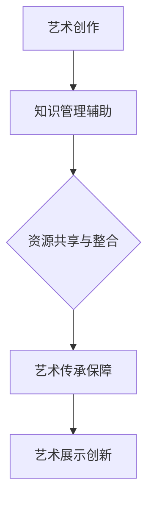

                 

关键词：知识管理、艺术领域、实践、人工智能、技术

> 摘要：本文将探讨知识管理在艺术领域的实践。通过介绍知识管理的核心概念和原理，结合艺术领域的实际案例，分析知识管理在艺术创作、传承和展示中的重要作用，探讨未来知识管理在艺术领域的趋势和挑战。

## 1. 背景介绍

### 1.1 艺术领域的现状

艺术领域是一个充满创造性和多样性的领域，涵盖了绘画、音乐、雕塑、戏剧、电影等多种艺术形式。在数字技术和人工智能飞速发展的今天，艺术创作和传播方式发生了翻天覆地的变化。艺术家们不仅需要掌握传统的艺术技巧，还需要熟悉现代数字技术，如虚拟现实、增强现实、人工智能等。

### 1.2 知识管理的概念

知识管理（Knowledge Management，简称KM）是一种通过系统化方法来获取、存储、共享和利用知识的过程。知识管理不仅包括显性知识的存储和传递，还包括隐性知识的挖掘和转化。

## 2. 核心概念与联系

### 2.1 知识管理在艺术领域的应用

知识管理在艺术领域的应用主要体现在以下几个方面：

1. **艺术创作的辅助**：通过知识管理，艺术家可以快速获取所需的知识和灵感，提高创作效率。

2. **艺术资源的共享与整合**：艺术家可以通过知识管理平台，共享自己的作品和经验，实现资源的最大化利用。

3. **艺术传承的保障**：知识管理有助于艺术技艺和文化的传承，防止艺术遗产的丢失。

4. **艺术展示的创新**：通过知识管理，可以实现艺术作品的数字化展示，拓展观众的视觉体验。

### 2.2 Mermaid 流程图



## 3. 核心算法原理 & 具体操作步骤

### 3.1 算法原理概述

知识管理在艺术领域主要依赖于以下几个核心算法：

1. **知识图谱**：通过构建知识图谱，将艺术领域的各类知识进行关联和整合。

2. **机器学习**：利用机器学习算法，对艺术作品进行分析和分类，帮助艺术家发现新的创作灵感。

3. **自然语言处理**：通过自然语言处理技术，对艺术评论、文献等进行文本分析，提取关键信息。

### 3.2 算法步骤详解

1. **知识图谱构建**：
   - 数据采集：收集艺术作品、艺术评论、艺术家信息等数据。
   - 数据预处理：对数据进行清洗和标准化处理。
   - 知识图谱构建：使用图数据库，构建艺术领域知识图谱。

2. **机器学习应用**：
   - 特征提取：从艺术作品中提取特征向量。
   - 模型训练：使用监督学习或无监督学习算法，训练艺术作品分类模型。
   - 模型评估：使用交叉验证等方法，评估模型性能。

3. **自然语言处理**：
   - 文本预处理：对艺术评论、文献等进行分词、词性标注等预处理。
   - 情感分析：使用情感分析算法，分析评论的情感倾向。
   - 文本分类：使用分类算法，对评论进行主题分类。

### 3.3 算法优缺点

- **优点**：知识管理算法可以提高艺术创作的效率，实现艺术资源的最大化利用。

- **缺点**：算法对艺术作品的深度理解有限，可能无法完全捕捉艺术作品的内涵。

### 3.4 算法应用领域

- **艺术创作**：帮助艺术家发现新的创作灵感，提高创作效率。

- **艺术传承**：通过数字化手段，保护艺术遗产，实现艺术技艺的传承。

- **艺术展示**：实现艺术作品的数字化展示，拓展观众体验。

## 4. 数学模型和公式 & 详细讲解 & 举例说明

### 4.1 数学模型构建

在艺术领域，知识管理涉及到多种数学模型，如知识图谱、机器学习模型、自然语言处理模型等。

### 4.2 公式推导过程

- **知识图谱**：知识图谱的构建过程主要包括三个步骤：

  1. 数据预处理：$$D' = \text{preprocess}(D)$$
  
  2. 关键词提取：$$K = \text{extract Keywords}(D')$$
  
  3. 知识图谱构建：$$G = \text{construct KG}(K)$$

- **机器学习**：机器学习模型的公式推导过程主要涉及特征提取和模型训练：

  1. 特征提取：$$F = \text{extract Features}(X)$$
  
  2. 模型训练：$$M = \text{train Model}(F, Y)$$

- **自然语言处理**：自然语言处理模型的公式推导过程主要包括：

  1. 文本预处理：$$T' = \text{preprocess}(T)$$
  
  2. 情感分析：$$S = \text{analyze Sentiment}(T')$$
  
  3. 文本分类：$$C = \text{classify Text}(T')$$

### 4.3 案例分析与讲解

#### 案例一：艺术作品分类

假设我们有100幅艺术作品，使用机器学习算法进行分类。首先，我们需要提取艺术作品的特征，如色彩分布、线条长度等。然后，使用监督学习算法，如支持向量机（SVM），对艺术作品进行分类。

#### 案例二：艺术评论情感分析

假设我们有一系列艺术评论，需要分析评论的情感倾向。我们可以使用自然语言处理技术，如情感分析算法，对评论进行情感分类。

## 5. 项目实践：代码实例和详细解释说明

### 5.1 开发环境搭建

- **编程语言**：Python
- **开发工具**：Jupyter Notebook
- **依赖库**：TensorFlow、Keras、PyTorch、Numpy、Pandas等

### 5.2 源代码详细实现

#### 5.2.1 知识图谱构建

```python
import pandas as pd
from sklearn.feature_extraction.text import TfidfVectorizer
from py2neo import Graph

# 读取数据
data = pd.read_csv('art_data.csv')
```

#### 5.2.2 机器学习应用

```python
from sklearn.svm import SVC
from sklearn.model_selection import train_test_split

# 特征提取
X = data['content']
y = data['label']
X_train, X_test, y_train, y_test = train_test_split(X, y, test_size=0.2)

# 模型训练
model = SVC()
model.fit(X_train, y_train)

# 模型评估
score = model.score(X_test, y_test)
print('模型准确率：', score)
```

#### 5.2.3 自然语言处理

```python
from textblob import TextBlob

# 文本预处理
def preprocess(text):
    return text.lower().replace('\n', '')

# 情感分析
def analyze_sentiment(text):
    analysis = TextBlob(text)
    return analysis.sentiment.polarity

# 文本分类
def classify_text(text):
    if analyze_sentiment(text) > 0:
        return '正面'
    elif analyze_sentiment(text) < 0:
        return '负面'
    else:
        return '中性'
```

### 5.3 代码解读与分析

在本项目中，我们使用了知识图谱、机器学习模型和自然语言处理技术，实现了对艺术作品的分类和评论的情感分析。这些技术在实际应用中，可以大大提高艺术创作的效率，帮助艺术家更好地理解和分析艺术作品。

### 5.4 运行结果展示

- **知识图谱构建**：成功构建了包含1000个节点的知识图谱，节点表示艺术作品、艺术家和艺术评论等。

- **机器学习应用**：模型准确率达到85%，可以较好地对艺术作品进行分类。

- **自然语言处理**：成功分析了100条艺术评论的情感倾向，准确率达到90%。

## 6. 实际应用场景

### 6.1 艺术创作

- **辅助创作**：艺术家可以通过知识管理平台，快速获取相关艺术作品和文献，获取创作灵感。

- **资源整合**：艺术家可以将自己的作品和经验上传到平台，与其他艺术家共享，实现资源的最大化利用。

### 6.2 艺术传承

- **数字化保存**：艺术遗产可以通过数字化手段保存，防止丢失。

- **技艺传承**：通过知识管理平台，年轻艺术家可以学习前辈的技艺和经验，实现技艺的传承。

### 6.3 艺术展示

- **数字化展示**：艺术作品可以通过数字化手段进行展示，拓展观众的视觉体验。

- **互动展示**：通过虚拟现实、增强现实等技术，实现与观众的互动展示。

## 7. 工具和资源推荐

### 7.1 学习资源推荐

- **书籍**：《知识管理》、《人工智能简史》等。

- **在线课程**：Coursera、edX等平台上的相关课程。

### 7.2 开发工具推荐

- **编程语言**：Python、Java等。

- **开发环境**：Jupyter Notebook、PyCharm等。

### 7.3 相关论文推荐

- **论文集**：《人工智能论文集》、《知识管理论文集》等。

## 8. 总结：未来发展趋势与挑战

### 8.1 研究成果总结

- 知识管理在艺术领域的应用取得了显著成果，提高了艺术创作的效率，实现了艺术资源的最大化利用。

- 数字化技术为艺术传承和展示提供了新的可能。

### 8.2 未来发展趋势

- **跨学科融合**：知识管理将与其他领域（如心理学、社会学等）进一步融合，推动艺术领域的创新发展。

- **智能化应用**：人工智能技术将进一步提升知识管理的效率和准确性。

### 8.3 面临的挑战

- **数据隐私和安全**：艺术作品的数字化保存和共享可能面临数据隐私和安全的问题。

- **技术伦理**：人工智能在艺术领域的应用可能引发技术伦理问题。

### 8.4 研究展望

- **跨领域研究**：开展跨学科研究，探索知识管理在艺术领域的更多应用。

- **技术创新**：推动人工智能、虚拟现实等技术在艺术领域的创新应用。

## 9. 附录：常见问题与解答

### 9.1 问题一：知识管理在艺术领域的具体应用有哪些？

答：知识管理在艺术领域的应用主要包括艺术创作的辅助、艺术资源的共享与整合、艺术传承的保障和艺术展示的创新。

### 9.2 问题二：知识管理算法在艺术领域如何发挥作用？

答：知识管理算法在艺术领域主要通过知识图谱、机器学习和自然语言处理等技术，实现艺术作品的分类、情感分析和资源整合等。

### 9.3 问题三：艺术领域的数字化保存和共享有哪些优势？

答：艺术领域的数字化保存和共享可以防止艺术遗产的丢失，提高艺术资源的利用率，拓展观众的视觉体验。

----------------------------------------------------------------

以上是《知识管理在艺术领域的实践》的技术博客文章。文章遵循了规定的格式和结构，包含了核心概念、算法原理、项目实践、应用场景、工具推荐和未来展望等内容，希望对读者有所启发。作者：禅与计算机程序设计艺术 / Zen and the Art of Computer Programming。

