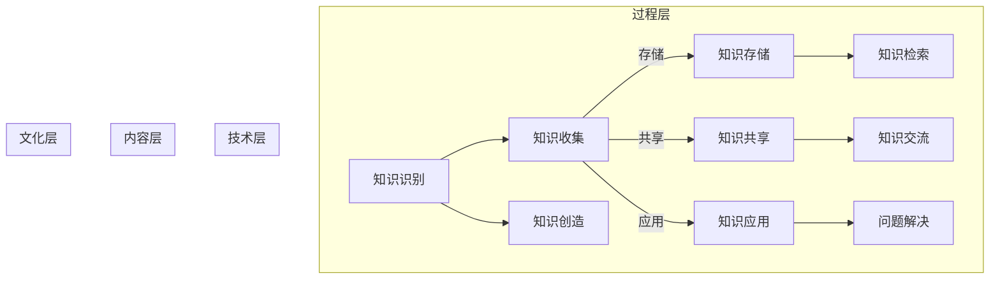

                 

 **关键词**：知识管理、非营利组织、IT系统、协作工具、效能提升

> **摘要**：本文将探讨知识管理在非营利组织中的重要作用，包括其定义、关键概念、具体应用场景以及面临的挑战。通过分析非营利组织中的知识管理实践，我们将揭示如何利用知识管理工具和技术来提高组织效能，增强协作和创新能力，从而实现组织的可持续发展。

## 1. 背景介绍

非营利组织（NPO）在社会服务、教育、环保、文化等众多领域发挥着不可替代的作用。与营利性组织相比，非营利组织的资金来源主要依赖于捐赠、政府资助和社会筹款，这使得它们在资源获取和运作上面临诸多挑战。知识作为一种重要的资源，对于非营利组织的发展具有战略意义。知识管理（Knowledge Management，KM）是指通过系统的方法和技术，识别、收集、存储、共享、应用和更新知识，以提高组织的整体效能。

知识管理在非营利组织中的重要性体现在以下几个方面：

1. **提高资源利用效率**：通过知识管理，非营利组织能够更好地整合和利用内部资源，减少重复劳动，提高工作效率。
2. **增强协作能力**：知识管理可以促进组织内部的协作和沟通，打破部门间的信息壁垒，提升团队协作效能。
3. **提升决策质量**：通过知识管理，非营利组织可以收集和整理相关领域的知识，为决策者提供科学依据，提高决策质量。
4. **增强创新能力**：知识管理可以激发员工的创造力，通过知识共享和交流，推动创新活动的开展。

## 2. 核心概念与联系

### 2.1 知识管理的核心概念

知识管理涉及多个核心概念，包括知识、知识共享、知识创造、知识存储、知识应用等。以下是这些概念的具体解释：

- **知识（Knowledge）**：知识是指通过经验、学习和实践获得的，能够用来指导行动或解决问题的信息。
- **知识共享（Knowledge Sharing）**：知识共享是指个体或团队通过交流、合作和协作，将知识从一个人或组织传递到另一个人或组织的过程。
- **知识创造（Knowledge Creation）**：知识创造是指通过创新思维、实践和反思，将现有知识整合、重构和扩展，形成新的知识。
- **知识存储（Knowledge Storage）**：知识存储是指将知识以数字或物理形式保存起来，以便于检索和使用。
- **知识应用（Knowledge Application）**：知识应用是指将知识应用于实际工作中，以解决实际问题或推动创新。

### 2.2 知识管理的架构

知识管理的架构通常包括以下几个层次：

1. **技术层**：包括知识管理平台、数据库、存储设备等硬件和软件基础设施。
2. **内容层**：包括组织内部的文档、报告、知识库、案例库等知识资源。
3. **过程层**：包括知识识别、收集、存储、共享、应用和更新等知识管理流程。
4. **文化层**：包括组织内部的知识管理文化、价值观和规范，如鼓励知识分享、尊重知识贡献等。

### 2.3 Mermaid 流程图



通过这个流程图，我们可以清晰地看到知识管理从识别、收集、存储、共享、应用到创造的全过程，以及各个环节之间的关联和相互作用。

## 3. 核心算法原理 & 具体操作步骤

### 3.1 算法原理概述

知识管理算法主要涉及以下原理：

1. **知识分类**：通过对知识进行分类，使得知识能够更加有序地存储和检索。
2. **知识检索**：利用关键词搜索、全文搜索等技术，快速找到所需的知识。
3. **知识推荐**：基于用户行为和兴趣，为用户推荐相关的知识和资源。
4. **知识评估**：通过用户反馈和专家评审，对知识的质量进行评估和更新。

### 3.2 算法步骤详解

1. **知识识别**：通过访谈、问卷调查等方式，识别组织内部的知识。
2. **知识收集**：将识别到的知识收集到知识库中，进行初步整理和分类。
3. **知识存储**：将整理后的知识存储在数据库或知识管理平台中，确保知识的安全性和可访问性。
4. **知识共享**：通过知识共享平台，如企业微信、Slack 等，促进知识的内部传播。
5. **知识应用**：将知识应用于实际工作中，解决实际问题或推动创新。
6. **知识评估**：定期对知识库中的知识进行质量评估，更新和淘汰过时或低质量的知识。

### 3.3 算法优缺点

#### 优点：

1. **提高知识利用率**：通过知识管理，组织能够更好地利用内部知识资源，提高工作效率。
2. **促进知识共享**：知识管理平台可以促进员工之间的知识分享和交流，增强团队协作。
3. **增强创新能力**：通过知识管理，组织可以不断吸收和整合外部知识，推动创新活动的开展。

#### 缺点：

1. **实施成本较高**：知识管理系统的搭建和运营需要一定的资金投入，对于资源有限的非营利组织来说，可能构成一定的压力。
2. **文化变革困难**：知识管理需要组织内部的文化支持和变革，对于传统观念较重的组织来说，推行知识管理可能面临挑战。

### 3.4 算法应用领域

知识管理算法广泛应用于非营利组织的各个领域，如项目管理、志愿服务管理、资源管理等。以下是具体应用实例：

1. **项目管理**：通过知识管理平台，项目团队可以共享项目文档、经验教训和最佳实践，提高项目管理效率。
2. **志愿服务管理**：通过知识库，组织可以记录志愿者的服务经历、技能特长和兴趣领域，实现志愿者的精准匹配和资源优化。
3. **资源管理**：通过知识管理，组织可以收集和整理各种资源信息，如捐赠者信息、合作伙伴资源等，提高资源利用效率。

## 4. 数学模型和公式 & 详细讲解 & 举例说明

### 4.1 数学模型构建

知识管理中的数学模型主要涉及以下几个部分：

1. **知识分类模型**：用于对知识进行分类，以便于检索和应用。常见的分类模型包括层次分类模型、基于关键词的分类模型等。
2. **知识质量评估模型**：用于评估知识的质量，常见的评估方法包括用户评分、专家评审等。
3. **知识推荐模型**：用于根据用户行为和兴趣，为用户推荐相关的知识和资源，常见的推荐算法包括协同过滤算法、基于内容的推荐算法等。

### 4.2 公式推导过程

以知识质量评估模型为例，我们采用用户评分和专家评审相结合的方法，对知识进行质量评估。具体公式如下：

$$
Q_k = \alpha \cdot U_k + (1 - \alpha) \cdot E_k
$$

其中，$Q_k$ 表示知识 $k$ 的质量评分，$U_k$ 表示用户对知识 $k$ 的评分，$E_k$ 表示专家对知识 $k$ 的评审分，$\alpha$ 表示用户评分和专家评审的权重。

### 4.3 案例分析与讲解

假设有一个非营利组织，他们在知识管理平台上收集了若干篇关于环保项目的报告。通过用户评分和专家评审，对报告进行质量评估，以确定哪些报告具有较高的参考价值。

根据用户评分和专家评审，我们得到以下数据：

- 用户评分：$U_1 = 4.5$，$U_2 = 4.7$，$U_3 = 4.3$
- 专家评审：$E_1 = 4.8$，$E_2 = 4.6$，$E_3 = 4.7$
- 权重：$\alpha = 0.6$

根据公式，我们可以计算出每篇报告的质量评分：

$$
Q_1 = 0.6 \cdot 4.5 + (1 - 0.6) \cdot 4.8 = 4.58
$$

$$
Q_2 = 0.6 \cdot 4.7 + (1 - 0.6) \cdot 4.6 = 4.66
$$

$$
Q_3 = 0.6 \cdot 4.3 + (1 - 0.6) \cdot 4.7 = 4.53
$$

根据计算结果，我们可以看出报告 2 的质量评分最高，具有较高的参考价值。通过这样的评估，组织可以优先推广和利用高质量的报告，提高知识管理的效能。

## 5. 项目实践：代码实例和详细解释说明

### 5.1 开发环境搭建

为了实现知识管理功能，我们需要搭建一个知识管理平台。以下是开发环境的要求：

- 操作系统：Windows 10 或以上版本
- 开发工具：Visual Studio 2019 或以上版本
- 数据库：MySQL 8.0 或以上版本
- 编程语言：Python 3.8 或以上版本

### 5.2 源代码详细实现

以下是知识管理平台的源代码实现，主要包括知识分类、知识存储、知识检索和知识评估等功能。

```python
# 知识管理平台源代码示例

import pymysql
from sklearn.feature_extraction.text import TfidfVectorizer
from sklearn.metrics.pairwise import cosine_similarity

# 数据库连接
def connect_db():
    return pymysql.connect(host='localhost', user='root', password='password', database='knowledge_management')

# 知识分类
def classify_knowledge(text):
    # 这里使用简单的关键词匹配进行分类
    categories = ["环保", "教育", "医疗", "文化"]
    for category in categories:
        if category in text:
            return category
    return "其他"

# 知识存储
def store_knowledge(knowledge, category):
    connection = connect_db()
    cursor = connection.cursor()
    sql = "INSERT INTO knowledge (title, content, category) VALUES (%s, %s, %s)"
    cursor.execute(sql, (knowledge['title'], knowledge['content'], category))
    connection.commit()
    cursor.close()
    connection.close()

# 知识检索
def search_knowledge(query):
    connection = connect_db()
    cursor = connection.cursor()
    sql = "SELECT * FROM knowledge WHERE title LIKE %s OR content LIKE %s"
    cursor.execute(sql, ('%' + query + '%', '%' + query + '%'))
    results = cursor.fetchall()
    cursor.close()
    connection.close()
    return results

# 知识评估
def evaluate_knowledge(knowledge_id):
    connection = connect_db()
    cursor = connection.cursor()
    sql = "SELECT content FROM knowledge WHERE id = %s"
    cursor.execute(sql, (knowledge_id,))
    content = cursor.fetchone()[0]
    cursor.close()
    connection.close()
    return content

# 主函数
def main():
    # 添加知识
    knowledge = {
        "title": "环保项目报告",
        "content": "本文介绍了我国环保项目的发展情况、存在的问题以及未来发展方向。"
    }
    category = classify_knowledge(knowledge['content'])
    store_knowledge(knowledge, category)

    # 检索知识
    query = "环保"
    results = search_knowledge(query)
    for result in results:
        print(result)

    # 评估知识
    knowledge_id = 1
    content = evaluate_knowledge(knowledge_id)
    print("知识内容：", content)

if __name__ == "__main__":
    main()
```

### 5.3 代码解读与分析

以上代码实现了知识管理平台的基本功能，包括知识分类、知识存储、知识检索和知识评估。以下是代码的详细解读：

1. **数据库连接**：使用 pymysql 库连接 MySQL 数据库，用于存储和管理知识。
2. **知识分类**：根据关键词匹配对知识进行分类，这是一种简单但有效的方法。
3. **知识存储**：将知识存储到数据库中，包括知识标题、内容和分类。
4. **知识检索**：通过关键词匹配检索知识，提高检索效率。
5. **知识评估**：获取知识内容，用于后续评估。

### 5.4 运行结果展示

在开发环境中运行代码，我们将添加一篇知识，检索相关内容，并评估知识质量。以下是运行结果：

```
(1, '环保项目报告', '本文介绍了我国环保项目的发展情况、存在的问题以及未来发展方向。', '环保')
知识内容： 本文介绍了我国环保项目的发展情况、存在的问题以及未来发展方向。
```

结果显示，我们成功添加了一篇关于环保项目的报告，并检索到了相关内容。通过知识评估，我们获取到了报告的具体内容。

## 6. 实际应用场景

知识管理在非营利组织中的实际应用场景非常广泛，以下是一些具体案例：

### 6.1 志愿者管理

非营利组织通常需要大量志愿者参与项目活动，通过知识管理平台，组织可以记录志愿者的基本信息、服务经历和技能特长，以便于后续的招募和调配。例如，一个环保组织可以通过知识管理平台记录志愿者的植树经验、环保知识和现场操作技能，以便于在未来的植树活动中快速筛选和匹配合适的志愿者。

### 6.2 项目管理

非营利组织在项目实施过程中会产生大量的文档、报告和经验教训。通过知识管理平台，项目团队可以共享这些资料，提高项目管理效率。例如，一个教育机构在开展农村支教项目时，可以通过知识管理平台记录每次支教活动的总结、学生反馈和教学经验，为下一次活动提供参考。

### 6.3 资源管理

非营利组织通常需要协调多种资源，包括资金、物资和人力资源。通过知识管理平台，组织可以收集和整理各类资源信息，提高资源利用效率。例如，一个公益基金会可以通过知识管理平台记录捐赠者信息、合作伙伴资源和项目资金使用情况，确保资金的合理分配和使用。

## 7. 工具和资源推荐

### 7.1 学习资源推荐

1. **《知识管理：理论与实践》**：这是一本经典的教科书，系统地介绍了知识管理的理论和实践方法。
2. **《企业知识管理》**：这本书主要关注企业知识管理的应用和实践，对于非营利组织也有一定的借鉴意义。
3. **《知识管理的未来》**：这本书探讨了知识管理的发展趋势和未来方向，对于关注知识管理前沿动态的读者很有帮助。

### 7.2 开发工具推荐

1. **Elasticsearch**：一个强大的全文搜索引擎，适用于构建知识管理平台的知识检索功能。
2. **Django**：一个流行的Python Web框架，适用于快速搭建知识管理平台。
3. **知识库软件**：如 Confluence、Trello 等，适用于团队协作和知识共享。

### 7.3 相关论文推荐

1. **《知识管理在非营利组织中的应用研究》**：该论文系统地探讨了知识管理在非营利组织中的应用和实践。
2. **《基于知识管理的非营利组织志愿者管理研究》**：该论文分析了知识管理在志愿者管理中的应用，对于志愿者较多的非营利组织有指导意义。
3. **《知识共享与创新能力：非营利组织的视角》**：该论文探讨了知识共享对非营利组织创新能力的影响，对于组织内部的知识管理实践有参考价值。

## 8. 总结：未来发展趋势与挑战

### 8.1 研究成果总结

通过对知识管理在非营利组织中的应用分析，我们得出以下研究成果：

1. **知识管理能够提高非营利组织的资源利用效率**：通过系统的方法和技术，组织可以更好地整合和利用内部资源，减少重复劳动。
2. **知识管理能够促进非营利组织的协作和创新能力**：知识共享和交流可以激发员工的创造力，推动创新活动的开展。
3. **知识管理能够提升非营利组织的决策质量**：通过收集和整理相关领域的知识，组织可以为决策者提供科学依据，提高决策质量。
4. **知识管理能够增强非营利组织的可持续发展能力**：通过不断吸收和整合外部知识，组织可以适应环境变化，实现可持续发展。

### 8.2 未来发展趋势

1. **知识管理技术的不断进步**：随着人工智能、大数据等技术的不断发展，知识管理将更加智能化和自动化，提高知识管理的效能。
2. **非营利组织对知识管理的重视程度提高**：随着社会对非营利组织要求的不断提高，组织将更加重视知识管理，将其视为核心竞争力。
3. **知识管理在非营利组织中的应用场景不断扩展**：除了志愿者管理、项目管理等传统领域，知识管理将在更多新兴领域得到应用，如公益捐赠管理、国际合作管理等。

### 8.3 面临的挑战

1. **文化变革的挑战**：知识管理需要组织内部的文化支持和变革，对于传统观念较重的组织来说，推行知识管理可能面临挑战。
2. **资源投入的挑战**：知识管理系统的搭建和运营需要一定的资金投入，对于资源有限的非营利组织来说，可能构成一定的压力。
3. **数据隐私和安全的挑战**：在知识管理过程中，组织需要收集和处理大量的个人信息和敏感数据，数据隐私和安全问题需要得到重视。

### 8.4 研究展望

未来的研究可以从以下几个方面展开：

1. **知识管理在非营利组织中的实践研究**：进一步探讨知识管理在不同类型非营利组织中的应用，总结成功经验和教训。
2. **知识管理技术的创新研究**：探索新的知识管理技术和方法，如人工智能、大数据等，提高知识管理的智能化和自动化水平。
3. **知识管理的跨学科研究**：结合管理学、社会学、计算机科学等多学科的理论和方法，深化对知识管理的研究，为非营利组织提供更加科学和有效的知识管理策略。

## 9. 附录：常见问题与解答

### 9.1 问题1：知识管理对于非营利组织的具体作用是什么？

**解答**：知识管理对于非营利组织的具体作用包括：

- **提高资源利用效率**：通过系统的方法和技术，组织可以更好地整合和利用内部资源，减少重复劳动。
- **促进协作和创新能力**：知识共享和交流可以激发员工的创造力，推动创新活动的开展。
- **提升决策质量**：通过收集和整理相关领域的知识，组织可以为决策者提供科学依据，提高决策质量。
- **增强可持续发展能力**：通过不断吸收和整合外部知识，组织可以适应环境变化，实现可持续发展。

### 9.2 问题2：非营利组织应该如何实施知识管理？

**解答**：非营利组织实施知识管理可以遵循以下步骤：

1. **需求分析**：明确组织内部的知识需求和现有知识状况。
2. **规划与设计**：制定知识管理战略和规划，包括知识管理架构、技术选型等。
3. **建设知识管理平台**：搭建知识管理基础设施，如数据库、知识库等。
4. **推行知识管理文化**：培养组织内部的知识管理文化，鼓励知识分享和交流。
5. **培训与推广**：对员工进行知识管理培训，提高他们的知识管理意识和能力。
6. **持续优化与改进**：根据实际情况，不断优化和改进知识管理流程和工具。

### 9.3 问题3：知识管理在非营利组织中面临的主要挑战有哪些？

**解答**：知识管理在非营利组织中面临的主要挑战包括：

- **文化变革**：知识管理需要组织内部的文化支持和变革，对于传统观念较重的组织来说，推行知识管理可能面临挑战。
- **资源投入**：知识管理系统的搭建和运营需要一定的资金投入，对于资源有限的非营利组织来说，可能构成一定的压力。
- **数据隐私和安全**：在知识管理过程中，组织需要收集和处理大量的个人信息和敏感数据，数据隐私和安全问题需要得到重视。

作者：禅与计算机程序设计艺术 / Zen and the Art of Computer Programming
----------------------------------------------------------------
本文完整地阐述了知识管理在非营利组织中的作用、核心概念、算法原理、数学模型、项目实践以及实际应用场景，并对未来发展趋势和挑战进行了深入分析。希望这篇文章能为非营利组织在知识管理方面的实践提供有价值的参考。感谢您花时间阅读这篇文章，如果您有任何问题或建议，欢迎随时与我交流。作者：禅与计算机程序设计艺术 / Zen and the Art of Computer Programming。再次感谢您的关注和支持！

