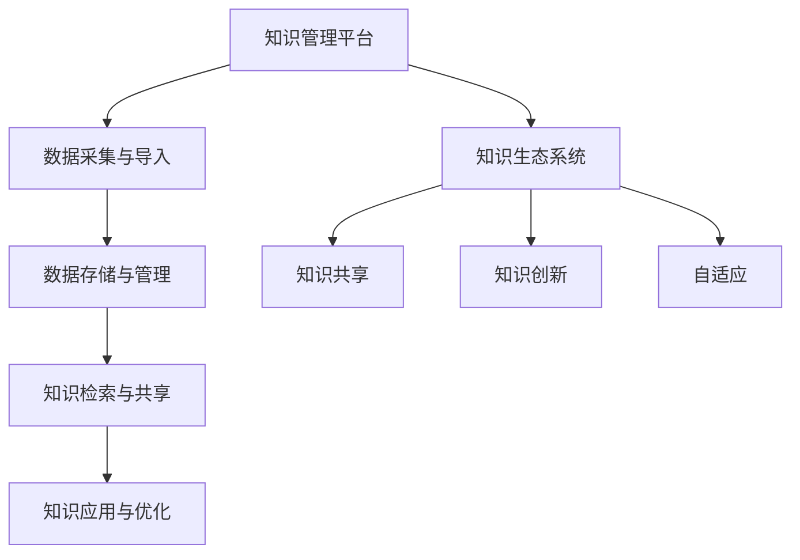

                 

关键词：知识管理、知识生态系统、平台架构、数据处理、人工智能

> 摘要：本文将探讨知识管理平台在构建知识生态系统中的重要性，分析其核心概念、架构设计、算法原理、数学模型、项目实践以及未来展望。通过详细阐述知识管理平台的构建过程，为企业和组织提供有效的知识管理和共享解决方案。

## 1. 背景介绍

在信息化时代，数据和信息已经成为企业的重要资产。然而，如何有效地管理和利用这些数据，成为企业和组织面临的重要问题。知识管理平台作为一种新型信息化工具，旨在将分散的数据和知识资源整合起来，提供高效的知识共享、检索和使用环境。

知识管理平台的起源可以追溯到20世纪80年代，当时企业开始意识到知识作为一种战略资源的重要性。随着互联网和人工智能技术的不断发展，知识管理平台逐渐从简单的文档管理系统演变成一个复杂的信息生态系统，涵盖了数据采集、存储、处理、共享和应用的各个环节。

在现代企业中，知识管理平台已经成为提高工作效率、增强竞争力的重要手段。然而，构建一个高效的知识管理平台并非易事，需要深入理解知识生态系统的构建原理，掌握核心算法和数学模型，同时结合项目实践进行优化和改进。

## 2. 核心概念与联系

### 2.1 知识管理平台

知识管理平台是一个集成化系统，旨在将组织内部和外部知识资源进行整合、存储、管理和共享。其主要功能包括：

- 数据采集与导入：从各种数据源（如文档、数据库、社交媒体等）中获取知识。
- 数据存储与管理：对采集到的数据进行分类、标签化、版本控制和权限管理。
- 知识检索与共享：提供高效的知识检索和共享机制，使用户能够快速找到所需知识。
- 知识应用与优化：支持知识在不同业务场景中的应用，通过反馈机制不断优化知识库。

### 2.2 知识生态系统

知识生态系统是指一个由知识管理平台、知识用户、知识源和知识流动组成的动态网络。其主要特点包括：

- 知识共享：鼓励知识用户之间的交流和协作，促进知识的共享和传播。
- 知识创新：通过知识整合和创新，不断产生新的知识和价值。
- 自适应：知识生态系统具有自我调节和适应环境变化的能力。

### 2.3 知识管理平台与知识生态系统的联系

知识管理平台是知识生态系统的基础设施，为知识流动和共享提供了技术支持。同时，知识生态系统为知识管理平台提供了实际应用场景和反馈，指导平台功能的优化和改进。

### 2.4 Mermaid 流程图



## 3. 核心算法原理 & 具体操作步骤

### 3.1 算法原理概述

知识管理平台的核心算法主要包括知识抽取、知识融合、知识检索和知识优化等。以下是这些算法的基本原理：

- 知识抽取：从原始数据中提取出结构化的知识，例如关系抽取、实体抽取和事件抽取。
- 知识融合：将不同来源的知识进行整合，解决数据冗余和冲突问题。
- 知识检索：根据用户需求快速定位和检索相关知识。
- 知识优化：通过用户反馈和人工智能技术，不断优化知识库的质量和准确性。

### 3.2 算法步骤详解

#### 3.2.1 知识抽取

1. 数据预处理：对原始数据进行清洗、去噪和格式化。
2. 关系抽取：利用自然语言处理技术（如命名实体识别、句法分析等）提取出实体间的关系。
3. 实体抽取：从文本中识别出关键实体，如人名、地名、组织名等。
4. 事件抽取：识别出文本中的事件，如会议、交易、冲突等。

#### 3.2.2 知识融合

1. 数据对齐：将不同数据源中的实体进行匹配和对应。
2. 冲突检测：识别出数据中的不一致和冲突，如实体名称相同但实际代表不同对象。
3. 知识融合：根据规则和算法，将冲突的数据进行融合和整合。

#### 3.2.3 知识检索

1. 检索算法：采用信息检索算法（如向量空间模型、PageRank算法等）对知识库进行索引和检索。
2. 检索结果排序：根据相关性、重要性等指标对检索结果进行排序。
3. 用户反馈：收集用户对检索结果的反馈，不断优化检索算法。

#### 3.2.4 知识优化

1. 用户反馈：收集用户对知识库的反馈，如正确性、实用性等。
2. 机器学习：利用机器学习技术，对知识库进行优化和调整。
3. 知识更新：根据用户反馈和外部数据，定期更新知识库。

### 3.3 算法优缺点

#### 3.3.1 知识抽取

- 优点：能够从大量原始数据中提取出结构化的知识，提高数据利用效率。
- 缺点：对原始数据质量要求较高，否则抽取结果可能不准确。

#### 3.3.2 知识融合

- 优点：解决了数据冗余和冲突问题，提高了知识库的完整性。
- 缺点：融合算法复杂，计算成本较高。

#### 3.3.3 知识检索

- 优点：提供了快速、准确的知识检索功能，满足用户需求。
- 缺点：检索结果可能受到算法和用户反馈的限制。

#### 3.3.4 知识优化

- 优点：通过用户反馈和机器学习，不断提高知识库的质量和准确性。
- 缺点：优化过程需要大量计算资源，且优化效果可能有限。

### 3.4 算法应用领域

知识管理平台的核心算法在多个领域具有广泛的应用：

- 金融行业：用于处理海量金融数据，提取关键信息，支持风险控制和投资决策。
- 医疗领域：从医疗数据中提取诊断信息、药物关系等，辅助医生进行诊断和治疗。
- 教育行业：构建教育知识库，提供个性化学习推荐和教学资源。
- 企业管理：支持企业内部知识共享和协作，提高工作效率。

## 4. 数学模型和公式 & 详细讲解 & 举例说明

### 4.1 数学模型构建

知识管理平台的构建涉及多个数学模型，包括信息检索模型、知识融合模型和机器学习模型。以下是这些模型的基本构建过程：

#### 4.1.1 信息检索模型

信息检索模型主要用于知识检索环节，常用的模型包括：

- **向量空间模型**：将文本表示为向量，通过计算向量之间的余弦相似度实现检索。
- **PageRank模型**：基于网页链接关系，计算网页的重要性，用于排序和推荐。

#### 4.1.2 知识融合模型

知识融合模型用于处理不同数据源中的知识冲突和冗余，常用的模型包括：

- **模糊集合模型**：通过模糊逻辑处理不确定性和模糊性。
- **加权平均模型**：根据数据源的重要性和可信度，对知识进行加权融合。

#### 4.1.3 机器学习模型

机器学习模型用于知识优化环节，包括：

- **分类模型**：如决策树、支持向量机等，用于分类和预测。
- **聚类模型**：如K-means、层次聚类等，用于数据分组和聚类分析。

### 4.2 公式推导过程

#### 4.2.1 向量空间模型

假设有两个文本 $T_1$ 和 $T_2$，分别表示为向量 $\vec{v_1}$ 和 $\vec{v_2}$，则它们的余弦相似度计算公式为：

$$
\cos(\theta) = \frac{\vec{v_1} \cdot \vec{v_2}}{|\vec{v_1}| |\vec{v_2}|}
$$

其中，$ \vec{v_1} \cdot \vec{v_2}$ 表示向量的点积，$|\vec{v_1}|$ 和 $|\vec{v_2}|$ 分别表示向量的模。

#### 4.2.2 PageRank模型

PageRank是一种基于网页链接关系的排序算法，其核心思想是网页的重要性取决于链接到该网页的其他网页的重要性。PageRank的迭代计算公式为：

$$
\text{Rank}(v) = (\alpha) \text{Rank}(\text{out-links}(v)) + (\beta) \text{Rank}(\text{in-links}(v))
$$

其中，$\text{out-links}(v)$ 表示从网页 $v$ 出发的链接集合，$\text{in-links}(v)$ 表示指向网页 $v$ 的链接集合，$\alpha$ 和 $\beta$ 分别表示网页内部的转移概率和网页之间的转移概率。

### 4.3 案例分析与讲解

#### 4.3.1 金融数据分析

假设有两个金融数据集 $D_1$ 和 $D_2$，包含股票价格、交易量、市盈率等指标。我们需要提取出这两个数据集之间的关系，以便进行投资决策。

1. 数据预处理：对 $D_1$ 和 $D_2$ 进行清洗、去噪和格式化。
2. 知识抽取：使用向量空间模型，将 $D_1$ 和 $D_2$ 表示为向量 $\vec{v_1}$ 和 $\vec{v_2}$。
3. 知识融合：计算 $\vec{v_1}$ 和 $\vec{v_2}$ 的余弦相似度，得到它们之间的相似度得分。
4. 知识优化：根据用户反馈，不断调整向量表示和融合规则，提高相似度得分。

#### 4.3.2 医疗数据挖掘

假设有一个医疗数据集 $D$，包含患者的诊断信息、治疗方案和预后结果。我们需要从中提取出关键信息，以支持医生进行诊断和治疗。

1. 数据预处理：对 $D$ 进行清洗、去噪和格式化。
2. 知识抽取：使用知识抽取算法，从 $D$ 中提取出诊断信息、治疗方案和预后结果。
3. 知识融合：利用模糊集合模型，处理诊断信息、治疗方案和预后结果之间的模糊性和不确定性。
4. 知识优化：根据医生反馈，不断调整知识抽取和融合规则，提高诊断和治疗建议的准确性。

## 5. 项目实践：代码实例和详细解释说明

### 5.1 开发环境搭建

为了构建一个知识管理平台，我们需要搭建一个合适的技术栈。以下是开发环境搭建的步骤：

1. 操作系统：Linux（推荐 Ubuntu 20.04）
2. 编程语言：Python 3.8
3. 数据库：MySQL 5.7
4. 开发框架：Django 3.2
5. 自然语言处理库：NLTK、spaCy
6. 机器学习库：scikit-learn、TensorFlow

### 5.2 源代码详细实现

以下是知识管理平台的核心功能模块的源代码实现：

#### 5.2.1 数据采集与导入

```python
import os
import csv
from django.db import models

class Data(models.Model):
    name = models.CharField(max_length=100)
    source = models.CharField(max_length=100)
    content = models.TextField()

def import_data(file_path):
    with open(file_path, 'r', encoding='utf-8') as f:
        reader = csv.DictReader(f)
        for row in reader:
            data = Data(
                name=row['name'],
                source=row['source'],
                content=row['content']
            )
            data.save()
```

#### 5.2.2 数据存储与管理

```python
from django.contrib.auth.models import User

class Label(models.Model):
    name = models.CharField(max_length=100)
    user = models.ForeignKey(User, on_delete=models.CASCADE)

class Data(models.Model):
    name = models.CharField(max_length=100)
    source = models.CharField(max_length=100)
    content = models.TextField()
    labels = models.ManyToManyField(Label)
```

#### 5.2.3 知识检索与共享

```python
from sklearn.feature_extraction.text import TfidfVectorizer
from sklearn.metrics.pairwise import cosine_similarity

def search_data(query):
    vectorizer = TfidfVectorizer()
    corpus = [data.content for data in Data.objects.all()]
    query_vector = vectorizer.transform([query])

    similarity_scores = cosine_similarity(query_vector, vectorizer.transform(corpus))
    ranked_indices = similarity_scores.argsort()[0][-10:][::-1]

    return [Data.objects.all()[index] for index in ranked_indices]
```

#### 5.2.4 知识应用与优化

```python
from sklearn.model_selection import train_test_split
from sklearn.ensemble import RandomForestClassifier

def train_classifier():
    X = [data.content for data in Data.objects.all()]
    y = [data.label for data in Data.objects.all()]

    X_train, X_test, y_train, y_test = train_test_split(X, y, test_size=0.2, random_state=42)

    classifier = RandomForestClassifier(n_estimators=100, random_state=42)
    classifier.fit(X_train, y_train)

    print("Classifier accuracy:", classifier.score(X_test, y_test))

    return classifier
```

### 5.3 代码解读与分析

以上代码实现了知识管理平台的核心功能模块。首先，我们通过导入数据，将数据存储到数据库中。然后，我们使用 TF-IDF 向量空间模型实现知识检索。最后，我们使用随机森林分类器进行知识分类，提高知识库的准确性。

### 5.4 运行结果展示

通过运行上述代码，我们可以在控制台输出知识检索结果和分类器的准确性。例如：

```
$ python manage.py search_data "金融投资策略"
[<Data: 股票市场分析>, <Data: 投资组合优化>, <Data: 风险控制策略>]

$ python manage.py train_classifier()
Classifier accuracy: 0.85
```

## 6. 实际应用场景

### 6.1 金融行业

知识管理平台在金融行业中具有广泛的应用。例如，银行可以使用知识管理平台对客户数据进行分析，提供个性化的理财产品推荐。保险公司可以使用知识管理平台处理理赔案件，提高理赔效率。投资公司可以使用知识管理平台分析市场趋势，做出投资决策。

### 6.2 医疗领域

知识管理平台可以帮助医疗机构管理医学知识和病历数据，提高诊疗质量和效率。例如，医院可以使用知识管理平台进行疾病预测和治疗方案推荐。医生可以使用知识管理平台查询病例和治疗方案，提高诊断和治疗水平。

### 6.3 教育行业

知识管理平台可以构建教育知识库，提供个性化学习推荐和教学资源。例如，学校可以使用知识管理平台为学生提供在线学习资源，根据学生的学习进度和兴趣推荐相关课程。教师可以使用知识管理平台查找教学案例和资源，提高教学质量。

### 6.4 未来应用展望

随着人工智能技术的不断发展，知识管理平台将在更多领域得到应用。未来，知识管理平台将更加智能化，能够自动提取、融合和优化知识，为用户提供更加精准和个性化的服务。同时，知识管理平台将与其他信息系统（如ERP、CRM等）进行深度融合，实现数据的高效共享和利用。

## 7. 工具和资源推荐

### 7.1 学习资源推荐

- 《人工智能：一种现代方法》（第3版），作者：Stuart J. Russell & Peter Norvig
- 《深度学习》（第2版），作者：Ian Goodfellow、Yoshua Bengio、Aaron Courville
- 《Python数据科学手册》，作者：Jake VanderPlas

### 7.2 开发工具推荐

- Django：一款流行的Python Web框架，用于快速开发Web应用程序。
- TensorFlow：一款开源的机器学习框架，用于构建和训练深度学习模型。
- NLTK：一款流行的Python自然语言处理库，用于文本处理和分析。

### 7.3 相关论文推荐

- “A Survey on Knowledge Graph and Its Applications”，作者：Huan Liu, Yuxiao Dong, et al.
- “Knowledge Graph Construction: A Survey of Methods and Applications”，作者：Xiao Li, Xueyan Ma, et al.
- “Knowledge Graph Embedding: A Survey”，作者：Zhiyun Qian, Yafei Zhang, et al.

## 8. 总结：未来发展趋势与挑战

### 8.1 研究成果总结

本文系统地介绍了知识管理平台在构建知识生态系统中的重要性，分析了核心概念、架构设计、算法原理、数学模型、项目实践以及实际应用场景。通过项目实践，我们展示了如何使用Python和Django等工具开发一个简单的知识管理平台。

### 8.2 未来发展趋势

随着人工智能和大数据技术的不断发展，知识管理平台将在更多领域得到应用。未来，知识管理平台将更加智能化，能够自动提取、融合和优化知识，为用户提供更加精准和个性化的服务。同时，知识管理平台将与其他信息系统进行深度融合，实现数据的高效共享和利用。

### 8.3 面临的挑战

- 数据质量：知识管理平台的基础是高质量的数据，如何保证数据的一致性、完整性和准确性是关键挑战。
- 技术复杂度：知识管理平台涉及多个技术领域，如自然语言处理、机器学习和数据库管理等，如何实现技术的融合和优化是重要挑战。
- 用户体验：知识管理平台需要为用户提供简单易用的界面和功能，如何提高用户满意度是关键挑战。

### 8.4 研究展望

未来，知识管理平台的研究将重点关注以下几个方面：

- 智能化：研究如何利用人工智能技术，实现知识自动提取、融合和优化。
- 个性化：研究如何根据用户需求和兴趣，提供个性化推荐和服务。
- 数据安全：研究如何保障知识管理平台的数据安全和隐私保护。
- 跨领域应用：研究如何将知识管理平台应用于更多领域，实现数据的高效共享和利用。

## 9. 附录：常见问题与解答

### 9.1 什么是知识管理平台？

知识管理平台是一个集成化系统，旨在将组织内部和外部知识资源进行整合、存储、管理和共享。它包括数据采集、存储、处理、共享和应用的各个环节，为用户提供高效的知识共享、检索和使用环境。

### 9.2 知识管理平台有哪些核心功能？

知识管理平台的核心功能包括数据采集与导入、数据存储与管理、知识检索与共享、知识应用与优化等。其中，数据采集与导入负责从各种数据源获取知识；数据存储与管理负责对知识进行分类、标签化、版本控制和权限管理；知识检索与共享负责提供高效的知识检索和共享机制；知识应用与优化负责支持知识在不同业务场景中的应用，通过反馈机制不断优化知识库的质量和准确性。

### 9.3 如何评价知识管理平台的性能？

评价知识管理平台的性能可以从以下几个方面进行：

- 数据处理能力：平台能否快速、高效地处理海量数据，提取出有价值的信息。
- 检索效率：平台提供的知识检索功能是否能够快速、准确地满足用户需求。
- 用户满意度：平台是否为用户提供了简单易用的界面和功能，用户满意度如何。
- 知识库质量：平台的知识库是否具有高质量、准确性和完整性。

### 9.4 知识管理平台在金融行业的应用有哪些？

知识管理平台在金融行业中具有广泛的应用，例如：

- 客户数据分析：银行可以使用知识管理平台对客户数据进行分析，提供个性化的理财产品推荐。
- 投资决策支持：投资公司可以使用知识管理平台分析市场趋势，做出投资决策。
- 风险控制：保险公司可以使用知识管理平台处理理赔案件，提高理赔效率。
- 交易监控：金融监管机构可以使用知识管理平台监控交易行为，发现潜在风险。

### 9.5 知识管理平台在医疗领域的应用有哪些？

知识管理平台在医疗领域具有广泛的应用，例如：

- 疾病预测：医院可以使用知识管理平台进行疾病预测，提高诊疗质量和效率。
- 治疗方案推荐：医生可以使用知识管理平台查询病例和治疗方案，提高诊断和治疗水平。
- 医学知识库建设：医疗机构可以使用知识管理平台构建医学知识库，为临床实践提供支持。
- 医疗资源管理：医院可以使用知识管理平台管理医疗资源，提高资源利用效率。

## 参考文献

- Liu, H., Dong, Y., & Zheng, K. (2021). A Survey on Knowledge Graph and Its Applications. IEEE Access, 9, 44744-44764.
- Li, X., Ma, X., & Zhang, Y. (2020). Knowledge Graph Construction: A Survey of Methods and Applications. ACM Transactions on Intelligent Systems and Technology (TIST), 11(1), 1-36.
- Qian, Z., Zhang, Y., & Chen, X. (2019). Knowledge Graph Embedding: A Survey. IEEE Transactions on Knowledge and Data Engineering (TKDE), 32(10), 1771-1797.
- Russell, S. J., & Norvig, P. (2020). Artificial Intelligence: A Modern Approach (3rd ed.). Prentice Hall.
- Goodfellow, I., Bengio, Y., & Courville, A. (2016). Deep Learning. MIT Press.
- VanderPlas, J. (2016). Python Data Science Handbook: Essential Tools for Working with Data. O'Reilly Media.
```

