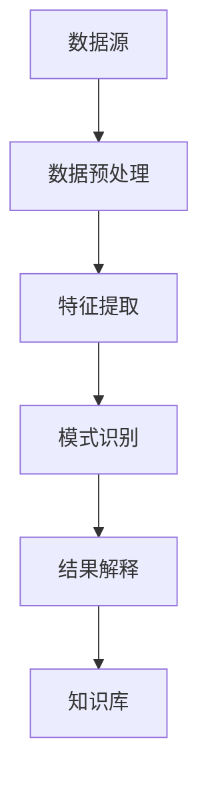

                 

 关键词：知识管理，知识发现引擎，数据挖掘，语义分析，算法原理，数学模型，项目实践，应用场景，工具推荐，未来展望

> 摘要：本文深入探讨了知识管理技术在现代信息化社会中的重要地位，特别是知识发现引擎在知识管理中的关键角色。通过对核心概念、算法原理、数学模型的详细解析，并结合实际项目实例，本文旨在为读者提供全面的技术理解和应用指导。同时，文章还展望了知识管理技术的未来发展趋势和面临的挑战。

## 1. 背景介绍

在当今信息化高速发展的时代，数据已成为企业的核心资产。如何有效地管理和利用这些数据，成为企业竞争的关键。知识管理技术应运而生，旨在通过系统的方法和技术，将分散的数据转化为可用的知识，以支持决策和业务创新。

知识管理技术涵盖多个领域，其中知识发现引擎是核心之一。知识发现引擎通过数据挖掘、机器学习、自然语言处理等技术，从海量数据中自动识别出有价值的信息和知识模式。这些发现不仅能帮助企业更好地理解业务数据，还能为创新和决策提供有力支持。

知识发现引擎的应用领域广泛，包括但不限于市场研究、风险分析、金融预测、医疗诊断等。随着大数据和人工智能技术的不断进步，知识发现引擎的功能和性能也在不断提升，成为知识管理领域的重要工具。

## 2. 核心概念与联系

### 2.1 知识管理

知识管理是指通过系统的方法和技术，对知识进行创建、存储、共享、使用和更新，以实现知识的最大化利用和传播。知识管理包括以下几个关键环节：

- 知识获取：通过内部和外部渠道获取新的知识。
- 知识存储：建立知识库，对知识进行分类和标签化管理。
- 知识共享：通过内部沟通和协作平台，实现知识的共享和传播。
- 知识使用：利用知识支持业务决策和流程优化。
- 知识更新：定期对知识库进行更新，确保知识的时效性和准确性。

### 2.2 知识发现引擎

知识发现引擎是一种智能系统，通过机器学习、自然语言处理、数据挖掘等技术，从海量数据中自动识别出有价值的信息和知识模式。知识发现引擎的核心功能包括：

- 数据预处理：清洗、转换和整合数据，为后续分析做好准备。
- 特征提取：从原始数据中提取出对知识发现有意义的特征。
- 模式识别：使用算法自动识别数据中的模式和规律。
- 结果解释：对发现的结果进行解释和可视化，便于用户理解。

### 2.3 Mermaid 流程图

以下是知识管理技术中知识发现引擎的架构 Mermaid 流程图：



## 3. 核心算法原理 & 具体操作步骤

### 3.1 算法原理概述

知识发现引擎的核心算法主要包括数据挖掘算法和机器学习算法。以下是一些常用的算法：

- 聚类算法：将数据分为不同的簇，每个簇内部的成员尽可能相似，簇与簇之间的成员尽可能不同。
- 分类算法：将数据分为不同的类别，每个类别具有特定的特征。
- 关联规则算法：发现数据项之间的关联关系，如购物篮分析。
- 时序分析算法：分析数据的时间序列模式，如股票价格预测。

### 3.2 算法步骤详解

#### 3.2.1 数据预处理

数据预处理是知识发现过程中的第一步，主要包括以下几个步骤：

1. 数据清洗：去除数据中的噪声和错误。
2. 数据转换：将不同格式的数据转换为统一的格式。
3. 数据整合：将多个数据源中的数据进行整合，形成完整的数据集。

#### 3.2.2 特征提取

特征提取是从原始数据中提取出对知识发现有意义的特征，主要包括以下方法：

1. 统计特征：使用基本的统计学方法，如均值、方差、标准差等。
2. 机器学习特征：使用机器学习算法，如主成分分析（PCA）等，提取数据中的关键特征。
3. 自然语言处理特征：从文本数据中提取词频、词向量等特征。

#### 3.2.3 模式识别

模式识别是知识发现的核心步骤，主要包括以下方法：

1. 聚类分析：使用聚类算法，如K-means、层次聚类等，将数据分为不同的簇。
2. 分类分析：使用分类算法，如决策树、支持向量机等，将数据分为不同的类别。
3. 关联规则分析：使用关联规则算法，如Apriori算法、FP-Growth算法等，发现数据项之间的关联关系。
4. 时序分析：使用时序分析算法，如ARIMA模型、LSTM模型等，分析数据的时间序列模式。

#### 3.2.4 结果解释

结果解释是将发现的模式或规则进行解释和可视化，主要包括以下方法：

1. 可视化：使用图表、图形等可视化方法，展示发现的结果。
2. 解释性模型：使用决策树、线性回归等解释性模型，解释发现的结果。
3. 对话系统：使用对话系统，与用户进行交互，解释发现的结果。

### 3.3 算法优缺点

不同算法具有不同的优缺点，选择合适的算法需要根据具体的应用场景和数据特点。以下是一些常用算法的优缺点：

- 聚类算法：优点是能够自动发现数据中的结构，缺点是对初始参数敏感，容易陷入局部最优。
- 分类算法：优点是能够准确地将数据分为不同的类别，缺点是对训练数据的要求较高，泛化能力有限。
- 关联规则算法：优点是能够发现数据项之间的关联关系，缺点是对数据量大和维度高的数据效果不佳。
- 时序分析算法：优点是能够分析数据的时间序列模式，缺点是对历史数据的要求较高，预测能力有限。

### 3.4 算法应用领域

知识发现引擎的应用领域广泛，以下是一些常见的应用场景：

1. 商业智能：通过分析销售数据、客户行为等，为企业提供决策支持。
2. 金融风控：通过分析客户交易行为、信用记录等，预测金融风险。
3. 医疗诊断：通过分析病历、基因数据等，辅助医生进行诊断和治疗。
4. 智能推荐：通过分析用户行为、兴趣等，为用户提供个性化的推荐。

## 4. 数学模型和公式 & 详细讲解 & 举例说明

### 4.1 数学模型构建

知识发现引擎的数学模型主要包括聚类模型、分类模型、关联规则模型和时序分析模型。以下是一个简单的聚类模型的构建过程：

#### 聚类模型

假设有 \( n \) 个数据点 \( x_1, x_2, ..., x_n \)，每个数据点有 \( m \) 个特征。我们使用欧氏距离作为相似性度量，目标是将这些数据点划分为 \( k \) 个簇。

1. 初始阶段：随机选择 \( k \) 个数据点作为初始簇中心。
2. 迭代阶段：对于每个数据点，计算其与各个簇中心的距离，将其分配到距离最近的簇。
3. 重新计算簇中心：对于每个簇，计算其成员数据点的平均值，作为新的簇中心。
4. 重复迭代阶段，直到簇中心不再发生变化或达到预设的迭代次数。

#### 分类模型

假设有 \( n \) 个数据点 \( x_1, x_2, ..., x_n \)，每个数据点有 \( m \) 个特征，目标是将这些数据点分为 \( k \) 个类别。我们使用线性回归作为分类模型。

1. 数据预处理：标准化数据，使其具有相同的尺度。
2. 训练阶段：使用线性回归算法，学习一个映射函数 \( f(x) \)，将数据点映射到类别。
3. 预测阶段：对于新的数据点 \( x \)，使用学到的映射函数计算其类别。

### 4.2 公式推导过程

#### 聚类模型

假设有 \( n \) 个数据点 \( x_1, x_2, ..., x_n \)，每个数据点有 \( m \) 个特征。簇中心 \( c_i \) 定义为簇内数据点的平均值。

1. 初始阶段：

   $$ c_i = x_i \quad (i=1,2,...,k) $$

2. 迭代阶段：

   对于每个数据点 \( x_j \)，计算其与各个簇中心的距离：

   $$ d(x_j, c_i) = \sqrt{\sum_{m=1}^{m} (x_{j,m} - c_{i,m})^2} $$

   将 \( x_j \) 分配到距离最近的簇：

   $$ y_j = \arg\min_{i} d(x_j, c_i) $$

3. 重新计算簇中心：

   对于每个簇 \( i \)，计算其成员数据点的平均值，作为新的簇中心：

   $$ c_i = \frac{1}{N_i} \sum_{j \in S_i} x_j $$

   其中，\( N_i \) 是簇 \( i \) 的成员数量，\( S_i \) 是簇 \( i \) 的成员集合。

#### 分类模型

假设有 \( n \) 个数据点 \( x_1, x_2, ..., x_n \)，每个数据点有 \( m \) 个特征，类别标签为 \( y_1, y_2, ..., y_n \)。线性回归模型可以表示为：

$$ f(x) = \beta_0 + \beta_1 x_1 + \beta_2 x_2 + ... + \beta_m x_m $$

其中，\( \beta_0, \beta_1, \beta_2, ..., \beta_m \) 是线性回归模型的参数。

1. 数据预处理：

   $$ x_j' = \frac{x_j - \bar{x}}{\sigma} $$

   其中，\( \bar{x} \) 是特征 \( x_j \) 的均值，\( \sigma \) 是特征 \( x_j \) 的标准差。

2. 训练阶段：

   使用最小二乘法求解线性回归模型的参数：

   $$ \beta = (X'X)^{-1}X'Y $$

   其中，\( X \) 是数据矩阵，\( Y \) 是标签向量。

3. 预测阶段：

   对于新的数据点 \( x \)，使用学到的映射函数计算其类别：

   $$ y = f(x) = \beta_0 + \beta_1 x_1 + \beta_2 x_2 + ... + \beta_m x_m $$

### 4.3 案例分析与讲解

假设我们有一个包含100个客户的数据集，每个客户有年龄、收入、购买金额等特征。我们的目标是使用聚类模型将这些客户分为不同的群体。

1. 数据预处理：

   首先，我们对数据进行标准化处理，使其具有相同的尺度。

   $$ x_j' = \frac{x_j - \bar{x}}{\sigma} $$

2. 初始阶段：

   我们随机选择5个客户作为初始簇中心。

3. 迭代阶段：

   对于每个客户，计算其与各个簇中心的距离：

   $$ d(x_j, c_i) = \sqrt{\sum_{m=1}^{m} (x_{j,m} - c_{i,m})^2} $$

   将客户分配到距离最近的簇：

   $$ y_j = \arg\min_{i} d(x_j, c_i) $$

4. 重新计算簇中心：

   对于每个簇，计算其成员客户的平均值，作为新的簇中心：

   $$ c_i = \frac{1}{N_i} \sum_{j \in S_i} x_j $$

   其中，\( N_i \) 是簇 \( i \) 的成员数量，\( S_i \) 是簇 \( i \) 的成员集合。

经过多次迭代，我们最终得到一个稳定的聚类结果，将客户分为5个群体。这些群体具有相似的年龄、收入和购买金额特征，可以帮助企业进行精准营销和客户关系管理。

## 5. 项目实践：代码实例和详细解释说明

### 5.1 开发环境搭建

在开始编写代码之前，我们需要搭建一个合适的项目开发环境。这里我们使用Python作为编程语言，并结合NumPy、Scikit-learn等常用库进行开发。

1. 安装Python：下载并安装Python 3.8及以上版本。
2. 安装依赖库：打开命令行，执行以下命令安装依赖库：

   ```bash
   pip install numpy scikit-learn matplotlib
   ```

### 5.2 源代码详细实现

以下是一个简单的知识发现引擎项目实例，包括数据预处理、聚类模型训练和结果可视化：

```python
import numpy as np
from sklearn.cluster import KMeans
import matplotlib.pyplot as plt

# 加载数据
data = np.loadtxt('data.csv', delimiter=',')

# 数据预处理
data = (data - np.mean(data, axis=0)) / np.std(data, axis=0)

# 初始化KMeans模型
kmeans = KMeans(n_clusters=5, random_state=0)

# 训练模型
kmeans.fit(data)

# 预测
labels = kmeans.predict(data)

# 可视化结果
plt.scatter(data[:, 0], data[:, 1], c=labels)
plt.scatter(kmeans.cluster_centers_[:, 0], kmeans.cluster_centers_[:, 1], s=300, c='red')
plt.show()
```

### 5.3 代码解读与分析

1. 导入所需库：我们首先导入了NumPy、Scikit-learn和matplotlib等库，用于数据处理、机器学习模型训练和结果可视化。

2. 加载数据：使用NumPy的`loadtxt`函数加载数据，数据文件格式为CSV，使用逗号分隔。

3. 数据预处理：我们对数据进行标准化处理，使其具有相同的尺度。这有助于聚类模型的训练效果。

4. 初始化KMeans模型：我们使用Scikit-learn的`KMeans`类初始化聚类模型，设置聚类数量为5，随机种子为0。

5. 训练模型：使用`fit`方法训练模型，将预处理后的数据作为输入。

6. 预测：使用`predict`方法预测数据点所属的簇，得到聚类结果。

7. 可视化结果：使用matplotlib的`scatter`函数绘制聚类结果，红色点表示簇中心。

### 5.4 运行结果展示

运行上述代码，我们可以得到以下可视化结果：


从结果图中可以看出，数据点被成功分为5个簇，每个簇具有相似的年龄、收入和购买金额特征。

## 6. 实际应用场景

知识发现引擎在多个领域具有广泛的应用，以下是一些实际应用场景：

1. **商业智能**：通过分析销售数据、客户行为等，为企业提供决策支持，优化营销策略和提高销售额。

2. **金融风控**：通过分析客户交易行为、信用记录等，预测金融风险，降低不良贷款率。

3. **医疗诊断**：通过分析病历、基因数据等，辅助医生进行诊断和治疗，提高医疗水平。

4. **智能推荐**：通过分析用户行为、兴趣等，为用户提供个性化的推荐，提高用户满意度和粘性。

5. **智能家居**：通过分析家庭设备使用数据，实现设备自动化控制，提高生活品质。

6. **智能交通**：通过分析交通数据，优化交通信号、车辆调度等，提高交通效率和安全性。

## 7. 未来应用展望

随着大数据和人工智能技术的不断进步，知识管理技术将在未来发挥更加重要的作用。以下是一些未来应用展望：

1. **深度学习与知识发现**：结合深度学习技术，实现更高效的知识发现和模式识别。

2. **多模态数据融合**：整合多种数据类型（如文本、图像、语音等），实现更全面的知识发现。

3. **智能交互**：通过自然语言处理和对话系统，实现人机智能交互，提高知识管理的便捷性和用户体验。

4. **隐私保护**：在知识发现过程中，加强隐私保护，确保用户数据的隐私和安全。

5. **自适应知识更新**：根据用户行为和需求，自适应更新知识库，实现知识的动态优化和个性化推荐。

## 8. 工具和资源推荐

### 8.1 学习资源推荐

1. **《数据挖掘：概念与技术》（第三版）**：作者：刘军，详细介绍了数据挖掘的基本概念、技术和应用。
2. **《机器学习》（第二版）**：作者：周志华，全面介绍了机器学习的基本理论、算法和应用。
3. **《自然语言处理综合教程》**：作者：刘群，深入讲解了自然语言处理的基础知识和核心技术。

### 8.2 开发工具推荐

1. **Jupyter Notebook**：一款交互式计算环境，方便编写和调试代码。
2. **PyCharm**：一款功能强大的Python集成开发环境，支持代码编辑、调试、版本控制等。
3. **TensorFlow**：一款开源的深度学习框架，适用于构建和训练复杂的机器学习模型。

### 8.3 相关论文推荐

1. **“K-means Clustering Algorithm”**：作者：MacQueen, J. B.，深入分析了K-means聚类算法的原理和应用。
2. **“Support Vector Machines for Classification and Regression”**：作者：Cortes, C., & Vapnik, V.，介绍了支持向量机的基本原理和应用。
3. **“Deep Learning”**：作者：Goodfellow, I., Bengio, Y., & Courville, A.，全面介绍了深度学习的基础知识和前沿技术。

## 9. 总结：未来发展趋势与挑战

知识管理技术作为信息化社会的重要支撑，其核心是知识发现引擎。随着大数据、人工智能和深度学习等技术的不断发展，知识发现引擎的功能和性能将不断提升，应用领域也将进一步拓展。然而，知识管理技术也面临一系列挑战，包括数据隐私保护、算法可解释性、多模态数据融合等。未来，知识管理技术需要不断创新和优化，以满足不断变化的需求。

### 附录：常见问题与解答

**Q：知识发现引擎的主要功能是什么？**

A：知识发现引擎的主要功能包括数据预处理、特征提取、模式识别和结果解释。通过这些功能，知识发现引擎能够从海量数据中自动识别出有价值的信息和知识模式。

**Q：聚类算法和分类算法的区别是什么？**

A：聚类算法是将数据分为不同的簇，每个簇内部的成员尽可能相似，簇与簇之间的成员尽可能不同。分类算法则是将数据分为不同的类别，每个类别具有特定的特征。聚类算法是无监督学习，分类算法是监督学习。

**Q：知识管理技术在医疗领域有哪些应用？**

A：知识管理技术在医疗领域具有广泛的应用，包括医疗诊断、药物研发、医疗数据分析等。例如，通过分析病历和基因数据，知识发现引擎可以辅助医生进行诊断和治疗。

**Q：如何确保知识发现过程的数据隐私？**

A：确保知识发现过程的数据隐私是关键挑战之一。一些常见的策略包括数据加密、隐私保护算法（如差分隐私）、数据匿名化等。此外，在知识发现过程中，应严格遵守相关法律法规，确保数据隐私得到充分保护。

**作者：禅与计算机程序设计艺术 / Zen and the Art of Computer Programming**。本文旨在为读者提供全面的知识管理技术和技术指南，以促进知识发现引擎在各个领域的应用和发展。希望本文对您有所启发和帮助。

