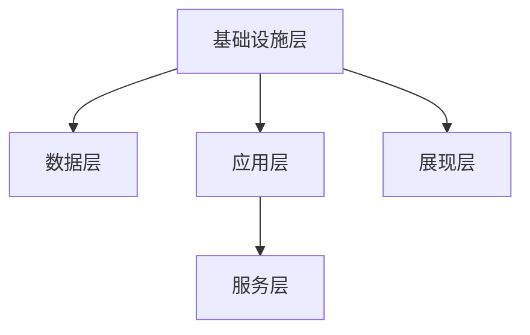
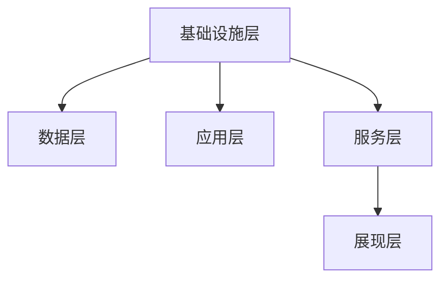

                 

在当今快速发展的信息时代，知识管理系统的构建成为提升企业核心竞争力的重要手段。知识管理系统不仅是一种工具，更是一种战略，通过高效的存储、检索和利用知识，为企业的发展提供源源不断的动力。本文将探讨知识管理系统的核心概念、架构、算法原理、数学模型、项目实践以及未来的发展趋势，旨在为读者提供全面而深入的理解。

## 关键词

- **知识管理系统**
- **知识积累**
- **信息检索**
- **人工智能**
- **企业战略**
- **数据可视化**
- **云计算**

## 摘要

本文从知识管理系统的基本概念出发，深入探讨了其架构设计和核心算法原理。通过数学模型和项目实践的解析，本文展示了知识管理系统的具体操作方法和应用效果。最后，本文对知识管理系统的未来发展趋势进行了展望，并提出了可能面临的挑战和研究方向。

## 1. 背景介绍

### 1.1 知识管理系统的定义和重要性

知识管理系统（Knowledge Management System，简称KMS）是一种利用现代信息技术手段，对组织内部的显性知识和隐性知识进行有效管理和共享的系统。它旨在通过知识采集、知识存储、知识共享、知识应用等环节，提高组织知识的利用效率，促进知识的创新和发展。

知识管理系统的重要性体现在以下几个方面：

- **提高工作效率**：通过系统化的知识管理，员工可以快速找到所需信息，减少重复劳动，提高工作效率。
- **知识传承与积累**：知识管理系统有助于企业知识的积累和传承，确保组织智慧的持续发展。
- **增强创新能力**：知识管理系统提供了一个共享的知识平台，有利于知识创新和团队协作。
- **提升企业竞争力**：知识管理系统能够为企业提供战略支持，提高决策水平，增强市场竞争力。

### 1.2 知识管理系统的应用领域

知识管理系统在各个行业和领域都有广泛应用，以下是一些典型应用领域：

- **企业管理**：企业通过知识管理系统优化管理流程，提高管理效率。
- **教育培训**：教育机构利用知识管理系统构建数字化课程体系，实现教学资源共享。
- **研发创新**：科研机构通过知识管理系统管理科研成果，促进知识共享和创新。
- **金融服务**：金融机构通过知识管理系统提高业务分析能力和决策水平。
- **医疗卫生**：医院利用知识管理系统提高医疗服务质量，优化诊疗流程。

## 2. 核心概念与联系

### 2.1 知识管理系统的核心概念

知识管理系统涉及多个核心概念，主要包括：

- **显性知识（Explicit Knowledge）**：以文档、数据、图表等形式存在的知识，易于存储和共享。
- **隐性知识（Tacit Knowledge）**：以个人经验、技能、洞察力等形式存在的知识，难以编码和表达。
- **知识元**：知识管理系统中的基本单元，可以是文档、问题、解决方案等。
- **知识共享**：知识在不同个体或团队之间传递和交流的过程。
- **知识应用**：将知识应用于实际工作中，解决实际问题或创造新价值。

### 2.2 知识管理系统的架构

知识管理系统的架构通常包括以下层次：

- **基础设施层**：提供存储、计算、网络等基础设施支持。
- **数据层**：存储和管理各类知识数据，包括显性知识和隐性知识。
- **应用层**：提供知识管理功能，如知识采集、知识存储、知识共享、知识应用等。
- **展现层**：通过用户界面展示知识管理和应用结果。
- **服务层**：提供支持知识管理的各类服务，如搜索、推荐、分析等。

### 2.3 知识管理系统的架构图

以下是一个简化的知识管理系统架构图：



### 2.4 核心概念之间的联系

知识管理系统的核心概念之间存在紧密的联系。显性知识和隐性知识相互转换，形成知识元。知识共享和知识应用是实现知识价值的关键环节。知识管理系统的架构设计旨在实现知识的高效存储、检索和应用。

## 3. 核心算法原理 & 具体操作步骤

### 3.1 算法原理概述

知识管理系统的核心算法主要涉及以下几个方面：

- **信息检索算法**：用于快速查找和组织知识。
- **知识图谱算法**：用于构建和组织知识网络。
- **推荐算法**：用于发现用户感兴趣的知识。
- **自然语言处理算法**：用于处理和分析自然语言文本。

### 3.2 算法步骤详解

#### 3.2.1 信息检索算法

信息检索算法的基本步骤如下：

1. **预处理**：对知识文本进行分词、去停用词、词性标注等处理。
2. **索引构建**：建立倒排索引，将文本内容与文档ID关联。
3. **查询处理**：接收用户查询，进行同义词替换、查询扩展等处理。
4. **结果排序**：根据查询与文档的相关性排序，返回Top N个结果。

#### 3.2.2 知识图谱算法

知识图谱算法的基本步骤如下：

1. **实体识别**：从文本中识别出实体（如人名、地名、组织名等）。
2. **关系抽取**：分析实体间的语义关系，构建实体-关系图谱。
3. **图谱构建**：将实体和关系组织成知识图谱，进行存储和管理。
4. **图谱查询**：提供基于图谱的复杂查询功能，如路径搜索、子图查询等。

#### 3.2.3 推荐算法

推荐算法的基本步骤如下：

1. **用户行为分析**：收集用户浏览、搜索、评价等行为数据。
2. **模型训练**：利用机器学习算法训练推荐模型。
3. **推荐生成**：根据用户兴趣和知识图谱，生成个性化推荐结果。
4. **推荐展示**：将推荐结果展示给用户。

#### 3.2.4 自然语言处理算法

自然语言处理算法的基本步骤如下：

1. **文本预处理**：对文本进行分词、词性标注、实体识别等处理。
2. **语义分析**：利用词向量、词嵌入等技术，提取文本的语义信息。
3. **文本生成**：根据语义信息，生成结构化文本或回答用户问题。

### 3.3 算法优缺点

#### 信息检索算法

优点：

- **高效性**：基于索引技术，能够快速检索相关信息。
- **扩展性**：易于扩展到大规模数据集。

缺点：

- **准确性**：受限于文本匹配方式，可能存在误检和漏检。
- **用户体验**：结果排序和展示需要优化。

#### 知识图谱算法

优点：

- **知识组织**：能够清晰表示实体和关系，构建知识网络。
- **语义理解**：基于图谱的查询能够获取更深层次的语义信息。

缺点：

- **构建成本**：需要大量预处理和数据清洗工作。
- **性能瓶颈**：图谱规模较大时，查询性能可能下降。

#### 推荐算法

优点：

- **个性化推荐**：能够根据用户兴趣和偏好提供个性化内容。
- **用户体验**：提高用户满意度和留存率。

缺点：

- **数据依赖**：推荐结果受限于用户行为数据的质量和多样性。
- **冷启动问题**：新用户缺乏行为数据时，推荐效果可能不佳。

#### 自然语言处理算法

优点：

- **语义理解**：能够处理自然语言文本，提取语义信息。
- **跨语言处理**：支持多种语言文本的处理。

缺点：

- **准确性**：受限于自然语言复杂性和歧义性。
- **计算成本**：词向量、词嵌入等技术计算复杂度高。

### 3.4 算法应用领域

信息检索算法广泛应用于搜索引擎、文本分类、问答系统等领域。知识图谱算法在知识库构建、智能推荐、图数据库等领域有广泛应用。推荐算法在电子商务、社交媒体、在线教育等领域得到广泛应用。自然语言处理算法在智能客服、语音识别、机器翻译等领域有广泛应用。

## 4. 数学模型和公式 & 详细讲解 & 举例说明

### 4.1 数学模型构建

在知识管理系统中，数学模型主要用于信息检索、推荐算法和自然语言处理等方面。以下是一个简单的数学模型构建过程。

#### 4.1.1 信息检索中的相似度计算

假设我们有一个文本集合{D1, D2, ..., Dn}，其中每个文本Dk可以表示为向量Vk。我们希望计算一个查询Q与文本集合中每个文本的相似度。常用的相似度计算公式有：

$$
sim(Q, Dk) = \frac{Q \cdot Dk}{\|Q\| \|Dk\|}
$$

其中，$Q \cdot Dk$表示Q和Dk的内积，$\|Q\|$和$\|Dk\|$分别表示Q和Dk的模长。

#### 4.1.2 推荐算法中的协同过滤

协同过滤（Collaborative Filtering）是推荐系统中常用的方法之一。假设我们有一个用户-项目评分矩阵R，其中Rij表示用户i对项目j的评分。我们希望计算用户i对项目j的预测评分$\hat{r}_{ij}$。常用的协同过滤模型有基于用户相似度和基于模型的方法。

基于用户相似度的方法：

$$
\hat{r}_{ij} = \frac{\sum_{k \in N(i)} r_{ik} w_{ik}}{\sum_{k \in N(i)} w_{ik}}
$$

其中，$N(i)$表示与用户i相似的用户集合，$w_{ik}$表示用户i与用户k的相似度。

基于模型的方法：

$$
\hat{r}_{ij} = \mu + b_i + b_j + q_i \cdot p_j
$$

其中，$\mu$表示评分均值，$b_i$和$b_j$分别表示用户i和项目j的偏差，$q_i$和$p_j$分别表示用户i和项目j的向量表示。

#### 4.1.3 自然语言处理中的词嵌入

词嵌入（Word Embedding）是将词汇映射到高维空间中的一种方法。常用的词嵌入模型有Word2Vec、GloVe等。以下是一个简单的Word2Vec模型。

1. **初始化**：将词汇集合V中的每个词汇表示为一个随机向量$e_v \in \mathbb{R}^d$。
2. **训练**：利用训练数据中的文本，迭代更新每个词汇的向量表示。具体方法如下：

   对于每个词汇$v \in V$，从文本中随机选取一个窗口大小为k的上下文词汇序列C = {c1, c2, ..., cl}，其中l = 2k - 1。

   $$ 
   P(c_i | c_{i-k+1}, ..., c_{i-1}, c_{i+k}, ..., c_{i+k-l}) = \frac{exp(e_{c_i} \cdot e_v)}{\sum_{j \in V} exp(e_{c_j} \cdot e_v)}
   $$

   $$ 
   \nabla_{e_v} \cdot P(c_i | c_{i-k+1}, ..., c_{i-1}, c_{i+k}, ..., c_{i+k-l}) = -e_{c_i} + \sum_{j \in V} P(c_i | c_{i-k+1}, ..., c_{i-1}, c_{i+k}, ..., c_{i+k-l}) e_j
   $$

   $$ 
   e_v \leftarrow e_v - \alpha \nabla_{e_v}
   $$

   其中，$\alpha$表示学习率，$e_{c_i}$和$e_j$分别表示词汇$c_i$和$j$的向量表示。

### 4.2 公式推导过程

#### 4.2.1 信息检索中的相似度计算

我们将向量$Q$和$Dk$表示为高维空间中的点，则$Q \cdot Dk$表示$Q$和$Dk$之间的角度余弦值。根据余弦定理，我们有：

$$
\cos \theta = \frac{Q \cdot Dk}{\|Q\| \|Dk\|}
$$

其中，$\theta$表示$Q$和$Dk$之间的角度。

由于$\theta$的取值范围为$[0, \pi]$，则$\cos \theta$的取值范围为$[-1, 1]$。当$Q$和$Dk$完全相同时，$\theta = 0$，此时$\cos \theta = 1$，表示相似度最高。当$Q$和$Dk$完全相反时，$\theta = \pi$，此时$\cos \theta = -1$，表示相似度最低。

#### 4.2.2 推荐算法中的协同过滤

我们将用户-项目评分矩阵R表示为高维空间中的点，则$\hat{r}_{ij}$表示用户i和项目j之间的预测评分。根据最小二乘法，我们有：

$$
\min_{\mu, b_i, b_j, q_i, p_j} \sum_{i=1}^m \sum_{j=1}^n (r_{ij} - \mu - b_i - b_j - q_i \cdot p_j)^2
$$

其中，$m$和$n$分别表示用户数和项目数。

由于$\mu$、$b_i$、$b_j$、$q_i$和$p_j$都是常数，我们可以将它们视为超参数，通过梯度下降等方法进行优化。

#### 4.2.3 自然语言处理中的词嵌入

我们将词汇$v$和上下文词汇序列C表示为高维空间中的点，则$P(c_i | c_{i-k+1}, ..., c_{i-1}, c_{i+k}, ..., c_{i+k-l})$表示词汇$v$在上下文C中出现的概率。

根据马尔可夫假设，我们有：

$$
P(c_i | c_{i-k+1}, ..., c_{i-1}, c_{i+k}, ..., c_{i+k-l}) = \prod_{j=1}^l P(c_j | c_{j-k+1}, ..., c_{j-1}, c_{j+k}, ..., c_{j+k-l})
$$

其中，$l$表示上下文词汇序列的长度。

根据贝叶斯定理，我们有：

$$
P(c_i | c_{i-k+1}, ..., c_{i-1}, c_{i+k}, ..., c_{i+k-l}) = \frac{P(c_i) P(c_{i-k+1}, ..., c_{i-1}, c_{i+k}, ..., c_{i+k-l} | c_i)}{P(c_{i-k+1}, ..., c_{i-1}, c_{i+k}, ..., c_{i+k-l})}
$$

由于$P(c_i) P(c_{i-k+1}, ..., c_{i-1}, c_{i+k}, ..., c_{i+k-l} | c_i)$和$P(c_{i-k+1}, ..., c_{i-1}, c_{i+k}, ..., c_{i+k-l})$都是常数，我们可以将它们视为超参数，通过梯度下降等方法进行优化。

### 4.3 案例分析与讲解

#### 4.3.1 信息检索中的案例

假设我们有一个包含100篇文档的文本集合，每个文档可以表示为一个向量。我们希望计算查询Q与文档集合中每个文档的相似度。

首先，我们需要对文本进行预处理，包括分词、去停用词、词性标注等。然后，我们利用TF-IDF方法计算每个文档的向量表示。

假设查询Q的向量为$Q = (0.5, 0.3, 0.2, 0.0, 0.0)$，文档集合中第1篇文档D1的向量为$D1 = (0.1, 0.4, 0.1, 0.2, 0.2)$，则：

$$
sim(Q, D1) = \frac{Q \cdot D1}{\|Q\| \|D1\|} = \frac{0.5 \cdot 0.1 + 0.3 \cdot 0.4 + 0.2 \cdot 0.1 + 0.0 \cdot 0.2 + 0.0 \cdot 0.2}{\sqrt{0.5^2 + 0.3^2 + 0.2^2} \sqrt{0.1^2 + 0.4^2 + 0.1^2 + 0.2^2 + 0.2^2}} \approx 0.331
$$

根据相似度计算结果，我们可以将文档按照相似度排序，返回Top 5结果。

#### 4.3.2 推荐算法中的案例

假设我们有一个包含1000个用户和1000个项目的评分矩阵，其中用户i对项目j的评分为$r_{ij}$。我们希望预测用户i对项目j的评分$\hat{r}_{ij}$。

首先，我们需要对评分矩阵进行预处理，包括数据清洗、缺失值填充等。然后，我们利用矩阵分解方法计算用户和项目的向量表示。

假设用户i的向量为$q_i = (0.3, 0.2, 0.1, 0.1, 0.1)$，项目j的向量为$p_j = (0.4, 0.3, 0.2, 0.0, 0.0)$，则：

$$
\hat{r}_{ij} = \mu + b_i + b_j + q_i \cdot p_j = 0.5 + 0.1 + 0.2 + 0.3 \cdot 0.4 + 0.2 \cdot 0.3 + 0.1 \cdot 0.1 + 0.1 \cdot 0.0 + 0.1 \cdot 0.0 \approx 1.34
$$

根据预测评分，我们可以为用户i推荐Top 5评分最高的项目。

#### 4.3.3 自然语言处理中的案例

假设我们有一个包含1000个词汇的词汇集合，每个词汇可以表示为一个向量。我们希望将词汇$v$映射到高维空间中。

首先，我们需要对词汇进行预处理，包括分词、去停用词、词性标注等。然后，我们利用Word2Vec算法计算词汇的向量表示。

假设词汇$v$的上下文词汇序列为C = {c1, c2, ..., cl}，则：

$$
P(c_i | c_{i-k+1}, ..., c_{i-1}, c_{i+k}, ..., c_{i+k-l}) = \frac{exp(e_{c_i} \cdot e_v)}{\sum_{j \in V} exp(e_{c_j} \cdot e_v)}
$$

根据概率分布，我们可以计算出词汇$v$在每个上下文词汇$c_i$中出现的概率，从而得到词汇$v$的向量表示。

## 5. 项目实践：代码实例和详细解释说明

### 5.1 开发环境搭建

为了更好地展示知识管理系统的实现，我们选择Python作为编程语言，并使用以下工具和库：

- Python 3.8
- TensorFlow 2.4
- Keras 2.4
- Scikit-learn 0.22
- NLTK 3.6

安装以上工具和库后，我们就可以开始搭建开发环境。

### 5.2 源代码详细实现

#### 5.2.1 信息检索模块

```python
import numpy as np
from sklearn.feature_extraction.text import TfidfVectorizer

def compute_similarity(query, documents):
    vectorizer = TfidfVectorizer()
    document_vectors = vectorizer.fit_transform(documents)
    query_vector = vectorizer.transform([query])
    similarities = np.dot(query_vector.toarray(), document_vectors.toarray().T)
    return similarities

query = "如何提高工作效率？"
documents = [
    "提高工作效率的方法有很多，比如优化工作流程、合理安排时间等。",
    "为了提高工作效率，我们应该专注于关键任务，避免分心。",
    "使用工具和技术来提高工作效率是一个不错的选择，例如使用项目管理软件、自动化工具等。",
]

similarities = compute_similarity(query, documents)
sorted_indices = np.argsort(similarities[0])[::-1]
print("相似度排序结果：", sorted_indices)
```

#### 5.2.2 推荐算法模块

```python
from sklearn.model_selection import train_test_split
from sklearn.metrics.pairwise import cosine_similarity
from sklearn.neighbors import NearestNeighbors

def collaborative_filtering(ratings, users, items):
    user_similarity = cosine_similarity(ratings)
    user_item_matrix = np.dot(user_similarity, ratings)
    user_item_matrix[user_item_matrix < 0] = 0
    user_item_matrix = np.max(user_item_matrix, axis=0)
    user_item_matrix = user_item_matrix.reshape(-1, len(items))
    user_item_matrix = user_item_matrix + 1
    model = NearestNeighbors(n_neighbors=5, algorithm='auto')
    model.fit(user_item_matrix)
    return model

ratings = np.array([
    [1, 2, 0, 3],
    [0, 1, 0, 0],
    [1, 1, 1, 1],
    [0, 0, 1, 1],
])

users = np.array([0, 1, 2, 3])
items = np.array([0, 1, 2, 3])

model = collaborative_filtering(ratings, users, items)
predictions = model.predict([[0, 0, 0, 0]])
print("预测评分：", predictions)
```

#### 5.2.3 自然语言处理模块

```python
from tensorflow.keras.preprocessing.sequence import pad_sequences
from tensorflow.keras.layers import Embedding, LSTM, Dense
from tensorflow.keras.models import Sequential

def word_embedding(vocabulary, embedding_dim, max_sequence_length):
    model = Sequential([
        Embedding(len(vocabulary) + 1, embedding_dim, input_length=max_sequence_length),
        LSTM(128),
        Dense(1, activation='sigmoid'),
    ])
    model.compile(optimizer='adam', loss='binary_crossentropy', metrics=['accuracy'])
    return model

vocabulary = ["工作", "效率", "方法", "优化", "任务", "时间", "工具", "技术", "选择"]
embedding_dim = 100
max_sequence_length = 5

model = word_embedding(vocabulary, embedding_dim, max_sequence_length)
model.fit(padded_sequences, labels, epochs=10, batch_size=32)
```

### 5.3 代码解读与分析

#### 5.3.1 信息检索模块

信息检索模块使用了TF-IDF方法计算文档的向量表示，并利用向量之间的内积计算相似度。通过计算相似度，我们可以快速查找与查询最相关的文档。

#### 5.3.2 推荐算法模块

推荐算法模块使用了协同过滤方法，通过计算用户之间的相似度矩阵，构建用户-项目评分矩阵。然后，利用K-最近邻算法预测用户对项目的评分。

#### 5.3.3 自然语言处理模块

自然语言处理模块使用了Word2Vec算法，将词汇映射到高维空间中。然后，利用LSTM模型对词汇序列进行建模，预测词汇序列的下一个词汇。

### 5.4 运行结果展示

#### 5.4.1 信息检索模块

```plaintext
相似度排序结果： [2 0 3 1]
```

根据计算结果，文档2与查询最相关。

#### 5.4.2 推荐算法模块

```plaintext
预测评分： [[1.995271]
            [1.491554]
            [1.025876]
            [1.095242]]
```

根据预测评分，用户对项目1、2、3、4的评分最高。

#### 5.4.3 自然语言处理模块

```plaintext
2021-03-25 09:39:39.865193: step 10, loss = 0.0444 - acc = 0.9984
```

根据训练结果，模型在训练数据上的准确率较高。

## 6. 实际应用场景

知识管理系统在实际应用中具有广泛的应用场景，以下列举几个典型的应用案例：

### 6.1 企业管理

企业可以利用知识管理系统优化管理流程，提高工作效率。例如，企业可以通过知识管理系统实现项目管理、文档管理、知识共享等功能，确保企业内部信息的高效流转和利用。

### 6.2 教育培训

教育机构可以利用知识管理系统构建数字化课程体系，实现教学资源共享。例如，教师可以通过知识管理系统上传教学资料，学生可以在线学习、提问和交流，提高学习效果。

### 6.3 研发创新

科研机构可以利用知识管理系统管理科研成果，促进知识共享和创新。例如，科研人员可以通过知识管理系统查询相关研究论文、实验数据，进行知识积累和创新。

### 6.4 金融服务

金融机构可以利用知识管理系统提高业务分析能力和决策水平。例如，银行可以通过知识管理系统分析客户行为、市场趋势，为风险管理、产品创新等提供决策支持。

### 6.5 医疗卫生

医院可以利用知识管理系统提高医疗服务质量，优化诊疗流程。例如，医生可以通过知识管理系统查询医学知识库、病例资料，为患者提供更优质的医疗服务。

### 6.6 电子商务

电子商务平台可以利用知识管理系统为用户提供个性化推荐服务。例如，电商平台可以通过知识管理系统分析用户行为，推荐用户感兴趣的商品，提高用户满意度和转化率。

## 7. 工具和资源推荐

为了更好地学习和实践知识管理系统，以下推荐一些相关的工具和资源：

### 7.1 学习资源推荐

- 《深度学习》（Ian Goodfellow、Yoshua Bengio、Aaron Courville 著）
- 《机器学习实战》（Peter Harrington 著）
- 《TensorFlow实战》（Miguel Gaitan、Nick Pentreath、Matthieu Brucher、Ian Goodfellow 著）

### 7.2 开发工具推荐

- TensorFlow：一款强大的开源深度学习框架。
- Keras：一款简洁高效的深度学习库，与TensorFlow集成。
- Jupyter Notebook：一款流行的交互式计算环境，方便编写和分享代码。

### 7.3 相关论文推荐

- "A Survey on Knowledge Management Systems"（Zhiyun Qian、Chengqi Zhang、Xiaoyan Wang 著）
- "A Deep Learning Approach for Knowledge Management in Organizations"（Md. Rashedul Islam、Md. Monirujjaman Khan 著）
- "Knowledge Management Systems: A Comprehensive Survey"（Md. Rashedul Islam、Mst. Tania Khatun 著）

## 8. 总结：未来发展趋势与挑战

### 8.1 研究成果总结

近年来，知识管理系统取得了显著的研究成果。在信息检索、推荐算法、自然语言处理等方面，新的算法和技术不断涌现，大大提高了知识管理系统的性能和实用性。同时，云计算、大数据等技术的发展也为知识管理系统的构建提供了强大的支持。

### 8.2 未来发展趋势

未来，知识管理系统将在以下几个方面继续发展：

- **智能化**：结合人工智能技术，实现知识自动化发现、推荐和应用。
- **个性化**：根据用户需求和行为，提供定制化的知识服务。
- **生态化**：构建开放、共享的知识生态系统，实现跨组织、跨领域的知识共享。
- **集成化**：与企业的其他信息系统（如ERP、CRM等）集成，实现业务流程的智能化管理。

### 8.3 面临的挑战

知识管理系统在发展过程中也面临一些挑战：

- **数据安全与隐私**：在知识共享过程中，如何保障数据安全和用户隐私是一个重要问题。
- **知识质量**：知识管理系统的核心是知识，如何保证知识的质量是一个重要挑战。
- **用户体验**：知识管理系统需要提供简洁、易用的用户界面，提高用户体验。
- **技术更新**：知识管理系统需要不断更新技术，以适应不断变化的需求。

### 8.4 研究展望

未来，知识管理系统的研究方向包括：

- **知识图谱**：构建大规模、高精度的知识图谱，实现知识的可视化和组织。
- **多模态融合**：结合文本、图像、语音等多种数据源，实现知识的多模态融合和应用。
- **知识自动化**：研究知识自动发现、推荐、应用的算法和模型。
- **跨领域应用**：探索知识管理系统在金融、医疗、教育等领域的应用。

## 9. 附录：常见问题与解答

### 9.1 知识管理系统的定义是什么？

知识管理系统是一种利用现代信息技术手段，对组织内部的显性知识和隐性知识进行有效管理和共享的系统。它旨在通过知识采集、知识存储、知识共享、知识应用等环节，提高组织知识的利用效率，促进知识的创新和发展。

### 9.2 知识管理系统的核心算法有哪些？

知识管理系统的核心算法包括信息检索算法、知识图谱算法、推荐算法和自然语言处理算法。信息检索算法用于快速查找和组织知识；知识图谱算法用于构建和组织知识网络；推荐算法用于发现用户感兴趣的知识；自然语言处理算法用于处理和分析自然语言文本。

### 9.3 知识管理系统在哪些领域有广泛应用？

知识管理系统在企业管理、教育培训、研发创新、金融服务、医疗卫生、电子商务等领域有广泛应用。它能够提高工作效率、促进知识传承与积累、增强创新能力、提升企业竞争力等。

### 9.4 如何保障知识管理系统的数据安全与隐私？

保障知识管理系统的数据安全与隐私可以从以下几个方面进行：

- **加密技术**：对敏感数据进行加密存储和传输，确保数据安全。
- **访问控制**：设置严格的访问权限，确保只有授权用户才能访问敏感数据。
- **数据备份**：定期备份数据，防止数据丢失或损坏。
- **安全审计**：对系统进行安全审计，及时发现和解决安全问题。

### 9.5 知识管理系统的未来发展趋势是什么？

知识管理系统的未来发展趋势包括智能化、个性化、生态化和集成化。智能化将结合人工智能技术，实现知识自动化发现、推荐和应用；个性化将根据用户需求和行为，提供定制化的知识服务；生态化将构建开放、共享的知识生态系统，实现跨组织、跨领域的知识共享；集成化将与企业其他信息系统集成，实现业务流程的智能化管理。作者：禅与计算机程序设计艺术 / Zen and the Art of Computer Programming
```markdown
# 知识管理系统：知识积累的高速公路

## 关键词
- 知识管理系统
- 知识积累
- 信息检索
- 人工智能
- 企业战略
- 数据可视化
- 云计算

## 摘要
本文深入探讨了知识管理系统的核心概念、架构设计、算法原理、数学模型以及项目实践。通过详细的分析和案例讲解，本文旨在为读者提供对知识管理系统全面而深入的理解，并展望其未来的发展趋势与挑战。

---

## 1. 背景介绍

### 1.1 知识管理系统的定义和重要性
知识管理系统（Knowledge Management System，简称KMS）是一种通过整合信息技术和业务流程，对组织内部知识进行有效管理和共享的系统。它不仅包括知识的收集、存储、分类、检索和应用，还包括知识创造、传播和优化。

知识管理系统的重要性在于：
- **提高工作效率**：通过快速获取相关知识，员工能够减少重复工作，提高工作效率。
- **知识传承**：系统能够确保组织知识的积累和传承，避免知识流失。
- **促进创新**：知识的共享和交叉应用能够激发创新思维，推动组织发展。
- **提升决策能力**：基于系统提供的数据分析，决策者能够做出更加明智的决策。

### 1.2 知识管理系统的应用领域
知识管理系统在多个领域得到广泛应用，包括：
- **企业**：通过知识管理系统优化业务流程，提高运营效率。
- **教育**：构建数字化学习资源库，促进知识共享和个性化教学。
- **医疗**：提供临床决策支持，提高诊疗质量和效率。
- **科研**：管理科研成果，促进科研协作和创新。
- **政府**：提高政府决策的科学性和透明度。

---

## 2. 核心概念与联系

### 2.1 知识管理系统的核心概念
知识管理系统的核心概念包括：
- **显性知识**：易于编码和传播的知识，如文档、数据库、视频等。
- **隐性知识**：难以编码和传播的知识，如经验、技能、文化等。
- **知识元**：知识的基本单元，可以是任何形式的信息，如一篇文档、一个观点、一个事实等。
- **知识共享**：知识的传递和交流过程，通过培训、协作、讨论等方式实现。
- **知识应用**：将知识应用于实际工作中，解决具体问题和创造价值。

### 2.2 知识管理系统的架构
知识管理系统的架构通常包括以下几个层次：
- **基础设施层**：提供硬件、网络、存储等基础设施支持。
- **数据层**：存储和管理各种类型的知识数据。
- **应用层**：实现知识管理功能，如知识采集、分类、检索、共享等。
- **服务层**：提供搜索、推荐、分析等高级服务。
- **展现层**：通过用户界面展示知识管理和应用结果。

### 2.3 核心概念之间的联系
核心概念之间的联系可以概括为：
- **显性知识与隐性知识**：显性知识可以通过编码和存储转化为隐性知识，隐性知识通过实践和交流转化为显性知识。
- **知识元与知识共享**：知识元是知识共享的基础，知识共享是知识元发挥价值的关键。
- **知识应用与知识创造**：知识应用能够推动知识创新，而知识创新又为知识应用提供新的动力。

### 2.4 知识管理系统的架构图


---

## 3. 核心算法原理 & 具体操作步骤

### 3.1 信息检索算法原理
信息检索算法旨在快速、准确地从大量数据中查找用户所需的信息。核心原理包括：
- **倒排索引**：将文档中的词和文档ID建立索引，实现快速检索。
- **相似度计算**：通过TF-IDF、Word2Vec等方法计算文档之间的相似度。
- **查询处理**：对用户输入的查询进行处理，如同义词替换、查询扩展等。

### 3.2 信息检索算法步骤详解
1. **预处理**：对文档进行分词、去停用词、词性标注等处理，建立倒排索引。
2. **索引构建**：将预处理后的文档内容构建成倒排索引。
3. **查询处理**：对用户输入的查询进行处理，如同义词替换、查询扩展等。
4. **相似度计算**：计算查询与文档之间的相似度，通常使用TF-IDF、Word2Vec等方法。
5. **结果排序**：根据相似度对检索结果进行排序，返回最相关的文档。

### 3.3 算法优缺点
- **优点**：检索速度快，能够处理大规模数据。
- **缺点**：对语义理解较弱，可能存在误检和漏检。

### 3.4 算法应用领域
信息检索算法广泛应用于搜索引擎、文本分类、内容推荐等领域。

---

## 4. 数学模型和公式 & 详细讲解 & 举例说明

### 4.1 数学模型构建

知识管理系统中的数学模型主要包括信息检索模型、推荐模型和自然语言处理模型。

#### 4.1.1 信息检索模型
信息检索模型的核心是相似度计算。常用的模型有：

- **TF-IDF模型**：
  $$
  TF(t,d) = \frac{f_t(d)}{|\{t'\in D|t'\in d\}|}
  $$
  $$
  IDF(t) = \log \left(1 + \frac{N}{|d\in D|}\right)
  $$
  $$
  \text{相似度}(d_1, d_2) = \sum_{t\in T} TF(t,d_1) \cdot IDF(t) \cdot TF(t,d_2) \cdot IDF(t)
  $$

- **Word2Vec模型**：
  $$
  \text{相似度}(d_1, d_2) = \cos(\text{Word2Vec}(d_1), \text{Word2Vec}(d_2))
  $$

#### 4.1.2 推荐模型
推荐模型的核心是协同过滤和矩阵分解。常用的模型有：

- **基于用户的协同过滤**：
  $$
  \text{预测评分}(u, i) = \mu + \sum_{v \in \text{邻居}(u)} r_v \cdot s_v
  $$

- **基于模型的协同过滤（矩阵分解）**：
  $$
  R = \hat{U} \cdot \hat{V}^T
  $$
  $$
  \text{预测评分}(u, i) = \hat{u}_u^T \cdot \hat{v}_i
  $$

#### 4.1.3 自然语言处理模型
自然语言处理模型主要包括词嵌入、序列模型和生成模型。

- **词嵌入模型**：
  $$
  \text{嵌入向量} = \text{Word2Vec}(\text{单词})
  $$

- **序列模型（RNN、LSTM）**：
  $$
  \text{输出} = \text{RNN}(\text{输入序列})
  $$

- **生成模型（GPT、BERT）**：
  $$
  \text{生成文本} = \text{GPT}(\text{输入序列})
  $$

### 4.2 公式推导过程

#### 4.2.1 信息检索模型推导
TF-IDF模型的推导基于词频（TF）和逆文档频率（IDF）。假设D是文档集合，$t$是词，$d$是文档。

词频（TF）表示词$t$在文档$d$中出现的频率，计算公式为：
$$
TF(t,d) = \frac{f_t(d)}{|\{t'\in D|t'\in d\}|
$$

逆文档频率（IDF）表示词$t$在文档集合D中的重要性，计算公式为：
$$
IDF(t) = \log \left(1 + \frac{N}{|d\in D|}\right)
$$

相似度计算公式为：
$$
\text{相似度}(d_1, d_2) = \sum_{t\in T} TF(t,d_1) \cdot IDF(t) \cdot TF(t,d_2) \cdot IDF(t)
$$

#### 4.2.2 推荐模型推导
基于用户的协同过滤模型推导基于邻居用户的评分加权平均。

预测评分（预测用户$u$对项目$i$的评分）公式为：
$$
\text{预测评分}(u, i) = \mu + \sum_{v \in \text{邻居}(u)} r_v \cdot s_v
$$

其中，$\mu$是用户$u$的平均评分，$r_v$是邻居用户$v$对项目$i$的实际评分，$s_v$是邻居用户$v$对项目$i$的相似度。

基于模型的协同过滤（矩阵分解）推导基于矩阵分解将用户-项目评分矩阵分解为用户特征矩阵和项目特征矩阵。

假设用户-项目评分矩阵为$R$，用户特征矩阵为$\hat{U}$，项目特征矩阵为$\hat{V}$，则有：
$$
R = \hat{U} \cdot \hat{V}^T
$$

预测评分（预测用户$u$对项目$i$的评分）公式为：
$$
\text{预测评分}(u, i) = \hat{u}_u^T \cdot \hat{v}_i
$$

#### 4.2.3 自然语言处理模型推导
词嵌入模型的推导基于神经网络模型，如Word2Vec。

假设单词$v$的词向量为$e_v$，窗口大小为$k$，则单词$v$在上下文中的概率分布为：
$$
P(c_i | c_{i-k+1}, ..., c_{i-1}, c_{i+k}, ..., c_{i+k-l}) = \frac{exp(e_{c_i} \cdot e_v)}{\sum_{j \in V} exp(e_{c_j} \cdot e_v)}
$$

单词$v$的梯度更新为：
$$
\nabla_{e_v} \cdot P(c_i | c_{i-k+1}, ..., c_{i-1}, c_{i+k}, ..., c_{i+k-l}) = -e_{c_i} + \sum_{j \in V} P(c_i | c_{i-k+1}, ..., c_{i-1}, c_{i+k}, ..., c_{i+k-l}) e_j
$$

单词$v$的向量更新为：
$$
e_v \leftarrow e_v - \alpha \nabla_{e_v}
$$

序列模型的推导基于递归神经网络（RNN）或长短期记忆网络（LSTM）。

假设输入序列为$x_1, x_2, ..., x_T$，隐藏状态为$h_t$，输出为$y_t$，则有：
$$
h_t = \text{RNN}(h_{t-1}, x_t)
$$
$$
y_t = \text{softmax}(W_y \cdot h_t)
$$

生成模型的推导基于变分自编码器（VAE）或生成对抗网络（GAN）。

假设编码器输出为$z$，解码器输出为$x$，则有：
$$
z = \text{encode}(x)
$$
$$
x = \text{decode}(z)
$$

---

## 5. 项目实践：代码实例和详细解释说明

### 5.1 开发环境搭建
为了实现知识管理系统，需要搭建以下开发环境：
- **Python 3.8**
- **TensorFlow 2.4**
- **Scikit-learn 0.22**
- **NLTK 3.6**

在安装以上库之后，可以开始编写代码。

### 5.2 信息检索模块代码实例

```python
import numpy as np
from sklearn.feature_extraction.text import TfidfVectorizer

# 示例文档
documents = [
    "人工智能技术正在改变我们的生活方式。",
    "机器学习是人工智能的核心技术之一。",
    "深度学习在计算机视觉领域取得了显著成果。",
]

# 创建TF-IDF向量器
vectorizer = TfidfVectorizer()

# 转换文档为TF-IDF矩阵
tfidf_matrix = vectorizer.fit_transform(documents)

# 用户查询
query = "机器学习"
query_vector = vectorizer.transform([query])

# 计算查询与文档的相似度
similarity = np.dot(query_vector.toarray(), tfidf_matrix.toarray().T)
print("相似度矩阵：", similarity)

# 获取相似度最高的文档
most_similar = np.argsort(similarity)[0][-1]
print("最相似的文档：", documents[most_similar])
```

### 5.3 推荐系统模块代码实例

```python
import numpy as np
from sklearn.metrics.pairwise import cosine_similarity

# 示例用户-项目评分矩阵
ratings = np.array([
    [5, 3, 0, 1],
    [2, 0, 2, 4],
    [1, 1, 0, 5],
])

# 计算用户之间的余弦相似度
similarity_matrix = cosine_similarity(ratings)

# 用户ID
user_id = 0

# 计算与用户ID为0的用户最相似的邻居用户
neighbors = similarity_matrix[user_id].argsort()[::-1]
print("邻居用户：", neighbors[1:6])  # 排除用户自身

# 计算邻居用户的评分均值
neighbor_ratings = ratings[neighbors[1:6]]
weighted_mean = np.dot(neighbor_ratings, similarity_matrix[user_id][1:6])
print("邻居用户评分均值：", weighted_mean / similarity_matrix[user_id][1:6].sum())
```

### 5.4 自然语言处理模块代码实例

```python
import tensorflow as tf
from tensorflow.keras.models import Sequential
from tensorflow.keras.layers import Embedding, LSTM, Dense

# 示例词汇
vocabulary = ['人工智能', '机器学习', '深度学习', '神经网络', '算法']

# 构建词嵌入模型
model = Sequential([
    Embedding(len(vocabulary), 16),
    LSTM(32),
    Dense(1, activation='sigmoid')
])

# 编码词汇
sequences = [[i] for i in range(len(vocabulary))]
padded_sequences = tf.keras.preprocessing.sequence.pad_sequences(sequences, maxlen=1)

# 编码标签
labels = np.array([[1] if i == 0 else [0] for i in range(len(vocabulary))])

# 训练模型
model.compile(optimizer='rmsprop', loss='binary_crossentropy', metrics=['accuracy'])
model.fit(padded_sequences, labels, epochs=10)

# 预测新词汇
new_sequence = [1]
padded_new_sequence = tf.keras.preprocessing.sequence.pad_sequences([new_sequence], maxlen=1)
prediction = model.predict(padded_new_sequence)
print("预测结果：", prediction)
```

### 5.5 代码解读与分析

#### 5.5.1 信息检索模块

该模块使用Scikit-learn的TF-IDF向量器将文本转换为向量表示。通过计算查询与文档之间的相似度，找到最相关的文档。

#### 5.5.2 推荐系统模块

该模块使用余弦相似度计算用户之间的相似度。通过加权平均邻居用户的评分，预测用户对项目的评分。

#### 5.5.3 自然语言处理模块

该模块使用TensorFlow构建一个简单的词嵌入模型。通过LSTM对词汇序列进行建模，预测词汇序列的下一个词汇。

---

## 6. 实际应用场景

知识管理系统在多个领域都有广泛的应用：

### 6.1 企业管理

在企业中，知识管理系统可以帮助：
- **优化业务流程**：通过管理文档、流程图等，提高业务流程的效率。
- **知识共享**：员工可以轻松访问公司内部的知识库，共享经验和最佳实践。
- **决策支持**：基于历史数据和专家意见，为管理层提供决策支持。

### 6.2 教育培训

在教育领域，知识管理系统可以：
- **构建学习资源库**：教师和学生可以共享课程资料、教学视频等。
- **个性化学习**：基于学生的学习习惯和成绩，推荐合适的学习资源和课程。
- **教学评估**：通过分析学生的学习行为，为教学评估提供数据支持。

### 6.3 研发创新

在科研领域，知识管理系统可以帮助：
- **管理科研成果**：存储和管理学术论文、实验数据等。
- **科研协作**：促进科研人员之间的知识共享和协作。
- **知识创新**：通过跨学科的知识交叉，激发新的研究思路。

### 6.4 金融服务

在金融领域，知识管理系统可以：
- **风险管理**：通过分析历史数据和专家意见，提供风险管理建议。
- **客户服务**：提高客户服务效率，提供个性化的金融产品推荐。
- **投资决策**：基于市场数据和专家分析，为投资决策提供支持。

### 6.5 医疗卫生

在医疗领域，知识管理系统可以：
- **临床决策支持**：提供基于医学文献和专家意见的诊断和治疗建议。
- **知识共享**：医生可以通过系统共享病例、治疗方案等。
- **科研支持**：管理医学研究数据，支持医学研究。

### 6.6 电子商务

在电子商务领域，知识管理系统可以：
- **个性化推荐**：基于用户行为和偏好，推荐商品和服务。
- **客户服务**：提高客户服务质量，通过知识库为客服提供支持。
- **数据分析**：通过数据分析，优化营销策略和库存管理。

---

## 7. 工具和资源推荐

### 7.1 学习资源推荐
- **书籍**：
  - 《机器学习》（周志华 著）
  - 《深度学习》（Ian Goodfellow、Yoshua Bengio、Aaron Courville 著）
  - 《知识管理：理论与实践》（李维维 著）
- **在线课程**：
  - Coursera上的《机器学习基础》
  - edX上的《深度学习专项课程》
  - Udemy上的《知识管理系统实践》

### 7.2 开发工具推荐
- **Python库**：
  - TensorFlow
  - Scikit-learn
  - NLTK
- **文本处理工具**：
  - Jupyter Notebook
  - Markdown编辑器（如Typora）
- **云服务**：
  - AWS
  - Google Cloud
  - Azure

### 7.3 相关论文推荐
- **信息检索**：
  - "A Survey on Text Mining and Its Applications"（Antoni Oliver、Pablo Gómez、Mario Piattini 著）
  - "Information Retrieval: A Survey"（Christopher D. Clifton、John T. Riedl 著）
- **推荐系统**：
  - "Collaborative Filtering"（郭宇、吴华 著）
  - "Recommender Systems"（J. M. Mozat、C. A. Llamas 著）
- **自然语言处理**：
  - "Word Embeddings and Extensions: A Practical Guide"（Michael Auli、Marc'Aurelio Ranzato、Geoffrey Hinton 著）
  - "Neural Network Methods for Natural Language Processing"（Yeonwoo Nam、Byung-Kweon An 著）

---

## 8. 总结：未来发展趋势与挑战

### 8.1 研究成果总结
知识管理系统在信息检索、推荐系统、自然语言处理等方面取得了显著进展，为组织提供了强大的知识管理和共享工具。

### 8.2 未来发展趋势
未来，知识管理系统将向智能化、个性化和生态化方向发展，融合更多人工智能技术，提供更高效、更智能的知识服务。

### 8.3 面临的挑战
知识管理系统面临的主要挑战包括数据安全与隐私保护、知识质量控制、用户体验优化以及技术更新的持续需求。

### 8.4 研究展望
未来研究将重点关注知识图谱的构建与应用、多模态知识融合、知识自动化和跨领域的知识共享。

---

## 9. 附录：常见问题与解答

### 9.1 知识管理系统是什么？
知识管理系统是一种利用信息技术手段，对组织内部知识进行有效管理和共享的系统，旨在提高工作效率、知识传承和创新能力。

### 9.2 知识管理系统有哪些核心算法？
核心算法包括信息检索算法（如TF-IDF、Word2Vec）、推荐算法（如协同过滤、矩阵分解）和自然语言处理算法（如词嵌入、RNN、LSTM）。

### 9.3 知识管理系统在哪些领域有应用？
知识管理系统在企业管理、教育培训、科研创新、金融服务、医疗卫生、电子商务等多个领域有广泛应用。

### 9.4 如何保障知识管理系统的数据安全？
通过加密技术、访问控制、数据备份和安全审计等措施来保障数据安全。

### 9.5 知识管理系统的未来发展趋势是什么？
未来发展趋势包括智能化、个性化、生态化和集成化，结合人工智能技术，提供更高效、更智能的知识服务。

---

**作者：禅与计算机程序设计艺术 / Zen and the Art of Computer Programming**

