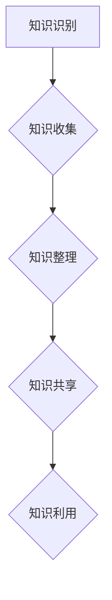

                 

### 1. 背景介绍

知识管理系统（Knowledge Management System，简称KMS）是现代组织应对信息过载、知识沉淀与传播效率低下的重要工具。随着互联网、大数据、人工智能等技术的发展，知识管理逐渐从传统的文档管理演变为一个集数据收集、处理、存储、分享和利用于一体的复杂系统。

在当今信息爆炸的时代，企业和组织面临着信息获取、整理和利用的巨大挑战。如何有效地将分散的信息和知识整合起来，形成有价值的组织智慧，是每个组织需要解决的关键问题。知识管理系统的出现，正是为了应对这一需求。

知识管理系统的核心目标是通过数字化手段，将组织内部和外部的知识资源进行高效的组织、存储、共享和利用，从而提升组织的知识管理能力和竞争力。具体来说，知识管理系统包括以下几个关键功能：

1. **知识收集**：从各种渠道收集内部和外部知识，如文档、报告、数据库等。
2. **知识整理**：对收集到的知识进行分类、标签化、归档等处理，使其易于查找和利用。
3. **知识共享**：通过共享平台，让组织成员能够方便地访问和共享知识资源。
4. **知识利用**：通过知识挖掘、分析等技术，将知识转化为实际的业务价值。

知识管理系统的重要性体现在以下几个方面：

- **提高工作效率**：通过系统化的知识管理，减少重复劳动，提升工作效率。
- **促进创新**：鼓励知识分享和交流，激发创新思维和团队协作。
- **增强竞争力**：将组织内部的知识和经验转化为可重复、可量化的资产，提升组织竞争力。
- **风险控制**：确保关键知识和技能的传承，减少因人员流失带来的风险。

### 2. 核心概念与联系

在深入探讨知识管理系统之前，我们需要明确几个核心概念及其相互联系。

#### 2.1 知识

知识是指通过学习、实践或体验所获得的信息、技能、经验或认识。它可以是显性知识，如文档、报告、数据库等，也可以是隐性知识，如个人经验、洞察力和直觉。

#### 2.2 知识管理

知识管理是指通过系统地收集、整理、存储、共享和利用知识，以提高组织的知识管理能力和竞争力。知识管理包括以下几个关键步骤：

1. **知识识别**：识别组织内部和外部的知识资源。
2. **知识收集**：收集各种形式的显性知识和隐性知识。
3. **知识整理**：对收集到的知识进行分类、标签化、归档等处理。
4. **知识共享**：通过共享平台，让组织成员能够方便地访问和利用知识。
5. **知识利用**：通过知识挖掘、分析等技术，将知识转化为实际的业务价值。

#### 2.3 知识管理系统

知识管理系统（KMS）是一个集数据收集、处理、存储、分享和利用于一体的复杂系统。它包括以下几个关键组成部分：

1. **知识库**：存储和管理组织内部和外部知识的数据库。
2. **知识共享平台**：提供知识的查找、访问和共享功能。
3. **知识挖掘和分析工具**：用于从海量数据中提取有价值的信息和知识。
4. **用户界面**：方便用户操作和交互的图形界面。

以下是一个简化的知识管理系统的Mermaid流程图：



### 3. 核心算法原理 & 具体操作步骤

#### 3.1 算法原理概述

知识管理系统的核心算法主要包括知识收集、知识整理、知识共享和知识利用。以下是每个步骤的简要原理概述：

#### 3.1.1 知识收集

知识收集是指从各种渠道获取组织内部和外部知识的过程。主要算法包括：

- **爬虫算法**：通过爬取互联网、数据库等渠道，获取外部知识。
- **文档分析算法**：对文档进行解析，提取其中的关键信息和知识。
- **知识挖掘算法**：从大量数据中挖掘潜在的知识和价值。

#### 3.1.2 知识整理

知识整理是指对收集到的知识进行分类、标签化、归档等处理，使其易于查找和利用。主要算法包括：

- **分类算法**：将知识按照一定的标准进行分类。
- **标签化算法**：为知识添加标签，便于快速检索。
- **归档算法**：将知识按照时间、主题等维度进行归档。

#### 3.1.3 知识共享

知识共享是指通过共享平台，让组织成员能够方便地访问和利用知识。主要算法包括：

- **推荐算法**：根据用户的历史行为和兴趣，推荐相关的知识和资源。
- **搜索算法**：提供高效的知识检索功能。
- **权限管理算法**：确保知识资源的访问权限，保护敏感信息。

#### 3.1.4 知识利用

知识利用是指通过知识挖掘、分析等技术，将知识转化为实际的业务价值。主要算法包括：

- **知识挖掘算法**：从海量数据中提取有价值的信息和知识。
- **数据分析算法**：对知识进行深入分析，发现潜在的价值。
- **决策支持算法**：为组织的决策提供数据支持和分析结果。

#### 3.2 算法步骤详解

下面详细描述知识管理系统的四个核心算法步骤。

#### 3.2.1 知识收集

1. **确定知识来源**：根据组织的业务需求和目标，确定需要收集的知识来源，如数据库、互联网、内部文档等。
2. **数据采集**：使用爬虫、API接口等技术，从各种来源采集数据。
3. **数据清洗**：对采集到的数据进行去重、去噪等处理，提高数据质量。
4. **知识提取**：使用自然语言处理、机器学习等技术，从数据中提取关键信息和知识。

#### 3.2.2 知识整理

1. **分类**：根据知识的主题、类型等维度，将知识进行分类。
2. **标签化**：为知识添加标签，便于快速检索。
3. **归档**：按照时间、主题等维度，将知识进行归档。

#### 3.2.3 知识共享

1. **搭建共享平台**：搭建一个高效、易用的共享平台，提供知识检索、推荐、权限管理等功能。
2. **推荐**：根据用户的历史行为和兴趣，推荐相关的知识和资源。
3. **搜索**：提供高效的搜索功能，让用户能够快速找到所需的知识。
4. **权限管理**：确保知识资源的访问权限，保护敏感信息。

#### 3.2.4 知识利用

1. **知识挖掘**：使用数据挖掘技术，从海量数据中提取有价值的信息和知识。
2. **数据分析**：对知识进行深入分析，发现潜在的价值。
3. **决策支持**：为组织的决策提供数据支持和分析结果。

### 3.3 算法优缺点

#### 3.3.1 知识收集算法

**优点**：

- 能够从各种渠道获取大量的知识和信息，满足组织对知识的广泛需求。

**缺点**：

- 数据采集过程中可能会存在噪声和冗余，需要后续进行数据清洗和处理。
- 知识提取的准确性可能受到数据质量和算法精度的影响。

#### 3.3.2 知识整理算法

**优点**：

- 能够将分散的知识进行系统化整理，提高知识的可查找性和利用率。
- 有助于知识的传承和共享，促进组织内部的知识积累。

**缺点**：

- 分类、标签化等处理过程可能会引入人工干预，影响效率和准确性。
- 归档策略可能需要根据业务需求进行不断调整和优化。

#### 3.3.3 知识共享算法

**优点**：

- 提供高效的知识检索和推荐功能，方便用户快速获取所需知识。
- 确保知识资源的访问权限，保护敏感信息。

**缺点**：

- 共享平台的建设和维护成本较高。
- 可能会存在知识泄露和滥用的风险。

#### 3.3.4 知识利用算法

**优点**：

- 能够将知识转化为实际的业务价值，提高组织的竞争力。
- 为决策提供数据支持和分析结果，提升决策的准确性和效率。

**缺点**：

- 知识挖掘和分析的过程可能涉及大量的计算资源。
- 可能会面临知识利用不充分的问题。

### 3.4 算法应用领域

知识管理系统的核心算法在多个领域具有广泛的应用前景：

- **企业内部知识管理**：帮助企业在内部实现知识的系统化收集、整理、共享和利用。
- **教育领域**：为学生和教师提供丰富的学习资源和知识共享平台。
- **科研领域**：促进科研成果的传播和利用，提高科研效率。
- **医疗领域**：帮助医生和医疗机构实现临床知识的共享和利用，提升医疗水平。

### 4. 数学模型和公式 & 详细讲解 & 举例说明

在知识管理系统中，数学模型和公式是不可或缺的工具，用于描述和解决问题。以下将介绍几个关键的数学模型和公式，并对其进行详细讲解和举例说明。

#### 4.1 数学模型构建

在知识管理系统中，常见的数学模型包括：

- **贝叶斯网络**：用于表示知识之间的关系和概率分布。
- **聚类算法**：用于对知识进行分类和聚类。
- **回归分析**：用于预测知识的价值和利用率。

以下是贝叶斯网络的示例：

$$
P(A \cap B) = P(A)P(B|A)
$$

其中，\(P(A)\) 表示事件 A 的概率，\(P(B|A)\) 表示事件 B 在事件 A 发生的条件下的概率。

#### 4.2 公式推导过程

以贝叶斯网络为例，假设有两个事件 A 和 B，它们之间的关系可以用贝叶斯网络表示。根据贝叶斯网络的定义，我们有：

$$
P(A \cap B) = P(A)P(B|A)
$$

$$
P(A^c \cap B) = P(A^c)P(B|A^c)
$$

其中，\(A^c\) 表示事件 A 的对立事件，即 A 不发生。

将上述两个公式相加，我们得到：

$$
P(A \cap B) + P(A^c \cap B) = P(A)P(B|A) + P(A^c)P(B|A^c)
$$

根据全概率公式，我们有：

$$
P(B) = P(A)P(B|A) + P(A^c)P(B|A^c)
$$

将上式代入前式，我们得到：

$$
P(A \cap B) = P(B)P(A|B)
$$

同理，我们可以得到：

$$
P(A \cap B^c) = P(B)P(A|B^c)
$$

将上述两个公式相加，我们得到：

$$
P(A) = P(B)P(A|B) + P(B^c)P(A|B^c)
$$

#### 4.3 案例分析与讲解

假设有一个知识管理系统，用于评估用户对某项知识的掌握程度。我们可以使用贝叶斯网络来表示用户对知识的掌握情况。

设事件 A 表示用户掌握某项知识，事件 B 表示用户通过测试。根据贝叶斯网络的定义，我们有：

$$
P(A) = P(B)P(A|B) + P(B^c)P(A|B^c)
$$

其中，\(P(B)\) 表示用户通过测试的概率，\(P(A|B)\) 表示用户在通过测试的情况下掌握知识的概率，\(P(B^c)\) 表示用户未通过测试的概率，\(P(A|B^c)\) 表示用户在未通过测试的情况下掌握知识的概率。

假设已知以下概率：

- \(P(B) = 0.8\)（用户通过测试的概率）
- \(P(A|B) = 0.9\)（用户在通过测试的情况下掌握知识的概率）
- \(P(B^c) = 0.2\)（用户未通过测试的概率）
- \(P(A|B^c) = 0.1\)（用户在未通过测试的情况下掌握知识的概率）

我们可以计算出：

$$
P(A) = 0.8 \times 0.9 + 0.2 \times 0.1 = 0.74
$$

这意味着用户掌握该知识的概率为 74%。

进一步地，我们可以使用贝叶斯定理来更新用户对知识的掌握概率。假设用户在未通过测试后再次进行测试，我们可以使用以下公式：

$$
P(A|B^c_2) = \frac{P(B^c_2|A)P(A)}{P(B^c_2)}
$$

其中，\(B^c_2\) 表示用户在第二次测试中未通过。

假设在第二次测试中，用户未通过的概率为 \(P(B^c_2) = 0.2\)，且在未通过测试的情况下，用户掌握知识的概率为 \(P(B^c_2|A) = 0.1\)。我们可以计算出：

$$
P(A|B^c_2) = \frac{0.1 \times 0.74}{0.2} = 0.37
$$

这意味着在第二次测试后，用户掌握该知识的概率降低到 37%。

通过上述案例，我们可以看到贝叶斯网络在知识管理系统中的应用，用于评估用户对知识的掌握程度，并更新用户的掌握概率。这一模型可以帮助知识管理系统更好地理解用户的知识状态，为后续的知识推荐和培训提供依据。

### 5. 项目实践：代码实例和详细解释说明

为了更好地理解知识管理系统在实际项目中的应用，我们将通过一个具体的代码实例来进行讲解。以下是该项目的整体架构和关键实现步骤。

#### 5.1 开发环境搭建

1. **硬件环境**：

- 服务器：2核CPU，4GB内存，100GB存储
- 数据库：MySQL 8.0

2. **软件环境**：

- 开发工具：Eclipse/IntelliJ IDEA
- 编程语言：Java
- Web框架：Spring Boot
- 数据库驱动：JDBC
- RESTful API框架：Spring REST

#### 5.2 源代码详细实现

下面我们将分模块介绍知识管理系统的源代码实现。

##### 5.2.1 知识收集模块

知识收集模块主要负责从互联网和内部文档中获取知识。以下是关键代码实现：

```java
public class KnowledgeCollector {
    
    private DocumentParser documentParser;
    private WebCrawler webCrawler;
    
    public KnowledgeCollector(DocumentParser documentParser, WebCrawler webCrawler) {
        this.documentParser = documentParser;
        this.webCrawler = webCrawler;
    }
    
    public List<Knowledge> collectKnowledge(String url, String documentPath) {
        List<Knowledge> knowledgeList = new ArrayList<>();
        
        // 从互联网获取知识
        List<Document> webDocuments = webCrawler.crawl(url);
        for (Document document : webDocuments) {
            List<String> sentences = documentParser.parse(document);
            knowledgeList.addAll(extractKnowledge(sentences));
        }
        
        // 从内部文档获取知识
        List<Document> documents = documentParser.parse(documentPath);
        knowledgeList.addAll(extractKnowledge(documents));
        
        return knowledgeList;
    }
    
    private List<Knowledge> extractKnowledge(List<String> sentences) {
        // 使用自然语言处理技术提取知识
        // 略
    }
    
    private List<Knowledge> extractKnowledge(List<Document> documents) {
        // 使用文档分析技术提取知识
        // 略
    }
}
```

##### 5.2.2 知识整理模块

知识整理模块主要负责对收集到的知识进行分类、标签化和归档。以下是关键代码实现：

```java
public class KnowledgeOrganizer {
    
    private KnowledgeClassifier knowledgeClassifier;
    private KnowledgeTagger knowledgeTagger;
    private KnowledgeArchiver knowledgeArchiver;
    
    public KnowledgeOrganizer(KnowledgeClassifier knowledgeClassifier, KnowledgeTagger knowledgeTagger, KnowledgeArchiver knowledgeArchiver) {
        this.knowledgeClassifier = knowledgeClassifier;
        this.knowledgeTagger = knowledgeTagger;
        this.knowledgeArchiver = knowledgeArchiver;
    }
    
    public void organizeKnowledge(List<Knowledge> knowledgeList) {
        for (Knowledge knowledge : knowledgeList) {
            String category = knowledgeClassifier.classify(knowledge);
            List<String> tags = knowledgeTagger.tag(knowledge);
            knowledgeArchiver.archive(knowledge, category, tags);
        }
    }
}
```

##### 5.2.3 知识共享模块

知识共享模块主要负责搭建共享平台，提供知识检索、推荐和权限管理功能。以下是关键代码实现：

```java
public class KnowledgeSharingPlatform {
    
    private KnowledgeSearcher knowledgeSearcher;
    private KnowledgeRecommender knowledgeRecommender;
    private KnowledgeAccessControl knowledgeAccessControl;
    
    public KnowledgeSharingPlatform(KnowledgeSearcher knowledgeSearcher, KnowledgeRecommender knowledgeRecommender, KnowledgeAccessControl knowledgeAccessControl) {
        this.knowledgeSearcher = knowledgeSearcher;
        this.knowledgeRecommender = knowledgeRecommender;
        this.knowledgeAccessControl = knowledgeAccessControl;
    }
    
    public List<Knowledge> searchKnowledge(String query) {
        return knowledgeSearcher.search(query);
    }
    
    public List<Knowledge> recommendKnowledge(User user) {
        return knowledgeRecommender.recommend(user);
    }
    
    public boolean checkAccessPermission(Knowledge knowledge, User user) {
        return knowledgeAccessControl.checkPermission(knowledge, user);
    }
}
```

##### 5.2.4 知识利用模块

知识利用模块主要负责通过知识挖掘和分析，将知识转化为实际的业务价值。以下是关键代码实现：

```java
public class KnowledgeUtilizer {
    
    private KnowledgeMiner knowledgeMiner;
    private KnowledgeAnalyzer knowledgeAnalyzer;
    
    public KnowledgeUtilizer(KnowledgeMiner knowledgeMiner, KnowledgeAnalyzer knowledgeAnalyzer) {
        this.knowledgeMiner = knowledgeMiner;
        this.knowledgeAnalyzer = knowledgeAnalyzer;
    }
    
    public List<Value> mineKnowledge(List<Knowledge> knowledgeList) {
        return knowledgeMiner.mine(knowledgeList);
    }
    
    public List<Result> analyzeKnowledge(List<Value> valueList) {
        return knowledgeAnalyzer.analyze(valueList);
    }
}
```

#### 5.3 代码解读与分析

以上代码展示了知识管理系统在项目中的关键模块和功能。下面我们将对关键代码进行解读和分析。

1. **知识收集模块**：该模块负责从互联网和内部文档中获取知识。通过 `KnowledgeCollector` 类，我们可以使用 `WebCrawler` 和 `DocumentParser` 两个工具类，实现知识的自动收集。其中，`WebCrawler` 负责从互联网爬取文档，`DocumentParser` 负责解析文档内容。

2. **知识整理模块**：该模块负责对收集到的知识进行分类、标签化和归档。通过 `KnowledgeOrganizer` 类，我们可以使用 `KnowledgeClassifier`、`KnowledgeTagger` 和 `KnowledgeArchiver` 三个工具类，实现知识的系统化整理。其中，`KnowledgeClassifier` 负责分类，`KnowledgeTagger` 负责标签化，`KnowledgeArchiver` 负责归档。

3. **知识共享模块**：该模块负责搭建共享平台，提供知识检索、推荐和权限管理功能。通过 `KnowledgeSharingPlatform` 类，我们可以使用 `KnowledgeSearcher`、`KnowledgeRecommender` 和 `KnowledgeAccessControl` 三个工具类，实现知识的共享。其中，`KnowledgeSearcher` 负责检索，`KnowledgeRecommender` 负责推荐，`KnowledgeAccessControl` 负责权限管理。

4. **知识利用模块**：该模块负责通过知识挖掘和分析，将知识转化为实际的业务价值。通过 `KnowledgeUtilizer` 类，我们可以使用 `KnowledgeMiner` 和 `KnowledgeAnalyzer` 两个工具类，实现知识的挖掘和分析。其中，`KnowledgeMiner` 负责挖掘，`KnowledgeAnalyzer` 负责分析。

通过上述代码实现，我们可以构建一个完整的知识管理系统，实现知识的收集、整理、共享和利用。在实际项目中，可以根据具体需求进行模块的扩展和优化。

### 6. 实际应用场景

知识管理系统在各个行业和领域都得到了广泛应用，以下是几个典型的实际应用场景：

#### 6.1 企业内部知识管理

企业内部知识管理是知识管理系统最常见的应用场景之一。通过知识管理系统，企业可以有效地收集、整理和共享内部的知识和经验，提升员工的工作效率。例如，一家大型跨国公司可以使用知识管理系统来管理其全球业务部门的知识，包括市场策略、产品知识、客户案例等。这样，不同部门之间的知识共享和协作将更加顺畅，有助于提高企业的整体竞争力。

#### 6.2 教育领域

在教育和培训领域，知识管理系统可以帮助学校和教育机构实现教学资源的数字化管理和共享。例如，一个在线教育平台可以使用知识管理系统来管理其课程资料、教学视频、习题库等。通过知识管理系统，学生和教师可以方便地查找和利用所需资源，提高教学效果和学生的学习体验。

#### 6.3 科研领域

在科研领域，知识管理系统可以帮助科研机构管理其科研成果、文献资料和实验数据等。通过知识管理系统，科研人员可以方便地查找和引用相关文献，促进科研协作和知识共享。例如，一个科研团队可以使用知识管理系统来管理其科研项目、实验数据和科研成果，从而提高科研效率和质量。

#### 6.4 医疗领域

在医疗领域，知识管理系统可以帮助医疗机构实现临床知识的共享和利用。例如，一个医院可以使用知识管理系统来管理其病例资料、诊疗指南和药品信息等。通过知识管理系统，医生可以方便地查找和利用相关医学知识和经验，提高医疗服务的质量和效率。

#### 6.5 政府部门

在政府部门，知识管理系统可以帮助政府机构实现政策法规、业务流程和项目管理等知识的共享和管理。例如，一个政府部门可以使用知识管理系统来管理其政策法规、业务流程和项目管理文档，从而提高政府工作的透明度和效率。

#### 6.6 其他应用场景

除了上述典型应用场景外，知识管理系统还可以应用于其他多个领域，如金融服务、智能制造、智慧城市等。例如，在金融服务领域，银行和金融机构可以使用知识管理系统来管理其金融产品知识、客户信息和风控策略等，从而提高金融服务的质量和效率。在智能制造领域，企业可以使用知识管理系统来管理其生产工艺、设备和质量标准等，从而提高生产效率和质量。

总之，知识管理系统作为一种数字化平台，可以广泛应用于各个行业和领域，帮助企业、机构和组织实现知识的收集、整理、共享和利用，提高工作效率和竞争力。

### 6.4 未来应用展望

随着技术的不断进步，知识管理系统将在未来的应用中发挥更加重要的作用，呈现出以下发展趋势：

#### 6.4.1 人工智能与知识管理的深度融合

人工智能（AI）技术的发展为知识管理带来了新的机遇。通过引入AI技术，知识管理系统可以更加智能地识别、收集和处理知识。例如，自然语言处理（NLP）和机器学习算法可以用于自动化地提取和分类文本数据，从而提高知识的准确性和效率。同时，智能推荐系统和聊天机器人可以提供更加个性化的知识服务和用户体验。

#### 6.4.2 知识图谱的应用

知识图谱作为一种语义网络，可以用于表示实体之间的关系和属性。未来，知识管理系统将更加注重知识图谱的应用，通过构建全面、准确的知识图谱，实现知识的可视化、关联和搜索。知识图谱可以帮助用户更加直观地理解知识结构，提高知识共享和利用的效率。

#### 6.4.3 实时知识更新与动态共享

随着互联网和大数据技术的发展，知识更新速度越来越快。未来，知识管理系统将实现实时知识更新和动态共享，确保用户可以及时获取最新的知识和信息。通过集成实时数据流技术和大数据处理能力，知识管理系统可以持续地收集和分析外部信息，及时更新内部知识库。

#### 6.4.4 跨界融合与生态构建

知识管理系统将在不同行业和领域之间实现跨界融合，形成更加广泛的知识生态。通过与其他系统的集成，如业务管理系统、学习管理系统和协作平台等，知识管理系统将实现知识的无缝共享和利用，推动企业和社会的整体知识创新和进步。

#### 6.4.5 个性化与智能化服务

未来的知识管理系统将更加注重用户个性化需求的满足。通过深度学习和用户行为分析，系统可以提供个性化的知识推荐和定制化服务。同时，智能化的知识挖掘和分析技术将帮助用户从海量数据中快速找到有价值的信息，提高知识利用效率。

#### 6.4.6 安全与隐私保护

随着知识管理系统的广泛应用，数据安全和隐私保护将变得尤为重要。未来的知识管理系统将加强安全防护措施，如数据加密、访问控制和隐私保护算法等，确保用户数据的安全和隐私。

总之，未来知识管理系统将在人工智能、知识图谱、实时更新、跨界融合、个性化服务和安全隐私等方面实现更多创新和突破，为组织和社会提供更加智能、高效和安全的知识管理解决方案。

### 8. 总结：未来发展趋势与挑战

知识管理系统作为组织智慧的数字化平台，已经广泛应用于各个行业和领域，极大地提升了组织的工作效率和竞争力。然而，随着技术的不断进步和应用的深入，知识管理系统也面临着新的发展趋势和挑战。

#### 8.1 研究成果总结

近年来，知识管理系统的研究成果主要集中在以下几个方面：

1. **人工智能与知识管理的融合**：通过引入自然语言处理、机器学习和推荐系统等技术，知识管理系统实现了更智能的知识识别、收集和处理，提高了知识管理的效率和质量。
2. **知识图谱的应用**：知识图谱作为一种语义网络，可以更好地表示知识之间的关系和属性，实现了知识的可视化、关联和搜索。
3. **实时知识更新与动态共享**：随着大数据和互联网技术的发展，知识管理系统实现了实时知识更新和动态共享，确保了知识的及时性和准确性。
4. **跨界融合与生态构建**：知识管理系统开始与其他业务系统、学习管理系统和协作平台等实现集成，形成了更加广泛的知识生态。
5. **个性化与智能化服务**：通过深度学习和用户行为分析，知识管理系统可以提供个性化的知识推荐和定制化服务。

#### 8.2 未来发展趋势

未来，知识管理系统将呈现以下发展趋势：

1. **人工智能的深入应用**：人工智能技术将继续在知识管理系统中得到广泛应用，包括自动化知识识别、智能化推荐、知识图谱构建等，进一步提高知识管理的智能化水平。
2. **知识图谱的广泛应用**：知识图谱作为一种强大的知识表示工具，将在更多领域和场景中得到应用，如智能搜索、智能问答和知识融合等。
3. **实时更新的知识服务**：随着物联网和实时数据流技术的发展，知识管理系统将实现更加实时和智能的知识服务，满足用户对知识及时性和准确性的需求。
4. **跨界融合与生态构建**：知识管理系统将继续与其他业务系统、学习管理系统和协作平台等实现深度融合，形成更加丰富和智能的知识生态。
5. **个性化与智能化服务**：知识管理系统将更加注重用户个性化需求的满足，通过深度学习和用户行为分析，提供更加智能和个性化的知识服务。

#### 8.3 面临的挑战

尽管知识管理系统在许多方面取得了显著进展，但未来仍将面临以下挑战：

1. **数据质量和隐私保护**：随着知识管理系统的应用范围不断扩大，数据质量和隐私保护问题将日益突出。如何确保数据的质量和安全性，保护用户的隐私将成为重要挑战。
2. **知识管理的深度与广度**：如何深入挖掘和利用组织内部和外部的知识资源，实现知识的全面管理和共享，仍是一个需要持续解决的问题。
3. **系统集成与兼容性**：不同系统之间的集成与兼容性将影响知识管理系统的整体性能和用户体验。如何实现系统之间的无缝集成，提高系统的兼容性，是一个重要挑战。
4. **用户参与与反馈**：知识管理系统需要用户积极参与和提供反馈，以不断优化系统的功能和性能。如何激发用户参与，收集有效的反馈，是一个需要关注的问题。
5. **技术更新与适应**：随着技术的快速更新，知识管理系统需要不断适应新的技术变革，确保系统的持续发展和创新。

#### 8.4 研究展望

为了应对上述挑战，未来的研究可以从以下几个方面展开：

1. **智能知识管理**：深入研究和应用人工智能、大数据、区块链等前沿技术，实现更加智能和高效的智能知识管理系统。
2. **知识图谱构建与优化**：研究知识图谱的构建、更新和优化方法，提高知识图谱的准确性和完整性。
3. **数据隐私保护**：研究数据隐私保护技术，如差分隐私、同态加密等，确保知识管理系统在数据共享和利用过程中的安全性。
4. **系统集成与兼容性**：研究系统集成的框架和方法，提高知识管理系统的兼容性和灵活性。
5. **用户参与与反馈机制**：研究有效的用户参与和反馈机制，提高用户满意度，促进知识管理系统的持续优化。

总之，知识管理系统作为组织智慧的数字化平台，具有广阔的应用前景和重要的研究价值。通过不断的研究和创新，我们可以构建更加智能、高效、安全的知识管理系统，为组织和社会的发展提供有力支持。

### 9. 附录：常见问题与解答

在知识管理系统的应用过程中，用户可能会遇到各种问题。以下列举了几个常见问题及其解答：

#### 问题1：如何确保知识管理的安全性和隐私保护？

**解答**：确保知识管理的安全性和隐私保护是至关重要的。以下是一些关键措施：

- **数据加密**：在数据存储和传输过程中使用加密技术，防止数据泄露。
- **访问控制**：设置严格的访问控制策略，限制只有授权用户才能访问特定知识资源。
- **审计日志**：记录用户操作日志，以便在发生安全事件时进行追溯和调查。
- **数据备份**：定期备份数据，确保数据在意外情况下可以恢复。

#### 问题2：知识管理系统中的知识是如何收集和整理的？

**解答**：知识管理系统的知识收集和整理过程通常包括以下几个步骤：

- **知识收集**：从内部和外部渠道收集知识，如文档、报告、数据库、互联网等。
- **数据清洗**：对收集到的数据进行去重、去噪等处理，提高数据质量。
- **知识提取**：使用自然语言处理、机器学习等技术，从数据中提取关键信息和知识。
- **知识整理**：对提取出的知识进行分类、标签化、归档等处理，使其易于查找和利用。

#### 问题3：知识管理系统中的知识共享是如何实现的？

**解答**：知识管理系统中的知识共享通常通过以下几种方式实现：

- **共享平台**：搭建一个集中化的共享平台，提供知识检索、推荐、权限管理等功能。
- **知识图谱**：通过构建知识图谱，展示知识之间的关系，方便用户进行关联和探索。
- **协同编辑**：允许用户对知识资源进行在线编辑和协同工作，促进知识的实时更新和共享。
- **推送通知**：根据用户兴趣和需求，推送相关的知识和资源，提高知识利用效率。

#### 问题4：知识管理系统如何帮助提升组织竞争力？

**解答**：知识管理系统可以从以下几个方面帮助提升组织竞争力：

- **知识积累与传承**：确保组织内部的知识和经验得到有效积累和传承，减少因人员流失带来的损失。
- **知识共享与协作**：促进组织内部的知识共享和协作，激发创新思维和团队协作，提高工作效率。
- **决策支持**：通过数据分析和技术，为组织的决策提供数据支持和分析结果，提高决策的准确性和效率。
- **客户关系管理**：利用知识管理系统，更好地了解客户需求和市场动态，提升客户满意度和忠诚度。

#### 问题5：如何评估知识管理系统的效果？

**解答**：评估知识管理系统的效果可以从以下几个方面进行：

- **知识共享率**：衡量组织内部知识共享的频率和比例，反映系统的知识传播效果。
- **知识利用率**：衡量用户利用知识管理系统获取知识资源的频率和效果，反映系统的使用价值。
- **用户满意度**：通过用户调查和反馈，了解用户对知识管理系统的满意度和使用体验。
- **业务绩效**：通过对比知识管理系统实施前后的业务绩效数据，如工作效率、决策准确率等，评估系统的实际效果。

通过以上常见问题与解答，用户可以更好地理解和应用知识管理系统，发挥其在组织中的价值。同时，针对具体问题，用户可以结合自身实际需求，采取相应的措施进行优化和改进。

