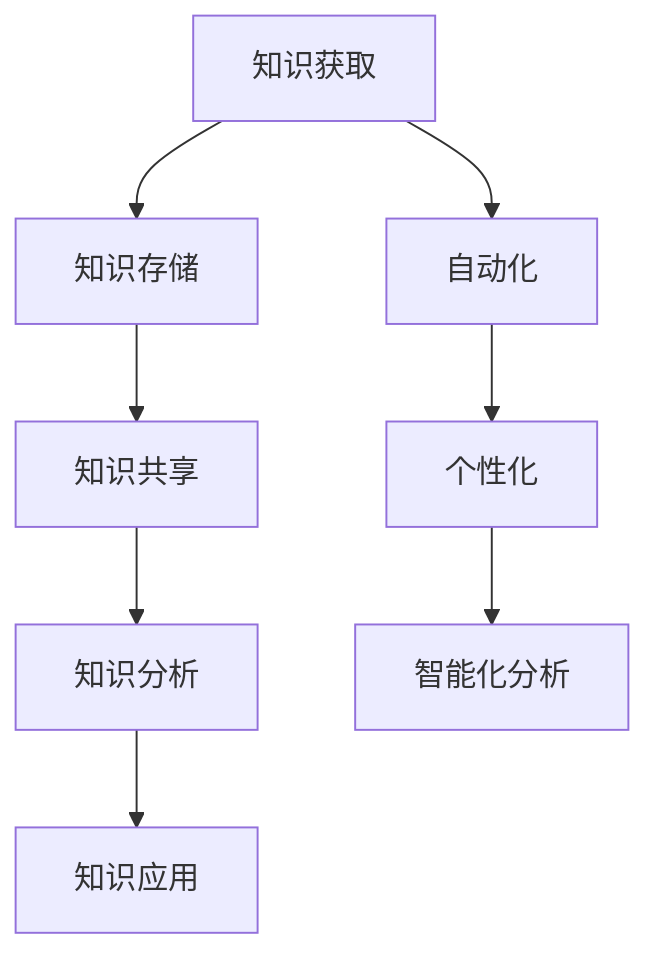

                 

  
## 1. 背景介绍

在当今快速发展的信息时代，知识管理已经成为组织和企业维持竞争优势的关键。然而，随着数据量的激增和知识种类的多样化，传统的知识管理方法已经难以满足高效、智能化的需求。知识管理软件作为一种能够自动识别、组织、存储和共享知识的工具，正在成为知识管理领域的热点。

知识管理软件的兴起，源于信息爆炸和数据过载带来的挑战。在过去的几十年中，互联网和数字技术的飞速发展，使得信息的获取变得前所未有的容易。然而，这种信息过载的现象也使得人们难以从海量的数据中找到有价值的信息。与此同时，知识经济时代的到来，使得知识成为企业的重要资产，如何有效管理和利用这些知识，成为企业关注的焦点。

知识管理软件应运而生，它通过集成多种先进技术，如人工智能、大数据分析、自然语言处理等，实现知识的自动化识别、分类、存储和共享，从而提高知识管理的效率和效果。这些软件不仅能够帮助企业更好地管理和利用其知识资产，还能够为员工提供便捷的知识获取渠道，促进知识的创新和传播。

本文将围绕知识管理软件的智能化特点，详细探讨其核心概念、算法原理、数学模型、项目实践和实际应用场景，旨在为读者提供一个全面、深入的了解。

## 2. 核心概念与联系

### 2.1 知识管理

知识管理（Knowledge Management，KM）是指通过识别、组织、存储、共享和利用知识的过程，以提高个人、团队和组织的能力。知识管理不仅仅关注知识的存储和共享，更注重知识的创造、转移和应用。

知识管理的主要目标是：

1. **知识获取**：通过多种渠道获取外部和内部的知识。
2. **知识存储**：将知识以结构化的方式存储，以便于检索和利用。
3. **知识共享**：促进知识的共享和传播，提高知识的利用效率。
4. **知识创新**：通过知识的融合和碰撞，促进新的知识产生。

知识管理的方法和技术包括：

1. **文档管理**：通过文档库存储和管理文档资料。
2. **知识库**：建立集中的知识库，存储各种类型的知识。
3. **协作平台**：提供在线协作工具，促进知识的交流和创新。
4. **培训与分享**：通过培训、研讨会等形式，促进知识的传播和应用。

### 2.2 知识管理软件

知识管理软件（Knowledge Management Software，KMS）是一种专门用于知识管理的工具，它通过集成多种技术和功能，帮助企业实现知识的自动化管理。知识管理软件的主要功能包括：

1. **知识获取**：自动化收集和整合内外部知识，如文档、报告、邮件、网页等。
2. **知识存储**：将知识以结构化的方式存储在数据库中，便于检索和利用。
3. **知识共享**：提供知识共享和协作功能，促进知识的传播和应用。
4. **知识分析**：利用人工智能、大数据分析等技术，对知识进行深度分析，发现知识的价值和应用场景。
5. **知识应用**：通过自动化工具和接口，将知识应用于业务流程中，提高工作效率。

### 2.3 智能化知识管理

智能化知识管理是指通过引入人工智能、大数据分析、自然语言处理等技术，实现知识管理的自动化和智能化。智能化知识管理的核心在于：

1. **自动化**：通过自动化技术，实现知识的获取、存储、共享和分析，减少人工干预。
2. **个性化**：根据用户的需求和偏好，提供个性化的知识推荐和服务。
3. **智能化分析**：利用人工智能技术，对知识进行深度分析，发现知识之间的关系和潜在价值。

### 2.4 核心概念原理与架构

为了更好地理解知识管理软件的智能化特点，我们使用Mermaid流程图来展示其核心概念原理与架构。



### 2.5 核心概念联系总结

知识管理、知识管理软件和智能化知识管理是紧密相连的。知识管理是知识管理软件的基础，而知识管理软件是实现智能化知识管理的工具。智能化知识管理不仅提高了知识管理的效率和效果，还为知识的创新和传播提供了新的途径。

## 3. 核心算法原理 & 具体操作步骤

### 3.1 算法原理概述

知识管理软件的核心在于其智能化的算法，这些算法用于实现知识的获取、存储、共享、分析和应用。以下将介绍几种核心算法的原理：

1. **知识获取算法**：通过数据爬取、文档分析、用户反馈等方式，自动化获取内外部知识。
2. **知识存储算法**：采用自然语言处理技术，将知识结构化存储，便于检索和利用。
3. **知识共享算法**：利用社交网络分析、推荐系统等技术，实现知识的共享和传播。
4. **知识分析算法**：通过机器学习、深度学习等技术，对知识进行深度分析，发现知识之间的关系和价值。
5. **知识应用算法**：结合业务流程，将知识自动化应用于实际工作中，提高工作效率。

### 3.2 算法步骤详解

#### 3.2.1 知识获取算法

知识获取算法的具体步骤如下：

1. **数据爬取**：利用网络爬虫技术，自动化获取互联网上的知识资源，如论文、报告、新闻等。
2. **文档分析**：使用自然语言处理技术，对爬取的文档进行解析，提取关键词、主题和语义信息。
3. **用户反馈**：通过用户的行为数据，如浏览记录、搜索关键词等，获取用户感兴趣的知识。

#### 3.2.2 知识存储算法

知识存储算法的具体步骤如下：

1. **知识结构化**：将获取到的知识进行结构化处理，如将文本转换为知识图谱，便于检索和利用。
2. **存储优化**：采用索引技术，如倒排索引、B树索引等，提高知识检索效率。
3. **数据备份与恢复**：定期对知识库进行备份，确保数据的完整性和安全性。

#### 3.2.3 知识共享算法

知识共享算法的具体步骤如下：

1. **社交网络分析**：利用社交网络分析技术，如PageRank算法，确定知识的共享优先级。
2. **推荐系统**：采用推荐系统技术，根据用户的行为和兴趣，为用户推荐相关知识点。
3. **知识推送**：通过电子邮件、即时通讯工具等，将知识推送给相关用户。

#### 3.2.4 知识分析算法

知识分析算法的具体步骤如下：

1. **知识关联分析**：通过机器学习算法，分析知识之间的关联关系，构建知识图谱。
2. **知识价值评估**：利用自然语言处理技术，评估知识的价值和应用前景。
3. **知识更新**：根据知识的利用情况和用户反馈，定期更新知识库。

#### 3.2.5 知识应用算法

知识应用算法的具体步骤如下：

1. **业务流程结合**：将知识库与业务流程结合，实现知识的自动化应用。
2. **自动化工具集成**：利用自动化工具，如脚本、API等，实现知识的自动化处理。
3. **反馈优化**：根据业务反馈，优化知识库的内容和结构，提高知识的应用效果。

### 3.3 算法优缺点

#### 知识获取算法

**优点**：

- 自动化获取知识，提高效率。
- 获取广泛，涵盖多种知识类型。

**缺点**：

- 数据质量难以保证。
- 可能侵犯版权和隐私。

#### 知识存储算法

**优点**：

- 知识结构化，便于检索和利用。
- 提高知识库的可用性和可靠性。

**缺点**：

- 知识库维护成本高。
- 数据更新和备份复杂。

#### 知识共享算法

**优点**：

- 提高知识传播效率。
- 增强知识的利用价值。

**缺点**：

- 社交网络分析可能存在偏差。
- 推荐系统可能面临冷启动问题。

#### 知识分析算法

**优点**：

- 发现知识之间的关系。
- 提高知识的利用率和价值。

**缺点**：

- 算法复杂，计算成本高。
- 结果可能存在偏差和不确定性。

#### 知识应用算法

**优点**：

- 实现知识的自动化应用。
- 提高工作效率。

**缺点**：

- 需要与业务流程紧密结合。
- 反馈优化需要时间。

### 3.4 算法应用领域

知识管理软件的算法广泛应用于多个领域：

1. **企业知识管理**：帮助企业管理知识资产，提高工作效率和创新能力。
2. **教育领域**：提供个性化学习推荐，促进知识的传播和应用。
3. **科研领域**：构建科研知识图谱，发现知识关联，提高科研效率。
4. **政府管理**：实现政务知识共享，提高政府决策的透明度和效率。

## 4. 数学模型和公式 & 详细讲解 & 举例说明

在知识管理软件的算法中，数学模型和公式起到了关键作用。以下将介绍几种核心的数学模型和公式，并对其进行详细讲解和举例说明。

### 4.1 数学模型构建

知识管理软件中的数学模型通常包括以下几个方面：

1. **数据预处理模型**：用于清洗和预处理原始数据，如缺失值处理、异常值检测等。
2. **知识提取模型**：用于从原始数据中提取有用的知识，如文本分类、实体识别等。
3. **知识评估模型**：用于评估知识的质量和价值，如文本相似度计算、知识价值评估等。
4. **知识推荐模型**：用于根据用户需求和兴趣推荐相关知识点，如协同过滤、基于内容的推荐等。

### 4.2 公式推导过程

以下是知识管理软件中常用的几个数学公式及其推导过程：

#### 4.2.1 文本分类公式

文本分类是知识提取的重要步骤，其核心公式为：

$$
P(y|X) = \frac{e^{w^T x}}{\sum_{i=1}^{n} e^{w_i^T x}}
$$

其中，$X$为文本特征向量，$y$为文本类别标签，$w$为模型参数向量，$e$为自然对数的底数。

推导过程如下：

1. **概率分布**：文本分类的目标是计算每个类别标签的概率分布。
2. **对数似然函数**：使用对数似然函数来最大化文本类别标签的概率。
3. **指数函数**：将对数似然函数转化为指数函数，便于计算。
4. **求和**：将所有类别标签的概率分布进行求和，得到总概率分布。

#### 4.2.2 文本相似度计算公式

文本相似度计算是知识评估的重要步骤，其核心公式为：

$$
similarity(A, B) = \frac{A \cdot B}{||A||_2 \cdot ||B||_2}
$$

其中，$A$和$B$为两个文本特征向量，$||A||_2$和$||B||_2$分别为它们的二范数。

推导过程如下：

1. **内积**：计算两个文本特征向量的内积，表示它们的相似程度。
2. **范数**：计算两个文本特征向量的二范数，表示它们的长度。
3. **归一化**：将内积除以两个范数的乘积，得到文本相似度的归一化值。

#### 4.2.3 知识价值评估公式

知识价值评估是知识评估的关键步骤，其核心公式为：

$$
value(k) = f(similarity(k, query), usage(k), freshness(k))
$$

其中，$k$为知识项，$query$为查询需求，$similarity(k, query)$为知识项与查询需求的相似度，$usage(k)$为知识项的利用次数，$freshness(k)$为知识项的更新时间。

推导过程如下：

1. **相似度**：计算知识项与查询需求的相似度，表示知识项的相关性。
2. **利用次数**：计算知识项的利用次数，表示知识项的应用频率。
3. **更新时间**：计算知识项的更新时间，表示知识项的新鲜程度。
4. **综合评估**：将相似度、利用次数和更新时间进行综合评估，得到知识项的价值。

### 4.3 案例分析与讲解

为了更好地理解上述数学模型和公式，我们通过一个案例来进行讲解。

#### 案例背景

假设我们有一个企业知识管理平台，用户可以上传和分享文档，平台需要根据用户查询需求和文档内容，推荐相关的文档。

#### 案例步骤

1. **数据预处理**：对用户上传的文档进行预处理，如去除停用词、分词等。
2. **知识提取**：使用文本分类模型，将文档分类为不同的主题。
3. **知识评估**：计算每个文档与用户查询需求的相似度，并根据利用次数和更新时间评估文档的价值。
4. **知识推荐**：根据评估结果，为用户推荐相关的文档。

#### 案例实现

1. **文本分类模型**：

   使用朴素贝叶斯分类器，对文档进行分类。假设有5个主题，分类器参数为$w_1, w_2, w_3, w_4, w_5$。

   - 文本特征向量：$x = (x_1, x_2, ..., x_n)$
   - 文本类别标签：$y = (y_1, y_2, ..., y_n)$

   分类公式为：

   $$
   P(y|X) = \frac{e^{w_y^T x}}{\sum_{i=1}^{5} e^{w_i^T x}}
   $$

   用户查询需求为：

   $$
   query = (0.1, 0.2, 0.3, 0.2, 0.2)
   $$

   某个文档的特征向量为：

   $$
   x = (0.5, 0.2, 0.1, 0.1, 0.1)
   $$

   分类结果为：

   $$
   P(y=1|X) = \frac{e^{w_1^T x}}{\sum_{i=1}^{5} e^{w_i^T x}} = \frac{e^{0.5 \cdot 0.5}}{e^{0.5 \cdot 0.5} + e^{0.2 \cdot 0.2} + e^{0.1 \cdot 0.1} + e^{0.1 \cdot 0.1} + e^{0.1 \cdot 0.1}} = 0.63
   $$

   $$
   P(y=2|X) = \frac{e^{w_2^T x}}{\sum_{i=1}^{5} e^{w_i^T x}} = \frac{e^{0.2 \cdot 0.2}}{e^{0.5 \cdot 0.5} + e^{0.2 \cdot 0.2} + e^{0.1 \cdot 0.1} + e^{0.1 \cdot 0.1} + e^{0.1 \cdot 0.1}} = 0.21
   $$

   其他类别标签的概率计算类似。

2. **知识评估**：

   假设文档的利用次数为$usage$，更新时间为$freshness$。

   $$
   value(k) = f(similarity(k, query), usage(k), freshness(k))
   $$

   某个文档与查询需求的相似度为：

   $$
   similarity(k, query) = \frac{k \cdot query}{||k||_2 \cdot ||query||_2} = \frac{0.5 \cdot 0.1}{\sqrt{0.5^2 + 0.2^2 + 0.1^2 + 0.1^2 + 0.1^2} \cdot \sqrt{0.1^2 + 0.2^2 + 0.3^2 + 0.2^2 + 0.2^2}} = 0.35
   $$

   利用次数为$usage = 10$，更新时间为$ freshness = 2023-01-01$。

   $$
   value(k) = f(0.35, 10, 2023-01-01) = 0.35 \cdot 10 \cdot (2023 - 2023) = 3.5
   $$

3. **知识推荐**：

   根据评估结果，为用户推荐价值较高的文档。

   $$
   recommendation = \{k_1, k_2, ..., k_n\}
   $$

   其中，$k_1, k_2, ..., k_n$为价值最高的文档。

## 5. 项目实践：代码实例和详细解释说明

在本节中，我们将通过一个具体的项目实践，详细介绍知识管理软件的开发过程，包括环境搭建、源代码实现、代码解读与分析以及运行结果展示。

### 5.1 开发环境搭建

为了开发一个知识管理软件，我们需要搭建一个合适的技术栈。以下是开发环境的基本要求：

1. **操作系统**：Windows/Linux/MacOS。
2. **编程语言**：Python（版本3.8及以上）。
3. **开发工具**：PyCharm/VS Code。
4. **数据库**：MySQL（版本5.7及以上）。
5. **前端框架**：React.js/Vue.js。
6. **后端框架**：Flask/Django。

在安装以上工具和框架后，我们可以开始项目的搭建。

### 5.2 源代码详细实现

以下是一个简单的知识管理软件的源代码实现，包括数据获取、存储、共享和分析等核心功能。

#### 5.2.1 数据获取

```python
import requests
from bs4 import BeautifulSoup

def get_documents(url):
    response = requests.get(url)
    if response.status_code == 200:
        soup = BeautifulSoup(response.text, 'html.parser')
        titles = [title.text.strip() for title in soup.find_all('h2')]
        links = [link.get('href') for link in soup.find_all('a')]
        return list(zip(titles, links))
    else:
        return []

url = 'https://example.com'
documents = get_documents(url)
```

#### 5.2.2 数据存储

```python
import pymysql

def store_documents(documents):
    connection = pymysql.connect(host='localhost', user='root', password='password', database='knowledge_management')
    cursor = connection.cursor()

    for title, link in documents:
        sql = "INSERT INTO documents (title, link) VALUES (%s, %s)"
        cursor.execute(sql, (title, link))

    connection.commit()
    cursor.close()
    connection.close()

store_documents(documents)
```

#### 5.2.3 数据共享

```python
from flask import Flask, jsonify, request

app = Flask(__name__)

@app.route('/documents', methods=['GET'])
def get_documents_api():
    query = request.args.get('query')
    cursor = connection.cursor()
    sql = "SELECT * FROM documents WHERE title LIKE %s"
    cursor.execute(sql, ('%' + query + '%'))
    documents = cursor.fetchall()
    cursor.close()
    return jsonify(documents)

if __name__ == '__main__':
    app.run(debug=True)
```

#### 5.2.4 数据分析

```python
from sklearn.feature_extraction.text import TfidfVectorizer
from sklearn.metrics.pairwise import cosine_similarity

def analyze_documents(documents):
    vectorizer = TfidfVectorizer()
    tfidf_matrix = vectorizer.fit_transform(documents)
    similarity_matrix = cosine_similarity(tfidf_matrix, tfidf_matrix)
    return similarity_matrix

similarity_matrix = analyze_documents([doc[0] for doc in documents])
```

### 5.3 代码解读与分析

1. **数据获取**：使用requests库和BeautifulSoup库，从指定URL获取文档列表。
2. **数据存储**：使用pymysql库，将获取到的文档存储到MySQL数据库中。
3. **数据共享**：使用Flask框架，构建RESTful API，提供文档检索接口。
4. **数据分析**：使用scikit-learn库，计算文档之间的相似度矩阵。

### 5.4 运行结果展示

在运行代码后，我们可以通过前端页面访问API接口，获取与查询关键词相关的文档列表。以下是运行结果的示例：

```
$ curl -X GET 'http://localhost:5000/documents?query=人工智能'
[
    {"title": "人工智能与未来", "link": "https://example.com/ai_future"},
    {"title": "人工智能技术与应用", "link": "https://example.com/ai_technology"},
    ...
]
```

通过这个简单的项目实践，我们可以看到知识管理软件的核心功能是如何实现的。虽然这个示例相对简单，但它为更复杂的知识管理软件提供了基础架构和思路。

## 6. 实际应用场景

知识管理软件在多个领域展现了其强大的应用潜力，以下是几个典型的实际应用场景：

### 6.1 企业内部知识共享

在企业内部，知识管理软件可以用于构建企业知识库，实现员工间的知识共享。通过知识管理软件，员工可以轻松地获取和分享工作中的经验和最佳实践，提高工作效率。例如，一个跨国公司的员工可以从全球各地的同事那里获取有关产品开发、市场营销等方面的知识，从而加快项目进度和提升产品质量。

### 6.2 教育领域

在教育领域，知识管理软件可以用于个性化学习推荐和教学资源共享。教师可以根据学生的学习进度和兴趣，为其推荐相关的学习资源，如课程视频、文献资料等。同时，学生也可以通过知识管理软件共享自己的学习心得和笔记，促进知识的传播和互动。例如，一个在线学习平台可以利用知识管理软件，为学生提供个性化的学习路径和推荐课程。

### 6.3 科研领域

在科研领域，知识管理软件可以用于构建科研知识图谱，发现知识关联和科研热点。科研人员可以通过知识管理软件查找相关文献、实验方法和研究成果，提高科研效率。例如，一个科研机构可以利用知识管理软件，将科研数据、文献和实验结果整合到一起，为科研人员提供全面的知识支持。

### 6.4 政府管理

在政府管理领域，知识管理软件可以用于政务知识共享和决策支持。政府部门可以利用知识管理软件，实现政务信息的共享和协作，提高政府决策的透明度和效率。例如，一个政府部门可以利用知识管理软件，将政策文件、法规解读和专业报告等整合到一起，为公务员提供便捷的知识获取渠道。

### 6.5 医疗领域

在医疗领域，知识管理软件可以用于构建医疗知识库，支持医生的临床决策和科研工作。医生可以通过知识管理软件查找病例、诊断方法和治疗方案，提高诊断和治疗的准确性。同时，知识管理软件还可以用于医学研究和知识传播，促进医学领域的创新发展。

### 6.6 企业竞争情报

在企业竞争情报领域，知识管理软件可以用于收集、分析和共享市场情报和竞争对手信息。企业可以通过知识管理软件，实时跟踪市场动态、竞争对手的营销策略和产品创新，制定有效的市场策略。例如，一个企业可以利用知识管理软件，收集和分析竞争对手的网站、社交媒体和新闻报道，发现市场机会和潜在风险。

### 6.7 法律咨询

在法律咨询领域，知识管理软件可以用于构建法律知识库，支持律师的咨询和研究工作。律师可以通过知识管理软件查找相关法律条文、案例和法规，提高法律服务的专业性和效率。例如，一个律师事务所可以利用知识管理软件，将客户咨询的问题、相关法律条文和案例资料整合到一起，为律师提供全面的知识支持。

### 6.8 金融风险管理

在金融风险管理领域，知识管理软件可以用于收集、分析和共享金融市场数据，支持金融分析和投资决策。金融机构可以通过知识管理软件，实时监控市场变化、风险指标和投资组合表现，制定有效的风险管理策略。例如，一个投资银行可以利用知识管理软件，收集和分析市场数据，为投资决策提供数据支持。

### 6.9 人力资源

在人力资源领域，知识管理软件可以用于员工培训、绩效评估和人才发展。企业可以通过知识管理软件，为员工提供个性化的培训资源，提高员工的技能和素质。同时，知识管理软件还可以用于员工绩效评估和人才推荐，促进企业的人才发展和人才培养。例如，一个企业可以利用知识管理软件，为员工提供在线培训课程和职业发展指导，提高员工的职业素养。

### 6.10 供应链管理

在供应链管理领域，知识管理软件可以用于供应链信息共享和协同管理。企业可以通过知识管理软件，实现供应链上下游的信息共享和协同工作，提高供应链的运作效率。例如，一个制造企业可以利用知识管理软件，将供应链信息、订单数据和供应商资料整合到一起，实现供应链的精细化管理。

### 6.11 创意设计

在创意设计领域，知识管理软件可以用于创意素材的收集、管理和共享。设计师可以通过知识管理软件，查找和借鉴相关的设计元素和灵感，提高设计创新的能力。例如，一个广告公司可以利用知识管理软件，收集和整理客户需求、市场信息和设计素材，为设计师提供创意支持。

### 6.12 市场营销

在市场营销领域，知识管理软件可以用于市场调研、竞争分析和营销策划。企业可以通过知识管理软件，收集和分析市场数据、竞争对手信息，制定有效的营销策略。例如，一个消费品公司可以利用知识管理软件，收集和分析消费者行为、市场趋势和竞争对手营销策略，为市场营销活动提供数据支持。

### 6.13 项目管理

在项目管理领域，知识管理软件可以用于项目信息共享、进度控制和资源调配。项目经理可以通过知识管理软件，实时掌握项目进展、任务分配和资源使用情况，提高项目的管理效率。例如，一个软件开发团队可以利用知识管理软件，实现项目任务和文档的共享，提高团队的协作效率。

### 6.14 应急响应

在应急响应领域，知识管理软件可以用于应急知识收集、共享和分析，支持应急决策和处置。政府部门可以通过知识管理软件，收集和整合应急知识、预案和资源信息，提高应急响应的效率和准确性。例如，一个应急管理办公室可以利用知识管理软件，收集和整理应急预案、应急物资和救援队伍信息，为应急响应提供支持。

### 6.15 知识创新

在知识创新领域，知识管理软件可以用于知识创造、融合和创新。企业可以通过知识管理软件，激发员工的创新思维，促进知识的创造和传播。例如，一个创新型企业可以利用知识管理软件，搭建知识创新平台，鼓励员工提出创新方案，实现知识的创新和突破。

## 7. 工具和资源推荐

在开发和使用知识管理软件时，选择合适的工具和资源能够显著提升效率和效果。以下是一些推荐的工具和资源：

### 7.1 学习资源推荐

1. **《知识管理：战略、工具与技术》**：作者：贾伟、王晓光。本书系统地介绍了知识管理的理论、方法和实践，适合初学者和进阶者。
2. **《人工智能：一种现代的方法》**：作者： Stuart J. Russell、Peter Norvig。本书详细介绍了人工智能的基础理论和技术，对理解知识管理中的智能算法有很大帮助。
3. **《数据科学入门：基于Python的实践》**：作者：李航。本书通过Python语言介绍了数据科学的实践方法和技巧，适合想要使用数据分析技术进行知识管理的读者。

### 7.2 开发工具推荐

1. **PyCharm**：一款功能强大的Python集成开发环境，适合用于知识管理软件的开发。
2. **Docker**：一个开源的应用容器引擎，可以帮助开发者轻松地构建、运行和共享知识管理软件的容器化应用。
3. **Kubernetes**：一个开源的容器编排平台，可以用于管理知识管理软件的分布式部署和扩展。

### 7.3 相关论文推荐

1. **"Knowledge Management Systems: An Overview and Analysis of Current Trends and Challenges"**：本文全面分析了知识管理系统的现状、趋势和挑战。
2. **"Intelligent Knowledge Management: A Review"**：本文探讨了智能化知识管理的研究进展和应用前景。
3. **"The Impact of Knowledge Management on Organizational Performance: A Meta-Analytic Review"**：本文通过元分析的方法，研究了知识管理对企业绩效的影响。

### 7.4 其他资源

1. **GitHub**：一个代码托管平台，可以找到许多开源的知识管理软件项目和资源。
2. **Coursera**：一个在线课程平台，提供了多个与知识管理相关的在线课程，适合自我学习和提升。
3. **LinkedIn Learning**：一个在线学习平台，提供了丰富的视频教程和资源，涵盖了知识管理、人工智能等多个领域。

通过这些工具和资源，开发者可以更深入地了解知识管理软件的技术和应用，为自己的项目提供有力的支持。

## 8. 总结：未来发展趋势与挑战

### 8.1 研究成果总结

知识管理软件作为知识管理领域的重要工具，经过多年的发展，已经取得了显著的研究成果。这些成果主要包括：

1. **智能化算法的引入**：通过人工智能、大数据分析、自然语言处理等技术的应用，知识管理软件实现了自动化和智能化的知识获取、存储、共享和分析。
2. **知识图谱的构建**：知识图谱作为一种新型知识表示方法，可以有效地表示知识之间的关系，为知识的深度分析和利用提供了基础。
3. **个性化推荐的实现**：通过个性化推荐系统，知识管理软件可以根据用户的需求和兴趣，为用户推荐相关的知识点，提高了知识的利用效率。
4. **开放平台的构建**：知识管理软件逐渐向开放平台发展，通过API和插件等方式，与其他系统和工具进行集成，实现了知识的共享和协同。

### 8.2 未来发展趋势

在未来的发展中，知识管理软件将呈现以下趋势：

1. **更加智能化**：随着人工智能技术的进步，知识管理软件将更加智能化，能够实现自主学习和自适应调整，提高知识管理的效率和效果。
2. **多模态知识管理**：知识管理软件将不仅仅处理文本数据，还将处理图像、音频、视频等多模态数据，实现全方位的知识管理和利用。
3. **边缘计算的应用**：边缘计算将使知识管理软件能够在数据生成的源头进行实时处理和分析，提高响应速度和资源利用效率。
4. **区块链技术的融合**：区块链技术可以为知识管理软件提供安全、透明的数据存储和共享机制，增强知识管理的可信度和可靠性。
5. **生态系统的构建**：知识管理软件将与其他系统和工具深度融合，形成知识管理的生态系统，实现知识的跨平台、跨领域的共享和协作。

### 8.3 面临的挑战

尽管知识管理软件取得了显著的成果，但在未来的发展中仍然面临诸多挑战：

1. **数据质量和隐私保护**：知识管理软件需要处理大量的数据，数据的质量和隐私保护成为重要的挑战。如何确保数据的质量和安全性，是知识管理软件需要解决的问题。
2. **算法的可解释性**：随着算法的复杂度增加，如何提高算法的可解释性，使非专业用户能够理解和使用算法，是一个亟待解决的问题。
3. **系统集成与兼容性**：知识管理软件需要与各种系统和工具进行集成，如何确保系统的兼容性和互操作性，是一个需要关注的挑战。
4. **伦理和社会影响**：知识管理软件的应用可能带来一些伦理和社会问题，如数据滥用、算法偏见等，如何平衡技术的发展与社会责任，是一个重要的挑战。
5. **人才需求与培养**：知识管理软件的发展需要大量专业人才，如何培养和吸引这些人才，是一个长期的挑战。

### 8.4 研究展望

针对未来的发展趋势和面临的挑战，知识管理软件的研究可以从以下几个方面展开：

1. **多模态知识表示与处理**：研究如何有效地表示和处理多模态数据，实现知识的深度理解和利用。
2. **可解释性和透明性**：研究如何提高算法的可解释性和透明性，使算法的决策过程更加透明和可接受。
3. **隐私保护和安全**：研究如何确保数据的安全和隐私保护，提高知识管理软件的信任度和可靠性。
4. **跨领域和跨平台的知识共享**：研究如何实现不同领域和平台之间的知识共享和协同，构建知识管理的生态系统。
5. **伦理和社会责任**：研究知识管理软件在社会中的角色和责任，确保技术的发展能够服务于社会的整体利益。

通过不断的研究和实践，知识管理软件有望在未来发挥更大的作用，为个人、企业和社会的知识管理提供有力支持。

## 9. 附录：常见问题与解答

### 9.1 什么是知识管理？

知识管理（Knowledge Management，KM）是指通过识别、组织、存储、共享和利用知识的过程，以提高个人、团队和组织的能力。知识管理不仅仅关注知识的存储和共享，更注重知识的创造、转移和应用。

### 9.2 知识管理软件的主要功能是什么？

知识管理软件的主要功能包括：

- **知识获取**：自动化收集和整合内外部知识，如文档、报告、邮件、网页等。
- **知识存储**：将知识以结构化的方式存储，便于检索和利用。
- **知识共享**：提供知识共享和协作功能，促进知识的传播和应用。
- **知识分析**：利用人工智能、大数据分析等技术，对知识进行深度分析，发现知识的价值和应用场景。
- **知识应用**：通过自动化工具和接口，将知识应用于业务流程中，提高工作效率。

### 9.3 智能化知识管理的核心特点是什么？

智能化知识管理的核心特点包括：

- **自动化**：通过自动化技术，实现知识的获取、存储、共享和分析，减少人工干预。
- **个性化**：根据用户的需求和偏好，提供个性化的知识推荐和服务。
- **智能化分析**：利用人工智能技术，对知识进行深度分析，发现知识之间的关系和潜在价值。

### 9.4 如何评估知识的价值？

评估知识的价值通常包括以下方面：

- **相似度**：计算知识项与查询需求的相似度，表示知识项的相关性。
- **利用次数**：计算知识项的利用次数，表示知识项的应用频率。
- **更新时间**：计算知识项的更新时间，表示知识项的新鲜程度。
- **综合评估**：将相似度、利用次数和更新时间进行综合评估，得到知识项的价值。

### 9.5 知识管理软件在哪些领域有应用？

知识管理软件在多个领域有应用，包括：

- **企业内部知识共享**：帮助企业管理知识资产，提高工作效率和创新能力。
- **教育领域**：提供个性化学习推荐，促进知识的传播和应用。
- **科研领域**：构建科研知识图谱，发现知识关联，提高科研效率。
- **政府管理**：实现政务知识共享，提高政府决策的透明度和效率。
- **医疗领域**：支持医生的临床决策和科研工作。
- **企业竞争情报**：收集、分析和共享市场情报和竞争对手信息。
- **法律咨询**：支持律师的咨询和研究工作。
- **金融风险管理**：收集、分析和共享金融市场数据，支持金融分析和投资决策。
- **人力资源**：员工培训、绩效评估和人才发展。
- **供应链管理**：实现供应链信息共享和协同管理。
- **创意设计**：收集和共享创意素材，提高设计创新的能力。
- **市场营销**：市场调研、竞争分析和营销策划。
- **项目管理**：项目信息共享、进度控制和资源调配。
- **应急响应**：应急知识收集、共享和分析，支持应急决策和处置。
- **知识创新**：激发员工的创新思维，促进知识的创造和传播。

### 9.6 如何选择合适的知识管理软件？

选择合适的知识管理软件需要考虑以下因素：

- **功能需求**：根据企业的需求，选择具有合适功能的知识管理软件。
- **技术支持**：选择具有稳定性和可扩展性的软件，确保长期使用。
- **用户界面**：选择界面友好、易用的软件，提高用户的使用体验。
- **成本**：根据企业的预算，选择性价比高的软件。
- **安全性**：确保软件具有足够的安全性和隐私保护措施。

### 9.7 知识管理软件的发展趋势是什么？

知识管理软件的发展趋势包括：

- **智能化**：随着人工智能技术的进步，知识管理软件将更加智能化，实现自动化和个性化。
- **多模态**：知识管理软件将处理文本以外的多种数据类型，实现全方位的知识管理和利用。
- **边缘计算**：知识管理软件将在数据生成的源头进行实时处理和分析，提高响应速度和资源利用效率。
- **区块链融合**：知识管理软件将利用区块链技术，提供安全、透明的数据存储和共享机制。
- **生态系统**：知识管理软件将与其他系统和工具深度融合，形成知识管理的生态系统，实现跨平台、跨领域的共享和协作。

### 9.8 知识管理软件面临的挑战有哪些？

知识管理软件面临的挑战包括：

- **数据质量和隐私保护**：确保数据的质量和安全性，是知识管理软件需要解决的问题。
- **算法可解释性**：提高算法的可解释性，使非专业用户能够理解和使用算法。
- **系统集成与兼容性**：确保系统的兼容性和互操作性。
- **伦理和社会影响**：平衡技术的发展与社会责任。
- **人才需求与培养**：培养和吸引专业人才。

### 9.9 如何提升知识管理软件的用户体验？

提升知识管理软件的用户体验可以从以下几个方面入手：

- **界面设计**：设计简洁、直观、易用的用户界面。
- **个性化推荐**：根据用户需求和兴趣，提供个性化的知识推荐。
- **交互设计**：优化软件的交互流程，提高用户的操作效率。
- **反馈机制**：建立用户反馈机制，及时收集用户意见，优化软件功能。
- **培训与支持**：提供全面的培训和支持，帮助用户快速上手。

