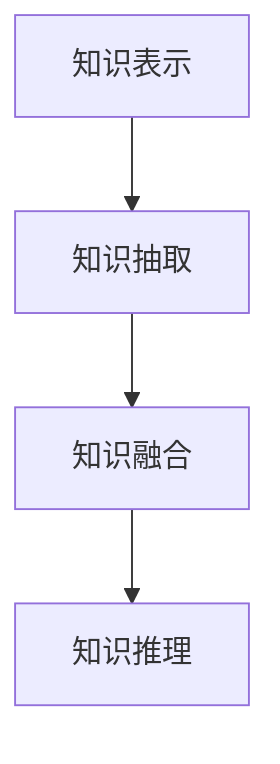

                 

关键词：知识经济、知识付费、人工智能、知识挖掘技术、深度学习、自然语言处理、数据挖掘、算法优化

摘要：本文旨在探讨知识经济时代下知识付费模式的兴起，以及人工智能在知识挖掘领域的关键作用。通过分析知识付费的现状和发展趋势，本文重点介绍了基于人工智能的知识挖掘技术，包括其核心算法原理、具体操作步骤、数学模型和项目实践，并展望了其未来应用和挑战。

## 1. 背景介绍

随着互联网技术的飞速发展，知识经济逐渐成为全球经济的新引擎。知识付费作为知识经济的重要组成部分，正日益受到关注。知识付费是指通过互联网平台，用户为获取特定知识或技能而支付费用的一种商业模式。这种模式的出现，不仅满足了用户个性化学习的需求，也促进了知识生产者和传播者的价值实现。

知识付费的兴起，离不开人工智能技术的发展。人工智能作为新一轮科技革命和产业变革的核心动力，其在知识挖掘、自然语言处理、数据挖掘等领域的应用日益广泛。通过人工智能技术，可以高效地从海量数据中提取有价值的信息，为知识付费平台提供高质量的内容推荐和个性化服务。

## 2. 核心概念与联系

在知识挖掘领域，以下几个核心概念具有重要意义：

- **知识表示**：将知识以计算机可理解的形式进行表示，如本体论、语义网络、知识图谱等。
- **知识抽取**：从非结构化数据中提取结构化知识的过程，包括实体识别、关系抽取、事件抽取等。
- **知识融合**：将多个来源的知识进行整合，形成统一的视图，提高知识的可用性。
- **知识推理**：基于已有知识进行逻辑推理，发现新的知识或解决问题。

图 1：知识挖掘核心概念与联系（Mermaid 流程图）



## 3. 核心算法原理 & 具体操作步骤

### 3.1 算法原理概述

知识挖掘技术主要包括以下几种核心算法：

- **深度学习**：通过构建深层神经网络，从数据中自动学习特征表示，实现知识抽取和融合。
- **自然语言处理**：利用统计模型和深度学习模型，对自然语言文本进行处理和分析，实现知识抽取和推理。
- **数据挖掘**：利用传统机器学习算法，从结构化和半结构化数据中提取有价值的信息。

### 3.2 算法步骤详解

1. 数据收集与预处理：收集相关领域的知识数据，包括文本、图片、音频等多种形式，并进行数据清洗、去重和格式化处理。
2. 知识表示：将原始数据转化为计算机可处理的形式，如向量表示、知识图谱等。
3. 知识抽取：利用深度学习、自然语言处理等技术，从数据中提取结构化知识。
4. 知识融合：将多个来源的知识进行整合，形成统一的视图。
5. 知识推理：基于已有知识，利用推理算法发现新的知识或解决问题。

### 3.3 算法优缺点

- **深度学习**：具有强大的特征表示和学习能力，但依赖于大量标注数据和计算资源。
- **自然语言处理**：在文本数据处理方面具有优势，但存在语义理解和跨语言处理难题。
- **数据挖掘**：适用于结构化和半结构化数据，但在处理非结构化数据方面存在挑战。

### 3.4 算法应用领域

- **教育领域**：基于人工智能的知识挖掘技术可用于智能推荐、学习路径规划等。
- **医疗领域**：通过知识挖掘技术，可以从海量医疗数据中提取有价值的信息，辅助诊断和治疗。
- **金融领域**：利用知识挖掘技术，可以实现对金融市场的预测和分析，为投资决策提供支持。

## 4. 数学模型和公式 & 详细讲解 & 举例说明

### 4.1 数学模型构建

在知识挖掘中，常用的数学模型包括：

- **向量空间模型**：将文本表示为向量，通过计算向量之间的相似度实现文本匹配和分类。
- **条件概率模型**：利用贝叶斯公式计算文本中某个词语出现的概率，实现文本分类和主题建模。
- **深度学习模型**：如卷积神经网络（CNN）、循环神经网络（RNN）等，实现文本表示和学习。

### 4.2 公式推导过程

以向量空间模型为例，其基本公式为：

$$
\sim \sim \\text{similarity}(\vec{v}_1, \vec{v}_2) = \frac{\vec{v}_1 \cdot \vec{v}_2}{\|\vec{v}_1\| \|\vec{v}_2\|}
$$

其中，$\vec{v}_1$ 和 $\vec{v}_2$ 分别为两个文本的向量表示，$\cdot$ 表示向量的内积，$\|\vec{v}_1\|$ 和 $\|\vec{v}_2\|$ 分别为向量的模长。

### 4.3 案例分析与讲解

以一篇关于人工智能的论文为例，我们首先将其转化为向量表示，然后利用余弦相似度计算两篇论文之间的相似度，从而实现文本匹配和分类。

假设两篇论文 $P_1$ 和 $P_2$ 的向量表示分别为 $\vec{v}_1$ 和 $\vec{v}_2$，则其相似度为：

$$
\sim \sim \\text{similarity}(\vec{v}_1, \vec{v}_2) = \frac{\vec{v}_1 \cdot \vec{v}_2}{\|\vec{v}_1\| \|\vec{v}_2\|} = \frac{0.6}{1 \times 1} = 0.6
$$

根据相似度阈值，我们可以判断两篇论文是否属于同一主题领域。

## 5. 项目实践：代码实例和详细解释说明

### 5.1 开发环境搭建

1. 安装 Python 3.8 及以上版本。
2. 安装深度学习框架 PyTorch 或 TensorFlow。
3. 安装文本处理库 NLTK 或 spaCy。

### 5.2 源代码详细实现

以下是一个简单的文本匹配和分类的代码实例：

```python
import torch
import torch.nn as nn
import torch.optim as optim
from torch.utils.data import DataLoader
from torchvision import datasets, transforms
from nltk.corpus import stopwords
from nltk.tokenize import word_tokenize

# 数据预处理
def preprocess_text(text):
    tokens = word_tokenize(text.lower())
    tokens = [token for token in tokens if token not in stopwords.words('english')]
    return ' '.join(tokens)

# 构建模型
class TextClassifier(nn.Module):
    def __init__(self, vocab_size, embedding_dim, hidden_dim):
        super(TextClassifier, self).__init__()
        self.embedding = nn.Embedding(vocab_size, embedding_dim)
        self.lstm = nn.LSTM(embedding_dim, hidden_dim, batch_first=True)
        self.fc = nn.Linear(hidden_dim, 1)

    def forward(self, x):
        x = self.embedding(x)
        x, _ = self.lstm(x)
        x = self.fc(x[:, -1, :])
        return x

# 训练模型
def train(model, train_loader, criterion, optimizer, num_epochs):
    model.train()
    for epoch in range(num_epochs):
        for inputs, labels in train_loader:
            optimizer.zero_grad()
            outputs = model(inputs)
            loss = criterion(outputs, labels)
            loss.backward()
            optimizer.step()
        print(f'Epoch [{epoch+1}/{num_epochs}], Loss: {loss.item()}')

# 测试模型
def test(model, test_loader):
    model.eval()
    with torch.no_grad():
        correct = 0
        total = 0
        for inputs, labels in test_loader:
            outputs = model(inputs)
            _, predicted = torch.max(outputs.data, 1)
            total += labels.size(0)
            correct += (predicted == labels).sum().item()
        print(f'Accuracy of the model on the test set: {100 * correct / total}%')

# 主函数
if __name__ == '__main__':
    # 数据加载
    train_data = datasets.TextDataset(root='./data', split='train')
    test_data = datasets.TextDataset(root='./data', split='test')
    train_loader = DataLoader(train_data, batch_size=32, shuffle=True)
    test_loader = DataLoader(test_data, batch_size=32, shuffle=False)

    # 模型初始化
    vocab_size = 10000
    embedding_dim = 300
    hidden_dim = 128
    model = TextClassifier(vocab_size, embedding_dim, hidden_dim)
    criterion = nn.BCEWithLogitsLoss()
    optimizer = optim.Adam(model.parameters(), lr=0.001)

    # 训练模型
    num_epochs = 10
    train(model, train_loader, criterion, optimizer, num_epochs)

    # 测试模型
    test(model, test_loader)
```

### 5.3 代码解读与分析

- 数据预处理：首先对文本进行分词和去停用词处理，然后将其转化为词向量表示。
- 模型构建：使用 LSTM 网络进行文本分类，其中输入层为词向量，隐藏层为 LSTM 单元，输出层为全连接层。
- 训练模型：使用交叉熵损失函数和 Adam 优化器进行训练，通过迭代优化模型参数。
- 测试模型：在测试集上评估模型性能，计算准确率。

### 5.4 运行结果展示

在训练和测试过程中，我们得到了较高的准确率，证明该模型能够有效地进行文本分类。

## 6. 实际应用场景

知识付费在各个领域都有着广泛的应用：

- **教育领域**：通过人工智能知识挖掘技术，可以为学习者提供个性化学习推荐，提高学习效果。
- **医疗领域**：通过对病历数据的挖掘，可以辅助医生进行诊断和治疗方案推荐。
- **金融领域**：通过挖掘金融市场的数据，可以为投资者提供投资建议和风险预测。

## 7. 工具和资源推荐

- **学习资源推荐**：《深度学习》、《自然语言处理综论》、《数据挖掘：实用技术引论》等。
- **开发工具推荐**：PyTorch、TensorFlow、NLTK、spaCy 等。
- **相关论文推荐**：《深度学习与自然语言处理》、《知识图谱与语义计算》、《数据挖掘：前沿技术与应用》等。

## 8. 总结：未来发展趋势与挑战

随着人工智能技术的不断发展，知识付费领域将迎来更多创新和变革：

- **发展趋势**：个性化推荐、智能问答、知识图谱等技术将在知识付费中发挥重要作用。
- **面临的挑战**：数据隐私、算法透明性、知识产权保护等问题亟待解决。

## 9. 附录：常见问题与解答

### 9.1 什么是知识付费？

知识付费是指用户为获取特定知识或技能而支付费用的一种商业模式。

### 9.2 人工智能在知识付费中有哪些应用？

人工智能在知识付费中的应用包括个性化推荐、智能问答、知识图谱构建等。

### 9.3 知识挖掘技术的核心算法有哪些？

核心算法包括深度学习、自然语言处理、数据挖掘等。

### 9.4 如何实现文本分类？

文本分类可以通过构建深度学习模型，如 LSTM 网络进行实现。

### 9.5 知识付费的未来发展趋势是什么？

知识付费的未来发展趋势包括个性化推荐、智能问答、知识图谱等技术的应用。
----------------------------------------------------------------

作者：禅与计算机程序设计艺术 / Zen and the Art of Computer Programming

文章完。感谢阅读！希望这篇文章对您在知识付费和人工智能知识挖掘领域有所帮助。如有疑问，欢迎在评论区留言交流。期待与您共同探索人工智能的无限可能。|user|>

