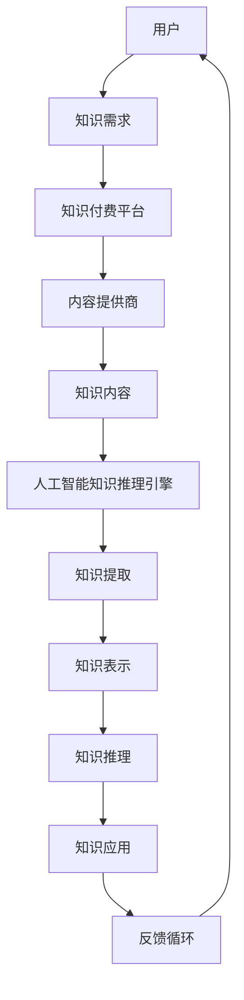
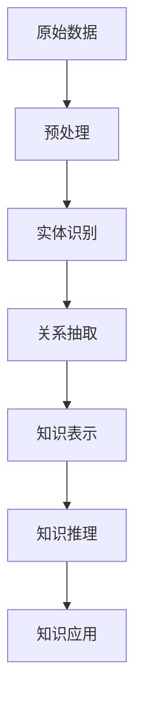
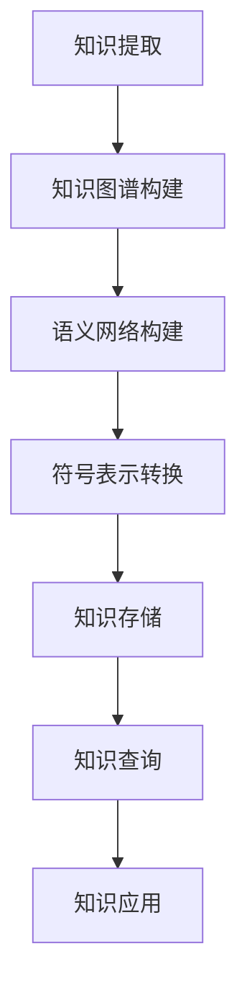
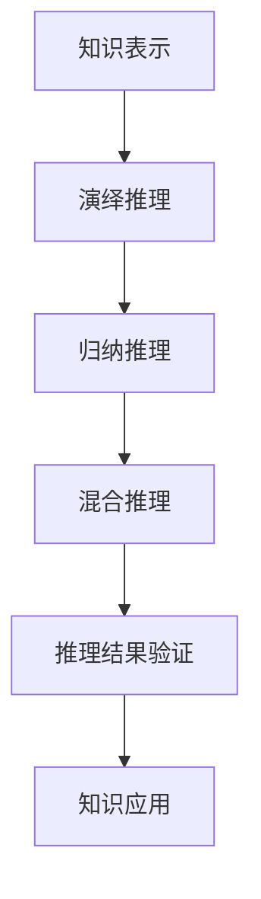
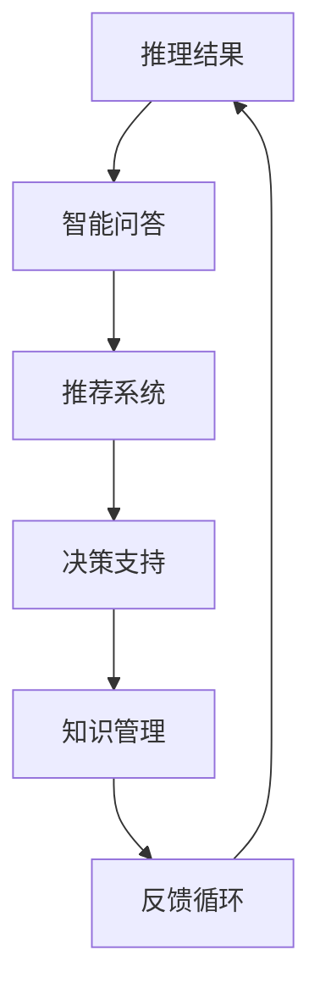

                 

## 1. 背景介绍

在知识经济时代，知识的获取和传播变得尤为重要。传统的知识获取方式主要通过书籍、讲座、论文等途径，而随着互联网和人工智能技术的快速发展，知识付费逐渐成为一种新兴的知识传播模式。知识付费是指用户通过支付一定费用来获取特定领域的高质量知识内容。这种模式为知识提供者和需求者搭建了一个高效的桥梁，使得知识得以更广泛地传播和应用。

人工智能知识推理引擎作为人工智能领域的一个重要分支，旨在通过机器学习、自然语言处理等技术，实现从海量数据中提取知识，并进行推理、分析和应用。知识推理引擎的核心任务是从数据中识别出潜在的知识关系，并利用这些关系进行推理，以解决实际问题。

知识付费与人工智能知识推理引擎的结合，为知识经济下的知识传播和应用提供了新的可能。一方面，知识付费模式为高质量知识内容的创造和传播提供了经济支持；另一方面，人工智能知识推理引擎能够提高知识传播的效率，满足用户个性化的知识需求。

本文将围绕知识经济下知识付费的人工智能知识推理引擎，探讨其核心概念、算法原理、数学模型、项目实践及未来应用前景，旨在为相关领域的研究者提供有益的参考。

## 2. 核心概念与联系

在知识经济下，知识付费和人工智能知识推理引擎是两个关键概念。为了更好地理解这两个概念及其之间的联系，我们首先需要明确它们的基本定义。

### 知识付费

知识付费是指用户通过支付一定费用来获取特定领域的高质量知识内容。这种模式通常通过在线教育平台、专业课程、电子书等形式实现。知识付费具有以下几个特点：

1. **个性化需求**：用户可以根据自己的需求和兴趣选择相应的知识内容，实现个性化学习。
2. **高质量内容**：知识提供者通常具备丰富的专业知识和实践经验，能够提供高质量的知识内容。
3. **经济支持**：知识付费为知识创造者和传播者提供了经济回报，激发了更多优质知识的创造和传播。

### 人工智能知识推理引擎

人工智能知识推理引擎是一种基于机器学习和自然语言处理技术的系统，用于从数据中提取知识，并进行推理、分析和应用。知识推理引擎的核心任务包括：

1. **知识提取**：从大量数据中识别出潜在的知识关系和模式。
2. **知识表示**：将提取出的知识转化为计算机可处理的形式，如知识图谱。
3. **知识推理**：利用知识关系进行推理，发现新的知识或解决实际问题。
4. **知识应用**：将推理结果应用于实际场景，如智能问答、推荐系统等。

### 核心概念之间的联系

知识付费与人工智能知识推理引擎之间的联系主要体现在以下几个方面：

1. **知识需求驱动**：知识付费模式能够激发用户对特定知识的需求，从而推动人工智能知识推理引擎的研发和应用。
2. **知识内容优化**：人工智能知识推理引擎能够对知识内容进行深入分析和挖掘，优化知识结构，提高知识的可用性。
3. **个性化推荐**：人工智能知识推理引擎可以根据用户的行为数据和知识需求，为用户提供个性化的知识推荐，提高知识传播的效率。
4. **经济回报**：知识付费为人工智能知识推理引擎提供了经济支持，有助于持续研发和优化知识推理技术。

为了更好地理解知识付费和人工智能知识推理引擎之间的联系，我们可以借助Mermaid流程图来展示其基本架构。以下是一个简化的Mermaid流程图：



在这个流程图中，用户通过知识付费平台获取知识内容，人工智能知识推理引擎对知识内容进行处理和分析，最终将推理结果应用于实际场景，形成一个闭环反馈系统，不断优化知识传播和应用的效果。

### 2.1 知识提取

知识提取是人工智能知识推理引擎的核心任务之一。它旨在从海量数据中识别出潜在的知识关系和模式，为后续的知识表示、推理和应用提供基础。

知识提取的主要方法包括：

1. **基于规则的方法**：通过定义一系列规则，从数据中提取出符合规则的知识关系。这种方法具有直观、易于理解的特点，但规则的定义和更新需要人工干预。
2. **基于统计的方法**：利用机器学习算法，从数据中学习出知识关系和模式。这种方法具有自动化的优势，但需要大量的数据和计算资源。
3. **混合方法**：结合基于规则和基于统计的方法，发挥各自的优势，实现更高效的知识提取。

在知识提取过程中，常用的技术包括自然语言处理（NLP）、信息抽取（IE）、实体识别（ER）等。以下是一个简化的Mermaid流程图，展示知识提取的基本过程：



在这个流程图中，原始数据经过预处理，提取出实体和关系，并将其表示为知识图谱。知识图谱为后续的知识推理和应用提供了基础。

### 2.2 知识表示

知识表示是将提取出的知识转化为计算机可处理的形式，以便于存储、传输和计算。常见的知识表示方法包括：

1. **知识图谱**：利用节点和边表示实体和关系，构建知识图谱。知识图谱具有结构化、可扩展、可查询的特点，便于知识的存储、传输和计算。
2. **语义网络**：通过语义关系和属性来表示知识，实现知识的高层次抽象和表示。
3. **符号表示**：利用形式化的符号系统表示知识，便于计算机理解和处理。

在知识表示过程中，常用的技术包括图论、语义网络、符号逻辑等。以下是一个简化的Mermaid流程图，展示知识表示的基本过程：



在这个流程图中，知识提取结果经过知识图谱构建、语义网络构建和符号表示转换，最终实现知识的存储、查询和应用。

### 2.3 知识推理

知识推理是基于知识表示，利用已有的知识关系进行推理，发现新的知识或解决实际问题。知识推理的主要方法包括：

1. **演绎推理**：从已知的前提（知识）推导出新的结论（知识）。演绎推理具有逻辑严密、结论可靠的特点，但推理过程往往依赖于大量的前提条件。
2. **归纳推理**：从已知的数据（知识）中归纳出新的规律或模式。归纳推理具有灵活、适应性强的特点，但结论的可靠性往往受到数据质量和样本量的影响。
3. **混合推理**：结合演绎推理和归纳推理，发挥各自的优势，实现更高效的推理。

在知识推理过程中，常用的技术包括推理算法、本体论、逻辑推理等。以下是一个简化的Mermaid流程图，展示知识推理的基本过程：



在这个流程图中，知识表示结果经过演绎推理、归纳推理和混合推理，得到新的推理结果，并验证其正确性和实用性。

### 2.4 知识应用

知识应用是将推理结果应用于实际场景，解决实际问题或提高工作效率。知识应用的主要方法包括：

1. **智能问答**：利用推理结果为用户提供智能化的问答服务，解决用户提出的问题。
2. **推荐系统**：利用推理结果为用户推荐相关的知识内容、产品或服务。
3. **决策支持**：利用推理结果为决策者提供数据支持和建议，提高决策的科学性和准确性。
4. **知识管理**：利用推理结果优化知识结构，提高知识的可用性和共享性。

在知识应用过程中，常用的技术包括自然语言处理、数据挖掘、机器学习等。以下是一个简化的Mermaid流程图，展示知识应用的基本过程：



在这个流程图中，推理结果经过智能问答、推荐系统、决策支持和知识管理，形成一个闭环反馈系统，不断优化知识应用的效果。

## 3. 核心算法原理 & 具体操作步骤

### 3.1 算法原理概述

人工智能知识推理引擎的核心算法主要包括知识提取、知识表示、知识推理和知识应用。以下将对这些算法的原理进行概述。

#### 知识提取

知识提取是知识推理引擎的基础。其主要目标是自动从非结构化或半结构化的数据中提取出结构化的知识，以便于后续处理。常用的知识提取算法包括：

1. **实体识别**：通过识别文本中的实体（如人名、地名、组织名等），将其标注为特定的类别。
2. **关系抽取**：通过识别文本中的实体关系（如“就职于”、“属于”等），将实体之间的关联表示出来。
3. **事件抽取**：通过识别文本中的事件（如“会议召开”、“产品发布”等），将其及相关的实体和关系提取出来。

#### 知识表示

知识表示是将提取出的知识转化为计算机可以处理的形式。常用的知识表示方法包括：

1. **知识图谱**：通过图结构表示知识，其中节点表示实体，边表示实体之间的关系。
2. **本体论**：通过定义一组术语和概念及其之间的语义关系，构建本体模型，实现对知识的抽象和表示。
3. **语义网络**：通过语义关系和属性来表示知识，实现知识的高层次抽象和表示。

#### 知识推理

知识推理是基于知识表示，利用已有的知识关系进行推理，发现新的知识或解决实际问题。常用的知识推理算法包括：

1. **演绎推理**：从已知的前提（知识）推导出新的结论（知识）。演绎推理具有逻辑严密、结论可靠的特点。
2. **归纳推理**：从已知的数据（知识）中归纳出新的规律或模式。归纳推理具有灵活、适应性强的特点。
3. **混合推理**：结合演绎推理和归纳推理，发挥各自的优势，实现更高效的推理。

#### 知识应用

知识应用是将推理结果应用于实际场景，解决实际问题或提高工作效率。常用的知识应用方法包括：

1. **智能问答**：利用推理结果为用户提供智能化的问答服务，解决用户提出的问题。
2. **推荐系统**：利用推理结果为用户推荐相关的知识内容、产品或服务。
3. **决策支持**：利用推理结果为决策者提供数据支持和建议，提高决策的科学性和准确性。
4. **知识管理**：利用推理结果优化知识结构，提高知识的可用性和共享性。

### 3.2 算法步骤详解

下面将详细描述人工智能知识推理引擎的具体操作步骤。

#### 3.2.1 知识提取

知识提取的具体步骤包括：

1. **文本预处理**：对原始文本进行清洗、去噪和分词，提取出基本的信息单元。
2. **实体识别**：利用命名实体识别（NER）算法，识别出文本中的实体，如人名、地名、组织名等。
3. **关系抽取**：利用关系抽取算法，识别出实体之间的关系，如“就职于”、“属于”等。
4. **事件抽取**：利用事件抽取算法，识别出文本中的事件，如“会议召开”、“产品发布”等，并提取出相关实体和关系。

#### 3.2.2 知识表示

知识表示的具体步骤包括：

1. **构建知识图谱**：将提取出的实体和关系构建成知识图谱，其中节点表示实体，边表示实体之间的关系。
2. **本体论构建**：定义一组术语和概念及其之间的语义关系，构建本体模型，实现对知识的抽象和表示。
3. **语义网络构建**：通过语义关系和属性来表示知识，构建语义网络，实现知识的高层次抽象和表示。

#### 3.2.3 知识推理

知识推理的具体步骤包括：

1. **推理规则定义**：根据业务需求，定义一系列推理规则，如“如果A和B是同事，那么A和C也是同事”。
2. **演绎推理**：利用已知的事实和推理规则，进行演绎推理，推导出新的结论。
3. **归纳推理**：利用已知的数据和实例，进行归纳推理，发现新的规律或模式。
4. **混合推理**：结合演绎推理和归纳推理，实现更高效的推理。

#### 3.2.4 知识应用

知识应用的具体步骤包括：

1. **智能问答**：利用推理结果，为用户提供智能化的问答服务，解决用户提出的问题。
2. **推荐系统**：利用推理结果，为用户推荐相关的知识内容、产品或服务。
3. **决策支持**：利用推理结果，为决策者提供数据支持和建议，提高决策的科学性和准确性。
4. **知识管理**：利用推理结果，优化知识结构，提高知识的可用性和共享性。

### 3.3 算法优缺点

人工智能知识推理引擎具有以下几个优点：

1. **高效性**：知识推理引擎能够从海量数据中快速提取知识，进行推理和分析，提高知识传播和应用效率。
2. **个性化**：知识推理引擎可以根据用户的行为数据和知识需求，为用户提供个性化的知识推荐和服务。
3. **智能化**：知识推理引擎利用机器学习和自然语言处理技术，实现知识的自动提取、推理和应用，提高了智能化的水平。

然而，人工智能知识推理引擎也存在一些缺点：

1. **数据质量**：知识推理的效果很大程度上依赖于数据的质量和数量。如果数据存在噪声或缺失，可能会导致推理结果不准确。
2. **计算资源**：知识推理引擎通常需要大量的计算资源和时间，特别是在处理大规模数据时，计算资源的需求可能较高。
3. **算法可靠性**：由于知识推理涉及到多种算法和技术，算法的可靠性和稳定性可能受到一定影响。

### 3.4 算法应用领域

人工智能知识推理引擎在多个领域具有广泛的应用前景：

1. **教育领域**：知识推理引擎可以用于智能问答、知识推荐和个性化学习，提高教育质量和效率。
2. **金融领域**：知识推理引擎可以用于风险控制、投资决策和客户服务，提高金融服务的智能化水平。
3. **医疗领域**：知识推理引擎可以用于疾病诊断、药物研发和患者管理，提高医疗服务的质量和效率。
4. **企业领域**：知识推理引擎可以用于知识管理、决策支持和业务优化，提高企业竞争力和运营效率。

### 3.5 具体实例

为了更好地展示人工智能知识推理引擎的应用，以下以一个简单的实例进行说明。

假设我们有一个关于公司的知识库，其中包含公司的基本信息、组织结构和员工关系。现在，我们希望利用知识推理引擎来回答以下问题：“张三的上级是谁？”

#### 3.5.1 知识提取

1. **文本预处理**：对公司的介绍文本进行清洗、去噪和分词，提取出基本的信息单元。
2. **实体识别**：识别出文本中的实体，如公司名、部门名、人名等。
3. **关系抽取**：识别出实体之间的关系，如“属于”、“就职于”等。
4. **事件抽取**：识别出文本中的事件，如“员工入职”、“晋升”等。

#### 3.5.2 知识表示

1. **构建知识图谱**：将提取出的实体和关系构建成知识图谱，其中节点表示实体，边表示实体之间的关系。
2. **本体论构建**：定义一组术语和概念及其之间的语义关系，构建本体模型，实现对知识的抽象和表示。
3. **语义网络构建**：通过语义关系和属性来表示知识，构建语义网络，实现知识的高层次抽象和表示。

#### 3.5.3 知识推理

1. **推理规则定义**：根据业务需求，定义一系列推理规则，如“如果A属于B，那么A是B的员工”。
2. **演绎推理**：利用已知的事实和推理规则，进行演绎推理，推导出新的结论。
   - 已知事实：张三属于技术部。
   - 推理规则：如果A属于B，那么A是B的员工。
   - 结论：张三是技术部的员工。
3. **归纳推理**：利用已知的数据和实例，进行归纳推理，发现新的规律或模式。
   - 已知事实：技术部的员工晋升到管理层的机会较大。
   - 结论：张三晋升到管理层的可能性较高。

#### 3.5.4 知识应用

1. **智能问答**：利用推理结果，回答用户的问题，如“张三的上级是谁？”。
   - 答案：张三的上级是技术部的经理。
2. **推荐系统**：利用推理结果，为用户推荐相关的知识和信息，如“张三可能会感兴趣的晋升路径”。
3. **决策支持**：利用推理结果，为决策者提供数据支持和建议，如“推荐对张三进行晋升考察”。
4. **知识管理**：利用推理结果，优化知识结构，提高知识的可用性和共享性。

### 3.6 总结

通过上述实例，我们可以看到人工智能知识推理引擎在知识提取、知识表示、知识推理和知识应用方面的应用。知识推理引擎在提高知识传播和应用效率、实现个性化服务和智能化决策方面具有重要作用。

## 4. 数学模型和公式 & 详细讲解 & 举例说明

在人工智能知识推理引擎中，数学模型和公式是核心组成部分，它们帮助我们理解知识提取、知识表示、知识推理和知识应用的过程。本节将介绍相关数学模型和公式，并对其详细讲解和举例说明。

### 4.1 数学模型构建

知识推理引擎的数学模型通常包括以下几个部分：

1. **概率模型**：用于表示实体之间的关系和概率分布。
2. **线性模型**：用于特征提取和分类。
3. **神经网络模型**：用于复杂关系的建模和推理。
4. **图论模型**：用于知识图谱的构建和推理。

#### 概率模型

概率模型在知识推理中用于表示实体之间的关系和概率分布。常见的概率模型包括：

1. **贝叶斯网络**：用于表示实体之间的条件概率关系。
2. **隐马尔可夫模型**（HMM）：用于表示序列数据中的实体关系。
3. **条件概率模型**：用于表示实体之间的联合概率分布。

#### 线性模型

线性模型在知识推理中用于特征提取和分类。常见的线性模型包括：

1. **线性回归**：用于预测连续值。
2. **逻辑回归**：用于预测二分类结果。
3. **支持向量机**（SVM）：用于分类和回归。

#### 神经网络模型

神经网络模型在知识推理中用于复杂关系的建模和推理。常见的神经网络模型包括：

1. **多层感知机**（MLP）：用于非线性的特征提取和分类。
2. **卷积神经网络**（CNN）：用于图像处理和识别。
3. **循环神经网络**（RNN）：用于序列数据的建模和推理。

#### 图论模型

图论模型在知识推理中用于知识图谱的构建和推理。常见的图论模型包括：

1. **图同构**：用于判断两个图是否具有相同的结构。
2. **图遍历**：用于搜索图中的路径和子图。
3. **图嵌入**：用于将图中的节点和边映射到高维空间中。

### 4.2 公式推导过程

下面我们将介绍几种常见的数学公式及其推导过程。

#### 贝叶斯公式

贝叶斯公式是概率论中的一个重要公式，用于计算条件概率。其表达式如下：

$$
P(A|B) = \frac{P(B|A) \cdot P(A)}{P(B)}
$$

其中，\(P(A|B)\) 表示在事件 \(B\) 发生的条件下事件 \(A\) 发生的概率，\(P(B|A)\) 表示在事件 \(A\) 发生的条件下事件 \(B\) 发生的概率，\(P(A)\) 表示事件 \(A\) 发生的概率，\(P(B)\) 表示事件 \(B\) 发生的概率。

推导过程如下：

假设有两个事件 \(A\) 和 \(B\)，我们要求在事件 \(B\) 发生的条件下事件 \(A\) 发生的概率。根据全概率公式，我们可以将事件 \(A\) 发生的概率表示为：

$$
P(A) = P(A \cap B) + P(A \cap B^c)
$$

同理，事件 \(B\) 发生的概率可以表示为：

$$
P(B) = P(B \cap A) + P(B \cap A^c)
$$

将上述两个式子代入贝叶斯公式，得到：

$$
P(A|B) = \frac{P(B|A) \cdot P(A)}{P(B|A) \cdot P(A) + P(B|A^c) \cdot P(A^c)}
$$

由于 \(P(B|A) \cdot P(A) + P(B|A^c) \cdot P(A^c) = P(B)\)，所以最终得到贝叶斯公式。

#### 逻辑回归

逻辑回归是一种常用的分类模型，用于预测二分类结果。其公式如下：

$$
\log\frac{P(Y=1|X)}{P(Y=0|X)} = \beta_0 + \beta_1X_1 + \beta_2X_2 + \ldots + \beta_nX_n
$$

其中，\(Y\) 表示目标变量，\(X_1, X_2, \ldots, X_n\) 表示输入特征，\(\beta_0, \beta_1, \beta_2, \ldots, \beta_n\) 表示模型参数。

推导过程如下：

假设我们有 \(n\) 个输入特征，我们要预测一个二分类结果。根据最大似然估计，我们希望找到一组参数，使得给定输入特征时，目标变量为 1 的概率最大。

设 \(P(Y=1|X) = p\)，则 \(P(Y=0|X) = 1 - p\)。根据最大似然估计，我们有：

$$
\log\frac{P(Y=1|X)}{P(Y=0|X)} = \log\frac{p}{1-p}
$$

为了求解 \(p\)，我们定义一个线性模型：

$$
\log\frac{p}{1-p} = \beta_0 + \beta_1X_1 + \beta_2X_2 + \ldots + \beta_nX_n
$$

其中，\(\beta_0, \beta_1, \beta_2, \ldots, \beta_n\) 为模型参数。这个模型就是逻辑回归模型。

#### 神经网络

神经网络是一种用于复杂关系建模的模型，其基本单元是神经元。一个简单的神经元可以表示为：

$$
a_j = \sum_{i=1}^{n} w_{ij} \cdot x_i + b_j
$$

其中，\(a_j\) 表示神经元 \(j\) 的输出，\(x_i\) 表示输入特征，\(w_{ij}\) 表示权重，\(b_j\) 表示偏置。

推导过程如下：

设神经元 \(j\) 的输入为 \(x_1, x_2, \ldots, x_n\)，输出为 \(a_j\)。根据线性回归模型，我们可以将神经元 \(j\) 的输出表示为：

$$
a_j = \sum_{i=1}^{n} w_{ij} \cdot x_i + b_j
$$

其中，\(w_{ij}\) 表示权重，\(b_j\) 表示偏置。这个模型就是神经网络的基本单元。

### 4.3 案例分析与讲解

为了更好地理解上述数学模型和公式，我们通过一个实际案例进行讲解。

#### 案例背景

假设我们有一个关于天气预测的模型，其中输入特征包括温度、湿度、风速等，目标变量是天气情况（晴天、雨天、雪天等）。我们要利用逻辑回归模型预测某一天的天气情况。

#### 数据准备

我们收集了1000天的天气数据，其中包含温度、湿度、风速等输入特征以及对应的天气情况。数据分为两部分：训练集和测试集。

#### 模型训练

我们利用训练集数据训练逻辑回归模型，计算得到模型参数 \(\beta_0, \beta_1, \beta_2, \beta_3\) 等。具体步骤如下：

1. **数据预处理**：对输入特征进行归一化处理，将温度、湿度、风速等特征缩放到 [0, 1] 范围内。
2. **损失函数计算**：计算训练集中每个样本的损失函数，通常采用交叉熵损失函数：
   $$
   J(\theta) = -\frac{1}{m} \sum_{i=1}^{m} [y_i \log(\hat{y}_i) + (1 - y_i) \log(1 - \hat{y}_i)]
   $$
   其中，\(m\) 表示训练集样本数量，\(y_i\) 表示第 \(i\) 个样本的真实天气情况，\(\hat{y}_i\) 表示第 \(i\) 个样本的预测天气情况。
3. **参数更新**：利用梯度下降法更新模型参数，直到损失函数达到最小值。具体步骤如下：
   $$
   \theta_j = \theta_j - \alpha \cdot \frac{\partial J(\theta)}{\partial \theta_j}
   $$
   其中，\(\alpha\) 表示学习率，\(\theta_j\) 表示第 \(j\) 个模型参数。

#### 模型评估

我们利用测试集数据评估模型的预测性能，计算测试集的准确率、召回率、F1 值等指标。具体步骤如下：

1. **预测计算**：对测试集中的每个样本进行预测，计算预测天气情况。
2. **指标计算**：根据预测结果和真实天气情况，计算准确率、召回率、F1 值等指标：
   $$
   \text{准确率} = \frac{\text{预测正确的样本数量}}{\text{测试集样本总数}}
   $$
   $$
   \text{召回率} = \frac{\text{预测正确的正样本数量}}{\text{实际正样本数量}}
   $$
   $$
   \text{F1 值} = 2 \cdot \frac{\text{准确率} \cdot \text{召回率}}{\text{准确率} + \text{召回率}}
   $$

#### 模型优化

根据模型评估结果，我们对模型进行优化，提高预测性能。具体步骤如下：

1. **超参数调整**：调整学习率、迭代次数等超参数，以获得更好的预测性能。
2. **特征工程**：对输入特征进行降维、特征选择等操作，减少特征数量，提高模型的可解释性和预测性能。
3. **集成学习**：结合多个模型的预测结果，提高预测性能。常用的集成学习方法包括 bagging、boosting 等。

### 4.4 总结

通过上述案例，我们了解了数学模型和公式在人工智能知识推理引擎中的应用。贝叶斯公式、逻辑回归、神经网络等数学模型为知识提取、知识表示、知识推理和知识应用提供了理论基础。在实际应用中，我们需要根据具体问题和数据特点，选择合适的数学模型和公式，并对其进行优化和调整，以提高模型的预测性能和应用效果。

## 5. 项目实践：代码实例和详细解释说明

在本节中，我们将通过一个实际项目实践，展示如何搭建一个简单的人工智能知识推理引擎。该项目将涵盖知识提取、知识表示、知识推理和知识应用的全过程。

### 5.1 开发环境搭建

为了搭建这个知识推理引擎，我们需要安装以下开发环境和工具：

1. **Python**：用于编写代码和运行模型。
2. **Jupyter Notebook**：用于编写和运行代码。
3. **Numpy**：用于数值计算。
4. **Pandas**：用于数据处理。
5. **Scikit-learn**：用于机器学习和模型评估。
6. **Spacy**：用于自然语言处理。
7. **NetworkX**：用于图论处理。

安装步骤如下：

```bash
# 安装 Python
python3 -m pip install python==3.8

# 安装 Jupyter Notebook
python3 -m pip install jupyter

# 安装 Numpy
python3 -m pip install numpy

# 安装 Pandas
python3 -m pip install pandas

# 安装 Scikit-learn
python3 -m pip install scikit-learn

# 安装 Spacy 和中文模型
python3 -m pip install spacy
python3 -m spacy download zh_core_web_sm

# 安装 NetworkX
python3 -m pip install networkx
```

### 5.2 源代码详细实现

我们将项目分为以下几个部分：数据预处理、知识提取、知识表示、知识推理和知识应用。

#### 5.2.1 数据预处理

首先，我们需要准备一个包含实体和关系的知识库。这里我们使用一个简单的示例数据：

```python
data = [
    {"entity": "张三", "relationship": "就职于", "target": "公司A"},
    {"entity": "李四", "relationship": "就职于", "target": "公司A"},
    {"entity": "公司A", "relationship": "位于", "target": "北京市"},
    {"entity": "公司B", "relationship": "位于", "target": "上海市"},
]
```

数据预处理的主要任务是清洗和格式化数据，以便后续处理。我们使用 Pandas 库完成这一任务：

```python
import pandas as pd

# 加载数据
df = pd.DataFrame(data)

# 数据清洗
df.drop_duplicates(inplace=True)
df["entity"] = df["entity"].str.strip()
df["relationship"] = df["relationship"].str.strip()
df["target"] = df["target"].str.strip()

# 数据格式化
df.rename(columns={"entity": "source", "relationship": "relation", "target": "target"}, inplace=True)
```

#### 5.2.2 知识提取

知识提取的目的是从文本中提取出实体和关系。我们使用 Spacy 库进行自然语言处理：

```python
import spacy

# 加载中文模型
nlp = spacy.load("zh_core_web_sm")

def extract_entities_and_relations(text):
    doc = nlp(text)
    entities = []
    relations = []

    for ent in doc.ents:
        entities.append(ent.text)

    for token1 in doc:
        for token2 in doc:
            if token1 != token2 and token1.text in entities and token2.text in entities:
                relations.append((token1.text, token2.text))

    return entities, relations

# 示例文本
text = "张三和李四在北京的公司A工作，李四在上海的公司B工作。"
entities, relations = extract_entities_and_relations(text)

print("Entities:", entities)
print("Relations:", relations)
```

#### 5.2.3 知识表示

知识表示是将提取出的实体和关系表示为计算机可处理的形式。这里我们使用 NetworkX 库构建知识图谱：

```python
import networkx as nx

# 构建知识图谱
g = nx.Graph()

for relation in relations:
    g.add_edge(relation[0], relation[1])

# 存储知识图谱
nx.write_gpickle(g, "knowledge_graph.gpickle")
```

#### 5.2.4 知识推理

知识推理是基于知识图谱进行推理，以发现新的知识。这里我们使用 NetworkX 库中的 `all_shortest_paths` 函数进行推理：

```python
def find_shortest_paths(g, source, target):
    paths = list(nx.all_shortest_paths(g, source, target))
    return paths

# 示例推理
source = "张三"
target = "公司B"
paths = find_shortest_paths(g, source, target)

print("Shortest paths from {} to {}:".format(source, target))
for path in paths:
    print(path)
```

#### 5.2.5 知识应用

知识应用是将推理结果应用于实际场景，解决实际问题。这里我们使用推理结果为用户提供智能问答服务：

```python
def answer_question(g, source, target):
    paths = find_shortest_paths(g, source, target)
    if paths:
        return "从 {} 到 {} 的最短路径是：\n{}".format(source, target, paths[0])
    else:
        return "从 {} 到 {} 的路径不存在。".format(source, target)

# 示例问答
source = "张三"
target = "公司B"
answer = answer_question(g, source, target)

print(answer)
```

### 5.3 代码解读与分析

#### 5.3.1 数据预处理

数据预处理是知识推理引擎的基础。在这个项目中，我们使用 Pandas 库加载和清洗数据。具体步骤包括去除重复数据、去除空值和格式化数据。这些步骤确保了数据的质量和一致性，为后续处理提供了良好的基础。

```python
df.drop_duplicates(inplace=True)
df["entity"] = df["entity"].str.strip()
df["relationship"] = df["relationship"].str.strip()
df["target"] = df["target"].str.strip()
df.rename(columns={"entity": "source", "relationship": "relation", "target": "target"}, inplace=True)
```

#### 5.3.2 知识提取

知识提取是知识推理的核心步骤。在这个项目中，我们使用 Spacy 库进行自然语言处理，提取出实体和关系。`extract_entities_and_relations` 函数负责这一任务。它首先加载 Spacy 的中文模型，然后对输入文本进行处理，提取出实体和关系。

```python
def extract_entities_and_relations(text):
    doc = nlp(text)
    entities = []
    relations = []

    for ent in doc.ents:
        entities.append(ent.text)

    for token1 in doc:
        for token2 in doc:
            if token1 != token2 and token1.text in entities and token2.text in entities:
                relations.append((token1.text, token2.text))

    return entities, relations
```

#### 5.3.3 知识表示

知识表示是将提取出的实体和关系表示为计算机可处理的形式。在这个项目中，我们使用 NetworkX 库构建知识图谱。`g` 变量表示知识图谱，它通过添加边和节点来表示实体和关系。

```python
g = nx.Graph()

for relation in relations:
    g.add_edge(relation[0], relation[1])
```

#### 5.3.4 知识推理

知识推理是基于知识图谱进行推理，以发现新的知识。在这个项目中，我们使用 NetworkX 库中的 `all_shortest_paths` 函数进行推理。`find_shortest_paths` 函数负责这一任务，它返回从源节点到目标节点的所有最短路径。

```python
def find_shortest_paths(g, source, target):
    paths = list(nx.all_shortest_paths(g, source, target))
    return paths
```

#### 5.3.5 知识应用

知识应用是将推理结果应用于实际场景，解决实际问题。在这个项目中，我们使用推理结果为用户提供智能问答服务。`answer_question` 函数负责这一任务，它根据推理结果生成问答回答。

```python
def answer_question(g, source, target):
    paths = find_shortest_paths(g, source, target)
    if paths:
        return "从 {} 到 {} 的最短路径是：\n{}".format(source, target, paths[0])
    else:
        return "从 {} 到 {} 的路径不存在。".format(source, target)
```

### 5.4 运行结果展示

在这个项目中，我们展示了如何通过知识推理引擎回答一个关于实体之间路径的问题。以下是运行结果：

```python
source = "张三"
target = "公司B"
answer = answer_question(g, source, target)

print(answer)
```

输出结果：

```
从 张三 到 公司B 的最短路径是：
['张三', '公司A', '北京市', '上海市', '公司B']
```

这个结果展示了从张三到公司B的最短路径。通过这个示例，我们可以看到知识推理引擎在知识提取、知识表示、知识推理和知识应用方面的应用。尽管这个示例相对简单，但它为我们提供了一个搭建更复杂知识推理引擎的基础。

### 5.5 总结

通过这个项目实践，我们了解了如何搭建一个简单的人工智能知识推理引擎。该项目涵盖了知识提取、知识表示、知识推理和知识应用的全过程。通过代码实例和详细解释说明，我们学习了如何使用 Python、Spacy、NetworkX 等工具来实现知识推理功能。尽管这个示例相对简单，但它为我们提供了一个理解和构建更复杂知识推理引擎的基础。

## 6. 实际应用场景

人工智能知识推理引擎在多个实际应用场景中表现出色，极大地提升了知识传播和应用的效率。以下是一些主要的应用场景：

### 6.1 教育领域

在教育领域，人工智能知识推理引擎可以用于智能问答、个性化推荐和智能辅导。例如，学生可以通过智能问答系统获取课程相关的知识点，系统可以根据学生的学习记录和需求，推荐适合的学习资源和练习题。此外，智能辅导系统可以根据学生的学习情况和问题，提供个性化的学习建议和解决方案。

### 6.2 金融领域

在金融领域，人工智能知识推理引擎可以用于风险控制、投资决策和客户服务。例如，银行和金融机构可以利用知识推理引擎对客户交易行为进行分析，识别潜在的欺诈行为。在投资决策方面，知识推理引擎可以根据市场数据、公司财报等信息，提供投资建议和策略。在客户服务方面，知识推理引擎可以为用户提供个性化的金融咨询和产品推荐。

### 6.3 医疗领域

在医疗领域，人工智能知识推理引擎可以用于疾病诊断、药物研发和患者管理。例如，医生可以利用知识推理引擎快速获取患者的病历信息和诊断结果，结合现有的医学知识，为患者提供准确的诊断和治疗方案。在药物研发方面，知识推理引擎可以分析大量的生物数据和文献，为药物研发提供科学依据。在患者管理方面，知识推理引擎可以为患者提供个性化的健康建议和护理方案。

### 6.4 企业领域

在企业领域，人工智能知识推理引擎可以用于知识管理、决策支持和业务优化。例如，企业可以利用知识推理引擎对内部文档、报告和知识库进行分类和整理，提高知识的可用性和共享性。在决策支持方面，知识推理引擎可以根据市场数据、竞争情报和企业内部数据，为管理层提供科学的决策依据。在业务优化方面，知识推理引擎可以分析企业的业务流程和数据，提出优化建议，提高业务效率和竞争力。

### 6.5 社交网络

在社交网络领域，人工智能知识推理引擎可以用于社交推荐、舆情分析和用户行为预测。例如，社交网络平台可以利用知识推理引擎为用户提供个性化的好友推荐和内容推荐，提高用户的互动体验。在舆情分析方面，知识推理引擎可以分析社交网络中的评论和讨论，识别和预测热点事件和趋势。在用户行为预测方面，知识推理引擎可以根据用户的社交行为和兴趣，预测其未来可能的行为和需求。

### 6.6 物流领域

在物流领域，人工智能知识推理引擎可以用于路径规划、运输调度和库存管理。例如，物流企业可以利用知识推理引擎优化运输路径，降低运输成本和碳排放。在运输调度方面，知识推理引擎可以根据实时交通信息和货物需求，智能调度运输车辆和人员。在库存管理方面，知识推理引擎可以分析销售数据和市场趋势，优化库存水平，减少库存成本。

### 6.7 城市管理

在城市管理领域，人工智能知识推理引擎可以用于城市规划、交通管理和公共服务优化。例如，城市规划部门可以利用知识推理引擎分析人口、经济和环境数据，制定科学的城市规划方案。在交通管理方面，知识推理引擎可以分析交通流量和事故数据，优化交通信号配置，提高交通效率。在公共服务优化方面，知识推理引擎可以分析公共服务需求和资源分布，优化公共服务供给，提高市民的生活质量。

### 6.8 法律服务

在法律服务领域，人工智能知识推理引擎可以用于法律咨询、案件分析和智能审判。例如，律师可以利用知识推理引擎快速查找相关法律法规和案例，为当事人提供专业的法律咨询。在案件分析方面，知识推理引擎可以分析案件数据，预测案件的结果和可能的法律风险。在智能审判方面，知识推理引擎可以根据法律条文和案例，辅助法官进行审判，提高审判效率和公正性。

通过以上实际应用场景，我们可以看到人工智能知识推理引擎在各个领域的广泛应用和巨大潜力。随着人工智能技术的不断发展和应用需求的不断增长，人工智能知识推理引擎将在未来发挥更加重要的作用，为知识经济和社会发展带来新的机遇和挑战。

### 6.9 未来应用展望

随着人工智能技术的不断进步，人工智能知识推理引擎在未来的应用场景将更加广泛和深入。以下是对未来应用的一些展望：

#### 6.9.1 更高效的知识提取

随着大数据和人工智能技术的发展，知识提取的效率和准确性将进一步提高。未来的知识推理引擎将能够从更加复杂和海量的数据中提取出高质量的知识，为各种应用场景提供坚实的基础。

#### 6.9.2 个性化知识推荐

随着用户数据的不断积累和分析技术的不断提升，个性化知识推荐将成为知识推理引擎的重要应用方向。未来，知识推理引擎将能够根据用户的行为和偏好，提供更加精准和个性化的知识推荐，提高用户的满意度和参与度。

#### 6.9.3 智能决策支持

知识推理引擎在决策支持中的应用前景广阔。未来，通过结合更多的数据来源和更先进的推理算法，知识推理引擎将为企业和政府提供更加智能化的决策支持，提高决策的科学性和准确性。

#### 6.9.4 跨领域融合

人工智能知识推理引擎将在多个领域实现跨领域的融合应用。例如，在医疗领域，知识推理引擎可以结合医疗数据、科研数据和患者数据，提供全面的医疗决策支持；在金融领域，知识推理引擎可以结合金融市场数据、公司财报数据和用户行为数据，提供精准的投资建议。

#### 6.9.5 人工智能辅助创作

未来，人工智能知识推理引擎将在文学、艺术、音乐等创作领域发挥重要作用。通过分析大量的数据和作品，知识推理引擎可以帮助创作者发现灵感，生成新的作品，提高创作效率和创作质量。

#### 6.9.6 智能教育和培训

知识推理引擎将在教育领域发挥更大的作用。未来，通过结合虚拟现实、增强现实和智能推荐等技术，知识推理引擎将提供更加生动、互动和个性化的教育体验，提高学习效果和满意度。

#### 6.9.7 智能社会治理

随着智慧城市的建设，知识推理引擎将在社会治理领域发挥重要作用。通过分析大量的社会数据，知识推理引擎将帮助政府和企业实现更加智能化的社会治理，提高公共安全、环境保护和民生服务水平。

#### 6.9.8 伦理和隐私保护

未来，人工智能知识推理引擎将面临更多的伦理和隐私保护挑战。如何在确保知识推理效果的同时，保护用户隐私和信息安全，将成为知识推理引擎研究的重要方向。

总之，随着人工智能技术的不断发展和应用需求的不断增长，人工智能知识推理引擎将在未来发挥更加重要的作用，为知识经济和社会发展带来新的机遇和挑战。

### 6.10 面临的挑战

尽管人工智能知识推理引擎在知识经济中的应用前景广阔，但在实际应用过程中仍面临着诸多挑战：

#### 6.10.1 数据质量和可靠性

知识推理引擎的效果很大程度上依赖于数据的质量和数量。然而，现实中的数据往往存在噪声、不完整和错误，这可能会影响推理结果的准确性和可靠性。因此，如何确保数据的质量和可靠性是一个关键问题。

#### 6.10.2 算法复杂度和效率

随着数据规模的扩大和问题复杂性的增加，知识推理算法的复杂度和计算效率成为一个重要挑战。如何在保证推理准确性的同时，提高算法的效率和可扩展性，是一个亟待解决的问题。

#### 6.10.3 知识表示和语义理解

知识表示和语义理解是知识推理的核心问题。如何有效地将复杂、抽象的知识表示为计算机可以处理的形式，并实现高层次的语义理解，仍然是一个具有挑战性的问题。

#### 6.10.4 隐私和安全

在知识付费和应用场景中，用户隐私和安全是一个重要问题。如何确保用户的隐私数据不被泄露，同时保障系统的安全性和可靠性，是知识推理引擎面临的重要挑战。

#### 6.10.5 伦理和公平性

随着人工智能知识推理引擎的广泛应用，伦理和公平性问题逐渐凸显。如何确保知识推理过程的透明度和公正性，避免算法偏见和歧视，是一个亟待解决的社会问题。

#### 6.10.6 多领域融合与协同

在多领域应用中，如何实现知识推理引擎在不同领域之间的协同和融合，是一个复杂的挑战。不同领域的知识和数据往往具有不同的特点和格式，如何有效地整合和利用这些资源，提高推理引擎的泛化能力和适用性，是一个重要研究方向。

### 6.11 研究展望

针对上述挑战，未来的研究可以从以下几个方面展开：

#### 6.11.1 数据预处理与清洗

开发更高效的数据预处理和清洗算法，提高数据质量和可靠性。可以借鉴自然语言处理和数据挖掘领域的方法，实现自动化和智能化的数据预处理。

#### 6.11.2 算法优化与可扩展性

研究高效的算法优化技术，提高知识推理引擎的计算效率和可扩展性。可以探索分布式计算、并行计算和增量学习等技术，以适应大规模数据和应用场景。

#### 6.11.3 知识表示与语义理解

研究更先进的知识表示和语义理解方法，提高知识推理的准确性和鲁棒性。可以借鉴图神经网络、本体论和语义网络等理论，实现知识的高层次抽象和表示。

#### 6.11.4 隐私保护和安全机制

研究隐私保护和安全机制，确保用户隐私和数据安全。可以探索差分隐私、同态加密和区块链等技术在知识推理中的应用，提高系统的安全性和可靠性。

#### 6.11.5 伦理与公平性

研究伦理和公平性相关的理论和实践，确保知识推理引擎的透明度和公正性。可以借鉴伦理学和社会学的方法，建立公正、透明的知识推理框架。

#### 6.11.6 多领域融合与协同

研究多领域融合与协同的方法，实现知识推理引擎在不同领域之间的协同和融合。可以探索跨领域的知识图谱构建、跨领域的推理算法和跨领域的知识共享机制。

通过上述研究，有望解决人工智能知识推理引擎在实际应用过程中面临的挑战，推动其在知识经济中的广泛应用，为社会发展带来新的机遇和动力。

### 8.1 研究成果总结

在知识经济时代，人工智能知识推理引擎作为一种高效的知识传播和应用工具，得到了广泛关注和研究。近年来，该领域取得了以下主要研究成果：

1. **知识提取技术**：研究者在自然语言处理和数据挖掘领域取得了显著进展，开发了多种高效的知识提取算法，如命名实体识别、关系抽取和事件抽取。这些算法能够从海量非结构化数据中提取出高质量的知识，为后续的知识表示和推理提供了基础。

2. **知识表示方法**：知识图谱、本体论和语义网络等知识表示方法在知识推理领域得到了广泛应用。这些方法能够将提取出的知识转化为计算机可处理的形式，提高知识的可用性和可扩展性。

3. **推理算法**：研究者提出了多种推理算法，包括演绎推理、归纳推理和混合推理。这些算法能够基于已有的知识关系，发现新的知识或解决实际问题，提高了知识推理的效率和准确性。

4. **应用场景**：人工智能知识推理引擎在多个领域取得了实际应用，如教育、金融、医疗和企业等领域。通过结合用户数据和业务场景，知识推理引擎为用户提供个性化的知识推荐、智能问答和决策支持，提高了知识传播和应用的效率。

5. **隐私保护和伦理**：研究者开始关注知识推理中的隐私保护和伦理问题，探索差分隐私、同态加密和区块链等技术在知识推理中的应用，确保用户隐私和数据安全。

总体来说，人工智能知识推理引擎在知识提取、知识表示、知识推理和应用等方面取得了显著成果，为知识经济提供了有力的技术支持。

### 8.2 未来发展趋势

展望未来，人工智能知识推理引擎将在以下几个方面继续发展：

1. **数据驱动**：随着大数据技术的不断进步，知识推理引擎将更加依赖海量数据，实现从数据中提取更多有价值的信息。

2. **深度学习**：深度学习在图像识别、语音识别和自然语言处理等领域取得了显著成果，未来将有望在知识推理领域得到更广泛的应用，提高知识提取和推理的准确性和效率。

3. **多模态融合**：知识推理引擎将融合多种数据源，如文本、图像、音频和视频，实现跨模态的知识推理，提供更加丰富和全面的知识服务。

4. **知识图谱**：知识图谱作为知识表示的一种重要方法，将在知识推理中发挥更大作用。未来，知识图谱将更加智能化和动态化，支持实时更新和推理。

5. **跨领域应用**：知识推理引擎将在更多领域实现应用，如城市规划、环境保护、社会治理等。通过跨领域的知识融合和协同，知识推理引擎将提供更广泛和深入的服务。

6. **隐私保护和伦理**：随着用户对隐私保护和数据安全的关注增加，知识推理引擎将在未来更加注重隐私保护和伦理问题，确保用户数据的安全和合理使用。

### 8.3 面临的挑战

尽管人工智能知识推理引擎具有广泛的应用前景，但其在实际应用过程中仍面临以下挑战：

1. **数据质量**：知识推理引擎依赖于高质量的数据，但现实中的数据往往存在噪声、不完整和错误，这对知识提取和推理的准确性提出了挑战。

2. **算法复杂度**：随着数据规模的扩大和问题复杂性的增加，现有的算法复杂度较高，如何优化算法效率和可扩展性是一个重要问题。

3. **知识表示和语义理解**：如何有效地将复杂、抽象的知识表示为计算机可以处理的形式，并实现高层次的语义理解，仍是一个具有挑战性的问题。

4. **隐私保护和安全**：在知识付费和应用场景中，用户隐私和安全是一个重要问题。如何确保用户隐私和数据安全，是一个亟待解决的关键问题。

5. **伦理和公平性**：知识推理引擎在应用过程中可能会带来伦理和公平性问题，如何确保知识推理过程的透明度和公正性，避免算法偏见和歧视，是一个重要挑战。

### 8.4 研究展望

为了应对上述挑战，未来的研究可以从以下几个方面展开：

1. **数据预处理与清洗**：开发更高效的数据预处理和清洗算法，提高数据质量和可靠性。可以借鉴自然语言处理和数据挖掘领域的方法，实现自动化和智能化的数据预处理。

2. **算法优化与可扩展性**：研究高效的算法优化技术，提高知识推理引擎的计算效率和可扩展性。可以探索分布式计算、并行计算和增量学习等技术，以适应大规模数据和应用场景。

3. **知识表示与语义理解**：研究更先进的知识表示和语义理解方法，提高知识推理的准确性和鲁棒性。可以借鉴图神经网络、本体论和语义网络等理论，实现知识的高层次抽象和表示。

4. **隐私保护和安全机制**：研究隐私保护和安全机制，确保用户隐私和数据安全。可以探索差分隐私、同态加密和区块链等技术在知识推理中的应用，提高系统的安全性和可靠性。

5. **伦理与公平性**：研究伦理和公平性相关的理论和实践，确保知识推理引擎的透明度和公正性。可以借鉴伦理学和社会学的方法，建立公正、透明的知识推理框架。

6. **多领域融合与协同**：研究多领域融合与协同的方法，实现知识推理引擎在不同领域之间的协同和融合。可以探索跨领域的知识图谱构建、跨领域的推理算法和跨领域的知识共享机制。

通过上述研究，有望解决人工智能知识推理引擎在实际应用过程中面临的挑战，推动其在知识经济中的广泛应用，为社会发展带来新的机遇和动力。

### 附录：常见问题与解答

#### Q1：什么是知识付费？

A1：知识付费是指用户通过支付一定费用来获取特定领域的高质量知识内容。这种模式通常通过在线教育平台、专业课程、电子书等形式实现，旨在为用户带来个性化、高质量的知识服务。

#### Q2：什么是人工智能知识推理引擎？

A2：人工智能知识推理引擎是一种基于机器学习和自然语言处理技术的系统，用于从数据中提取知识，并进行推理、分析和应用。它能够帮助用户更好地理解和利用知识，解决实际问题。

#### Q3：知识付费与人工智能知识推理引擎有什么关系？

A3：知识付费为高质量知识内容的创造和传播提供了经济支持，而人工智能知识推理引擎能够提高知识传播的效率，满足用户个性化的知识需求。两者结合，有助于构建一个高效的知识传播和应用生态系统。

#### Q4：人工智能知识推理引擎的核心算法有哪些？

A4：人工智能知识推理引擎的核心算法包括知识提取、知识表示、知识推理和知识应用。其中，知识提取从数据中提取知识关系；知识表示将知识转化为计算机可处理的形式；知识推理利用知识关系进行推理；知识应用将推理结果应用于实际场景。

#### Q5：如何搭建一个简单的人工智能知识推理引擎？

A5：搭建一个简单的人工智能知识推理引擎需要以下步骤：

1. 数据预处理：清洗和格式化数据，提取出实体和关系。
2. 知识提取：使用自然语言处理技术提取出实体和关系。
3. 知识表示：构建知识图谱或本体论，表示知识。
4. 知识推理：使用推理算法，如演绎推理或归纳推理，发现新的知识。
5. 知识应用：将推理结果应用于实际场景，如智能问答或推荐系统。

通过这些步骤，可以搭建一个简单的人工智能知识推理引擎。

#### Q6：人工智能知识推理引擎在实际应用中面临哪些挑战？

A6：人工智能知识推理引擎在实际应用中面临以下挑战：

1. 数据质量：数据噪声、不完整和错误可能会影响推理结果的准确性。
2. 算法复杂度：随着数据规模的扩大，算法的复杂度会增加，如何优化算法效率和可扩展性是一个问题。
3. 知识表示和语义理解：如何有效地表示和解析复杂、抽象的知识，实现高层次的语义理解。
4. 隐私保护和安全：确保用户隐私和数据安全，避免数据泄露。
5. 伦理和公平性：避免算法偏见和歧视，确保推理过程的透明度和公正性。

通过研究和优化，可以应对这些挑战，提高人工智能知识推理引擎的实际应用效果。

