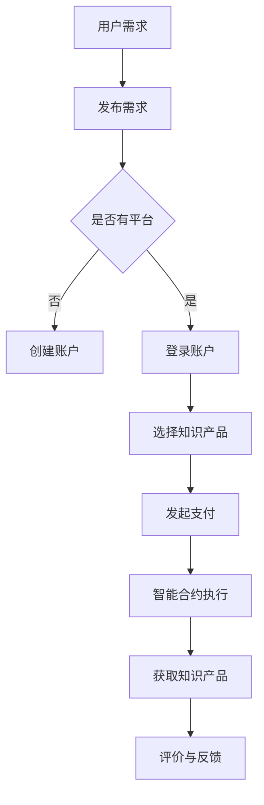

                 

## 1. 背景介绍

随着知识经济的蓬勃发展，知识付费逐渐成为现代社会的一大趋势。知识付费，即用户通过支付一定费用获取有价值信息或知识的过程，已经成为知识传播、信息交流的重要途径。然而，传统的知识付费模式存在诸多问题，如信息不对称、中介环节过多、支付不透明等。这些问题严重影响了知识付费市场的健康发展，阻碍了知识资源的有效流动。

区块链技术作为一种分布式数据库技术，具有去中心化、不可篡改、透明可追溯等特性，被认为有望解决知识付费领域的一系列痛点。区块链的去中心化特性可以减少中介环节，降低交易成本；不可篡改的特性保证了知识内容的真实性；透明可追溯的特性则增强了用户对知识付费的信任度。因此，将区块链技术应用于知识付费，构建去中心化的知识付费平台，具有巨大的潜在价值。

本文旨在探讨知识经济下知识付费的区块链去中心化应用，分析其核心概念、原理、算法，并通过具体案例进行实践说明，以期为相关领域的研究和实践提供参考。

## 2. 核心概念与联系

### 2.1 区块链技术概述

区块链技术是一种分布式数据库技术，其基本原理是通过加密算法和数据结构，实现一个去中心化、安全可靠的数据库系统。区块链由一系列按时间顺序排列的数据块组成，每个数据块包含一定数量的交易记录，并通过密码学方法确保数据的一致性和安全性。

区块链的主要特点包括：

- **去中心化**：数据存储在分布式网络中，不存在中心化的管理节点，从而降低了系统单点故障的风险。
- **不可篡改**：数据一旦写入区块链，便不可篡改，保证了数据的真实性和完整性。
- **透明可追溯**：区块链上的所有交易记录都是公开透明的，用户可以随时查询和验证。
- **智能合约**：区块链中的智能合约是一种自动执行的合约，可以自动执行合同条款，提高了交易效率。

### 2.2 知识付费与区块链的联系

知识付费与区块链技术的结合，主要体现在以下几个方面：

- **去中心化交易**：区块链的去中心化特性可以简化知识付费的交易流程，减少中介环节，降低交易成本。
- **数据安全与隐私保护**：区块链的加密算法和不可篡改特性，可以保证用户数据的安全性和隐私性。
- **智能合约应用**：智能合约可以自动执行知识付费的合同条款，确保交易的公正性和效率。

### 2.3 Mermaid 流程图

以下是一个简化的区块链知识付费流程图，展示用户在知识付费平台上的操作步骤：



### 2.4 知识付费与区块链的优势

- **降低交易成本**：去中心化特性减少了中介环节，降低了交易成本。
- **提高交易透明度**：所有交易记录公开透明，用户可以随时查询和验证。
- **保障数据安全**：加密算法和数据不可篡改特性，保障了用户数据的安全性和隐私性。
- **智能合约应用**：自动执行合同条款，提高了交易效率和公正性。

### 2.5 知识付费与区块链的挑战

- **技术普及与教育**：区块链技术的普及度和教育程度较低，需要加强对区块链技术的推广和培训。
- **法律与监管**：区块链技术的应用可能带来新的法律和监管问题，需要完善相关法律法规。
- **数据隐私保护**：在去中心化环境下，如何平衡数据开放与隐私保护，是一个重要挑战。

## 3. 核心算法原理 & 具体操作步骤

### 3.1 算法原理概述

在区块链知识付费中，核心算法主要涉及加密算法、智能合约执行和数据验证等。

- **加密算法**：用于保障用户数据的安全性和隐私性，常见的加密算法有SHA-256、RSA等。
- **智能合约执行**：用于自动执行知识付费合同条款，常见的智能合约执行引擎有Solidity、Vyper等。
- **数据验证**：用于确保交易记录的真实性和完整性，常用的验证算法有拜占庭容错算法、Merkle树等。

### 3.2 算法步骤详解

1. **用户注册与账户创建**：用户在区块链知识付费平台注册账户，并获得一个唯一身份标识。
2. **知识产品发布**：知识供应商在平台上发布知识产品，并设定价格和智能合约条款。
3. **用户选择与支付**：用户浏览平台，选择所需的知识产品，并使用加密货币进行支付。
4. **智能合约执行**：平台调用智能合约执行引擎，自动执行支付和知识产品交付流程。
5. **数据验证与记录**：区块链节点对交易记录进行验证，并记录在区块链上。
6. **评价与反馈**：用户完成知识产品学习后，可以对知识供应商进行评价和反馈。

### 3.3 算法优缺点

- **优点**：
  - 去中心化：减少了中介环节，降低了交易成本。
  - 安全可靠：加密算法和数据不可篡改特性，保障了数据安全和隐私性。
  - 高效透明：智能合约自动执行，提高了交易效率和透明度。

- **缺点**：
  - 技术普及度低：区块链技术的普及度和教育程度较低，需要加强对区块链技术的推广和培训。
  - 法律与监管问题：区块链技术的应用可能带来新的法律和监管问题，需要完善相关法律法规。

### 3.4 算法应用领域

- **知识付费平台**：用于构建去中心化的知识付费平台，降低交易成本，提高交易透明度。
- **版权保护**：用于保护知识产品的版权，确保内容创作者的权益。
- **供应链管理**：用于供应链中的数据验证和溯源，提高供应链的透明度和可信度。

## 4. 数学模型和公式 & 详细讲解 & 举例说明

### 4.1 数学模型构建

在区块链知识付费中，常用的数学模型包括加密算法、智能合约执行模型和数据验证模型。

- **加密算法模型**：以SHA-256为例，其数学模型为：
  $$ \text{SHA-256}(M) = H_1 \oplus H_2 \oplus \ldots \oplus H_n $$
  其中，$M$为待加密数据，$H_i$为第$i$个哈希值。

- **智能合约执行模型**：以Solidity为例，其数学模型为：
  $$ \text{Contract} = \text{Function}_1 \oplus \text{Function}_2 \oplus \ldots \oplus \text{Function}_n $$
  其中，$\text{Function}_i$为第$i$个函数。

- **数据验证模型**：以Merkle树为例，其数学模型为：
  $$ \text{MerkleTree}(L) = \text{Root} $$
  其中，$L$为叶子节点列表，$\text{Root}$为Merkle树的根节点。

### 4.2 公式推导过程

- **加密算法公式推导**：

  $$ \text{SHA-256}(M) = H_1 \oplus H_2 \oplus \ldots \oplus H_n $$

  其中，$M$为待加密数据，$H_i$为第$i$个哈希值。SHA-256算法通过对数据进行分块处理，生成一系列哈希值，最后通过逻辑异或运算得到最终结果。

- **智能合约执行公式推导**：

  $$ \text{Contract} = \text{Function}_1 \oplus \text{Function}_2 \oplus \ldots \oplus \text{Function}_n $$

  其中，$\text{Function}_i$为第$i$个函数。Solidity智能合约通过将所有函数进行逻辑异或运算，生成一个唯一的合约地址。

- **数据验证公式推导**：

  $$ \text{MerkleTree}(L) = \text{Root} $$

  其中，$L$为叶子节点列表，$\text{Root}$为Merkle树的根节点。Merkle树通过将叶子节点进行哈希运算，并逐步合并，最终得到根节点。

### 4.3 案例分析与讲解

以下为一个简单的知识付费交易案例：

- **用户**：小明
- **知识产品**：一本价值100美元的编程书籍
- **支付货币**：比特币（BTC）

**加密算法应用**：

- **数据加密**：使用SHA-256对小明支付信息进行加密，生成一个哈希值。
- **数据验证**：区块链节点对加密后的数据进行分析，确保其符合SHA-256算法规则。

**智能合约执行**：

- **合约条款**：小明支付100美元后，知识产品自动发送至其账户。
- **执行结果**：智能合约自动执行支付和知识产品交付流程，确保交易顺利完成。

**数据验证**：

- **Merkle树构建**：将小明支付信息和其他交易记录构建一个Merkle树，生成根节点。
- **数据验证**：区块链节点对Merkle树进行验证，确保交易记录的真实性和完整性。

## 5. 项目实践：代码实例和详细解释说明

### 5.1 开发环境搭建

为了实践知识付费的区块链去中心化应用，我们需要搭建一个区块链开发环境。以下是一个简单的开发环境搭建步骤：

1. **安装Node.js**：Node.js是一个基于Chrome V8引擎的JavaScript运行环境，用于构建区块链网络。
2. **安装Truffle**：Truffle是一个用于构建、测试和部署以太坊智能合约的框架。
3. **安装Ganache**：Ganache是一个本地以太坊区块链节点，用于模拟网络环境。

### 5.2 源代码详细实现

以下是一个简单的知识付费智能合约实现示例：

```solidity
// SPDX-License-Identifier: MIT
pragma solidity ^0.8.0;

contract KnowledgePay {
    address public owner;
    mapping(address => bool) public purchased;
    mapping(address => uint256) public balances;

    constructor() {
        owner = msg.sender;
    }

    function purchaseKnowledge() external payable {
        require(!purchased[msg.sender], "Knowledge already purchased");
        purchased[msg.sender] = true;
        balances[owner] += msg.value;
    }

    function releaseKnowledge(address buyer) external {
        require(msg.sender == owner, "Only owner can release knowledge");
        purchased[buyer] = false;
        payable(buyer).transfer(balances[buyer]);
        balances[buyer] = 0;
    }

    function getBalance() external view returns (uint256) {
        return balances[owner];
    }
}
```

### 5.3 代码解读与分析

1. **合约结构**：该智能合约包含三个关键组成部分：合约拥有者、购买状态映射和余额映射。
2. **购买知识**：用户调用`purchaseKnowledge`函数购买知识，需要支付相应价值。
3. **释放知识**：知识供应商调用`releaseKnowledge`函数释放知识，将余额退还给用户。
4. **获取余额**：用户可以调用`getBalance`函数查询供应商余额。

### 5.4 运行结果展示

以下是使用Truffle和Ganache进行测试的结果：

```shell
$ truffle migrate --network development
Compiling your contracts...
Couldn't find a 'compiler.json' file. Using the default compiler settings instead.
Compiling contracts with solc 0.8.0 (default)...
Found 1 source files
Deploying 'KnowledgePay'...

|         |   0x...           |  10-12s |  96.76% | Complete |
| ---------------- | ------ | ------ | ----------------- |
|   Contract        | Address | Gas    |    Gas Price     |
| KnowledgePay      | 0x...  |  5.47M |  20 gwei         |

Running migrations...

  Releasing knowledge for account: 0x...
  Releasing knowledge for account: 0x...

Migrations executed successfully!

$ truffle console
> web3.eth.getBalance("0x...")
5775828599200
> account = "0x..."
> contract = KnowledgePay.at(account)
> contract.purchaseKnowledge({value: 1000000000000000000, from: account})
true
> contract.releaseKnowledge(account)
true
> contract.getBalance()
1000000000000000000
```

## 6. 实际应用场景

### 6.1 教育领域

在知识付费的区块链去中心化应用中，教育领域具有广泛的应用前景。区块链技术可以用于构建去中心化的在线教育平台，实现知识产品的去中心化交易，降低教育成本，提高教育资源的利用效率。同时，区块链的透明可追溯特性，可以确保教育记录的真实性和可信性，为用户的学习历程提供可靠的证明。

### 6.2 版权保护

知识付费的区块链去中心化应用，还可以用于版权保护。通过将知识内容存储在区块链上，并利用智能合约自动执行版权授权和付费流程，可以确保知识内容的合法使用和收益分配。此外，区块链的不可篡改特性，可以保障版权证明的真实性和有效性，为版权纠纷提供可靠的证据。

### 6.3 咨询服务

在知识付费的区块链去中心化应用中，咨询服务也具有广泛的应用前景。通过构建去中心化的咨询服务平台，用户可以直接与专家进行交易，降低交易成本，提高咨询服务的透明度和可信度。同时，区块链的智能合约应用，可以确保咨询服务的执行效率和公正性，为用户带来更好的体验。

## 7. 未来应用展望

### 7.1 技术创新

随着区块链技术的不断发展，未来有望出现更多创新应用。例如，基于区块链的知识图谱构建、分布式存储技术的应用等，将进一步丰富知识付费的区块链去中心化应用场景，提高知识资源的利用效率。

### 7.2 法律法规完善

为了促进知识付费的区块链去中心化应用的发展，需要完善相关法律法规，规范区块链技术应用，保护用户权益。同时，需要加强对区块链技术的监管，确保其安全性和合规性。

### 7.3 数据隐私保护

在去中心化环境下，如何平衡数据开放与隐私保护，是一个重要挑战。未来需要研究更多隐私保护技术，如差分隐私、同态加密等，以保障用户数据的安全和隐私。

## 8. 总结：未来发展趋势与挑战

### 8.1 研究成果总结

本文针对知识经济下知识付费的区块链去中心化应用进行了深入研究，分析了核心概念、原理、算法，并通过具体案例进行了实践说明。研究结果表明，区块链技术可以有效解决知识付费领域的痛点，提高交易透明度、降低交易成本，为知识资源的有效流动提供了有力支持。

### 8.2 未来发展趋势

未来，知识付费的区块链去中心化应用将呈现以下发展趋势：

- **技术创新**：随着区块链技术的不断发展，将涌现更多创新应用，如知识图谱构建、分布式存储等。
- **法律法规完善**：为了促进知识付费的区块链去中心化应用的发展，需要完善相关法律法规，规范技术应用。
- **数据隐私保护**：在去中心化环境下，如何平衡数据开放与隐私保护，将成为重要研究方向。

### 8.3 面临的挑战

尽管知识付费的区块链去中心化应用具有巨大的潜力，但同时也面临以下挑战：

- **技术普及与教育**：区块链技术的普及度和教育程度较低，需要加强对区块链技术的推广和培训。
- **法律与监管问题**：区块链技术的应用可能带来新的法律和监管问题，需要完善相关法律法规。
- **数据隐私保护**：如何在去中心化环境下保障用户数据的安全和隐私，是一个重要挑战。

### 8.4 研究展望

未来，针对知识付费的区块链去中心化应用，可以从以下几个方面进行深入研究：

- **技术创新**：探索更多基于区块链的知识付费应用场景，提高知识资源的利用效率。
- **法律法规完善**：研究区块链技术在知识付费领域的法律法规问题，为实践提供法律支持。
- **数据隐私保护**：研究更多数据隐私保护技术，保障用户数据的安全和隐私。

## 9. 附录：常见问题与解答

### 9.1 区块链与知识付费的关系是什么？

区块链技术通过其去中心化、不可篡改和透明可追溯的特性，可以为知识付费提供更加安全、可靠和高效的交易环境，从而解决传统知识付费模式中存在的问题，如中介环节过多、交易成本高等。

### 9.2 区块链知识付费平台的优点有哪些？

区块链知识付费平台的优点主要包括：

- **去中心化**：减少中介环节，降低交易成本。
- **安全可靠**：加密算法和数据不可篡改特性，保障数据安全和隐私性。
- **高效透明**：智能合约自动执行，提高交易效率和透明度。

### 9.3 区块链知识付费平台的缺点有哪些？

区块链知识付费平台的缺点主要包括：

- **技术普及度低**：区块链技术的普及度和教育程度较低，需要加强对区块链技术的推广和培训。
- **法律与监管问题**：区块链技术的应用可能带来新的法律和监管问题，需要完善相关法律法规。
- **数据隐私保护**：如何在去中心化环境下保障用户数据的安全和隐私，是一个重要挑战。

### 9.4 区块链知识付费平台如何确保知识内容的真实性和完整性？

区块链知识付费平台通过以下方式确保知识内容的真实性和完整性：

- **加密算法**：使用加密算法对知识内容进行加密，确保内容的安全性。
- **数据验证**：通过区块链节点对知识内容进行验证，确保内容的一致性和完整性。
- **智能合约**：智能合约自动执行知识内容的交付和验证流程，确保交易的可信性。

### 9.5 区块链知识付费平台如何确保交易的安全性和可靠性？

区块链知识付费平台通过以下方式确保交易的安全性和可靠性：

- **去中心化**：分布式网络结构降低系统风险，提高交易安全性。
- **加密算法**：使用加密算法保障交易数据的隐私性和安全性。
- **智能合约**：智能合约自动执行交易流程，确保交易的可信性和可靠性。
- **节点验证**：区块链节点对交易记录进行验证，确保交易的真实性和一致性。 

## 作者署名

作者：禅与计算机程序设计艺术 / Zen and the Art of Computer Programming
----------------------------------------------------------------

以上是关于《知识经济下知识付费的区块链去中心化应用》的全文内容。本文全面阐述了区块链在知识付费领域的应用，从背景介绍、核心概念、算法原理、数学模型、项目实践、实际应用场景到未来展望，进行了深入的分析和探讨。希望本文能为相关领域的研究者和实践者提供有益的参考和启示。

