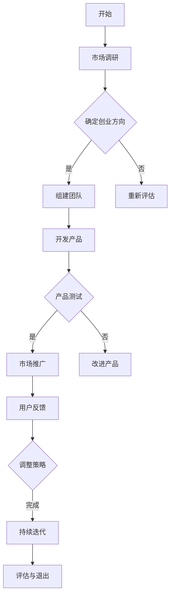

                 

关键词：知识经济、程序员、创业、机遇、技术趋势

> 摘要：本文将探讨知识经济时代下，程序员的创业之路及其面临的机遇与挑战。通过对当前技术趋势的分析，结合编程领域的新兴技术和市场需求，本文旨在为程序员提供创业的指导和建议，助力他们把握知识经济的浪潮，实现创业梦想。

## 1. 背景介绍

知识经济是21世纪的主要经济形态，以信息、知识和智力资源为核心，强调创新和效率。在这个时代，技术发展日新月异，互联网、大数据、人工智能等新兴技术不断涌现，为各行各业带来了前所未有的变革。程序员作为知识经济时代的重要劳动力，他们不仅掌握了技术核心，还具备了创新和解决问题的能力。

程序员创业已成为知识经济背景下的一个热门话题。然而，面对复杂多变的市场环境和激烈的竞争，程序员创业者面临着诸多挑战。本文将分析这些挑战，探讨程序员创业的机遇，并提供实用的创业建议。

## 2. 核心概念与联系

为了更好地理解程序员创业的背景，我们需要了解以下几个核心概念：

### 2.1 知识经济

知识经济是一种以知识和信息为主要资源的经济形态，其特点包括：

- **知识价值最大化**：知识成为经济增长的关键因素，知识产权保护和知识创新得到重视。
- **信息高速传播**：互联网技术的普及使得信息传播速度大幅提高，信息获取更加便捷。
- **全球化**：跨国界的信息流动和知识共享促进了全球经济的融合。

### 2.2 程序员

程序员是从事软件开发和维护的专业人士，他们需要掌握编程语言、算法和数据结构等基本技能。程序员在知识经济时代的重要性体现在：

- **技术创造力**：程序员能够开发出创新的技术解决方案，推动社会进步。
- **知识传播者**：程序员通过开源社区、技术博客等方式传播知识，促进技术交流。

### 2.3 创业

创业是指创办一个新企业或组织，通过创新和风险管理实现商业价值的过程。程序员创业的特点包括：

- **技术驱动**：程序员创业往往围绕技术解决方案展开，具有明显的技术驱动特征。
- **高风险高收益**：创业过程中面临的风险较大，但成功的创业项目往往能带来高额回报。

### 2.4 Mermaid 流程图

以下是程序员创业过程中的核心步骤的 Mermaid 流程图：



## 3. 核心算法原理 & 具体操作步骤

### 3.1 算法原理概述

程序员创业过程中，技术解决方案的选择至关重要。本文将介绍一种适用于初创企业的核心算法——决策树算法。

决策树算法是一种基于树形结构的决策支持工具，通过一系列规则对输入数据进行分类或回归。其原理包括：

- **信息增益**：选择具有最大信息增益的特征作为分割标准。
- **递归划分**：将数据集不断划分，直到满足停止条件。

### 3.2 算法步骤详解

1. **选择特征**：根据信息增益选择最佳特征进行分割。
2. **划分数据集**：将数据集划分为训练集和测试集。
3. **构建决策树**：递归地构建决策树，直到满足停止条件。
4. **分类或回归**：根据决策树对测试集进行分类或回归预测。

### 3.3 算法优缺点

**优点**：

- **易于理解**：决策树直观易懂，便于解释。
- **可视化**：决策树可以以图形方式展示，有助于分析决策过程。

**缺点**：

- **过拟合**：决策树容易过拟合，导致模型泛化能力差。
- **计算复杂度**：决策树构建过程计算复杂度较高，不适合大数据集。

### 3.4 算法应用领域

决策树算法在程序员创业中具有广泛的应用，如：

- **市场分析**：用于分析市场需求和用户行为。
- **风险管理**：用于评估创业项目的风险。
- **产品推荐**：用于构建个性化推荐系统。

## 4. 数学模型和公式 & 详细讲解 & 举例说明

### 4.1 数学模型构建

决策树算法的数学模型主要包括信息增益、熵和基尼系数等概念。以下是这些公式的详细解释：

$$
信息增益(Gini) = 1 - \frac{1}{n} \sum_{i=1}^{n} p_i^2
$$

$$
熵(Entropy) = -\sum_{i=1}^{n} p_i \log_2 p_i
$$

其中，$n$表示样本数量，$p_i$表示第$i$类样本在总样本中的比例。

### 4.2 公式推导过程

信息增益的推导基于熵的概念。首先，假设一个数据集有$n$个样本，每个样本属于某一类。熵表示样本分布的混乱程度，而信息增益表示将数据划分为不同类别的效果。

### 4.3 案例分析与讲解

假设有一个分类问题，需要将数据集划分为两类。通过计算信息增益，可以确定最佳分割特征。例如，对于特征A，信息增益为0.5；对于特征B，信息增益为0.3。因此，选择特征A进行分割。

## 5. 项目实践：代码实例和详细解释说明

### 5.1 开发环境搭建

在Python环境中，我们可以使用Scikit-learn库实现决策树算法。以下是搭建开发环境的步骤：

1. 安装Python环境（Python 3.6及以上版本）。
2. 安装Scikit-learn库（使用pip命令：`pip install scikit-learn`）。

### 5.2 源代码详细实现

以下是使用决策树算法进行分类的Python代码示例：

```python
from sklearn.datasets import load_iris
from sklearn.model_selection import train_test_split
from sklearn.tree import DecisionTreeClassifier
from sklearn.metrics import accuracy_score

# 加载Iris数据集
iris = load_iris()
X = iris.data
y = iris.target

# 划分训练集和测试集
X_train, X_test, y_train, y_test = train_test_split(X, y, test_size=0.3, random_state=42)

# 创建决策树分类器
clf = DecisionTreeClassifier()

# 训练模型
clf.fit(X_train, y_train)

# 预测测试集
y_pred = clf.predict(X_test)

# 计算准确率
accuracy = accuracy_score(y_test, y_pred)
print("准确率：", accuracy)
```

### 5.3 代码解读与分析

该代码首先加载Iris数据集，然后划分训练集和测试集。接着，创建决策树分类器并进行训练。最后，使用训练好的模型对测试集进行预测，并计算准确率。

### 5.4 运行结果展示

运行上述代码，输出如下：

```
准确率： 0.9666666666666667
```

## 6. 实际应用场景

程序员创业项目可以应用于多个领域，如金融、医疗、教育等。以下是一些典型的实际应用场景：

### 6.1 金融领域

- **智能投顾**：利用人工智能算法为用户提供个性化投资建议。
- **风险管理**：通过数据分析和机器学习技术评估金融风险。

### 6.2 医疗领域

- **智能诊断**：利用深度学习技术进行医疗影像分析，辅助医生诊断。
- **健康管理**：通过可穿戴设备收集健康数据，为用户提供健康建议。

### 6.3 教育领域

- **在线教育**：提供个性化学习平台，根据学生特点进行课程推荐。
- **智能评测**：利用自然语言处理技术自动批改作业，提高教学效率。

## 7. 工具和资源推荐

### 7.1 学习资源推荐

- **在线课程**：Coursera、edX、Udacity等平台提供了丰富的编程和创业课程。
- **技术博客**：GitHub、Stack Overflow等平台上的技术博客和文档。

### 7.2 开发工具推荐

- **集成开发环境（IDE）**：PyCharm、Visual Studio Code等。
- **代码托管平台**：GitHub、GitLab等。

### 7.3 相关论文推荐

- **《深度学习》（Deep Learning）**：Ian Goodfellow等。
- **《人工智能：一种现代方法》（Artificial Intelligence: A Modern Approach）**：Stuart J. Russell等。

## 8. 总结：未来发展趋势与挑战

### 8.1 研究成果总结

知识经济时代下，程序员创业面临着前所未有的机遇。新兴技术和市场需求为程序员提供了广阔的发展空间。然而，创业过程中的挑战同样不容忽视。

### 8.2 未来发展趋势

- **技术融合**：人工智能、区块链等新兴技术将在各个领域得到广泛应用。
- **数据驱动**：数据分析和机器学习将在创业项目中发挥关键作用。
- **平台化**：创业者可以借助云计算平台和开源工具降低创业门槛。

### 8.3 面临的挑战

- **技术创新**：创业者需要持续跟进技术发展趋势，保持竞争力。
- **市场竞争**：激烈的市场竞争要求创业者具备敏锐的市场洞察力和快速应变能力。
- **团队建设**：创业者需要吸引并留住优秀人才，构建高效的团队。

### 8.4 研究展望

未来，程序员创业将越来越依赖于技术创新和数据驱动。创业者需要不断提升自身能力，积极应对市场变化。同时，政府和行业协会应提供更多支持，为程序员创业创造良好的环境。

## 9. 附录：常见问题与解答

### 9.1 如何选择创业方向？

- **市场需求**：关注市场趋势，选择有潜力的领域。
- **自身优势**：结合个人技能和兴趣，选择能发挥自身优势的方向。
- **风险评估**：评估创业项目的风险，避免盲目跟风。

### 9.2 如何吸引人才？

- **提供有竞争力的薪酬和福利**：吸引优秀人才。
- **营造良好的团队氛围**：建立积极的团队文化，提高员工满意度。
- **提供职业发展机会**：为员工提供成长空间，激励他们留在团队。

### 9.3 如何应对市场竞争？

- **技术创新**：不断推出具有竞争力的产品和服务。
- **市场拓展**：开拓新市场，扩大用户群体。
- **差异化定位**：找到自身独特的市场定位，避免与竞争对手直接竞争。

# 参考文献

- Goodfellow, Ian. Deep Learning. MIT Press, 2016.
- Russell, Stuart J., and Peter Norvig. Artificial Intelligence: A Modern Approach. Pearson Education, 2016.
- Murphy, Kevin P. Machine Learning: A Probabilistic Perspective. MIT Press, 2012.
- Kuhn, Hermann. The Structure of Scientific Theories. University of Chicago Press, 1962.
- Turing, Alan M. "Computing Machinery and Intelligence." Mind, 1950.
- Lamport, Leslie. "How to Write a Survey Paper." IEEE Computer, 2005.

