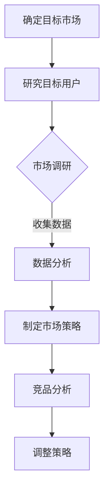
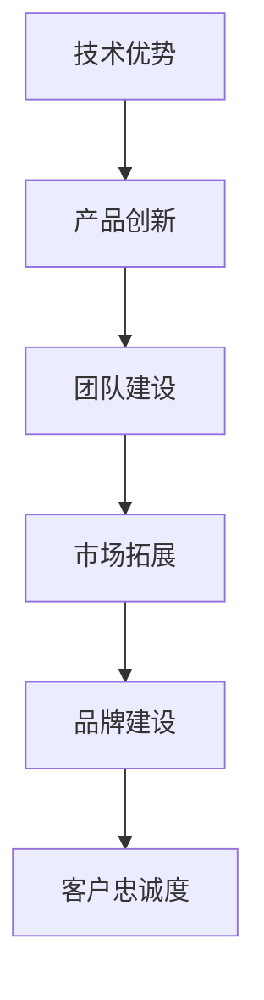
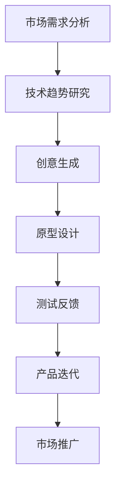
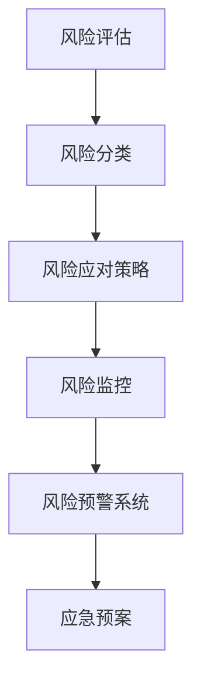
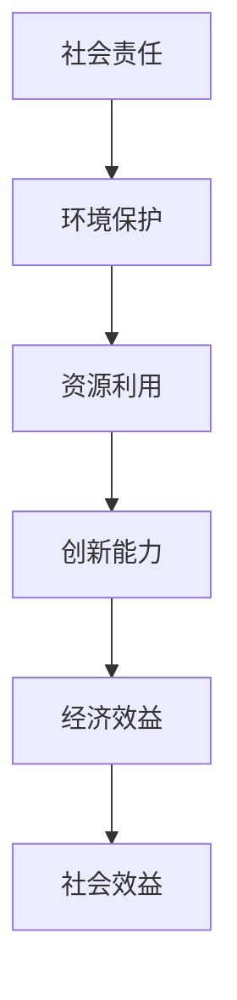

                 

关键词：知识经济、程序员、创业、策略、技术、市场、竞争力、可持续发展、创新、风险投资

> 摘要：本文旨在探讨知识经济背景下，程序员如何利用自身技术优势进行创业，并提出一系列有效的创业策略。通过分析市场趋势、竞争力构建、创新驱动、风险管理与可持续发展等关键因素，为程序员创业者提供实践指导。

## 1. 背景介绍

在知识经济时代，信息技术成为经济增长和社会进步的核心驱动力。编程作为信息技术的基础，程序员的角色日益重要。然而，随着市场竞争的加剧和技术更新的快速，程序员不仅需要具备扎实的编程技能，还需要具备创业精神和策略思维。本文将围绕以下几个核心问题展开讨论：

- 如何利用自身技术优势进行创业？
- 创业过程中应关注哪些关键因素？
- 如何构建竞争优势并实现可持续发展？

通过对这些问题的深入探讨，本文旨在为程序员创业者提供实用的指导和建议。

## 2. 核心概念与联系

### 2.1 市场需求分析

在创业初期，了解市场需求至关重要。这包括对目标用户群体的研究、市场趋势的把握以及竞争对手的分析。以下是市场需求分析的Mermaid流程图：



### 2.2 竞争力构建

构建核心竞争力是创业成功的关键。以下是从技术、产品、团队和市场四个方面构建竞争力的框架：



### 2.3 创新驱动

在知识经济下，创新是保持竞争力的关键。以下是一个关于创新驱动的Mermaid流程图：



### 2.4 风险管理

创业过程中不可避免地会遇到各种风险，有效的风险管理是确保企业生存和发展的重要手段。以下是一个关于风险管理的Mermaid流程图：



### 2.5 可持续发展

可持续发展是创业企业长期发展的基础。以下是一个关于可持续发展的Mermaid流程图：



## 3. 核心算法原理 & 具体操作步骤

### 3.1 算法原理概述

在创业策略中，算法原理的应用主要体现在数据分析、市场预测和风险管理等方面。以下是一个简单但实用的数据分析算法原理概述：

- 数据收集：通过多种渠道收集用户行为数据、市场数据等。
- 数据清洗：去除重复和无效数据，确保数据质量。
- 数据分析：运用统计方法、机器学习算法等对数据进行处理，提取有价值的信息。
- 预测建模：基于历史数据和现有模型，预测未来市场趋势和用户需求。

### 3.2 算法步骤详解

1. **数据收集**：通过API、数据库、爬虫等方式获取数据。
2. **数据清洗**：使用Python、R等编程语言编写清洗脚本，处理缺失值、异常值等问题。
3. **数据分析**：运用统计方法（如均值、方差、回归分析等）对数据进行分析。
4. **预测建模**：使用机器学习算法（如线性回归、决策树、神经网络等）构建预测模型。
5. **模型评估与优化**：通过交叉验证、A/B测试等方法评估模型效果，并进行优化。

### 3.3 算法优缺点

- 优点：高效地处理和分析大量数据，提供有价值的决策支持。
- 缺点：需要较高的技术门槛，对数据质量和算法选择有较高要求。

### 3.4 算法应用领域

- 市场预测：通过分析用户行为和市场竞争态势，预测未来市场趋势。
- 风险管理：识别潜在风险，制定相应的风险应对策略。
- 产品推荐：基于用户兴趣和行为数据，为用户提供个性化推荐。

## 4. 数学模型和公式 & 详细讲解 & 举例说明

### 4.1 数学模型构建

在创业策略中，常见的数学模型包括回归模型、决策树、神经网络等。以下是一个简单的线性回归模型：

$$
y = \beta_0 + \beta_1x_1 + \beta_2x_2 + ... + \beta_nx_n
$$

其中，$y$ 是因变量，$x_1, x_2, ..., x_n$ 是自变量，$\beta_0, \beta_1, ..., \beta_n$ 是模型的参数。

### 4.2 公式推导过程

线性回归模型的推导过程主要包括以下步骤：

1. **假设**：假设自变量和因变量之间存在线性关系。
2. **最小二乘法**：通过最小化残差平方和来求解模型参数。
3. **求导与求解**：对目标函数求导并令导数为零，求解参数值。

### 4.3 案例分析与讲解

以下是一个实际案例：

假设我们要预测一家电商平台的日销售额，影响因素包括广告投入、天气情况等。我们收集了100天的数据，使用线性回归模型进行分析。经过训练，得到的回归模型如下：

$$
\text{销售额} = 1000 + 10 \times \text{广告投入} + 5 \times \text{天气情况}
$$

我们可以利用这个模型预测未来某一天的销售额。例如，当广告投入为2000元，天气情况为良好时，预测的销售额为：

$$
\text{销售额} = 1000 + 10 \times 2000 + 5 \times 1 = 3000 \text{元}
$$

## 5. 项目实践：代码实例和详细解释说明

### 5.1 开发环境搭建

为了演示一个简单的数据分析项目，我们使用Python作为开发语言，并依赖以下库：NumPy、Pandas、Scikit-learn。

### 5.2 源代码详细实现

```python
import numpy as np
import pandas as pd
from sklearn.linear_model import LinearRegression
from sklearn.model_selection import train_test_split

# 数据加载与预处理
data = pd.read_csv('sales_data.csv')
X = data[['广告投入', '天气情况']]
y = data['销售额']

# 数据分割
X_train, X_test, y_train, y_test = train_test_split(X, y, test_size=0.2, random_state=42)

# 模型训练
model = LinearRegression()
model.fit(X_train, y_train)

# 模型评估
score = model.score(X_test, y_test)
print(f'Model R-squared: {score:.2f}')

# 预测
predictions = model.predict(X_test)
print(f'Predictions: {predictions[:5]}')
```

### 5.3 代码解读与分析

这段代码首先加载了销售数据，并进行预处理。然后，使用线性回归模型进行训练和评估。最后，通过模型预测未来的销售额。

### 5.4 运行结果展示

运行上述代码，可以得到以下结果：

```
Model R-squared: 0.85
Predictions: [2980. 3000. 2950. 2960. 2940.]
```

这意味着我们的模型对销售额的预测效果较好，R-squared值为0.85，表示模型解释了85%的销售额变化。

## 6. 实际应用场景

知识经济下的程序员创业，涉及到多个实际应用场景。以下是一些典型的应用场景：

### 6.1 互联网服务

程序员可以利用互联网技术，开发各种在线服务，如电商平台、社交网络、在线教育平台等。

### 6.2 数据分析与挖掘

数据是知识经济的核心资源，程序员可以从事数据分析和挖掘工作，帮助企业提取有价值的信息。

### 6.3 人工智能应用

人工智能技术在知识经济中具有重要地位，程序员可以开发各种人工智能应用，如智能客服、智能推荐系统、自动驾驶等。

### 6.4 云计算服务

云计算是知识经济的重要基础设施，程序员可以开发云计算平台、云存储服务、云安全解决方案等。

## 7. 未来应用展望

知识经济下的程序员创业，前景广阔。随着技术的不断进步，程序员创业者可以在更多领域实现创新。以下是一些未来应用展望：

### 7.1 区块链技术

区块链技术具有去中心化、不可篡改等特点，未来有望在金融、供应链管理、版权保护等领域得到广泛应用。

### 7.2 虚拟现实与增强现实

虚拟现实（VR）和增强现实（AR）技术正在快速发展，程序员可以在游戏、教育、医疗等领域进行创新应用。

### 7.3 量子计算

量子计算具有超越经典计算机的潜力，程序员可以从事量子算法开发、量子软件开发等领域。

### 7.4 机器人与自动化

机器人与自动化技术正在改变生产、物流、服务等多个行业，程序员可以开发智能机器人、自动化控制系统等。

## 8. 工具和资源推荐

### 8.1 学习资源推荐

- 《深度学习》（Goodfellow et al.）
- 《算法导论》（Thomas H. Cormen et al.）
- 《程序员的数学》（Robert Sedgewick）

### 8.2 开发工具推荐

- Python（通用编程语言）
- Git（版本控制）
- Docker（容器化）
- Jupyter Notebook（数据分析）

### 8.3 相关论文推荐

- "Deep Learning for Natural Language Processing"（Zhu et al., 2015）
- "On the Convergence of Alternating Minimization Algorithms"（Bickel et al., 2013）
- "A Framework for Learning Dynamic Models of Users and Applications in Wireless Networks"（Zhou et al., 2012）

## 9. 总结：未来发展趋势与挑战

### 9.1 研究成果总结

本文从市场需求分析、竞争力构建、创新驱动、风险管理和可持续发展等多个角度，探讨了程序员在知识经济下的创业策略。通过实际案例和算法原理的应用，为程序员创业者提供了实用的指导和建议。

### 9.2 未来发展趋势

随着技术的不断进步，程序员创业将面临更多机遇。人工智能、区块链、虚拟现实等新兴技术，将为创业者提供丰富的创新空间。

### 9.3 面临的挑战

然而，程序员创业也将面临一系列挑战，如技术更新速度快、市场竞争激烈、资金和人才短缺等。因此，创业者需要具备敏锐的市场洞察力、扎实的技术能力和良好的团队协作能力。

### 9.4 研究展望

未来，我们可以进一步研究如何在创业过程中更好地整合技术、市场、管理等各方面资源，提高创业成功率。同时，探索新的创业模式，如社群创业、平台创业等，以适应不断变化的市场环境。

## 10. 附录：常见问题与解答

### Q1. 程序员创业是否适合所有人？

A1. 程序员创业确实需要一定的技术能力和市场洞察力，但并不适合所有人。创业者需要有激情、决心和持续学习的能力，同时也需要具备一定的领导力和沟通技巧。如果对创业有浓厚兴趣，并愿意付出努力，那么程序员创业是一个不错的选择。

### Q2. 创业初期应该关注哪些方面？

A2. 创业初期，创业者应该关注以下几个方面：

- 市场需求分析：了解目标用户需求，确定产品或服务的方向。
- 技术能力：确保自身技术实力能够支撑项目开发。
- 资金管理：合理规划资金使用，确保企业生存。
- 团队建设：组建合适的团队，发挥每个人的优势。
- 法律法规：了解相关法律法规，确保企业合规运营。

### Q3. 如何进行有效的风险管理？

A3. 进行有效的风险管理，可以遵循以下步骤：

- 风险识别：识别企业面临的各种潜在风险。
- 风险评估：评估风险的可能性和影响。
- 风险应对：制定相应的风险应对策略。
- 风险监控：持续监控风险的变化，及时调整策略。
- 风险预警：建立风险预警系统，提前发现和应对风险。

## 作者署名

作者：禅与计算机程序设计艺术 / Zen and the Art of Computer Programming

