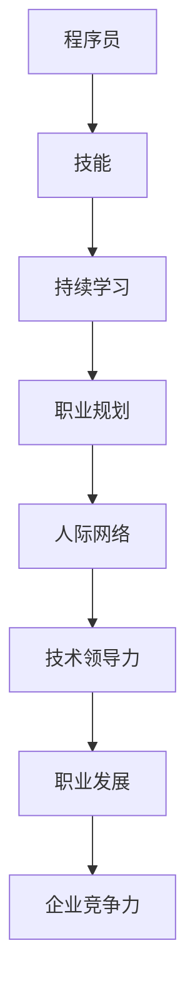

                 

在当今的知识经济时代，程序员作为技术行业的重要角色，其职业发展策略显得尤为重要。本文旨在探讨在知识经济背景下，程序员应如何制定和调整自己的职业发展策略，以适应快速变化的市场和技术环境。

> **关键词**：知识经济、程序员、职业发展、策略、技术趋势。

> **摘要**：本文首先概述了知识经济的特点，分析了程序员在这一时代面临的机遇和挑战。接着，从核心技能、持续学习、职业规划、人际网络和技术领导力五个方面，提出了程序员职业发展的策略。最后，展望了未来程序员职业发展可能面临的趋势和挑战。

## 1. 背景介绍

知识经济是指以知识和信息的生产、分配和使用为基础的经济形态。与传统经济模式相比，知识经济更加依赖于人类的知识、技能和创新能力。在知识经济时代，信息技术的高速发展极大地促进了知识的传播和应用，同时也使得市场竞争日益激烈。程序员作为信息技术领域的核心人才，其职业发展策略直接影响到个人和组织的竞争力。

### 1.1 知识经济的特点

1. **信息资源的重要性**：知识经济强调信息资源的作用，信息的获取、处理和利用成为经济增长的关键。
2. **创新驱动**：知识经济的发展依赖于技术创新和制度创新，创新成为企业竞争力的源泉。
3. **人力资本的价值**：知识经济时代，人力资本成为最重要的生产要素，人才的素质和创新能力决定企业的成败。

### 1.2 程序员面临的机遇和挑战

**机遇**：

- **技术需求增长**：随着信息技术的广泛应用，对程序员的需求持续增长。
- **职业多样化和专业化**：知识经济时代，程序员可以在更多领域找到职业机会，如大数据、人工智能、云计算等。
- **远程办公的普及**：技术的发展使得远程办公成为可能，程序员有更多自由选择工作和生活地点。

**挑战**：

- **技能更新速度快**：知识经济时代，技术更新迅速，程序员需要不断学习新的技术和工具。
- **竞争压力加大**：人才市场的竞争日益激烈，程序员需要不断提升自己的竞争力。
- **职业倦怠风险**：程序员的工作压力大，容易出现职业倦怠。

## 2. 核心概念与联系

为了更好地理解程序员的职业发展策略，我们需要先了解一些核心概念和其之间的联系。以下是一个简化的Mermaid流程图，展示了这些概念之间的关系：



### 2.1 技能

技能是程序员的核心竞争力。包括编程语言、开发工具、框架、算法和数据结构等。程序员需要不断更新自己的技能，以适应不断变化的技术环境。

### 2.2 持续学习

持续学习是程序员保持竞争力的关键。随着技术的快速发展，程序员需要不断学习新的知识和技能。

### 2.3 职业规划

职业规划是程序员职业发展的基础。通过设定短期和长期目标，程序员可以更好地规划自己的职业道路。

### 2.4 人际网络

人际网络是程序员在职场中获取资源和支持的重要途径。建立和维护良好的人际关系对于职业发展至关重要。

### 2.5 技术领导力

技术领导力是程序员在职业发展中进一步提升的关键。通过带领团队和推动技术创新，程序员可以在企业中发挥更大的作用。

## 3. 核心算法原理 & 具体操作步骤

在知识经济时代，程序员需要掌握一些核心算法原理，以便在解决复杂问题时提供有效的解决方案。以下是一个简化的算法原理和具体操作步骤：

### 3.1 算法原理概述

- **排序算法**：如快速排序、归并排序等，用于对数据进行排序。
- **查找算法**：如二分查找，用于在数据中快速查找特定元素。
- **动态规划**：用于求解具有重叠子问题和最优子结构特征的问题。

### 3.2 算法步骤详解

以快速排序为例，其基本步骤如下：

1. **选择基准**：从数组中选择一个元素作为基准。
2. **分区操作**：将数组划分为两部分，小于基准的元素放在其左侧，大于基准的元素放在其右侧。
3. **递归排序**：对小于基准的部分和大于基准的部分分别进行快速排序。

### 3.3 算法优缺点

- **快速排序**：优点是平均时间复杂度为O(nlogn)，在大多数情况下性能较好。缺点是空间复杂度为O(logn)，在某些情况下可能较差。
- **二分查找**：优点是时间复杂度为O(logn)，在大型数据集上性能优异。缺点是对数据的有序性要求较高。

### 3.4 算法应用领域

- **排序算法**：在数据库、搜索引擎等场景中广泛应用。
- **查找算法**：在搜索、排序等算法中作为基础算法。
- **动态规划**：在计算优化问题、路径规划等场景中应用广泛。

## 4. 数学模型和公式 & 详细讲解 & 举例说明

在知识经济时代，程序员不仅需要掌握编程技能，还需要具备一定的数学基础，以应对复杂的问题。以下是一个简化的数学模型和公式的讲解和举例：

### 4.1 数学模型构建

假设我们有一个简单的线性回归模型，用于预测销售额。模型公式如下：

$$y = ax + b$$

其中，$y$ 是销售额，$x$ 是广告费用，$a$ 和 $b$ 是模型的参数。

### 4.2 公式推导过程

我们通过最小二乘法来求解模型参数。首先，计算广告费用和销售额的协方差和方差：

$$\sigma_{xy} = \sum_{i=1}^{n}(x_i - \bar{x})(y_i - \bar{y})$$

$$\sigma_{xx} = \sum_{i=1}^{n}(x_i - \bar{x})^2$$

然后，使用以下公式求解参数：

$$a = \frac{\sigma_{xy}}{\sigma_{xx}}$$

$$b = \bar{y} - a\bar{x}$$

### 4.3 案例分析与讲解

假设我们有以下数据：

| 广告费用（万元） | 销售额（万元） |
|-----------------|--------------|
| 10              | 150          |
| 20              | 200          |
| 30              | 250          |
| 40              | 300          |
| 50              | 350          |

首先，计算平均值：

$$\bar{x} = \frac{10 + 20 + 30 + 40 + 50}{5} = 30$$

$$\bar{y} = \frac{150 + 200 + 250 + 300 + 350}{5} = 250$$

然后，计算协方差和方差：

$$\sigma_{xy} = (10 - 30)(150 - 250) + (20 - 30)(200 - 250) + (30 - 30)(250 - 250) + (40 - 30)(300 - 250) + (50 - 30)(350 - 250) = -2500$$

$$\sigma_{xx} = (10 - 30)^2 + (20 - 30)^2 + (30 - 30)^2 + (40 - 30)^2 + (50 - 30)^2 = 2500$$

最后，求解参数：

$$a = \frac{-2500}{2500} = -1$$

$$b = 250 - (-1) \times 30 = 280$$

因此，销售额的预测公式为：

$$y = -x + 280$$

我们可以使用这个模型来预测不同广告费用下的销售额。例如，当广告费用为60万元时，预测的销售额为：

$$y = -60 + 280 = 220$$

## 5. 项目实践：代码实例和详细解释说明

为了更好地理解上述算法和数学模型，我们可以通过一个实际项目来进行实践。以下是一个简单的Python项目，用于实现线性回归模型并预测销售额。

### 5.1 开发环境搭建

1. 安装Python环境（推荐使用Python 3.8及以上版本）。
2. 安装必要的库，如NumPy和Matplotlib。

```shell
pip install numpy matplotlib
```

### 5.2 源代码详细实现

```python
import numpy as np
import matplotlib.pyplot as plt

# 数据
x = np.array([10, 20, 30, 40, 50])
y = np.array([150, 200, 250, 300, 350])

# 计算平均值
bar_x = np.mean(x)
bar_y = np.mean(y)

# 计算协方差和方差
sigma_xy = np.sum((x - bar_x) * (y - bar_y))
sigma_xx = np.sum((x - bar_x) ** 2)

# 求解参数
a = -sigma_xy / sigma_xx
b = bar_y - a * bar_x

# 模型公式
model = lambda x: a * x + b

# 预测销售额
x_new = 60
y_new = model(x_new)

# 可视化
plt.scatter(x, y, label='实际销售额')
plt.plot(x, model(x), label='预测销售额')
plt.scatter(x_new, y_new, color='r', label='预测销售额')
plt.xlabel('广告费用（万元）')
plt.ylabel('销售额（万元）')
plt.legend()
plt.show()

print(f'预测销售额（广告费用为{60}万元）：{y_new:.2f}万元')
```

### 5.3 代码解读与分析

1. **数据准备**：我们使用一组简单的数据来演示线性回归模型。
2. **计算平均值**：计算广告费用和销售额的平均值，用于后续计算。
3. **计算协方差和方差**：计算广告费用和销售额的协方差和方差，用于求解模型参数。
4. **求解参数**：使用最小二乘法求解线性回归模型的参数。
5. **模型公式**：定义线性回归模型，用于预测销售额。
6. **预测销售额**：使用模型对新的广告费用进行预测。
7. **可视化**：使用Matplotlib库将实际销售额和预测销售额进行可视化。

通过这个项目，我们可以直观地看到线性回归模型的应用，以及如何使用Python进行实际操作。

## 6. 实际应用场景

在知识经济时代，程序员在各个行业和应用场景中发挥着重要作用。以下是一些典型的实际应用场景：

### 6.1 金融行业

金融行业对程序员的依赖程度非常高。从金融交易系统、风险管理平台到量化投资策略，程序员在金融行业中扮演着关键角色。例如，高频交易系统需要程序员编写高效的算法，以在毫秒级别完成交易；风险管理系统需要程序员开发复杂的模型，以评估和监控风险。

### 6.2 医疗健康

随着大数据和人工智能技术的发展，医疗健康行业也在迅速变化。程序员在医疗健康行业中的工作包括开发电子健康记录系统、医疗数据分析平台和人工智能辅助诊断系统。这些系统可以帮助医生更准确地诊断疾病，提高治疗效果。

### 6.3 电子商务

电子商务是程序员的重要应用领域之一。从购物网站的前端开发到后端的交易处理，程序员在电子商务平台中发挥着关键作用。此外，随着个性化推荐和智能客服技术的发展，程序员在提高用户体验和提升销售额方面也发挥着重要作用。

### 6.4 物联网

物联网（IoT）的发展为程序员提供了广阔的应用场景。从智能家居、智能穿戴设备到工业物联网，程序员需要开发各种物联网应用。这些应用需要处理大量的传感器数据，进行实时分析和决策。

## 6.4 未来应用展望

随着技术的不断进步，程序员在未来将面临更多机会和挑战。以下是一些未来应用展望：

### 6.4.1 人工智能

人工智能（AI）是未来技术发展的重要方向。程序员将在AI算法、模型开发和应用中发挥关键作用。从自动驾驶汽车到智能家居，AI技术将渗透到我们生活的方方面面。

### 6.4.2 区块链

区块链技术具有去中心化、安全可靠的特点，将在金融、供应链管理、医疗等多个领域得到广泛应用。程序员需要掌握区块链编程技术，开发高效的区块链应用。

### 6.4.3 虚拟现实和增强现实

虚拟现实（VR）和增强现实（AR）技术的发展为程序员提供了新的应用场景。程序员可以开发各种VR/AR应用，如游戏、教育、医疗等。

### 6.4.4 生物科技

生物科技的发展将带来许多新的机会。程序员可以参与基因编辑、药物研发等领域的项目，为人类健康做出贡献。

## 7. 工具和资源推荐

为了帮助程序员在知识经济时代更好地发展，以下是一些推荐的工具和资源：

### 7.1 学习资源推荐

- **在线课程**：Coursera、edX、Udacity等平台提供丰富的编程和技术课程。
- **技术社区**：GitHub、Stack Overflow、Reddit等社区可以帮助程序员解决技术问题。
- **书籍**：《代码大全》、《深度学习》、《设计模式：可复用面向对象软件的基础》等经典技术书籍。

### 7.2 开发工具推荐

- **集成开发环境（IDE）**：Visual Studio Code、IntelliJ IDEA、PyCharm等。
- **版本控制工具**：Git、GitHub、GitLab等。
- **测试工具**：JUnit、pytest、Selenium等。
- **容器化工具**：Docker、Kubernetes等。

### 7.3 相关论文推荐

- **人工智能领域**：《深度学习：卷积神经网络》、《生成对抗网络：训练生成模型生成逼真数据》等。
- **区块链领域**：《比特币：一种点对点的电子现金系统》、《以太坊：下一代智能合约和去中心化应用平台》等。
- **物联网领域**：《物联网：概念、技术和应用》、《物联网安全：挑战与解决方案》等。

## 8. 总结：未来发展趋势与挑战

在知识经济时代，程序员的职业发展策略需要不断调整和优化。未来，程序员将面临更多机会和挑战：

### 8.1 研究成果总结

- **技术发展趋势**：人工智能、区块链、虚拟现实等技术将在未来得到广泛应用。
- **人才需求变化**：程序员需要具备多领域的知识和技能，以满足不同行业的需求。
- **职业环境变化**：远程办公、灵活工作制度的普及将改变程序员的职业环境。

### 8.2 未来发展趋势

- **技术融合**：不同技术领域之间的融合将产生新的应用场景和机会。
- **数据驱动**：数据的获取、处理和分析将成为企业决策和发展的关键。
- **人才竞争**：程序员需要不断提升自己的竞争力，以在激烈的人才市场中脱颖而出。

### 8.3 面临的挑战

- **技术更新速度加快**：程序员需要不断学习新的技术和工具，以保持竞争力。
- **职业压力增加**：程序员的工作压力可能增加，需要有效管理时间和工作压力。
- **职业倦怠风险**：程序员需要关注职业倦怠问题，保持工作热情和动力。

### 8.4 研究展望

- **人才培养**：加强编程教育和培训，提高程序员的素质和能力。
- **技术应用**：探索新技术在各个领域的应用，为社会发展做出贡献。
- **职业规划**：制定合理的职业规划，实现个人和职业的可持续发展。

## 9. 附录：常见问题与解答

### 9.1 程序员如何提升自己的竞争力？

**解答**：程序员可以通过以下途径提升自己的竞争力：

- **持续学习**：不断学习新的技术和知识，保持技术前沿。
- **实践项目**：参与实际项目，积累经验，提高解决实际问题的能力。
- **团队合作**：培养良好的团队合作精神，提高沟通协作能力。
- **职业规划**：设定明确的职业目标，制定合适的职业发展路线。

### 9.2 程序员如何应对技术更新速度加快的挑战？

**解答**：程序员可以采取以下措施应对技术更新速度加快的挑战：

- **时间管理**：合理安排学习时间，确保有足够的时间学习和实践。
- **技术选型**：关注新兴技术，了解其特点和适用场景，有针对性地学习。
- **社区参与**：积极参与技术社区，获取最新的技术资讯和交流经验。

### 9.3 程序员如何减轻工作压力和职业倦怠？

**解答**：程序员可以采取以下措施减轻工作压力和职业倦怠：

- **健康生活**：保持良好的作息习惯，适当锻炼身体。
- **时间管理**：合理规划工作时间和休息时间，避免过度劳累。
- **心态调整**：保持积极的心态，正确面对工作中的挑战和压力。
- **寻求支持**：与家人和朋友保持良好的沟通，寻求他们的支持和帮助。

----------------------------------------------------------------

# 作者署名

作者：禅与计算机程序设计艺术 / Zen and the Art of Computer Programming

