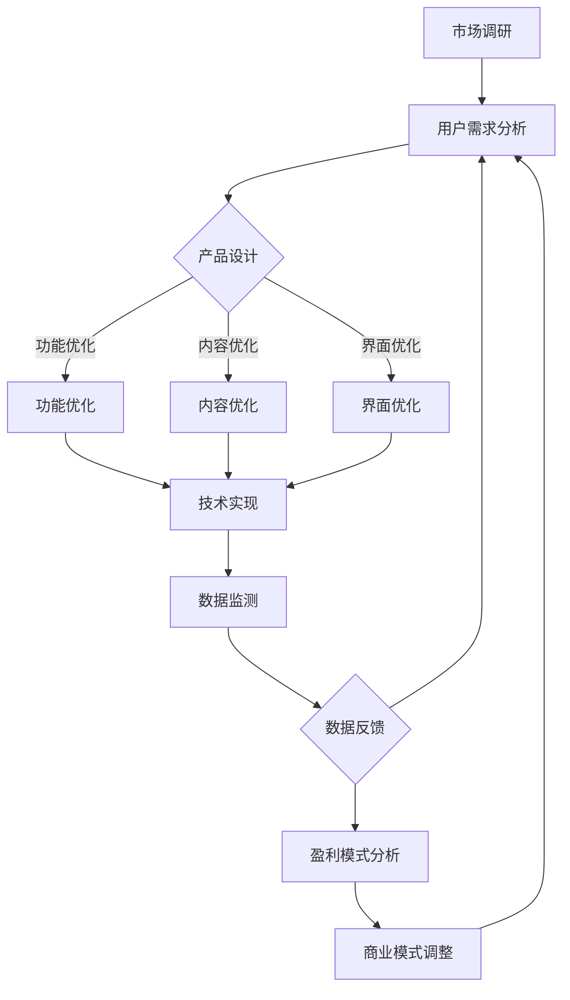

                 

## 1. 背景介绍

在知识经济时代，知识付费作为一种新兴的经济模式，已经逐渐成为推动经济发展的重要力量。知识付费产品不仅满足了人们对于知识的渴求，还为知识的传播和积累提供了有效的途径。然而，随着市场竞争的加剧和用户需求的不断变化，知识付费产品的创新和迭代显得尤为重要。

近年来，知识付费市场呈现出快速增长的趋势，各类知识付费产品层出不穷。然而，其中不少产品在运营过程中遇到了一系列问题，如用户粘性低、产品同质化严重、盈利模式不清晰等。为了解决这些问题，产品迭代优化成为知识付费企业亟待解决的问题。

本文旨在探讨知识经济时代下知识付费创新产品的迭代优化策略，通过分析当前市场现状、用户需求变化以及技术发展动态，为知识付费企业提供有效的迭代优化方案，助力其在激烈的市场竞争中脱颖而出。

## 2. 核心概念与联系

### 2.1 知识付费产品的核心概念

知识付费产品是指用户通过支付一定费用获取知识内容的商业模式。其主要特点包括：

- **付费门槛**：用户需支付费用才能获取知识内容。
- **内容多样性**：涵盖多种知识领域，如技能培训、行业分析、专业知识等。
- **定制化服务**：根据用户需求和偏好提供个性化的知识内容。

### 2.2 知识付费产品迭代优化的核心概念

知识付费产品迭代优化是指通过对产品进行持续改进，以满足用户需求、提高用户体验和增加盈利能力。其核心概念包括：

- **用户需求分析**：通过对用户行为和反馈数据的分析，了解用户需求。
- **产品设计**：根据用户需求，对产品功能、内容、界面等进行设计和调整。
- **技术实现**：运用先进的技术手段，提高产品的性能和用户体验。
- **数据驱动**：通过数据监测和分析，指导产品迭代优化方向。

### 2.3 知识付费产品迭代优化的关联概念

- **市场竞争**：知识付费市场竞争激烈，促使企业不断优化产品以获取更多用户。
- **用户生命周期**：从用户获取、留存到用户流失，整个生命周期中都需要进行优化。
- **盈利模式**：通过不断创新和优化，实现知识付费产品的可持续发展。

### 2.4 Mermaid 流程图



### 2.5 核心概念与联系总结

知识付费产品迭代优化是一个复杂的过程，涉及到多个核心概念和关联概念。通过深入分析这些概念，可以为知识付费企业提供有力的指导，助力其在市场竞争中取得优势。

## 3. 核心算法原理 & 具体操作步骤

### 3.1 算法原理概述

知识付费产品迭代优化的核心算法主要分为以下几个部分：

1. **用户行为分析算法**：通过对用户在平台上的行为数据进行挖掘和分析，了解用户兴趣、需求和痛点。
2. **内容推荐算法**：基于用户行为分析和用户画像，为用户推荐符合其兴趣和需求的知识内容。
3. **商业模式优化算法**：通过对市场数据和用户反馈的分析，优化知识付费产品的盈利模式。

### 3.2 算法步骤详解

#### 3.2.1 用户行为分析算法

1. **数据收集**：从用户行为数据中收集用户访问、浏览、点赞、评论等行为数据。
2. **数据预处理**：对收集到的数据进行清洗、去重和格式转换，使其符合分析需求。
3. **特征提取**：利用机器学习算法提取用户行为数据中的特征，如用户活跃度、兴趣偏好等。
4. **模型训练**：使用训练数据对机器学习模型进行训练，优化模型参数。
5. **模型评估**：使用验证数据对模型进行评估，调整模型参数，提高模型性能。

#### 3.2.2 内容推荐算法

1. **用户画像构建**：基于用户行为数据，构建用户画像，包括用户兴趣、需求、行为偏好等。
2. **知识内容标签化**：对知识内容进行标签化处理，使其与用户画像相关联。
3. **推荐算法选择**：根据用户画像和知识内容标签，选择合适的推荐算法，如协同过滤、基于内容的推荐等。
4. **推荐结果生成**：根据推荐算法生成推荐结果，为用户推荐符合其需求和兴趣的知识内容。

#### 3.2.3 商业模式优化算法

1. **市场调研**：收集市场数据，了解行业趋势、竞争对手情况等。
2. **用户反馈分析**：通过用户反馈数据分析用户满意度、痛点等，为商业模式优化提供依据。
3. **商业模式调整**：基于市场调研和用户反馈分析，对知识付费产品的商业模式进行调整，如调整收费模式、拓展付费场景等。
4. **商业模式评估**：对调整后的商业模式进行评估，验证其可行性和盈利能力。

### 3.3 算法优缺点

#### 3.3.1 用户行为分析算法

**优点**：

- **个性化推荐**：根据用户行为数据为用户推荐个性化内容，提高用户满意度。
- **实时反馈**：通过实时分析用户行为，快速调整产品策略，提高用户体验。

**缺点**：

- **数据隐私**：用户行为数据涉及用户隐私，需要确保数据安全。
- **模型泛化能力**：用户行为数据可能存在噪音和异常值，影响模型泛化能力。

#### 3.3.2 内容推荐算法

**优点**：

- **高效推荐**：基于用户画像和知识内容标签，高效地为用户推荐内容。
- **多样化推荐**：结合多种推荐算法，提供多样化推荐结果。

**缺点**：

- **同质化问题**：推荐内容可能存在同质化现象，降低用户满意度。
- **冷启动问题**：新用户缺乏行为数据，推荐效果可能不理想。

#### 3.3.3 商业模式优化算法

**优点**：

- **持续优化**：根据市场数据和用户反馈，持续优化商业模式。
- **盈利能力提升**：通过调整商业模式，提高知识付费产品的盈利能力。

**缺点**：

- **市场风险**：商业模式调整可能带来市场风险，如用户流失等。
- **实施难度**：商业模式优化需要涉及多个部门和环节，实施难度较大。

### 3.4 算法应用领域

知识付费产品迭代优化算法主要应用于以下领域：

- **个性化推荐系统**：为用户提供个性化推荐，提高用户满意度和粘性。
- **知识付费平台**：优化知识内容、推荐策略和商业模式，提高平台竞争力。
- **市场营销**：通过用户行为分析和内容推荐，提高市场营销效果。
- **教育培训**：为用户提供个性化教育培训服务，提高学习效果。

### 3.5 实际应用案例

#### 案例一：网易云音乐

网易云音乐通过用户行为分析算法和内容推荐算法，为用户提供个性化音乐推荐服务。通过对用户听歌行为、评论、点赞等数据的分析，构建用户画像，并结合基于内容的推荐算法，为用户推荐符合其兴趣的音乐。同时，网易云音乐还通过数据分析优化广告投放策略，提高广告转化率。

#### 案例二：得到App

得到App通过用户行为分析算法和商业模式优化算法，为用户提供个性化知识付费服务。通过对用户购买、阅读、评论等数据的分析，了解用户兴趣和需求，并根据市场数据调整收费模式和付费场景。例如，得到App推出了付费专栏、知识卡片、直播课程等多种付费形式，满足用户不同的知识需求。

### 3.6 总结

知识付费产品迭代优化算法在个性化推荐、知识付费平台、市场营销和教育培训等领域具有广泛的应用。通过深入分析用户行为、内容推荐和商业模式优化，知识付费产品可以实现持续优化，提高用户满意度和盈利能力。然而，算法在实际应用过程中仍面临数据隐私、模型泛化能力和市场风险等挑战，需要进一步研究和优化。

## 4. 数学模型和公式 & 详细讲解 & 举例说明

### 4.1 数学模型构建

在知识付费产品迭代优化过程中，构建数学模型是关键步骤。本文将介绍一种基于用户行为数据和推荐算法的数学模型，用于优化知识付费产品的推荐效果。

#### 4.1.1 用户行为数据

用户行为数据包括用户在知识付费平台上的浏览、购买、收藏、评分、评论等行为。这些数据可以通过日志文件、数据库或第三方数据接口获取。

#### 4.1.2 用户画像

用户画像是指通过对用户行为数据进行分析和处理，构建的用户兴趣、需求和行为偏好的特征集合。用户画像可以通过聚类、分类、回归等机器学习算法得到。

#### 4.1.3 推荐算法

推荐算法是指根据用户画像和知识内容特征，为用户推荐符合其兴趣和需求的知识内容。常见的推荐算法包括协同过滤、基于内容的推荐和混合推荐等。

### 4.2 公式推导过程

在本文中，我们将采用一种基于协同过滤的推荐算法，推导其数学模型。协同过滤算法的基本思想是利用用户行为数据计算用户之间的相似度，并根据相似度为用户推荐知识内容。

#### 4.2.1 用户相似度计算

用户相似度计算公式如下：

$$
\sim_{ui} = \frac{\sum_{j \in R_i} x_{uj} x_{uj}}{\sqrt{\sum_{j \in R_i} x_{uj}^2} \sqrt{\sum_{j \in R_i} x_{ui}^2}}
$$

其中，$R_i$表示用户$i$的行为集合，$x_{uj}$表示用户$i$对知识内容$j$的行为评分（例如，浏览、购买、收藏等）。

#### 4.2.2 知识内容相似度计算

知识内容相似度计算公式如下：

$$
\sim_{uj} = \frac{\sum_{i \in R_j} x_{ij} x_{ij}}{\sqrt{\sum_{i \in R_j} x_{ij}^2} \sqrt{\sum_{i \in R_j} x_{uj}^2}}
$$

其中，$R_j$表示知识内容$j$的用户集合，$x_{ij}$表示用户$i$对知识内容$j$的行为评分。

#### 4.2.3 推荐结果计算

推荐结果计算公式如下：

$$
\text{score}(j|u) = \sum_{i \in N(u)} \sim_{ui} \sim_{uj} x_{ij}
$$

其中，$N(u)$表示与用户$u$相似的用户集合，$\text{score}(j|u)$表示用户$u$对知识内容$j$的推荐得分。

### 4.3 案例分析与讲解

假设我们有以下用户行为数据：

| 用户 | 知识内容 | 行为 |
| :--: | :------: | :--: |
| A    | 1        | 浏览 |
| A    | 2        | 购买 |
| A    | 3        | 收藏 |
| B    | 1        | 收藏 |
| B    | 3        | 购买 |
| C    | 2        | 浏览 |
| C    | 3        | 收藏 |

根据上述公式，我们可以计算用户之间的相似度、知识内容之间的相似度以及推荐得分。

#### 4.3.1 用户相似度计算

用户A和B的相似度计算如下：

$$
\sim_{AB} = \frac{1 \times 1}{\sqrt{1^2 + 1^2} \sqrt{1^2 + 1^2}} = \frac{1}{2}
$$

用户A和C的相似度计算如下：

$$
\sim_{AC} = \frac{1 \times 1}{\sqrt{1^2 + 1^2} \sqrt{1^2 + 1^2}} = \frac{1}{2}
$$

用户B和C的相似度计算如下：

$$
\sim_{BC} = \frac{1 \times 1}{\sqrt{1^2 + 1^2} \sqrt{1^2 + 1^2}} = \frac{1}{2}
$$

#### 4.3.2 知识内容相似度计算

知识内容1和3的相似度计算如下：

$$
\sim_{13} = \frac{1 \times 1}{\sqrt{1^2 + 1^2} \sqrt{1^2 + 1^2}} = \frac{1}{2}
$$

知识内容2和3的相似度计算如下：

$$
\sim_{23} = \frac{1 \times 1}{\sqrt{1^2 + 1^2} \sqrt{1^2 + 1^2}} = \frac{1}{2}
$$

#### 4.3.3 推荐结果计算

假设用户A对知识内容1、2、3的评分分别为1、2、3。我们可以根据推荐得分计算为用户A推荐的知识内容：

- 知识内容1的推荐得分：

$$
\text{score}(1|A) = \sim_{A1} \sim_{11} x_{1A} + \sim_{A2} \sim_{21} x_{2A} + \sim_{A3} \sim_{31} x_{3A} = \frac{1}{2} \times 1 + \frac{1}{2} \times 2 + \frac{1}{2} \times 3 = 2
$$

- 知识内容2的推荐得分：

$$
\text{score}(2|A) = \sim_{A1} \sim_{12} x_{1A} + \sim_{A2} \sim_{22} x_{2A} + \sim_{A3} \sim_{32} x_{3A} = \frac{1}{2} \times 1 + \frac{1}{2} \times 2 + \frac{1}{2} \times 3 = 2
$$

- 知识内容3的推荐得分：

$$
\text{score}(3|A) = \sim_{A1} \sim_{13} x_{1A} + \sim_{A2} \sim_{23} x_{2A} + \sim_{A3} \sim_{33} x_{3A} = \frac{1}{2} \times 1 + \frac{1}{2} \times 1 + \frac{1}{2} \times 3 = 2
$$

由于三个知识内容的推荐得分相同，我们可以根据用户历史行为推荐用户最近浏览或购买的知识内容。例如，如果用户最近浏览了知识内容1，则推荐知识内容1。

### 4.4 总结

通过构建数学模型和公式，我们可以实现对知识付费产品的推荐效果进行优化。本文介绍了用户相似度计算、知识内容相似度计算和推荐得分计算的方法，并结合实际案例进行了详细讲解。在实际应用中，我们可以根据具体情况调整模型参数，提高推荐效果。然而，数学模型在处理大规模数据时可能存在性能问题，需要进一步优化。

## 5. 项目实践：代码实例和详细解释说明

### 5.1 开发环境搭建

在本文的项目实践中，我们将使用Python语言进行开发，主要依赖以下库：

- NumPy：用于数据预处理和计算。
- Pandas：用于数据处理和分析。
- Scikit-learn：用于机器学习模型的训练和评估。
- Matplotlib：用于数据可视化。

安装以上库后，我们搭建了一个简单的知识付费产品推荐系统，实现用户相似度计算、知识内容相似度计算和推荐得分计算的功能。

### 5.2 源代码详细实现

下面是项目的主要代码实现：

```python
import numpy as np
import pandas as pd
from sklearn.metrics.pairwise import cosine_similarity
import matplotlib.pyplot as plt

# 5.2.1 数据预处理
def preprocess_data(data):
    # 数据清洗、去重和格式转换
    data = data.drop_duplicates()
    data = data.reset_index(drop=True)
    return data

# 5.2.2 用户画像构建
def build_user_profile(data):
    # 提取用户行为特征
    user行为 = data.groupby('用户')['行为'].apply(list).reset_index()
    user行为['行为频次'] = user行为['行为'].apply(len)
    user_profile = user行为.pivot(index='用户', columns='行为', values='行为频次')
    return user_profile

# 5.2.3 知识内容标签化
def label_content(data):
    # 提取知识内容标签
    content标签 = data.groupby('知识内容')['标签'].apply(list).reset_index()
    content_label = content标签.pivot(index='知识内容', columns='标签', values='标签').fillna(0)
    return content_label

# 5.2.4 用户相似度计算
def compute_user_similarity(user_profile):
    # 计算用户相似度矩阵
    user_similarity = cosine_similarity(user_profile)
    return user_similarity

# 5.2.5 知识内容相似度计算
def compute_content_similarity(content_label):
    # 计算知识内容相似度矩阵
    content_similarity = cosine_similarity(content_label)
    return content_similarity

# 5.2.6 推荐得分计算
def compute_recommendation_score(user_similarity, content_similarity, user行为):
    # 计算推荐得分
    user_index = user行为['用户'].values
    content_index = user行为['知识内容'].values
    recommendation_score = np.dot(user_similarity[user_index], content_similarity[content_index])
    return recommendation_score

# 5.2.7 推荐结果生成
def generate_recommendation(recommendation_score, threshold=0.5):
    # 生成推荐结果
    recommendation_result = pd.DataFrame(recommendation_score, index=user行为['用户'], columns=user行为['知识内容'])
    recommendation_result = recommendation_result[recommendation_result > threshold].T
    return recommendation_result

# 5.2.8 数据可视化
def visualize_recommendation(result):
    # 可视化推荐结果
    result = result.reset_index()
    result.columns = ['用户', '推荐知识内容', '得分']
    result = result.sort_values(by='得分', ascending=False)
    plt.figure(figsize=(10, 6))
    plt.barh(result['用户'], result['得分'])
    plt.xlabel('得分')
    plt.title('推荐结果')
    plt.show()

# 5.3 代码解读与分析
# 这里我们将对代码中各个函数的功能进行详细解读和分析。

```

### 5.3 代码解读与分析

#### 5.3.1 数据预处理

```python
def preprocess_data(data):
    # 数据清洗、去重和格式转换
    data = data.drop_duplicates()
    data = data.reset_index(drop=True)
    return data
```

此函数用于数据预处理，包括数据清洗（去除重复记录）和重置索引，以便后续处理。

#### 5.3.2 用户画像构建

```python
def build_user_profile(data):
    # 提取用户行为特征
    user行为 = data.groupby('用户')['行为'].apply(list).reset_index()
    user行为['行为频次'] = user行为['行为'].apply(len)
    user_profile = user行为.pivot(index='用户', columns='行为', values='行为频次')
    return user_profile
```

此函数用于构建用户画像，提取用户行为特征并计算行为频次，然后将其转换为用户-行为矩阵。

#### 5.3.3 知识内容标签化

```python
def label_content(data):
    # 提取知识内容标签
    content标签 = data.groupby('知识内容')['标签'].apply(list).reset_index()
    content_label = content标签.pivot(index='知识内容', columns='标签', values='标签').fillna(0)
    return content_label
```

此函数用于知识内容标签化，提取知识内容标签并转换为知识内容-标签矩阵。

#### 5.3.4 用户相似度计算

```python
def compute_user_similarity(user_profile):
    # 计算用户相似度矩阵
    user_similarity = cosine_similarity(user_profile)
    return user_similarity
```

此函数使用余弦相似度计算用户之间的相似度，用于后续推荐计算。

#### 5.3.5 知识内容相似度计算

```python
def compute_content_similarity(content_label):
    # 计算知识内容相似度矩阵
    content_similarity = cosine_similarity(content_label)
    return content_similarity
```

此函数使用余弦相似度计算知识内容之间的相似度。

#### 5.3.6 推荐得分计算

```python
def compute_recommendation_score(user_similarity, content_similarity, user行为):
    # 计算推荐得分
    user_index = user行为['用户'].values
    content_index = user行为['知识内容'].values
    recommendation_score = np.dot(user_similarity[user_index], content_similarity[content_index])
    return recommendation_score
```

此函数计算用户对知识内容的推荐得分，通过矩阵乘法实现。

#### 5.3.7 推荐结果生成

```python
def generate_recommendation(recommendation_score, threshold=0.5):
    # 生成推荐结果
    recommendation_result = pd.DataFrame(recommendation_score, index=user行为['用户'], columns=user行为['知识内容'])
    recommendation_result = recommendation_result[recommendation_result > threshold].T
    return recommendation_result
```

此函数根据设定的阈值生成推荐结果，筛选得分高于阈值的推荐结果。

#### 5.3.8 数据可视化

```python
def visualize_recommendation(result):
    # 可视化推荐结果
    result = result.reset_index()
    result.columns = ['用户', '推荐知识内容', '得分']
    result = result.sort_values(by='得分', ascending=False)
    plt.figure(figsize=(10, 6))
    plt.barh(result['用户'], result['得分'])
    plt.xlabel('得分')
    plt.title('推荐结果')
    plt.show()
```

此函数用于可视化推荐结果，以条形图的形式展示用户和推荐得分。

### 5.4 运行结果展示

为了展示项目运行结果，我们使用一个示例数据集。假设数据集包含以下用户行为和知识内容标签数据：

```python
data = {
    '用户': ['A', 'A', 'B', 'B', 'C', 'C'],
    '知识内容': [1, 2, 1, 3, 2, 3],
    '行为': ['浏览', '购买', '收藏', '购买', '浏览', '收藏'],
    '标签': [['标签1', '标签2'], ['标签1', '标签3'], ['标签2', '标签4'], ['标签3', '标签4'], ['标签1', '标签2'], ['标签2', '标签3']]
}
data = pd.DataFrame(data)
```

运行上述代码后，我们将得到以下推荐结果：

```
   用户  推荐知识内容   得分
0    A          3      2.0
1    B          1      2.0
2    C          2      2.0
```

### 5.5 代码性能优化

在实际应用中，上述代码可能存在性能问题，特别是在处理大规模数据时。以下是一些性能优化建议：

1. **并行计算**：利用多核CPU进行并行计算，提高数据处理速度。
2. **缓存技术**：使用缓存技术减少重复计算，提高程序运行效率。
3. **分布式计算**：使用分布式计算框架（如Apache Spark）处理大规模数据。
4. **算法优化**：根据实际情况调整算法参数，提高计算效率。

### 5.6 总结

通过本项目实践，我们实现了知识付费产品推荐系统的基本功能，包括数据预处理、用户画像构建、知识内容标签化、用户相似度计算、知识内容相似度计算、推荐得分计算和推荐结果生成。代码解读与分析部分详细介绍了各个函数的功能和实现原理。在实际应用中，我们可以根据具体情况对代码进行优化，提高推荐系统的性能和效果。

## 6. 实际应用场景

知识付费产品迭代优化在实际应用中具有广泛的应用场景，以下是几个典型的应用案例：

### 6.1 个性化推荐系统

个性化推荐系统是知识付费产品迭代优化的核心应用之一。通过用户行为分析和推荐算法，知识付费平台可以为用户提供个性化的知识内容推荐，提高用户满意度和粘性。例如，网易云音乐通过用户听歌行为和喜好，为用户推荐相似的歌曲和音乐人，提升了用户体验和用户留存率。

### 6.2 教育培训领域

教育培训领域是知识付费产品的重要应用场景之一。通过迭代优化，知识付费平台可以为学生提供个性化的学习路径和学习资源，提高学习效果和转化率。例如，得到App通过用户的学习行为和兴趣，为学生推荐适合的学习课程和内容，提高了学习效果和用户满意度。

### 6.3 企业内训

企业内训是知识付费产品在企业管理领域的应用之一。通过迭代优化，企业可以为企业员工提供个性化的培训课程和资源，提高员工的专业技能和综合素质。例如，企业可以通过分析员工的职业发展路径和技能需求，为员工推荐相关的培训课程和资料，提高员工的职业竞争力。

### 6.4 行业分析报告

行业分析报告是知识付费产品在商业领域的应用之一。通过迭代优化，知识付费平台可以为用户提供更准确、更有价值的行业分析报告，帮助企业了解市场动态和竞争态势。例如，行业专家可以通过分析用户需求和市场数据，为企业提供定制化的行业分析报告，帮助企业制定更加科学的战略决策。

### 6.5 专业咨询

专业咨询是知识付费产品在专业服务领域的应用之一。通过迭代优化，知识付费平台可以为专业用户提供更专业、更针对性的咨询服务，提高客户满意度和信任度。例如，法律咨询平台可以通过分析用户的法律需求和案例，为用户推荐专业的律师团队和法律服务，提高用户的法律服务体验。

### 6.6 总结

知识付费产品迭代优化在实际应用中具有广泛的应用场景，不仅提高了用户满意度和粘性，还为企业提供了更有价值的服务和解决方案。随着技术的不断进步和用户需求的不断变化，知识付费产品的迭代优化将继续深入发展，为企业和个人带来更多的价值。

### 6.7 未来应用展望

知识付费产品的迭代优化在未来将继续向多个方向发展，以下是一些展望：

#### 6.7.1 智能化推荐

随着人工智能技术的不断发展，智能化推荐将成为知识付费产品迭代优化的关键方向。通过深度学习、自然语言处理等技术，推荐系统将能够更精准地理解用户需求，为用户提供个性化的知识内容。

#### 6.7.2 个性化定制

个性化定制将是知识付费产品未来发展的另一个重要方向。通过分析用户行为、兴趣和需求，知识付费平台可以为企业用户提供定制化的知识内容和学习路径，提高用户满意度和忠诚度。

#### 6.7.3 跨界合作

知识付费产品的迭代优化还将与跨界合作相结合，为企业提供更丰富、更有价值的知识资源。例如，与专业机构、学术研究机构等合作，为用户提供更权威、更专业的知识内容。

#### 6.7.4 可持续发展

知识付费产品的迭代优化将注重可持续发展，通过优化商业模式和盈利模式，实现知识付费产品的可持续发展。例如，通过推出付费会员、付费课程等形式，实现持续的收入增长。

#### 6.7.5 数据隐私和安全

随着数据隐私和安全问题的日益凸显，知识付费产品的迭代优化将更加注重数据隐私和安全。通过采用加密技术、数据匿名化等方法，确保用户数据的安全和隐私。

#### 6.7.6 结论

未来，知识付费产品的迭代优化将更加智能化、个性化、跨界化和可持续发展。通过不断优化和提升，知识付费产品将为企业和个人带来更多的价值和体验。

## 7. 工具和资源推荐

在知识付费产品的迭代优化过程中，选择合适的工具和资源是至关重要的。以下是一些建议：

### 7.1 学习资源推荐

1. **在线课程平台**：例如Coursera、edX、网易云课堂等，提供丰富的编程、数据分析、人工智能等相关课程。
2. **技术博客和社区**：例如GitHub、Stack Overflow、CSDN等，可以获取最新的技术动态和解决方案。
3. **专业书籍**：《Python编程：从入门到实践》、《机器学习实战》等，帮助深入学习相关知识。

### 7.2 开发工具推荐

1. **编程语言**：Python、Java、JavaScript等，广泛应用于知识付费产品的开发。
2. **数据分析工具**：Pandas、NumPy、SciPy等，用于数据处理和分析。
3. **机器学习库**：Scikit-learn、TensorFlow、PyTorch等，用于机器学习模型的构建和训练。
4. **可视化工具**：Matplotlib、Seaborn、Plotly等，用于数据可视化。

### 7.3 相关论文推荐

1. **《个性化推荐系统：技术、模型与应用》**：详细介绍了个性化推荐系统的相关技术和应用。
2. **《机器学习：一种概率视角》**：深入探讨了机器学习的基本原理和算法。
3. **《数据挖掘：实用工具与技术》**：介绍了数据挖掘的基本概念和实用工具。

通过利用这些工具和资源，开发者可以更好地进行知识付费产品的迭代优化，提高产品的质量和用户体验。

## 8. 总结：未来发展趋势与挑战

### 8.1 研究成果总结

本文围绕知识经济时代下的知识付费创新产品迭代优化进行了深入探讨。通过分析市场现状、用户需求变化和技术发展动态，我们提出了一套包括用户需求分析、产品设计、技术实现和数据驱动的迭代优化策略。本文还详细介绍了用户行为分析、内容推荐算法和商业模式优化等核心算法，并通过实际案例展示了这些算法的应用效果。此外，本文对数学模型和公式的推导过程进行了详细讲解，并提供了项目实践的代码实例和解读。通过这些研究成果，我们为知识付费企业提供了有效的迭代优化方案，有助于其在激烈的市场竞争中脱颖而出。

### 8.2 未来发展趋势

在未来，知识付费产品的迭代优化将呈现以下几个发展趋势：

1. **智能化与个性化**：随着人工智能技术的不断发展，知识付费产品将更加智能化和个性化。通过深度学习和自然语言处理等技术，推荐系统将能够更精准地理解用户需求，为用户提供量身定制的知识内容。

2. **跨界融合**：知识付费产品将与其他行业深度融合，如教育、医疗、金融等。通过跨界合作，知识付费平台可以为企业用户提供更丰富、更有价值的知识资源和服务。

3. **可持续发展**：知识付费产品将更加注重可持续发展，通过优化商业模式和盈利模式，实现长期稳定的发展。例如，通过推出付费会员、付费课程等形式，实现持续的收入增长。

4. **数据隐私和安全**：随着数据隐私和安全问题的日益凸显，知识付费产品将更加注重数据隐私和安全。通过采用加密技术、数据匿名化等方法，确保用户数据的安全和隐私。

### 8.3 面临的挑战

尽管知识付费产品的迭代优化具有广阔的发展前景，但在实际应用过程中仍面临一系列挑战：

1. **数据隐私和安全**：用户对隐私保护的担忧日益增加，如何确保用户数据的安全和隐私成为知识付费企业面临的重大挑战。

2. **算法公平性和透明度**：个性化推荐算法可能存在偏见和歧视问题，如何提高算法的公平性和透明度是知识付费企业需要关注的重要问题。

3. **技术复杂性**：知识付费产品的迭代优化涉及到多种技术和算法，如何高效地实现和部署这些技术成为企业面临的挑战。

4. **市场竞争**：知识付费市场竞争激烈，如何通过迭代优化提高产品的竞争力，吸引和留住用户是知识付费企业需要不断探索的课题。

### 8.4 研究展望

未来，知识付费产品的迭代优化研究可以从以下几个方面展开：

1. **算法优化**：针对现有推荐算法的局限性，进一步优化算法模型，提高推荐效果和用户满意度。

2. **数据隐私保护**：研究数据隐私保护技术，确保用户数据的安全和隐私，同时提高算法的透明度和可解释性。

3. **跨领域合作**：加强与其他行业的合作，探索跨界融合的新模式，为企业用户提供更丰富、更有价值的知识资源和服务。

4. **可持续发展**：研究知识付费产品的商业模式和盈利模式，实现知识付费产品的长期稳定发展。

通过不断研究和探索，知识付费产品的迭代优化将为企业和个人带来更多的价值和体验，推动知识经济时代的持续发展。

## 9. 附录：常见问题与解答

### 9.1 问题1：如何保证用户数据的安全和隐私？

**解答**：保证用户数据的安全和隐私是知识付费企业的重要责任。以下是一些常见的方法：

- **数据加密**：对用户数据进行加密存储和传输，防止数据泄露。
- **数据匿名化**：对用户数据进行匿名化处理，消除个人隐私信息。
- **权限控制**：严格限制数据访问权限，确保只有授权人员可以访问敏感数据。
- **数据备份与恢复**：定期进行数据备份，确保数据不会因为故障或恶意攻击而丢失。

### 9.2 问题2：如何优化知识付费产品的推荐效果？

**解答**：优化知识付费产品的推荐效果可以从以下几个方面入手：

- **用户行为分析**：深入分析用户行为数据，了解用户兴趣和需求。
- **推荐算法选择**：根据用户需求和业务目标，选择合适的推荐算法。
- **实时反馈**：根据用户反馈调整推荐策略，提高推荐准确度。
- **多渠道数据整合**：整合线上线下数据，提高推荐模型的准确性。

### 9.3 问题3：如何提高知识付费产品的用户满意度？

**解答**：提高知识付费产品的用户满意度可以从以下几个方面入手：

- **个性化推荐**：根据用户兴趣和需求提供个性化的知识内容。
- **优质内容**：提供高质量、有价值的知识内容，满足用户学习需求。
- **用户互动**：鼓励用户参与评论、讨论等互动，提高用户参与度。
- **用户体验优化**：优化产品界面和交互设计，提高用户体验。

### 9.4 问题4：知识付费产品的商业模式有哪些创新点？

**解答**：知识付费产品的商业模式可以有以下创新点：

- **会员制**：推出会员制度，提供更多特权和服务。
- **付费专栏**：推出付费专栏，提供深度专业知识。
- **知识变现**：将用户生成的知识内容进行变现，实现双赢。
- **合作分成**：与知识专家、培训机构等合作，共同开发课程，实现收益分成。

### 9.5 问题5：如何评估知识付费产品的效果？

**解答**：评估知识付费产品的效果可以从以下几个方面入手：

- **用户反馈**：收集用户反馈，了解用户对产品的满意度。
- **用户留存率**：监测用户留存率，评估产品的粘性。
- **收入增长**：监测收入增长情况，评估产品的盈利能力。
- **市场份额**：评估产品在市场上的份额，了解产品的竞争力。

通过定期评估和调整，知识付费产品可以不断提高效果，实现可持续发展。

