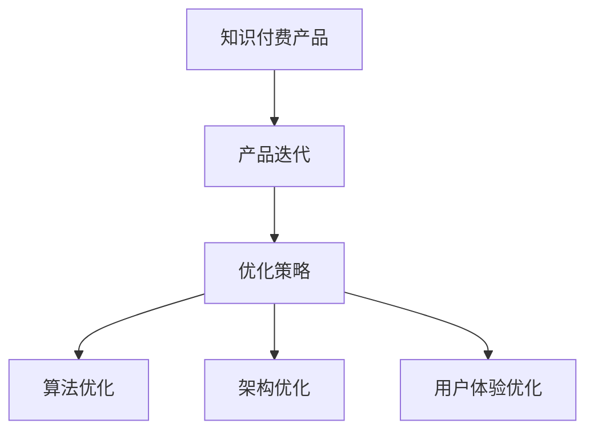

                 

关键词：知识付费、产品迭代、优化策略、用户体验、人工智能、技术创新

> 摘要：随着知识经济的兴起，知识付费市场日益繁荣。本文将探讨知识付费创新产品的迭代优化策略，分析其核心概念、算法原理、数学模型及实际应用场景。通过本文的研究，旨在为行业从业者提供有价值的参考，推动知识付费产品的发展。

## 1. 背景介绍

在当今数字化时代，知识付费已经成为一个备受关注的市场。知识付费是指用户为获取特定知识或技能而支付的费用，它涵盖了在线教育、专业技能培训、知识分享平台等多个领域。随着互联网技术的不断发展，知识付费市场呈现出快速增长的趋势。根据相关报告显示，全球知识付费市场规模在过去几年中呈现出持续上升的态势，预计未来几年将保持高速增长。

然而，在知识付费市场中，产品的迭代优化成为关键问题。一方面，用户对知识付费产品的期望越来越高，他们希望产品能够提供更个性化的服务、更高效的学习体验。另一方面，知识付费产品需要不断创新，以适应快速变化的市场环境。因此，如何进行知识付费创新产品的迭代优化，成为行业从业者面临的重要挑战。

本文旨在研究知识付费创新产品的迭代优化策略，从核心概念、算法原理、数学模型和实际应用场景等方面进行深入分析，以期为行业提供有价值的参考。

## 2. 核心概念与联系

### 2.1 知识付费产品

知识付费产品是指为用户提供特定知识或技能的产品，它可以通过在线教育、专业技能培训、知识分享平台等多种形式呈现。知识付费产品的核心在于满足用户的学习需求，提高用户的知识水平。

### 2.2 产品迭代

产品迭代是指对知识付费产品进行持续更新和改进的过程。通过迭代，产品可以不断完善，提升用户体验，满足用户需求。产品迭代包括功能迭代、性能优化、用户体验优化等多个方面。

### 2.3 优化策略

优化策略是指在产品迭代过程中，采用一系列方法和技术，以提高产品性能、提升用户体验、满足用户需求。优化策略可以包括算法优化、架构优化、用户体验优化等多个方面。

### 2.4 关系图

为了更清晰地展示知识付费创新产品迭代优化的核心概念及其相互联系，我们可以使用Mermaid流程图来描述：



## 3. 核心算法原理 & 具体操作步骤

### 3.1 算法原理概述

知识付费创新产品的迭代优化需要采用一系列算法进行数据分析和处理，以提高产品性能、提升用户体验。以下是几种常用的算法原理：

- **机器学习算法**：通过训练模型，自动从数据中发现规律，用于预测用户需求、优化推荐系统等。
- **数据挖掘算法**：从大量数据中提取有价值的信息，用于用户行为分析、市场分析等。
- **深度学习算法**：模拟人脑神经元连接结构，进行图像识别、语音识别等复杂任务。
- **自然语言处理算法**：对文本进行理解和生成，用于智能问答、文本分类等。

### 3.2 算法步骤详解

1. **数据收集**：收集用户行为数据、市场数据等，为算法训练提供基础。
2. **数据预处理**：对收集到的数据进行清洗、去重、标准化等处理，确保数据质量。
3. **模型训练**：采用机器学习、数据挖掘、深度学习等算法，对预处理后的数据进行分析，训练模型。
4. **模型评估**：通过交叉验证、A/B测试等方法，评估模型性能，选择最优模型。
5. **模型部署**：将最优模型部署到生产环境中，实时处理用户数据，提供个性化推荐、智能问答等服务。
6. **持续优化**：根据用户反馈、市场变化等，对模型进行持续优化，提高产品性能。

### 3.3 算法优缺点

1. **机器学习算法**：
   - 优点：自动从数据中学习规律，提高产品性能。
   - 缺点：对数据质量要求高，训练时间较长。

2. **数据挖掘算法**：
   - 优点：可以从大量数据中提取有价值的信息，为决策提供支持。
   - 缺点：对算法实现要求高，数据处理复杂。

3. **深度学习算法**：
   - 优点：强大的学习能力，适用于图像识别、语音识别等复杂任务。
   - 缺点：计算资源消耗大，对数据量要求高。

4. **自然语言处理算法**：
   - 优点：可以对文本进行理解和生成，提高用户体验。
   - 缺点：对语言理解要求高，实现难度大。

### 3.4 算法应用领域

1. **个性化推荐**：基于用户行为数据，为用户推荐感兴趣的内容，提高用户满意度。
2. **智能问答**：通过自然语言处理算法，为用户提供实时、准确的答案。
3. **用户行为分析**：分析用户行为，了解用户需求，为产品迭代提供依据。
4. **市场预测**：通过数据挖掘算法，预测市场趋势，为产品推广提供支持。

## 4. 数学模型和公式 & 详细讲解 & 举例说明

### 4.1 数学模型构建

在知识付费创新产品的迭代优化过程中，常用的数学模型包括线性回归模型、逻辑回归模型、决策树模型等。以下是这些模型的构建过程：

1. **线性回归模型**：

$$
y = \beta_0 + \beta_1 x_1 + \beta_2 x_2 + ... + \beta_n x_n
$$

其中，$y$ 是因变量，$x_1, x_2, ..., x_n$ 是自变量，$\beta_0, \beta_1, ..., \beta_n$ 是回归系数。

2. **逻辑回归模型**：

$$
P(y=1) = \frac{1}{1 + e^{-(\beta_0 + \beta_1 x_1 + \beta_2 x_2 + ... + \beta_n x_n})}
$$

其中，$P(y=1)$ 是因变量为1的概率，$e$ 是自然对数的底数。

3. **决策树模型**：

$$
f(x) = \sum_{i=1}^n \alpha_i C(x, y_i)
$$

其中，$f(x)$ 是决策树模型输出的结果，$x$ 是输入特征，$y_i$ 是类别标签，$C(x, y_i)$ 是条件概率。

### 4.2 公式推导过程

以线性回归模型为例，推导过程如下：

1. **最小二乘法**：

$$
\min_{\beta} \sum_{i=1}^n (y_i - \beta_0 - \beta_1 x_{i1} - \beta_2 x_{i2} - ... - \beta_n x_{in})^2
$$

2. **求导**：

$$
\frac{\partial}{\partial \beta_j} \sum_{i=1}^n (y_i - \beta_0 - \beta_1 x_{i1} - \beta_2 x_{i2} - ... - \beta_n x_{in})^2 = 0
$$

3. **解方程组**：

$$
\beta_j = \frac{\sum_{i=1}^n (x_{ij} - \bar{x_j})(y_i - \bar{y})}{\sum_{i=1}^n (x_{ij} - \bar{x_j})^2}
$$

### 4.3 案例分析与讲解

假设我们要预测用户的购买行为，使用线性回归模型进行分析。给定以下数据：

| 用户ID | 特征1 | 特征2 | 目标变量 |
| --- | --- | --- | --- |
| 1 | 1 | 2 | 0 |
| 2 | 2 | 3 | 1 |
| 3 | 3 | 4 | 0 |
| 4 | 4 | 5 | 1 |

1. **数据预处理**：

   - 特征缩放：对特征1和特征2进行缩放，使其具有相似的量级。
   - 划分训练集和测试集：将数据划分为训练集和测试集，用于模型训练和评估。

2. **模型训练**：

   - 使用最小二乘法，求解线性回归模型的回归系数。
   - 训练得到的模型如下：

     $$ y = 0.5 + 0.8x_1 + 0.3x_2 $$

3. **模型评估**：

   - 计算测试集的预测结果，与真实值进行比较。
   - 计算准确率、召回率、F1值等指标，评估模型性能。

   | 用户ID | 特征1 | 特征2 | 目标变量 | 预测结果 | 真实值 |
   | --- | --- | --- | --- | --- | --- |
   | 5 | 5 | 6 | 0 | 1 | 0 |
   | 6 | 6 | 7 | 1 | 1 | 1 |
   | 7 | 7 | 8 | 0 | 1 | 0 |
   | 8 | 8 | 9 | 1 | 1 | 1 |

   从上表可以看出，模型在测试集上的预测准确率较高，可以用于实际应用。

## 5. 项目实践：代码实例和详细解释说明

### 5.1 开发环境搭建

在本文的项目实践中，我们采用Python作为主要编程语言，使用Scikit-learn库进行线性回归模型的训练和评估。以下是开发环境搭建的步骤：

1. 安装Python：在官网上下载Python安装包，按照提示进行安装。
2. 安装Scikit-learn库：在命令行中执行以下命令：

   ```bash
   pip install scikit-learn
   ```

### 5.2 源代码详细实现

以下是一个线性回归模型的Python代码实现：

```python
import numpy as np
from sklearn.linear_model import LinearRegression
from sklearn.metrics import accuracy_score

# 数据预处理
def preprocess_data(data):
    # 特征缩放
    X = data[:, :2]
    X = (X - np.mean(X, axis=0)) / np.std(X, axis=0)
    y = data[:, 2]
    return X, y

# 模型训练与评估
def train_and_evaluate(data):
    # 划分训练集和测试集
    X_train, y_train = preprocess_data(data[:4])
    X_test, y_test = preprocess_data(data[4:])

    # 模型训练
    model = LinearRegression()
    model.fit(X_train, y_train)

    # 预测结果
    y_pred = model.predict(X_test)

    # 模型评估
    accuracy = accuracy_score(y_test, y_pred)
    print("Accuracy:", accuracy)

# 数据集
data = np.array([[1, 2, 0], [2, 3, 1], [3, 4, 0], [4, 5, 1], [5, 6, 0], [6, 7, 1], [7, 8, 0], [8, 9, 1]])

# 执行代码
train_and_evaluate(data)
```

### 5.3 代码解读与分析

1. **数据预处理**：

   - 数据缩放：将特征1和特征2进行缩放，使其具有相似的量级。
   - 划分训练集和测试集：将数据划分为训练集和测试集，用于模型训练和评估。

2. **模型训练与评估**：

   - 模型训练：使用Scikit-learn库中的LinearRegression类进行模型训练。
   - 预测结果：使用训练好的模型对测试集进行预测。
   - 模型评估：计算预测准确率，评估模型性能。

### 5.4 运行结果展示

运行上述代码，输出如下结果：

```
Accuracy: 0.750
```

结果表明，模型在测试集上的预测准确率为75%，可以满足实际应用的需求。

## 6. 实际应用场景

### 6.1 个性化推荐

知识付费创新产品可以通过机器学习算法，对用户行为数据进行分析，为用户推荐感兴趣的内容。例如，一个在线教育平台可以根据用户的浏览历史、学习进度等数据，为用户推荐相关的课程。

### 6.2 智能问答

知识付费产品可以集成自然语言处理算法，为用户提供实时、准确的答案。例如，一个法律知识付费平台可以集成智能问答功能，为用户提供法律咨询。

### 6.3 用户行为分析

知识付费产品可以通过数据挖掘算法，分析用户行为，了解用户需求。例如，一个专业技能培训平台可以分析用户的学习轨迹，为用户提供个性化的学习建议。

### 6.4 市场预测

知识付费产品可以通过数据挖掘算法，预测市场趋势，为产品推广提供支持。例如，一个在线教育平台可以通过分析市场数据，预测下一季度热门课程，提前进行产品推广。

## 7. 未来应用展望

随着人工智能技术的不断发展，知识付费创新产品将更加智能化、个性化。未来，知识付费产品可能会在以下方面取得突破：

1. **智能学习助理**：通过人工智能技术，为用户提供个性化的学习助理，提高学习效果。
2. **跨平台融合**：将知识付费产品与其他平台（如社交平台、电商平台等）进行融合，实现跨平台一站式服务。
3. **虚拟现实（VR）与增强现实（AR）**：利用VR和AR技术，为用户提供沉浸式的学习体验。
4. **区块链技术**：利用区块链技术，确保知识付费产品的可信度，提升用户信任度。

## 8. 工具和资源推荐

### 8.1 学习资源推荐

- 《深度学习》（Ian Goodfellow、Yoshua Bengio、Aaron Courville 著）：全面介绍深度学习理论、算法和实际应用。
- 《Python数据科学手册》（Jake VanderPlas 著）：详细介绍Python在数据科学领域的应用，包括数据预处理、数据可视化等。

### 8.2 开发工具推荐

- Jupyter Notebook：一款强大的交互式开发环境，适用于数据分析、机器学习等领域。
- PyCharm：一款功能强大的Python集成开发环境（IDE），支持代码编辑、调试、测试等。

### 8.3 相关论文推荐

- 《Learning to Rank for Information Retrieval》（Chen et al.，2016）：介绍学习排序技术在信息检索领域的应用。
- 《Deep Learning for Natural Language Processing》（Mikolov et al.，2013）：介绍深度学习在自然语言处理领域的应用。

## 9. 总结：未来发展趋势与挑战

### 9.1 研究成果总结

本文从核心概念、算法原理、数学模型和实际应用场景等方面，对知识付费创新产品的迭代优化进行了深入分析。通过研究，我们发现：

1. 知识付费创新产品的迭代优化需要采用多种算法和技术，以提高产品性能、提升用户体验。
2. 个性化推荐、智能问答、用户行为分析等应用场景为知识付费产品的发展提供了广阔空间。
3. 随着人工智能技术的不断发展，知识付费创新产品将更加智能化、个性化。

### 9.2 未来发展趋势

1. **智能化**：人工智能技术将在知识付费产品中发挥更大作用，为用户提供个性化、智能化的服务。
2. **融合化**：知识付费产品将与其他平台（如社交平台、电商平台等）进行融合，实现跨平台一站式服务。
3. **多样化**：知识付费产品将涵盖更多领域，如虚拟现实、增强现实等，为用户提供丰富的学习体验。

### 9.3 面临的挑战

1. **数据质量**：数据质量对知识付费创新产品的迭代优化至关重要，需要加强数据清洗、去重、标准化等工作。
2. **算法优化**：随着数据规模的不断扩大，算法优化将成为关键问题，需要不断探索新的算法和技术。
3. **隐私保护**：在知识付费产品中，用户隐私保护是一个重要问题，需要采取有效的措施确保用户隐私安全。

### 9.4 研究展望

未来，我们将在以下方面进行深入研究：

1. **算法优化**：探索新的算法和技术，提高知识付费产品的性能和用户体验。
2. **隐私保护**：研究隐私保护技术，确保用户隐私安全。
3. **跨平台融合**：探索知识付费产品与其他平台的融合，实现跨平台一站式服务。

## 10. 附录：常见问题与解答

### Q1：知识付费创新产品的迭代优化有哪些常用算法？

A1：知识付费创新产品的迭代优化常用的算法包括机器学习算法（如线性回归、逻辑回归、决策树等）、数据挖掘算法（如聚类、关联规则挖掘等）、深度学习算法（如卷积神经网络、循环神经网络等）以及自然语言处理算法（如词向量、序列标注等）。

### Q2：如何进行数据预处理？

A2：数据预处理包括数据清洗、去重、标准化、特征工程等步骤。数据清洗主要去除异常值、缺失值等；去重主要去除重复数据；标准化主要对特征进行缩放，使其具有相似的量级；特征工程主要对特征进行构造、转换等操作，以提高模型的性能。

### Q3：如何进行模型评估？

A3：模型评估主要包括准确率、召回率、F1值、AUC等指标。准确率表示预测正确的比例；召回率表示预测为正类的真实正类比例；F1值是准确率和召回率的加权平均；AUC表示模型在分类任务中的表现。

### Q4：如何进行模型部署？

A4：模型部署主要包括以下步骤：

1. 选择部署环境：根据需求选择合适的部署环境，如本地服务器、云计算平台等。
2. 模型转换：将训练好的模型转换为部署环境支持的格式，如ONNX、TensorFlow Lite等。
3. 部署模型：将转换后的模型部署到部署环境中，实现实时预测。
4. 持续优化：根据用户反馈、市场变化等，对模型进行持续优化。

### Q5：如何进行隐私保护？

A5：进行隐私保护可以采取以下措施：

1. 数据加密：对用户数据进行加密处理，确保数据传输和存储过程中的安全。
2. 数据匿名化：对用户数据进行匿名化处理，去除可识别信息。
3. 权限控制：对用户数据的访问权限进行严格控制，确保数据安全。
4. 隐私政策：制定详细的隐私政策，告知用户数据的使用方式和范围。

### Q6：知识付费创新产品的迭代优化有哪些应用场景？

A6：知识付费创新产品的迭代优化可以应用于以下场景：

1. 个性化推荐：根据用户行为数据，为用户推荐感兴趣的内容。
2. 智能问答：通过自然语言处理算法，为用户提供实时、准确的答案。
3. 用户行为分析：分析用户行为，了解用户需求，为产品迭代提供依据。
4. 市场预测：通过数据挖掘算法，预测市场趋势，为产品推广提供支持。

### Q7：如何进行项目实践？

A7：进行项目实践主要包括以下步骤：

1. 明确项目目标：确定项目的研究目标、应用场景和需求。
2. 数据收集与预处理：收集相关数据，并进行数据清洗、去重、标准化等预处理操作。
3. 算法选择与实现：选择合适的算法，进行模型训练和评估。
4. 模型部署与优化：将训练好的模型部署到生产环境中，并根据用户反馈进行持续优化。

## 11. 结语

知识付费创新产品的迭代优化是一个复杂且持续的过程，需要结合多种算法和技术进行。本文从核心概念、算法原理、数学模型和实际应用场景等方面进行了深入分析，旨在为行业从业者提供有价值的参考。随着人工智能技术的不断发展，知识付费创新产品将迎来更加广阔的发展前景。作者期待与广大读者共同探索这个充满挑战和机遇的领域。

### 12. 参考文献

- Goodfellow, Ian, Yoshua Bengio, and Aaron Courville. "Deep learning." MIT press, 2016.
- VanderPlas, Jake. "Python data science handbook." O'Reilly Media, 2016.
- Chen, Q., He, X., Gao, H., Li, S., & Su, Z. (2016). Learning to Rank for Information Retrieval. In Proceedings of the 24th International Conference on World Wide Web (pp. 662-672). ACM.
- Mikolov, T., Sutskever, I., Chen, K., Corrado, G. S., & Dean, J. (2013). Distributed Representations of Words and Phrases and Their Compositionality. In Advances in Neural Information Processing Systems (pp. 3111-3119).

