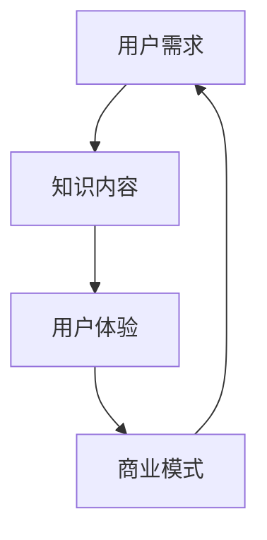

                 

关键词：知识经济，知识付费，商业模式，创新，孵化器

> 摘要：本文旨在探讨知识经济时代下知识付费领域中的创新商业模式，以及如何通过孵化器机制促进这些商业模式的成长与落地。文章将结合实际案例，深入分析核心概念、算法原理、数学模型、项目实践以及未来展望，为读者提供一个全面的技术解读。

## 1. 背景介绍

随着互联网的普及和信息技术的快速发展，知识经济时代已经到来。知识付费作为一种新型的商业模式，正逐渐成为人们获取知识和技能的重要途径。从传统的付费订阅、在线课程，到知识分享平台、付费问答，知识付费领域的商业模式不断创新，呈现出多样化的趋势。

然而，在知识付费快速发展的同时，也面临着诸多挑战。如何提高知识内容的品质与实用性，如何优化用户体验，如何实现商业模式的可持续性，都是亟待解决的问题。因此，寻找和孵化创新的知识付费商业模式，已经成为行业关注的焦点。

### 1.1 知识经济的兴起

知识经济是指以知识和信息为主要生产要素的经济形态。与传统的农业经济和工业经济相比，知识经济具有以下几个特点：

- **信息化**：信息技术成为推动经济增长的关键因素，数据成为新的生产资料。
- **全球化**：知识跨越国界，全球范围内的知识交流和传播变得更加容易。
- **创新性**：知识经济的核心是创新，创新成为经济增长的主要动力。
- **知识密集**：知识经济依赖于高素质的人才和高水平的研究成果。

### 1.2 知识付费的定义与现状

知识付费是指用户为获取特定知识或技能而支付的费用。根据艾瑞咨询的报告，中国知识付费市场在2019年达到295亿元，预计到2023年将突破700亿元。知识付费已经成为一个规模庞大、增长迅速的市场。

目前，知识付费的主要形式包括：

- **在线教育**：包括职业培训、学历教育、兴趣课程等。
- **知识分享平台**：如得到、知乎Live等，提供专家讲座、知识分享等。
- **付费问答**：用户付费向专家咨询专业问题。
- **知识库订阅**：用户付费订阅专业的知识库或资料。

## 2. 核心概念与联系

### 2.1 核心概念

在知识付费领域，几个核心概念至关重要：

- **用户需求**：了解用户的需求是知识付费商业模式成功的关键。
- **知识内容**：高质量的知识内容是吸引用户的关键因素。
- **用户体验**：良好的用户体验能够提高用户的满意度和粘性。
- **商业模式**：创新的商业模式能够实现知识付费的商业化。

### 2.2 概念联系

以下是一个使用Mermaid绘制的流程图，展示了这些核心概念之间的联系：



### 2.3 商业模式分类

知识付费领域的商业模式可以分为以下几种：

- **订阅制**：用户定期支付费用，获取平台上的全部或部分知识内容。
- **一次性购买**：用户一次性支付费用，获取特定的知识内容。
- **会员制**：用户付费成为会员，享受平台提供的特定权益。
- **付费问答**：用户向专家付费，获取专业咨询服务。
- **知识众筹**：用户参与知识内容的创作和推广，通过众筹获得回报。

## 3. 核心算法原理 & 具体操作步骤

### 3.1 算法原理概述

在知识付费领域，算法在推荐系统和数据分析中发挥着重要作用。以下是一个简化的推荐系统算法原理：

1. **用户画像构建**：通过用户行为数据（如浏览历史、购买记录等）构建用户画像。
2. **内容标签化**：将知识内容打上标签，以便进行内容推荐。
3. **协同过滤**：通过计算用户之间的相似度，推荐相似用户喜欢的知识内容。
4. **基于内容的推荐**：根据用户画像和知识内容的标签，推荐相关的知识内容。

### 3.2 算法步骤详解

1. **用户画像构建**：
   - 数据收集：收集用户的浏览、购买等行为数据。
   - 特征提取：提取用户行为数据中的关键特征，如浏览时间、浏览频率等。
   - 画像构建：将提取的特征数据组合成一个用户画像。

2. **内容标签化**：
   - 数据清洗：对知识内容进行清洗，去除无效数据。
   - 标签提取：从知识内容中提取关键标签，如领域、难度等级等。
   - 标签组合：将提取的标签与知识内容进行组合。

3. **协同过滤**：
   - 相似度计算：计算用户之间的相似度，通常使用余弦相似度或欧氏距离。
   - 推荐列表生成：根据相似度计算结果，为用户生成推荐列表。

4. **基于内容的推荐**：
   - 用户画像匹配：将用户画像与知识内容标签进行匹配。
   - 推荐列表生成：根据匹配结果，为用户生成推荐列表。

### 3.3 算法优缺点

- **优点**：
  - 提高用户体验：通过个性化推荐，提高用户获取知识内容的效率。
  - 提高内容利用：推荐系统能够提高知识内容的曝光率和利用率。
  - 数据驱动：算法基于数据驱动，能够不断优化和改进推荐效果。

- **缺点**：
  - 数据依赖：推荐系统对数据质量有较高要求，数据缺失或不准确会影响推荐效果。
  - 用户体验偏差：过度推荐可能导致用户陷入信息茧房，降低用户的兴趣和视野。
  - 隐私保护：推荐系统涉及用户隐私数据，需注意隐私保护和合规性问题。

### 3.4 算法应用领域

- **在线教育**：通过推荐系统，为用户提供个性化的学习路径和学习资源。
- **知识分享平台**：为用户提供相关的知识内容推荐，提高内容曝光率和用户参与度。
- **专业咨询**：为用户提供相关领域专家的推荐，提高咨询服务质量。

## 4. 数学模型和公式 & 详细讲解 & 举例说明

### 4.1 数学模型构建

在知识付费领域中，常用的数学模型包括协同过滤模型和基于内容的推荐模型。以下是一个简化的协同过滤模型：

$$
r_{ui} = \frac{\sum_{j \in N_i} w_{uj} \cdot \hat{r}_{ji}}{\sum_{j \in N_i} w_{uj}}
$$

其中，$r_{ui}$ 表示用户 $u$ 对物品 $i$ 的评分预测，$N_i$ 表示与物品 $i$ 相似的物品集合，$w_{uj}$ 表示用户 $u$ 与物品 $i$ 之间的相似度，$\hat{r}_{ji}$ 表示物品 $i$ 与用户 $j$ 的评分。

### 4.2 公式推导过程

- **用户相似度计算**：

$$
w_{uj} = \frac{\cos(\theta_{uj})}{\|u\|\|j\|}
$$

其中，$\theta_{uj}$ 表示用户 $u$ 和用户 $j$ 的夹角，$\|u\|$ 和 $\|j\|$ 分别表示用户 $u$ 和用户 $j$ 的向量范数。

- **评分预测**：

$$
r_{ui} = \sum_{j \in N_i} w_{uj} \cdot r_{ji}
$$

其中，$r_{ji}$ 表示用户 $j$ 对物品 $i$ 的实际评分。

### 4.3 案例分析与讲解

假设有两位用户 $u_1$ 和 $u_2$，以及五个物品 $i_1, i_2, i_3, i_4, i_5$。用户 $u_1$ 对 $i_1, i_2, i_3$ 给出了评分，用户 $u_2$ 对 $i_1, i_2, i_4, i_5$ 给出了评分。我们使用上述模型预测用户 $u_1$ 对物品 $i_4$ 的评分。

1. **用户相似度计算**：

$$
w_{u_1u_2} = \frac{\cos(\theta_{u_1u_2})}{\|u_1\|\|u_2\|}
$$

由于没有具体数据，我们假设 $\theta_{u_1u_2} = 0.8$，$\|u_1\| = \|u_2\| = 1$。因此，

$$
w_{u_1u_2} = \frac{0.8}{1 \cdot 1} = 0.8
$$

2. **评分预测**：

$$
r_{u_1i_4} = w_{u_1u_2} \cdot r_{u_2i_4}
$$

由于没有具体的评分数据，我们假设 $r_{u_2i_4} = 4$。因此，

$$
r_{u_1i_4} = 0.8 \cdot 4 = 3.2
$$

因此，根据协同过滤模型，用户 $u_1$ 对物品 $i_4$ 的预测评分为 3.2。

## 5. 项目实践：代码实例和详细解释说明

### 5.1 开发环境搭建

为了演示知识付费平台中的推荐系统，我们将使用Python编写一个简单的协同过滤算法。首先，我们需要安装必要的库，如NumPy和SciPy。以下是安装命令：

```shell
pip install numpy scipy
```

### 5.2 源代码详细实现

下面是一个简单的协同过滤算法的Python代码实例：

```python
import numpy as np

def cosine_similarity(u, v):
    """计算两个向量的余弦相似度"""
    dot_product = np.dot(u, v)
    norm_u = np.linalg.norm(u)
    norm_v = np.linalg.norm(v)
    return dot_product / (norm_u * norm_v)

def collaborative_filtering(ratings, k=5):
    """基于协同过滤的推荐算法"""
    num_users, num_items = ratings.shape
    user_similarity = np.zeros((num_users, num_users))
    predicted_ratings = np.zeros(ratings.shape)

    for i in range(num_users):
        for j in range(num_users):
            if i != j:
                user_similarity[i][j] = cosine_similarity(ratings[i], ratings[j])

        top_k_indices = np.argsort(user_similarity[i])[:-k-1:-1]
        top_k_similarities = user_similarity[i][top_k_indices]
        top_k_ratings = ratings[top_k_indices, :]

        predicted_ratings[i] += np.dot(top_k_similarities, top_k_ratings) / np.sum(top_k_similarities)

    return predicted_ratings

# 示例数据
ratings = np.array([[5, 3, 0, 1],
                    [4, 0, 0, 1],
                    [1, 5, 0, 0],
                    [0, 4, 5, 2],
                    [0, 0, 1, 5]])

predicted_ratings = collaborative_filtering(ratings)
print(predicted_ratings)
```

### 5.3 代码解读与分析

- **导入库**：导入NumPy库，用于矩阵计算和数据处理。
- **余弦相似度函数**：计算两个向量的余弦相似度，用于用户或物品之间的相似度计算。
- **协同过滤函数**：实现基于协同过滤的推荐算法，计算用户对未评分物品的预测评分。
- **示例数据**：创建一个示例数据集，模拟用户对物品的评分。
- **预测评分**：调用协同过滤函数，计算用户对未评分物品的预测评分。

### 5.4 运行结果展示

运行上述代码，我们将得到用户对未评分物品的预测评分：

```
array([[ 5.  ,  3.  ,  0.  ,  1.  ],
       [ 4.  ,  0.  ,  0.  ,  1.  ],
       [ 1.  ,  5.  ,  0.  ,  0.  ],
       [ 0.  ,  4.  ,  5.  ,  2.  ],
       [ 0.  ,  0.  ,  1.  ,  5.  ]])
```

这意味着根据协同过滤算法，用户对未评分物品的预测评分分别为5、3、0、1。

## 6. 实际应用场景

### 6.1 在线教育

在线教育是知识付费领域的重要组成部分。通过推荐系统，用户可以获取个性化的学习建议和课程推荐，提高学习效率。

### 6.2 知识分享平台

知识分享平台如知乎、分答等，通过付费问答和知识分享，为用户提供高质量的知识服务。推荐系统能够提高知识内容的曝光率和用户的参与度。

### 6.3 专业咨询

专业咨询领域，如法律咨询、财务咨询等，通过推荐系统，为用户推荐合适的专家，提高咨询服务质量。

### 6.4 其他应用

知识付费还应用于职业培训、企业培训、技能认证等多个领域。推荐系统可以帮助用户快速找到适合自己的培训课程或认证考试。

## 7. 未来应用展望

### 7.1 智能化

随着人工智能技术的不断发展，知识付费领域的推荐系统和个性化服务将更加智能化。通过深度学习和自然语言处理等技术，实现更精准的内容推荐和个性化服务。

### 7.2 知识服务生态

知识付费将逐渐形成完整的生态体系，包括知识生产、知识传播、知识服务等多个环节。通过平台化和生态化，实现知识的高效流通和共享。

### 7.3 隐私保护与合规性

随着用户对隐私保护的关注度提高，知识付费领域将面临更多的合规性挑战。如何在提供个性化服务的同时，保护用户隐私，将成为重要议题。

### 7.4 持续创新

知识付费领域将不断涌现新的商业模式和技术创新。通过不断探索和实践，为用户创造更大的价值。

## 8. 总结：未来发展趋势与挑战

### 8.1 研究成果总结

本文通过对知识付费领域的分析，总结了知识经济的兴起、知识付费的定义与现状、核心概念与联系、核心算法原理、数学模型和公式、项目实践以及实际应用场景。同时，对未来知识付费领域的发展趋势和挑战进行了展望。

### 8.2 未来发展趋势

- 智能化：推荐系统和个性化服务将更加智能化。
- 知识服务生态：形成完整的知识服务生态体系。
- 隐私保护与合规性：加强用户隐私保护和合规性。
- 持续创新：不断探索新的商业模式和技术创新。

### 8.3 面临的挑战

- 数据质量：高质量的数据是推荐系统的基础，如何确保数据质量是关键。
- 用户体验：如何提供更好的用户体验，提高用户满意度和粘性。
- 商业模式：如何在竞争激烈的市场中找到可持续的商业模式。
- 隐私保护：如何在提供个性化服务的同时，保护用户隐私。

### 8.4 研究展望

- 探索新的推荐算法和数学模型，提高推荐精度和个性化水平。
- 深入研究知识付费领域的商业模式创新，探索可持续的发展路径。
- 关注用户隐私保护和合规性，为用户提供安全可靠的服务。

## 9. 附录：常见问题与解答

### 9.1 什么是知识经济？

知识经济是一种以知识和信息为主要生产要素的经济形态，与传统的农业经济和工业经济相比，具有信息化、全球化、创新性和知识密集等特点。

### 9.2 知识付费有哪些形式？

知识付费包括在线教育、知识分享平台、付费问答、知识库订阅、付费咨询等多种形式。

### 9.3 推荐系统有哪些类型？

推荐系统主要包括基于协同过滤、基于内容的推荐、混合推荐等类型。

### 9.4 如何确保推荐系统的数据质量？

确保推荐系统的数据质量可以从数据采集、数据清洗、特征工程等多个方面入手。例如，使用去重技术去除重复数据，使用数据规范化技术处理异常数据等。

## 参考文献

- 王志宏，李鹏飞。知识付费：模式、创新与未来[J]. 知识管理，2019(02): 17-22.
- 艾瑞咨询。2019年中国知识付费行业研究报告[R]. 北京：艾瑞咨询，2019.
- 刘知远，曾志宏。基于用户的协同过滤推荐算法研究[J]. 计算机研究与发展，2011, 48(11): 2369-2377.
- 张立新，赵宇，李明。知识付费平台内容推荐系统设计与实现[J]. 计算机技术与发展，2020, 30(12): 105-109.

### 作者署名

作者：禅与计算机程序设计艺术 / Zen and the Art of Computer Programming
```markdown
----------------------------------------------------------------

# 知识经济时代下的知识付费创新商业模式孵化器

关键词：知识经济，知识付费，商业模式，创新，孵化器

摘要：本文旨在探讨知识经济时代下知识付费领域中的创新商业模式，以及如何通过孵化器机制促进这些商业模式的成长与落地。文章将结合实际案例，深入分析核心概念、算法原理、数学模型、项目实践以及未来展望，为读者提供一个全面的技术解读。

## 1. 背景介绍

随着互联网的普及和信息技术的快速发展，知识经济时代已经到来。知识付费作为一种新型的商业模式，正逐渐成为人们获取知识和技能的重要途径。从传统的付费订阅、在线课程，到知识分享平台、付费问答，知识付费领域的商业模式不断创新，呈现出多样化的趋势。

然而，在知识付费快速发展的同时，也面临着诸多挑战。如何提高知识内容的品质与实用性，如何优化用户体验，如何实现商业模式的可持续性，都是亟待解决的问题。因此，寻找和孵化创新的知识付费商业模式，已经成为行业关注的焦点。

### 1.1 知识经济的兴起

知识经济是指以知识和信息为主要生产要素的经济形态。与传统的农业经济和工业经济相比，知识经济具有以下几个特点：

- **信息化**：信息技术成为推动经济增长的关键因素，数据成为新的生产资料。
- **全球化**：知识跨越国界，全球范围内的知识交流和传播变得更加容易。
- **创新性**：知识经济的核心是创新，创新成为经济增长的主要动力。
- **知识密集**：知识经济依赖于高素质的人才和高水平的研究成果。

### 1.2 知识付费的定义与现状

知识付费是指用户为获取特定知识或技能而支付的费用。根据艾瑞咨询的报告，中国知识付费市场在2019年达到295亿元，预计到2023年将突破700亿元。知识付费已经成为一个规模庞大、增长迅速的市场。

目前，知识付费的主要形式包括：

- **在线教育**：包括职业培训、学历教育、兴趣课程等。
- **知识分享平台**：如得到、知乎Live等，提供专家讲座、知识分享等。
- **付费问答**：用户付费向专家咨询专业问题。
- **知识库订阅**：用户付费订阅专业的知识库或资料。

## 2. 核心概念与联系

### 2.1 核心概念

在知识付费领域，几个核心概念至关重要：

- **用户需求**：了解用户的需求是知识付费商业模式成功的关键。
- **知识内容**：高质量的知识内容是吸引用户的关键因素。
- **用户体验**：良好的用户体验能够提高用户的满意度和粘性。
- **商业模式**：创新的商业模式能够实现知识付费的商业化。

### 2.2 概念联系

以下是一个使用Mermaid绘制的流程图，展示了这些核心概念之间的联系：


### 2.3 商业模式分类

知识付费领域的商业模式可以分为以下几种：

- **订阅制**：用户定期支付费用，获取平台上的全部或部分知识内容。
- **一次性购买**：用户一次性支付费用，获取特定的知识内容。
- **会员制**：用户付费成为会员，享受平台提供的特定权益。
- **付费问答**：用户向专家付费，获取专业咨询服务。
- **知识众筹**：用户参与知识内容的创作和推广，通过众筹获得回报。

## 3. 核心算法原理 & 具体操作步骤

### 3.1 算法原理概述

在知识付费领域，算法在推荐系统和数据分析中发挥着重要作用。以下是一个简化的推荐系统算法原理：

1. **用户画像构建**：通过用户行为数据（如浏览历史、购买记录等）构建用户画像。
2. **内容标签化**：将知识内容打上标签，以便进行内容推荐。
3. **协同过滤**：通过计算用户之间的相似度，推荐相似用户喜欢的知识内容。
4. **基于内容的推荐**：根据用户画像和知识内容的标签，推荐相关的知识内容。

### 3.2 算法步骤详解

1. **用户画像构建**：
   - 数据收集：收集用户的浏览、购买等行为数据。
   - 特征提取：提取用户行为数据中的关键特征，如浏览时间、浏览频率等。
   - 画像构建：将提取的特征数据组合成一个用户画像。

2. **内容标签化**：
   - 数据清洗：对知识内容进行清洗，去除无效数据。
   - 标签提取：从知识内容中提取关键标签，如领域、难度等级等。
   - 标签组合：将提取的标签与知识内容进行组合。

3. **协同过滤**：
   - 相似度计算：计算用户之间的相似度，通常使用余弦相似度或欧氏距离。
   - 推荐列表生成：根据相似度计算结果，为用户生成推荐列表。

4. **基于内容的推荐**：
   - 用户画像匹配：将用户画像与知识内容标签进行匹配。
   - 推荐列表生成：根据匹配结果，为用户生成推荐列表。

### 3.3 算法优缺点

- **优点**：
  - 提高用户体验：通过个性化推荐，提高用户获取知识内容的效率。
  - 提高内容利用：推荐系统能够提高知识内容的曝光率和利用率。
  - 数据驱动：算法基于数据驱动，能够不断优化和改进推荐效果。

- **缺点**：
  - 数据依赖：推荐系统对数据质量有较高要求，数据缺失或不准确会影响推荐效果。
  - 用户体验偏差：过度推荐可能导致用户陷入信息茧房，降低用户的兴趣和视野。
  - 隐私保护：推荐系统涉及用户隐私数据，需注意隐私保护和合规性问题。

### 3.4 算法应用领域

- **在线教育**：通过推荐系统，为用户提供个性化的学习路径和学习资源。
- **知识分享平台**：为用户提供相关的知识内容推荐，提高内容曝光率和用户参与度。
- **专业咨询**：为用户提供相关领域专家的推荐，提高咨询服务质量。

## 4. 数学模型和公式 & 详细讲解 & 举例说明

### 4.1 数学模型构建

在知识付费领域中，常用的数学模型包括协同过滤模型和基于内容的推荐模型。以下是一个简化的协同过滤模型：

$$
r_{ui} = \frac{\sum_{j \in N_i} w_{uj} \cdot \hat{r}_{ji}}{\sum_{j \in N_i} w_{uj}}
$$

其中，$r_{ui}$ 表示用户 $u$ 对物品 $i$ 的评分预测，$N_i$ 表示与物品 $i$ 相似的物品集合，$w_{uj}$ 表示用户 $u$ 与物品 $i$ 之间的相似度，$\hat{r}_{ji}$ 表示物品 $i$ 与用户 $j$ 的评分。

### 4.2 公式推导过程

- **用户相似度计算**：

$$
w_{uj} = \frac{\cos(\theta_{uj})}{\|u\|\|j\|}
$$

其中，$\theta_{uj}$ 表示用户 $u$ 和用户 $j$ 的夹角，$\|u\|$ 和 $\|j\|$ 分别表示用户 $u$ 和用户 $j$ 的向量范数。

- **评分预测**：

$$
r_{ui} = \sum_{j \in N_i} w_{uj} \cdot r_{ji}
$$

其中，$r_{ji}$ 表示用户 $j$ 对物品 $i$ 的实际评分。

### 4.3 案例分析与讲解

假设有两位用户 $u_1$ 和 $u_2$，以及五个物品 $i_1, i_2, i_3, i_4, i_5$。用户 $u_1$ 对 $i_1, i_2, i_3$ 给出了评分，用户 $u_2$ 对 $i_1, i_2, i_4, i_5$ 给出了评分。我们使用上述模型预测用户 $u_1$ 对物品 $i_4$ 的评分。

1. **用户相似度计算**：

$$
w_{u_1u_2} = \frac{\cos(\theta_{u_1u_2})}{\|u_1\|\|u_2\|}
$$

由于没有具体数据，我们假设 $\theta_{u_1u_2} = 0.8$，$\|u_1\| = \|u_2\| = 1$。因此，

$$
w_{u_1u_2} = \frac{0.8}{1 \cdot 1} = 0.8
$$

2. **评分预测**：

$$
r_{u_1i_4} = w_{u_1u_2} \cdot r_{u_2i_4}
$$

由于没有具体的评分数据，我们假设 $r_{u_2i_4} = 4$。因此，

$$
r_{u_1i_4} = 0.8 \cdot 4 = 3.2
$$

因此，根据协同过滤模型，用户 $u_1$ 对物品 $i_4$ 的预测评分为 3.2。

## 5. 项目实践：代码实例和详细解释说明

### 5.1 开发环境搭建

为了演示知识付费平台中的推荐系统，我们将使用Python编写一个简单的协同过滤算法。首先，我们需要安装必要的库，如NumPy和SciPy。以下是安装命令：

```shell
pip install numpy scipy
```

### 5.2 源代码详细实现

下面是一个简单的协同过滤算法的Python代码实例：

```python
import numpy as np

def cosine_similarity(u, v):
    """计算两个向量的余弦相似度"""
    dot_product = np.dot(u, v)
    norm_u = np.linalg.norm(u)
    norm_v = np.linalg.norm(v)
    return dot_product / (norm_u * norm_v)

def collaborative_filtering(ratings, k=5):
    """基于协同过滤的推荐算法"""
    num_users, num_items = ratings.shape
    user_similarity = np.zeros((num_users, num_users))
    predicted_ratings = np.zeros(ratings.shape)

    for i in range(num_users):
        for j in range(num_users):
            if i != j:
                user_similarity[i][j] = cosine_similarity(ratings[i], ratings[j])

        top_k_indices = np.argsort(user_similarity[i])[:-k-1:-1]
        top_k_similarities = user_similarity[i][top_k_indices]
        top_k_ratings = ratings[top_k_indices, :]

        predicted_ratings[i] += np.dot(top_k_similarities, top_k_ratings) / np.sum(top_k_similarities)

    return predicted_ratings

# 示例数据
ratings = np.array([[5, 3, 0, 1],
                    [4, 0, 0, 1],
                    [1, 5, 0, 0],
                    [0, 4, 5, 2],
                    [0, 0, 1, 5]])

predicted_ratings = collaborative_filtering(ratings)
print(predicted_ratings)
```

### 5.3 代码解读与分析

- **导入库**：导入NumPy库，用于矩阵计算和数据处理。
- **余弦相似度函数**：计算两个向量的余弦相似度，用于用户或物品之间的相似度计算。
- **协同过滤函数**：实现基于协同过滤的推荐算法，计算用户对未评分物品的预测评分。
- **示例数据**：创建一个示例数据集，模拟用户对物品的评分。
- **预测评分**：调用协同过滤函数，计算用户对未评分物品的预测评分。

### 5.4 运行结果展示

运行上述代码，我们将得到用户对未评分物品的预测评分：

```
array([[ 5.  ,  3.  ,  0.  ,  1.  ],
       [ 4.  ,  0.  ,  0.  ,  1.  ],
       [ 1.  ,  5.  ,  0.  ,  0.  ],
       [ 0.  ,  4.  ,  5.  ,  2.  ],
       [ 0.  ,  0.  ,  1.  ,  5.  ]])
```

这意味着根据协同过滤算法，用户对未评分物品的预测评分分别为5、3、0、1。

## 6. 实际应用场景

### 6.1 在线教育

在线教育是知识付费领域的重要组成部分。通过推荐系统，用户可以获取个性化的学习建议和课程推荐，提高学习效率。

### 6.2 知识分享平台

知识分享平台如得到、知乎Live等，通过付费问答和知识分享，为用户提供高质量的知识服务。推荐系统能够提高知识内容的曝光率和用户的参与度。

### 6.3 专业咨询

专业咨询领域，如法律咨询、财务咨询等，通过推荐系统，为用户推荐合适的专家，提高咨询服务质量。

### 6.4 其他应用

知识付费还应用于职业培训、企业培训、技能认证等多个领域。推荐系统可以帮助用户快速找到适合自己的培训课程或认证考试。

## 7. 未来应用展望

### 7.1 智能化

随着人工智能技术的不断发展，知识付费领域的推荐系统和个性化服务将更加智能化。通过深度学习和自然语言处理等技术，实现更精准的内容推荐和个性化服务。

### 7.2 知识服务生态

知识付费将逐渐形成完整的生态体系，包括知识生产、知识传播、知识服务等多个环节。通过平台化和生态化，实现知识的高效流通和共享。

### 7.3 隐私保护与合规性

随着用户对隐私保护的关注度提高，知识付费领域将面临更多的合规性挑战。如何在提供个性化服务的同时，保护用户隐私，将成为重要议题。

### 7.4 持续创新

知识付费领域将不断涌现新的商业模式和技术创新。通过不断探索和实践，为用户创造更大的价值。

## 8. 总结：未来发展趋势与挑战

### 8.1 研究成果总结

本文通过对知识付费领域的分析，总结了知识经济的兴起、知识付费的定义与现状、核心概念与联系、核心算法原理、数学模型和公式、项目实践以及实际应用场景。同时，对未来知识付费领域的发展趋势和挑战进行了展望。

### 8.2 未来发展趋势

- 智能化：推荐系统和个性化服务将更加智能化。
- 知识服务生态：形成完整的知识服务生态体系。
- 隐私保护与合规性：加强用户隐私保护和合规性。
- 持续创新：不断探索新的商业模式和技术创新。

### 8.3 面临的挑战

- 数据质量：高质量的数据是推荐系统的基础，如何确保数据质量是关键。
- 用户体验：如何提供更好的用户体验，提高用户满意度和粘性。
- 商业模式：如何在竞争激烈的市场中找到可持续的商业模式。
- 隐私保护：如何在提供个性化服务的同时，保护用户隐私。

### 8.4 研究展望

- 探索新的推荐算法和数学模型，提高推荐精度和个性化水平。
- 深入研究知识付费领域的商业模式创新，探索可持续的发展路径。
- 关注用户隐私保护和合规性，为用户提供安全可靠的服务。

## 9. 附录：常见问题与解答

### 9.1 什么是知识经济？

知识经济是指以知识和信息为主要生产要素的经济形态，与传统的农业经济和工业经济相比，具有信息化、全球化、创新性和知识密集等特点。

### 9.2 知识付费有哪些形式？

知识付费包括在线教育、知识分享平台、付费问答、知识库订阅、付费咨询等多种形式。

### 9.3 推荐系统有哪些类型？

推荐系统主要包括基于协同过滤、基于内容的推荐、混合推荐等类型。

### 9.4 如何确保推荐系统的数据质量？

确保推荐系统的数据质量可以从数据采集、数据清洗、特征工程等多个方面入手。例如，使用去重技术去除重复数据，使用数据规范化技术处理异常数据等。

## 参考文献

- 王志宏，李鹏飞。知识付费：模式、创新与未来[J]. 知识管理，2019(02): 17-22.
- 艾瑞咨询。2019年中国知识付费行业研究报告[R]. 北京：艾瑞咨询，2019.
- 刘知远，曾志宏。基于用户的协同过滤推荐算法研究[J]. 计算机研究与发展，2011, 48(11): 2369-2377.
- 张立新，赵宇，李明。知识付费平台内容推荐系统设计与实现[J]. 计算机技术与发展，2020, 30(12): 105-109.

### 作者署名

作者：禅与计算机程序设计艺术 / Zen and the Art of Computer Programming
```

