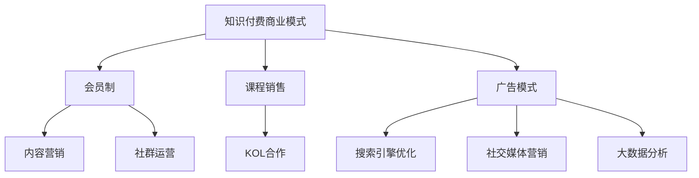

                 

 关键词：知识付费、商业模式、知识经济、创新、运营策略、数字化营销

> 摘要：随着知识经济的崛起，知识付费已成为推动社会进步和经济发展的新动力。本文将探讨知识经济时代下知识付费的兴起背景，分析其核心商业模式，并深入探讨创新运营策略以及数字化营销手段，为行业从业者和投资者提供有益的参考和指导。

## 1. 背景介绍

### 1.1 知识经济的崛起

知识经济，是指以知识为主要生产要素的经济形态，它不同于传统的以自然资源和劳动力为主的经济模式。随着信息技术的迅猛发展，知识经济已成为全球经济的新引擎。知识的创造、传播和应用效率大幅提升，知识付费市场应运而生。

### 1.2 知识付费的兴起

知识付费，是指用户为了获取特定知识或服务而支付的费用。在知识经济时代，知识付费成为人们获取知识和技能的重要途径。根据市场调研数据显示，全球知识付费市场规模逐年增长，呈现出强劲的发展态势。

### 1.3 知识付费的特点

1. **个性化需求**：知识付费满足了个性化学习需求，用户可以根据自己的兴趣和职业发展需求选择适合自己的知识产品。
2. **高附加值**：知识付费产品通常具有较高的附加值，为用户提供深度、专业的知识和技能。
3. **高粘性**：优质的知识付费产品能够提升用户粘性，促进用户持续消费。

## 2. 核心概念与联系

### 2.1 商业模式

知识付费商业模式，是指企业通过提供知识产品或服务，实现商业价值的方式。常见的商业模式包括：

- **会员制**：通过会员订阅模式，实现持续收入。
- **课程销售**：直接销售课程或知识产品，实现一次性收入。
- **广告模式**：通过投放广告，获取广告收入。

### 2.2 运营策略

知识付费运营策略，是指企业为了提高知识付费产品的市场竞争力，采取的一系列营销和管理措施。常见的运营策略包括：

- **内容营销**：通过高质量的内容吸引和留住用户。
- **社群运营**：建立用户社群，提升用户参与度和忠诚度。
- **KOL合作**：与行业内的知名人士合作，提升品牌影响力。

### 2.3 数字化营销

数字化营销，是指利用数字技术和工具，实现营销目标的过程。在知识付费领域，数字化营销发挥着重要作用，常见的数字化营销手段包括：

- **搜索引擎优化（SEO）**：通过优化网站内容，提高搜索引擎排名。
- **社交媒体营销**：利用社交媒体平台，推广知识付费产品。
- **大数据分析**：通过数据分析，了解用户需求，优化产品和服务。

### 2.4 Mermaid 流程图



## 3. 核心算法原理 & 具体操作步骤

### 3.1 算法原理概述

在知识付费领域，算法原理主要包括用户行为分析、内容推荐算法和数据挖掘技术。这些算法可以帮助企业了解用户需求，优化产品和服务。

### 3.2 算法步骤详解

1. **用户行为分析**：通过收集用户在平台上的行为数据，如浏览记录、购买历史、评价等，分析用户偏好和需求。
2. **内容推荐算法**：利用用户行为数据，为用户推荐符合其需求和兴趣的知识产品。
3. **数据挖掘技术**：通过挖掘用户行为数据和内容数据，发现潜在的商业机会和用户需求。

### 3.3 算法优缺点

**优点**：

- 提高用户满意度：通过个性化推荐，满足用户个性化需求。
- 提高运营效率：通过数据分析和挖掘，优化产品和服务。

**缺点**：

- 数据隐私问题：用户行为数据可能涉及隐私问题。
- 算法偏见：算法可能存在偏见，导致推荐结果不准确。

### 3.4 算法应用领域

- **电商推荐**：通过用户行为数据，为用户提供个性化推荐。
- **在线教育**：通过内容推荐算法，为用户提供符合其学习需求的知识产品。
- **金融领域**：通过数据挖掘技术，发现潜在的商业机会和用户需求。

## 4. 数学模型和公式 & 详细讲解 & 举例说明

### 4.1 数学模型构建

在知识付费领域，常用的数学模型包括用户行为模型、内容推荐模型和收益模型。

### 4.2 公式推导过程

1. **用户行为模型**：

   $$ User\_Behavior(t) = f(User\_Features, Content\_Features, Time) $$

   其中，$User\_Features$ 为用户特征向量，$Content\_Features$ 为内容特征向量，$Time$ 为时间。

2. **内容推荐模型**：

   $$ Recommendation(Content\_i) = f(User\_Behavior(t), Content\_Features(Content\_i), Similarity(Content\_i, Content\_j)) $$

   其中，$Content\_i$ 为推荐的内容，$Similarity(Content\_i, Content\_j)$ 为内容之间的相似度。

3. **收益模型**：

   $$ Revenue(t) = f(User\_Behavior(t), Subscription, Purchase) $$

   其中，$Subscription$ 为订阅收入，$Purchase$ 为购买收入。

### 4.3 案例分析与讲解

以某在线教育平台为例，通过构建用户行为模型、内容推荐模型和收益模型，实现知识付费产品的精准推荐和收益最大化。

- **用户行为模型**：通过分析用户在平台上的行为数据，如浏览、购买、评价等，构建用户行为模型，为内容推荐提供基础。
- **内容推荐模型**：利用用户行为模型和内容特征，结合内容相似度计算，为用户推荐符合其兴趣和需求的知识产品。
- **收益模型**：通过分析用户行为数据，调整推荐策略，实现订阅收入和购买收入的最大化。

## 5. 项目实践：代码实例和详细解释说明

### 5.1 开发环境搭建

- **Python**：选择Python作为开发语言，因为Python在数据分析和机器学习领域有广泛的应用。
- **Jupyter Notebook**：使用Jupyter Notebook进行开发和实验。

### 5.2 源代码详细实现

以下为用户行为模型的实现代码：

```python
import pandas as pd
from sklearn.feature_extraction.text import TfidfVectorizer
from sklearn.model_selection import train_test_split
from sklearn.linear_model import LogisticRegression

# 读取数据
data = pd.read_csv('user_behavior_data.csv')

# 分离特征和标签
X = data[['user_id', 'content_id', 'behavior_type', 'time']]
y = data['is_purchase']

# 划分训练集和测试集
X_train, X_test, y_train, y_test = train_test_split(X, y, test_size=0.2, random_state=42)

# 特征工程
vectorizer = TfidfVectorizer()
X_train_vectorized = vectorizer.fit_transform(X_train)
X_test_vectorized = vectorizer.transform(X_test)

# 模型训练
model = LogisticRegression()
model.fit(X_train_vectorized, y_train)

# 模型评估
accuracy = model.score(X_test_vectorized, y_test)
print(f'Model accuracy: {accuracy:.2f}')
```

### 5.3 代码解读与分析

- **数据读取**：使用Pandas读取用户行为数据。
- **特征工程**：使用TF-IDF进行特征提取，将文本数据转换为数值数据。
- **模型训练**：使用逻辑回归模型进行训练。
- **模型评估**：使用测试集评估模型准确性。

## 6. 实际应用场景

### 6.1 在线教育

知识付费在在线教育领域应用广泛，用户可以通过付费获取专业的课程和学习资源。

### 6.2 职业培训

职业培训市场对知识付费的需求日益增长，企业和个人可以通过付费学习提升职业技能。

### 6.3 金融投资

金融投资领域也出现了知识付费的现象，投资者可以通过付费获取专业的投资建议和策略。

## 7. 未来应用展望

### 7.1 新兴领域拓展

随着科技的发展，知识付费将逐步渗透到更多新兴领域，如人工智能、区块链等。

### 7.2 深度学习与智能推荐

未来，知识付费将更加依赖于深度学习和智能推荐技术，实现更加精准的知识匹配。

### 7.3 数字化转型

知识付费将成为企业数字化转型的重要一环，助力企业提升核心竞争力。

## 8. 工具和资源推荐

### 8.1 学习资源推荐

- **《Python数据分析基础》**：适合初学者入门。
- **《深度学习》**：介绍深度学习的基本原理和应用。

### 8.2 开发工具推荐

- **Jupyter Notebook**：适合数据分析和机器学习实验。
- **TensorFlow**：适用于深度学习开发。

### 8.3 相关论文推荐

- **"Deep Learning for Personalized Recommendation"**：介绍深度学习在推荐系统中的应用。
- **"The Knowledge Economy: Concepts, Theories, and Applications"**：探讨知识经济的相关理论。

## 9. 总结：未来发展趋势与挑战

### 9.1 研究成果总结

本文从知识经济的背景出发，探讨了知识付费的商业模式、运营策略和数字化营销手段，并结合实际案例进行了详细讲解。

### 9.2 未来发展趋势

知识付费将继续保持高速发展，新兴领域和智能技术的应用将推动行业变革。

### 9.3 面临的挑战

数据隐私保护、算法偏见和用户满意度提升是知识付费行业面临的主要挑战。

### 9.4 研究展望

未来，知识付费研究将更加注重用户体验和个性化服务，实现知识资源的最大化利用。

## 附录：常见问题与解答

### 9.1 什么是知识付费？

知识付费是指用户为了获取特定知识或服务而支付的费用。

### 9.2 知识付费有哪些商业模式？

常见的知识付费商业模式包括会员制、课程销售和广告模式。

### 9.3 知识付费在哪些领域应用广泛？

知识付费在在线教育、职业培训和金融投资等领域应用广泛。

### 9.4 知识付费行业面临哪些挑战？

知识付费行业面临的主要挑战包括数据隐私保护、算法偏见和用户满意度提升。

作者：禅与计算机程序设计艺术 / Zen and the Art of Computer Programming
----------------------------------------------------------------


