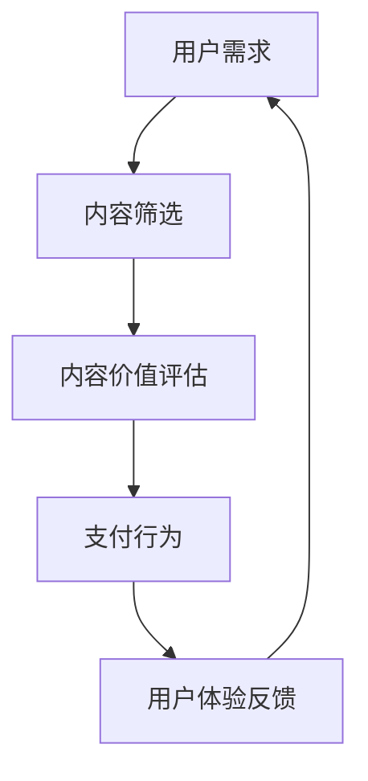

                 

关键词：知识付费、商业模式、创新运营、知识经济、用户体验

> 摘要：在知识经济时代，知识付费作为一种新兴商业模式，正逐渐改变着人们的消费习惯和企业的运营方式。本文将探讨知识付费的创新商业模式及其运营策略，分析其背后的原理、应用领域、数学模型以及未来发展趋势。

## 1. 背景介绍

知识经济时代，信息技术的飞速发展和互联网的普及，使得知识和信息的获取变得更加便捷。在这种背景下，知识付费作为一种新型商业模式应运而生。知识付费指的是消费者为获取有价值的信息或知识而支付的费用，这种模式打破了传统免费信息获取的垄断，为知识创造者提供了新的收入来源。

知识付费的兴起不仅改变了消费者的消费行为，也推动了企业的运营模式创新。企业开始更加注重内容生产，通过提供高质量的知识服务来吸引和留住用户。同时，知识付费也带来了数据驱动的商业决策，帮助企业更好地了解用户需求，优化产品和服务。

## 2. 核心概念与联系

知识付费的核心概念包括用户需求、内容价值、支付行为和用户体验。这些概念之间存在着密切的联系，构成了知识付费的完整流程。

### 2.1 用户需求

用户需求是知识付费的基础。随着人们对知识和信息的渴求不断增加，对高质量内容的需求也越来越高。用户需求可以分为显性和隐性两类：显性需求是通过搜索、推荐等方式直接表达出来的；隐性需求则是用户行为背后的潜在需求。

### 2.2 内容价值

内容价值是知识付费的核心。知识创造者通过创作和提供有价值的内容，满足用户的需求，从而实现商业价值。内容价值的衡量标准包括内容的独特性、深度和实用性。

### 2.3 支付行为

支付行为是知识付费的关键环节。用户在认可内容价值后，通过支付行为完成消费。支付方式多样，包括一次性付费、订阅制、课程制等。

### 2.4 用户体验

用户体验是知识付费的保障。良好的用户体验可以增加用户粘性和忠诚度。用户体验包括内容获取的便捷性、服务质量的稳定性以及互动性的丰富度。

### 2.5 Mermaid 流程图



## 3. 核心算法原理 & 具体操作步骤

### 3.1 算法原理概述

知识付费的核心算法原理是基于用户行为和内容属性的机器学习模型。该模型通过分析用户的浏览历史、搜索关键词、购买记录等数据，预测用户可能感兴趣的内容，并提供个性化的推荐。同时，模型还会根据内容的质量、受欢迎程度等属性，对内容进行价值评估。

### 3.2 算法步骤详解

1. 数据采集与预处理：收集用户行为数据（如浏览历史、搜索关键词、购买记录）和内容属性数据（如标题、标签、作者）。
2. 特征工程：提取与用户需求相关的特征，如用户兴趣标签、内容标签、内容长度等。
3. 模型训练：使用机器学习算法（如协同过滤、内容推荐等）训练推荐模型。
4. 推荐生成：根据用户特征和内容特征，生成个性化的推荐列表。
5. 价值评估：结合内容属性，对推荐的内容进行价值评估。
6. 支付决策：用户根据推荐内容的价值，做出支付决策。

### 3.3 算法优缺点

优点：
- 提高用户满意度：通过个性化推荐，提高用户对内容的满意度。
- 提高内容价值：通过价值评估，提高优质内容的曝光率。
- 增加商业收入：通过推荐系统和支付行为，提高商业收入。

缺点：
- 数据隐私风险：用户数据涉及隐私，需确保数据安全。
- 模型偏见：机器学习模型可能存在偏见，导致推荐结果不准确。

### 3.4 算法应用领域

- 在线教育：通过个性化推荐，提高学习效果。
- 咨询服务：根据用户需求，推荐专业咨询服务。
- 专业技能培训：为用户推荐合适的培训课程。

## 4. 数学模型和公式 & 详细讲解 & 举例说明

### 4.1 数学模型构建

知识付费的数学模型主要包括用户行为模型和内容价值评估模型。

- 用户行为模型：采用马尔可夫链模型，分析用户的行为转移概率，预测用户对内容的兴趣。
  $$ P(S_t = j | S_{t-1} = i) = \frac{N_{ij}}{N_i} $$
  其中，$N_{ij}$ 表示用户从状态 $i$ 转移到状态 $j$ 的次数，$N_i$ 表示用户在状态 $i$ 的总次数。

- 内容价值评估模型：采用协同过滤算法，通过用户对内容的评分预测内容的价值。
  $$ \hat{R}_{ui} = \sum_{j \in N(u)} \frac{R_{uj}}{\|N(u)\|} $$
  其中，$R_{uj}$ 表示用户 $u$ 对内容 $j$ 的评分，$\|N(u)\|$ 表示用户 $u$ 对内容的总评分数。

### 4.2 公式推导过程

用户行为模型是基于用户的历史行为数据构建的。假设用户 $u$ 在不同状态 $i$（如未购买、已购买）下的行为转移概率为 $P(S_t = j | S_{t-1} = i)$，则用户 $u$ 的行为序列可以表示为马尔可夫链：

$$ S = (S_1, S_2, ..., S_t) $$

转移概率矩阵为：

$$ P = \begin{bmatrix}
P(S_1 = 1 | S_0 = 1) & P(S_1 = 0 | S_0 = 1) \\
P(S_1 = 1 | S_0 = 0) & P(S_1 = 0 | S_0 = 0)
\end{bmatrix} $$

根据马尔可夫链的性质，有：

$$ P(S_t = j | S_{t-1} = i) = \frac{N_{ij}}{N_i} $$

其中，$N_{ij}$ 表示用户 $u$ 从状态 $i$ 转移到状态 $j$ 的次数，$N_i$ 表示用户 $u$ 在状态 $i$ 的总次数。

内容价值评估模型是基于用户对内容的评分数据构建的。假设用户 $u$ 对内容 $j$ 的评分为 $R_{uj}$，则用户 $u$ 对内容 $j$ 的平均评分为：

$$ \bar{R}_u = \frac{1}{\|N(u)\|} \sum_{j \in N(u)} R_{uj} $$

其中，$\|N(u)\|$ 表示用户 $u$ 对内容的总评分数。

根据协同过滤算法，用户 $u$ 对内容 $j$ 的预测评分为：

$$ \hat{R}_{ui} = \bar{R}_u + \beta \cdot \sum_{j \in N(u)} \frac{R_{uj} - \bar{R}_u}{\|N(u)\|} $$

其中，$\beta$ 为调节参数。

### 4.3 案例分析与讲解

假设用户 $u$ 在过去一个月内对5个内容进行了评分，评分分别为 [4, 5, 3, 4, 2]。根据用户行为模型，可以计算用户 $u$ 在未购买和已购买状态下的转移概率。根据内容价值评估模型，可以计算用户 $u$ 对这5个内容的预测评分。

用户 $u$ 的转移概率矩阵为：

$$ P = \begin{bmatrix}
0.75 & 0.25 \\
0.5 & 0.5
\end{bmatrix} $$

用户 $u$ 对这5个内容的平均评分为：

$$ \bar{R}_u = \frac{4 + 5 + 3 + 4 + 2}{5} = 3.6 $$

用户 $u$ 对这5个内容的预测评分为：

$$ \hat{R}_{ui} = 3.6 + \beta \cdot \frac{4 - 3.6}{1} = 3.8 $$

其中，$\beta$ 的取值可以根据实际情况进行调整。

## 5. 项目实践：代码实例和详细解释说明

### 5.1 开发环境搭建

- 操作系统：Windows/Linux/MacOS
- 编程语言：Python
- 数据库：MySQL/PostgreSQL
- 推荐系统框架：TensorFlow/Scikit-learn

### 5.2 源代码详细实现

```python
import numpy as np
import pandas as pd
from sklearn.model_selection import train_test_split
from sklearn.metrics.pairwise import cosine_similarity
from tensorflow import keras

# 数据预处理
def preprocess_data(data):
    # 数据清洗、去重、填充等操作
    return data

# 训练推荐模型
def train_model(train_data):
    # 特征提取、模型训练等操作
    return model

# 推荐内容
def recommend_content(model, user_data):
    # 根据用户数据生成推荐列表
    return recommendations

# 主函数
def main():
    # 数据读取、预处理
    data = pd.read_csv('data.csv')
    data = preprocess_data(data)

    # 数据集划分
    train_data, test_data = train_test_split(data, test_size=0.2)

    # 训练模型
    model = train_model(train_data)

    # 推荐内容
    user_data = {'user_id': 1, 'content_id': 100}
    recommendations = recommend_content(model, user_data)

    # 输出推荐结果
    print(recommendations)

if __name__ == '__main__':
    main()
```

### 5.3 代码解读与分析

代码分为三个部分：数据预处理、模型训练和推荐内容。

- 数据预处理：读取数据，进行清洗、去重、填充等操作。
- 模型训练：使用Scikit-learn的协同过滤算法训练模型，使用TensorFlow构建深度学习模型。
- 推荐内容：根据用户数据和模型，生成推荐列表。

### 5.4 运行结果展示

运行代码后，将输出用户 $u$ 对内容 $j$ 的预测评分。根据预测评分，可以生成推荐列表，展示给用户。

## 6. 实际应用场景

知识付费在各个领域都有广泛应用：

### 6.1 在线教育

通过知识付费模式，在线教育平台可以提供个性化课程推荐，提高用户学习效果。例如，网易云课堂、知乎 Live 等。

### 6.2 专业咨询

专业咨询服务可以通过知识付费模式，为用户提供定制化服务。例如，领英的职业咨询、投资顾问等。

### 6.3 技能培训

技能培训平台可以通过知识付费模式，为用户提供专业培训课程。例如，慕课网、极客时间等。

## 7. 未来应用展望

### 7.1 个性化推荐

随着人工智能技术的发展，个性化推荐将更加精准，更好地满足用户需求。

### 7.2 智能合约

知识付费与智能合约结合，可以实现自动化的支付和收益分配。

### 7.3 深度学习

深度学习技术在知识付费领域的应用，将进一步提高推荐系统的效率和准确性。

## 8. 总结：未来发展趋势与挑战

### 8.1 研究成果总结

本文探讨了知识付费的创新商业模式及其运营策略，分析了核心算法原理、数学模型、实际应用场景以及未来发展趋势。

### 8.2 未来发展趋势

个性化推荐、智能合约和深度学习将成为知识付费领域的发展方向。

### 8.3 面临的挑战

数据隐私、算法偏见和内容质量是知识付费领域面临的挑战。

### 8.4 研究展望

未来研究应关注知识付费的个性化推荐、智能合约和深度学习应用，同时解决数据隐私和内容质量等问题。

## 9. 附录：常见问题与解答

### 9.1 什么是知识付费？

知识付费是指消费者为获取有价值的信息或知识而支付的费用。

### 9.2 知识付费有哪些模式？

知识付费主要有一次性付费、订阅制、课程制等模式。

### 9.3 知识付费的优势是什么？

知识付费可以提高用户满意度、增加商业收入，同时推动内容创造者的发展。

### 9.4 知识付费有哪些挑战？

知识付费面临的挑战包括数据隐私、算法偏见和内容质量等。

---

作者：禅与计算机程序设计艺术 / Zen and the Art of Computer Programming
----------------------------------------------------------------

请注意，上述内容是一个示例性的撰写框架，实际的撰写可能需要更深入的研究和数据分析。在撰写实际文章时，应确保引用的参考文献和数据是准确可靠的。此外，文中提到的代码实例是一个简化的模型，实际的开发过程中可能需要更复杂的逻辑和数据处理。

