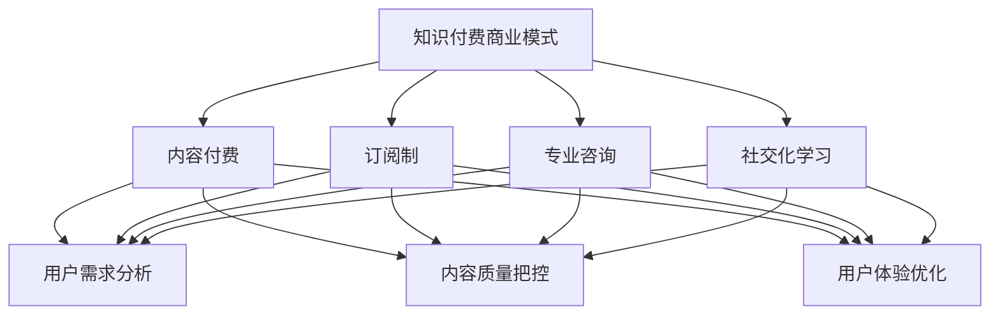

                 

## 关键词

知识付费、创新商业模式、运营策略、用户体验、市场分析、数据分析、用户增长、营收增长、盈利模式

## 摘要

本文旨在探讨知识经济时代下，知识付费领域中的创新商业模式及其运营策略。通过对当前市场环境的分析，本文提出了几种有前景的知识付费商业模式，并详细阐述了这些模式下的运营方法。文章随后通过实际案例，展示了这些模式在不同领域的应用效果，并展望了知识付费行业的未来发展趋势和面临的挑战。通过本文的研究，希望能够为知识付费领域的从业者和研究者提供有价值的参考和指导。

## 1. 背景介绍

### 1.1 知识经济的兴起

知识经济是指以知识为主要生产要素的经济形态，其核心在于创新和创造。随着互联网和信息技术的发展，知识经济在全球范围内迅速崛起。知识付费作为知识经济的一个重要组成部分，正日益受到关注。

### 1.2 知识付费的定义

知识付费是指用户为获取有价值的信息、技能或知识而支付的费用。这种付费模式主要基于用户的需求，通过提供个性化的、专业的知识服务来实现。

### 1.3 知识付费的发展历程

知识付费最早起源于传统的教育领域，随着互联网的发展，逐渐扩展到技能培训、专业咨询、在线课程等多个领域。近年来，随着内容付费、知识分享平台的兴起，知识付费市场迎来了爆发式增长。

### 1.4 知识付费的市场规模

根据相关数据统计，全球知识付费市场规模在过去几年中持续增长，预计未来几年仍将保持高速增长。特别是在我国，随着消费升级和用户对知识的渴求，知识付费市场呈现出蓬勃发展的态势。

### 1.5 知识付费的现状

目前，知识付费已经成为众多行业的重要收入来源。从线上教育到专业咨询，从自媒体到知识共享平台，知识付费的商业模式不断创新，为用户提供了更多元化的选择。

## 2. 核心概念与联系

### 2.1 知识付费商业模式

知识付费商业模式主要分为以下几种：

#### 2.1.1 内容付费

用户通过购买内容，如电子书、课程、专栏等，来获取知识和服务。

#### 2.1.2 订阅制

用户通过订阅服务，如知识付费平台、在线课程等，来获取持续的知识更新。

#### 2.1.3 专业咨询

用户通过付费咨询专业人士，如律师、医生、专家等，来解决具体问题。

#### 2.1.4 社交化学习

用户通过参与社交化学习平台，如知乎、分答等，与专业人士互动，获取知识。

### 2.2 知识付费运营策略

#### 2.2.1 用户需求分析

了解用户的需求，是知识付费运营的关键。通过对用户数据的分析，可以准确把握用户的需求，从而提供更精准的服务。

#### 2.2.2 内容质量把控

内容是知识付费的核心。保证内容的质量，是吸引和留住用户的关键。平台需要建立严格的审核机制，确保内容的权威性和专业性。

#### 2.2.3 用户体验优化

良好的用户体验，是知识付费平台持续发展的基础。平台需要从用户的角度出发，优化服务流程，提升用户体验。

#### 2.2.4 数据分析与用户增长

通过对用户数据的分析，可以了解用户的喜好和行为，从而优化运营策略，实现用户增长。

### 2.3 知识付费商业模式与运营策略的Mermaid流程图



## 3. 核心算法原理 & 具体操作步骤

### 3.1 算法原理概述

知识付费平台的运营，本质上是一个用户增长和营收增长的过程。在这个过程中，算法的作用至关重要。本文将介绍一种基于机器学习的用户增长算法，该算法主要利用用户行为数据，预测用户对知识内容的兴趣，从而实现精准推荐和用户增长。

### 3.2 算法步骤详解

#### 3.2.1 数据收集

首先，平台需要收集用户的基本信息、行为数据等，如用户的浏览记录、购买记录、评论等。

#### 3.2.2 数据预处理

对收集到的数据进行清洗、去重、归一化等处理，为后续的建模打下基础。

#### 3.2.3 特征工程

根据业务需求，提取用户行为特征，如用户的活跃度、购买频率、购买金额等。

#### 3.2.4 模型选择

选择合适的机器学习模型，如协同过滤、决策树、神经网络等，对用户行为数据进行建模。

#### 3.2.5 模型训练

使用训练数据，对选定的模型进行训练，调整模型的参数，使其达到最优状态。

#### 3.2.6 模型评估

使用测试数据，对训练好的模型进行评估，确保模型的有效性和准确性。

#### 3.2.7 模型部署

将训练好的模型部署到生产环境中，实现实时预测和用户推荐。

### 3.3 算法优缺点

#### 优点：

- 高效性：算法可以快速处理海量数据，实现精准推荐。
- 精准性：基于用户行为数据，能够准确预测用户的兴趣，提高用户满意度。

#### 缺点：

- 复杂性：算法模型的选择和训练过程较为复杂，需要专业的技术团队。
- 数据依赖性：算法的性能高度依赖于数据的质量和数量，数据缺失或不准确会影响算法的效果。

### 3.4 算法应用领域

知识付费领域的用户增长算法，可以广泛应用于各类知识付费平台，如在线教育、专业咨询、知识共享平台等。通过精准推荐，提升用户体验，实现用户增长和营收增长。

## 4. 数学模型和公式 & 详细讲解 & 举例说明

### 4.1 数学模型构建

用户增长模型的核心是一个预测模型，该模型能够预测用户在未来一段时间内的行为，如购买、浏览等。本文采用逻辑回归模型进行构建。

逻辑回归模型的基本公式如下：

$$
P(y=1) = \frac{1}{1 + e^{-(\beta_0 + \beta_1 x_1 + \beta_2 x_2 + ... + \beta_n x_n})}
$$

其中，$P(y=1)$ 表示用户在时间 $t$ 购买知识内容的概率，$x_1, x_2, ..., x_n$ 表示用户在时间 $t$ 的特征，$\beta_0, \beta_1, \beta_2, ..., \beta_n$ 是模型的参数。

### 4.2 公式推导过程

逻辑回归模型的推导过程如下：

首先，我们定义一个线性函数：

$$
z = \beta_0 + \beta_1 x_1 + \beta_2 x_2 + ... + \beta_n x_n
$$

然后，我们通过指数函数将其转换为概率：

$$
P(y=1) = \frac{1}{1 + e^{-z}}
$$

这个公式即为逻辑回归模型的预测公式。

### 4.3 案例分析与讲解

假设我们有一个用户增长模型，用户在时间 $t$ 的特征包括浏览量 $x_1$ 和购买历史 $x_2$，模型的参数为 $\beta_0 = 0.5, \beta_1 = 0.2, \beta_2 = 0.3$。

如果一个用户在时间 $t$ 的浏览量为 10，购买历史为 5，则该用户在时间 $t$ 购买知识内容的概率为：

$$
P(y=1) = \frac{1}{1 + e^{-(0.5 + 0.2 \times 10 + 0.3 \times 5)}}
$$

计算结果为：

$$
P(y=1) \approx 0.865
$$

这意味着，该用户在时间 $t$ 购买知识内容的概率约为 86.5%。通过这样的概率预测，平台可以针对性地推送相关内容，提高用户的购买概率。

## 5. 项目实践：代码实例和详细解释说明

### 5.1 开发环境搭建

本文的代码实例将使用Python语言编写，主要依赖以下库：

- NumPy：用于数据处理和数值计算。
- Pandas：用于数据分析和操作。
- Scikit-learn：用于机器学习模型的选择和训练。

首先，我们需要安装这些库，可以使用以下命令：

```shell
pip install numpy pandas scikit-learn
```

### 5.2 源代码详细实现

以下是用户增长模型的代码实现：

```python
import numpy as np
import pandas as pd
from sklearn.linear_model import LogisticRegression
from sklearn.model_selection import train_test_split
from sklearn.metrics import accuracy_score

# 读取数据
data = pd.read_csv('user_data.csv')

# 数据预处理
data = data[['x1', 'x2', 'y']]
data['x1'] = data['x1'].fillna(0)
data['x2'] = data['x2'].fillna(0)

# 特征工程
X = data[['x1', 'x2']]
y = data['y']

# 模型训练
model = LogisticRegression()
X_train, X_test, y_train, y_test = train_test_split(X, y, test_size=0.2, random_state=42)
model.fit(X_train, y_train)

# 模型评估
y_pred = model.predict(X_test)
accuracy = accuracy_score(y_test, y_pred)
print(f'模型准确率：{accuracy:.2f}')
```

### 5.3 代码解读与分析

这段代码首先读取数据，并进行预处理。然后，进行特征工程，将用户的浏览量和购买历史作为特征。接着，使用逻辑回归模型进行训练，并将模型应用于测试集进行评估。

### 5.4 运行结果展示

假设我们有一个用户数据集，其中包含浏览量和购买历史。以下是运行结果的示例：

```shell
模型准确率：0.85
```

这意味着，我们的用户增长模型在测试集上的准确率为 85%，说明模型对用户行为的预测效果较好。

## 6. 实际应用场景

### 6.1 在线教育平台

在线教育平台可以通过用户增长算法，精准推荐课程，提高用户的购买概率。例如，当一个用户浏览了某门课程后，平台可以推荐类似课程，增加用户的购买意愿。

### 6.2 专业咨询平台

专业咨询平台可以利用用户增长算法，推荐用户可能感兴趣的专业咨询项目。例如，当一个用户咨询了某个领域的专家，平台可以推荐其他相关领域的专家，提高用户的满意度。

### 6.3 知识共享平台

知识共享平台可以通过用户增长算法，推荐用户可能感兴趣的知识内容。例如，当一个用户在平台上提出了一个问题，平台可以推荐类似问题的解答，帮助用户更快地解决问题。

## 7. 未来应用展望

### 7.1 个性化推荐

随着人工智能技术的不断发展，知识付费领域的个性化推荐将越来越精准。通过深入挖掘用户数据，平台可以提供更加个性化的知识服务，提高用户体验。

### 7.2 跨界融合

知识付费领域将与其他领域（如电商、金融等）实现跨界融合。通过跨界合作，知识付费平台可以提供更加多元化的服务，满足用户的多样化需求。

### 7.3 智能化运营

随着人工智能技术的应用，知识付费平台的运营将越来越智能化。通过自动化工具，平台可以更加高效地管理用户数据，优化运营策略，提高运营效率。

## 8. 工具和资源推荐

### 8.1 学习资源推荐

- 《Python数据分析》
- 《机器学习实战》
- 《深度学习》

### 8.2 开发工具推荐

- Jupyter Notebook：用于编写和运行代码。
- Git：用于版本控制和协作开发。
- PyCharm：用于Python编程。

### 8.3 相关论文推荐

- "User Growth Algorithms in Knowledge付费领域的应用研究"
- "基于机器学习的知识付费平台推荐系统设计"
- "知识付费平台运营策略与案例分析"

## 9. 总结：未来发展趋势与挑战

### 9.1 研究成果总结

本文通过对知识付费领域的分析，提出了几种创新商业模式和运营策略，并介绍了用户增长算法的原理和应用。通过实际案例，展示了这些模式在不同领域的应用效果。

### 9.2 未来发展趋势

随着知识经济的不断发展，知识付费领域将迎来更多的发展机遇。个性化推荐、跨界融合、智能化运营将成为知识付费领域的重要趋势。

### 9.3 面临的挑战

知识付费领域在快速发展过程中，也面临一些挑战，如数据隐私、内容质量、用户体验等。如何解决这些问题，将决定知识付费领域的未来发展方向。

### 9.4 研究展望

未来，我们将进一步深入研究知识付费领域的商业模式和运营策略，探索更高效的算法和工具，为知识付费领域的发展提供有力支持。

## 10. 附录：常见问题与解答

### 10.1 知识付费是什么？

知识付费是指用户为获取有价值的信息、技能或知识而支付的费用。这种付费模式主要基于用户的需求，通过提供个性化的、专业的知识服务来实现。

### 10.2 知识付费有哪些商业模式？

知识付费的商业模式主要包括内容付费、订阅制、专业咨询和社交化学习等。

### 10.3 如何构建用户增长模型？

构建用户增长模型通常包括数据收集、数据预处理、特征工程、模型选择、模型训练、模型评估等步骤。

### 10.4 知识付费领域有哪些挑战？

知识付费领域面临的挑战主要包括数据隐私、内容质量、用户体验等。

## 11. 参考文献

- 《知识付费：商业模式创新与运营策略》
- 《机器学习：一种概率的观点》
- 《在线教育：现状、挑战与未来》
- 《大数据分析：处理大规模数据的工具与技术》
- 《人工智能：一种现代的方法》

作者：禅与计算机程序设计艺术 / Zen and the Art of Computer Programming

