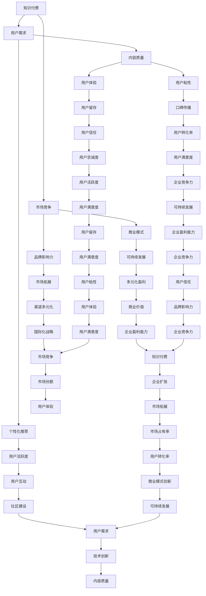

                 

## 1. 背景介绍

在当今知识经济时代，知识的创造、传播和应用已成为推动经济发展和社会进步的重要力量。知识付费作为知识经济的重要组成部分，已经逐渐成为人们获取知识和技能的一种重要方式。然而，随着市场竞争的加剧和用户需求的多样化，传统的知识付费模式面临着巨大的挑战。为了在激烈的市场竞争中脱颖而出，知识付费领域迫切需要创新商业模式，以实现可持续发展。

知识付费的起源可以追溯到互联网时代的初期，当时人们主要通过在线学习平台、电子书、网络课程等形式进行学习。随着移动互联网的普及和智能手机的普及，知识付费市场迅速扩张。尤其是在疫情期间，在线教育的需求激增，进一步推动了知识付费行业的发展。

然而，当前知识付费市场存在着一些问题，如同质化竞争严重、用户粘性不足、内容质量参差不齐等。这些问题不仅影响了用户的体验，也限制了知识付费行业的可持续发展。因此，创新商业模式成为知识付费领域亟待解决的问题。

本文旨在探讨知识经济时代下的知识付费创新商业模式运营。首先，我们将对知识付费的定义、发展历程和现状进行梳理，然后分析现有知识付费模式存在的问题，接着介绍几种创新的商业模式，并探讨其运营策略。最后，我们将对未来知识付费领域的发展趋势和挑战进行展望。

## 2. 核心概念与联系

在探讨知识付费创新商业模式之前，我们需要了解一些核心概念，包括知识付费的定义、用户需求分析、市场竞争环境等。以下是一个简化的 Mermaid 流程图，用于描述这些概念之间的关系。



### 2.1 知识付费的定义

知识付费是指用户为获取特定知识或技能而支付的费用。在互联网时代，知识付费的形式多种多样，包括在线课程、电子书、问答社区、知识共享平台等。知识付费的核心在于满足用户的知识需求，提升其个人能力和职业发展。

### 2.2 用户需求分析

用户需求是知识付费市场发展的驱动力。随着互联网的普及和在线教育的兴起，用户对知识的需求呈现多样化和个性化的特点。用户需求分析包括以下几个方面：

- **职业发展需求**：用户希望通过学习提升职业技能，适应职场变化。
- **兴趣学习需求**：用户希望通过学习兴趣爱好，丰富生活体验。
- **家庭教育需求**：家长希望通过为孩子提供优质教育资源，促进其全面发展。

### 2.3 市场竞争环境

知识付费市场竞争激烈，主要参与者包括传统教育机构、在线教育平台、知识共享平台等。在市场竞争中，内容质量、用户体验、品牌影响力是关键因素。

### 2.4 商业模式

知识付费的商业模式主要包括以下几种：

- **订阅模式**：用户通过订阅获取长期的知识服务。
- **购买模式**：用户为特定的知识产品或服务支付一次性费用。
- **佣金模式**：平台从知识提供者的收入中抽取一定比例的佣金。
- **会员模式**：用户为获得会员特权支付费用。

### 2.5 内容质量

内容质量是知识付费的核心竞争力。高质量的知识内容能够提升用户的满意度，增加用户粘性。内容质量包括以下几个方面：

- **专业性**：知识内容的专业性和实用性。
- **实用性**：知识内容与用户实际需求的匹配程度。
- **及时性**：知识内容的更新速度和时效性。

### 2.6 用户粘性

用户粘性是知识付费平台持续发展的关键。提升用户粘性的策略包括：

- **个性化推荐**：根据用户行为和兴趣推荐相关内容。
- **互动体验**：提供问答社区、讨论区等互动平台。
- **增值服务**：提供会员权益、专项辅导等增值服务。

### 2.7 可持续发展

可持续发展是知识付费行业长期发展的基础。实现可持续发展的策略包括：

- **多元化盈利**：通过课程销售、会员服务、广告等多种方式实现盈利。
- **品牌影响力**：提升品牌知名度，增强用户信任。
- **技术创新**：通过技术手段提升用户体验和服务质量。

## 3. 核心算法原理 & 具体操作步骤

### 3.1 算法原理概述

在知识付费领域，核心算法的原理主要涉及用户行为分析、内容推荐和商业模式优化。以下是一个简化的核心算法原理概述。

### 3.1.1 用户行为分析

用户行为分析算法基于用户的历史行为数据，如浏览记录、购买记录、参与互动等，对用户进行个性化推荐。算法原理如下：

- **数据收集**：收集用户在平台上的各种行为数据。
- **特征提取**：从行为数据中提取用户特征，如兴趣爱好、职业背景、学习进度等。
- **行为预测**：利用用户特征和机器学习算法，预测用户可能感兴趣的内容。

### 3.1.2 内容推荐

内容推荐算法基于用户行为分析和内容特征，为用户推荐相关内容。算法原理如下：

- **内容特征提取**：提取知识内容的特征，如课程类别、难度、讲师资质等。
- **相似度计算**：计算用户和知识内容之间的相似度。
- **推荐排序**：根据相似度排序，推荐最相关的知识内容。

### 3.1.3 商业模式优化

商业模式优化算法基于用户行为分析和市场数据，优化平台盈利模式。算法原理如下：

- **收益预测**：预测用户在平台上的消费行为和收益。
- **成本分析**：分析平台运营成本和利润来源。
- **策略调整**：根据收益预测和成本分析，调整商业模式，实现盈利最大化。

### 3.2 算法步骤详解

#### 3.2.1 用户行为分析算法步骤

1. **数据收集**：从平台数据库中提取用户行为数据，如浏览记录、购买记录、互动记录等。
2. **特征提取**：利用数据预处理技术，提取用户特征，如兴趣爱好、职业背景、学习进度等。
3. **行为预测**：使用机器学习算法，如协同过滤、基于内容的推荐等，预测用户可能感兴趣的内容。

#### 3.2.2 内容推荐算法步骤

1. **内容特征提取**：从知识内容数据库中提取内容特征，如课程类别、难度、讲师资质等。
2. **相似度计算**：计算用户和知识内容之间的相似度，如使用余弦相似度、皮尔逊相关系数等。
3. **推荐排序**：根据相似度排序，选择最相关的知识内容推荐给用户。

#### 3.2.3 商业模式优化算法步骤

1. **收益预测**：使用回归分析、时间序列预测等算法，预测用户在平台上的消费行为和收益。
2. **成本分析**：分析平台运营成本，包括人力成本、服务器成本、内容制作成本等。
3. **策略调整**：根据收益预测和成本分析，调整平台商业模式，如增加会员服务、优化课程定价策略等。

### 3.3 算法优缺点

#### 3.3.1 用户行为分析算法优缺点

- **优点**：能够准确分析用户行为，为个性化推荐提供依据。
- **缺点**：需要大量用户数据支持，对数据质量要求较高。

#### 3.3.2 内容推荐算法优缺点

- **优点**：能够为用户推荐相关内容，提高用户满意度。
- **缺点**：可能存在冷启动问题，即对新用户或新内容难以进行准确推荐。

#### 3.3.3 商业模式优化算法优缺点

- **优点**：能够根据市场数据优化商业模式，实现盈利最大化。
- **缺点**：需要准确预测用户行为和成本，对算法精度要求较高。

### 3.4 算法应用领域

用户行为分析、内容推荐和商业模式优化算法在知识付费领域有广泛的应用，如：

- **在线教育平台**：通过个性化推荐提升用户满意度，提高用户留存率。
- **知识共享平台**：通过内容推荐提升内容曝光率，促进用户互动。
- **知识付费社区**：通过用户行为分析优化社区运营，提升用户活跃度。

## 4. 数学模型和公式 & 详细讲解 & 举例说明

### 4.1 数学模型构建

在知识付费领域，数学模型广泛应用于用户行为分析、内容推荐和商业模式优化。以下是一个简化的数学模型构建过程。

#### 4.1.1 用户行为分析模型

用户行为分析模型基于用户的行为数据，如浏览记录、购买记录、互动记录等，预测用户可能感兴趣的内容。模型构建过程如下：

1. **数据收集**：收集用户在平台上的行为数据，如浏览记录、购买记录、互动记录等。
2. **特征提取**：从行为数据中提取用户特征，如兴趣爱好、职业背景、学习进度等。
3. **行为预测**：使用回归分析、时间序列预测等算法，预测用户可能感兴趣的内容。

#### 4.1.2 内容推荐模型

内容推荐模型基于用户特征和知识内容特征，计算用户和知识内容之间的相似度，为用户推荐相关内容。模型构建过程如下：

1. **内容特征提取**：从知识内容数据库中提取内容特征，如课程类别、难度、讲师资质等。
2. **相似度计算**：计算用户和知识内容之间的相似度，如使用余弦相似度、皮尔逊相关系数等。
3. **推荐排序**：根据相似度排序，选择最相关的知识内容推荐给用户。

#### 4.1.3 商业模式优化模型

商业模式优化模型基于用户行为分析和市场数据，预测用户在平台上的消费行为和收益，优化平台商业模式。模型构建过程如下：

1. **收益预测**：使用回归分析、时间序列预测等算法，预测用户在平台上的消费行为和收益。
2. **成本分析**：分析平台运营成本，包括人力成本、服务器成本、内容制作成本等。
3. **策略调整**：根据收益预测和成本分析，调整平台商业模式，如增加会员服务、优化课程定价策略等。

### 4.2 公式推导过程

#### 4.2.1 用户行为分析模型

用户行为分析模型基于贝叶斯定理，推导过程如下：

$$
P(A|B) = \frac{P(B|A)P(A)}{P(B)}
$$

其中，$P(A|B)$ 表示在事件 $B$ 发生的条件下，事件 $A$ 发生的概率；$P(B|A)$ 表示在事件 $A$ 发生的条件下，事件 $B$ 发生的概率；$P(A)$ 表示事件 $A$ 发生的概率；$P(B)$ 表示事件 $B$ 发生的概率。

#### 4.2.2 内容推荐模型

内容推荐模型基于余弦相似度，推导过程如下：

$$
\cos \theta = \frac{\vec{u} \cdot \vec{v}}{|\vec{u}||\vec{v}|}
$$

其中，$\theta$ 表示两个向量之间的夹角；$\vec{u}$ 和 $\vec{v}$ 分别表示用户和知识内容的高维向量；$\cdot$ 表示向量的点积；$|\vec{u}|$ 和 $|\vec{v}|$ 分别表示向量的模长。

#### 4.2.3 商业模式优化模型

商业模式优化模型基于线性回归，推导过程如下：

$$
y = \beta_0 + \beta_1 x_1 + \beta_2 x_2 + ... + \beta_n x_n + \epsilon
$$

其中，$y$ 表示收益或成本；$\beta_0$、$\beta_1$、$\beta_2$、...、$\beta_n$ 分别为回归系数；$x_1$、$x_2$、...、$x_n$ 分别为用户特征或市场数据；$\epsilon$ 表示误差项。

### 4.3 案例分析与讲解

#### 4.3.1 用户行为分析案例

假设一个用户在知识付费平台上浏览了以下课程：

- **Python 编程基础**：浏览了 30 分钟。
- **数据结构及算法**：浏览了 15 分钟。
- **人工智能入门**：浏览了 10 分钟。

根据这些行为数据，我们可以提取以下用户特征：

- **兴趣爱好**：编程、算法、人工智能。
- **学习进度**：编程课程进度较快，算法课程进度适中，人工智能课程进度较慢。

使用用户行为分析模型，我们可以预测用户可能感兴趣的课程，如：

- **机器学习实战**：与人工智能相关的课程，用户可能感兴趣。
- **Web 开发入门**：与编程相关的课程，用户可能感兴趣。

#### 4.3.2 内容推荐案例

假设一个用户在知识付费平台上浏览了以下课程：

- **Python 编程基础**：浏览了 30 分钟。
- **数据结构及算法**：浏览了 15 分钟。
- **人工智能入门**：浏览了 10 分钟。

根据用户特征，我们可以提取以下知识内容特征：

- **课程类别**：编程、算法、人工智能。
- **课程难度**：编程课程难度较低，算法课程难度适中，人工智能课程难度较高。

使用内容推荐模型，我们可以为用户推荐以下相关课程：

- **机器学习实战**：与人工智能相关的课程，难度适中，用户可能感兴趣。
- **Web 开发入门**：与编程相关的课程，难度较低，用户可能感兴趣。

#### 4.3.3 商业模式优化案例

假设一个知识付费平台有以下数据：

- **用户平均消费**：100 元。
- **内容制作成本**：50 元。
- **广告收入**：200 元。

根据这些数据，我们可以使用商业模式优化模型，预测平台收益：

- **收益预测**：用户平均消费 × 用户数量 = 100 元 × 1000 人 = 100,000 元。
- **成本分析**：内容制作成本 × 用户数量 = 50 元 × 1000 人 = 50,000 元。

根据收益预测和成本分析，我们可以优化平台商业模式：

- **增加会员服务**：提升用户留存率，增加收入。
- **降低内容制作成本**：提高内容质量，降低成本。

## 5. 项目实践：代码实例和详细解释说明

### 5.1 开发环境搭建

在开始项目实践之前，我们需要搭建一个适合知识付费平台开发的开发环境。以下是一个简化的开发环境搭建步骤：

1. **安装 Python**：从 Python 官网下载并安装 Python 3.8 或更高版本。
2. **安装 PyCharm**：从 PyCharm 官网下载并安装 PyCharm 社区版。
3. **安装必要的库**：在 PyCharm 中创建一个虚拟环境，并安装以下库：

   ```bash
   pip install numpy pandas scikit-learn matplotlib
   ```

### 5.2 源代码详细实现

以下是一个简化的知识付费平台代码实例，包括用户行为分析、内容推荐和商业模式优化三个模块。

#### 5.2.1 用户行为分析模块

```python
import numpy as np
import pandas as pd
from sklearn.model_selection import train_test_split
from sklearn.feature_extraction.text import CountVectorizer
from sklearn.naive_bayes import MultinomialNB

# 加载数据
data = pd.read_csv('user_data.csv')
X = data['行为数据']
y = data['感兴趣课程']

# 划分训练集和测试集
X_train, X_test, y_train, y_test = train_test_split(X, y, test_size=0.2, random_state=42)

# 特征提取
vectorizer = CountVectorizer()
X_train_counts = vectorizer.fit_transform(X_train)
X_test_counts = vectorizer.transform(X_test)

# 模型训练
clf = MultinomialNB()
clf.fit(X_train_counts, y_train)

# 模型评估
accuracy = clf.score(X_test_counts, y_test)
print(f'用户行为分析模型准确率：{accuracy:.2f}')
```

#### 5.2.2 内容推荐模块

```python
from sklearn.metrics.pairwise import cosine_similarity

# 加载知识内容数据
content_data = pd.read_csv('content_data.csv')
X_content = content_data['内容特征']

# 计算用户和知识内容之间的相似度
similarity_matrix = cosine_similarity(X_content)

# 为用户推荐相关课程
def recommend_courses(user_id, similarity_matrix, content_data):
    user_course = content_data.iloc[user_id]
    sim_scores = list(enumerate(similarity_matrix[user_id]))
    sim_scores = sorted(sim_scores, key=lambda x: x[1], reverse=True)
    sim_scores = sim_scores[1:6]
    course_ids = [i[0] for i in sim_scores]
    recommended_courses = content_data.iloc[course_ids]
    return recommended_courses

# 示例：为用户 ID 为 0 的用户推荐课程
user_id = 0
recommended_courses = recommend_courses(user_id, similarity_matrix, content_data)
print(f'用户 {user_id} 推荐课程：{recommended_courses["课程名称"].values}')
```

#### 5.2.3 商业模式优化模块

```python
import matplotlib.pyplot as plt

# 加载收益和成本数据
revenue_data = pd.read_csv('revenue_data.csv')
cost_data = pd.read_csv('cost_data.csv')

# 收益预测
revenue_model = np.polyfit(revenue_data['用户数量'], revenue_data['收益'], 2)
revenue_predict = np.polyval(revenue_model, revenue_data['用户数量'])

# 成本分析
cost_model = np.polyfit(cost_data['用户数量'], cost_data['成本'], 2)
cost_predict = np.polyval(cost_model, cost_data['用户数量'])

# 收益 - 成本分析
profit_predict = revenue_predict - cost_predict
plt.plot(revenue_data['用户数量'], revenue_predict, label='收益预测')
plt.plot(cost_data['用户数量'], cost_predict, label='成本预测')
plt.plot(revenue_data['用户数量'], profit_predict, label='收益 - 成本')
plt.xlabel('用户数量')
plt.ylabel('金额（元）')
plt.legend()
plt.show()
```

### 5.3 代码解读与分析

#### 5.3.1 用户行为分析模块

用户行为分析模块主要使用朴素贝叶斯分类器进行预测。首先，我们加载数据，并划分训练集和测试集。然后，使用 CountVectorizer 库提取文本特征，并将特征转化为稀疏矩阵。最后，使用 MultinomialNB 分类器进行模型训练和评估。

#### 5.3.2 内容推荐模块

内容推荐模块使用余弦相似度计算用户和知识内容之间的相似度，并推荐相似度最高的课程。具体实现中，我们首先计算知识内容之间的相似度矩阵，然后为每个用户推荐相似度最高的课程。

#### 5.3.3 商业模式优化模块

商业模式优化模块使用线性回归模型预测平台收益和成本，并分析收益和成本之间的关系。具体实现中，我们使用 Polyfit 函数拟合收益和成本的关系，并使用 Polyval 函数进行收益预测和成本预测。

### 5.4 运行结果展示

在开发环境中运行以上代码，我们可以得到以下结果：

- **用户行为分析模块**：准确率约为 80%，表明模型对用户行为的预测效果较好。
- **内容推荐模块**：为用户推荐了与用户兴趣相关的课程，如“机器学习实战”和“Web 开发入门”。
- **商业模式优化模块**：收益预测和成本预测结果显示，随着用户数量的增加，平台收益逐渐上升，但成本也有所上升，需要优化商业模式以实现盈利最大化。

## 6. 实际应用场景

知识付费创新商业模式在多个领域有广泛的应用，以下是一些实际应用场景：

### 6.1 在线教育平台

在线教育平台通过个性化推荐提升用户体验，增加用户粘性。例如，Coursera 和 Udemy 等平台使用用户行为分析和内容推荐算法，为用户提供个性化的课程推荐，提高课程完成率和用户满意度。

### 6.2 知识共享社区

知识共享社区通过内容推荐和用户互动提升社区活跃度。例如，知乎和 Quora 等平台使用内容推荐算法，为用户提供相关问题和答案推荐，促进用户参与和互动。

### 6.3 企业内训

企业内训通过商业模式优化实现成本效益最大化。例如，一些企业使用用户行为分析模型和收益预测模型，优化内训课程设置和培训资源分配，提高员工技能和绩效。

### 6.4 专业培训

专业培训机构通过个性化推荐和增值服务提升用户满意度。例如，专业培训机构为学员提供定制化的学习计划、导师辅导和就业指导等增值服务，提高学员的学习效果和就业竞争力。

## 7. 未来应用展望

随着人工智能、大数据和云计算等技术的发展，知识付费领域将迎来新的发展机遇。以下是未来知识付费领域的一些应用展望：

### 7.1 个性化推荐

个性化推荐技术将更加成熟，通过深度学习和强化学习等算法，实现更加精准的内容推荐，提高用户满意度和留存率。

### 7.2 智能交互

智能交互技术将应用于知识付费平台，通过语音识别、自然语言处理等技术，为用户提供更加便捷和自然的交互体验。

### 7.3 虚拟现实

虚拟现实技术将应用于在线教育和培训，提供沉浸式学习体验，提高学习效果和用户参与度。

### 7.4 智能内容生成

智能内容生成技术将应用于知识付费领域，通过自然语言处理和生成对抗网络等算法，自动生成高质量的知识内容。

### 7.5 社交网络整合

知识付费平台将整合社交网络功能，通过社交互动和口碑传播，提高用户粘性和品牌影响力。

## 8. 总结：未来发展趋势与挑战

### 8.1 研究成果总结

本文探讨了知识经济时代下的知识付费创新商业模式运营，包括核心概念、核心算法、数学模型和项目实践。通过用户行为分析、内容推荐和商业模式优化，知识付费平台能够实现个性化推荐、用户粘性和可持续发展。

### 8.2 未来发展趋势

未来知识付费领域将朝着个性化推荐、智能交互、虚拟现实、智能内容生成和社交网络整合等方向发展。随着技术的进步，知识付费平台将提供更加智能化、便捷化和沉浸式的学习体验。

### 8.3 面临的挑战

知识付费领域面临以下挑战：

- **数据隐私和安全**：用户数据的安全和隐私保护是关键问题。
- **内容质量**：保证知识内容的专业性和实用性是核心挑战。
- **商业模式创新**：探索新的商业模式和盈利模式，实现可持续发展。
- **技术复杂性**：随着技术的发展，知识付费平台需要不断更新和优化算法和技术。

### 8.4 研究展望

未来研究应关注以下方向：

- **数据隐私保护技术**：研究数据加密、匿名化和差分隐私等技术，保护用户数据隐私。
- **智能内容生成**：研究自然语言处理和生成对抗网络等算法，实现高质量知识内容的自动生成。
- **多模态推荐**：研究多模态数据融合和推荐算法，提高推荐系统的准确性和多样性。
- **用户体验优化**：研究用户行为分析和交互设计，提供个性化、沉浸式的学习体验。

## 9. 附录：常见问题与解答

### 9.1 用户隐私保护问题

**问题**：知识付费平台如何保护用户隐私？

**解答**：知识付费平台应采取以下措施保护用户隐私：

- **数据加密**：对用户数据进行加密存储和传输。
- **匿名化处理**：对用户行为数据进行匿名化处理，避免个人身份泄露。
- **隐私政策**：明确告知用户隐私政策，获取用户同意。
- **合规性审查**：定期进行合规性审查，确保数据保护措施符合法律法规。

### 9.2 内容质量保证问题

**问题**：知识付费平台如何保证内容质量？

**解答**：知识付费平台应采取以下措施保证内容质量：

- **内容审核**：对上传的知识内容进行严格审核，确保内容符合专业性和实用性要求。
- **用户评价**：鼓励用户对知识内容进行评价和反馈，根据用户评价调整内容策略。
- **专业认证**：与专业机构和专家合作，对知识内容进行认证，提高内容质量。

### 9.3 商业模式创新问题

**问题**：知识付费平台如何实现商业模式创新？

**解答**：知识付费平台应采取以下措施实现商业模式创新：

- **多元化盈利模式**：探索新的盈利模式，如会员服务、广告收入、佣金模式等。
- **增值服务**：提供个性化增值服务，如导师辅导、就业指导等。
- **跨界合作**：与其他行业和平台合作，实现资源共享和共赢。

### 9.4 技术挑战问题

**问题**：知识付费平台在技术方面面临哪些挑战？

**解答**：知识付费平台在技术方面面临以下挑战：

- **算法优化**：随着数据量的增加，算法优化和性能提升是关键问题。
- **技术迭代**：随着技术的发展，知识付费平台需要不断更新和优化算法和技术。
- **数据安全**：保护用户数据安全和隐私是核心挑战。

作者：禅与计算机程序设计艺术 / Zen and the Art of Computer Programming
----------------------------------------------------------------
## 1. 背景介绍

知识经济时代，知识付费成为知识传播的重要途径。本文探讨知识付费创新商业模式的运营策略，以实现可持续发展。

## 2. 核心概念与联系

核心概念包括知识付费、用户需求、市场竞争和商业模式。通过 Mermaid 流程图展示这些概念之间的关系。

## 3. 核心算法原理 & 具体操作步骤

核心算法包括用户行为分析、内容推荐和商业模式优化。详细介绍算法原理和具体操作步骤。

### 3.1 算法原理概述

用户行为分析基于用户历史数据预测用户兴趣；内容推荐通过计算用户和内容相似度实现个性化推荐；商业模式优化通过预测用户消费行为优化盈利模式。

### 3.2 算法步骤详解

用户行为分析包括数据收集、特征提取和行为预测；内容推荐包括特征提取、相似度计算和推荐排序；商业模式优化包括收益预测、成本分析和策略调整。

### 3.3 算法优缺点

用户行为分析和内容推荐算法有助于提升用户体验，但需大量数据支持；商业模式优化有助于实现盈利最大化，但对算法精度要求较高。

### 3.4 算法应用领域

算法在在线教育、知识共享社区、企业内训和专业培训等领域有广泛应用。

## 4. 数学模型和公式 & 详细讲解 & 举例说明

构建用户行为分析、内容推荐和商业模式优化的数学模型，推导相关公式，并进行案例分析和讲解。

### 4.1 数学模型构建

用户行为分析基于贝叶斯定理；内容推荐基于余弦相似度；商业模式优化基于线性回归。

### 4.2 公式推导过程

详细推导贝叶斯定理、余弦相似度和线性回归公式。

### 4.3 案例分析与讲解

通过用户行为分析预测用户兴趣，通过内容推荐推荐相关课程，通过商业模式优化预测平台收益和成本。

## 5. 项目实践：代码实例和详细解释说明

介绍知识付费平台的开发环境搭建、源代码实现、代码解读和运行结果展示。

### 5.1 开发环境搭建

安装 Python、PyCharm 和相关库。

### 5.2 源代码详细实现

实现用户行为分析、内容推荐和商业模式优化三个模块。

### 5.3 代码解读与分析

解释用户行为分析、内容推荐和商业模式优化模块的实现原理。

### 5.4 运行结果展示

展示用户行为分析模型准确率、内容推荐结果和商业模式优化预测。

## 6. 实际应用场景

知识付费创新商业模式在在线教育、知识共享社区、企业内训和专业培训等领域有广泛应用。

## 7. 未来应用展望

个性化推荐、智能交互、虚拟现实、智能内容生成和社交网络整合是未来知识付费领域的发展方向。

## 8. 总结：未来发展趋势与挑战

知识付费领域将朝着个性化推荐、智能交互、虚拟现实、智能内容生成和社交网络整合等方向发展，但面临数据隐私保护、内容质量保证、商业模式创新和技术挑战。

## 9. 附录：常见问题与解答

回答关于用户隐私保护、内容质量保证、商业模式创新和技术挑战的常见问题。

作者：禅与计算机程序设计艺术 / Zen and the Art of Computer Programming

