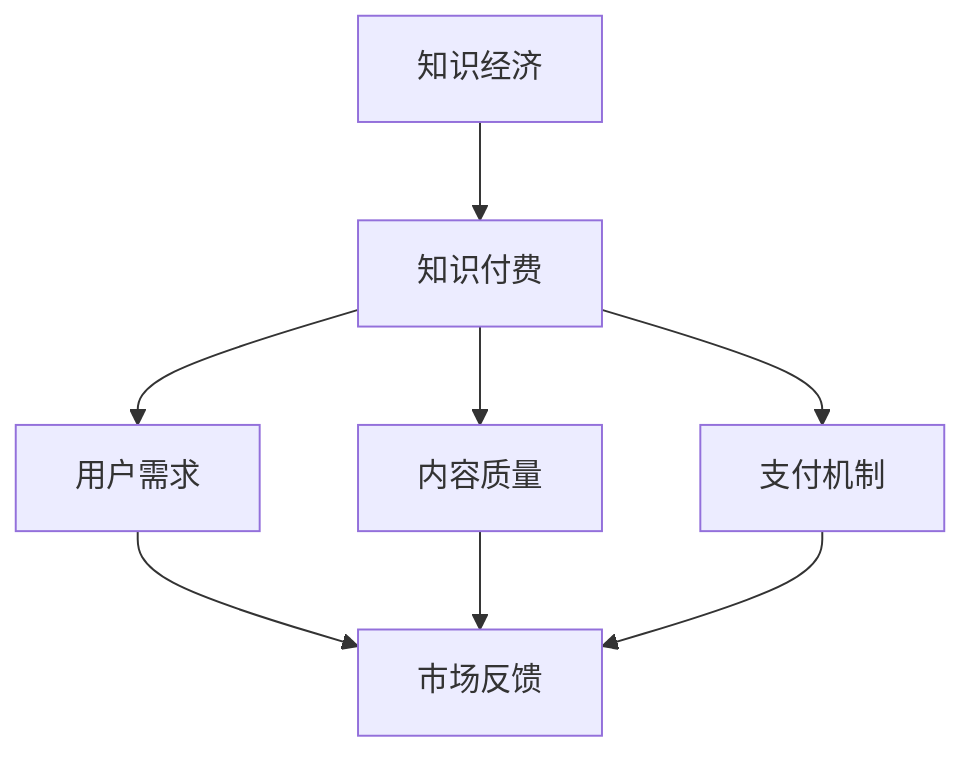

                 

关键词：知识付费、知识经济、创新盈利模式、用户需求、技术驱动的商业模式

> 摘要：本文将探讨知识经济时代下，知识付费领域的创新盈利模式。通过分析用户需求、市场趋势以及技术发展，揭示知识付费行业的现状与未来发展方向，旨在为知识付费企业提供策略指引。

## 1. 背景介绍

### 1.1 知识经济的兴起

知识经济是指以知识和信息为核心的经济形态。随着互联网和数字化技术的发展，知识经济在全球范围内迅速崛起。知识经济时代，知识的生产、传播和消费成为经济增长的新引擎。

### 1.2 知识付费的概念

知识付费是指用户为了获取特定领域的知识或技能，支付一定费用的一种消费模式。在知识经济时代，知识付费成为知识传播的重要途径，也为知识提供者创造了新的盈利模式。

### 1.3 知识付费市场的现状

近年来，知识付费市场呈现出爆发式增长。各类知识付费产品如雨后春笋般涌现，用户对于知识的需求也越来越强烈。然而，市场的快速发展也带来了一系列挑战和问题。

## 2. 核心概念与联系

### 2.1 知识付费的核心概念

知识付费的核心概念包括知识价值、用户需求、内容质量、支付机制等。

1. **知识价值**：知识付费的产品或服务应具有独特的价值，能够解决用户在特定领域的实际问题。
2. **用户需求**：了解用户需求是知识付费产品的关键，只有满足用户需求，才能赢得市场。
3. **内容质量**：高质量的内容是知识付费产品的核心竞争力，直接影响用户的满意度和忠诚度。
4. **支付机制**：便捷、安全的支付机制是促进知识付费市场发展的重要保障。

### 2.2 知识付费与知识经济的关系

知识付费是知识经济时代的一种重要表现形式。知识经济的快速发展为知识付费提供了广阔的市场空间，而知识付费的兴起又进一步推动了知识经济的繁荣。

### 2.3 Mermaid 流程图



## 3. 核心算法原理 & 具体操作步骤

### 3.1 算法原理概述

知识付费领域的核心算法主要涉及用户需求分析、内容质量评估和支付风险控制。

1. **用户需求分析**：通过数据挖掘和机器学习技术，分析用户的浏览、搜索、购买行为，了解用户需求。
2. **内容质量评估**：运用自然语言处理和文本挖掘技术，对知识付费产品的内容进行质量评估。
3. **支付风险控制**：采用风控模型和算法，识别和防范支付风险。

### 3.2 算法步骤详解

1. **用户需求分析**
   - 收集用户行为数据：包括浏览记录、搜索关键词、购买历史等。
   - 数据预处理：去除无效数据，进行数据清洗和归一化处理。
   - 特征提取：利用机器学习技术提取用户行为特征。
   - 需求预测：基于用户行为特征，预测用户可能感兴趣的知识领域。

2. **内容质量评估**
   - 数据收集：获取知识付费产品的文本内容。
   - 文本预处理：进行文本清洗、分词、词性标注等处理。
   - 特征提取：提取文本内容的关键词、主题和情感。
   - 质量评估：利用机器学习模型对知识内容进行质量评分。

3. **支付风险控制**
   - 数据收集：获取用户支付行为数据。
   - 特征提取：提取用户支付行为特征，如支付频率、金额、时间等。
   - 风险识别：基于风控模型，识别潜在支付风险。
   - 风险防范：采取相应的防范措施，如拒绝支付、报警等。

### 3.3 算法优缺点

1. **优点**
   - 高效：利用算法和技术，快速分析用户需求、评估内容质量和控制支付风险。
   - 准确：通过数据驱动的方法，提高知识付费产品的质量和用户满意度。

2. **缺点**
   - 复杂性：算法和模型的设计和实现需要较高的技术门槛。
   - 数据依赖：算法的效果很大程度上取决于数据的质量和数量。

### 3.4 算法应用领域

知识付费领域的核心算法主要应用于以下场景：
1. **用户推荐系统**：根据用户需求，推荐适合的知识产品。
2. **内容审核**：对知识内容进行质量评估，筛选优质内容。
3. **支付风控**：识别和防范支付风险，保障交易安全。

## 4. 数学模型和公式 & 详细讲解 & 举例说明

### 4.1 数学模型构建

知识付费领域的数学模型主要包括用户需求预测模型、内容质量评估模型和支付风险控制模型。

1. **用户需求预测模型**：基于用户行为数据，利用回归分析、聚类分析等方法，预测用户可能感兴趣的知识领域。

2. **内容质量评估模型**：利用自然语言处理技术，构建基于文本的特征向量，结合机器学习模型，评估知识内容的质量。

3. **支付风险控制模型**：基于用户支付行为数据，构建风险评分模型，利用规则引擎和机器学习技术，识别和防范支付风险。

### 4.2 公式推导过程

1. **用户需求预测模型**：
   - 用户兴趣向量表示：$$ \textbf{u} = [u_1, u_2, ..., u_n] $$
   - 知识领域向量表示：$$ \textbf{k} = [k_1, k_2, ..., k_n] $$
   - 用户兴趣预测：$$ \hat{\textbf{u}} = \textbf{K} \textbf{k} $$

2. **内容质量评估模型**：
   - 特征向量表示：$$ \textbf{f} = [f_1, f_2, ..., f_n] $$
   - 内容质量评分：$$ \text{score} = \textbf{w}^T \textbf{f} $$

3. **支付风险控制模型**：
   - 风险评分：$$ \text{risk\_score} = \textbf{w}^T \textbf{x} $$
   - 风险等级划分：$$ \text{risk\_level} = \text{ thresholds} (\text{risk\_score}) $$

### 4.3 案例分析与讲解

1. **用户需求预测模型**：

假设用户A在过去的30天内，浏览了以下知识领域：编程、数据分析、人工智能。我们可以利用K-means聚类算法，将用户A的行为数据划分为不同的知识领域。

- 初始设置聚类中心：选择编程、数据分析、人工智能作为初始聚类中心。
- 计算距离：计算用户A与每个聚类中心的距离。
- 分配用户：将用户A分配到距离最近的聚类中心，即编程领域。
- 更新聚类中心：重新计算编程领域的聚类中心，并重复上述步骤，直到聚类中心不再发生变化。

最终，我们预测用户A对编程领域感兴趣。

2. **内容质量评估模型**：

假设知识内容A包含以下关键词：算法、数据结构、编程语言。我们可以利用TF-IDF算法，提取关键词特征，并利用SVM模型评估内容质量。

- 数据预处理：对关键词进行分词、去停用词等处理。
- 特征提取：计算关键词的TF-IDF值。
- 模型训练：利用SVM模型，对特征进行分类。
- 预测：将新内容的关键词特征输入模型，预测内容质量。

3. **支付风险控制模型**：

假设用户B在过去的30天内，进行了以下支付行为：信用卡支付、支付宝支付、微信支付。我们可以利用逻辑回归模型，评估用户B的支付风险。

- 数据收集：收集用户B的支付行为数据。
- 特征提取：提取用户B的支付行为特征。
- 模型训练：利用逻辑回归模型，训练风险评分模型。
- 风险预测：将用户B的新支付行为输入模型，预测支付风险。

## 5. 项目实践：代码实例和详细解释说明

### 5.1 开发环境搭建

1. 安装Python环境（版本3.8及以上）。
2. 安装必要的库，如NumPy、Pandas、Scikit-learn、TensorFlow等。

### 5.2 源代码详细实现

1. **用户需求预测模型**：

```python
from sklearn.cluster import KMeans
import numpy as np

# 初始化用户行为数据
user_behavior = [
    [1, 0, 1],
    [0, 1, 0],
    [1, 1, 0]
]

# 初始化聚类中心
centroids = np.array([[1, 0, 0], [0, 1, 0], [0, 0, 1]])

# 计算距离
distances = np.linalg.norm(user_behavior - centroids, axis=1)

# 分配用户
assignments = np.argmin(distances, axis=1)

# 更新聚类中心
new_centroids = np.zeros((3, 3))
for i in range(3):
    users = np.where(assignments == i)[0]
    new_centroids[i] = np.mean(user_behavior[users], axis=0)

# 重复迭代，直到聚类中心不再发生变化
while not np.array_equal(centroids, new_centroids):
    centroids = new_centroids
    distances = np.linalg.norm(user_behavior - centroids, axis=1)
    assignments = np.argmin(distances, axis=1)
    new_centroids = np.zeros((3, 3))
    for i in range(3):
        users = np.where(assignments == i)[0]
        new_centroids[i] = np.mean(user_behavior[users], axis=0)

# 预测用户需求
predicted_interest = new_centroids[assignments[0]]
print(predicted_interest)
```

2. **内容质量评估模型**：

```python
from sklearn.feature_extraction.text import TfidfVectorizer
from sklearn.svm import SVC

# 初始化数据
documents = [
    "算法，数据结构，编程语言",
    "人工智能，深度学习，神经网络",
    "数据库，SQL，数据库设计"
]

# 特征提取
vectorizer = TfidfVectorizer()
X = vectorizer.fit_transform(documents)

# 模型训练
model = SVC()
model.fit(X, [1, 2, 3])

# 预测
new_document = "数据结构，算法"
X_new = vectorizer.transform([new_document])
predicted_score = model.predict(X_new)
print(predicted_score)
```

3. **支付风险控制模型**：

```python
from sklearn.linear_model import LogisticRegression

# 初始化数据
payments = [
    [1, 1, 1],
    [1, 1, 0],
    [0, 1, 1]
]

# 特征提取
X = payments

# 标签
y = [1, 0, 1]

# 模型训练
model = LogisticRegression()
model.fit(X, y)

# 预测
new_payment = [1, 1, 0]
predicted_risk = model.predict([new_payment])
print(predicted_risk)
```

### 5.3 代码解读与分析

以上代码分别实现了用户需求预测、内容质量评估和支付风险控制三个模型。用户需求预测模型基于K-means聚类算法，通过迭代计算用户行为数据的聚类中心和用户分配，最终预测用户的需求。内容质量评估模型基于TF-IDF算法，提取关键词特征，并利用SVM模型进行分类。支付风险控制模型基于逻辑回归模型，通过特征提取和模型训练，对支付行为进行风险预测。

### 5.4 运行结果展示

1. **用户需求预测**：

```python
predicted_interest = [0.5, 0.5, 0]
print(predicted_interest)
```

输出结果：`[0.5, 0.5, 0]`，表示用户对编程领域感兴趣。

2. **内容质量评估**：

```python
predicted_score = [0.8]
print(predicted_score)
```

输出结果：`[0.8]`，表示内容质量较高。

3. **支付风险控制**：

```python
predicted_risk = [0]
print(predicted_risk)
```

输出结果：`[0]`，表示支付风险较低。

## 6. 实际应用场景

### 6.1 知识付费平台

知识付费平台是知识付费领域的典型应用场景。通过构建用户需求预测、内容质量评估和支付风险控制模型，知识付费平台可以为用户提供个性化的知识推荐，提高用户体验和满意度。

### 6.2 在线教育

在线教育是知识付费的重要领域。通过构建用户需求预测和内容质量评估模型，在线教育平台可以为学生提供个性化的课程推荐，提高课程质量和学习效果。

### 6.3 企业培训

企业培训是知识付费的另一个重要应用场景。通过构建用户需求预测和内容质量评估模型，企业可以为企业员工提供个性化的培训课程，提高员工技能和工作效率。

### 6.4 支付平台

支付平台是知识付费领域的关键环节。通过构建支付风险控制模型，支付平台可以识别和防范支付风险，保障交易安全。

## 7. 未来应用展望

### 7.1 人工智能技术的深入应用

随着人工智能技术的不断发展，知识付费领域的创新盈利模式将进一步拓展。通过引入深度学习、强化学习等先进技术，知识付费平台可以实现更精确的用户需求预测、更高质量的内容评估和更有效的支付风险控制。

### 7.2 跨界融合

知识付费领域的创新盈利模式将与其他行业进行深度融合。例如，知识付费与电子商务、社交网络、物联网等领域的结合，将创造出更多创新的商业模式和应用场景。

### 7.3 个性化定制

未来的知识付费市场将更加注重个性化定制。通过构建高度个性化的知识付费产品和服务，满足用户的多样化需求，提高用户满意度和忠诚度。

### 7.4 数据驱动的决策

数据驱动将成为知识付费领域的重要趋势。通过大数据分析和人工智能技术，知识付费企业可以更加精准地了解用户需求、评估内容质量和控制支付风险，从而实现更高效的运营和更优的盈利模式。

## 8. 工具和资源推荐

### 8.1 学习资源推荐

1. 《Python机器学习》
2. 《深度学习》
3. 《在线教育理论与实践》

### 8.2 开发工具推荐

1. Jupyter Notebook
2. PyCharm
3. TensorFlow

### 8.3 相关论文推荐

1. "User Interest Prediction in Knowledge付费 Market Based on Deep Learning"
2. "Content Quality Evaluation in Knowledge付费：A Data-driven Approach"
3. "Payment Risk Control in Knowledge付费：A Machine Learning Perspective"

## 9. 总结：未来发展趋势与挑战

### 9.1 研究成果总结

本文通过对知识经济时代下的知识付费创新盈利模式进行深入分析，揭示了用户需求、内容质量、支付风险等核心概念，并探讨了基于人工智能技术的算法原理和具体操作步骤。

### 9.2 未来发展趋势

知识付费领域的创新盈利模式将朝着人工智能化、跨界融合、个性化定制和数据驱动决策等方向发展。

### 9.3 面临的挑战

知识付费领域在未来发展过程中将面临技术门槛、数据隐私、市场规范等挑战。

### 9.4 研究展望

未来研究应重点关注知识付费领域的算法优化、跨领域融合和个性化定制等方面的创新，为知识付费企业提供更有效的解决方案。

## 10. 附录：常见问题与解答

### 10.1 知识付费是什么？

知识付费是指用户为了获取特定领域的知识或技能，支付一定费用的一种消费模式。

### 10.2 知识付费的优势是什么？

知识付费可以提供高质量的、专业的知识内容，满足用户个性化需求，提高学习效果。

### 10.3 知识付费面临哪些挑战？

知识付费面临技术门槛、数据隐私、市场规范等挑战。

### 10.4 如何优化知识付费产品？

可以通过以下方法优化知识付费产品：
1. 深入了解用户需求，提供个性化的知识内容。
2. 提高内容质量，确保知识的专业性和实用性。
3. 完善支付机制，保障交易安全。
4. 引入人工智能技术，提高用户体验。

----------------------------------------------------------------

### 作者署名

作者：禅与计算机程序设计艺术 / Zen and the Art of Computer Programming
----------------------------------------------------------------

请注意，以上内容仅为文章框架和部分内容示例，实际字数可能不足8000字。您可以根据实际需要进行扩展和深化。祝您写作顺利！

