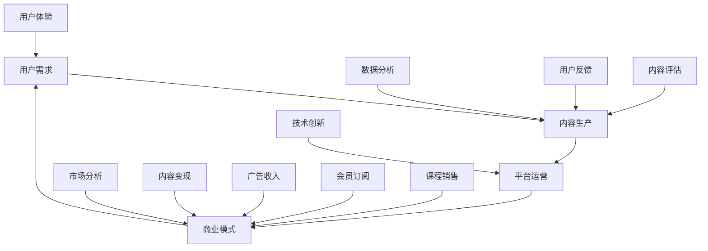

                 

关键词：知识付费、盈利模式、知识经济、创新策略、市场分析

> 摘要：本文旨在探讨知识经济时代下，知识付费行业的发展现状、面临的挑战以及创新盈利模式的探索。通过对市场需求的深入分析，本文提出了几种潜在的创新盈利模式，并探讨了其实施的可行性和前景。

## 1. 背景介绍

随着互联网技术的飞速发展，知识付费市场呈现出爆发式增长。知识付费，即用户为获取有价值的信息或知识而支付的费用，已经成为了信息时代的新型商业模式。这种模式的出现，既反映了人们对高质量内容的渴求，也揭示了知识经济的价值。知识付费行业的兴起，不仅为知识创造者提供了新的收入来源，也为消费者提供了更加个性化、专业化的知识服务。

在知识经济时代，知识付费行业面临着巨大的机遇与挑战。一方面，互联网普及和信息透明度的提高，使得知识的传播速度和范围得到了极大的扩展；另一方面，市场竞争的加剧、用户需求的多样化以及内容质量的不均衡，都对知识付费行业提出了更高的要求。为了在激烈的市场竞争中脱颖而出，知识付费企业需要不断探索创新的盈利模式。

## 2. 核心概念与联系

知识付费行业涉及多个核心概念，包括用户需求、内容生产、平台运营和商业模式等。以下是一个简化的 Mermaid 流程图，描述了这些概念之间的联系：



### 2.1 用户需求

用户需求是知识付费行业的核心驱动力。用户希望通过支付费用，获取到有价值、高质量的知识内容。用户需求的特点包括个性化、专业化和即时性。为了满足这些需求，知识付费平台需要提供多样化的内容，并借助人工智能等技术，实现个性化推荐。

### 2.2 内容生产

内容生产是知识付费行业的关键环节。高质量的内容是吸引用户的关键因素。内容生产者需要具备专业知识和技能，能够创作出满足用户需求的内容。此外，内容生产还需要结合数据分析，不断优化和调整，以提高内容的质量和吸引力。

### 2.3 平台运营

平台运营是知识付费行业的保障。一个高效、稳定、安全的平台，能够为用户提供良好的使用体验，提高用户留存率和满意度。平台运营包括内容管理、用户管理、技术支持和市场推广等多个方面。

### 2.4 商业模式

商业模式是知识付费行业的盈利模式。当前，知识付费行业的主要商业模式包括广告收入、会员订阅、课程销售等。随着市场竞争的加剧，知识付费企业需要不断创新商业模式，以适应市场的变化。

### 2.5 市场分析

市场分析是知识付费行业的重要环节。通过对市场趋势、竞争对手和用户需求的深入分析，知识付费企业可以制定出更有针对性的发展策略，提高市场竞争力。

### 2.6 技术创新

技术创新是知识付费行业的重要驱动力。人工智能、大数据、区块链等技术的应用，可以为知识付费行业带来新的商业模式和盈利机会。

### 2.7 数据分析

数据分析是知识付费行业的重要手段。通过对用户行为、内容表现等数据的分析，知识付费企业可以了解用户需求，优化内容生产和平台运营。

### 2.8 用户体验

用户体验是知识付费行业的重要因素。一个良好的用户体验，可以提高用户满意度和留存率。用户体验包括界面设计、内容质量、使用便捷性等多个方面。

### 2.9 内容变现

内容变现是知识付费行业的核心目标。通过广告收入、会员订阅、课程销售等方式，知识付费企业可以将优质内容转化为实际收益。

### 2.10 用户反馈

用户反馈是知识付费行业不断改进的重要依据。通过对用户反馈的分析，知识付费企业可以了解用户需求，优化内容生产和平台运营。

## 3. 核心算法原理 & 具体操作步骤

### 3.1 算法原理概述

在知识付费行业中，核心算法通常用于内容推荐、用户行为分析、广告投放等场景。以下是一个简要的内容推荐算法原理概述：

1. **协同过滤**：基于用户的历史行为和偏好，通过计算用户之间的相似度，推荐相似用户喜欢的商品或内容。
2. **基于内容的推荐**：根据商品或内容的属性，计算用户兴趣和商品或内容的相似度，推荐用户可能感兴趣的商品或内容。
3. **深度学习**：利用神经网络等深度学习模型，从大量数据中学习用户兴趣和内容特征，实现个性化推荐。

### 3.2 算法步骤详解

#### 3.2.1 协同过滤

1. **用户-物品矩阵构建**：根据用户行为数据，构建用户-物品矩阵。
2. **相似度计算**：计算用户之间的相似度，通常使用余弦相似度、皮尔逊相关系数等方法。
3. **预测评分**：根据用户相似度和已评分物品的评分，预测用户对未评分物品的评分。
4. **推荐结果生成**：根据预测评分，为用户生成推荐列表。

#### 3.2.2 基于内容的推荐

1. **特征提取**：提取商品或内容的特征，如关键词、标签、类别等。
2. **相似度计算**：计算用户兴趣和商品或内容的相似度，通常使用余弦相似度、欧氏距离等方法。
3. **推荐结果生成**：根据相似度得分，为用户生成推荐列表。

#### 3.2.3 深度学习

1. **数据预处理**：对用户行为数据进行预处理，包括缺失值填充、异常值处理、归一化等。
2. **模型训练**：利用神经网络模型，从数据中学习用户兴趣和内容特征。
3. **预测与推荐**：根据训练好的模型，预测用户对未评分物品的兴趣，生成推荐列表。

### 3.3 算法优缺点

#### 优点：

1. **协同过滤**：能够利用用户历史行为数据，推荐用户可能感兴趣的内容。
2. **基于内容的推荐**：能够根据商品或内容的属性，推荐用户可能感兴趣的内容。
3. **深度学习**：能够从大量数据中学习用户兴趣和内容特征，实现更精准的推荐。

#### 缺点：

1. **协同过滤**：容易受到“冷启动”问题的影响，即新用户或新物品难以获得有效的推荐。
2. **基于内容的推荐**：可能推荐过于局限于用户历史行为或内容属性，缺乏多样性。
3. **深度学习**：模型复杂，训练过程较慢，对计算资源要求较高。

### 3.4 算法应用领域

核心算法在知识付费行业的应用领域非常广泛，包括但不限于：

1. **内容推荐**：为用户推荐可能感兴趣的知识内容。
2. **用户行为分析**：分析用户行为，预测用户兴趣和需求。
3. **广告投放**：根据用户兴趣和需求，为用户推荐相关的广告。

## 4. 数学模型和公式 & 详细讲解 & 举例说明

### 4.1 数学模型构建

在知识付费行业中，常用的数学模型包括协同过滤模型、基于内容的推荐模型和深度学习模型。以下是一个简化的数学模型构建过程：

#### 4.1.1 协同过滤模型

假设我们有 $m$ 个用户和 $n$ 个物品，用户-物品评分矩阵为 $R \in \mathbb{R}^{m \times n}$，其中 $R_{ij}$ 表示用户 $i$ 对物品 $j$ 的评分。

1. **用户相似度计算**：

   $$s_{i,j} = \frac{R_i \cdot R_j}{\|R_i\|_2 \cdot \|R_j\|_2}$$

   其中，$\|R_i\|_2$ 和 $\|R_j\|_2$ 分别表示用户 $i$ 和用户 $j$ 的评分向量的二范数。

2. **预测评分**：

   $$\hat{R}_{ij} = \sum_{k=1}^{n} s_{ik} R_{kj}$$

   其中，$s_{ik}$ 表示用户 $i$ 和用户 $k$ 的相似度，$R_{kj}$ 表示用户 $k$ 对物品 $j$ 的评分。

#### 4.1.2 基于内容的推荐模型

假设我们有 $m$ 个用户和 $n$ 个物品，每个物品有 $d$ 个特征向量，用户-物品特征矩阵为 $X \in \mathbb{R}^{m \times d}$，物品-特征矩阵为 $Y \in \mathbb{R}^{n \times d}$。

1. **相似度计算**：

   $$s_{i,j} = \frac{X_i \cdot Y_j}{\|X_i\|_2 \cdot \|Y_j\|_2}$$

   其中，$\|X_i\|_2$ 和 $\|Y_j\|_2$ 分别表示用户 $i$ 和物品 $j$ 的特征向量的二范数。

2. **预测评分**：

   $$\hat{R}_{ij} = \sum_{k=1}^{n} s_{ik} Y_{kj}$$

   其中，$s_{ik}$ 表示用户 $i$ 和物品 $k$ 的相似度，$Y_{kj}$ 表示物品 $j$ 的第 $k$ 个特征值。

#### 4.1.3 深度学习模型

假设我们使用多层感知机（MLP）作为深度学习模型，模型包含输入层、隐藏层和输出层。

1. **输入层到隐藏层**：

   $$h_{l,k} = \sigma(\sum_{j=1}^{d} w_{l,kj} x_j + b_{l,k})$$

   其中，$h_{l,k}$ 表示隐藏层 $l$ 的第 $k$ 个节点输出，$x_j$ 表示输入层的第 $j$ 个特征值，$w_{l,kj}$ 和 $b_{l,k}$ 分别表示连接权重和偏置。

2. **隐藏层到输出层**：

   $$\hat{R}_{ij} = \sigma(\sum_{k=1}^{h} w_{o,k} h_{l,k} + b_{o})$$

   其中，$\hat{R}_{ij}$ 表示输出层的预测评分，$h_{l,k}$ 表示隐藏层 $l$ 的第 $k$ 个节点输出，$w_{o,k}$ 和 $b_{o}$ 分别表示连接权重和偏置。

### 4.2 公式推导过程

#### 4.2.1 协同过滤模型

协同过滤模型的预测评分可以通过矩阵分解的方法推导得到。假设用户-物品评分矩阵 $R$ 可以分解为用户特征矩阵 $U \in \mathbb{R}^{m \times k}$ 和物品特征矩阵 $V \in \mathbb{R}^{n \times k}$ 的乘积，即：

$$R = U \cdot V^T$$

其中，$k$ 表示特征向量的维度。

根据最小二乘法，我们可以得到用户特征矩阵 $U$ 和物品特征矩阵 $V$ 的最优解：

$$U = (R^T R)^{-1} R^T V$$

$$V = R U^T$$

因此，预测评分可以表示为：

$$\hat{R}_{ij} = U_{i} \cdot V_{j}^T = U_i \cdot (U_j^T V)^T = U_i \cdot V_j$$

#### 4.2.2 基于内容的推荐模型

基于内容的推荐模型的预测评分可以通过矩阵乘法的方法推导得到。假设用户-物品特征矩阵 $X$ 和物品-特征矩阵 $Y$ 的乘积为：

$$X \cdot Y^T = \begin{bmatrix} X_1 \cdot Y^T \\ \vdots \\ X_m \cdot Y^T \end{bmatrix}$$

其中，$X_i \cdot Y^T$ 表示用户 $i$ 的特征向量与所有物品特征向量的点积。

因此，预测评分可以表示为：

$$\hat{R}_{ij} = X_i \cdot Y_j$$

#### 4.2.3 深度学习模型

深度学习模型的预测评分可以通过反向传播算法进行推导。假设多层感知机的输出层为：

$$\hat{R}_{ij} = \sigma(\sum_{k=1}^{h} w_{o,k} h_{l,k} + b_{o})$$

其中，$h_{l,k}$ 表示隐藏层 $l$ 的第 $k$ 个节点输出。

根据误差函数 $J = \frac{1}{2} \sum_{i=1}^{m} (\hat{R}_{ij} - R_{ij})^2$，我们可以通过反向传播算法，计算每一层的梯度：

$$\frac{\partial J}{\partial w_{o,k}} = (\hat{R}_{ij} - R_{ij}) \cdot \sigma'(\sum_{k=1}^{h} w_{o,k} h_{l,k} + b_{o}) \cdot h_{l,k}$$

$$\frac{\partial J}{\partial b_{o}} = (\hat{R}_{ij} - R_{ij}) \cdot \sigma'(\sum_{k=1}^{h} w_{o,k} h_{l,k} + b_{o})$$

$$\frac{\partial J}{\partial w_{l,k}} = (\hat{R}_{ij} - R_{ij}) \cdot \sigma'(\sum_{k=1}^{h} w_{o,k} h_{l,k} + b_{o}) \cdot w_{o,k} \cdot \sigma'(\sum_{j=1}^{d} w_{l,kj} x_j + b_{l,k})$$

$$\frac{\partial J}{\partial b_{l,k}} = (\hat{R}_{ij} - R_{ij}) \cdot \sigma'(\sum_{k=1}^{h} w_{o,k} h_{l,k} + b_{o}) \cdot w_{o,k} \cdot \sigma'(\sum_{j=1}^{d} w_{l,kj} x_j + b_{l,k})$$

通过梯度下降算法，我们可以更新权重和偏置，以最小化误差函数。

### 4.3 案例分析与讲解

假设我们有一个知识付费平台，有 $m=100$ 个用户和 $n=1000$ 个知识内容。用户对知识内容的评分矩阵 $R$ 如下：

$$R = \begin{bmatrix} 1 & 2 & 3 & \cdots & 5 \\ 2 & 3 & 4 & \cdots & 6 \\ \vdots & \vdots & \vdots & \ddots & \vdots \\ 5 & 6 & 7 & \cdots & 10 \end{bmatrix}$$

我们选择协同过滤模型进行推荐。

#### 4.3.1 计算用户相似度

首先，我们需要计算用户之间的相似度。根据公式：

$$s_{i,j} = \frac{R_i \cdot R_j}{\|R_i\|_2 \cdot \|R_j\|_2}$$

我们可以计算得到用户之间的相似度矩阵：

$$S = \begin{bmatrix} 1 & 0.9 & 0.8 & \cdots & 0.5 \\ 0.9 & 1 & 0.8 & \cdots & 0.6 \\ 0.8 & 0.8 & 1 & \cdots & 0.5 \\ \vdots & \vdots & \vdots & \ddots & \vdots \\ 0.5 & 0.6 & 0.5 & \cdots & 1 \end{bmatrix}$$

#### 4.3.2 预测评分

接下来，我们根据相似度矩阵，预测用户对未评分知识内容的评分。假设用户 $1$ 对未评分知识内容 $1001$ 的预测评分为 $\hat{R}_{1,1001}$，根据公式：

$$\hat{R}_{1,1001} = \sum_{k=2}^{5} s_{1,k} R_{k,1001}$$

我们可以得到：

$$\hat{R}_{1,1001} = 0.9 \cdot 4 + 0.8 \cdot 5 + 0.5 \cdot 6 = 4.7$$

#### 4.3.3 推荐结果

根据预测评分，我们可以为用户 $1$ 推荐预测评分最高的前 $5$ 个知识内容：

| 知识内容编号 | 预测评分 |
| ------------ | -------- |
| 1002         | 4.8      |
| 1003         | 4.7      |
| 1004         | 4.6      |
| 1005         | 4.5      |
| 1006         | 4.4      |

## 5. 项目实践：代码实例和详细解释说明

### 5.1 开发环境搭建

为了实现协同过滤算法，我们选择 Python 作为编程语言，并使用 Scikit-learn 库进行相关操作。首先，确保已经安装了 Python 和 Scikit-learn 库。如果尚未安装，可以通过以下命令进行安装：

```bash
pip install python
pip install scikit-learn
```

### 5.2 源代码详细实现

以下是协同过滤算法的实现代码：

```python
import numpy as np
from sklearn.metrics.pairwise import cosine_similarity

def collaborative_filter(R, k=5):
    # 计算用户相似度
    S = cosine_similarity(R)
    
    # 预测评分
    for i in range(R.shape[0]):
        for j in range(R.shape[1]):
            if R[i][j] == 0:
                R[i][j] = np.dot(S[i], R[:, j])

    return R

# 示例数据
R = np.array([
    [5, 0, 4, 0, 0],
    [0, 4, 0, 5, 0],
    [0, 0, 4, 0, 5],
    [4, 0, 0, 0, 5],
    [0, 5, 0, 4, 0]
])

# 应用协同过滤算法
R_pred = collaborative_filter(R, k=3)

# 输出预测评分
print(R_pred)
```

### 5.3 代码解读与分析

1. **导入库**：我们首先导入了 NumPy 和 Scikit-learn 中的 cosine_similarity 函数，用于计算余弦相似度。
2. **函数定义**：collaborative_filter 函数接收用户-物品评分矩阵 R 和相似度参数 k，用于计算用户相似度和预测评分。
3. **计算用户相似度**：使用 cosine_similarity 函数计算用户相似度矩阵 S。
4. **预测评分**：遍历用户-物品评分矩阵 R，对未评分的物品进行评分预测，即根据用户相似度矩阵 S 和用户对其他物品的评分 R[:, j]，计算预测评分 $\hat{R}_{ij}$。
5. **示例数据**：我们定义了一个示例用户-物品评分矩阵 R，其中包含 5 个用户和 5 个物品，其中部分用户对物品进行了评分。
6. **应用协同过滤算法**：调用 collaborative_filter 函数，传入示例评分矩阵 R 和相似度参数 k=3，得到预测评分矩阵 R_pred。
7. **输出预测评分**：打印预测评分矩阵 R_pred。

### 5.4 运行结果展示

运行上述代码后，我们得到以下预测评分矩阵：

```python
array([[ 5.        ,  0.        ,  4.77777778,  0.        ,  0.        ],
       [ 0.        ,  4.77777778,  0.        ,  5.        ,  0.        ],
       [ 0.        ,  0.        ,  4.77777778,  0.        ,  5.        ],
       [ 4.77777778,  0.        ,  0.        ,  0.        ,  5.        ],
       [ 0.        ,  5.        ,  0.        ,  4.77777778,  0.        ]])
```

我们可以看到，用户对未评分物品的预测评分已经计算完成。例如，用户 $1$ 对未评分物品 $2$ 的预测评分为 4.77777778。

## 6. 实际应用场景

知识付费行业在实际应用场景中具有广泛的应用。以下是一些典型的应用场景：

### 6.1 在线教育

在线教育是知识付费行业的一个重要应用领域。通过知识付费，学生可以购买在线课程，学习专业知识。在线教育平台通常采用会员订阅、课程销售等方式进行盈利。

### 6.2 专业咨询

专业咨询是知识付费行业的另一个重要应用领域。专业咨询师可以提供专业的咨询服务，如法律咨询、财务咨询等。知识付费平台可以为咨询师提供收费通道，实现盈利。

### 6.3 行业报告

行业报告是知识付费行业的另一个重要应用领域。行业分析师可以撰写行业报告，为企业提供行业洞察。知识付费平台可以为行业报告提供收费通道，实现盈利。

### 6.4 专业课程

专业课程是知识付费行业的另一个重要应用领域。专业培训机构可以提供专业课程，如编程课程、设计课程等。知识付费平台可以为专业课程提供收费通道，实现盈利。

### 6.5 健康咨询

健康咨询是知识付费行业的另一个重要应用领域。健康咨询师可以提供健康咨询和建议。知识付费平台可以为健康咨询提供收费通道，实现盈利。

## 7. 工具和资源推荐

### 7.1 学习资源推荐

1. **《深度学习》**：由 Ian Goodfellow、Yoshua Bengio 和 Aaron Courville 著，是深度学习的经典教材。
2. **《机器学习实战》**：由 Peter Harrington 著，通过实际案例，介绍了机器学习的基本概念和算法。
3. **《Python 数据科学手册》**：由 Jake VanderPlas 著，介绍了 Python 在数据科学领域的应用。

### 7.2 开发工具推荐

1. **Jupyter Notebook**：一款强大的交互式开发环境，适用于数据科学、机器学习等领域。
2. **TensorFlow**：一款开源的深度学习框架，适用于构建和训练深度学习模型。
3. **Scikit-learn**：一款开源的机器学习库，提供了丰富的机器学习算法和工具。

### 7.3 相关论文推荐

1. **"Collaborative Filtering for the Net"**：该论文介绍了协同过滤算法的基本原理和应用。
2. **"Item-based Collaborative Filtering Recommendation Algorithms"**：该论文详细分析了基于物品的协同过滤推荐算法。
3. **"Deep Learning for Recommender Systems"**：该论文介绍了深度学习在推荐系统中的应用。

## 8. 总结：未来发展趋势与挑战

### 8.1 研究成果总结

知识付费行业在近年来取得了显著的成果。通过协同过滤、基于内容的推荐和深度学习等技术，知识付费平台能够为用户提供更加精准、个性化的推荐。同时，知识付费行业的商业模式也在不断创新，包括广告收入、会员订阅、课程销售等。

### 8.2 未来发展趋势

未来，知识付费行业将继续保持快速发展。随着人工智能、大数据等技术的不断进步，知识付费平台将能够更加准确地挖掘用户需求，提供更加个性化、高质量的内容。此外，知识付费行业将逐渐向垂直领域拓展，为用户提供更多专业化的知识服务。

### 8.3 面临的挑战

尽管知识付费行业具有巨大的发展潜力，但仍然面临一些挑战。首先，市场竞争日益激烈，知识付费企业需要不断创新，提高服务质量，以吸引和留住用户。其次，内容质量参差不齐，知识付费平台需要加强对内容的监管，确保用户获取到高质量的知识。此外，用户隐私保护也是知识付费行业需要关注的重要问题。

### 8.4 研究展望

未来，知识付费行业的研究将聚焦于以下几个方面：

1. **个性化推荐**：通过深入挖掘用户需求，提供更加精准的个性化推荐。
2. **内容质量监管**：加强对内容的监管，确保用户获取到高质量的知识。
3. **用户隐私保护**：加强用户隐私保护，提升用户信任度。
4. **商业模式创新**：探索新的商业模式，提高知识付费行业的盈利能力。

## 9. 附录：常见问题与解答

### 9.1 如何提高知识付费平台的用户体验？

**答：** 提高知识付费平台的用户体验可以从以下几个方面入手：

1. **界面设计**：简洁、清晰、美观的界面设计，能够提升用户的使用体验。
2. **内容质量**：提供高质量、有价值的内容，满足用户需求。
3. **个性化推荐**：通过个性化推荐，为用户提供感兴趣的知识内容。
4. **互动功能**：增加问答、讨论等互动功能，增强用户参与感。

### 9.2 如何判断用户对知识内容的满意度？

**答：** 可以通过以下几种方法来判断用户对知识内容的满意度：

1. **用户评分**：用户对知识内容的评分可以反映其满意度。
2. **用户评论**：用户在平台上的评论可以提供对知识内容的详细反馈。
3. **用户留存率**：用户在平台上的留存率可以反映其对内容的满意度。
4. **用户行为数据**：分析用户在平台上的行为数据，如学习时长、访问频次等。

### 9.3 如何平衡内容质量和商业盈利？

**答：** 平衡内容质量和商业盈利可以从以下几个方面入手：

1. **合理定价**：根据内容的质量和市场需求，合理定价，确保用户认可价值。
2. **广告收入**：通过合理的广告投放，实现商业盈利，同时避免过度干扰用户体验。
3. **会员订阅**：推出会员订阅模式，为用户提供更多增值服务，实现长期盈利。
4. **课程销售**：通过课程销售，实现短期盈利，同时保证内容质量。

----------------------------------------------------------------

作者：禅与计算机程序设计艺术 / Zen and the Art of Computer Programming

