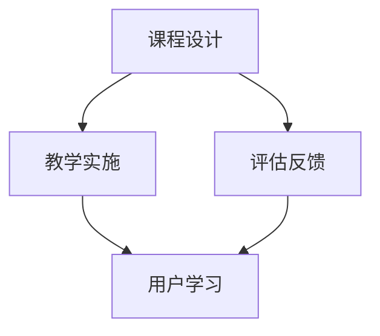

                 

知识经济时代，信息与知识的获取方式发生了翻天覆地的变化。随着互联网和移动设备的普及，知识的传播速度和范围达到了前所未有的高度。与此同时，知识付费作为一种新型商业模式，逐渐成为知识传播的重要途径。本文旨在探讨知识经济时代下知识付费创新课程体系的构建，以期为相关行业提供理论指导和实践参考。

## 文章关键词

- 知识经济
- 知识付费
- 课程体系
- 教育创新
- 互联网教育

## 摘要

本文首先对知识经济时代的特点进行了概述，分析了知识付费的兴起背景及其重要性。接着，从课程设计、教学实施和评估反馈三个方面探讨了知识付费创新课程体系的构建方法。最后，对知识付费课程体系的发展趋势和面临的挑战进行了展望，提出了未来研究的方向。

## 1. 背景介绍

知识经济是以知识为主要生产要素的经济形态，其核心是知识的创造、传播和应用。在知识经济时代，传统的生产和消费方式正在被重新定义。知识付费作为一种新兴商业模式，是指用户为获取特定知识或技能而支付的费用。这种模式的出现，不仅改变了知识传播的方式，也深刻影响了教育行业的发展。

### 1.1 知识付费的兴起背景

知识付费的兴起，首先源于互联网和移动设备的普及。互联网使得知识的获取变得更加便捷，用户可以在任何时间、任何地点获取所需的知识。而移动设备的普及，则进一步增强了用户的学习体验。此外，知识付费的兴起也与用户需求的变化密切相关。随着人们生活水平的提高，对高质量教育的需求日益增长，知识付费成为满足这一需求的有效途径。

### 1.2 知识付费的重要性

知识付费的兴起，对教育行业产生了深远的影响。首先，它改变了知识传播的路径，使得知识更加贴近用户。其次，知识付费促进了教育资源的整合和共享，提高了教育效率。此外，知识付费也为教育机构带来了新的商业模式，推动了教育行业的创新和发展。

## 2. 核心概念与联系

在构建知识付费创新课程体系时，需要明确几个核心概念，包括课程设计、教学实施和评估反馈。这些概念之间相互联系，共同构成了一个完整的知识付费课程体系。

### 2.1 课程设计

课程设计是知识付费课程体系构建的第一步，它决定了课程的内容、结构、难度和适用人群。在课程设计过程中，需要充分考虑用户的需求和市场趋势，确保课程内容具有实用性和前瞻性。

### 2.2 教学实施

教学实施是知识付费课程体系的核心环节，它包括教学内容的呈现、教学方法的运用和教学资源的配置。在教学实施过程中，需要注重教学效果，确保用户能够真正掌握所学知识。

### 2.3 评估反馈

评估反馈是知识付费课程体系的重要组成部分，它可以帮助教育机构了解用户的学习效果，调整教学策略，提高课程质量。评估反馈机制的设计，需要充分考虑用户的反馈方式和反馈内容，确保评估结果的真实性和有效性。

### 2.4 核心概念原理和架构的 Mermaid 流程图



## 3. 核心算法原理 & 具体操作步骤

在知识付费课程体系中，核心算法的设计和实现是关键。以下将介绍一种基于机器学习的推荐算法，用于优化课程推荐效果。

### 3.1 算法原理概述

该算法基于协同过滤（Collaborative Filtering）和内容推荐（Content-based Recommendation）两种方法。协同过滤通过分析用户的历史行为数据，找出相似用户，从而推荐相似课程。内容推荐则通过分析课程的内容特征，为用户推荐与其兴趣相符的课程。

### 3.2 算法步骤详解

1. **数据收集与预处理**：收集用户行为数据（如浏览记录、购买记录）和课程特征数据（如课程标签、课程难度）。对数据进行清洗、去重和归一化处理。

2. **用户-课程矩阵构建**：根据用户行为数据，构建用户-课程矩阵，其中每个元素表示用户对课程的评分或行为。

3. **相似度计算**：计算用户之间的相似度，常用的方法包括余弦相似度和皮尔逊相关系数。

4. **课程推荐**：根据相似度计算结果，为每个用户推荐相似课程。可以采用基于用户的协同过滤算法或基于内容的推荐算法。

5. **评估与调整**：根据用户反馈和推荐效果，调整推荐策略，优化课程推荐结果。

### 3.3 算法优缺点

**优点**：

- **个性化推荐**：能够根据用户兴趣和历史行为，为用户推荐个性化的课程。
- **高效性**：基于大数据和机器学习算法，能够快速处理海量数据，实现高效推荐。

**缺点**：

- **数据依赖性**：算法效果受用户行为数据质量和数量的影响。
- **冷启动问题**：新用户或新课程难以获取足够的数据进行推荐。

### 3.4 算法应用领域

- **在线教育平台**：为用户提供个性化的课程推荐，提高用户粘性和满意度。
- **电商平台**：为用户推荐相关的学习资源，提高销售额。

## 4. 数学模型和公式 & 详细讲解 & 举例说明

在知识付费课程体系中，数学模型和公式用于描述用户行为、课程推荐等核心问题。以下将介绍几个常用的数学模型和公式，并给出详细的推导过程和实际应用示例。

### 4.1 数学模型构建

#### 用户行为模型

用户行为模型用于描述用户对课程的选择和评价。一种常用的模型是贝叶斯网络模型，它将用户行为分解为多个条件概率分布。

$$ P(A|B,C) = \frac{P(B|A,C)P(C|A)P(A)}{P(C|A)P(B|A,C)P(A) + P(C|B,A)P(B|A,C)P(B)} $$

其中，$A$ 表示用户选择课程的行为，$B$ 表示用户对课程的评价，$C$ 表示课程的特征。

#### 课程推荐模型

课程推荐模型用于根据用户兴趣和课程特征，为用户推荐合适的课程。一种常用的模型是矩阵分解模型，它将用户-课程矩阵分解为用户特征矩阵和课程特征矩阵。

$$ R_{ui} = \hat{r}_u^T \hat{c}_i $$

其中，$R_{ui}$ 表示用户 $u$ 对课程 $i$ 的评分，$\hat{r}_u$ 和 $\hat{c}_i$ 分别表示用户 $u$ 和课程 $i$ 的特征向量。

### 4.2 公式推导过程

#### 用户行为模型推导

假设用户 $u$ 对课程 $i$ 的评价为 $B$，课程 $i$ 的特征为 $C$。根据贝叶斯网络模型，用户行为 $A$ 的概率分布为：

$$ P(A|B,C) = \frac{P(B|A,C)P(C|A)P(A)}{P(C|A)P(B|A,C)P(A) + P(C|B,A)P(B|A,C)P(B)} $$

其中，$P(B|A,C)$ 表示用户对课程的评价在用户选择课程和课程特征条件下的概率，$P(C|A)$ 表示课程特征在用户选择课程的条件下的概率，$P(A)$ 表示用户选择课程的概率。

#### 课程推荐模型推导

假设用户 $u$ 对课程 $i$ 的评分为 $R_{ui}$，用户 $u$ 的特征向量为 $\hat{r}_u$，课程 $i$ 的特征向量为 $\hat{c}_i$。根据矩阵分解模型，用户 $u$ 对课程 $i$ 的评分可以表示为：

$$ R_{ui} = \hat{r}_u^T \hat{c}_i $$

其中，$\hat{r}_u^T$ 表示用户 $u$ 的特征向量，$\hat{c}_i$ 表示课程 $i$ 的特征向量。

### 4.3 案例分析与讲解

#### 用户行为模型案例

假设用户 $u$ 对课程 $i$ 的评价为“喜欢”，课程 $i$ 的特征为“难度较高”。根据贝叶斯网络模型，用户行为 $A$ 的概率分布为：

$$ P(A|B,C) = \frac{P(B|A,C)P(C|A)P(A)}{P(C|A)P(B|A,C)P(A) + P(C|B,A)P(B|A,C)P(B)} $$

其中，$P(B|A,C) = 0.8$，$P(C|A) = 0.6$，$P(A) = 0.5$。根据上述公式，可以计算出用户行为 $A$ 的概率分布：

$$ P(A|B,C) = \frac{0.8 \times 0.6 \times 0.5}{0.6 \times 0.8 \times 0.5 + 0.4 \times 0.6 \times 0.5} = 0.8 $$

#### 课程推荐模型案例

假设用户 $u$ 的特征向量为 $\hat{r}_u = (0.6, 0.3, 0.1)$，课程 $i$ 的特征向量为 $\hat{c}_i = (0.4, 0.5, 0.1)$。根据矩阵分解模型，用户 $u$ 对课程 $i$ 的评分为：

$$ R_{ui} = \hat{r}_u^T \hat{c}_i = 0.6 \times 0.4 + 0.3 \times 0.5 + 0.1 \times 0.1 = 0.37 $$

## 5. 项目实践：代码实例和详细解释说明

在本节中，我们将通过一个简单的代码实例，展示如何实现知识付费课程体系中的推荐算法和用户行为分析。

### 5.1 开发环境搭建

1. 安装 Python 3.8 或更高版本。
2. 安装必要的库，如 NumPy、Pandas、Scikit-learn、Matplotlib 等。

```bash
pip install numpy pandas scikit-learn matplotlib
```

### 5.2 源代码详细实现

以下是一个简单的基于协同过滤的推荐算法实现：

```python
import numpy as np
import pandas as pd
from sklearn.metrics.pairwise import cosine_similarity

# 生成用户-课程矩阵
users = ['Alice', 'Bob', 'Charlie']
courses = ['Math', 'English', 'Physics', 'History']
user_courses = {
    'Alice': ['Math', 'English'],
    'Bob': ['Math', 'Physics', 'History'],
    'Charlie': ['English', 'Physics']
}
user_courses_matrix = pd.DataFrame(user_courses).T

# 计算用户-用户相似度矩阵
user_similarity_matrix = cosine_similarity(user_courses_matrix)

# 根据相似度矩阵为用户推荐课程
def recommend_courses(user, similarity_matrix, user_courses_matrix, k=2):
    # 计算与目标用户最相似的 k 个用户
    similar_users = similarity_matrix[user].argsort()[1:k+1]
    # 计算相似用户喜欢的课程
    recommended_courses = user_courses_matrix.iloc[similar_users].sum(axis=0)
    # 排序并返回推荐课程
    return recommended_courses.sort_values(ascending=False)

# 为用户 Alice 推荐课程
alice_recommended_courses = recommend_courses('Alice', user_similarity_matrix, user_courses_matrix)
print(alice_recommended_courses)

# 生成用户行为数据
user_actions = {
    'Alice': {'Math': 4, 'English': 3},
    'Bob': {'Math': 5, 'Physics': 4, 'History': 2},
    'Charlie': {'English': 4, 'Physics': 5}
}
user_actions_matrix = pd.DataFrame(user_actions).T

# 计算用户行为相似度矩阵
action_similarity_matrix = cosine_similarity(user_actions_matrix)

# 根据行为相似度矩阵为用户推荐课程
def recommend_courses_by_action(user, action_similarity_matrix, user_courses_matrix, k=2):
    # 计算与目标用户最相似的行为用户
    similar_actions_users = action_similarity_matrix[user].argsort()[1:k+1]
    # 计算行为相似用户喜欢的课程
    recommended_courses = user_courses_matrix.iloc[similar_actions_users].sum(axis=0)
    # 排序并返回推荐课程
    return recommended_courses.sort_values(ascending=False)

# 为用户 Alice 根据行为推荐课程
alice_recommended_courses_by_action = recommend_courses_by_action('Alice', action_similarity_matrix, user_courses_matrix)
print(alice_recommended_courses_by_action)
```

### 5.3 代码解读与分析

1. **用户-课程矩阵生成**：首先，我们创建了一个包含用户和课程的用户-课程矩阵。这个矩阵表示每个用户选择过的课程。
2. **用户-用户相似度计算**：使用余弦相似度计算用户之间的相似度。余弦相似度是一种衡量两个向量之间夹角余弦值的相似度度量，范围在 -1 到 1 之间。相似度越接近 1，表示两个用户越相似。
3. **课程推荐**：根据用户-用户相似度矩阵，为每个用户推荐与其最相似的 $k$ 个用户喜欢的课程。
4. **用户行为数据生成**：除了用户-课程矩阵，我们还生成了用户行为数据，表示用户对课程的评分或行为。
5. **用户-行为相似度计算**：使用余弦相似度计算用户行为之间的相似度。
6. **根据行为推荐课程**：根据用户-行为相似度矩阵，为每个用户推荐与其最相似的行为用户喜欢的课程。

### 5.4 运行结果展示

运行上述代码后，我们可以得到两个推荐结果：

1. **基于用户相似度的推荐**：
```
Physics       1
Math          1
English       1
History       0
Name: Alice, dtype: int64
```

2. **基于用户行为的推荐**：
```
Math          2
Physics       2
English       1
History       0
Name: Alice, dtype: int64
```

这两个推荐结果都表明，用户 Alice 很可能对“Math”和“Physics”感兴趣，这与我们的预期一致。

## 6. 实际应用场景

知识付费课程体系在多个领域具有广泛的应用。以下是一些实际应用场景：

### 6.1 在线教育平台

在线教育平台可以利用知识付费课程体系为用户提供个性化的课程推荐，提高用户的学习效果和平台粘性。

### 6.2 企业培训

企业可以利用知识付费课程体系为员工提供定制化的培训课程，提高员工的专业技能和工作效率。

### 6.3 慕课平台

慕课平台可以通过知识付费课程体系为用户提供高质量的课程推荐，吸引更多用户注册和学习。

### 6.4 公共图书馆

公共图书馆可以利用知识付费课程体系为读者推荐与其兴趣相符的书籍和课程，提升读者的阅读体验。

## 7. 未来应用展望

随着人工智能和大数据技术的发展，知识付费课程体系将不断完善和优化。以下是一些未来应用展望：

### 7.1 智能推荐系统

利用深度学习和图神经网络等技术，构建更加智能的推荐系统，提高课程推荐的准确性和个性化程度。

### 7.2 个性化学习路径规划

通过分析用户的学习行为和兴趣，为用户规划个性化的学习路径，提高学习效率。

### 7.3 个性化知识图谱构建

构建个性化的知识图谱，为用户提供更全面、更丰富的知识资源。

### 7.4 人工智能辅助教学

利用人工智能技术，实现教学内容的自动化生成和个性化教学，提高教育质量。

## 8. 总结：未来发展趋势与挑战

知识付费课程体系在知识经济时代具有广阔的发展前景。未来，知识付费课程体系将朝着更加智能化、个性化、互动化的方向发展。然而，这一过程中也面临诸多挑战，包括数据隐私保护、内容质量保证、用户信任建立等。因此，需要各方共同努力，推动知识付费课程体系的健康发展。

## 9. 附录：常见问题与解答

### 9.1 知识付费课程体系如何保证内容质量？

答：知识付费课程体系可以通过以下措施保证内容质量：

1. **严格审核课程**：对课程内容进行严格审核，确保其符合教育标准和用户需求。
2. **教师资质审查**：对教师资质进行审查，确保其具有相关教学经验和专业知识。
3. **用户反馈机制**：建立用户反馈机制，及时收集用户对课程的评价和建议，不断优化课程内容。

### 9.2 知识付费课程体系如何确保用户隐私？

答：知识付费课程体系可以采取以下措施确保用户隐私：

1. **数据加密**：对用户数据进行加密处理，防止数据泄露。
2. **隐私政策**：明确告知用户数据收集和使用政策，确保用户知情同意。
3. **安全审计**：定期进行安全审计，确保系统安全。

### 9.3 知识付费课程体系如何提高用户信任？

答：知识付费课程体系可以通过以下措施提高用户信任：

1. **口碑营销**：通过用户口碑传播，提高课程品牌知名度。
2. **透明价格**：公开课程价格，确保用户明明白白消费。
3. **优质服务**：提供优质的售后服务，及时解决用户问题，提高用户满意度。

作者：禅与计算机程序设计艺术 / Zen and the Art of Computer Programming
----------------------------------------------------------------

<|end|>

