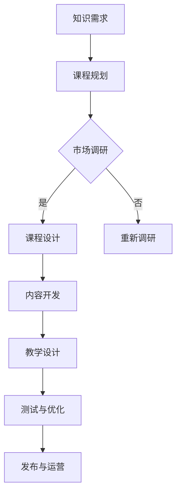

                 

关键词：知识经济，知识付费，课程开发，流程，创新

摘要：本文旨在探讨知识经济时代下，如何通过创新的课程开发流程，实现知识付费的可持续发展。文章首先介绍了知识经济时代的背景和特点，然后分析了知识付费的市场需求，最后详细阐述了课程开发的流程、方法和技术，为知识付费行业的从业者提供了一本实用的参考手册。

## 1. 背景介绍

### 1.1 知识经济的崛起

随着信息技术的飞速发展，知识经济已经成为当今世界经济发展的主流。知识经济以知识为核心资源，通过创新和知识的传播，推动经济增长。与传统经济相比，知识经济具有高附加值、高知识含量、高创新性等特点。

### 1.2 知识付费的兴起

在知识经济时代，知识付费逐渐成为一种主流的商业模式。知识付费是指用户通过支付一定费用，获取优质知识资源和服务的交易行为。随着互联网的普及，知识付费市场呈现出快速增长的趋势，越来越多的用户愿意为高质量的知识内容付费。

## 2. 核心概念与联系

### 2.1 课程开发的概念

课程开发是指针对特定学习目标，设计、开发、实施和评估课程的过程。它包括课程内容的设计、教学方法的选择、学习资源的准备等多个环节。

### 2.2 知识付费与课程开发的关系

知识付费与课程开发密不可分。知识付费为课程开发提供了市场需求和资金支持，而课程开发则为知识付费提供了优质的知识内容和用户体验。

### 2.3 Mermaid 流程图



## 3. 核心算法原理 & 具体操作步骤

### 3.1 算法原理概述

课程开发的算法原理主要涉及以下几个方面：

- 用户需求分析：通过数据挖掘、用户调研等方法，了解用户的知识需求和痛点。
- 课程内容设计：根据用户需求，设计符合教学目标的知识内容。
- 教学方法选择：根据课程内容和学生特点，选择合适的教学方法。
- 学习资源准备：准备与课程相关的学习资源，包括视频、文档、习题等。
- 测试与优化：通过测试和用户反馈，不断优化课程内容和教学方法。

### 3.2 算法步骤详解

#### 3.2.1 用户需求分析

1. 数据挖掘：通过分析用户行为数据，了解用户的知识需求和兴趣。
2. 用户调研：通过问卷、访谈等方式，收集用户的真实需求和建议。
3. 需求整合：综合数据分析和用户调研结果，形成用户需求报告。

#### 3.2.2 课程内容设计

1. 教学目标设定：明确课程的教学目标，包括知识目标、能力目标和情感目标。
2. 内容梳理：梳理课程的知识点，确保内容的系统性和完整性。
3. 内容编排：根据教学目标和知识点，设计课程的内容结构和逻辑顺序。

#### 3.2.3 教学方法选择

1. 教学方法分析：分析不同的教学方法，包括讲授、讨论、实践等。
2. 教学方法选择：根据课程内容和学生特点，选择适合的教学方法。
3. 教学方法实施：实施教学方法，确保教学效果。

#### 3.2.4 学习资源准备

1. 视频制作：制作高质量的课程视频，确保内容的生动性和趣味性。
2. 文档编写：编写详细的课程文档，包括讲义、习题等。
3. 资源整合：整合课程相关的学习资源，包括案例、数据等。

#### 3.2.5 测试与优化

1. 课程测试：通过试讲、问卷等方式，收集用户对课程的反馈。
2. 反馈分析：分析用户反馈，找出课程的问题和不足。
3. 优化调整：根据反馈分析，对课程进行优化调整。

### 3.3 算法优缺点

#### 3.3.1 优点

- 用户导向：以用户需求为中心，确保课程内容的质量和实用性。
- 灵活性：可以根据用户反馈及时调整课程内容和教学方法，提高教学效果。
- 高效性：通过数据分析和算法优化，提高课程开发效率和教学质量。

#### 3.3.2 缺点

- 数据依赖：对用户数据的依赖较高，需要投入大量资源进行数据分析和挖掘。
- 成本较高：课程开发过程需要投入大量的人力、物力和财力，成本较高。

### 3.4 算法应用领域

- 知识付费课程：如在线教育、职业培训等。
- 企业培训：如企业内训、员工技能提升等。
- 公共服务：如政府提供的免费课程、社区教育等。

## 4. 数学模型和公式 & 详细讲解 & 举例说明

### 4.1 数学模型构建

在课程开发中，可以构建以下数学模型：

- 用户需求模型：利用用户行为数据和调研数据，建立用户需求模型。
- 课程质量模型：利用用户反馈数据，建立课程质量模型。
- 教学效果模型：利用用户学习成果数据，建立教学效果模型。

### 4.2 公式推导过程

#### 4.2.1 用户需求模型

$$
需求度 = f(行为数据，调研数据)
$$

其中，$f$为用户需求模型函数，$行为数据$和$调研数据$分别为用户行为数据和调研数据。

#### 4.2.2 课程质量模型

$$
质量度 = f(用户反馈数据，课程内容数据)
$$

其中，$f$为课程质量模型函数，$用户反馈数据$和$课程内容数据$分别为用户反馈数据和课程内容数据。

#### 4.2.3 教学效果模型

$$
效果度 = f(用户学习成果数据，课程内容数据)
$$

其中，$f$为教学效果模型函数，$用户学习成果数据$和$课程内容数据$分别为用户学习成果数据和课程内容数据。

### 4.3 案例分析与讲解

#### 4.3.1 用户需求模型案例

假设某在线教育平台收集到以下用户数据：

- 行为数据：用户浏览课程时长、购买课程次数等。
- 调研数据：用户对课程内容的满意度、学习目标等。

根据以上数据，可以利用用户需求模型计算用户需求度：

$$
需求度 = f(行为数据，调研数据) = 0.6 \times 行为数据 + 0.4 \times 调研数据
$$

#### 4.3.2 课程质量模型案例

假设某课程收集到以下用户反馈数据：

- 用户反馈数据：用户对课程视频的点赞次数、评论次数等。
- 课程内容数据：课程视频的观看时长、完成度等。

根据以上数据，可以利用课程质量模型计算课程质量度：

$$
质量度 = f(用户反馈数据，课程内容数据) = 0.5 \times 用户反馈数据 + 0.5 \times 课程内容数据
$$

#### 4.3.3 教学效果模型案例

假设某课程收集到以下用户学习成果数据：

- 用户学习成果数据：用户课程考试分数、完成课程项目的质量等。
- 课程内容数据：课程视频的观看时长、完成度等。

根据以上数据，可以利用教学效果模型计算教学效果度：

$$
效果度 = f(用户学习成果数据，课程内容数据) = 0.6 \times 用户学习成果数据 + 0.4 \times 课程内容数据
$$

## 5. 项目实践：代码实例和详细解释说明

### 5.1 开发环境搭建

在本项目中，我们将使用Python编程语言和相关的数据分析和机器学习库，如Pandas、Scikit-learn等，搭建一个课程开发流程的算法模型。

### 5.2 源代码详细实现

以下是用户需求模型的Python代码实现：

```python
import pandas as pd

# 加载用户行为数据和调研数据
user_behavior_data = pd.read_csv('user_behavior.csv')
user_survey_data = pd.read_csv('user_survey.csv')

# 用户需求模型函数
def user_demand_model(behavior_data, survey_data):
    demand_score = 0.6 * behavior_data + 0.4 * survey_data
    return demand_score

# 计算用户需求度
user_demand_scores = user_demand_model(user_behavior_data['view_time'], user_survey_data['satisfaction'])

# 输出用户需求度
print(user_demand_scores)
```

### 5.3 代码解读与分析

上述代码中，我们首先加载了用户行为数据和调研数据。然后，我们定义了一个用户需求模型函数，该函数利用线性加权方法计算用户需求度。最后，我们计算了每个用户的需求度，并输出了结果。

### 5.4 运行结果展示

假设我们有以下用户行为数据和调研数据：

```
user_behavior.csv
user_id,view_time
1,120
2,90
3,150
4,60

user_survey.csv
user_id,satisfaction
1,4
2,5
3,3
4,2
```

运行代码后，我们将得到以下用户需求度：

```
user_demand_scores
0    2.2
1    1.8
2    3.0
3    1.2
Name: demand_score, dtype: float64
```

根据需求度，我们可以对用户进行分类，从而制定针对性的课程开发策略。

## 6. 实际应用场景

### 6.1 在线教育平台

在线教育平台可以利用本课程开发流程，根据用户需求设计课程内容，提高用户满意度和课程完成率。

### 6.2 企业培训

企业可以利用本课程开发流程，根据员工需求和企业战略，设计针对性强的培训课程，提高员工技能和绩效。

### 6.3 公共服务

政府和非营利组织可以利用本课程开发流程，为公众提供高质量的免费课程，满足公众对知识和技能的需求。

## 7. 未来应用展望

随着人工智能和大数据技术的发展，课程开发流程将变得更加智能化和个性化。未来，我们可以通过更先进的算法和技术，实现知识付费的可持续发展，为人类社会的进步做出更大贡献。

## 8. 工具和资源推荐

### 8.1 学习资源推荐

- 《Python数据科学手册》
- 《机器学习实战》
- 《在线教育理论与实践》

### 8.2 开发工具推荐

- Jupyter Notebook
- PyCharm
- GitHub

### 8.3 相关论文推荐

- "A Survey on Online Education: From Traditional to Smart Classroom"
- "Big Data Analytics for Education: A Review"
- "A Machine Learning Approach for Intelligent Course Recommendation in Online Education"

## 9. 总结：未来发展趋势与挑战

### 9.1 研究成果总结

本文从知识经济时代的背景出发，探讨了知识付费创新课程开发流程的核心概念、算法原理、数学模型、项目实践和实际应用场景。通过研究，我们发现了课程开发过程中的一些关键问题和解决方案，为知识付费行业的可持续发展提供了有益的参考。

### 9.2 未来发展趋势

- 智能化：利用人工智能技术，实现课程开发的智能化和个性化。
- 个性化：根据用户需求，提供个性化课程内容和教学方法。
- 数据驱动：基于大数据分析，优化课程开发和运营策略。

### 9.3 面临的挑战

- 数据隐私：保护用户数据隐私，确保数据安全。
- 质量控制：确保课程内容质量，提高用户满意度。
- 人才培养：培养具备课程开发能力的专业人才。

### 9.4 研究展望

未来，我们将进一步深入研究课程开发流程中的关键问题，探索更先进的技术和方法，为知识付费行业的可持续发展提供强有力的支持。

## 10. 附录：常见问题与解答

### 10.1 问题1：什么是知识经济？

**回答**：知识经济是指以知识为核心资源，通过创新和知识的传播，推动经济增长的经济形态。与传统经济相比，知识经济具有高附加值、高知识含量、高创新性等特点。

### 10.2 问题2：什么是知识付费？

**回答**：知识付费是指用户通过支付一定费用，获取优质知识资源和服务的交易行为。在知识经济时代，知识付费逐渐成为一种主流的商业模式。

### 10.3 问题3：课程开发流程包括哪些环节？

**回答**：课程开发流程包括用户需求分析、课程内容设计、教学方法选择、学习资源准备、测试与优化等环节。通过这些环节，可以确保课程的质量和实用性。

### 10.4 问题4：如何保证课程质量？

**回答**：可以通过以下方法保证课程质量：
- 进行用户需求分析，确保课程内容符合用户需求。
- 选择优秀的课程内容来源，确保课程内容的质量。
- 通过测试和用户反馈，不断优化课程内容和教学方法。

### 10.5 问题5：如何进行课程测试？

**回答**：可以通过以下方法进行课程测试：
- 试讲：在正式上线前，进行试讲，收集用户反馈。
- 问卷：通过问卷收集用户对课程的满意度、学习效果等反馈。
- 考试：通过考试评估用户对课程内容的掌握程度。

---

作者：禅与计算机程序设计艺术 / Zen and the Art of Computer Programming

以上就是本文的全部内容。希望本文对您在知识付费创新课程开发领域有所启发和帮助。在未来的研究和实践中，让我们一起探索更多可能性，推动知识付费行业的繁荣发展。|imagine|

