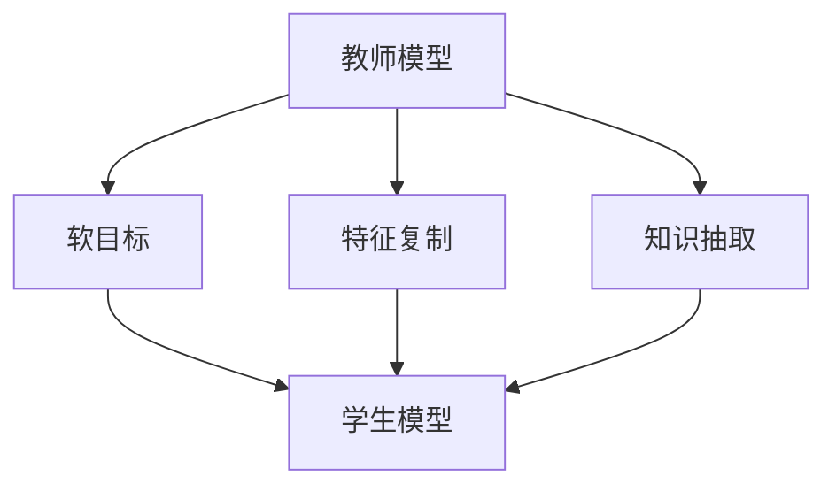

                 

关键词：知识蒸馏、信息提炼、核心算法、数学模型、应用场景、发展趋势、挑战与展望

> 摘要：知识蒸馏（Knowledge Distillation）是一种将复杂模型的知识传递给简单模型的技术，本文旨在详细介绍知识蒸馏的核心概念、算法原理、数学模型、应用场景以及未来发展趋势和面临的挑战。通过深入剖析知识蒸馏的各个方面，本文希望能够为读者提供一种全新的视角，以更好地理解和应用这一技术。

## 1. 背景介绍

在深度学习领域，随着模型的复杂度和参数量的不断增加，训练成本和计算资源的需求也显著上升。然而，在实际应用中，往往不需要如此复杂的模型，而是需要一个能够快速部署、资源消耗较小的轻量级模型。知识蒸馏正是为了解决这一问题而提出的一种技术。

知识蒸馏的基本思想是将一个复杂的“教师模型”的知识传递给一个简单的“学生模型”，使得学生模型能够在减少计算资源的同时保持良好的性能。这种技术不仅能够加速模型的部署，还能够提高模型的泛化能力。

### 1.1 研究意义

知识蒸馏具有重要的研究意义和实际应用价值：

1. **减少模型复杂度**：通过知识蒸馏，可以将复杂的模型简化为轻量级的模型，从而降低模型的计算复杂度和存储需求。
2. **加速模型部署**：轻量级模型能够更快地部署到各种设备上，尤其是在移动设备和物联网设备中具有重要意义。
3. **提高泛化能力**：知识蒸馏可以帮助学生模型学习到教师模型的泛化能力，从而提高模型的性能和稳定性。

### 1.2 研究现状

近年来，知识蒸馏在图像识别、自然语言处理、语音识别等领域取得了显著的成果。许多研究工作致力于优化知识蒸馏算法、提高知识传递的效率，以及探索新的应用场景。

## 2. 核心概念与联系

### 2.1 教师模型与学生模型

在知识蒸馏中，教师模型是一个复杂且性能优秀的模型，它具有丰富的知识。学生模型是一个相对简单的模型，它需要从教师模型中学习知识。


### 2.2 知识传递机制

知识蒸馏通过以下几种机制实现教师模型到学生模型的知识传递：

1. **软目标**：学生模型在训练过程中，将教师模型的输出作为软目标，以此来调整自己的预测。
2. **特征复制**：学生模型通过复制教师模型的中间层特征来学习教师模型的知识。
3. **知识抽取**：通过提取教师模型的中间层特征，将其转换为一种更为抽象的知识表示，然后传递给学生模型。

### 2.3 Mermaid 流程图



## 3. 核心算法原理 & 具体操作步骤

### 3.1 算法原理概述

知识蒸馏算法的核心思想是通过一系列技术手段，将教师模型的知识传递给学生模型。具体来说，教师模型和学生模型在相同的训练数据集上进行训练，但学生模型在训练过程中需要参考教师模型的输出，以此来调整自己的预测。

### 3.2 算法步骤详解

1. **数据预处理**：对训练数据集进行预处理，包括数据清洗、归一化等操作。
2. **模型初始化**：初始化教师模型和学生模型，通常教师模型的复杂度高于学生模型。
3. **训练教师模型**：在原始数据集上训练教师模型，使其达到较高的性能。
4. **知识蒸馏训练**：
    - **软目标生成**：根据教师模型的输出，生成软目标。
    - **学生模型训练**：使用软目标和学生模型进行训练，不断调整学生模型的参数。
5. **性能评估**：评估学生模型的性能，包括准确率、召回率等指标。

### 3.3 算法优缺点

#### 优点：

1. **减少模型复杂度**：通过知识蒸馏，可以将复杂的模型简化为轻量级模型。
2. **提高泛化能力**：知识蒸馏可以帮助学生模型学习到教师模型的泛化能力。

#### 缺点：

1. **训练成本较高**：知识蒸馏需要额外的计算资源来训练教师模型和学生模型。
2. **性能有限**：知识蒸馏并不能完全复制教师模型的所有知识，性能仍有一定的限制。

### 3.4 算法应用领域

知识蒸馏在多个领域取得了显著的应用成果，包括：

1. **图像识别**：通过知识蒸馏，可以将复杂的卷积神经网络简化为轻量级模型，用于移动设备和嵌入式系统。
2. **自然语言处理**：知识蒸馏可以帮助简化自然语言处理模型，提高模型的部署效率。
3. **语音识别**：知识蒸馏在语音识别领域也有广泛的应用，能够提高模型的准确率和稳定性。

## 4. 数学模型和公式 & 详细讲解 & 举例说明

### 4.1 数学模型构建

在知识蒸馏中，核心的数学模型包括损失函数和优化目标。

#### 损失函数

知识蒸馏的损失函数通常包括两部分：软目标损失和硬目标损失。

1. **软目标损失**：
   $$ L_{soft} = -\sum_{i=1}^{N} \sum_{j=1}^{C} y_{ij} \log(p_{ij}) $$
   其中，$y_{ij}$ 表示第 $i$ 个样本在第 $j$ 个类别的标签，$p_{ij}$ 表示学生模型对第 $i$ 个样本在第 $j$ 个类别的预测概率。

2. **硬目标损失**：
   $$ L_{hard} = -\sum_{i=1}^{N} y_{i} \log(p_{i}) $$
   其中，$y_{i}$ 表示第 $i$ 个样本的真实标签，$p_{i}$ 表示学生模型对第 $i$ 个样本的预测概率。

#### 优化目标

知识蒸馏的优化目标是通过调整学生模型的参数，使得软目标损失和硬目标损失之和最小。

$$ L = L_{soft} + L_{hard} $$

### 4.2 公式推导过程

#### 软目标损失推导

软目标损失是通过交叉熵损失函数来计算的，其目的是使得学生模型的预测概率接近教师模型的输出。

假设教师模型的输出为 $z = \{z_1, z_2, ..., z_C\}$，其中 $z_j$ 表示教师模型对第 $j$ 个类别的输出概率。学生模型的预测概率为 $p = \{p_1, p_2, ..., p_C\}$，其中 $p_j$ 表示学生模型对第 $j$ 个类别的预测概率。

交叉熵损失函数为：

$$ L_{soft} = -\sum_{i=1}^{N} \sum_{j=1}^{C} y_{ij} \log(p_{ij}) $$

其中，$y_{ij}$ 表示第 $i$ 个样本在第 $j$ 个类别的标签。

#### 硬目标损失推导

硬目标损失是通过分类损失函数来计算的，其目的是使得学生模型的预测结果尽可能接近真实标签。

假设学生模型的预测结果为 $p = \{p_1, p_2, ..., p_C\}$，其中 $p_j$ 表示学生模型对第 $j$ 个类别的预测概率。真实标签为 $y = \{y_1, y_2, ..., y_C\}$，其中 $y_j$ 表示第 $i$ 个样本的真实标签。

分类损失函数为：

$$ L_{hard} = -\sum_{i=1}^{N} y_{i} \log(p_{i}) $$

### 4.3 案例分析与讲解

假设有一个分类问题，数据集包含 100 个样本，每个样本有 10 个特征。教师模型是一个复杂的卷积神经网络，学生模型是一个简单的全连接神经网络。

1. **教师模型训练**：

   假设教师模型对每个样本的输出概率为 $z = \{0.1, 0.2, 0.3, 0.15, 0.05, 0.05, 0.05, 0.05, 0.05, 0.05\}$。

2. **学生模型训练**：

   假设学生模型对每个样本的输出概率为 $p = \{0.3, 0.3, 0.2, 0.1, 0.05, 0.05, 0.05, 0.05, 0.05, 0.05\}$。

   根据上述公式，计算软目标损失和硬目标损失：

   $$ L_{soft} = -\sum_{i=1}^{N} \sum_{j=1}^{C} y_{ij} \log(p_{ij}) = -100 \times (0.3 \times \log(0.3) + 0.3 \times \log(0.3) + 0.2 \times \log(0.2) + 0.1 \times \log(0.1) + 0.05 \times \log(0.05) + 0.05 \times \log(0.05) + 0.05 \times \log(0.05) + 0.05 \times \log(0.05) + 0.05 \times \log(0.05) + 0.05 \times \log(0.05)) $$
   $$ L_{hard} = -\sum_{i=1}^{N} y_{i} \log(p_{i}) = -100 \times (0.3 \times \log(0.3) + 0.2 \times \log(0.2) + 0.1 \times \log(0.1) + 0.05 \times \log(0.05) + 0.05 \times \log(0.05) + 0.05 \times \log(0.05) + 0.05 \times \log(0.05) + 0.05 \times \log(0.05) + 0.05 \times \log(0.05) + 0.05 \times \log(0.05)) $$

   将损失函数作为训练目标，通过优化算法（如梯度下降）不断调整学生模型的参数，使得损失函数值逐渐减小。

## 5. 项目实践：代码实例和详细解释说明

### 5.1 开发环境搭建

1. **Python环境**：

   安装 Python 3.8 或更高版本。

2. **深度学习框架**：

   安装 TensorFlow 2.x 或 PyTorch 1.x。

3. **依赖库**：

   安装 NumPy、Matplotlib 等常用库。

### 5.2 源代码详细实现

以下是一个简单的知识蒸馏示例，使用 TensorFlow 框架实现：

```python
import tensorflow as tf
import numpy as np
import matplotlib.pyplot as plt

# 数据预处理
def preprocess_data(data):
    # 数据清洗、归一化等操作
    return data

# 教师模型定义
def create_teacher_model():
    model = tf.keras.Sequential([
        tf.keras.layers.Dense(10, activation='softmax', input_shape=(10,))
    ])
    return model

# 学生模型定义
def create_student_model():
    model = tf.keras.Sequential([
        tf.keras.layers.Dense(10, activation='softmax', input_shape=(10,))
    ])
    return model

# 训练教师模型
def train_teacher_model(data):
    teacher_model = create_teacher_model()
    teacher_model.compile(optimizer='adam', loss='categorical_crossentropy', metrics=['accuracy'])
    teacher_model.fit(data['X'], data['y'], epochs=10, batch_size=10)
    return teacher_model

# 知识蒸馏训练
def train_student_model(teacher_model, student_model, data):
    teacher_output = teacher_model.predict(data['X'])
    student_model.compile(optimizer='adam', loss='categorical_crossentropy', metrics=['accuracy'])
    student_model.fit(data['X'], teacher_output, epochs=10, batch_size=10)
    return student_model

# 源代码详细解释说明
def main():
    # 加载数据集
    data = np.load('data.npy')

    # 预处理数据
    data = preprocess_data(data)

    # 创建教师模型和学生模型
    teacher_model = create_teacher_model()
    student_model = create_student_model()

    # 训练教师模型
    teacher_model = train_teacher_model(data)

    # 知识蒸馏训练学生模型
    student_model = train_student_model(teacher_model, student_model, data)

    # 性能评估
    test_data = np.load('test_data.npy')
    test_data = preprocess_data(test_data)
    student_output = student_model.predict(test_data['X'])
    accuracy = np.mean(np.argmax(student_output, axis=1) == np.argmax(test_data['y'], axis=1))
    print('Test accuracy:', accuracy)

if __name__ == '__main__':
    main()
```

### 5.3 代码解读与分析

1. **数据预处理**：

   数据预处理是深度学习项目的重要步骤，包括数据清洗、归一化等操作。在本例中，我们使用 `preprocess_data` 函数对数据进行预处理。

2. **教师模型定义**：

   教师模型是一个简单的全连接神经网络，包含一个 Dense 层，用于预测 10 个类别的概率。

3. **学生模型定义**：

   学生模型也是一个简单的全连接神经网络，与教师模型结构相同。

4. **训练教师模型**：

   使用 `train_teacher_model` 函数训练教师模型，使用 `compile` 函数设置优化器和损失函数，使用 `fit` 函数进行训练。

5. **知识蒸馏训练学生模型**：

   使用 `train_student_model` 函数进行知识蒸馏训练，通过教师模型的预测结果作为软目标来训练学生模型。

6. **性能评估**：

   在测试数据集上评估学生模型的性能，计算准确率。

## 6. 实际应用场景

知识蒸馏在多个领域取得了显著的应用成果，以下是其中几个实际应用场景：

1. **图像识别**：

   在图像识别领域，知识蒸馏可以将复杂的卷积神经网络简化为轻量级模型，从而提高模型的部署效率。例如，在移动设备和嵌入式系统中，可以使用知识蒸馏技术来训练轻量级模型，如 MobileNet 和 SqueezeNet。

2. **自然语言处理**：

   在自然语言处理领域，知识蒸馏可以帮助简化自然语言处理模型，如文本分类、机器翻译等。通过知识蒸馏，可以训练出轻量级的文本分类模型，从而降低模型的计算复杂度和存储需求。

3. **语音识别**：

   在语音识别领域，知识蒸馏可以提高模型的准确率和稳定性。例如，可以使用知识蒸馏技术将复杂的卷积神经网络简化为轻量级模型，从而提高模型的部署效率。

## 7. 工具和资源推荐

为了更好地学习和应用知识蒸馏技术，以下是几个推荐的工具和资源：

1. **学习资源**：

   - 《深度学习》（Goodfellow, Bengio, Courville 著）：详细介绍深度学习的基础知识，包括知识蒸馏技术。
   - 《动手学深度学习》：提供详细的代码示例和教程，适合初学者入门。

2. **开发工具**：

   - TensorFlow：广泛使用的开源深度学习框架，支持知识蒸馏技术的实现。
   - PyTorch：流行的深度学习框架，提供丰富的工具和接口，方便实现知识蒸馏算法。

3. **相关论文**：

   - "Distilling a Neural Network into a Soft Decision Tree"（论文链接）：介绍了一种基于知识蒸馏的神经网络简化方法。
   - "Knowledge Distillation: A Review"（论文链接）：对知识蒸馏技术进行了全面的综述。

## 8. 总结：未来发展趋势与挑战

### 8.1 研究成果总结

近年来，知识蒸馏技术在多个领域取得了显著的成果，包括图像识别、自然语言处理、语音识别等。通过知识蒸馏，可以将复杂的模型简化为轻量级模型，从而提高模型的部署效率。此外，知识蒸馏技术还提高了模型的泛化能力，使得学生模型能够更好地适应不同的任务和数据集。

### 8.2 未来发展趋势

未来，知识蒸馏技术将继续在以下几个方面发展：

1. **算法优化**：研究人员将致力于优化知识蒸馏算法，提高知识传递的效率，减少训练成本。
2. **应用拓展**：知识蒸馏技术将应用于更多的领域，如计算机视觉、语音识别、自然语言处理等。
3. **跨模态知识蒸馏**：随着多模态数据的应用逐渐增多，跨模态知识蒸馏将成为研究的热点。

### 8.3 面临的挑战

尽管知识蒸馏技术取得了显著成果，但仍面临一些挑战：

1. **性能提升**：如何进一步提高知识蒸馏技术的性能，使其能够更精确地传递教师模型的知识。
2. **训练成本**：知识蒸馏需要额外的计算资源，如何降低训练成本是一个重要的研究方向。
3. **应用限制**：知识蒸馏技术在不同领域的应用效果可能存在差异，如何根据不同场景优化知识蒸馏算法。

### 8.4 研究展望

未来，知识蒸馏技术将在以下几个方面进行深入研究：

1. **算法创新**：探索新的知识蒸馏算法，如基于对抗学习的知识蒸馏、基于生成对抗网络的知识蒸馏等。
2. **跨领域应用**：研究跨领域知识蒸馏技术，提高模型在不同领域中的适应能力。
3. **自动化知识蒸馏**：研究自动化知识蒸馏技术，减少人工干预，提高知识蒸馏的效率和效果。

## 9. 附录：常见问题与解答

### 9.1 问题1：知识蒸馏与模型压缩的区别是什么？

知识蒸馏和模型压缩都是将复杂的模型简化为轻量级模型的技术，但它们的目标和应用场景有所不同。

- **知识蒸馏**：主要目标是传递教师模型的知识，使得学生模型能够保持较高的性能。知识蒸馏适用于将复杂的模型简化为轻量级模型，以提高部署效率和泛化能力。
- **模型压缩**：主要目标是通过减少模型参数量和计算复杂度来降低模型的资源消耗。模型压缩适用于降低模型大小，以适应移动设备和嵌入式系统。

### 9.2 问题2：知识蒸馏算法如何优化？

优化知识蒸馏算法可以从以下几个方面入手：

- **算法改进**：研究新的知识蒸馏算法，如基于对抗学习的知识蒸馏、基于生成对抗网络的知识蒸馏等。
- **数据增强**：通过增加训练数据、数据增强等方式来提高学生模型的学习能力。
- **模型结构**：设计适合知识蒸馏的模型结构，如网络压缩、注意力机制等，以提高知识传递的效率。

### 9.3 问题3：知识蒸馏是否适用于所有任务？

知识蒸馏技术在不同任务中的效果可能存在差异。在一些任务中，如图像识别和自然语言处理，知识蒸馏能够显著提高模型的性能。但在一些任务中，如语音识别，知识蒸馏的效果可能不显著。因此，选择适合知识蒸馏的任务和应用场景是非常重要的。

### 9.4 问题4：知识蒸馏与迁移学习的区别是什么？

知识蒸馏和迁移学习都是将已有模型的知识应用于新任务的技术。

- **知识蒸馏**：通过将教师模型的知识传递给学生模型，使得学生模型能够在新任务中保持较高的性能。知识蒸馏适用于模型复杂度较高且数据稀缺的场景。
- **迁移学习**：通过将已有模型的知识应用于新任务，使得新任务能够快速收敛。迁移学习适用于数据稀缺或数据分布不同的场景。

### 9.5 问题5：知识蒸馏对计算资源的需求如何？

知识蒸馏需要额外的计算资源来训练教师模型和学生模型。具体需求取决于模型的复杂度、数据集的大小以及知识蒸馏算法的实现方式。在一些情况下，知识蒸馏可能需要更多的计算资源，但在其他情况下，知识蒸馏可以显著减少计算资源的消耗。

总之，知识蒸馏技术为深度学习领域提供了一种有效的模型简化方法，通过将复杂模型的知识传递给简单模型，可以降低模型的计算复杂度和存储需求，提高模型的部署效率和泛化能力。随着研究的不断深入，知识蒸馏技术将在更多领域取得突破，为人工智能的发展做出更大的贡献。

