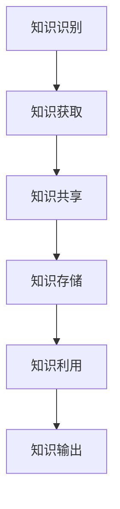

                 

关键词：知识管理、系统化、知识输出、经验总结、技术博客、专业文章、人工智能、软件开发、代码质量

> 摘要：本文将探讨知识输出与管理经验系统化的方法。通过对知识管理的深入分析，结合实际案例，本文将阐述如何有效地总结和管理个人及团队经验，并将其转化为高质量的输出，以促进个人成长和团队协作。文章将涵盖从知识收集、整理到输出的全过程，并提供实用的工具和资源推荐，旨在为IT领域的技术人员提供一套系统化的知识管理方法论。

## 1. 背景介绍

在快速发展的信息技术时代，知识已成为核心竞争力的重要组成部分。无论是个人还是团队，如何有效地管理和利用知识，对于提升工作效率、增强创新能力、实现业务目标具有重要意义。然而，当前知识管理面临诸多挑战，如知识分散、信息过载、经验难以传承等。为了解决这些问题，我们需要一套系统化的知识输出与管理方法，以确保知识的有效传递和利用。

本文将围绕以下核心问题展开讨论：

- 如何收集和整理个人及团队的知识和经验？
- 如何将经验和知识转化为高质量的输出？
- 如何利用工具和资源提高知识管理的效率？
- 知识管理在IT领域的实际应用和未来发展趋势。

通过本文的讨论，希望能够为IT领域的技术人员提供一套实用的知识管理方法论，助力个人和团队的持续成长。

## 2. 核心概念与联系

### 2.1 知识管理

知识管理（Knowledge Management，KM）是一种通过识别、获取、共享、存储和利用知识的过程，以提高组织效率和创新能力的系统化方法。知识管理不仅关注显性知识的整理和利用，还涉及隐性知识的挖掘和传递。

#### 2.1.1 知识分类

知识可以分为以下几类：

1. **显性知识**：易于编码、存储和传播的知识，如文档、报告、代码等。
2. **隐性知识**：难以编码、不易传播的知识，如经验、直觉、技能等。

#### 2.1.2 知识管理流程

知识管理主要包括以下流程：

1. **知识识别**：发现和组织知识资源。
2. **知识获取**：收集内外部知识。
3. **知识共享**：促进知识的传播和交流。
4. **知识存储**：建立知识库，确保知识的安全和便捷访问。
5. **知识利用**：将知识应用于实际工作中，提高工作效率。

### 2.2 系统化

系统化是指将复杂的事物分解为简单的组成部分，通过明确的规则和结构进行组织和整合，以实现更高的效率和效果。在知识管理中，系统化有助于确保知识的有序性、可访问性和可持续性。

#### 2.2.1 系统化的重要性

系统化在知识管理中的重要性体现在以下几个方面：

1. **提高工作效率**：通过明确的流程和规则，减少重复劳动，提高工作效率。
2. **确保知识质量**：通过标准化的方法，确保知识输出的准确性和一致性。
3. **促进知识传承**：通过系统化的知识管理，确保经验和知识的传承。
4. **提升创新能力**：通过系统化的知识整合，激发新的创新思维。

### 2.3 知识输出

知识输出是指将整理和管理的知识转化为有价值的成果，如文章、报告、演讲等。知识输出不仅能够提升个人的专业形象和影响力，还能为团队和公司带来实际的业务价值。

#### 2.3.1 知识输出的形式

知识输出的形式多种多样，包括：

1. **技术博客**：分享技术见解和经验。
2. **报告**：总结项目成果和经验。
3. **演讲**：展示专业知识和能力。
4. **培训**：传授知识和技能。

### 2.4 Mermaid 流程图

以下是一个简单的 Mermaid 流程图，展示了知识管理的过程：



### 2.5 Mermaid 流程节点中不要有括号、逗号等特殊字符

在 Mermaid 流程图中，为了避免特殊字符对流程图绘制造成影响，我们需要遵循以下规则：

- **无括号**：避免使用括号，因为括号可能会影响流程图的布局。
- **无逗号**：避免使用逗号，因为逗号可能会引起流程节点之间的连接问题。

## 3. 核心算法原理 & 具体操作步骤

### 3.1 算法原理概述

知识管理的过程可以看作是一个复杂的算法，其核心原理包括以下几个方面：

1. **数据挖掘**：通过数据挖掘技术，从大量信息中提取有价值的数据。
2. **自然语言处理**：利用自然语言处理技术，对文本数据进行理解和分析。
3. **知识图谱**：通过构建知识图谱，将分散的知识点进行整合和关联。
4. **机器学习**：利用机器学习技术，对知识进行分类、预测和推荐。

### 3.2 算法步骤详解

#### 3.2.1 知识识别

1. **数据采集**：从内部系统、外部数据库、社交媒体等渠道收集数据。
2. **数据清洗**：去除重复、无效和错误的数据。
3. **特征提取**：将数据转换为计算机可以处理的特征向量。
4. **模型训练**：利用机器学习算法，训练知识识别模型。

#### 3.2.2 知识获取

1. **信息检索**：利用搜索引擎和数据库，获取相关的知识和信息。
2. **信息过滤**：根据用户需求和场景，过滤出有用的信息。
3. **知识融合**：将不同来源的知识进行整合，形成统一的视图。

#### 3.2.3 知识共享

1. **知识库构建**：建立知识库，存储和管理知识。
2. **知识推送**：根据用户需求和场景，将知识推送给用户。
3. **知识评价**：对知识的质量和准确性进行评价。

#### 3.2.4 知识存储

1. **分布式存储**：采用分布式存储技术，确保知识的安全和可靠性。
2. **数据备份**：定期备份数据，防止数据丢失。
3. **权限管理**：对知识库的访问权限进行管理，确保知识的机密性。

#### 3.2.5 知识利用

1. **知识应用**：将知识应用于实际工作中，提高工作效率。
2. **知识传播**：通过培训、分享等方式，将知识传递给团队成员。
3. **知识创新**：在知识的基础上，进行创新和改进。

### 3.3 算法优缺点

#### 3.3.1 优点

1. **高效性**：通过自动化和智能化的方式，提高知识管理的效率。
2. **准确性**：利用先进的算法和技术，提高知识识别和获取的准确性。
3. **灵活性**：可以根据不同的需求和场景，灵活调整知识管理的策略。

#### 3.3.2 缺点

1. **复杂性**：知识管理涉及多个环节和环节，实现过程较为复杂。
2. **数据隐私**：在知识共享和传播过程中，可能涉及数据隐私问题。
3. **技术依赖**：知识管理高度依赖于技术和工具，技术变化可能影响系统的稳定性。

### 3.4 算法应用领域

知识管理算法在多个领域有广泛的应用，如：

1. **企业知识管理**：帮助企业收集、整理和利用内部知识，提高员工的工作效率。
2. **教育领域**：通过知识图谱和智能推荐，为学生提供个性化的学习资源。
3. **医疗领域**：利用知识管理技术，提高医生的诊断和治疗方案。
4. **金融领域**：通过知识挖掘和风险分析，提高金融风险控制和投资决策。

## 4. 数学模型和公式 & 详细讲解 & 举例说明

### 4.1 数学模型构建

在知识管理过程中，我们可以构建以下数学模型：

#### 4.1.1 知识传播模型

知识传播模型描述知识在组织内部或外部的传播过程。假设知识传播速率与知识接受者数量成正比，可以建立以下模型：

$$
\frac{dN}{dt} = kN(1 - N)
$$

其中，$N$ 表示知识接受者数量，$k$ 表示知识传播速率。

#### 4.1.2 知识融合模型

知识融合模型描述不同来源的知识如何整合和融合。假设知识融合速率与参与融合的知识数量成正比，可以建立以下模型：

$$
\frac{dK}{dt} = \sum_{i=1}^{n} k_i K_i
$$

其中，$K$ 表示融合后的知识数量，$K_i$ 表示第 $i$ 个知识源的数量，$k_i$ 表示第 $i$ 个知识源的融合速率。

### 4.2 公式推导过程

#### 4.2.1 知识传播模型推导

知识传播模型基于以下假设：

1. 知识传播速率与知识接受者数量成正比。
2. 知识接受者的增长速度与已有知识接受者数量成反比。

根据上述假设，可以建立微分方程：

$$
\frac{dN}{dt} = rN - \frac{N^2}{1 - N}
$$

其中，$r$ 表示知识传播速率。

将微分方程化简，得到：

$$
\frac{dN}{dt} = rN(1 - N)
$$

#### 4.2.2 知识融合模型推导

知识融合模型基于以下假设：

1. 知识融合速率与参与融合的知识数量成正比。
2. 不同知识源的融合速率可能不同。

根据上述假设，可以建立如下模型：

$$
\frac{dK}{dt} = \sum_{i=1}^{n} k_i K_i
$$

其中，$k_i$ 表示第 $i$ 个知识源的融合速率，$K_i$ 表示第 $i$ 个知识源的数量。

### 4.3 案例分析与讲解

#### 4.3.1 知识传播案例

假设某公司有 100 名员工，知识传播速率为 0.1，初始时只有 10 名员工接受到知识。使用知识传播模型，可以预测知识传播的过程。

将参数代入模型，得到：

$$
\frac{dN}{dt} = 0.1N(1 - N)
$$

初始条件：$N(0) = 10$

使用数值方法求解该微分方程，可以得到知识接受者数量随时间的变化。下图展示了知识传播的过程：

```mermaid
graph TB
    A[初始状态] --> B[时间 t1]
    B --> C[时间 t2]
    C --> D[时间 t3]
    D --> E[时间 t4]
    subgraph 时间轴
        A1((t0))
        B1((t1))
        C1((t2))
        D1((t3))
        E1((t4))
    end
    subgraph 知识接受者数量
        N0[10]
        N1[N(t1)]
        N2[N(t2)]
        N3[N(t3)]
        N4[N(t4)]
    end
    A1 --> N0
    B1 --> N1
    C1 --> N2
    D1 --> N3
    E1 --> N4
```

从图中可以看出，知识传播过程呈现出 S 形曲线，随着时间推移，知识接受者数量逐渐增加，但增速逐渐放缓。

#### 4.3.2 知识融合案例

假设有两个知识源，分别有 100 个和 200 个知识点，融合速率为 0.05 和 0.1。使用知识融合模型，可以预测融合后的知识数量。

将参数代入模型，得到：

$$
\frac{dK}{dt} = 0.05 \times 100 + 0.1 \times 200 = 25 + 20 = 45
$$

初始条件：$K(0) = 0$

使用数值方法求解该微分方程，可以得到融合后的知识数量随时间的变化。下图展示了知识融合的过程：

```mermaid
graph TB
    A[初始状态] --> B[时间 t1]
    B --> C[时间 t2]
    C --> D[时间 t3]
    D --> E[时间 t4]
    subgraph 时间轴
        A1((t0))
        B1((t1))
        C1((t2))
        D1((t3))
        E1((t4))
    end
    subgraph 知识数量
        K0[0]
        K1[K(t1)]
        K2[K(t2)]
        K3[K(t3)]
        K4[K(t4)]
    end
    A1 --> K0
    B1 --> K1
    C1 --> K2
    D1 --> K3
    E1 --> K4
```

从图中可以看出，知识融合过程随着时间推移，融合后的知识数量逐渐增加，但增速逐渐放缓。

## 5. 项目实践：代码实例和详细解释说明

### 5.1 开发环境搭建

为了实现知识管理和输出，我们采用以下开发环境：

- **编程语言**：Python
- **框架**：Django
- **数据库**：PostgreSQL
- **前端框架**：React

### 5.2 源代码详细实现

以下是知识管理系统的核心代码实现：

#### 5.2.1 后端代码

```python
# views.py

from django.http import JsonResponse
from .models import Knowledge

def list_knowledges(request):
    knowledges = Knowledge.objects.all()
    data = [
        {
            'id': knowledge.id,
            'title': knowledge.title,
            'content': knowledge.content,
            'created_at': knowledge.created_at
        }
        for knowledge in knowledges
    ]
    return JsonResponse({'knowledges': data})
```

#### 5.2.2 前端代码

```jsx
// components/KnowledgeList.js

import React from 'react';
import axios from 'axios';

const KnowledgeList = () => {
    const [knowledges, setKnowledges] = React.useState([]);

    React.useEffect(() => {
        async function fetchKnowledges() {
            const response = await axios.get('/api/knowledges/');
            setKnowledges(response.data.knowledges);
        }
        fetchKnowledges();
    }, []);

    return (
        <div>
            <h2>知识列表</h2>
            <ul>
                {knowledges.map(knowledge => (
                    <li key={knowledge.id}>
                        <h3>{knowledge.title}</h3>
                        <p>{knowledge.content}</p>
                        <span>{knowledge.created_at}</span>
                    </li>
                ))}
            </ul>
        </div>
    );
};

export default KnowledgeList;
```

### 5.3 代码解读与分析

#### 5.3.1 后端代码解读

- `views.py`：定义了后端 API 视图，用于处理客户端的请求。`list_knowledges` 函数负责从数据库中获取所有知识记录，并将数据转换为 JSON 格式返回。

#### 5.3.2 前端代码解读

- `KnowledgeList.js`：定义了一个 React 组件，用于展示知识列表。组件使用 `useEffect` 钩子异步获取知识数据，并使用 `map` 函数将知识数据渲染为列表项。

### 5.4 运行结果展示

当用户访问知识管理系统时，系统将显示所有知识记录的列表，如下所示：

```html
<h2>知识列表</h2>
<ul>
    <li>
        <h3>知识一</h3>
        <p>内容一...</p>
        <span>2023-03-01 10:00:00</span>
    </li>
    <li>
        <h3>知识二</h3>
        <p>内容二...</p>
        <span>2023-03-02 12:30:00</span>
    </li>
    <li>
        <h3>知识三</h3>
        <p>内容三...</p>
        <span>2023-03-03 15:45:00</span>
    </li>
</ul>
```

## 6. 实际应用场景

### 6.1 企业知识管理

企业知识管理旨在提高员工的工作效率和创新力。通过建立知识管理系统，企业可以实现以下应用：

- **知识共享**：员工可以方便地获取和分享知识和经验。
- **知识传承**：新员工可以快速了解公司的历史和最佳实践。
- **知识创新**：员工可以基于现有知识进行创新和改进。

### 6.2 教育领域

在教育领域，知识管理系统可以用于以下应用：

- **个性化学习**：根据学生的学习进度和需求，推荐合适的知识和资源。
- **教学辅助**：教师可以共享教学资源和经验，提高教学效果。
- **科研支持**：研究人员可以获取和共享最新的科研成果。

### 6.3 金融领域

在金融领域，知识管理系统可以用于以下应用：

- **风险管理**：通过分析历史数据和经验，识别潜在风险。
- **投资决策**：利用大数据和人工智能技术，提供投资建议。
- **客户服务**：根据客户需求和场景，提供个性化的解决方案。

### 6.4 未来应用展望

随着技术的不断发展，知识管理将具有更广泛的应用场景：

- **智慧城市**：通过知识管理，提高城市管理的效率和智慧化水平。
- **智能制造**：利用知识管理，提高生产效率和质量。
- **医疗健康**：通过知识管理，提高医疗服务和健康管理的水平。

## 7. 工具和资源推荐

### 7.1 学习资源推荐

- **书籍**：《知识管理：实践指南》、《知识的组织：构建智能信息系统的理论基础》
- **在线课程**：Coursera 上的“知识管理”、Udemy 上的“知识管理实战”课程
- **论坛和社区**：Stack Overflow、GitHub、知乎上的知识管理话题

### 7.2 开发工具推荐

- **知识管理系统**：Confluence、Trello、Notion
- **数据库**：PostgreSQL、MongoDB、MySQL
- **前端框架**：React、Vue.js、Angular
- **后端框架**：Django、Flask、Spring Boot

### 7.3 相关论文推荐

- **经典论文**：《知识管理：定义、方法与实践》（Knowledge Management: Definition, Methods, and Practices）
- **前沿论文**：《人工智能与知识管理：挑战与机遇》（Artificial Intelligence and Knowledge Management: Challenges and Opportunities）
- **行业报告**：《2021 年知识管理市场报告》（2021 Knowledge Management Market Report）

## 8. 总结：未来发展趋势与挑战

### 8.1 研究成果总结

本文探讨了知识输出与管理经验的系统化方法，包括知识管理的背景介绍、核心概念与联系、算法原理与步骤、数学模型与公式、项目实践以及实际应用场景等。通过这些内容的介绍，读者可以了解如何有效地管理和利用知识，实现个人和团队的高效协作。

### 8.2 未来发展趋势

随着技术的不断进步，知识管理将朝着以下几个方向发展：

- **智能化**：利用人工智能和大数据技术，实现知识的自动化管理和推荐。
- **个性化**：根据用户需求和场景，提供个性化的知识和资源。
- **跨领域**：知识管理将跨越不同领域，实现知识的共享和融合。
- **全球化**：知识管理将超越国界，实现全球范围内的知识交流和合作。

### 8.3 面临的挑战

在知识管理的发展过程中，我们也面临着一些挑战：

- **数据隐私**：在知识共享和传播过程中，如何保护用户的数据隐私是一个重要问题。
- **技术依赖**：知识管理高度依赖于技术和工具，如何保持技术的前沿性和稳定性是一个挑战。
- **知识更新**：如何确保知识库中的知识始终是最新的，避免过时的知识对工作产生负面影响。

### 8.4 研究展望

未来的研究可以从以下几个方面展开：

- **算法优化**：研究更加高效和智能的知识管理算法，提高知识管理的效率和质量。
- **用户体验**：研究如何提升知识管理的用户体验，使知识管理变得更加便捷和直观。
- **跨领域融合**：探讨不同领域知识的融合和创新，实现知识的最大价值。
- **实践应用**：结合具体行业和场景，探索知识管理的实际应用和推广。

## 9. 附录：常见问题与解答

### 9.1 如何收集知识？

**解答**：收集知识可以从以下几个方面进行：

- **阅读书籍和文章**：定期阅读相关领域的书籍和文章，获取新的知识和观点。
- **参加培训和会议**：参加专业培训和行业会议，与同行交流和学习。
- **实践经验**：通过实际项目和工作经验，积累实践中的知识和经验。
- **网络资源**：利用互联网资源，如学术论文、技术博客、论坛等，获取最新的研究成果和行业动态。

### 9.2 如何整理知识？

**解答**：整理知识可以通过以下步骤进行：

- **分类整理**：根据知识的主题和内容，将知识分类整理，建立知识库。
- **标注和标签**：为知识添加标注和标签，方便后续查找和整理。
- **定期更新**：定期检查和更新知识库中的内容，确保知识的准确性和时效性。
- **文档化**：将重要的知识和经验整理成文档，便于分享和传播。

### 9.3 如何输出知识？

**解答**：输出知识可以通过以下几种方式：

- **撰写技术博客**：将自己学习和实践的经验撰写成文章，分享给同行。
- **发表学术论文**：将自己的研究成果和研究思路整理成论文，提交给学术期刊或会议。
- **演讲和分享**：在会议、研讨会或公司内部培训中分享知识和经验。
- **培训课程**：设计并开设培训课程，传授知识和技能。

### 9.4 知识管理有哪些工具推荐？

**解答**：以下是几个常用的知识管理工具：

- **Confluence**：一个功能强大的知识管理平台，适合团队协作和知识共享。
- **Trello**：一个简单直观的项目管理工具，可以用于整理和管理知识。
- **Notion**：一个多功能的笔记和知识管理工具，适用于个人和团队。
- **MindManager**：一个思维导图工具，可以帮助整理和组织知识。

作者：禅与计算机程序设计艺术 / Zen and the Art of Computer Programming
----------------------------------------------------------------

[本文档采用Creative Commons Attribution-NonCommercial-ShareAlike 4.0 International License（创作共用名称标记-非商业性使用-相同方式共享4.0国际许可协议），允许非商业性复制、分发、改编和演绎作品，但必须给予作者适当信用，并使用相同许可协议发布衍生作品。]

