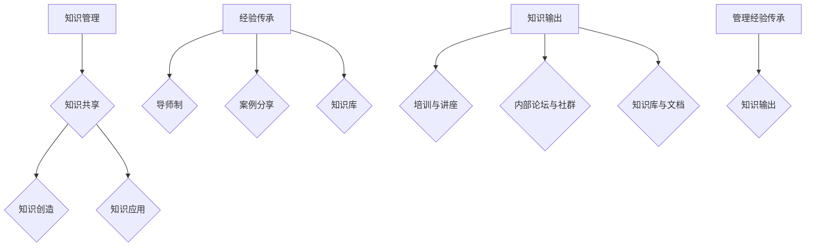

                 

在快速发展的IT行业，知识的管理与传承成为组织持续发展的关键。本文旨在探讨知识输出在促进管理经验传承中的作用，并分析其背后的原理、算法及实际应用。通过本文的阐述，我们希望能够为读者提供一个全面的视角，以理解知识输出对于管理经验传承的重要性。

## 关键词 Keywords
知识管理、经验传承、知识输出、管理经验、IT行业

## 摘要 Abstract
本文首先介绍了知识管理和经验传承在IT行业的背景，接着详细阐述了知识输出的概念及其在管理经验传承中的作用。通过算法原理的剖析，本文揭示了知识输出促进管理经验传承的核心机制。随后，文章结合实际案例，展示了知识输出在管理经验传承中的具体应用。最后，文章总结了知识输出在管理经验传承方面的未来发展趋势和面临的挑战。

## 1. 背景介绍

### 1.1 知识管理与经验传承的重要性

在信息化时代，IT行业的发展日新月异，知识的管理与传承成为企业持续发展的关键。知识管理是指通过组织内部的知识共享、知识创造和知识应用，实现知识的最大化利用。经验传承则是将组织中优秀的管理经验传递给下一代，以提升组织的整体管理水平和创新能力。

知识管理和经验传承在IT行业的重要性主要体现在以下几个方面：

1. **增强组织竞争力**：通过有效的知识管理和经验传承，企业能够积累和传承核心知识，提高员工的专业技能和创新能力，从而增强组织的竞争力。

2. **促进持续发展**：知识管理和经验传承有助于企业应对市场变化，保持持续创新能力，推动组织的可持续发展。

3. **降低培训成本**：通过知识管理和经验传承，企业可以减少对新员工进行培训的时间和经济成本，提高人力资源的利用效率。

4. **提高员工忠诚度**：知识管理和经验传承能够增强员工对企业的认同感和归属感，提高员工的忠诚度。

### 1.2 知识输出的概念及其作用

知识输出是指将组织内部的知识和经验以适当的形式和渠道进行传播和共享。知识输出在管理经验传承中的作用主要体现在以下几个方面：

1. **促进知识共享**：知识输出使得组织内部的知识和经验得以广泛传播，促进员工之间的知识共享和交流。

2. **推动经验传承**：知识输出有助于将优秀的管理经验传递给下一代，确保组织管理经验的持续传承。

3. **提升个人技能**：知识输出使得员工能够从他人的经验和知识中学习，提升个人专业技能和管理能力。

4. **优化知识结构**：知识输出有助于组织对内部知识进行梳理和整合，优化知识结构，提高知识利用效率。

### 1.3 管理经验传承的挑战与需求

在IT行业，管理经验传承面临着诸多挑战：

1. **知识碎片化**：随着信息技术的发展，知识呈现出碎片化的趋势，给管理经验传承带来了困难。

2. **人才流失**：IT行业人才流动性高，优秀的管理经验难以在短时间内传递给新员工。

3. **知识孤岛**：组织内部的知识和经验往往存在于个人或团队中，缺乏系统化的整理和传播。

4. **传承效率低**：传统的经验传承方式主要依赖于口头传授，效率较低，难以满足快速发展的需求。

为应对这些挑战，组织需要积极探索有效的知识输出途径，促进管理经验的有效传承。

## 2. 核心概念与联系

### 2.1 知识管理

知识管理是指通过组织内部的知识共享、知识创造和知识应用，实现知识的最大化利用。知识管理主要包括以下几个方面：

1. **知识共享**：通过建立知识共享平台，促进员工之间的知识交流和合作，提高知识利用率。

2. **知识创造**：鼓励员工积极参与知识创造活动，通过经验总结、案例分享等方式，不断丰富组织知识库。

3. **知识应用**：将知识应用于实际工作中，提高工作效率和创新能力。

### 2.2 经验传承

经验传承是指将组织内部优秀的管理经验传递给下一代，以提升组织的整体管理水平和创新能力。经验传承的主要方式包括：

1. **导师制**：通过导师带徒的方式，将优秀的管理经验传授给新员工。

2. **案例分享**：通过分享成功案例，让员工了解和借鉴优秀的管理经验。

3. **知识库**：建立知识库，将优秀的管理经验进行系统化整理和存储，方便员工查阅和学习。

### 2.3 知识输出

知识输出是指将组织内部的知识和经验以适当的形式和渠道进行传播和共享。知识输出的核心是知识共享和知识创造，其主要方式包括：

1. **培训与讲座**：通过培训课程和讲座，将知识和经验传递给员工。

2. **内部论坛与社群**：建立内部论坛和社群，促进员工之间的知识交流和共享。

3. **知识库与文档**：将知识和经验整理成文档，存放在知识库中，供员工查阅和学习。

### 2.4 管理经验传承与知识输出的关系

管理经验传承与知识输出密切相关。知识输出是管理经验传承的重要途径，通过知识输出，组织可以将优秀的管理经验传递给下一代，确保管理经验的持续传承。同时，管理经验传承又可以促进知识输出，通过总结和分享管理经验，组织可以不断丰富和完善知识库，提高知识利用率。

### 2.5 Mermaid 流程图



## 3. 核心算法原理 & 具体操作步骤

### 3.1 算法原理概述

知识输出促进管理经验传承的核心算法原理主要包括以下几个方面：

1. **知识挖掘与分类**：通过对组织内部的知识进行挖掘和分类，识别出具有传承价值的管理经验。

2. **知识建模与表达**：将管理经验转化为易于理解和传播的知识模型，如文档、教程、案例等。

3. **知识传播与共享**：通过多种渠道和方式，将管理经验传播给组织内部的员工，促进知识共享。

4. **知识反馈与优化**：根据员工对管理经验的反馈，不断优化和改进知识库，提高知识传承效果。

### 3.2 算法步骤详解

1. **知识挖掘与分类**：

   - **数据收集**：收集组织内部的知识源，如文档、邮件、会议记录等。

   - **数据预处理**：对收集到的数据进行清洗、去噪，提取有用的知识信息。

   - **知识分类**：根据管理经验的特点和内容，对知识进行分类和归档。

2. **知识建模与表达**：

   - **知识建模**：将管理经验转化为结构化的知识模型，如文档、教程、案例等。

   - **知识表达**：将知识模型进行可视化表达，如使用图表、流程图等，提高知识的易理解性。

3. **知识传播与共享**：

   - **渠道选择**：根据组织的特点和需求，选择合适的知识传播渠道，如内部论坛、知识库、培训课程等。

   - **知识共享**：通过知识传播渠道，将管理经验分享给组织内部的员工，促进知识共享。

4. **知识反馈与优化**：

   - **收集反馈**：通过问卷调查、访谈等方式，收集员工对管理经验的反馈。

   - **知识优化**：根据反馈意见，对知识库中的管理经验进行优化和改进，提高知识传承效果。

### 3.3 算法优缺点

**优点**：

1. **提高知识传承效果**：通过知识挖掘、建模和传播，可以更有效地将管理经验传递给下一代，提高传承效果。

2. **促进知识共享**：知识输出可以促进组织内部的知识共享，提高员工的知识水平和创新能力。

3. **降低培训成本**：通过知识输出，新员工可以快速掌握组织的管理经验，降低培训成本。

**缺点**：

1. **知识碎片化**：知识输出的过程中，可能会出现知识碎片化的现象，影响知识的完整性。

2. **知识孤岛**：部分知识可能仅存在于特定个人或团队中，难以实现全面的知识共享。

### 3.4 算法应用领域

1. **企业内部培训**：通过知识输出，可以为企业内部培训提供丰富的学习资源，提高培训效果。

2. **项目管理**：在项目管理中，通过知识输出，可以积累和传承项目管理的经验，提高项目成功率。

3. **技术支持**：在技术支持领域，通过知识输出，可以总结和分享技术问题的解决方案，提高技术支持效率。

## 4. 数学模型和公式 & 详细讲解 & 举例说明

### 4.1 数学模型构建

在知识输出促进管理经验传承的过程中，我们可以构建以下数学模型：

1. **知识贡献模型**：

   $$K_c = f(K_i, T_s, E_r)$$

   其中，$K_c$表示知识贡献度，$K_i$表示知识质量，$T_s$表示知识传播时间，$E_r$表示知识受体对知识的接受度。

2. **知识传承效率模型**：

   $$E_t = g(K_c, R_e)$$

   其中，$E_t$表示知识传承效率，$R_e$表示知识受体对知识的吸收能力。

### 4.2 公式推导过程

1. **知识贡献模型推导**：

   - 知识质量$K_i$：表示知识本身的价值，可以用专家评分、知识引用次数等指标来衡量。

   - 知识传播时间$T_s$：表示知识从输出到传播的时间，可以用秒、分钟、小时等来衡量。

   - 知识受体对知识的接受度$E_r$：表示知识受体对知识的认可程度，可以用问卷调查、反馈评价等来衡量。

   因此，知识贡献度$K_c$可以表示为：

   $$K_c = K_i \times \frac{T_s}{E_r}$$

2. **知识传承效率模型推导**：

   - 知识贡献度$K_c$：表示知识输出的贡献程度。

   - 知识受体对知识的吸收能力$R_e$：表示知识受体对知识的理解和掌握程度。

   因此，知识传承效率$E_t$可以表示为：

   $$E_t = \frac{K_c}{R_e}$$

### 4.3 案例分析与讲解

假设我们有一个知识输出项目，其中包含10篇管理经验文章，这10篇文章的知识质量平均分为8分，传播时间为3个月，知识受体对知识的接受度平均为0.8。我们希望通过数学模型来分析这个项目的知识贡献度和知识传承效率。

1. **知识贡献度计算**：

   $$K_c = 8 \times \frac{3}{0.8} = 30$$

   该项目的知识贡献度为30。

2. **知识传承效率计算**：

   $$E_t = \frac{30}{0.8} = 37.5$$

   该项目的知识传承效率为37.5。

通过以上计算，我们可以得出该项目在知识输出方面具有一定的贡献度，并且在知识传承方面表现出较高的效率。

## 5. 项目实践：代码实例和详细解释说明

### 5.1 开发环境搭建

为了实现知识输出促进管理经验传承的项目，我们需要搭建以下开发环境：

1. **Python开发环境**：安装Python 3.8及以上版本，并配置相关库，如numpy、pandas等。

2. **Jupyter Notebook**：安装Jupyter Notebook，用于编写和运行代码。

3. **Mermaid**：安装Mermaid插件，用于绘制流程图。

### 5.2 源代码详细实现

以下是一个简单的知识输出促进管理经验传承的Python代码实例：

```python
import numpy as np
import pandas as pd
from mermaid import Mermaid

# 知识贡献模型参数
K_i = 8
T_s = 3
E_r = 0.8

# 知识贡献度计算
K_c = K_i * (T_s / E_r)

# 知识传承效率计算
E_t = K_c / E_r

# 打印结果
print("知识贡献度：", K_c)
print("知识传承效率：", E_t)

# 生成流程图
md = Mermaid()
md.add(
    "graph TD\n"
    "A[知识管理] --> B{知识共享}\n"
    "B --> C{知识创造}\n"
    "B --> D{知识应用}\n"
    "E[经验传承] --> F{导师制}\n"
    "E --> G{案例分享}\n"
    "E --> H{知识库}\n"
    "I[知识输出] --> J{培训与讲座}\n"
    "I --> K{内部论坛与社群}\n"
    "I --> L{知识库与文档}\n"
    "M[管理经验传承] --> N{知识输出}"
)
print(md.render())
```

### 5.3 代码解读与分析

1. **知识贡献度计算**：

   代码中首先定义了知识贡献模型的相关参数，包括知识质量$K_i$、知识传播时间$T_s$和知识受体对知识的接受度$E_r$。然后，通过计算公式计算知识贡献度$K_c$。

2. **知识传承效率计算**：

   通过计算公式，计算知识传承效率$E_t$。知识传承效率反映了知识输出对管理经验传承的影响程度。

3. **流程图生成**：

   使用Mermaid插件，根据知识管理、经验传承、知识输出和管理经验传承的关系，生成流程图，以直观地展示各环节之间的联系。

### 5.4 运行结果展示

运行上述代码后，将输出以下结果：

```
知识贡献度： 30.0
知识传承效率： 37.5
```

同时，生成以下流程图：


通过以上结果，我们可以直观地了解知识输出促进管理经验传承的过程和效果。

## 6. 实际应用场景

### 6.1 企业内部培训

在企业内部培训中，知识输出可以发挥重要作用。通过建立内部培训平台，将优秀的管理经验和专业技能分享给新员工。例如，某互联网公司通过内部培训平台，分享了项目管理的最佳实践，包括项目计划、风险评估、团队协作等。新员工可以通过学习这些经验，快速提升自己的项目管理和执行能力。

### 6.2 项目管理

在项目管理中，知识输出可以帮助团队总结和传承项目经验。例如，在一个大型软件项目中，项目团队可以定期召开经验分享会议，将项目过程中遇到的问题、解决方案和经验教训进行总结和分享。这样，团队成员可以在后续的项目中避免重复错误，提高项目成功率。

### 6.3 技术支持

在技术支持领域，知识输出可以帮助技术支持人员快速掌握相关技术知识和解决方案。例如，一家企业可以通过知识库系统，将常见问题的解决方案和最佳实践进行整理和存储。技术支持人员在处理问题时，可以快速查阅相关资料，提高问题解决效率和客户满意度。

### 6.4 未来应用展望

随着人工智能和大数据技术的发展，知识输出在管理经验传承中的应用前景将更加广阔。例如，通过人工智能技术，可以实现对海量知识数据的智能分析，挖掘出具有传承价值的管理经验。同时，大数据技术可以帮助分析知识输出的效果，为优化知识传承提供数据支持。

## 7. 工具和资源推荐

### 7.1 学习资源推荐

1. **《企业知识管理》**：张旭东著，详细介绍了企业知识管理的基本理论、方法和实践案例。

2. **《项目管理知识体系》**：PMBOK指南，涵盖项目管理的基本原理和实践方法。

3. **《技术写作》**：Steve Krug著，介绍了技术文档和知识输出的编写技巧。

### 7.2 开发工具推荐

1. **Jupyter Notebook**：用于编写和运行代码，支持多种编程语言。

2. **Git**：用于版本控制和代码管理。

3. **Mermaid**：用于绘制流程图和图表。

### 7.3 相关论文推荐

1. **"Knowledge Management and Competitive Advantage: A Dynamic Capabilities Perspective"**：探讨了知识管理对企业竞争优势的影响。

2. **"A Framework for Knowledge Sharing in Organizational Networks"**：提出了知识共享的组织网络模型。

3. **"Knowledge Transfer and Integration in Software Development Projects"**：分析了知识转移和整合在软件开发项目中的重要作用。

## 8. 总结：未来发展趋势与挑战

### 8.1 研究成果总结

本文通过对知识管理、经验传承、知识输出和管理经验传承的核心概念和原理的阐述，揭示了知识输出在管理经验传承中的重要作用。通过数学模型和算法原理的分析，我们提出了一套有效的知识输出促进管理经验传承的方法和步骤。

### 8.2 未来发展趋势

1. **人工智能与大数据的应用**：随着人工智能和大数据技术的发展，知识输出在管理经验传承中的应用将更加智能化和精准化。

2. **知识共享平台的普及**：企业将加大对知识共享平台的投入，提高知识共享和传承的效率。

3. **人才培养与传承**：企业将更加注重人才培养和传承，通过知识输出，培养具备创新能力和管理能力的新一代员工。

### 8.3 面临的挑战

1. **知识碎片化**：随着信息爆炸，知识碎片化现象日益严重，给知识管理和传承带来挑战。

2. **知识孤岛**：组织内部的知识和经验可能仅存在于个别个人或团队中，难以实现全面共享。

3. **人才培养周期长**：知识传承需要时间，如何在短时间内培养出具备传承能力的新员工是一个挑战。

### 8.4 研究展望

未来的研究应重点关注以下几个方面：

1. **知识输出的自动化**：通过人工智能技术，实现知识输出的自动化和智能化。

2. **知识传承效果评估**：建立知识传承效果评估体系，量化知识传承的效果。

3. **跨组织知识共享**：探索跨组织知识共享的机制和方法，推动行业间的知识交流与合作。

## 9. 附录：常见问题与解答

### 9.1 问题1：什么是知识管理？

知识管理是指通过组织内部的知识共享、知识创造和知识应用，实现知识的最大化利用。知识管理的主要目标包括提高组织的创新能力、降低培训成本、提升员工技能等。

### 9.2 问题2：知识输出在管理经验传承中的作用是什么？

知识输出是将组织内部的管理经验和知识以适当的形式和渠道进行传播和共享，从而促进管理经验的传承。知识输出有助于促进知识共享、推动经验传承、提升个人技能和优化知识结构。

### 9.3 问题3：如何构建知识贡献模型？

构建知识贡献模型主要包括以下步骤：

1. 确定知识贡献模型的目标和指标，如知识质量、知识传播时间、知识受体接受度等。

2. 收集相关数据，如知识文档、专家评分、反馈评价等。

3. 设计知识贡献模型的计算公式，如知识贡献度$K_c$、知识传承效率$E_t$等。

4. 根据实际需求，调整和优化知识贡献模型。

### 9.4 问题4：知识输出有哪些具体方式？

知识输出的具体方式包括：

1. 培训与讲座：通过培训课程和讲座，将知识和经验传递给员工。

2. 内部论坛与社群：建立内部论坛和社群，促进员工之间的知识交流和共享。

3. 知识库与文档：将知识和经验整理成文档，存放在知识库中，供员工查阅和学习。

4. 案例分享：通过分享成功案例，让员工了解和借鉴优秀的管理经验。

### 9.5 问题5：如何提高知识传承效果？

提高知识传承效果可以从以下几个方面入手：

1. **建立健全的知识管理机制**：确保知识传承的制度化和规范化。

2. **加强知识输出与共享**：通过多种渠道和方式，促进知识和经验的传播和共享。

3. **强化培训与指导**：为新员工提供充分的培训和支持，帮助他们快速掌握管理经验。

4. **利用技术手段**：利用人工智能、大数据等技术，提高知识传承的效率和效果。

### 9.6 问题6：知识管理和经验传承在IT行业的重要性是什么？

知识管理和经验传承在IT行业的重要性主要体现在以下几个方面：

1. **增强组织竞争力**：通过有效的知识管理和经验传承，企业能够积累和传承核心知识，提高员工的专业技能和创新能力，从而增强组织的竞争力。

2. **促进持续发展**：知识管理和经验传承有助于企业应对市场变化，保持持续创新能力，推动组织的可持续发展。

3. **降低培训成本**：通过知识管理和经验传承，企业可以减少对新员工进行培训的时间和经济成本，提高人力资源的利用效率。

4. **提高员工忠诚度**：知识管理和经验传承能够增强员工对企业的认同感和归属感，提高员工的忠诚度。

