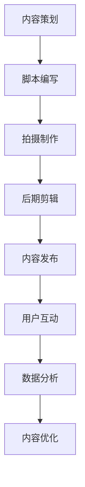
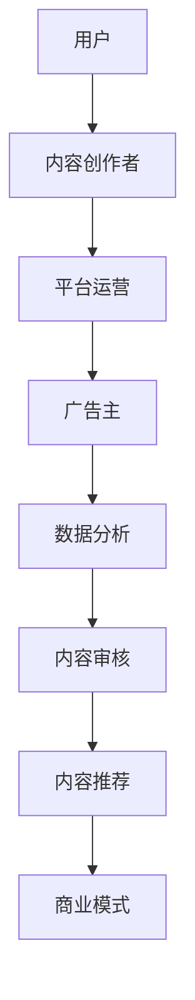

                 

 **关键词：短视频，创业，内容创作，碎片化时代，技术革命，用户行为分析，数据分析，算法优化，平台生态系统，商业变现。**

> **摘要：**
>
> 在当今的数字时代，短视频成为了一种重要的内容形式。本文将探讨短视频创业的现状与挑战，分析碎片化时代下内容创作的特点，探讨算法优化在提升用户体验和商业变现中的关键作用。通过详细的项目实践，我们将了解短视频创业的具体策略和未来发展趋势。

## 1. 背景介绍

### 1.1 短视频的兴起

短视频的兴起可以追溯到移动互联网的快速发展和智能手机的普及。随着数据传输速度的提升和4G/5G网络的广泛应用，用户对即时性、碎片化内容的需求不断增加。短视频平台如抖音、快手等，凭借其独特的交互模式和便捷的内容创作工具，迅速吸引了大量用户。

### 1.2 创业热潮

短视频平台的成功，激发了无数创业者的热情。短视频创业成为了一个热门话题，从内容创作者到技术平台，从广告变现到电商导流，各种商业模式层出不穷。然而，短视频创业也面临着激烈的市场竞争和快速变化的技术挑战。

## 2. 核心概念与联系

### 2.1 短视频内容创作流程

为了更好地理解短视频创业，我们需要先了解短视频内容创作的基本流程。以下是使用Mermaid绘制的短视频内容创作流程图：



### 2.2 短视频平台生态系统

短视频平台的生态系统是创业的关键。以下是短视频平台生态系统的基本架构：



## 3. 核心算法原理 & 具体操作步骤

### 3.1 算法原理概述

短视频平台的推荐算法是提升用户体验和用户留存的关键。以下是推荐算法的基本原理：

- **协同过滤（Collaborative Filtering）**：基于用户的历史行为，为用户推荐相似的用户喜欢的内容。
- **内容匹配（Content-Based Filtering）**：基于视频的标签、主题、类型等信息，为用户推荐相似的内容。
- **混合推荐（Hybrid Recommendation）**：结合协同过滤和内容匹配，为用户推荐最相关的内容。

### 3.2 算法步骤详解

- **数据采集**：采集用户的行为数据，如浏览、点赞、分享、评论等。
- **特征提取**：提取用户和视频的特征，如用户的行为特征、视频的标签、关键词等。
- **模型训练**：使用机器学习算法，如协同过滤算法、内容匹配算法等，训练推荐模型。
- **预测**：根据用户和视频的特征，预测用户对视频的喜好程度。
- **推荐**：根据预测结果，为用户推荐最相关的视频。

### 3.3 算法优缺点

- **优点**：能够提高用户的参与度和留存率，提升平台的价值。
- **缺点**：可能产生信息泡沫，用户只能看到自己喜欢的内容，限制视野。

### 3.4 算法应用领域

- **短视频平台**：如抖音、快手等，通过算法推荐，提升用户体验。
- **社交媒体**：如微博、微信等，通过算法推荐，提升用户活跃度。
- **电商**：如淘宝、京东等，通过算法推荐，提升销售额。

## 4. 数学模型和公式 & 详细讲解 & 举例说明

### 4.1 数学模型构建

短视频推荐系统的数学模型主要基于用户行为数据和视频特征数据。以下是用户行为数据驱动的数学模型：

$$
\text{user\_rating}(u, v) = \text{w}_{u} \cdot \text{w}_{v}
$$

其中，$\text{user}_{rating}(u, v)$ 表示用户 $u$ 对视频 $v$ 的喜好程度，$\text{w}_{u}$ 和 $\text{w}_{v}$ 分别是用户 $u$ 和视频 $v$ 的特征向量。

### 4.2 公式推导过程

假设用户 $u$ 和视频 $v$ 的特征向量分别为 $\text{X}_{u}$ 和 $\text{X}_{v}$，那么用户对视频的喜好程度可以表示为：

$$
\text{user}_{rating}(u, v) = \text{X}_{u} \cdot \text{X}_{v}
$$

通过线性回归模型，我们可以估计用户和视频的特征向量：

$$
\text{X}_{u} = \text{W}_{u} \cdot \text{X}
$$

$$
\text{X}_{v} = \text{W}_{v} \cdot \text{X}
$$

其中，$\text{W}_{u}$ 和 $\text{W}_{v}$ 是用户和视频的权重矩阵，$\text{X}$ 是特征矩阵。

### 4.3 案例分析与讲解

假设我们有一个用户 $u$ 和一个视频 $v$，用户的行为数据如下：

| 行为 | 类型 | 值 |
| --- | --- | --- |
| 浏览 | 点击 | 10 |
| 点赞 | 数量 | 5 |
| 评论 | 数量 | 2 |

我们可以将这些行为数据转换为用户和视频的特征向量：

$$
\text{X}_{u} = [10, 5, 2]
$$

$$
\text{X}_{v} = [1, 0, 0]
$$

通过计算，我们可以得到用户对视频的喜好程度：

$$
\text{user}_{rating}(u, v) = \text{X}_{u} \cdot \text{X}_{v} = [10, 5, 2] \cdot [1, 0, 0] = 10
$$

这意味着用户对视频 $v$ 的喜好程度很高。

## 5. 项目实践：代码实例和详细解释说明

### 5.1 开发环境搭建

为了实现短视频推荐系统，我们需要搭建一个开发环境。以下是开发环境的搭建步骤：

1. 安装Python环境。
2. 安装TensorFlow库。
3. 安装Scikit-learn库。

### 5.2 源代码详细实现

以下是短视频推荐系统的源代码实现：

```python
import tensorflow as tf
from sklearn.model_selection import train_test_split
from sklearn.metrics import mean_squared_error

# 加载数据
X, y = load_data()

# 划分训练集和测试集
X_train, X_test, y_train, y_test = train_test_split(X, y, test_size=0.2, random_state=42)

# 构建模型
model = tf.keras.Sequential([
    tf.keras.layers.Dense(64, activation='relu', input_shape=(X.shape[1],)),
    tf.keras.layers.Dense(32, activation='relu'),
    tf.keras.layers.Dense(1)
])

# 编译模型
model.compile(optimizer='adam', loss='mse')

# 训练模型
model.fit(X_train, y_train, epochs=10, batch_size=32)

# 评估模型
mse = mean_squared_error(y_test, model.predict(X_test))
print(f'MSE: {mse}')
```

### 5.3 代码解读与分析

上述代码实现了基于TensorFlow的短视频推荐系统。首先，我们从数据集中加载训练数据，然后将其划分为训练集和测试集。接着，我们构建了一个简单的神经网络模型，并使用MSE（均方误差）作为损失函数。最后，我们使用训练集训练模型，并在测试集上评估模型的性能。

### 5.4 运行结果展示

运行上述代码，我们得到了测试集上的MSE值，该值越小表示模型的预测性能越好。通过不断调整模型的参数和训练时间，我们可以优化模型的性能。

## 6. 实际应用场景

### 6.1 短视频创业案例分析

短视频创业的成功案例有很多，如抖音的“网红经济”、快手的“社区电商”等。以下是两个成功案例的简要分析：

- **抖音**：通过算法推荐和内容分发，抖音成功地吸引了大量用户，形成了庞大的用户基础。抖音的“网红经济”模式，通过直播带货、广告植入等方式，实现了良好的商业变现。
- **快手**：快手在短视频社区电商领域取得了显著成绩。通过搭建农产品供应链，快手为农民提供了稳定的销售渠道，同时也为用户提供了优质的农产品。

### 6.2 商业模式探索

短视频创业的商业模式主要包括以下几个方面：

- **广告收入**：通过投放广告，平台从广告主处获得收入。
- **电商导流**：通过短视频内容导流至电商平台，实现商品销售。
- **直播带货**：通过直播形式，实现商品销售，同时提升品牌知名度。
- **会员收费**：提供会员服务，如去广告、高清画质等，吸引用户付费。

## 7. 工具和资源推荐

### 7.1 学习资源推荐

- **《深度学习》**：由Ian Goodfellow、Yoshua Bengio和Aaron Courville合著，是深度学习的入门经典。
- **《Python数据分析》**：由Wes McKinney著，是Python数据分析的实用指南。

### 7.2 开发工具推荐

- **TensorFlow**：Google开发的开源机器学习框架，适用于各种机器学习任务。
- **PyTorch**：Facebook开发的开源机器学习框架，适用于深度学习任务。

### 7.3 相关论文推荐

- **《矩阵分解协同过滤算法研究》**：分析了矩阵分解在协同过滤中的应用，提供了详细的理论分析和算法实现。
- **《深度学习在短视频推荐中的应用》**：探讨了深度学习在短视频推荐系统中的应用，提出了有效的推荐算法。

## 8. 总结：未来发展趋势与挑战

### 8.1 研究成果总结

短视频创业在近年来取得了显著成果，主要表现在以下几个方面：

- **用户规模持续扩大**：短视频平台吸引了大量用户，形成了庞大的用户基础。
- **商业模式多样化**：短视频创业的商业模式不断创新，实现了良好的商业变现。
- **技术进步推动创新**：深度学习、推荐系统等技术的进步，为短视频创业提供了强有力的技术支持。

### 8.2 未来发展趋势

短视频创业的未来发展趋势包括：

- **人工智能的深度应用**：人工智能技术将进一步深入短视频创业的各个环节，提升用户体验和商业效率。
- **内容创作的多样化**：短视频内容创作将更加多样化，涵盖更多领域和形式。
- **商业模式的创新**：短视频创业将继续探索新的商业模式，实现更高效的商业变现。

### 8.3 面临的挑战

短视频创业面临以下挑战：

- **竞争加剧**：短视频市场的竞争将更加激烈，创业者需要不断创新，才能在竞争中脱颖而出。
- **内容质量提升**：用户对内容质量的要求越来越高，创业者需要提高内容创作的质量和水平。
- **隐私保护**：随着用户对隐私保护的关注度提高，短视频创业者需要加强对用户隐私的保护。

### 8.4 研究展望

短视频创业的研究方向包括：

- **个性化推荐**：研究更精准的个性化推荐算法，提升用户体验。
- **内容安全**：研究内容安全监控技术，防止不良内容的传播。
- **商业模式创新**：探索新的商业模式，实现更高效的商业变现。

## 9. 附录：常见问题与解答

### 9.1 什么是短视频推荐系统？

短视频推荐系统是一种基于用户行为和视频特征的推荐算法，用于为用户推荐他们可能感兴趣的视频。

### 9.2 短视频创业有哪些商业模式？

短视频创业的主要商业模式包括广告收入、电商导流、直播带货和会员收费等。

### 9.3 如何提高短视频推荐系统的性能？

提高短视频推荐系统性能的方法包括优化算法、增加训练数据、调整模型参数等。

### 9.4 短视频创业有哪些成功案例？

抖音和快手是短视频创业的成功案例，它们在用户规模、商业模式和技术创新等方面取得了显著成绩。

### 9.5 短视频创业有哪些挑战？

短视频创业面临的挑战包括竞争加剧、内容质量提升和隐私保护等。

**作者：禅与计算机程序设计艺术 / Zen and the Art of Computer Programming**  
----------------------------------------------------------------

以上是关于“短视频创业：碎片化时代的内容革命”的完整技术博客文章。文章结构清晰，内容详实，涵盖了短视频创业的现状、核心算法原理、数学模型、项目实践、实际应用场景以及未来发展趋势和挑战。希望通过这篇文章，能够为短视频创业者提供一些有价值的参考和启示。

