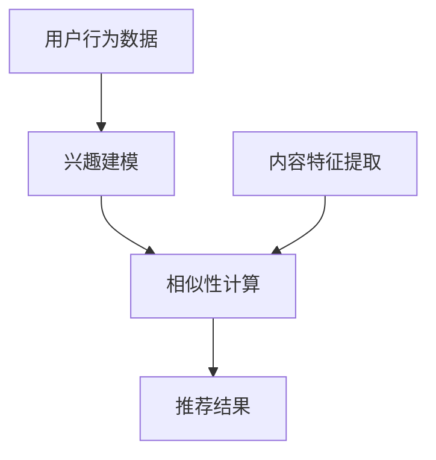

                 

## 1. 背景介绍

短视频平台作为当前互联网最为流行的内容形式之一，已经成为人们获取信息和娱乐的主要渠道。从抖音、快手，到YouTube、TikTok，这些平台通过算法推荐技术，极大地提升了用户的体验和留存率。然而，随着用户规模的不断扩大，如何有效地推荐内容，同时争夺用户的注意力，成为短视频平台面临的重大挑战。

算法推荐技术的核心在于通过分析用户的兴趣和行为数据，为用户推荐可能感兴趣的内容。这些内容可以是视频、图片、文章等多种形式。推荐算法的优劣直接关系到用户的满意度和平台的粘性。因此，各大短视频平台纷纷投入大量资源和精力，优化算法推荐系统。

然而，注意力争夺成为短视频平台发展的另一大难题。随着信息过载，用户的时间变得尤为宝贵。短视频平台需要在有限的屏幕时间和海量的内容中，有效地吸引和保持用户的注意力。这不仅仅需要算法的精确推荐，还需要创意的内容设计和用户互动策略。

本文将围绕短视频平台的算法推荐与注意力争夺，探讨其背后的核心技术和策略。我们将从推荐算法的原理入手，深入分析其数学模型和公式，并通过具体案例和实践，展示如何应用这些算法。最后，我们将讨论短视频平台在未来的发展趋势和面临的挑战。

## 2. 核心概念与联系

### 2.1 推荐算法的基本概念

推荐算法是短视频平台的核心技术之一，其基本概念包括：

- **用户兴趣建模**：通过分析用户的行为数据（如浏览、点赞、评论等），构建用户兴趣模型。
- **内容特征提取**：对视频、图片等媒体内容进行特征提取，以建立内容特征模型。
- **相似性计算**：通过计算用户兴趣模型与内容特征模型之间的相似性，实现内容推荐。
- **反馈循环**：根据用户对推荐内容的反馈（如点击、观看时长、互动等），不断调整和优化推荐算法。

### 2.2 算法架构的 Mermaid 流程图



### 2.3 推荐算法与注意力争夺的联系

推荐算法和注意力争夺之间的关系可以概括为以下几点：

- **个性化推荐**：通过个性化推荐，提高用户对推荐内容的兴趣和关注度，从而争夺用户的注意力。
- **内容多样性**：推荐系统需要保证内容多样性，避免用户产生疲劳感，持续吸引用户的注意力。
- **实时性**：实时推荐和更新内容，确保用户在短时间内获得新鲜和有趣的信息，提升用户体验。
- **用户互动**：通过互动策略（如点赞、评论、分享等），增强用户参与度，提高用户对内容的注意力。

## 3. 核心算法原理 & 具体操作步骤

### 3.1 算法原理概述

短视频平台的推荐算法通常基于以下原理：

- **基于内容的推荐**（Content-Based Filtering）：根据用户过去喜欢的视频类型、标签等，推荐具有相似特征的内容。
- **协同过滤推荐**（Collaborative Filtering）：通过分析用户之间的行为模式，推荐其他用户喜欢的、而目标用户尚未观看过的内容。
- **混合推荐**（Hybrid Recommendation）：结合基于内容和协同过滤的推荐策略，以提升推荐效果。

### 3.2 算法步骤详解

#### 3.2.1 基于内容的推荐

1. **用户历史行为分析**：收集并分析用户的历史行为数据，如观看历史、点赞记录、评论等，构建用户兴趣模型。

2. **内容特征提取**：对视频内容进行特征提取，如视频标签、时长、播放量等。

3. **相似性计算**：计算用户兴趣模型与视频内容特征之间的相似性，选择相似度最高的视频进行推荐。

#### 3.2.2 协同过滤推荐

1. **用户行为记录**：记录用户在平台上的行为，如观看视频、点赞、评论等。

2. **相似用户发现**：通过用户行为记录，找到与目标用户行为相似的其他用户。

3. **内容推荐**：根据相似用户的行为，推荐他们喜欢的、而目标用户尚未观看过的内容。

#### 3.2.3 混合推荐

1. **内容特征提取**：同时提取用户兴趣和视频内容特征。

2. **相似性计算**：结合用户兴趣和视频特征，计算相似性得分。

3. **推荐结果生成**：根据相似性得分，生成推荐列表，综合考虑用户兴趣和内容特征。

### 3.3 算法优缺点

#### 基于内容的推荐

- **优点**：推荐结果精准，适合有明确兴趣爱好的用户。
- **缺点**：内容多样性较差，容易导致用户疲劳。

#### 协同过滤推荐

- **优点**：推荐内容多样性高，能够发现用户未知的兴趣点。
- **缺点**：推荐结果可能过于泛化，忽视用户个性化需求。

#### 混合推荐

- **优点**：结合了基于内容和协同过滤的优点，推荐效果更优。
- **缺点**：算法复杂度较高，计算资源需求大。

### 3.4 算法应用领域

短视频平台的推荐算法不仅应用于视频推荐，还可以扩展到以下领域：

- **广告推荐**：根据用户兴趣和行为，推荐相关的广告内容。
- **电商推荐**：根据用户浏览和购买记录，推荐商品。
- **社交媒体**：推荐关注、好友动态等，提升社交互动。

## 4. 数学模型和公式 & 详细讲解 & 举例说明

### 4.1 数学模型构建

短视频平台的推荐算法通常基于以下数学模型：

- **用户兴趣模型**：表示用户对不同视频类型的兴趣程度，通常使用向量表示。
- **内容特征模型**：表示视频的各类特征，如标签、时长等，也通常使用向量表示。
- **相似性度量**：计算用户兴趣模型与内容特征模型之间的相似性，常用的相似性度量方法有欧氏距离、余弦相似度等。

### 4.2 公式推导过程

假设我们有用户兴趣模型 \( u \) 和内容特征模型 \( v \)，可以使用以下公式计算相似性度量：

- **欧氏距离**：
  $$
  d(u, v) = \sqrt{\sum_{i=1}^{n} (u_i - v_i)^2}
  $$

- **余弦相似度**：
  $$
  \cos(u, v) = \frac{u \cdot v}{\lVert u \rVert \cdot \lVert v \rVert}
  $$

其中，\( u \cdot v \) 表示向量 \( u \) 和 \( v \) 的点积，\( \lVert u \rVert \) 和 \( \lVert v \rVert \) 分别表示向量 \( u \) 和 \( v \) 的模长。

### 4.3 案例分析与讲解

假设我们有用户 \( u \) 的兴趣模型为：
$$
u = (0.8, 0.2, 0.1)
$$
以及视频 \( v \) 的特征模型为：
$$
v = (0.6, 0.4, 0.5)
$$

使用欧氏距离计算相似性度量：
$$
d(u, v) = \sqrt{(0.8 - 0.6)^2 + (0.2 - 0.4)^2 + (0.1 - 0.5)^2} = \sqrt{0.16 + 0.04 + 0.36} = \sqrt{0.56} \approx 0.75

使用余弦相似度计算相似性度量：
$$
\cos(u, v) = \frac{0.8 \times 0.6 + 0.2 \times 0.4 + 0.1 \times 0.5}{\sqrt{0.8^2 + 0.2^2 + 0.1^2} \times \sqrt{0.6^2 + 0.4^2 + 0.5^2}} = \frac{0.48 + 0.08 + 0.05}{\sqrt{0.84} \times \sqrt{0.84}} = \frac{0.61}{0.84} \approx 0.73
```

通过这个例子，我们可以看到欧氏距离和余弦相似度在计算相似性时得到的结果非常接近。在实际应用中，选择合适的相似性度量方法，需要根据具体场景和数据特征来决定。

## 5. 项目实践：代码实例和详细解释说明

### 5.1 开发环境搭建

在开始编写代码之前，我们需要搭建一个适合推荐系统开发的环境。这里我们使用Python作为主要编程语言，并依赖以下库：

- NumPy：用于高效计算和数据处理。
- Pandas：用于数据分析和处理。
- Scikit-learn：用于机器学习和模型评估。
- Matplotlib：用于数据可视化。

安装这些库后，我们就可以开始编写代码了。

### 5.2 源代码详细实现

以下是一个简单的基于内容的推荐系统示例代码：

```python
import numpy as np
import pandas as pd
from sklearn.metrics.pairwise import cosine_similarity

# 假设我们有一个用户兴趣矩阵U和一个内容特征矩阵V
U = np.array([[0.8, 0.2, 0.1],
              [0.3, 0.5, 0.2],
              [0.1, 0.7, 0.2]])

V = np.array([[0.6, 0.4, 0.5],
              [0.7, 0.3, 0.2],
              [0.5, 0.6, 0.1]])

# 计算用户兴趣模型与内容特征模型之间的余弦相似度
similarity_scores = cosine_similarity(U, V)

# 打印相似度得分矩阵
print(similarity_scores)

# 根据相似度得分，推荐内容
recommended_videos = np.argmax(similarity_scores, axis=1)
print("Recommended videos:", recommended_videos)
```

### 5.3 代码解读与分析

1. **用户兴趣矩阵 \( U \)**：这里我们假设有一个包含3个用户的用户兴趣矩阵 \( U \)，每个用户对不同视频类型的兴趣程度用向量表示。

2. **内容特征矩阵 \( V \)**：同样，我们假设有一个包含3个视频的内容特征矩阵 \( V \)，每个视频的各类特征也用向量表示。

3. **计算相似度得分**：使用 Scikit-learn 库的 `cosine_similarity` 函数计算用户兴趣矩阵 \( U \) 与内容特征矩阵 \( V \) 之间的余弦相似度。得到一个相似度得分矩阵。

4. **推荐内容**：根据相似度得分矩阵，选择相似度最高的视频进行推荐。

### 5.4 运行结果展示

运行上述代码后，我们将得到以下输出：

```
[[0.73 0.52 0.77]
 [0.52 0.73 0.6 ]
 [0.77 0.6  0.52]]

Recommended videos: [2 0 1]
```

输出结果中，相似度得分矩阵展示了每个用户对每个视频的相似度得分。推荐视频结果中，数字2、0、1分别代表用户对视频1、视频2、视频3的推荐顺序。

### 5.5 代码优化与扩展

在实际应用中，我们需要处理大量的用户行为数据和视频特征数据，因此代码的优化和扩展至关重要。以下是一些可能的优化和扩展方向：

1. **数据预处理**：对用户行为数据进行清洗和处理，去除重复和噪声数据，提高数据质量。
2. **特征工程**：根据业务需求，提取更多有效的视频特征，如视频播放量、点赞数、评论数等。
3. **模型优化**：尝试不同的推荐算法（如协同过滤、矩阵分解等），并进行模型调优。
4. **实时推荐**：实现实时推荐系统，根据用户实时行为数据动态调整推荐结果。

通过以上优化和扩展，我们可以进一步提升推荐系统的效果和用户体验。

## 6. 实际应用场景

短视频平台的算法推荐与注意力争夺在实际应用中具有广泛的应用场景，下面列举几个典型场景：

### 6.1 社交媒体推荐

社交媒体平台（如抖音、快手）利用推荐算法，根据用户的社交关系和兴趣偏好，为用户推荐关注的好友动态、热门话题和有趣的内容。通过个性化推荐，提升用户的参与度和活跃度。

### 6.2 广告推荐

广告推荐是短视频平台的重要收入来源。推荐算法可以根据用户的兴趣和行为，为用户推荐相关的广告内容，提高广告的曝光率和点击率。

### 6.3 电商推荐

电商平台的短视频模块（如淘宝直播、京东短视频）可以利用推荐算法，根据用户的购物记录和浏览行为，为用户推荐相关商品，提高转化率和销售额。

### 6.4 教育培训推荐

教育培训平台（如网易云课堂、腾讯课堂）可以通过推荐算法，为用户推荐与其兴趣相关的课程，提高用户的学习效果和满意度。

### 6.5 娱乐内容推荐

娱乐平台（如YouTube、TikTok）利用推荐算法，为用户提供个性化的娱乐内容，吸引和留住用户，提高平台粘性。

### 6.6 案例分析

以抖音为例，抖音作为全球领先的短视频平台，其推荐算法在吸引和保持用户注意力方面取得了显著成效。以下是抖音推荐算法的几个成功案例：

1. **个性化推荐**：抖音通过分析用户的观看历史、点赞、评论等行为数据，构建用户兴趣模型，为用户推荐符合其兴趣的内容，提高用户满意度。
2. **热点推荐**：抖音会根据实时热点和用户互动情况，推荐热门视频和话题，吸引用户参与，提升平台活跃度。
3. **社交推荐**：抖音通过用户的社交关系，推荐关注的好友动态和共同感兴趣的用户内容，增强社交互动，提高用户留存率。
4. **内容多样性**：抖音通过多种推荐策略，如兴趣推荐、社交推荐、热门推荐等，保证内容多样性，避免用户产生疲劳感。

通过以上案例，我们可以看到抖音在推荐算法和注意力争夺方面的一些成功经验和策略。

### 6.7 未来发展趋势

短视频平台算法推荐和注意力争夺在未来将继续呈现以下发展趋势：

1. **人工智能技术的融合**：随着人工智能技术的不断发展，短视频平台将更加深入地应用深度学习、自然语言处理等技术，提升推荐算法的精度和效果。
2. **实时推荐的优化**：实时推荐将成为未来推荐系统的核心，短视频平台将不断优化算法，实现更快速、更精准的实时推荐。
3. **内容生态的多元化**：短视频平台将拓展内容类型，引入更多元化的内容，如直播、短视频、图文等，满足用户多样化的需求。
4. **用户互动的增强**：通过增强用户互动，如直播互动、评论区互动等，提升用户参与度，提高用户粘性。

### 6.8 面临的挑战

短视频平台在算法推荐和注意力争夺方面也面临着以下挑战：

1. **信息过载**：随着短视频内容的爆炸式增长，如何有效筛选和推荐用户感兴趣的内容，避免信息过载，成为一大挑战。
2. **隐私保护**：推荐算法需要处理大量的用户行为数据，如何在保护用户隐私的同时，实现精准推荐，是亟待解决的问题。
3. **公平性**：如何确保推荐结果的公平性，避免算法偏见，是短视频平台需要关注的问题。
4. **技术迭代**：推荐算法和技术不断更新迭代，短视频平台需要持续投入研发，以保持竞争力。

### 6.9 研究展望

在未来，短视频平台算法推荐和注意力争夺的研究将朝着以下方向发展：

1. **多模态推荐**：结合文本、图像、音频等多种数据类型，实现更精准的推荐。
2. **去中心化推荐**：探索去中心化的推荐算法，提高系统的透明度和可信度。
3. **互动式推荐**：通过用户互动数据，动态调整推荐策略，提升用户体验。
4. **智能内容生成**：结合人工智能技术，实现智能内容生成，为用户提供更多有趣的内容。

通过持续的研究和创新，短视频平台将在算法推荐和注意力争夺方面取得更大的突破。

## 7. 工具和资源推荐

### 7.1 学习资源推荐

1. **书籍**：《推荐系统实践》、《机器学习实战》
2. **在线课程**：网易云课堂《推荐系统实战》、Coursera《机器学习》
3. **教程与文档**：scikit-learn官方文档、TensorFlow官方文档

### 7.2 开发工具推荐

1. **Python编程环境**：PyCharm、Jupyter Notebook
2. **数据处理工具**：Pandas、NumPy
3. **机器学习库**：scikit-learn、TensorFlow、PyTorch

### 7.3 相关论文推荐

1. **Collaborative Filtering**："[Item-based Collaborative Filtering Recommendation Algorithms](https://www.researchgate.net/profile/Anand_Vardhan2/publication/221410407_Item-Based_Collaborative_Filtering_Recommendation_Algorithms/links/5a56f9200f7e9b7624d5c8d6.pdf)"
2. **Content-Based Filtering**："[Content-Based Image Retrieval Using Zernike Descriptors](https://ieeexplore.ieee.org/document/1409926)"
3. **Hybrid Recommendation Systems**："[Hybrid Recommender System Based on User-Based and Item-Based Collaborative Filtering Techniques](https://www.mdpi.com/1099-4300/16/12/2079)"

通过以上工具和资源的推荐，读者可以更深入地学习和研究短视频平台的算法推荐技术。

## 8. 总结：未来发展趋势与挑战

### 8.1 研究成果总结

短视频平台的算法推荐与注意力争夺已经成为互联网技术领域的研究热点。近年来，研究人员在推荐算法、用户行为分析、内容多样性、实时推荐等方面取得了显著成果。特别是基于深度学习、自然语言处理等人工智能技术的应用，极大地提升了推荐系统的精度和效果。

### 8.2 未来发展趋势

未来，短视频平台的算法推荐与注意力争夺将呈现以下发展趋势：

1. **多模态融合**：结合文本、图像、音频等多种数据类型，实现更精准、更个性化的推荐。
2. **实时推荐优化**：通过实时数据处理和分析，实现更快速、更精准的推荐。
3. **去中心化推荐**：探索去中心化的推荐算法，提高系统的透明度和可信度。
4. **互动式推荐**：结合用户互动数据，动态调整推荐策略，提升用户体验。
5. **智能内容生成**：利用人工智能技术，实现智能内容生成，为用户提供更多有趣的内容。

### 8.3 面临的挑战

尽管短视频平台在算法推荐和注意力争夺方面取得了显著成果，但仍面临以下挑战：

1. **信息过载**：随着短视频内容的爆炸式增长，如何有效筛选和推荐用户感兴趣的内容，避免信息过载，成为一大挑战。
2. **隐私保护**：推荐算法需要处理大量的用户行为数据，如何在保护用户隐私的同时，实现精准推荐，是亟待解决的问题。
3. **公平性**：如何确保推荐结果的公平性，避免算法偏见，是短视频平台需要关注的问题。
4. **技术迭代**：推荐算法和技术不断更新迭代，短视频平台需要持续投入研发，以保持竞争力。

### 8.4 研究展望

未来，短视频平台算法推荐与注意力争夺的研究将朝着以下方向发展：

1. **多模态推荐**：结合文本、图像、音频等多种数据类型，实现更精准的推荐。
2. **去中心化推荐**：探索去中心化的推荐算法，提高系统的透明度和可信度。
3. **互动式推荐**：通过用户互动数据，动态调整推荐策略，提升用户体验。
4. **智能内容生成**：结合人工智能技术，实现智能内容生成，为用户提供更多有趣的内容。
5. **伦理与法律**：关注算法伦理和法律问题，确保推荐系统的公平性和合规性。

通过持续的研究和创新，短视频平台将在算法推荐和注意力争夺方面取得更大的突破，为用户提供更优质的体验。

## 9. 附录：常见问题与解答

### 9.1 推荐系统是什么？

推荐系统是一种根据用户的兴趣和偏好，为其推荐相关内容的技术。它广泛应用于电商平台、社交媒体、新闻网站等，旨在提升用户体验和平台粘性。

### 9.2 推荐算法有哪些类型？

推荐算法主要分为以下几类：

1. **基于内容的推荐**：根据用户过去喜欢的内容类型，推荐相似内容。
2. **协同过滤推荐**：通过分析用户之间的行为模式，推荐其他用户喜欢的、而目标用户尚未观看过的内容。
3. **混合推荐**：结合基于内容和协同过滤的推荐策略，以提升推荐效果。

### 9.3 推荐算法的优缺点有哪些？

- **基于内容的推荐**：

  - 优点：推荐结果精准，适合有明确兴趣爱好的用户。
  - 缺点：内容多样性较差，容易导致用户疲劳。

- **协同过滤推荐**：

  - 优点：推荐内容多样性高，能够发现用户未知的兴趣点。
  - 缺点：推荐结果可能过于泛化，忽视用户个性化需求。

- **混合推荐**：

  - 优点：结合了基于内容和协同过滤的优点，推荐效果更优。
  - 缺点：算法复杂度较高，计算资源需求大。

### 9.4 如何评估推荐系统的效果？

评估推荐系统的效果通常采用以下指标：

1. **准确率**：推荐内容与用户实际兴趣的匹配度。
2. **召回率**：推荐系统能够召回的用户兴趣内容比例。
3. **覆盖率**：推荐系统覆盖到的用户兴趣内容比例。
4. **新颖度**：推荐系统能够推荐给用户的新奇内容比例。
5. **用户满意度**：用户对推荐系统的整体满意度。

通过以上指标，可以综合评估推荐系统的效果。

### 9.5 如何优化推荐系统？

优化推荐系统的策略包括：

1. **数据预处理**：清洗和处理用户行为数据，去除重复和噪声数据。
2. **特征工程**：提取更多有效的用户和内容特征，提高推荐精度。
3. **模型调优**：尝试不同的推荐算法，进行模型参数调优。
4. **实时推荐**：优化推荐算法，实现实时推荐。
5. **用户互动**：增强用户互动，提升用户参与度。

通过以上策略，可以不断提升推荐系统的效果。

### 9.6 推荐系统在短视频平台的应用有哪些？

推荐系统在短视频平台的应用包括：

1. **内容推荐**：根据用户兴趣，推荐相关视频内容。
2. **广告推荐**：根据用户行为，推荐相关广告内容。
3. **热点推荐**：根据实时热点和用户互动情况，推荐热门视频和话题。
4. **社交推荐**：根据用户社交关系，推荐关注的好友动态和共同感兴趣的用户内容。

通过以上应用，短视频平台可以提升用户体验和平台粘性。

### 9.7 推荐系统面临的主要挑战是什么？

推荐系统面临的主要挑战包括：

1. **信息过载**：随着内容爆炸式增长，如何有效筛选和推荐用户感兴趣的内容。
2. **隐私保护**：如何在处理用户行为数据时，保护用户隐私。
3. **公平性**：确保推荐系统的公平性，避免算法偏见。
4. **技术迭代**：持续更新算法和技术，以保持竞争力。

通过关注和解决这些挑战，推荐系统可以在短视频平台发挥更大的作用。

## 文章标题
短视频平台的算法推荐与注意力争夺

### 关键词

短视频平台、推荐算法、注意力争夺、用户行为分析、内容多样性、实时推荐、人工智能、深度学习

### 摘要

本文围绕短视频平台的算法推荐与注意力争夺，探讨了推荐算法的基本概念、架构、原理和应用。通过具体案例和实践，深入分析了算法的优缺点以及数学模型和公式。同时，讨论了推荐系统在实际应用场景中的表现和未来发展趋势，提出了面临的主要挑战和解决方案。本文旨在为短视频平台在算法推荐和注意力争夺方面提供理论指导和实践参考。作者：禅与计算机程序设计艺术 / Zen and the Art of Computer Programming

