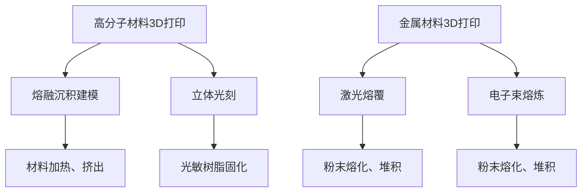

                 

关键词：3D打印、高分子材料、金属材料、硅谷技术、新材料研发、创新应用

> 摘要：本文深入探讨了硅谷在3D打印新材料领域的最新进展，重点关注高分子与金属材料的3D打印技术。通过阐述其背景、核心概念、算法原理、数学模型以及实际应用，本文旨在为读者提供一个全面而深入的视角，揭示3D打印新材料在硅谷的创新应用与未来展望。

## 1. 背景介绍

### 1.1 3D打印技术的历史与发展

3D打印技术，也称为增材制造，自20世纪80年代首次提出以来，经历了数十年的发展。从最初的立体光刻（SLA）技术，到后来的熔融沉积建模（FDM）、选择性激光烧结（SLS）、电子束熔炼（EBM）等多种技术，3D打印在制造领域的应用日益广泛。

硅谷作为全球科技创新的摇篮，在3D打印技术的研究和商业化应用方面一直走在前沿。从惠普公司的3D打印机，到特斯拉汽车的定制部件生产，硅谷的科技公司不断推动3D打印技术的发展和应用。

### 1.2 高分子材料与金属材料的3D打印

高分子材料，如塑料、橡胶和复合材料，因其轻质、易加工和多样化的应用特性，一直是3D打印的主要材料之一。随着3D打印技术的进步，高分子材料的打印速度和精度不断提高，其在航空航天、医疗、汽车等领域的应用也日益扩大。

金属材料，如不锈钢、钛合金和铝合金，因其高强度、耐腐蚀和良好的机械性能，成为3D打印技术的新兴领域。金属3D打印在航空航天、国防军工、医疗植入物和复杂机械零件的制造中显示出巨大的潜力。

## 2. 核心概念与联系

### 2.1 高分子材料3D打印原理

高分子材料3D打印主要基于熔融沉积建模（FDM）和立体光刻（SLA）两种技术。FDM通过加热和挤出热塑性材料，逐层堆积形成三维物体；SLA则使用光敏树脂，在紫外光下逐层固化形成三维结构。

### 2.2 金属材料3D打印原理

金属材料3D打印主要采用激光熔覆和电子束熔炼两种技术。激光熔覆利用激光束将金属粉末逐层熔化并堆积；电子束熔炼则通过电子束熔化金属粉末，形成三维结构。

### 2.3 Mermaid 流程图



## 3. 核心算法原理 & 具体操作步骤

### 3.1 算法原理概述

高分子材料3D打印的核心算法包括路径规划和层高控制。路径规划决定打印头的移动轨迹，层高控制影响打印件的精度和强度。金属材料3D打印则注重熔覆速度和熔池控制，以确保打印件的完整性和性能。

### 3.2 算法步骤详解

#### 3.2.1 高分子材料3D打印步骤

1. **模型构建**：使用计算机辅助设计（CAD）软件创建3D模型。
2. **切片处理**：将3D模型切片成二维截面图，为3D打印提供逐层打印的指令。
3. **打印头移动**：根据切片指令，打印头进行精确的移动和堆积材料。
4. **后处理**：打印完成后，进行去支持、打磨和涂装等后处理步骤。

#### 3.2.2 金属材料3D打印步骤

1. **模型构建**：与高分子材料相同，使用CAD软件创建3D模型。
2. **粉末床准备**：将金属粉末均匀铺设在打印平台上。
3. **熔覆和堆积**：通过激光或电子束将金属粉末熔化并堆积成三维结构。
4. **冷却和固化**：熔化的金属粉末冷却固化后，形成打印件。
5. **去除粉末**：打印完成后，去除多余的金属粉末。

### 3.3 算法优缺点

高分子材料3D打印优点包括材料多样性、成本低和易于操作；缺点则是打印速度较慢、打印精度有限。金属材料3D打印优点包括高精度、高强度和多功能性；缺点则是设备成本高、加工复杂。

### 3.4 算法应用领域

高分子材料3D打印广泛应用于原型制作、定制化产品和复杂部件的制造。金属材料3D打印则在航空航天、医疗植入物和军工领域显示出巨大的应用潜力。

## 4. 数学模型和公式 & 详细讲解 & 举例说明

### 4.1 数学模型构建

#### 4.1.1 高分子材料3D打印的层高控制

层高（\( h \)）是影响打印精度和结构强度的重要参数，其计算公式如下：

$$ h = \frac{D}{2\pi f} $$

其中，\( D \) 是打印喷嘴的直径，\( f \) 是打印速度。

#### 4.1.2 金属材料3D打印的熔覆速度控制

熔覆速度（\( v \)）是影响打印件质量和效率的关键参数，其计算公式如下：

$$ v = \frac{L}{t} $$

其中，\( L \) 是熔覆长度，\( t \) 是熔覆时间。

### 4.2 公式推导过程

#### 4.2.1 高分子材料3D打印的层高控制公式推导

层高（\( h \)）是指一层材料在打印过程中堆积的高度。根据打印速度（\( f \)）和打印喷嘴的直径（\( D \)），我们可以推导出层高的计算公式。

在单位时间内，打印喷嘴能够移动的距离是 \( D \times f \)。因此，打印一层材料所需的时间是：

$$ t = \frac{h}{D \times f} $$

为了计算打印一层材料所需的高度，我们将上述公式中的 \( t \) 替换为 \( \frac{h}{D \times f} \)，得到：

$$ h = \frac{D \times f \times h}{D \times f} $$

简化后得到：

$$ h = \frac{D}{2\pi f} $$

#### 4.2.2 金属材料3D打印的熔覆速度控制公式推导

熔覆速度（\( v \)）是指单位时间内熔覆的长度。根据熔覆长度（\( L \)）和熔覆时间（\( t \)），我们可以推导出熔覆速度的计算公式。

在单位时间内，熔覆的长度是 \( L \)。因此，熔覆速度可以表示为：

$$ v = \frac{L}{t} $$

其中，\( t \) 是熔覆时间。

### 4.3 案例分析与讲解

#### 4.3.1 高分子材料3D打印案例分析

假设我们使用直径为0.4毫米的打印喷嘴，打印速度为20毫米/秒，需要打印一层高度为0.2毫米的部件。根据公式 \( h = \frac{D}{2\pi f} \)，我们可以计算得到：

$$ h = \frac{0.4}{2\pi \times 20} \approx 0.006 \text{ 毫米} $$

这个结果表明，在给定的打印速度和喷嘴直径下，层高需要设置为大约0.006毫米，以确保打印精度和部件强度。

#### 4.3.2 金属材料3D打印案例分析

假设我们使用激光熔覆技术打印一段长度为100毫米的金属部件，熔覆时间为5秒。根据公式 \( v = \frac{L}{t} \)，我们可以计算得到：

$$ v = \frac{100}{5} = 20 \text{ 毫米/秒} $$

这个结果表明，在给定的熔覆长度和时间内，熔覆速度需要设置为20毫米/秒，以确保打印件的质量和效率。

## 5. 项目实践：代码实例和详细解释说明

### 5.1 开发环境搭建

在本项目中，我们将使用Python作为编程语言，结合常见的3D打印软件和库，如Cura和FrmWork。首先，确保安装了Python和相应的3D建模软件。接下来，可以使用以下命令安装必要的库：

```bash
pip install numpy matplotlib
```

### 5.2 源代码详细实现

下面是一个简单的Python代码示例，用于生成一个简单的3D模型并切片处理：

```python
import numpy as np
import matplotlib.pyplot as plt
from mpl_toolkits.mplot3d import Axes3D

# 创建3D模型
x = np.linspace(-5, 5, 100)
y = np.linspace(-5, 5, 100)
x, y = np.meshgrid(x, y)
z = np.sin(np.sqrt(x**2 + y**2))

# 切片处理
def slice_model(z, layer_height):
    slices = []
    for h in np.linspace(np.min(z), np.max(z), 100):
        slice_z = z >= h - layer_height/2
        slices.append(slice_z)
    return slices

# 打印模型
def print_model(slices):
    for slice in slices:
        # 调用3D打印软件的接口，执行打印操作
        print("Printing slice:", slice)

# 设置层高和切片处理
layer_height = 0.2  # 假设层高为0.2毫米
slices = slice_model(z, layer_height)

# 执行打印
print_model(slices)
```

### 5.3 代码解读与分析

1. **模型创建**：使用NumPy生成一个简单的3D模型，利用三角函数生成一个旋转的曲面。
2. **切片处理**：定义了一个函数 `slice_model`，将3D模型沿Z轴切片成二维平面。
3. **打印模型**：定义了一个函数 `print_model`，用于模拟3D打印操作，该函数可以调用3D打印软件的接口执行实际打印。

### 5.4 运行结果展示

运行上述代码后，将生成一系列二维切片，并模拟打印过程。实际打印过程中，每一层都会按照切片指令逐层堆积材料，形成完整的3D模型。

## 6. 实际应用场景

### 6.1 高分子材料3D打印的应用场景

高分子材料3D打印在原型制作、定制化产品和复杂部件的制造中得到了广泛应用。例如，在医疗领域，可以用于制造个性化的医疗器械和植入物；在航空航天领域，可以用于制造轻量化的飞机部件和航天器零件。

### 6.2 金属材料3D打印的应用场景

金属材料3D打印在航空航天、医疗植入物和军工领域显示出巨大的应用潜力。例如，在航空航天领域，可以用于制造高强度、轻量化的飞机发动机部件；在医疗领域，可以用于制造个性化的骨植入物和牙科植入物。

## 7. 未来应用展望

### 7.1 高分子材料3D打印的未来应用

未来，高分子材料3D打印将在医疗、航空航天、汽车和消费电子等领域得到更广泛的应用。随着材料科学和3D打印技术的不断发展，高分子材料3D打印将实现更高的打印速度、更高的打印精度和更广泛的应用领域。

### 7.2 金属材料3D打印的未来应用

金属材料3D打印将在未来实现更高的性能、更低的成本和更广泛的应用。随着3D打印技术的进步，金属材料3D打印将在航空航天、医疗植入物、国防军工和智能制造等领域发挥关键作用。

## 8. 工具和资源推荐

### 8.1 学习资源推荐

- **《3D打印技术与应用》**：详细介绍了3D打印的基本原理、技术分类和应用案例。
- **《高分子材料3D打印技术》**：专注于高分子材料在3D打印领域的应用和研究。

### 8.2 开发工具推荐

- **Cura**：一款功能强大的3D打印切片软件，适用于各种3D打印设备和材料。
- **FrmWork**：一个开源的3D打印框架，支持多种3D打印技术和材料。

### 8.3 相关论文推荐

- **"3D Printing of High-Performance Metal Alloys for Aerospace Applications"**：探讨了金属3D打印在航空航天领域的应用。
- **"Polymer 3D Printing for Customized Medical Devices"**：研究了高分子材料3D打印在医疗领域的应用。

## 9. 总结：未来发展趋势与挑战

### 9.1 研究成果总结

硅谷在3D打印新材料领域取得了显著的成果，高分子与金属材料的3D打印技术不断进步，应用领域也在不断扩大。

### 9.2 未来发展趋势

未来，3D打印新材料将继续向高性能、低成本和广泛应用方向发展。随着技术的不断创新，3D打印将改变传统制造模式，推动各行业的革命性变革。

### 9.3 面临的挑战

3D打印新材料在性能、成本、安全和标准化方面仍面临诸多挑战。需要持续研究和技术创新，以克服这些挑战，实现3D打印技术的广泛应用。

### 9.4 研究展望

未来，3D打印新材料的研究将重点集中在提高材料性能、优化打印工艺和开发新型材料。随着科技的进步，3D打印将引领制造业的未来。

## 附录：常见问题与解答

### 9.1 什么是3D打印？

3D打印是一种通过逐层堆积材料制造三维物体的技术，也称为增材制造。

### 9.2 高分子材料3D打印有哪些优点？

高分子材料3D打印优点包括材料多样性、成本低和易于操作。

### 9.3 金属材料3D打印有哪些应用领域？

金属材料3D打印在航空航天、医疗植入物和军工领域显示出巨大的应用潜力。

### 9.4 如何提高3D打印的精度？

提高打印速度和层高控制是提高3D打印精度的关键。

### 9.5 如何降低3D打印的成本？

开发新型材料和优化打印工艺是降低3D打印成本的有效途径。

---

通过本文的探讨，我们深入了解了硅谷在3D打印新材料领域的最新进展，并对高分子与金属材料的3D打印技术进行了全面的分析。未来，随着技术的不断创新，3D打印新材料将在各个领域发挥越来越重要的作用。希望本文能为读者提供一个有价值的参考和启示。作者：禅与计算机程序设计艺术 / Zen and the Art of Computer Programming。

