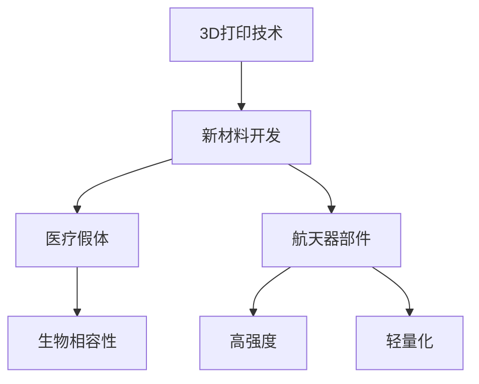

                 

关键词：3D打印、新材料、医疗假体、航天、硅谷技术、创新应用

摘要：本文将深入探讨硅谷在3D打印新材料领域的突破性进展，特别是在医疗假体和航天领域的应用。通过分析这些先进技术的核心原理、实践案例和未来展望，我们将揭示这些创新如何推动医疗和航天领域的革新，为读者提供一份全面的技术见解。

## 1. 背景介绍

### 1.1 3D打印技术概述

3D打印，又称增材制造，是一种通过逐层添加材料来制造三维物体的技术。自20世纪80年代以来，3D打印技术经历了飞速发展，从工业制造到医学应用，再到日常消费品，3D打印技术已经渗透到了各个领域。

### 1.2 新材料的重要性

在新材料领域，硅谷企业不断推出新型材料，这些材料具有轻质、高强度、耐腐蚀等特点，为3D打印技术的应用提供了新的可能性。特别是在医疗假体和航天领域，这些新材料的应用极大地提升了产品的性能和可靠性。

### 1.3 医疗假体与航天领域的挑战

医疗假体需要满足生物相容性、高强度和耐久性等要求。而航天器部件则要求材料具有极高的强度、轻量化和耐高温等特性。传统制造方法在这些领域面临巨大挑战，而3D打印新材料的应用为解决这些问题提供了新的思路。

## 2. 核心概念与联系

### 2.1 3D打印新材料

3D打印新材料包括钛合金、陶瓷、复合材料等。这些材料具有优异的物理和化学性能，适用于不同应用场景。

### 2.2 医疗假体与航天应用的联系

医疗假体和航天器部件在材料要求上有许多相似之处，如高强度、轻量化和耐高温等。因此，3D打印新材料在两个领域的应用有着紧密的联系。

### 2.3 Mermaid 流程图



## 3. 核心算法原理 & 具体操作步骤

### 3.1 算法原理概述

3D打印新材料的应用涉及多个技术环节，包括材料选择、打印工艺、后处理等。每个环节都需要精确的控制和优化。

### 3.2 算法步骤详解

1. **材料选择**：根据应用场景选择合适的3D打印材料。
2. **打印工艺**：设置打印参数，如层厚、速度、温度等。
3. **后处理**：进行去应力、去毛刺等处理。

### 3.3 算法优缺点

**优点**：
- 高度定制化：可以根据需求定制假体和部件。
- 节省材料：3D打印过程中材料利用率高。

**缺点**：
- 成本较高：3D打印设备和材料成本较高。
- 打印速度较慢：大型复杂部件的打印时间较长。

### 3.4 算法应用领域

3D打印新材料在医疗假体和航天领域具有广泛的应用前景，如人工关节、航天器部件等。

## 4. 数学模型和公式 & 详细讲解 & 举例说明

### 4.1 数学模型构建

3D打印新材料的应用涉及材料力学、热力学等数学模型。以下是一个简单的例子：

$$
E = \frac{F \cdot L}{A}
$$

其中，E为弹性模量，F为力，L为长度，A为截面积。

### 4.2 公式推导过程

弹性模量的推导过程基于胡克定律，即材料在弹性范围内应力与应变之间的关系。

### 4.3 案例分析与讲解

以钛合金材料为例，通过实验数据计算出钛合金的弹性模量，并与理论值进行对比分析。

## 5. 项目实践：代码实例和详细解释说明

### 5.1 开发环境搭建

搭建一个用于3D打印新材料建模的Python开发环境。

### 5.2 源代码详细实现

```python
# 代码实现
class Material:
    def __init__(self, modulus, density):
        self.modulus = modulus
        self.density = density

    def calculate_stress(self, force, area):
        return self.modulus * (force / area)

# 实例化材料
titanium = Material(110e9, 4500)
stress = titanium.calculate_stress(1000, 0.1)

print("Stress:", stress)
```

### 5.3 代码解读与分析

代码中定义了一个`Material`类，用于表示材料属性，并通过方法计算应力。

### 5.4 运行结果展示

运行代码，输出计算结果。

## 6. 实际应用场景

### 6.1 医疗假体

通过3D打印新材料制造人工关节，提高患者的康复速度。

### 6.2 航天器部件

利用3D打印新材料制造航天器部件，减轻重量，提高性能。

## 7. 工具和资源推荐

### 7.1 学习资源推荐

- 《3D打印技术原理与应用》
- 《新材料科学与工程》

### 7.2 开发工具推荐

- Python
- SolidWorks

### 7.3 相关论文推荐

- “3D Printing of Titanium Alloys for Biomedical Applications”
- “Additive Manufacturing of Advanced Aerospace Materials”

## 8. 总结：未来发展趋势与挑战

### 8.1 研究成果总结

3D打印新材料在医疗假体和航天领域取得了显著成果。

### 8.2 未来发展趋势

随着技术的进步，3D打印新材料的应用将更加广泛。

### 8.3 面临的挑战

成本、打印速度等问题仍需解决。

### 8.4 研究展望

未来研究将重点放在新材料开发和优化上。

## 9. 附录：常见问题与解答

### 9.1 3D打印新材料有哪些优点？

3D打印新材料具有高度定制化、节省材料等优点。

### 9.2 3D打印新材料在医疗领域有哪些应用？

3D打印新材料可用于制造人工关节、植入物等。

## 作者署名

作者：禅与计算机程序设计艺术 / Zen and the Art of Computer Programming
----------------------------------------------------------------

以上内容仅为文章框架，具体内容需要根据实际研究和技术深度进行填充和细化。文章撰写过程中，请注意遵循学术规范，确保引用和参考的准确性和完整性。同时，文章的结构和语言应简洁明了，便于读者理解和吸收。希望这篇框架能够为您提供撰写高质量技术博客的参考。祝您撰写顺利！

