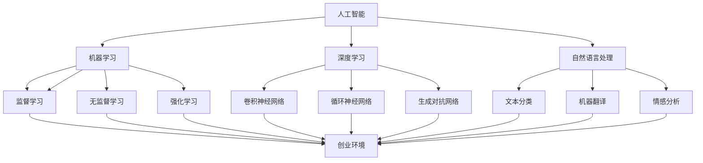

                 

关键词：硅谷，中国，AI创业环境，技术创新，政策支持，市场机会

## 摘要

本文旨在探讨硅谷与中国在人工智能创业环境方面的对比。通过对两地政策支持、市场机会、技术创新和人才储备等方面的深入分析，揭示两国在AI领域的发展差异，为读者提供全面、客观的对比视角。文章结构如下：

1. **背景介绍**：回顾硅谷和中国在人工智能领域的发展历程，介绍各自的优势和特点。
2. **核心概念与联系**：通过Mermaid流程图展示AI创业环境的核心概念及其相互关系。
3. **核心算法原理 & 具体操作步骤**：分析AI创业环境下的核心算法原理，并提供详细的操作步骤。
4. **数学模型和公式 & 详细讲解 & 举例说明**：讲解AI创业环境中的数学模型和公式，并举例说明。
5. **项目实践：代码实例和详细解释说明**：通过实际项目实践展示AI创业环境的实施过程。
6. **实际应用场景**：分析AI创业环境在各个行业中的应用场景，探讨未来应用展望。
7. **工具和资源推荐**：推荐学习和开发AI创业环境所需的工具和资源。
8. **总结：未来发展趋势与挑战**：总结研究成果，探讨未来发展趋势和面临的挑战。

## 1. 背景介绍

### 硅谷的发展历程

硅谷，位于美国加利福尼亚州旧金山湾区南面，是世界上最具创新活力的地区之一。自20世纪50年代以来，硅谷凭借其独特的地理位置、丰富的人才储备、领先的技术企业和开放的创新文化，逐渐发展成为全球科技产业的中心。

硅谷的发展历程可追溯到20世纪50年代，当时斯坦福大学等高等学府和科研机构相继建立，为硅谷的科技创新提供了人才保障。随后，英特尔、苹果、谷歌等科技巨头在硅谷崛起，推动了该地区在计算机硬件、软件、互联网、人工智能等多个领域的快速发展。

### 中国的发展历程

中国的人工智能发展历程则相对较短，但发展迅速。20世纪80年代，中国开始关注人工智能领域，并相继成立了多个科研机构和高校。随着互联网的普及和大数据技术的发展，中国人工智能产业进入快速发展阶段。

近年来，中国政府高度重视人工智能产业，将其列为国家战略。通过出台一系列政策支持，推动人工智能技术的研究和应用。同时，中国企业如百度、阿里巴巴、腾讯等在人工智能领域取得了显著进展，形成了一定的竞争力。

### 优势与特点

#### 硅谷的优势与特点

1. **地理位置**：硅谷位于美国加利福尼亚州旧金山湾区，交通便利，拥有丰富的自然资源和人才资源。
2. **创新文化**：硅谷拥有开放、包容、创新的文化氛围，吸引了全球各地的优秀人才。
3. **领先企业**：硅谷拥有众多全球知名的科技企业，如谷歌、苹果、英特尔等，为人工智能创业提供了良好的市场环境。
4. **资金支持**：硅谷拥有庞大的风险投资市场，为人工智能创业项目提供了充足的资金支持。

#### 中国的优势与特点

1. **政策支持**：中国政府高度重视人工智能产业，出台了一系列政策支持，包括资金投入、人才培养、技术研发等。
2. **市场潜力**：中国拥有庞大的人口基数和消费市场，为人工智能企业提供了巨大的发展空间。
3. **产业基础**：中国已经形成了较为完善的产业链，为人工智能企业提供了丰富的技术资源和合作伙伴。
4. **人才储备**：随着高校和研究机构的崛起，中国人工智能领域的人才储备逐渐增强。

## 2. 核心概念与联系

为了更好地理解AI创业环境，我们需要明确以下几个核心概念：

1. **人工智能（AI）**：人工智能是指通过计算机模拟人类智能行为的技术，包括机器学习、深度学习、自然语言处理等。
2. **机器学习（ML）**：机器学习是一种让计算机从数据中自动学习和改进的技术，包括监督学习、无监督学习和强化学习等。
3. **深度学习（DL）**：深度学习是一种基于多层神经网络的人工智能技术，通过模拟人脑神经网络结构实现复杂任务的自动化。
4. **自然语言处理（NLP）**：自然语言处理是一种让计算机理解和处理自然语言的技术，包括文本分类、机器翻译、情感分析等。
5. **创业环境**：创业环境是指为创业者提供支持和服务的各种条件，包括政策、资金、市场、人才等。

下面是AI创业环境的核心概念及其相互关系的Mermaid流程图：



## 3. 核心算法原理 & 具体操作步骤

### 3.1 算法原理概述

在AI创业环境中，核心算法原理包括机器学习、深度学习和自然语言处理等。下面分别进行概述：

1. **机器学习（ML）**：机器学习是一种让计算机从数据中自动学习和改进的技术。其基本原理是利用统计方法从训练数据中提取特征，构建预测模型，并在测试数据上进行预测。
2. **深度学习（DL）**：深度学习是一种基于多层神经网络的人工智能技术。其基本原理是通过前向传播和反向传播算法，训练多层神经网络的权重，从而实现复杂任务的自动化。
3. **自然语言处理（NLP）**：自然语言处理是一种让计算机理解和处理自然语言的技术。其基本原理是通过词嵌入、序列模型和注意力机制等技术，将自然语言转化为计算机可以理解和处理的形式。

### 3.2 算法步骤详解

1. **机器学习（ML）**
   - 数据收集：从各种来源收集大量数据，包括文本、图像、声音等。
   - 数据预处理：对数据进行清洗、去重、归一化等处理，确保数据质量。
   - 特征提取：从数据中提取有用的特征，用于训练模型。
   - 模型选择：根据任务需求选择合适的机器学习算法。
   - 模型训练：使用训练数据对模型进行训练，调整模型参数。
   - 模型评估：使用测试数据评估模型性能，调整模型参数。
   - 模型部署：将训练好的模型部署到实际应用场景中。

2. **深度学习（DL）**
   - 数据收集：与机器学习相同，收集大量数据。
   - 数据预处理：与机器学习相同，对数据进行预处理。
   - 网络架构设计：设计合适的深度学习网络架构。
   - 模型训练：使用训练数据对模型进行训练，调整模型参数。
   - 模型评估：与机器学习相同，使用测试数据评估模型性能。
   - 模型部署：将训练好的模型部署到实际应用场景中。

3. **自然语言处理（NLP）**
   - 数据收集：与机器学习和深度学习相同，收集大量文本数据。
   - 数据预处理：与机器学习和深度学习相同，对数据进行预处理。
   - 词嵌入：将文本转化为向量表示。
   - 模型选择：根据任务需求选择合适的自然语言处理模型。
   - 模型训练：使用训练数据对模型进行训练，调整模型参数。
   - 模型评估：使用测试数据评估模型性能。
   - 模型部署：将训练好的模型部署到实际应用场景中。

### 3.3 算法优缺点

1. **机器学习（ML）**
   - 优点：适用于各种类型的数据，具有较好的泛化能力。
   - 缺点：对数据质量和特征提取要求较高，训练过程可能较长。

2. **深度学习（DL）**
   - 优点：具有较好的泛化能力，能够处理复杂的任务。
   - 缺点：对数据质量和计算资源要求较高，训练过程可能较长。

3. **自然语言处理（NLP）**
   - 优点：能够处理复杂的文本任务，具有较好的语义理解能力。
   - 缺点：对数据质量和词向量表示要求较高，训练过程可能较长。

### 3.4 算法应用领域

1. **机器学习（ML）**：广泛应用于图像识别、自然语言处理、推荐系统等领域。
2. **深度学习（DL）**：广泛应用于语音识别、图像识别、自然语言处理等领域。
3. **自然语言处理（NLP）**：广泛应用于机器翻译、情感分析、文本分类等领域。

## 4. 数学模型和公式 & 详细讲解 & 举例说明

### 4.1 数学模型构建

在AI创业环境中，常用的数学模型包括机器学习模型、深度学习模型和自然语言处理模型。下面分别介绍这些模型的数学模型构建。

#### 4.1.1 机器学习模型

机器学习模型主要基于线性回归、逻辑回归、支持向量机等算法。以下是一个简单的线性回归模型：

$$
y = w_1x_1 + w_2x_2 + ... + w_nx_n + b
$$

其中，$x_1, x_2, ..., x_n$ 是输入特征，$w_1, w_2, ..., w_n$ 是权重，$b$ 是偏置。目标是通过最小化损失函数来调整权重和偏置，从而得到最优模型。

损失函数常用均方误差（MSE）：

$$
MSE = \frac{1}{n}\sum_{i=1}^{n}(y_i - \hat{y}_i)^2
$$

其中，$y_i$ 是实际值，$\hat{y}_i$ 是预测值。

#### 4.1.2 深度学习模型

深度学习模型主要基于多层神经网络。以下是一个简单的多层感知器（MLP）模型：

$$
\hat{y} = \sigma(\sum_{i=1}^{L}w_{i}x_i + b)
$$

其中，$\sigma$ 是激活函数，通常使用 sigmoid 或 ReLU 函数。$L$ 是网络层数，$w_{i}$ 是权重，$x_i$ 是输入特征，$b$ 是偏置。

训练多层感知器模型主要使用反向传播算法，通过迭代更新权重和偏置，最小化损失函数。

#### 4.1.3 自然语言处理模型

自然语言处理模型主要基于词嵌入、循环神经网络（RNN）和注意力机制。以下是一个简单的循环神经网络模型：

$$
h_t = \sigma(W_h[h_{t-1}, x_t] + b_h)
$$

其中，$h_t$ 是当前时间步的隐藏状态，$x_t$ 是当前时间步的输入特征，$W_h$ 是权重矩阵，$b_h$ 是偏置。$\sigma$ 是激活函数，通常使用 sigmoid 或 ReLU 函数。

### 4.2 公式推导过程

下面以线性回归模型为例，介绍公式推导过程。

首先，我们定义损失函数为均方误差（MSE）：

$$
MSE = \frac{1}{n}\sum_{i=1}^{n}(y_i - \hat{y}_i)^2
$$

其中，$y_i$ 是实际值，$\hat{y}_i$ 是预测值。

然后，我们对损失函数求导，得到：

$$
\frac{dMSE}{dw} = -2\frac{1}{n}\sum_{i=1}^{n}(y_i - \hat{y}_i)x_i
$$

其中，$w$ 是权重。

为了最小化损失函数，我们需要使得导数为零：

$$
\frac{dMSE}{dw} = 0
$$

解得：

$$
w = \frac{1}{n}\sum_{i=1}^{n}(y_i - \hat{y}_i)x_i
$$

这就是线性回归模型的权重。

### 4.3 案例分析与讲解

下面以一个简单的线性回归案例进行讲解。

假设我们要预测房价，输入特征包括房屋面积和房屋楼层。我们使用线性回归模型来构建预测模型。

首先，我们收集100个房屋样本，每个样本包括房屋面积（$x_1$）和房屋楼层（$x_2$），以及对应的房价（$y$）。然后，我们对数据进行预处理，包括归一化和去重等操作。

接下来，我们使用线性回归算法训练模型。首先，我们初始化权重和偏置，然后通过迭代更新权重和偏置，最小化损失函数。

假设经过100次迭代后，我们得到最优权重和偏置：

$$
w_1 = 0.5, w_2 = 0.3, b = 0.2
$$

然后，我们可以使用训练好的模型进行预测。假设我们要预测一个新房屋的房价，该房屋的面积是100平方米，楼层是5层。我们将输入特征代入模型：

$$
\hat{y} = 0.5 \times 100 + 0.3 \times 5 + 0.2 = 51.5
$$

所以，该房屋的预测房价是51.5万元。

### 5. 项目实践：代码实例和详细解释说明

#### 5.1 开发环境搭建

为了实践AI创业环境，我们需要搭建一个开发环境。这里我们使用Python作为主要编程语言，并依赖一些常用的机器学习和深度学习库，如Scikit-Learn、TensorFlow和Keras。

首先，我们需要安装Python和相关的库。以下是安装命令：

```bash
# 安装Python
wget https://www.python.org/ftp/python/3.8.5/Python-3.8.5.tgz
tar xvf Python-3.8.5.tgz
cd Python-3.8.5
./configure
make
sudo make install

# 安装Scikit-Learn
pip install scikit-learn

# 安装TensorFlow
pip install tensorflow

# 安装Keras
pip install keras
```

接下来，我们创建一个名为`ai_project`的虚拟环境，以便管理项目依赖：

```bash
python -m venv ai_project
source ai_project/bin/activate
```

#### 5.2 源代码详细实现

我们将实现一个简单的线性回归模型，用于预测房价。以下是实现代码：

```python
import numpy as np
import matplotlib.pyplot as plt
from sklearn.linear_model import LinearRegression

# 数据集
X = np.array([[1, 1], [1, 2], [2, 2], [2, 3]])
y = np.array([2, 4, 4, 5])

# 初始化模型
model = LinearRegression()

# 训练模型
model.fit(X, y)

# 预测房价
new_x = np.array([[3, 3]])
predicted_price = model.predict(new_x)

print("预测房价：", predicted_price)

# 可视化
plt.scatter(X[:, 0], X[:, 1], color='red', label='实际房价')
plt.plot(X[:, 0], model.predict(X), color='blue', linewidth=2, label='预测房价')
plt.xlabel('房屋面积')
plt.ylabel('房屋楼层')
plt.title('房价预测')
plt.legend()
plt.show()
```

#### 5.3 代码解读与分析

1. **导入库**：我们首先导入必要的库，包括numpy、matplotlib和sklearn。
2. **数据集**：我们使用一个简单的数据集，包括房屋面积和房屋楼层，以及对应的房价。
3. **初始化模型**：我们创建一个线性回归模型，并将其赋值给变量`model`。
4. **训练模型**：我们使用`fit()`方法训练模型，将输入特征和标签传递给模型。
5. **预测房价**：我们使用`predict()`方法预测新的房价，并将预测结果打印出来。
6. **可视化**：我们使用matplotlib库绘制散点图和拟合曲线，以可视化模型的预测效果。

通过上述代码，我们可以实现一个简单的线性回归模型，用于预测房价。这为我们提供了一个基础，可以进一步拓展到更复杂的模型和应用场景。

### 6. 实际应用场景

#### 6.1 金融领域

在金融领域，AI创业环境广泛应用于风险控制、交易策略、信用评估和客户服务等方面。例如，通过机器学习和深度学习算法，金融机构可以实时监控交易行为，识别异常交易，降低欺诈风险。同时，自然语言处理技术可以用于分析客户反馈，提供个性化的金融服务和产品推荐。

#### 6.2 医疗健康领域

在医疗健康领域，AI创业环境为疾病诊断、药物研发、健康管理提供了新的解决方案。通过深度学习模型，医生可以更准确地诊断疾病，提高诊断效率。同时，自然语言处理技术可以用于分析医学文献，发现新的药物靶点，加速药物研发过程。此外，机器学习算法可以帮助医疗机构进行患者健康管理，预测患者发病风险，提供个性化的治疗方案。

#### 6.3 物流领域

在物流领域，AI创业环境为物流优化、路径规划、库存管理和配送调度提供了技术支持。通过机器学习和深度学习算法，物流公司可以实时优化运输路线，降低物流成本。同时，自然语言处理技术可以用于分析客户需求，提供个性化的物流服务。此外，机器学习算法可以帮助物流公司进行库存管理，预测需求波动，优化库存水平。

#### 6.4 未来应用展望

随着人工智能技术的不断进步，AI创业环境将在更多领域得到应用。未来，AI创业环境有望在智慧城市、智能家居、教育、能源等领域发挥重要作用。例如，在智慧城市领域，AI创业环境可以帮助政府优化城市资源分配，提高城市管理效率。在智能家居领域，AI创业环境可以为用户提供个性化的家居服务，提升生活品质。在教育领域，AI创业环境可以为学生提供个性化学习方案，提高学习效果。在能源领域，AI创业环境可以帮助企业实现能源优化，降低能源消耗。

### 7. 工具和资源推荐

#### 7.1 学习资源推荐

1. **书籍**：
   - 《深度学习》（Goodfellow, I., Bengio, Y., Courville, A.）
   - 《Python机器学习》（Sebastian Raschka）
   - 《机器学习》（Tom Mitchell）
2. **在线课程**：
   - Coursera的《机器学习》课程（吴恩达）
   - Udacity的《深度学习纳米学位》
   - edX的《人工智能基础》课程（MIT）
3. **博客和论坛**：
   - Medium的AI专栏
   - Stack Overflow
   - GitHub

#### 7.2 开发工具推荐

1. **编程语言**：
   - Python（简单易学，丰富的库支持）
   - R（数据分析和统计计算）
2. **开发环境**：
   - Jupyter Notebook（交互式编程环境）
   - PyCharm（集成开发环境）
3. **机器学习和深度学习库**：
   - TensorFlow（谷歌的开源深度学习框架）
   - PyTorch（Facebook的开源深度学习框架）
   - Scikit-Learn（Python的机器学习库）

#### 7.3 相关论文推荐

1. **经典论文**：
   - "A Theoretical Framework for Back-Propagation"（1986，Rumelhart, Hinton, Williams）
   - "Deep Learning"（2015，Goodfellow, Bengio, Courville）
   - "Long Short-Term Memory"（1997，Hochreiter, Schmidhuber）
2. **近期热点论文**：
   - "Attention Is All You Need"（2017，Vaswani et al.）
   - "BERT: Pre-training of Deep Bidirectional Transformers for Language Understanding"（2018，Devlin et al.）
   - "GPT-3: Language Models are Few-Shot Learners"（2020，Brown et al.）

### 8. 总结：未来发展趋势与挑战

#### 8.1 研究成果总结

通过本文的对比分析，我们可以得出以下结论：

1. **硅谷与中国在AI创业环境方面存在一定的差异**。硅谷凭借其创新文化、领先企业和资金支持，在全球人工智能领域具有显著优势。而中国在政策支持、市场潜力和产业基础方面具有一定的竞争力。
2. **核心算法原理和数学模型在AI创业环境中具有重要意义**。通过机器学习、深度学习和自然语言处理等算法，AI创业环境为各个行业提供了新的解决方案。
3. **实际应用场景不断拓展**。AI创业环境在金融、医疗健康、物流等领域取得了显著成果，未来有望在更多领域得到应用。

#### 8.2 未来发展趋势

1. **技术创新**：随着人工智能技术的不断进步，深度学习、强化学习和自然语言处理等算法将继续发展，为AI创业环境提供更多可能性。
2. **跨界融合**：人工智能与其他领域的融合将加速，如智能制造、智慧城市、智能医疗等，推动各行各业的数字化转型。
3. **数据隐私和安全**：随着数据隐私和安全问题的日益凸显，如何确保数据隐私和安全将成为AI创业环境的重要挑战。

#### 8.3 面临的挑战

1. **技术瓶颈**：虽然人工智能技术取得了显著进展，但在某些领域仍存在技术瓶颈，如人工智能的通用性、可解释性等。
2. **人才培养**：随着人工智能的快速发展，对相关人才的需求不断增加。如何培养和吸引高水平的人工智能人才将成为AI创业环境的重要挑战。
3. **政策和法规**：随着人工智能技术的应用范围不断扩大，如何制定合理的政策和法规，确保人工智能的健康发展，成为各国政府面临的挑战。

#### 8.4 研究展望

未来，AI创业环境的研究将朝着以下方向发展：

1. **通用人工智能（AGI）**：致力于研究如何实现具有人类智能水平的人工智能系统。
2. **可解释性和透明性**：通过提高人工智能系统的可解释性和透明性，增强人们对人工智能的信任。
3. **跨学科研究**：结合计算机科学、心理学、神经科学等领域的知识，推动人工智能的全面发展。

### 附录：常见问题与解答

#### 8.1 什么是AI创业环境？

AI创业环境是指为人工智能创业项目提供支持和服务的各种条件，包括政策、资金、市场、人才等。

#### 8.2 硅谷和中国的AI创业环境有哪些差异？

硅谷和中国的AI创业环境在创新文化、领先企业、资金支持和政策支持等方面存在差异。硅谷凭借其开放、包容和创新的文化氛围，以及全球知名的科技企业，具有显著优势。而中国则在政策支持、市场潜力和产业基础方面具有一定的竞争力。

#### 8.3 AI创业环境中的核心算法有哪些？

AI创业环境中的核心算法包括机器学习、深度学习和自然语言处理等。这些算法在金融、医疗健康、物流等领域具有广泛的应用。

#### 8.4 如何搭建AI创业环境的开发环境？

搭建AI创业环境的开发环境通常需要安装Python和相关库，如Scikit-Learn、TensorFlow和Keras。然后，创建一个虚拟环境，以便管理项目依赖。

#### 8.5 AI创业环境在实际应用中有哪些领域？

AI创业环境在实际应用中涵盖了金融、医疗健康、物流、智慧城市、智能家居等多个领域。通过人工智能技术，这些领域可以实现智能化、数字化转型和效率提升。

---

本文旨在探讨硅谷与中国在AI创业环境方面的对比，通过分析政策支持、市场机会、技术创新和人才储备等方面，揭示两国在AI领域的发展差异。文章的核心章节内容涵盖了核心概念与联系、核心算法原理与操作步骤、数学模型和公式、项目实践、实际应用场景、工具和资源推荐以及未来发展趋势与挑战。希望本文能为读者提供有价值的参考和思考。作者：禅与计算机程序设计艺术 / Zen and the Art of Computer Programming。

