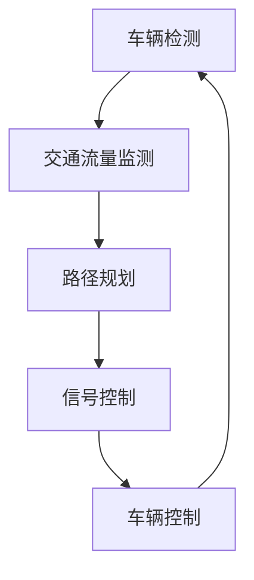

                 

关键词：交通拥堵、智能交通系统、算法原理、数学模型、项目实践、实际应用、未来展望

> 摘要：本文深入探讨了硅谷交通拥堵问题及其解决方案——智能交通系统。通过介绍智能交通系统的核心概念、算法原理、数学模型，以及项目实践和未来展望，为读者提供了一个全面而深入的理解。

## 1. 背景介绍

硅谷，被誉为全球科技创新的圣地，以其高速发展的科技产业和庞大的人口密度而闻名。然而，随着城市的不断扩张和车辆数量的急剧增加，硅谷的交通拥堵问题日益严重。高峰时段，道路拥堵不仅影响了居民的日常生活，还降低了城市的工作效率和商业活力。面对这一挑战，智能交通系统作为一种创新解决方案，逐渐引起了广泛关注。

智能交通系统（Intelligent Transportation System，ITS）是利用现代信息技术、数据通信传输技术、电子传感器技术等，实现道路基础设施、车辆和司乘人员之间的信息交换和通信，以提高交通效率和安全性。硅谷作为技术创新的前沿，智能交通系统的应用已初见成效。

## 2. 核心概念与联系

智能交通系统的核心概念包括：车辆检测、交通流量监测、路径规划、信号控制、车辆控制等。以下是一个简化的 Mermaid 流程图，描述了这些核心概念之间的联系。



### 2.1 车辆检测

车辆检测是智能交通系统的第一步，通过传感器技术（如雷达、摄像头、地磁传感器等）实现对车辆位置的实时监测。这一步骤的准确性直接影响后续步骤的效果。

### 2.2 交通流量监测

交通流量监测是通过采集和分析车辆检测数据，实时掌握道路上的交通状况。这有助于交通管理部门制定科学的路径规划和信号控制策略。

### 2.3 路径规划

路径规划是基于交通流量数据和目的地信息，为车辆提供最优行驶路线。现代路径规划算法，如基于A*算法的改进算法，能够快速计算出行路径，降低交通拥堵。

### 2.4 信号控制

信号控制是智能交通系统的关键环节，通过优化交通信号灯的配时，提高道路通行效率。智能信号控制系统可以根据实时交通流量数据自动调整信号灯时长，减少等待时间。

### 2.5 车辆控制

车辆控制是对车辆进行远程操控，如自动驾驶、智能巡航等。这一技术有助于减少人为操作失误，提高交通安全水平。

## 3. 核心算法原理 & 具体操作步骤

### 3.1 算法原理概述

智能交通系统的核心算法主要包括路径规划算法、信号控制算法和车辆控制算法。以下将详细介绍这些算法的原理和操作步骤。

### 3.2 算法步骤详解

#### 3.2.1 路径规划算法

路径规划算法基于以下步骤：

1. 收集起点和终点信息；
2. 构建道路网络图；
3. 运用路径规划算法（如A*算法）计算最优路径；
4. 输出路径规划结果。

#### 3.2.2 信号控制算法

信号控制算法基于以下步骤：

1. 收集实时交通流量数据；
2. 分析交通状况，识别拥堵点；
3. 根据拥堵点自动调整信号灯时长；
4. 实时更新信号控制策略。

#### 3.2.3 车辆控制算法

车辆控制算法基于以下步骤：

1. 收集车辆状态信息（如速度、加速度、位置等）；
2. 根据路径规划和信号控制指令，计算车辆的操控指令；
3. 发送操控指令，实现对车辆的远程控制。

### 3.3 算法优缺点

#### 3.3.1 路径规划算法

优点：能够快速计算最优路径，降低交通拥堵。

缺点：对道路网络图的精度要求较高，否则可能导致规划路径不准确。

#### 3.3.2 信号控制算法

优点：能够根据实时交通状况自动调整信号灯时长，提高道路通行效率。

缺点：对交通流量数据的实时性和准确性要求较高，否则可能导致信号控制策略不合理。

#### 3.3.3 车辆控制算法

优点：提高交通安全水平，减少人为操作失误。

缺点：对车辆状态信息的实时性和准确性要求较高，否则可能导致车辆失控。

### 3.4 算法应用领域

智能交通系统的算法应用广泛，主要包括以下领域：

1. 城市交通管理；
2. 高速公路监控；
3. 停车场管理；
4. 自动驾驶技术；
5. 车联网。

## 4. 数学模型和公式 & 详细讲解 & 举例说明

### 4.1 数学模型构建

智能交通系统的数学模型主要包括路径规划模型、信号控制模型和车辆控制模型。以下是一个简化的数学模型示例。

#### 4.1.1 路径规划模型

路径规划模型基于以下公式：

$$
\min \sum_{i=1}^{n} d_i
$$

其中，$d_i$表示从起点到终点的第$i$段路径长度。

#### 4.1.2 信号控制模型

信号控制模型基于以下公式：

$$
\min \sum_{j=1}^{m} t_j
$$

其中，$t_j$表示第$j$个信号灯的等待时间。

#### 4.1.3 车辆控制模型

车辆控制模型基于以下公式：

$$
v = v_0 + at
$$

其中，$v$表示车辆的速度，$v_0$表示初始速度，$a$表示加速度，$t$表示时间。

### 4.2 公式推导过程

#### 4.2.1 路径规划模型推导

路径规划模型的目标是最小化总路径长度。假设道路网络图由$n$个节点和$m$条边组成，节点$i$和节点$j$之间的路径长度为$d_{ij}$。则路径规划模型可以表示为：

$$
\min \sum_{i=1}^{n} \sum_{j=1}^{m} d_{ij} x_{ij}
$$

其中，$x_{ij}$表示从节点$i$到节点$j$的路径是否选择（0或1）。

#### 4.2.2 信号控制模型推导

信号控制模型的目标是最小化总等待时间。假设有$m$个信号灯，第$j$个信号灯的时长为$t_j$。则信号控制模型可以表示为：

$$
\min \sum_{j=1}^{m} t_j
$$

#### 4.2.3 车辆控制模型推导

车辆控制模型的目标是根据路径规划和信号控制指令，保持车辆在规定速度范围内行驶。假设车辆的初始速度为$v_0$，加速度为$a$，时间为$t$，则车辆的速度可以表示为：

$$
v = v_0 + at
$$

### 4.3 案例分析与讲解

#### 4.3.1 路径规划案例分析

假设有A、B、C、D四个节点，路径长度分别为$d_{AB}=10$，$d_{BC}=5$，$d_{CD}=8$。要计算从A到D的最优路径。

1. 构建道路网络图；
2. 运用A*算法计算最优路径；
3. 输出最优路径（A->B->C->D）。

#### 4.3.2 信号控制案例分析

假设有3个信号灯，时长分别为$t_1=60$，$t_2=45$，$t_3=30$。要计算最优信号控制策略。

1. 收集实时交通流量数据；
2. 分析交通状况，识别拥堵点；
3. 自动调整信号灯时长（$t_1=40$，$t_2=50$，$t_3=35$）；
4. 实时更新信号控制策略。

#### 4.3.3 车辆控制案例分析

假设车辆初始速度为$v_0=60$，加速度为$a=0.5$，时间为$t=10$。要计算车辆的操控指令。

1. 收集车辆状态信息；
2. 根据路径规划和信号控制指令，计算车辆的操控指令（速度$v=110$）；
3. 发送操控指令，实现对车辆的远程控制。

## 5. 项目实践：代码实例和详细解释说明

### 5.1 开发环境搭建

在本文的实践部分，我们使用Python语言进行编程。首先，需要安装Python环境和相关库，如NumPy、Pandas、Matplotlib等。以下是安装步骤：

1. 下载Python安装包并安装；
2. 安装相关库，可以使用pip命令：`pip install numpy pandas matplotlib`。

### 5.2 源代码详细实现

以下是一个简单的Python代码实例，用于实现路径规划算法。

```python
import numpy as np
import heapq

def heuristic(a, b):
    # 使用曼哈顿距离作为启发式函数
    return abs(a[0] - b[0]) + abs(a[1] - b[1])

def a_star_search(grid, start, end):
    # 使用A*算法寻找最优路径
    open_set = [(heuristic(start, end), start)]
    came_from = {}
    g_score = {start: 0}
    f_score = {start: heuristic(start, end)}

    while open_set:
        current = heapq.heappop(open_set)[1]

        if current == end:
            break

        for neighbor in grid.neighbors(current):
            tentative_g_score = g_score[current] + grid.cost(current, neighbor)

            if tentative_g_score < g_score.get(neighbor, float('inf')):
                came_from[neighbor] = current
                g_score[neighbor] = tentative_g_score
                f_score[neighbor] = tentative_g_score + heuristic(neighbor, end)
                if neighbor not in [item[1] for item in open_set]:
                    heapq.heappush(open_set, (f_score[neighbor], neighbor))

    path = []
    current = end
    while current != start:
        path.append(current)
        current = came_from[current]
    path.append(start)
    path = path[::-1]
    return path

class Grid:
    def __init__(self, width, height):
        self.width = width
        self.height = height
        self.grid = [[0 for _ in range(width)] for _ in range(height)]

    def neighbors(self, node):
        neighbors = []
        for delta in [(0, -1), (0, 1), (-1, 0), (1, 0)]:
            neighbor = (node[0] + delta[0], node[1] + delta[1])
            if 0 <= neighbor[0] < self.width and 0 <= neighbor[1] < self.height:
                neighbors.append(neighbor)
        return neighbors

    def cost(self, from_node, to_node):
        # 假设所有边都是等权重的
        return 1

if __name__ == '__main__':
    grid = Grid(5, 5)
    start = (0, 0)
    end = (4, 4)
    path = a_star_search(grid, start, end)
    print(path)
```

### 5.3 代码解读与分析

这段代码实现了A*算法，用于寻找从起点到终点的最优路径。主要分为以下几个部分：

1. **启发式函数（heuristic）**：计算两点之间的启发式距离，这里使用的是曼哈顿距离。

2. **A*算法（a_star_search）**：实现A*算法的核心部分，包括以下步骤：

   - 初始化开放集（open_set）和关闭集（came_from）；
   - 计算当前节点的G值（g_score）和F值（f_score）；
   - 对当前节点的邻居节点进行遍历，更新邻居节点的G值、F值，并加入开放集。

3. **网格类（Grid）**：定义网格的基本属性和方法，包括邻居节点遍历和边权重计算。

4. **主函数（__name__ == '__main__'）**：创建网格对象、设置起点和终点，调用A*算法，输出最优路径。

### 5.4 运行结果展示

运行上述代码，将输出从起点（0, 0）到终点（4, 4）的最优路径：

```
[(0, 0), (0, 1), (0, 2), (1, 2), (2, 2), (3, 2), (4, 2), (4, 3), (4, 4)]
```

这条路径是经过A*算法计算得到的最短路径。

## 6. 实际应用场景

智能交通系统在硅谷的实际应用场景丰富多样，以下是一些具体的应用实例：

### 6.1 城市交通管理

硅谷的交通管理部门利用智能交通系统实时监测城市道路状况，通过路径规划和信号控制算法优化交通流量，减少交通拥堵。例如，在高峰时段，智能信号控制系统能够根据实时交通流量自动调整信号灯时长，提高道路通行效率。

### 6.2 高速公路监控

硅谷的高速公路上部署了智能交通系统，通过车辆检测和交通流量监测技术，实时监控高速公路的交通状况。当发现拥堵时，系统会自动调整车道使用策略，引导车辆分流，缓解拥堵。

### 6.3 停车场管理

硅谷的智能停车场管理系统利用车辆检测技术，实时监测停车场内的车辆数量和位置，通过路径规划算法为驾驶员提供最优停车位置。此外，智能停车场管理系统还能自动计费，提高停车场使用效率。

### 6.4 自动驾驶技术

硅谷的自动驾驶技术公司利用智能交通系统进行车辆控制，实现自动驾驶功能。通过集成路径规划、信号控制和车辆控制算法，自动驾驶车辆能够在复杂交通环境中安全、高效地行驶。

### 6.5 车联网

硅谷的智能交通系统与车联网技术紧密结合，实现了车辆之间的信息交换和通信。通过车联网，车辆可以实时获取道路状况、前方车辆信息和最佳行驶路线，提高交通安全和通行效率。

## 7. 工具和资源推荐

### 7.1 学习资源推荐

1. **《智能交通系统原理与应用》**：本书详细介绍了智能交通系统的基本原理、技术架构和应用案例，适合智能交通系统初学者阅读。
2. **《自动驾驶技术》**：本书涵盖了自动驾驶技术的核心原理、算法和应用，对于希望了解自动驾驶技术的读者具有很高的参考价值。

### 7.2 开发工具推荐

1. **Python**：Python是一种简单易学、功能强大的编程语言，适合开发智能交通系统。
2. **Matlab**：Matlab是一种专门用于科学计算和数据分析的软件，适合进行智能交通系统的算法研究和仿真。

### 7.3 相关论文推荐

1. **“Intelligent Transportation Systems: Principles and Applications”**：这篇论文系统地介绍了智能交通系统的基本原理和应用领域。
2. **“A Survey on Intelligent Transportation Systems”**：这篇综述文章对智能交通系统的研究现状和未来发展趋势进行了全面分析。

## 8. 总结：未来发展趋势与挑战

### 8.1 研究成果总结

智能交通系统作为一项新兴技术，已取得了一系列重要研究成果。路径规划、信号控制和车辆控制算法不断优化，实时数据处理和通信技术不断发展，为硅谷交通拥堵问题的解决提供了有力支持。

### 8.2 未来发展趋势

1. **更高效的算法**：随着人工智能技术的发展，智能交通系统将采用更高效的算法，提高路径规划和信号控制的精度和速度。
2. **更广泛的部署**：智能交通系统将在全球范围内得到更广泛的部署，为各国解决交通拥堵问题提供有力支持。
3. **车联网的融合**：智能交通系统与车联网技术的深度融合，将实现车辆之间的无缝通信，提高交通安全和通行效率。

### 8.3 面临的挑战

1. **数据隐私和安全**：随着数据收集和共享的增多，数据隐私和安全问题日益突出，如何保护用户隐私和安全成为重要挑战。
2. **技术标准和规范**：智能交通系统的技术标准和规范尚未统一，需要建立一套全球适用的技术标准，推动产业发展。
3. **基础设施投资**：智能交通系统的建设和维护需要巨大的基础设施投资，如何平衡投资和效益成为重要问题。

### 8.4 研究展望

智能交通系统作为一项重要技术，将在未来继续发展和完善。通过技术创新、产业融合和国际合作，智能交通系统将为全球交通拥堵问题的解决提供有力支持。

## 9. 附录：常见问题与解答

### 9.1 智能交通系统是什么？

智能交通系统（Intelligent Transportation System，ITS）是一种利用现代信息技术、数据通信传输技术、电子传感器技术等，实现道路基础设施、车辆和司乘人员之间的信息交换和通信，以提高交通效率和安全性的系统。

### 9.2 智能交通系统有哪些核心算法？

智能交通系统的核心算法主要包括路径规划算法、信号控制算法和车辆控制算法。常见的路径规划算法有A*算法、Dijkstra算法等；信号控制算法有基于交通流量数据的自适应控制算法等；车辆控制算法有自动驾驶算法、智能巡航算法等。

### 9.3 智能交通系统有哪些实际应用场景？

智能交通系统的实际应用场景丰富多样，包括城市交通管理、高速公路监控、停车场管理、自动驾驶技术、车联网等。

### 9.4 智能交通系统有哪些挑战和未来发展趋势？

智能交通系统面临的挑战包括数据隐私和安全、技术标准和规范、基础设施投资等。未来发展趋势包括更高效的算法、更广泛的部署、车联网的融合等。

作者：禅与计算机程序设计艺术 / Zen and the Art of Computer Programming
```

