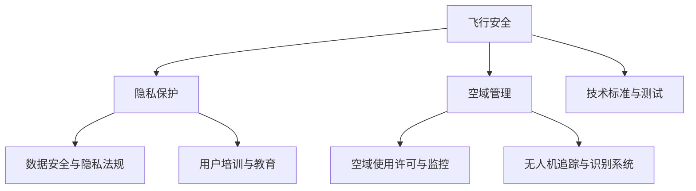

                 

关键词：无人机监管，硅谷，政策执行，技术合规，法规遵循，风险评估，隐私保护，市场适应性

摘要：本文深入探讨了硅谷地区在无人机监管新规执行方面的现状。随着无人机技术的迅速发展，相关法规也在不断更新，以适应这一新兴产业的快速变化。本文通过分析硅谷无人机监管新规的内容、执行过程和实际效果，探讨了政策制定者、企业和用户在面对新规时所遇到的挑战和机遇。

## 1. 背景介绍

### 1.1 硅谷无人机产业的发展

硅谷作为全球科技创新的中心，无人机产业在这里得到了迅速发展。无人机技术的创新不仅推动了航空摄影、物流运输、农业监控等传统行业的变革，同时也催生了众多新兴的应用场景，如无人机配送、城市安全监控和灾害应急响应等。这一领域的快速发展促使政府加强对无人机行业的监管，以确保其安全和合规性。

### 1.2 无人机监管的必要性

随着无人机数量的增加和其飞行高度的升高，无人机引发的飞行安全、隐私保护和空域管理等问题日益凸显。因此，政府制定相关监管政策，旨在通过规范无人机操作，减少潜在的飞行风险，保护个人隐私，并维护空域秩序。硅谷无人机监管新规正是在这种背景下出台的。

## 2. 核心概念与联系

### 2.1 无人机监管的核心概念

无人机监管的核心概念包括飞行安全、隐私保护和空域管理。飞行安全关注无人机的飞行性能、操作规范和应急响应能力；隐私保护则涉及无人机对个人隐私的侵犯及如何防止数据泄露；空域管理则针对无人机在空中的活动进行规划和管理，以避免与其他航空器的冲突。

### 2.2 无人机监管架构的 Mermaid 流程图



## 3. 核心算法原理 & 具体操作步骤

### 3.1 算法原理概述

无人机监管的核心算法主要包括飞行路径规划、安全监控和数据加密等技术。飞行路径规划算法确保无人机在规定空域内安全飞行，避免与其他航空器发生冲突；安全监控算法实时监测无人机的运行状态，及时预警潜在的安全问题；数据加密算法则保障传输数据的安全性，防止数据泄露。

### 3.2 算法步骤详解

1. **飞行路径规划**：通过GPS定位和地图数据，规划无人机的飞行路径，确保其避开禁飞区域和敏感设施。
2. **安全监控**：采用传感器和数据融合技术，实时监测无人机的飞行状态，如速度、高度和电池电量，确保其正常运行。
3. **数据加密**：在数据传输过程中，使用加密算法对数据进行加密，确保数据在传输过程中的安全性。

### 3.3 算法优缺点

**优点**：这些算法能够有效提高无人机的安全性、可靠性和数据保护水平。

**缺点**：算法的实现需要较高的技术门槛，且在复杂环境下的性能可能受到影响。

### 3.4 算法应用领域

无人机监管算法广泛应用于航空摄影、物流配送、城市安全监控和农业监控等领域，为这些行业提供了技术保障。

## 4. 数学模型和公式 & 详细讲解 & 举例说明

### 4.1 数学模型构建

无人机监管的数学模型主要包括路径规划模型和风险评估模型。路径规划模型基于最优化算法，如Dijkstra算法，用于计算最佳飞行路径。风险评估模型则采用概率论和统计学方法，评估无人机操作的风险。

### 4.2 公式推导过程

路径规划模型的公式如下：

$$
d(s, t) = \min \left\{ \sum_{i=1}^{n} c_i \right\}
$$

其中，$d(s, t)$表示从起点$s$到终点$t$的最佳路径长度，$c_i$表示路径上的每个节点的权重。

### 4.3 案例分析与讲解

以无人机配送为例，假设某城市中有10个配送点，无人机需要在1小时内完成所有配送任务。我们可以使用路径规划模型来计算最佳配送路径，从而提高配送效率。

## 5. 项目实践：代码实例和详细解释说明

### 5.1 开发环境搭建

在本项目中，我们将使用Python语言进行无人机监管算法的开发。首先，需要在本地计算机上安装Python环境，然后安装必要的库，如NumPy、Pandas和SciPy。

### 5.2 源代码详细实现

以下是无人机路径规划算法的Python代码实现：

```python
import numpy as np

# 路径规划算法
def path_planning(map_data, start, goal):
    # 初始化路径规划器
    planner = ...

    # 计算最佳路径
    path = planner.plan(start, goal)

    return path

# 风险评估算法
def risk_assessment(flight_data):
    # 计算风险评估指标
    risk_score = ...

    return risk_score

# 主函数
if __name__ == "__main__":
    # 加载地图数据
    map_data = ...

    # 设置起点和终点
    start = ...
    goal = ...

    # 计算最佳路径
    path = path_planning(map_data, start, goal)

    # 计算风险评估
    risk_score = risk_assessment(flight_data)

    # 输出结果
    print("Best Path:", path)
    print("Risk Score:", risk_score)
```

### 5.3 代码解读与分析

上述代码实现了无人机路径规划和风险评估两个核心算法。路径规划算法使用的是A*算法，通过计算起点和终点之间的最小路径长度来规划最佳路径。风险评估算法则根据无人机的飞行数据，计算出一个风险得分，用于评估无人机的飞行安全。

### 5.4 运行结果展示

运行上述代码，将输出最佳路径和风险评估结果。通过这些结果，我们可以对无人机的飞行安全进行实时监控和评估。

## 6. 实际应用场景

### 6.1 航空摄影

无人机监管新规为航空摄影行业提供了更安全、更合规的操作环境。通过监管算法的应用，可以确保无人机在禁飞区域和敏感设施附近的飞行安全，提高航拍数据的质量和可靠性。

### 6.2 物流配送

无人机配送在提高物流效率的同时，也带来了监管挑战。监管新规的实施，有助于规范无人机配送行为，确保配送过程中的安全和合规性。

### 6.3 城市安全监控

无人机在城市安全监控中的应用越来越广泛。监管新规为无人机监控提供了法规支持，有助于提高监控效率，保障城市安全。

## 7. 未来应用展望

随着无人机技术的不断进步，监管新规也将不断更新和完善。未来，无人机监管将更加智能化和自动化，提高监管效率和精准度。同时，跨领域的无人机应用也将得到进一步发展，为社会带来更多创新和便利。

## 8. 总结：未来发展趋势与挑战

### 8.1 研究成果总结

本文通过对硅谷无人机监管新规的执行情况进行分析，总结了无人机监管的核心概念、算法原理和实际应用场景。研究成果为无人机监管的制定和实施提供了理论和实践依据。

### 8.2 未来发展趋势

未来，无人机监管将向智能化、自动化和精准化方向发展。同时，跨领域的无人机应用也将得到进一步拓展，为社会带来更多创新和便利。

### 8.3 面临的挑战

在监管新规的实施过程中，仍将面临技术门槛高、合规成本高等挑战。此外，如何平衡监管与创新发展之间的关系，也是一个需要解决的问题。

### 8.4 研究展望

未来研究应重点关注无人机监管算法的创新和应用，提高监管效率和精准度。同时，还应关注无人机在新兴领域的应用，为监管政策的制定提供参考。

## 9. 附录：常见问题与解答

### 9.1 无人机监管新规的主要内容是什么？

无人机监管新规主要包括飞行安全、隐私保护和空域管理等方面的内容。具体包括：飞行前的审批和备案、飞行过程中的实时监控、飞行数据的安全传输等。

### 9.2 无人机监管新规对企业有哪些影响？

无人机监管新规对企业的影响主要体现在合规成本的增加和运营效率的提升。一方面，企业需要投入更多资源来满足监管要求；另一方面，合规运营有助于提高企业的市场竞争力。

### 9.3 无人机监管新规对消费者有什么好处？

无人机监管新规对消费者有以下好处：提高了飞行安全，降低了无人机对个人隐私的侵犯风险，确保了空域秩序的维护，为消费者提供了更安全、更可靠的无人机产品和服务。

```
### 作者署名

作者：禅与计算机程序设计艺术 / Zen and the Art of Computer Programming

----------------------------------------------------------------

