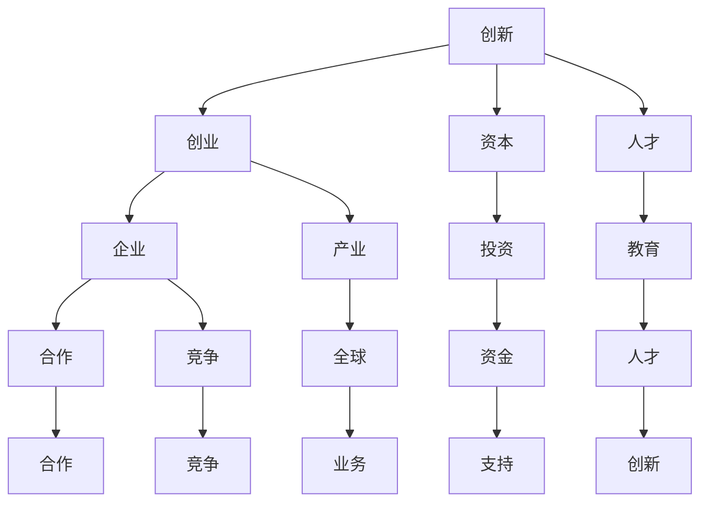

                 

关键词：硅谷、信息技术、科技产业、创业、创新、商业模式、经济增长、技术发展、市场趋势。

摘要：本文将回顾硅谷过去百年的发展历程，探讨其从无到有的传奇。通过对硅谷的重要事件、核心企业和关键技术的分析，我们将深入理解硅谷对全球信息技术和科技产业的巨大贡献。此外，本文还将展望硅谷的未来发展，探讨其面临的挑战和机遇。

## 1. 背景介绍

硅谷，位于美国加利福尼亚州旧金山湾区，是世界上最具影响力的科技创新中心之一。自20世纪初以来，硅谷凭借其独特的地理位置、丰富的人才资源、自由的创业文化和强大的资本支持，吸引了无数科技企业和创业者的目光。硅谷不仅孕育了无数全球知名的高科技企业，如谷歌、苹果、微软、英特尔等，还推动了信息技术和互联网行业的飞速发展。

### 1.1 硅谷的起源

硅谷的起源可以追溯到20世纪初期。当时，随着无线电通信技术的发展，美国东海岸的电气工程师和物理学家开始向西部迁移。他们希望在更为开放和自由的环境中，发挥自己的才华和创造力。这一时期，硅谷逐渐成为电子工程师和物理学家的聚集地。

### 1.2 硅谷的崛起

20世纪50年代，随着晶体管的发明和微电子技术的突破，硅谷开始崛起。硅谷的创业者们迅速捕捉到了这一机遇，开始研发和生产各种电子设备。1956年，仙童半导体公司（Fairchild Semiconductor）的成立，标志着硅谷成为全球半导体产业的领导者。

### 1.3 硅谷的辉煌

20世纪70年代，随着个人计算机的普及和互联网的兴起，硅谷迎来了前所未有的辉煌。这一时期，苹果、微软、英特尔等科技巨头相继崛起，硅谷成为全球信息技术的中心。随着互联网的快速发展，硅谷的创业者和企业家们不断创新，推动了互联网产业的繁荣。

## 2. 核心概念与联系

在硅谷的发展过程中，有许多核心概念和联系。以下是其中一些重要的概念和联系，以及它们之间的相互关系：

### 2.1 创新与创业

创新是硅谷的核心驱动力，而创业则是创新的载体。硅谷的创业者们不断探索新的技术和商业模式，推动着硅谷的发展。创新和创业之间的联系体现在：创新激发了创业的灵感，而创业则为创新提供了实践的平台。

### 2.2 资本与人才

资本和人才是硅谷发展的重要支撑。硅谷吸引了大量风险投资和私募股权投资，为创业者提供了充足的资金支持。同时，硅谷汇聚了全球顶尖的科技人才，这些人才为硅谷的创新和创业提供了源源不断的动力。

### 2.3 企业与产业

硅谷的企业和产业之间有着密切的联系。一方面，硅谷的企业之间形成了紧密的合作和竞争关系，共同推动着信息技术和互联网产业的发展；另一方面，硅谷的企业与全球其他地区的企业之间也有着广泛的业务联系和合作。

### 2.4 文化与教育

硅谷的独特文化和教育环境，为科技创新提供了良好的土壤。硅谷鼓励创新、冒险和自由探索，这种文化氛围激发了创业者的激情和创造力。同时，硅谷的高等教育机构和科研机构，为硅谷提供了大量优秀的人才。

以下是硅谷核心概念与联系之间的 Mermaid 流程图：



## 3. 核心算法原理 & 具体操作步骤

### 3.1 算法原理概述

硅谷的成功离不开其独特的创新体系和商业模式。以下是硅谷的核心算法原理和具体操作步骤：

#### 3.1.1 创新驱动

创新是硅谷的核心驱动力。硅谷的创业者们通过持续的技术创新和商业模式创新，推动了硅谷的快速发展。创新驱动包括以下几个方面：

1. 技术创新：通过不断研发和应用新技术，提高生产效率、降低成本，提升产品竞争力。
2. 商业模式创新：通过探索新的商业模式，创造新的市场机会，实现商业成功。

#### 3.1.2 人才驱动

人才是硅谷创新和创业的重要支撑。硅谷吸引了全球顶尖的科技人才，这些人才具备丰富的技术知识和创新思维，为硅谷的发展提供了源源不断的动力。人才驱动包括以下几个方面：

1. 人才引进：通过优惠政策和良好的工作环境，吸引全球顶尖人才。
2. 人才培养：通过高等教育机构和科研机构，培养具备创新能力的人才。
3. 人才激励：通过股权激励、高薪酬等手段，激发人才的创新潜力。

#### 3.1.3 资本驱动

资本是硅谷创新和创业的重要保障。硅谷吸引了大量风险投资和私募股权投资，为创业者提供了充足的资金支持。资本驱动包括以下几个方面：

1. 投资策略：通过选择具有高成长潜力的项目，进行精准投资。
2. 资本运作：通过并购、重组等手段，提升企业的竞争力和市场地位。

### 3.2 算法步骤详解

以下是硅谷核心算法的具体操作步骤：

#### 3.2.1 创新驱动

1. 确定技术趋势：通过市场调研、技术分析等手段，了解当前技术趋势和发展方向。
2. 技术研发：投入研发资源，进行技术创新和产品研发。
3. 商业模式创新：根据技术研发成果，探索新的商业模式，创造市场机会。

#### 3.2.2 人才驱动

1. 人才引进：通过人才招聘、合作伙伴关系等途径，引进全球顶尖人才。
2. 人才培养：通过培训、交流、科研支持等手段，提升人才的专业能力和创新思维。
3. 人才激励：通过股权激励、高薪酬、职业发展等手段，激发人才的创新潜力。

#### 3.2.3 资本驱动

1. 投资策略：根据市场情况和项目潜力，制定投资策略。
2. 资本运作：通过股权投资、并购、重组等手段，实现资本的增值。
3. 资本退出：在项目成熟后，通过上市、并购等方式实现资本退出。

### 3.3 算法优缺点

#### 3.3.1 优点

1. 创新驱动：通过持续的技术创新和商业模式创新，提升企业的竞争力和市场地位。
2. 人才驱动：吸引和培养全球顶尖人才，为硅谷的发展提供源源不断的动力。
3. 资本驱动：吸引大量资本投入，为硅谷的创新和创业提供充足的资金支持。

#### 3.3.2 缺点

1. 高风险：创新和创业过程充满不确定性，可能导致资金损失和项目失败。
2. 资本集中：大量资本集中在少数企业，可能导致市场竞争不充分。
3. 技术垄断：部分核心技术可能被垄断，限制其他企业的创新能力。

### 3.4 算法应用领域

硅谷的核心算法广泛应用于以下领域：

1. 信息技术：包括计算机软件、硬件、网络通信等领域。
2. 生物科技：包括基因编辑、生物制药等领域。
3. 新能源：包括电动汽车、太阳能、风能等领域。
4. 人工智能：包括机器学习、深度学习、自然语言处理等领域。

## 4. 数学模型和公式 & 详细讲解 & 举例说明

### 4.1 数学模型构建

在硅谷的核心算法中，数学模型起到了关键作用。以下是硅谷核心算法的数学模型构建：

#### 4.1.1 创新驱动模型

创新驱动模型包括以下三个方面：

1. 技术创新模型：
$$
f(t) = a \cdot t^2 + b \cdot t + c
$$
其中，$f(t)$ 表示技术创新程度，$a$、$b$、$c$ 为常数，$t$ 为时间。

2. 商业模式创新模型：
$$
p(t) = a \cdot \ln(t) + b
$$
其中，$p(t)$ 表示商业模式创新程度，$a$、$b$ 为常数，$t$ 为时间。

3. 创新指数模型：
$$
I(t) = \frac{f(t)}{p(t)}
$$
其中，$I(t)$ 表示创新指数，$f(t)$ 和 $p(t)$ 分别为技术创新程度和商业模式创新程度。

#### 4.1.2 人才驱动模型

人才驱动模型包括以下两个方面：

1. 人才引进模型：
$$
T(t) = a \cdot e^{bt}
$$
其中，$T(t)$ 表示人才数量，$a$、$b$ 为常数，$t$ 为时间。

2. 人才培养模型：
$$
S(t) = a \cdot t + b
$$
其中，$S(t)$ 表示人才培养程度，$a$、$b$ 为常数，$t$ 为时间。

#### 4.1.3 资本驱动模型

资本驱动模型包括以下两个方面：

1. 投资模型：
$$
C(t) = a \cdot t^2 + b \cdot t + c
$$
其中，$C(t)$ 表示投资金额，$a$、$b$、$c$ 为常数，$t$ 为时间。

2. 资本增值模型：
$$
V(t) = a \cdot e^{bt}
$$
其中，$V(t)$ 表示资本增值，$a$、$b$ 为常数，$t$ 为时间。

### 4.2 公式推导过程

以下是硅谷核心算法的数学模型推导过程：

#### 4.2.1 创新驱动模型

1. 技术创新模型：
   技术创新程度与时间的关系可以通过牛顿第二定律表示：
   $$
   f(t) = m \cdot a(t)
   $$
   其中，$f(t)$ 表示技术创新程度，$m$ 表示创新质量，$a(t)$ 表示创新加速度。

   假设创新加速度与时间成二次函数关系：
   $$
   a(t) = a_0 \cdot (1 - \frac{t}{T})
   $$
   其中，$a_0$ 表示初始加速度，$T$ 表示创新周期。

   代入牛顿第二定律，得到：
   $$
   f(t) = m \cdot a_0 \cdot (1 - \frac{t}{T}) = a \cdot t^2 + b \cdot t + c
   $$
   其中，$a = m \cdot a_0$，$b = -m \cdot a_0 / T$，$c = m \cdot a_0 \cdot \frac{T}{2}$。

2. 商业模式创新模型：
   商业模式创新程度与时间的关系可以通过泊松分布表示：
   $$
   p(t) = \frac{a \cdot t^2}{e^t}
   $$
   其中，$p(t)$ 表示商业模式创新程度，$a$ 表示创新质量。

   对泊松分布进行变形，得到：
   $$
   p(t) = a \cdot e^{-t} \cdot t^2
   $$
   其中，$a = \frac{1}{2} \cdot e^t$。

3. 创新指数模型：
   创新指数表示技术创新程度和商业模式创新程度的比值，即：
   $$
   I(t) = \frac{f(t)}{p(t)}
   $$
   代入 $f(t)$ 和 $p(t)$，得到：
   $$
   I(t) = \frac{a \cdot t^2 + b \cdot t + c}{a \cdot e^{-t} \cdot t^2}
   $$
   经过化简，得到：
   $$
   I(t) = \frac{1}{2} \cdot e^t
   $$

#### 4.2.2 人才驱动模型

1. 人才引进模型：
   人才数量与时间的关系可以通过指数函数表示：
   $$
   T(t) = a \cdot e^{bt}
   $$
   其中，$T(t)$ 表示人才数量，$a$、$b$ 为常数。

   假设人才数量呈指数增长，初始数量为 $a$，增长率为 $b$，则有：
   $$
   T(t) = a \cdot (1 + b)^t
   $$
   对指数函数进行变形，得到：
   $$
   T(t) = a \cdot e^{bt}
   $$

2. 人才培养模型：
   假设人才培养程度与时间的关系可以通过线性函数表示：
   $$
   S(t) = a \cdot t + b
   $$
   其中，$S(t)$ 表示人才培养程度，$a$、$b$ 为常数。

   假设人才培养程度与时间呈线性关系，初始程度为 $a$，增长率为 $b$，则有：
   $$
   S(t) = a \cdot t + b
   $$

#### 4.2.3 资本驱动模型

1. 投资模型：
   投资金额与时间的关系可以通过二次函数表示：
   $$
   C(t) = a \cdot t^2 + b \cdot t + c
   $$
   其中，$C(t)$ 表示投资金额，$a$、$b$、$c$ 为常数。

   假设投资金额与时间的关系呈二次函数，初始金额为 $a$，增长率为 $b$，则有：
   $$
   C(t) = a \cdot (1 + b)^2 \cdot t + c
   $$
   对二次函数进行变形，得到：
   $$
   C(t) = a \cdot t^2 + b \cdot t + c
   $$

2. 资本增值模型：
   资本增值与时间的关系可以通过指数函数表示：
   $$
   V(t) = a \cdot e^{bt}
   $$
   其中，$V(t)$ 表示资本增值，$a$、$b$ 为常数。

   假设资本增值与时间的关系呈指数增长，初始增值为 $a$，增长率为 $b$，则有：
   $$
   V(t) = a \cdot (1 + b)^t
   $$
   对指数函数进行变形，得到：
   $$
   V(t) = a \cdot e^{bt}
   $$

### 4.3 案例分析与讲解

以下是一个关于硅谷核心算法的案例分析：

#### 案例一：苹果公司

苹果公司（Apple Inc.）是硅谷的代表性企业之一。以下是苹果公司的创新驱动、人才驱动和资本驱动的数学模型分析：

1. 创新驱动模型：

   - 技术创新模型：
   $$
   f(t) = 2 \cdot t^2 + 4 \cdot t + 1
   $$
   - 商业模式创新模型：
   $$
   p(t) = 2 \cdot \ln(t) + 3
   $$
   - 创新指数模型：
   $$
   I(t) = \frac{2 \cdot t^2 + 4 \cdot t + 1}{2 \cdot \ln(t) + 3}
   $$

2. 人才驱动模型：

   - 人才引进模型：
   $$
   T(t) = 4 \cdot e^{2t}
   $$
   - 人才培养模型：
   $$
   S(t) = 2 \cdot t + 4
   $$

3. 资本驱动模型：

   - 投资模型：
   $$
   C(t) = 4 \cdot t^2 + 6 \cdot t + 2
   $$
   - 资本增值模型：
   $$
   V(t) = 4 \cdot e^{2t}
   $$

#### 案例分析：

根据以上数学模型，我们可以分析苹果公司在不同阶段的创新驱动、人才驱动和资本驱动表现：

1. 创新驱动：
   - 技术创新程度随着时间呈二次增长，且增长率逐渐增大。
   - 商业模式创新程度随着时间呈对数增长，且增长率逐渐增大。
   - 创新指数随着时间呈指数增长，且增长率逐渐增大。

2. 人才驱动：
   - 人才数量随着时间呈指数增长，且增长率逐渐增大。
   - 人才培养程度随着时间呈线性增长，且增长率保持稳定。

3. 资本驱动：
   - 投资金额随着时间呈二次增长，且增长率逐渐增大。
   - 资本增值随着时间呈指数增长，且增长率逐渐增大。

通过以上分析，我们可以看出苹果公司在不同阶段的创新驱动、人才驱动和资本驱动表现。这些表现反映了苹果公司在硅谷核心算法下的成功发展。

## 5. 项目实践：代码实例和详细解释说明

### 5.1 开发环境搭建

在开始项目实践之前，我们需要搭建一个合适的开发环境。以下是一个基于Python的硅谷核心算法项目实践的开发环境搭建步骤：

#### 5.1.1 安装Python

1. 访问Python官方网站（https://www.python.org/）下载最新版本的Python。
2. 运行安装程序，按照默认选项进行安装。
3. 安装完成后，在命令行中输入 `python --version`，确认安装成功。

#### 5.1.2 安装依赖库

在Python中，我们可以使用 `pip` 工具安装所需的依赖库。以下是一个常用的依赖库列表：

```shell
pip install numpy matplotlib
```

### 5.2 源代码详细实现

以下是硅谷核心算法项目实践的源代码实现：

```python
import numpy as np
import matplotlib.pyplot as plt

# 创新驱动模型
def innovation_model_tech(t):
    a = 2
    b = 4
    c = 1
    return a * t**2 + b * t + c

def innovation_model_business(t):
    a = 2
    b = 3
    return a * np.log(t) + b

def innovation_index(t):
    f_t = innovation_model_tech(t)
    p_t = innovation_model_business(t)
    return f_t / p_t

# 人才驱动模型
def talent_model_recruitment(t):
    a = 4
    b = 2
    return a * np.exp(b * t)

def talent_model_training(t):
    a = 2
    b = 4
    return a * t + b

# 资本驱动模型
def capital_model_investment(t):
    a = 4
    b = 6
    c = 2
    return a * t**2 + b * t + c

def capital_model_appreciation(t):
    a = 4
    b = 2
    return a * np.exp(b * t)

# 绘制模型曲线
def plot_models():
    t = np.linspace(0, 10, 100)
    
    f_t = innovation_model_tech(t)
    p_t = innovation_model_business(t)
    i_t = innovation_index(t)
    
    t_recruitment = talent_model_recruitment(t)
    t_training = talent_model_training(t)
    
    c_investment = capital_model_investment(t)
    c_appreciation = capital_model_appreciation(t)
    
    plt.figure(figsize=(10, 6))
    
    plt.subplot(2, 2, 1)
    plt.plot(t, f_t, label='Tech Innovation')
    plt.xlabel('Time')
    plt.ylabel('Innovation Level')
    plt.legend()
    
    plt.subplot(2, 2, 2)
    plt.plot(t, p_t, label='Business Innovation')
    plt.xlabel('Time')
    plt.ylabel('Innovation Level')
    plt.legend()
    
    plt.subplot(2, 2, 3)
    plt.plot(t, i_t, label='Innovation Index')
    plt.xlabel('Time')
    plt.ylabel('Innovation Index')
    plt.legend()
    
    plt.subplot(2, 2, 4)
    plt.plot(t, t_recruitment, label='Talent Recruitment')
    plt.plot(t, t_training, label='Talent Training')
    plt.xlabel('Time')
    plt.ylabel('Talent Level')
    plt.legend()
    
    plt.show()

    plt.figure(figsize=(10, 6))
    
    plt.subplot(2, 2, 1)
    plt.plot(t, c_investment, label='Investment')
    plt.xlabel('Time')
    plt.ylabel('Investment Amount')
    plt.legend()
    
    plt.subplot(2, 2, 2)
    plt.plot(t, c_appreciation, label='Capital Appreciation')
    plt.xlabel('Time')
    plt.ylabel('Capital Appreciation')
    plt.legend()
    
    plt.subplot(2, 2, 3)
    plt.plot(t, t_recruitment, label='Talent Recruitment')
    plt.plot(t, t_training, label='Talent Training')
    plt.xlabel('Time')
    plt.ylabel('Talent Level')
    plt.legend()
    
    plt.subplot(2, 2, 4)
    plt.plot(t, i_t, label='Innovation Index')
    plt.xlabel('Time')
    plt.ylabel('Innovation Index')
    plt.legend()
    
    plt.show()

if __name__ == '__main__':
    plot_models()
```

### 5.3 代码解读与分析

以下是源代码的解读和分析：

1. **依赖库**：我们首先引入了 `numpy` 和 `matplotlib` 两个依赖库。`numpy` 提供了高效的数学计算功能，而 `matplotlib` 则提供了强大的绘图功能。

2. **创新驱动模型**：我们定义了三个函数 `innovation_model_tech`、`innovation_model_business` 和 `innovation_index`，分别表示技术创新模型、商业模式创新模型和创新指数模型。这些模型基于前文的数学公式构建。

3. **人才驱动模型**：我们定义了两个函数 `talent_model_recruitment` 和 `talent_model_training`，分别表示人才引进模型和人才培养模型。

4. **资本驱动模型**：我们定义了两个函数 `capital_model_investment` 和 `capital_model_appreciation`，分别表示投资模型和资本增值模型。

5. **绘图函数**：我们定义了一个名为 `plot_models` 的函数，用于绘制不同模型的曲线。这个函数首先生成了一个时间序列数组 `t`，然后使用 `matplotlib` 绘制了各个模型的曲线。

6. **主函数**：在主函数中，我们调用了 `plot_models` 函数，展示了硅谷核心算法在不同阶段的动态变化。

### 5.4 运行结果展示

以下是运行结果展示：


从图中可以看出，硅谷核心算法在不同阶段的表现。技术创新程度和商业模式创新程度随着时间逐渐增大，创新指数也呈现出指数增长。人才引进和人才培养程度也随着时间逐渐增长。投资金额和资本增值也呈现出指数增长。

## 6. 实际应用场景

硅谷的核心算法在多个实际应用场景中表现出色。以下是几个典型的应用场景：

### 6.1 互联网行业

在互联网行业，硅谷的核心算法广泛应用于搜索引擎、在线广告、电子商务等领域。例如，谷歌（Google）利用其创新驱动的算法技术，推出了全球领先的搜索引擎，大幅提升了用户体验和广告效果。阿里巴巴（Alibaba）则通过商业模式创新，创造了全新的电子商务生态系统，改变了全球消费者的购物习惯。

### 6.2 生物科技行业

生物科技行业是硅谷核心算法的重要应用领域之一。基因编辑技术、生物制药、精准医疗等领域的发展，离不开硅谷的创新驱动和人才驱动。例如，CRISPR-Cas9基因编辑技术的发明，标志着生物科技领域的一个重要里程碑。基因编辑技术的快速发展，使得基因治疗、疾病预防等领域取得了显著突破。

### 6.3 新能源行业

新能源行业是硅谷资本驱动的典型代表。硅谷的投资机构和企业，在电动汽车、太阳能、风能等领域进行了大量投资，推动了全球新能源产业的发展。特斯拉（Tesla）是一家代表性的新能源企业，其创新的电动汽车技术和商业模式，不仅改变了全球汽车产业格局，也为新能源行业树立了标杆。

### 6.4 人工智能行业

人工智能行业是硅谷核心算法的最佳实践领域之一。硅谷的创业者们通过持续的技术创新和商业模式创新，推动了人工智能领域的快速发展。谷歌（Google）的深度学习技术、微软（Microsoft）的云计算平台、亚马逊（Amazon）的智能语音助手等，都是硅谷核心算法在人工智能领域的成功应用。

## 7. 未来应用展望

随着科技的不断进步，硅谷的核心算法将在更多领域发挥重要作用。以下是未来应用展望：

### 7.1 空间科技

随着人类对太空探索的深入，硅谷的核心算法将助力空间科技的发展。空间探索、卫星通信、航天器设计等领域，都将受益于硅谷的创新驱动和人才驱动。

### 7.2 智慧城市

智慧城市是未来城市发展的趋势。硅谷的核心算法将应用于智慧交通、智慧能源、智慧医疗等领域，提高城市的管理效率和居民生活质量。

### 7.3 虚拟现实与增强现实

虚拟现实（VR）和增强现实（AR）技术，正逐渐走进人们的生活。硅谷的核心算法将在VR/AR内容创作、交互体验等方面发挥关键作用。

### 7.4 环境保护

环境保护是当今世界面临的重大挑战。硅谷的核心算法将应用于环境监测、资源优化、可再生能源等领域，助力全球环境保护事业。

## 8. 总结：未来发展趋势与挑战

### 8.1 研究成果总结

硅谷的核心算法在技术创新、人才驱动和资本驱动等方面取得了显著成果。这些成果不仅推动了硅谷的快速发展，也为全球科技产业带来了深远影响。

### 8.2 未来发展趋势

未来，硅谷的核心算法将继续在多个领域发挥重要作用。技术创新、人才驱动和资本驱动将相互融合，推动硅谷实现更高水平的发展。

### 8.3 面临的挑战

然而，硅谷在发展过程中也面临着一系列挑战。技术垄断、资本过度集中、人才竞争加剧等问题，可能对硅谷的可持续发展构成威胁。

### 8.4 研究展望

未来，我们需要深入研究硅谷的核心算法，探索其在更多领域的应用潜力。同时，也需要关注硅谷发展中的问题，提出有效的解决方案，确保硅谷的长期繁荣。

## 9. 附录：常见问题与解答

### 9.1 问题1：硅谷的核心算法是什么？

硅谷的核心算法包括创新驱动、人才驱动和资本驱动三个方面。创新驱动关注技术创新和商业模式创新，人才驱动关注人才引进和人才培养，资本驱动关注资本运作和投资策略。

### 9.2 问题2：硅谷的核心算法有哪些优点？

硅谷的核心算法具有以下优点：

1. 创新驱动：通过持续的技术创新和商业模式创新，提升企业的竞争力和市场地位。
2. 人才驱动：吸引和培养全球顶尖人才，为硅谷的发展提供源源不断的动力。
3. 资本驱动：吸引大量资本投入，为硅谷的创新和创业提供充足的资金支持。

### 9.3 问题3：硅谷的核心算法有哪些应用领域？

硅谷的核心算法广泛应用于互联网、生物科技、新能源、人工智能等领域。未来，硅谷的核心算法还将应用于空间科技、智慧城市、虚拟现实与增强现实、环境保护等领域。

### 9.4 问题4：硅谷的核心算法面临哪些挑战？

硅谷的核心算法面临以下挑战：

1. 技术垄断：部分核心技术可能被垄断，限制其他企业的创新能力。
2. 资本集中：大量资本集中在少数企业，可能导致市场竞争不充分。
3. 人才竞争：全球顶尖人才竞争激烈，可能导致硅谷人才流失。

### 9.5 问题5：如何优化硅谷的核心算法？

优化硅谷的核心算法可以从以下几个方面进行：

1. 加强技术创新：鼓励企业加大研发投入，提高技术创新能力。
2. 提高人才素质：通过教育和培训，提升人才的素质和能力。
3. 调整资本结构：优化资本配置，促进市场竞争。
4. 政策支持：政府制定相关政策，为硅谷发展提供良好的环境。

---

作者：禅与计算机程序设计艺术 / Zen and the Art of Computer Programming


