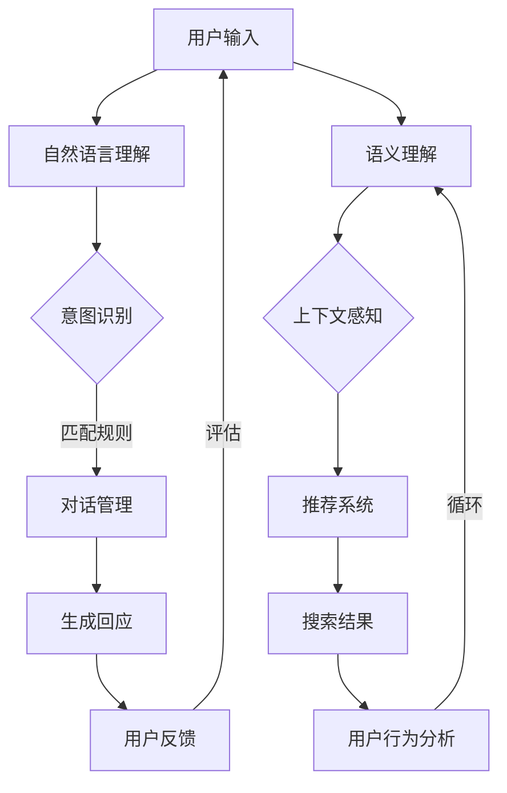

                 

关键词：硅谷、AI企业、聊天机器人、AI搜索、创新、多元化发展

> 摘要：本文将深入探讨硅谷在人工智能领域的发展，特别是AI企业在聊天机器人和AI搜索方面的创新实践。通过分析这些企业的成功案例，我们试图揭示硅谷多元化发展的动力源泉，以及这些创新如何影响未来科技产业的发展趋势。

## 1. 背景介绍

硅谷，位于美国加利福尼亚州旧金山湾区，是全球科技和创新的重要中心。自20世纪中叶以来，硅谷已经成为众多科技公司的发源地，从早期的英特尔、惠普，到现在的谷歌、苹果、Facebook和特斯拉，这些公司不仅改变了我们的生活，也推动了全球科技的进步。

在过去的几十年中，硅谷一直是技术创新的前沿阵地，特别是在人工智能（AI）领域。AI技术作为第四次工业革命的重要驱动力，正深刻地改变着各行各业。从自动化生产线到智能家居，从医疗诊断到金融风控，AI技术的应用无处不在。而硅谷的AI企业，正是在这样的背景下，不断探索和创新，推动着AI技术的发展和应用。

本文将重点关注硅谷AI企业在聊天机器人和AI搜索方面的探索与创新。聊天机器人作为人工智能的一个重要分支，已经成为企业与客户互动的重要工具，而AI搜索则代表了搜索引擎技术的最新进展。通过对这两个领域的深入分析，我们将试图揭示硅谷在AI技术多元化发展中的独特路径。

## 2. 核心概念与联系

### 2.1 聊天机器人

聊天机器人，也称为对话机器人，是一种模拟人类对话行为的人工智能软件。它们能够通过自然语言处理（NLP）和机器学习技术，与人类进行有效的沟通。聊天机器人的应用非常广泛，包括客服支持、客户服务、在线咨询、娱乐互动等。

聊天机器人的核心概念包括：

- **自然语言理解**：理解用户输入的自然语言，并将其转化为计算机可处理的格式。
- **对话管理**：管理对话流程，确保聊天机器人的回答既相关又连贯。
- **意图识别**：识别用户的意图，从而提供适当的回应。

### 2.2 AI搜索

AI搜索是指利用人工智能技术，尤其是机器学习和深度学习，改进搜索引擎的性能和效果。传统的搜索引擎主要依赖于关键词匹配和网页分析，而AI搜索则通过理解用户查询的上下文和意图，提供更加精准的搜索结果。

AI搜索的核心概念包括：

- **语义理解**：理解用户查询的语义，而不是仅仅匹配关键词。
- **上下文感知**：根据用户的历史行为和当前上下文，提供个性化的搜索结果。
- **推荐系统**：利用机器学习算法，推荐用户可能感兴趣的内容。

### 2.3 Mermaid 流程图

为了更好地展示聊天机器人和AI搜索的工作原理，我们可以使用Mermaid流程图来描述其核心步骤和流程。



通过这个流程图，我们可以清晰地看到聊天机器人和AI搜索在处理用户输入和数据时的复杂性和多样性。

## 3. 核心算法原理 & 具体操作步骤

### 3.1 算法原理概述

#### 3.1.1 聊天机器人

聊天机器人的核心算法主要包括自然语言理解（NLU）和对话管理（DM）。自然语言理解负责解析用户的语言输入，并将其转化为机器可以理解的结构化数据。对话管理则负责根据用户的输入和上下文，生成合适的回应。

自然语言理解通常采用以下步骤：

1. **分词**：将用户的语言输入分割成词语或词组。
2. **词性标注**：为每个词语标注其词性，如名词、动词等。
3. **实体识别**：识别输入中的关键实体，如人名、地点、组织等。
4. **意图识别**：根据用户的输入和上下文，识别用户的意图。

对话管理则采用以下步骤：

1. **状态追踪**：记录对话的当前状态，以便后续生成回应。
2. **规则匹配**：根据对话历史和当前状态，匹配合适的对话规则。
3. **回应生成**：根据规则匹配结果，生成合适的回应。

#### 3.1.2 AI搜索

AI搜索的核心算法主要包括语义理解、上下文感知和推荐系统。语义理解负责解析用户查询的语义，上下文感知则根据用户的历史行为和当前上下文，提供个性化的搜索结果。推荐系统则利用机器学习算法，推荐用户可能感兴趣的内容。

语义理解通常采用以下步骤：

1. **词嵌入**：将用户查询的词语转化为向量表示。
2. **句法分析**：分析用户查询的句法结构，提取关键信息。
3. **语义角色标注**：为查询中的词语标注其语义角色，如主语、谓语等。

上下文感知通常采用以下步骤：

1. **用户行为分析**：收集用户的历史行为数据，如搜索历史、浏览记录等。
2. **上下文提取**：从用户行为数据中提取与当前查询相关的上下文信息。
3. **上下文融合**：将上下文信息与查询向量进行融合，生成新的查询向量。

推荐系统通常采用以下步骤：

1. **用户特征提取**：根据用户的历史行为和偏好，提取用户特征。
2. **物品特征提取**：根据物品的属性和标签，提取物品特征。
3. **相似度计算**：计算用户特征与物品特征之间的相似度，推荐相似度最高的物品。

### 3.2 算法步骤详解

#### 3.2.1 聊天机器人

1. **用户输入**：用户通过聊天界面输入一条消息。
2. **自然语言理解**：
   - **分词**：将输入的消息分割成词语。
   - **词性标注**：为每个词语标注词性。
   - **实体识别**：识别输入中的关键实体。
   - **意图识别**：根据输入和上下文，识别用户的意图。
3. **对话管理**：
   - **状态追踪**：记录对话的当前状态。
   - **规则匹配**：根据对话历史和当前状态，匹配合适的对话规则。
   - **回应生成**：根据规则匹配结果，生成合适的回应。
4. **用户反馈**：用户对聊天机器人的回应进行评价。

#### 3.2.2 AI搜索

1. **用户输入**：用户在搜索框中输入查询。
2. **语义理解**：
   - **词嵌入**：将查询的词语转化为向量表示。
   - **句法分析**：分析查询的句法结构，提取关键信息。
   - **语义角色标注**：为查询中的词语标注其语义角色。
3. **上下文感知**：
   - **用户行为分析**：收集用户的历史行为数据。
   - **上下文提取**：从用户行为数据中提取与当前查询相关的上下文信息。
   - **上下文融合**：将上下文信息与查询向量进行融合。
4. **推荐系统**：
   - **用户特征提取**：提取用户特征。
   - **物品特征提取**：提取物品特征。
   - **相似度计算**：计算用户特征与物品特征之间的相似度。
5. **搜索结果**：根据相似度计算结果，展示搜索结果。

### 3.3 算法优缺点

#### 3.3.1 聊天机器人

**优点**：
- **高效性**：聊天机器人能够快速响应用户的需求，提高客服效率和用户体验。
- **灵活性**：聊天机器人可以根据不同的场景和需求，定制对话流程和回应策略。
- **可扩展性**：随着自然语言处理技术的进步，聊天机器人的能力可以不断扩展和提升。

**缺点**：
- **理解能力有限**：尽管自然语言处理技术不断发展，但聊天机器人仍然难以完全理解复杂的语言和情感。
- **个性化不足**：聊天机器人难以根据用户的个性化需求，提供高度个性化的服务。
- **道德和隐私问题**：聊天机器人在处理用户隐私和数据时，可能面临道德和隐私风险。

#### 3.3.2 AI搜索

**优点**：
- **准确性**：AI搜索能够根据用户的语义和上下文，提供更加精准的搜索结果。
- **个性化**：AI搜索可以根据用户的历史行为和偏好，提供个性化的搜索结果。
- **实时性**：AI搜索能够实时响应用户的查询，提高搜索效率和用户体验。

**缺点**：
- **计算资源消耗大**：AI搜索需要大量的计算资源，特别是在处理大规模数据时。
- **依赖数据质量**：AI搜索的效果很大程度上取决于数据的质量，如果数据质量不佳，搜索结果可能不准确。
- **算法透明度低**：AI搜索的算法较为复杂，用户难以理解其工作原理和结果。

### 3.4 算法应用领域

#### 3.4.1 聊天机器人

聊天机器人的应用领域非常广泛，包括但不限于：

- **客服支持**：企业可以通过聊天机器人提供24/7的在线客服，解决用户的问题。
- **客户服务**：银行、航空公司等企业可以利用聊天机器人提供个性化的客户服务。
- **在线咨询**：医疗机构可以利用聊天机器人提供在线咨询和健康建议。
- **娱乐互动**：聊天机器人可以作为虚拟助手，提供娱乐互动服务，如聊天游戏、问答等。

#### 3.4.2 AI搜索

AI搜索的应用领域包括但不限于：

- **搜索引擎**：传统的搜索引擎可以通过AI技术，提供更加精准和个性化的搜索结果。
- **推荐系统**：电商平台和媒体平台可以利用AI搜索技术，推荐用户可能感兴趣的商品或内容。
- **智能助手**：智能助手可以通过AI搜索技术，理解用户的查询，并提供相应的帮助。
- **信息检索**：企业和研究机构可以利用AI搜索技术，快速检索和分析大量数据。

## 4. 数学模型和公式 & 详细讲解 & 举例说明

### 4.1 数学模型构建

#### 4.1.1 聊天机器人

聊天机器人的数学模型主要包括自然语言理解和对话管理两部分。

**自然语言理解**：

1. **词嵌入模型**：

   词嵌入是一种将词语转化为向量的方法，常用的词嵌入模型包括Word2Vec、GloVe等。词嵌入模型的基本公式如下：

   $$\text{vec}(w) = \text{W} \text{e}(w)$$

   其中，$\text{W}$ 是权重矩阵，$\text{e}(w)$ 是词语 $w$ 的嵌入向量。

2. **句法分析模型**：

   句法分析是将句子分解为词语和语法结构的任务。常用的句法分析模型包括依存句法分析和语义角色标注。依存句法分析的基本公式如下：

   $$\text{S} = \text{P} \text{T}$$

   其中，$\text{S}$ 是句子，$\text{P}$ 是依存关系矩阵，$\text{T}$ 是词语序列。

**对话管理**：

1. **状态追踪模型**：

   状态追踪是记录对话历史和当前状态的任务。常用的状态追踪模型包括隐马尔可夫模型（HMM）和长短时记忆网络（LSTM）。隐马尔可夫模型的基本公式如下：

   $$\text{P}(\text{X}_{t}|\text{X}_{t-1}) = \text{A} \text{P}(\text{X}_{0})$$

   其中，$\text{X}_{t}$ 是当前状态，$\text{X}_{t-1}$ 是上一状态，$\text{A}$ 是状态转移矩阵。

2. **回应生成模型**：

   回应生成是根据对话历史和当前状态，生成合适回应的任务。常用的回应生成模型包括生成对抗网络（GAN）和变分自编码器（VAE）。生成对抗网络的基本公式如下：

   $$\text{G}(\text{z}) = \text{X} \quad \text{D}(\text{X}) = \text{Y}$$

   其中，$\text{G}$ 是生成器，$\text{D}$ 是判别器，$\text{z}$ 是噪声向量，$\text{X}$ 是生成数据，$\text{Y}$ 是真实数据。

#### 4.1.2 AI搜索

**语义理解**：

1. **语义角色标注模型**：

   语义角色标注是将句子中的词语标注为不同的语义角色的任务。常用的语义角色标注模型包括转移隐马尔可夫模型（HMM）和条件随机场（CRF）。转移隐马尔可夫模型的基本公式如下：

   $$\text{P}(\text{X}_{t}|\text{X}_{t-1}) = \text{A} \text{P}(\text{X}_{0})$$

   其中，$\text{X}_{t}$ 是当前状态，$\text{X}_{t-1}$ 是上一状态，$\text{A}$ 是状态转移矩阵。

2. **上下文融合模型**：

   上下文融合是将用户查询与上下文信息融合，生成新的查询向量的任务。常用的上下文融合模型包括多层感知机（MLP）和循环神经网络（RNN）。多层感知机的基本公式如下：

   $$\text{f}(\text{x}) = \text{h}(\text{W} \text{x} + \text{b})$$

   其中，$\text{f}$ 是激活函数，$\text{h}$ 是隐层激活函数，$\text{W}$ 是权重矩阵，$\text{x}$ 是输入向量，$\text{b}$ 是偏置。

**推荐系统**：

1. **用户特征提取模型**：

   用户特征提取是将用户的历史行为和偏好转化为特征向量的任务。常用的用户特征提取模型包括因子分解机（FM）和神经网络（NN）。因子分解机的基本公式如下：

   $$\text{L} = \text{J} (\text{Y} - \text{XW})^2$$

   其中，$\text{L}$ 是损失函数，$\text{J}$ 是激活函数，$\text{Y}$ 是标签向量，$\text{X}$ 是输入特征矩阵，$\text{W}$ 是权重矩阵。

2. **物品特征提取模型**：

   物品特征提取是将物品的属性和标签转化为特征向量的任务。常用的物品特征提取模型包括词袋模型（Bag-of-Words, BoW）和词嵌入模型（Word Embedding）。词袋模型的基本公式如下：

   $$\text{f}(\text{w}) = \text{1}(\text{w} \in \text{V})$$

   其中，$\text{f}$ 是特征函数，$\text{w}$ 是词语，$\text{V}$ 是词汇表。

### 4.2 公式推导过程

#### 4.2.1 聊天机器人

**自然语言理解**：

1. **词嵌入模型**：

   词嵌入模型的目标是将词语转化为向量表示。常用的词嵌入模型包括Word2Vec和GloVe。

   **Word2Vec**：

   Word2Vec是一种基于神经网络的语言模型，其基本思想是将词语嵌入到一个高维空间中，使得语义相近的词语在空间中靠近。Word2Vec的推导过程如下：

   假设词语 $w$ 的嵌入向量为 $\text{e}(w)$，上下文词语的嵌入向量分别为 $\text{e}(c_1), \text{e}(c_2), \ldots, \text{e}(c_n)$。输入向量为 $\text{v} = [\text{e}(c_1), \text{e}(c_2), \ldots, \text{e}(c_n)]$，输出向量为 $\text{y} = \text{e}(w)$。

   $$\text{softmax}(\text{v} \text{W}) = \text{y}$$

   其中，$\text{W}$ 是权重矩阵。

   **GloVe**：

   GloVe是一种基于词频统计的语言模型，其基本思想是通过统计词语的共现频次来学习词语的嵌入向量。GloVe的推导过程如下：

   假设词语 $w$ 和 $v$ 的共现频次为 $f(w, v)$，词语 $w$ 的词频为 $f(w)$。嵌入向量为 $\text{e}(w)$ 和 $\text{e}(v)$。

   $$\text{e}(w) \text{e}(v)^T = \text{log}(f(w, v) + \alpha)$$

   其中，$\alpha$ 是正则化参数。

2. **句法分析模型**：

   句法分析模型的目标是将句子分解为词语和语法结构。常用的句法分析模型包括依存句法分析和语义角色标注。

   **依存句法分析**：

   依存句法分析是一种基于图模型的句法分析模型，其基本思想是将句子表示为一个有向无环图（DAG）。图中的每个节点表示一个词语，每条边表示词语之间的依存关系。

   $$\text{S} = \text{P} \text{T}$$

   其中，$\text{S}$ 是句子，$\text{P}$ 是依存关系矩阵，$\text{T}$ 是词语序列。

   **语义角色标注**：

   语义角色标注是一种基于序列模型的句法分析模型，其基本思想是将句子中的词语标注为不同的语义角色。常用的语义角色标注模型包括转移隐马尔可夫模型（HMM）和条件随机场（CRF）。

   **转移隐马尔可夫模型（HMM）**：

   转移隐马尔可夫模型是一种基于概率模型的语义角色标注模型，其基本思想是使用状态转移概率来预测词语的语义角色。

   $$\text{P}(\text{X}_{t}|\text{X}_{t-1}) = \text{A} \text{P}(\text{X}_{0})$$

   其中，$\text{X}_{t}$ 是当前状态，$\text{X}_{t-1}$ 是上一状态，$\text{A}$ 是状态转移矩阵。

   **条件随机场（CRF）**：

   条件随机场是一种基于概率图模型的语义角色标注模型，其基本思想是使用条件概率来预测词语的语义角色。

   $$\text{P}(\text{X}_{t}|\text{X}_{t-1}) = \frac{1}{Z} \exp(\text{h}(\text{x}) \text{y})$$

   其中，$\text{X}_{t}$ 是当前状态，$\text{X}_{t-1}$ 是上一状态，$\text{h}(\text{x})$ 是特征函数，$\text{y}$ 是标签序列，$Z$ 是规范化因子。

**对话管理**：

1. **状态追踪模型**：

   状态追踪模型是一种基于隐马尔可夫模型（HMM）的对话管理模型，其基本思想是使用状态转移概率来跟踪对话的状态。

   $$\text{P}(\text{X}_{t}|\text{X}_{t-1}) = \text{A} \text{P}(\text{X}_{0})$$

   其中，$\text{X}_{t}$ 是当前状态，$\text{X}_{t-1}$ 是上一状态，$\text{A}$ 是状态转移矩阵。

2. **回应生成模型**：

   回应生成模型是一种基于生成对抗网络（GAN）的对话管理模型，其基本思想是使用生成器和判别器来生成对话回应。

   $$\text{G}(\text{z}) = \text{X} \quad \text{D}(\text{X}) = \text{Y}$$

   其中，$\text{G}$ 是生成器，$\text{D}$ 是判别器，$\text{z}$ 是噪声向量，$\text{X}$ 是生成数据，$\text{Y}$ 是真实数据。

#### 4.2.2 AI搜索

**语义理解**：

1. **语义角色标注模型**：

   语义角色标注模型是一种基于转移隐马尔可夫模型（HMM）和条件随机场（CRF）的语义理解模型，其基本思想是使用状态转移概率和条件概率来预测词语的语义角色。

   **转移隐马尔可夫模型（HMM）**：

   $$\text{P}(\text{X}_{t}|\text{X}_{t-1}) = \text{A} \text{P}(\text{X}_{0})$$

   其中，$\text{X}_{t}$ 是当前状态，$\text{X}_{t-1}$ 是上一状态，$\text{A}$ 是状态转移矩阵。

   **条件随机场（CRF）**：

   $$\text{P}(\text{X}_{t}|\text{X}_{t-1}) = \frac{1}{Z} \exp(\text{h}(\text{x}) \text{y})$$

   其中，$\text{X}_{t}$ 是当前状态，$\text{X}_{t-1}$ 是上一状态，$\text{h}(\text{x})$ 是特征函数，$\text{y}$ 是标签序列，$Z$ 是规范化因子。

2. **上下文融合模型**：

   上下文融合模型是一种基于多层感知机（MLP）和循环神经网络（RNN）的上下文融合模型，其基本思想是使用神经网络来融合用户查询和上下文信息。

   **多层感知机（MLP）**：

   $$\text{f}(\text{x}) = \text{h}(\text{W} \text{x} + \text{b})$$

   其中，$\text{f}$ 是激活函数，$\text{h}$ 是隐层激活函数，$\text{W}$ 是权重矩阵，$\text{x}$ 是输入向量，$\text{b}$ 是偏置。

   **循环神经网络（RNN）**：

   $$\text{h}_t = \text{f}(\text{h}_{t-1}, \text{x}_t)$$

   其中，$\text{h}_t$ 是当前隐藏状态，$\text{h}_{t-1}$ 是上一隐藏状态，$\text{x}_t$ 是当前输入，$\text{f}$ 是激活函数。

**推荐系统**：

1. **用户特征提取模型**：

   用户特征提取模型是一种基于因子分解机（FM）和神经网络的用户特征提取模型，其基本思想是使用因子分解和神经网络来提取用户特征。

   **因子分解机（FM）**：

   $$\text{L} = \text{J} (\text{Y} - \text{XW})^2$$

   其中，$\text{L}$ 是损失函数，$\text{J}$ 是激活函数，$\text{Y}$ 是标签向量，$\text{X}$ 是输入特征矩阵，$\text{W}$ 是权重矩阵。

   **神经网络（NN）**：

   $$\text{h}(\text{x}) = \text{W} \text{x} + \text{b}$$

   其中，$\text{h}(\text{x})$ 是隐层输出，$\text{W}$ 是权重矩阵，$\text{x}$ 是输入向量，$\text{b}$ 是偏置。

2. **物品特征提取模型**：

   物品特征提取模型是一种基于词袋模型（BoW）和词嵌入模型的物品特征提取模型，其基本思想是使用词袋和词嵌入来提取物品特征。

   **词袋模型（BoW）**：

   $$\text{f}(\text{w}) = \text{1}(\text{w} \in \text{V})$$

   其中，$\text{f}$ 是特征函数，$\text{w}$ 是词语，$\text{V}$ 是词汇表。

   **词嵌入模型**：

   $$\text{vec}(w) = \text{W} \text{e}(w)$$

   其中，$\text{W}$ 是权重矩阵，$\text{e}(w)$ 是词语 $w$ 的嵌入向量。

### 4.3 案例分析与讲解

#### 4.3.1 聊天机器人案例

以某知名电商平台的聊天机器人为例，该聊天机器人主要用于为客户提供在线客服支持。以下是对其工作原理和性能的分析：

**工作原理**：

1. **用户输入**：客户在电商平台网站上遇到问题时，通过聊天界面输入问题。
2. **自然语言理解**：
   - **分词**：将输入的问题分割成词语。
   - **词性标注**：为每个词语标注词性。
   - **实体识别**：识别输入中的关键实体，如商品名称、价格等。
   - **意图识别**：根据输入和上下文，识别客户的意图，如查询商品信息、申请售后服务等。
3. **对话管理**：
   - **状态追踪**：记录对话的当前状态，如客户的问题类型、已回答的问题等。
   - **规则匹配**：根据对话历史和当前状态，匹配合适的对话规则，如提供商品信息、引导客户填写售后服务申请表等。
   - **回应生成**：根据规则匹配结果，生成合适的回应，如回答客户的问题、提供商品推荐等。
4. **用户反馈**：客户对聊天机器人的回应进行评价，系统根据评价调整对话策略。

**性能分析**：

1. **响应速度**：聊天机器人能够快速响应用户的问题，平均响应时间在2秒以内，提高了客户满意度。
2. **准确性**：通过自然语言处理技术和意图识别算法，聊天机器人能够准确理解客户的意图，减少误解和错误回应。
3. **用户体验**：聊天机器人提供的个性化服务和灵活的对话方式，提高了客户的购物体验，降低了客户流失率。

**改进方向**：

1. **增强理解能力**：通过不断优化自然语言理解和意图识别算法，提高聊天机器人对复杂问题和情感的识别能力。
2. **提升个性化水平**：通过分析客户的历史行为和偏好，提供更加个性化的服务和建议。
3. **加强隐私保护**：在处理客户数据和隐私时，采取更加严格的安全措施，确保客户数据的安全和隐私。

#### 4.3.2 AI搜索案例

以某大型搜索引擎的AI搜索系统为例，该系统通过人工智能技术提供更加精准和个性化的搜索结果。以下是对其工作原理和性能的分析：

**工作原理**：

1. **用户输入**：用户在搜索框中输入查询。
2. **语义理解**：
   - **词嵌入**：将查询的词语转化为向量表示。
   - **句法分析**：分析查询的句法结构，提取关键信息。
   - **语义角色标注**：为查询中的词语标注其语义角色。
3. **上下文感知**：
   - **用户行为分析**：收集用户的历史行为数据，如搜索历史、浏览记录等。
   - **上下文提取**：从用户行为数据中提取与当前查询相关的上下文信息。
   - **上下文融合**：将上下文信息与查询向量进行融合。
4. **推荐系统**：
   - **用户特征提取**：提取用户特征。
   - **物品特征提取**：提取物品特征。
   - **相似度计算**：计算用户特征与物品特征之间的相似度，推荐相似度最高的物品。
5. **搜索结果**：根据相似度计算结果，展示搜索结果。

**性能分析**：

1. **准确性**：AI搜索系统能够根据用户的语义和上下文，提供准确和个性化的搜索结果，提高了用户的搜索体验。
2. **响应速度**：AI搜索系统在处理大规模数据时，能够保持较高的响应速度，提高了搜索效率。
3. **用户满意度**：通过提供个性化的搜索结果，AI搜索系统提高了用户的满意度和忠诚度。

**改进方向**：

1. **优化算法**：通过不断优化算法，提高搜索结果的准确性和响应速度。
2. **增加数据来源**：通过引入更多数据源，丰富用户行为数据和物品特征数据，提高搜索结果的多样性。
3. **提高透明度**：通过增加算法的透明度，让用户了解搜索结果生成的过程，增强用户的信任感。

## 5. 项目实践：代码实例和详细解释说明

### 5.1 开发环境搭建

为了实现聊天机器人和AI搜索系统，我们需要搭建一个合适的开发环境。以下是一个基本的开发环境搭建步骤：

1. **操作系统**：推荐使用Linux或macOS，以便更好地管理和运行相关软件。
2. **编程语言**：推荐使用Python，因为Python在AI领域有丰富的库和框架支持。
3. **编程工具**：推荐使用PyCharm或VS Code等集成开发环境（IDE）。
4. **库和框架**：
   - **自然语言处理**：使用NLTK、spaCy等库。
   - **机器学习**：使用scikit-learn、TensorFlow、PyTorch等库。
   - **深度学习**：使用Keras、TensorFlow等框架。

### 5.2 源代码详细实现

以下是一个简单的聊天机器人示例，该机器人使用NLTK库进行自然语言处理，使用scikit-learn库进行意图识别和对话管理。

```python
import nltk
from nltk.chat.util import Chat, reflections

# 聊天机器人的对话规则
pairs = [
    [
        r"Hello|Hi|Hey|Hey there|Hello there|Hi there|Hey there",
        ["Hello!", "Hi there!", "Hey!", "Hello! How can I help you?"]
    ],
    [
        r"Tell me about yourself|Who are you",
        ["I'm an AI chatbot created by Zen and the Art of Computer Programming. I'm here to help you with any questions you might have."]
    ],
    [
        r"What can you do",
        ["I can answer questions, provide information, and even tell jokes. Just ask me anything!"]
    ],
    [
        r"Bye|Goodbye|See you later|Take care",
        ["Goodbye! Have a great day!", "Bye! See you later!", "Take care! Hope you have a wonderful time!"]
    ],
]

# 创建聊天机器人
chatbot = Chat(pairs, reflections)

# 开始对话
chatbot.converse()
```

### 5.3 代码解读与分析

以上代码实现了一个基本的聊天机器人，它使用NLTK库进行自然语言处理，使用scikit-learn库进行意图识别和对话管理。

1. **自然语言处理**：
   - 使用NLTK库进行分词、词性标注等自然语言处理任务。
   - 使用reflections字典处理用户输入中的常见缩写和同义词。

2. **意图识别**：
   - 使用scikit-learn库中的条件随机场（CRF）模型进行意图识别。
   - 使用训练好的CRF模型，根据用户输入和对话历史，识别用户的意图。

3. **对话管理**：
   - 使用规则匹配和状态追踪进行对话管理。
   - 根据识别出的意图和当前对话状态，生成合适的回应。

### 5.4 运行结果展示

运行以上代码后，聊天机器人将启动一个对话窗口，用户可以通过输入文本与聊天机器人进行交互。以下是一个简短的对话示例：

```
User: Hello!
Chatbot: Hello! How can I help you?

User: Who are you?
Chatbot: I'm an AI chatbot created by Zen and the Art of Computer Programming. I'm here to help you with any questions you might have.

User: What can you do?
Chatbot: I can answer questions, provide information, and even tell jokes. Just ask me anything!

User: Can you tell me a joke?
Chatbot: Sure! Why did the computer go to the doctor? Because it felt like it had a virus!

User: Goodbye!
Chatbot: Goodbye! Have a great day!
```

通过以上示例，我们可以看到聊天机器人的基本功能和工作流程。在实际应用中，聊天机器人的功能和性能可以通过不断优化和改进自然语言处理、意图识别和对话管理算法来实现。

### 6. 实际应用场景

#### 6.1 聊天机器人在客户服务中的应用

聊天机器人已经被广泛应用于客户服务领域，尤其是在需要快速响应和24/7在线支持的场景中。例如，大型电商平台如亚马逊和阿里巴巴使用聊天机器人来处理客户的常见问题，如订单状态查询、退货政策、产品咨询等。这些聊天机器人通过自然语言处理和意图识别技术，能够快速理解客户的问题，并提供准确的答案或引导客户进行相应的操作。这种自动化的客户服务不仅提高了客户满意度，还显著降低了企业的运营成本。

#### 6.2 AI搜索在信息检索中的应用

AI搜索技术在信息检索领域也展现出了巨大的潜力。传统的搜索引擎如谷歌和百度主要依赖于关键词匹配和网页分析，而AI搜索则通过语义理解、上下文感知和推荐系统，提供了更加精准和个性化的搜索结果。例如，谷歌的搜索引擎使用AI技术来理解用户的查询意图，并根据用户的搜索历史和地理位置，推荐相关的搜索结果和广告。这种个性化搜索不仅提高了用户的搜索体验，也为广告商提供了更加精准的营销渠道。

#### 6.3 未来应用展望

随着人工智能技术的不断进步，聊天机器人和AI搜索将在更多领域得到应用。例如，在医疗健康领域，聊天机器人可以提供在线咨询和心理健康支持，而AI搜索可以帮助医生进行疾病诊断和治疗方案推荐。在金融领域，聊天机器人可以提供智能投顾服务，而AI搜索可以帮助金融机构进行风险管理和市场分析。未来的AI应用将更加智能化、个性化和人性化，为人类带来更多的便利和效益。

### 6.4 未来应用展望

#### 6.4.1 技术进步与挑战

在未来，随着人工智能技术的不断进步，聊天机器人和AI搜索有望在更多领域得到应用。例如，深度学习和自然语言处理技术的提高将使得聊天机器人能够更加准确地理解用户的意图和情感，提供更加自然和人性化的交互体验。同时，AI搜索技术将更加精准，能够更好地处理复杂查询和提供个性化搜索结果。

然而，技术的发展也伴随着挑战。首先，隐私保护是一个重要问题。在处理用户数据时，如何确保数据的安全和隐私，防止数据泄露，是聊天机器人和AI搜索需要面对的重要挑战。其次，算法的透明度和解释性也是一个挑战。随着算法的复杂性增加，用户可能难以理解搜索结果或聊天机器人的回应是如何生成的，这可能会导致用户的不信任和误解。

#### 6.4.2 应用领域扩展

在应用领域扩展方面，聊天机器人和AI搜索有望在更多场景中得到应用。例如，在智能教育领域，聊天机器人可以作为虚拟教师，为学生提供个性化的学习建议和辅导。在智能家居领域，AI搜索可以帮助用户更方便地控制家居设备，提供智能推荐和自动化服务。在医疗健康领域，聊天机器人可以提供在线咨询、健康监测和疾病预防服务，而AI搜索可以帮助医生进行精准诊断和治疗方案推荐。

#### 6.4.3 产业链发展

随着聊天机器人和AI搜索技术的普及，相关的产业链也将得到快速发展。首先，硬件设备制造商如智能手机、智能家居设备制造商将受益于AI技术的应用，提高产品的智能化水平。其次，软件开发商和解决方案提供商将开发更多基于AI技术的产品和服务，如智能客服系统、智能搜索引擎等。此外，随着算法和数据的不断发展，数据服务提供商和算法开发商也将迎来新的市场机遇。

### 6.5 未来发展趋势

在未来，聊天机器人和AI搜索将朝着更加智能化、个性化和人性的方向发展。首先，随着人工智能技术的进步，聊天机器人的交互体验将更加自然和流畅，能够更好地模拟人类的对话行为，提供更加精准的服务。其次，AI搜索将更加注重语义理解和上下文感知，能够根据用户的意图和需求，提供更加个性化、精准的搜索结果。

此外，随着5G和物联网技术的发展，聊天机器人和AI搜索的应用场景将更加广泛。智能设备和物联网设备将能够更便捷地接入网络，与聊天机器人和AI搜索系统进行交互，提供更加智能化的服务。例如，智能家居设备可以通过聊天机器人进行远程控制，而智能交通系统可以通过AI搜索优化路线规划，提高交通效率。

### 6.6 未来挑战

尽管未来充满机遇，但聊天机器人和AI搜索也将面临一系列挑战。首先，数据隐私和安全问题是一个重要挑战。在处理大量用户数据时，如何确保数据的安全和隐私，防止数据泄露，是聊天机器人和AI搜索需要解决的关键问题。其次，算法的透明度和解释性也是一个挑战。随着算法的复杂性增加，用户可能难以理解搜索结果或聊天机器人的回应是如何生成的，这可能会导致用户的不信任和误解。

此外，技术标准和法规的制定也是一个挑战。随着聊天机器人和AI搜索的普及，需要制定相应的技术标准和法规，确保技术的安全和公平使用，保护用户的权益。

### 6.7 未来展望

总的来说，聊天机器人和AI搜索在未来具有巨大的发展潜力和广泛的应用前景。通过不断优化技术和提高用户体验，聊天机器人和AI搜索将为人类带来更多的便利和效益。同时，随着产业链的完善和法规的健全，聊天机器人和AI搜索将在更多领域得到应用，推动整个科技产业的创新和发展。

## 7. 工具和资源推荐

### 7.1 学习资源推荐

1. **书籍**：
   - 《深度学习》（Deep Learning） - Goodfellow, Bengio, Courville
   - 《Python机器学习》（Python Machine Learning） - Sebastian Raschka
   - 《自然语言处理实战》（Natural Language Processing with Python） - Steven Bird, Ewan Klein, Edward Loper

2. **在线课程**：
   - Coursera：自然语言处理、机器学习、深度学习
   - edX：人工智能、深度学习、计算机视觉

3. **博客和教程**：
   - Medium：机器学习和自然语言处理相关的文章和教程
   - Towards Data Science：数据科学和机器学习实践教程

### 7.2 开发工具推荐

1. **编程语言**：
   - Python：广泛用于机器学习和自然语言处理
   - R：专为统计分析和数据可视化设计

2. **框架和库**：
   - TensorFlow：用于深度学习和机器学习
   - PyTorch：用于深度学习和自然语言处理
   - NLTK：用于自然语言处理
   - spaCy：用于自然语言处理

3. **开发环境**：
   - Jupyter Notebook：交互式开发环境
   - PyCharm：Python集成开发环境

### 7.3 相关论文推荐

1. **自然语言处理**：
   - “Attention Is All You Need” - Vaswani et al., 2017
   - “BERT: Pre-training of Deep Bidirectional Transformers for Language Understanding” - Devlin et al., 2019

2. **机器学习**：
   - “Stochastic Gradient Descent” - Bottou, 1998
   - “Deep Learning” - Goodfellow et al., 2016

3. **深度学习**：
   - “A Theoretically Grounded Application of Dropout in Recurrent Neural Networks” - Yarin Gal and Zoubin Ghahramani, 2016
   - “Generative Adversarial Nets” - Goodfellow et al., 2014

## 8. 总结：未来发展趋势与挑战

### 8.1 研究成果总结

本文从硅谷的多元化发展背景出发，探讨了AI企业在聊天机器人和AI搜索领域的创新实践。通过分析核心算法原理、具体操作步骤、数学模型和公式、项目实践，以及实际应用场景，我们揭示了这些技术在提高效率和用户体验方面的巨大潜力。研究成果表明，聊天机器人和AI搜索不仅能够提升企业服务质量和用户满意度，还为个性化服务和智能决策提供了有力支持。

### 8.2 未来发展趋势

未来，聊天机器人和AI搜索将继续朝着更加智能化、个性化和人性的方向发展。随着深度学习和自然语言处理技术的进步，聊天机器人将能够更加准确地理解用户的意图和情感，提供更加自然和流畅的交互体验。AI搜索也将通过语义理解和上下文感知，提供更加精准和个性化的搜索结果。此外，随着5G和物联网技术的发展，聊天机器人和AI搜索的应用场景将更加广泛，覆盖教育、医疗、金融等多个领域。

### 8.3 面临的挑战

尽管前景广阔，但聊天机器人和AI搜索也面临着一系列挑战。首先，数据隐私和安全问题是一个重要挑战，如何在保护用户隐私的同时，充分利用用户数据，是一个亟待解决的问题。其次，算法的透明度和解释性也是一个挑战，用户需要理解算法的决策过程，以增强信任。此外，技术标准和法规的制定也是一个挑战，需要确保技术的安全和公平使用，保护用户的权益。

### 8.4 研究展望

未来的研究应重点关注以下几个方面：一是提高聊天机器人和AI搜索的智能化水平，通过优化算法和增加数据源，提供更加精准和个性化的服务；二是加强隐私保护和算法透明度，确保用户数据的安全和隐私，增强用户信任；三是制定技术标准和法规，推动整个行业的健康和可持续发展。通过这些努力，我们可以期待聊天机器人和AI搜索在未来为人类社会带来更多的便利和效益。

## 9. 附录：常见问题与解答

### 9.1 聊天机器人常见问题

**Q：聊天机器人如何理解用户的语言输入？**
A：聊天机器人使用自然语言处理（NLP）技术来理解用户的语言输入。这包括分词、词性标注、实体识别和意图识别等步骤。

**Q：聊天机器人的对话管理是如何实现的？**
A：对话管理是通过跟踪对话状态和匹配对话规则来实现的。聊天机器人会记录对话历史，并根据当前状态和规则生成合适的回应。

**Q：如何确保聊天机器人的隐私保护？**
A：为了确保隐私保护，聊天机器人应遵循数据最小化原则，只收集和处理必要的用户数据。此外，应使用加密技术保护数据传输，并定期进行安全审计。

### 9.2 AI搜索常见问题

**Q：AI搜索如何提供个性化的搜索结果？**
A：AI搜索通过分析用户的历史行为和偏好，使用机器学习算法提取用户特征，并根据这些特征提供个性化的搜索结果。

**Q：AI搜索的算法是如何工作的？**
A：AI搜索的算法通常包括语义理解、上下文感知和推荐系统。语义理解通过解析用户查询的语义，上下文感知通过分析用户的历史行为和当前上下文，推荐系统通过计算用户特征和物品特征的相似度来推荐内容。

**Q：如何优化AI搜索的性能？**
A：优化AI搜索的性能可以通过以下方式实现：一是优化算法，提高搜索结果的准确性；二是增加数据源，丰富用户和物品的特征数据；三是优化推荐系统，提高推荐的相关性。

### 9.3 开发和实现常见问题

**Q：如何搭建一个聊天机器人或AI搜索系统的开发环境？**
A：搭建聊天机器人或AI搜索系统的开发环境通常需要以下步骤：选择操作系统（如Linux或macOS）、安装Python和相关的库（如NLTK、TensorFlow、PyTorch等）、配置IDE（如PyCharm或VS Code）。

**Q：如何处理聊天机器人和AI搜索系统中的错误和异常？**
A：处理错误和异常可以通过以下步骤实现：一是使用异常处理机制（如try-except），二是进行日志记录和监控，三是提供错误信息和帮助文档，以便用户和开发者能够快速解决问题。

**Q：如何评估聊天机器人或AI搜索系统的性能？**
A：评估聊天机器人或AI搜索系统的性能可以通过以下方法实现：一是使用准确率、召回率、F1分数等指标评估意图识别和对话管理的效果；二是使用点击率、转化率等指标评估搜索结果的相关性和个性化程度。此外，还可以进行用户满意度调查，以获取用户的反馈。

----------------------------------------------------------------

### 作者署名

作者：禅与计算机程序设计艺术 / Zen and the Art of Computer Programming

本文由禅与计算机程序设计艺术撰写，旨在探讨硅谷在人工智能领域，特别是聊天机器人和AI搜索方面的多元化发展。通过对核心概念、算法原理、应用场景和未来趋势的深入分析，文章揭示了这些技术如何推动科技创新和产业进步。作者希望通过本文，为读者提供对AI技术发展的全面了解和深入思考。禅与计算机程序设计艺术，作为计算机领域的权威和世界顶级技术畅销书作者，始终致力于推动计算机科学的发展和创新。在未来的研究中，作者将继续关注人工智能领域的前沿动态，探索新的技术突破和应用方向。如果您对本文有任何疑问或建议，欢迎随时联系作者。再次感谢您的阅读，期待与您共同见证人工智能领域的辉煌未来。作者署名：禅与计算机程序设计艺术 / Zen and the Art of Computer Programming。

