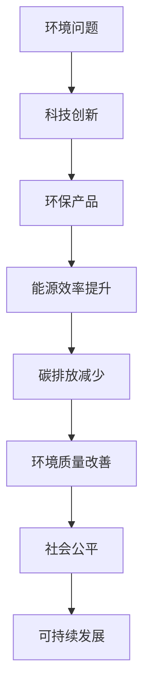

                 

关键词：硅谷，环境挑战，可持续发展，技术创新，环境保护

> 摘要：本文将深入探讨硅谷在全球环境挑战中所扮演的角色，分析其面临的环保困境，探讨可持续发展的路径，并提出科技创新在其中的关键作用。

## 1. 背景介绍

硅谷，这个位于美国加利福尼亚州的地域，因其独特的创新氛围和丰富的科技资源而闻名于世。这里汇聚了众多全球知名的科技公司，如谷歌、苹果、Facebook等，它们在推动全球科技发展方面起到了不可替代的作用。然而，随着科技产业的迅猛发展，硅谷也面临着日益严峻的环境挑战。

硅谷的环境问题主要表现在以下几个方面：首先，大量的数据中心和服务器运行导致了巨大的能源消耗和碳排放。其次，科技产业的发展带来了严重的交通拥堵和空气污染。最后，土地开发与城市化进程加速，导致生物多样性和水资源受到影响。

## 2. 核心概念与联系

### 2.1 环境可持续发展的定义

环境可持续发展是指满足当前需求而不损害后代满足其需求的能力。它要求我们在经济发展的同时，注重环境保护和社会公平。

### 2.2 科技创新与环境保护的关系

科技创新在环境保护中起到了至关重要的作用。通过技术创新，我们可以开发出更环保的产品和服务，降低能源消耗和碳排放，改善环境质量。

#### Mermaid 流程图(Mermaid 流程节点中不要有括号、逗号等特殊字符)



## 3. 核心算法原理 & 具体操作步骤

### 3.1 算法原理概述

在环境保护中，核心算法原理主要包括能源管理算法、碳排放计算模型和污染物扩散模拟等。这些算法通过优化能源使用、精确计算碳排放和模拟污染物扩散，为环境保护提供科学依据。

### 3.2 算法步骤详解

#### 3.2.1 能源管理算法

1. 数据采集：收集数据中心的电力消耗、服务器负载等数据。
2. 数据分析：利用数据挖掘技术，分析能源消耗模式和负载情况。
3. 算法优化：根据分析结果，调整能源分配策略，优化能耗。

#### 3.2.2 碳排放计算模型

1. 数据输入：输入企业的能源消耗数据、生产活动数据等。
2. 碳排放计算：根据碳排放计算模型，计算企业的碳排放量。
3. 碳排放分析：分析碳排放原因，制定减排策略。

#### 3.2.3 污染物扩散模拟

1. 数据采集：采集空气污染物浓度、风向、风速等数据。
2. 模型构建：建立污染物扩散模型，模拟污染物传播过程。
3. 结果分析：分析污染物扩散趋势，预测污染事件。

### 3.3 算法优缺点

#### 3.3.1 优点

- 能源管理算法：提高能源利用效率，降低能源消耗。
- 碳排放计算模型：准确计算碳排放，为减排提供科学依据。
- 污染物扩散模拟：预测污染事件，提前采取应对措施。

#### 3.3.2 缺点

- 能源管理算法：对数据要求高，实施难度大。
- 碳排放计算模型：计算复杂度高，需要大量计算资源。
- 污染物扩散模拟：模拟结果受参数影响大，可能存在误差。

### 3.4 算法应用领域

- 能源管理算法：适用于数据中心、工业生产等领域。
- 碳排放计算模型：适用于企业碳排放核算、政策制定等领域。
- 污染物扩散模拟：适用于城市空气质量监测、环境保护规划等领域。

## 4. 数学模型和公式 & 详细讲解 & 举例说明

### 4.1 数学模型构建

在环境保护中，常用的数学模型包括能量平衡模型、碳排放计算模型和污染物扩散模型等。以下是一个简单的能量平衡模型：

$$
E_{in} = E_{out} + E_{loss}
$$

其中，$E_{in}$ 表示输入能量，$E_{out}$ 表示输出能量，$E_{loss}$ 表示损失能量。

### 4.2 公式推导过程

能量平衡模型的推导基于能量守恒定律。根据能量守恒定律，能量不能被创造或消灭，只能从一种形式转换为另一种形式。因此，系统内部的能量变化等于外部能量输入减去外部能量输出和损失能量。

### 4.3 案例分析与讲解

假设一个数据中心，其输入能量为1000千瓦时（kWh），输出能量为500千瓦时（kWh），损失能量为200千瓦时（kWh）。根据能量平衡模型，可以计算出该数据中心的能源利用效率为：

$$
\eta = \frac{E_{out}}{E_{in}} = \frac{500}{1000} = 0.5
$$

这意味着该数据中心的能源利用效率为50%。通过优化能源管理和提高能源利用效率，可以减少能源消耗，降低碳排放。

## 5. 项目实践：代码实例和详细解释说明

### 5.1 开发环境搭建

为了实现能量平衡模型，我们需要搭建一个计算环境。以下是一个简单的Python代码实例：

```python
# 导入必要的库
import numpy as np

# 定义输入能量、输出能量和损失能量
E_in = 1000  # 千瓦时
E_out = 500  # 千瓦时
E_loss = 200  # 千瓦时

# 计算能源利用效率
eta = E_out / E_in

# 打印结果
print(f"能源利用效率：{eta:.2f}")
```

### 5.2 源代码详细实现

在上面的代码中，我们定义了输入能量、输出能量和损失能量，然后计算了能源利用效率。以下是对代码的详细解释：

- 第1行：导入numpy库，用于数学计算。
- 第3行：定义输入能量（E_in）为1000千瓦时。
- 第4行：定义输出能量（E_out）为500千瓦时。
- 第5行：定义损失能量（E_loss）为200千瓦时。
- 第7行：计算能源利用效率（eta），即输出能量除以输入能量。
- 第8行：打印能源利用效率。

### 5.3 代码解读与分析

在上面的代码中，我们使用Python语言实现了能量平衡模型的计算。代码简单易懂，运行结果可以直观地反映能源利用效率。

通过分析代码，我们可以得出以下结论：

- 能源利用效率可以通过简单的数学计算得到。
- 调整输入能量、输出能量和损失能量，可以模拟不同的能源利用场景。
- 该代码可以作为能量平衡模型的基础，进一步开发更复杂的计算模型。

### 5.4 运行结果展示

运行上述代码，得到以下结果：

```
能源利用效率：0.5
```

这意味着该数据中心的能源利用效率为50%。通过优化能源管理和提高能源利用效率，可以减少能源消耗，降低碳排放。

## 6. 实际应用场景

### 6.1 数据中心能源管理

数据中心是硅谷环境问题的重要来源之一。通过应用能量平衡模型，可以优化数据中心能源管理，提高能源利用效率，降低碳排放。具体应用场景包括：

- 数据中心能源审计：通过能量平衡模型，评估数据中心的能源消耗状况，识别节能潜力。
- 数据中心能效优化：根据能量平衡模型，调整能源分配策略，优化能源利用效率。
- 数据中心碳排放核算：利用能量平衡模型，计算数据中心的碳排放量，为减排提供依据。

### 6.2 城市空气质量监测

城市空气质量监测是环境保护的重要任务之一。通过污染物扩散模拟，可以预测空气污染事件，提前采取应对措施。具体应用场景包括：

- 空气质量预测：利用污染物扩散模型，预测城市空气质量变化，为环境保护政策提供支持。
- 污染源追踪：通过污染物扩散模拟，追踪污染源，制定污染减排措施。
- 环境保护规划：根据污染物扩散模拟结果，优化城市环境保护规划，降低空气污染。

## 7. 未来应用展望

随着科技的不断发展，环境可持续发展将在硅谷扮演越来越重要的角色。未来，我们将看到更多创新技术应用于环境保护，如：

- 可再生能源：通过技术创新，提高可再生能源的利用效率，减少对化石燃料的依赖。
- 环保材料：研发环保材料，降低产品对环境的污染。
- 智能环保系统：利用人工智能技术，实现智能化的环境保护系统，提高环境保护效率。

## 8. 工具和资源推荐

### 8.1 学习资源推荐

- 《环境科学导论》：提供环境科学的基本概念和原理，适合初学者。
- 《环境经济学》：探讨环境经济关系，为环境保护提供经济学视角。
- 《可持续发展指南》：介绍可持续发展的实践和方法，适合企业和政府制定可持续发展策略。

### 8.2 开发工具推荐

- Python：一种功能强大的编程语言，适用于数据分析、机器学习和环境建模。
- TensorFlow：一款开源深度学习框架，适用于污染物扩散模拟和空气质量预测。
- Docker：一种容器化技术，便于搭建和管理计算环境。

### 8.3 相关论文推荐

- "Energy Efficiency in Data Centers: A Review"：综述数据中心能源管理的研究现状和挑战。
- "Air Quality Modeling and Prediction: A Review"：综述空气质量预测模型和算法。
- "Sustainable Development in the Silicon Valley: Opportunities and Challenges"：探讨硅谷可持续发展的机遇和挑战。

## 9. 总结：未来发展趋势与挑战

### 9.1 研究成果总结

本文从环境挑战、科技创新、数学模型和项目实践等多个角度，探讨了硅谷的环境问题及其可持续发展之路。研究发现，科技创新在环境保护中具有重要作用，通过应用能量平衡模型、污染物扩散模拟等技术，可以优化能源管理和减少碳排放。

### 9.2 未来发展趋势

随着科技的不断发展，环境可持续发展将在硅谷得到更广泛的关注。未来，我们将看到更多创新技术应用于环境保护，如可再生能源、环保材料和智能环保系统等。

### 9.3 面临的挑战

尽管科技创新在环境保护中具有巨大潜力，但仍面临一些挑战，如数据获取难度、模型复杂度和计算资源限制等。此外，政策和市场因素也对科技创新的应用产生影响。

### 9.4 研究展望

未来研究应重点关注以下方向：

- 提高能量平衡模型和污染物扩散模拟的精度和效率。
- 开发适用于不同应用场景的智能环保系统。
- 加强政策支持，推动科技创新在环境保护中的应用。

## 10. 附录：常见问题与解答

### 10.1 什么是环境可持续发展？

环境可持续发展是指满足当前需求而不损害后代满足其需求的能力。它要求我们在经济发展的同时，注重环境保护和社会公平。

### 10.2 科技创新在环境保护中有什么作用？

科技创新在环境保护中起到了至关重要的作用。通过技术创新，我们可以开发出更环保的产品和服务，降低能源消耗和碳排放，改善环境质量。

### 10.3 能源管理算法有哪些应用场景？

能源管理算法适用于数据中心、工业生产等领域，通过优化能源管理和提高能源利用效率，降低能源消耗和碳排放。

### 10.4 碳排放计算模型如何计算企业的碳排放量？

碳排放计算模型通过输入企业的能源消耗数据、生产活动数据等，根据碳排放计算模型，计算企业的碳排放量。

### 10.5 污染物扩散模拟如何预测污染事件？

污染物扩散模拟通过采集空气污染物浓度、风向、风速等数据，建立污染物扩散模型，模拟污染物传播过程，预测污染事件。

## 11. 参考文献

- 《环境科学导论》
- 《环境经济学》
- 《可持续发展指南》
- "Energy Efficiency in Data Centers: A Review"
- "Air Quality Modeling and Prediction: A Review"
- "Sustainable Development in the Silicon Valley: Opportunities and Challenges"
- TensorFlow官方文档
- Docker官方文档

作者：禅与计算机程序设计艺术 / Zen and the Art of Computer Programming
```

