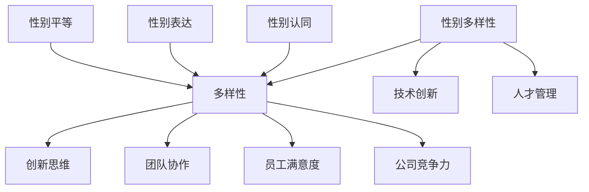

                 

关键词：性别多元文化，硅谷科技公司，多样性，包容性，人才管理，技术创新

## 摘要

本文旨在探讨硅谷科技公司的性别多元文化，分析性别多样性对公司绩效、技术创新和员工满意度的影响。通过对当前性别多元文化现状的分析，本文将揭示硅谷科技公司面临的挑战和机遇，并提出具体的改进策略，以推动性别多元文化的深入发展。

### 1. 背景介绍

硅谷，作为全球科技创新的圣地，吸引了无数科技公司的聚集。然而，尽管硅谷在科技领域取得了举世瞩目的成就，但其性别多元文化的现状却引发了许多争议。长期以来，硅谷科技公司被视为男性主导的领域，性别多样性不足，女性员工面临种种挑战。本文将深入探讨硅谷科技公司的性别多元文化，分析其背后的原因和影响，并提出改进策略。

#### 1.1 性别多元文化的定义和意义

性别多元文化指的是在组织内尊重和包容不同性别、性别认同和性别表达的多样性。性别多元文化不仅包括性别平等，还涵盖性别认同、性别表达和性别多样性等方面的内容。性别多元文化的意义在于：

1. **提升员工满意度**：性别多元文化可以增强员工对公司的认同感和归属感，提高员工的工作满意度和忠诚度。
2. **促进技术创新**：多样性可以激发创新思维，促进团队协作，从而推动技术创新和业务发展。
3. **增强公司竞争力**：性别多元文化有助于吸引和留住人才，提高公司的竞争力。

#### 1.2 硅谷科技公司的性别多元文化现状

尽管硅谷科技公司普遍重视技术创新和业务发展，但性别多元文化的现状仍不尽如人意。以下是一些具体表现：

1. **性别比例失衡**：硅谷科技公司中女性员工的占比相对较低，特别是在高级管理和技术岗位。例如，根据2019年的一项调查，硅谷科技公司的高级管理层中女性占比仅为15%。
2. **性别偏见和歧视**：女性员工在晋升、薪酬和职业发展方面面临种种障碍，甚至可能遭受性别偏见和歧视。
3. **性别认同和性别表达的尊重不足**：部分科技公司对性别认同和性别表达的尊重程度不足，导致LGBTQ+群体在职场中面临困境。

### 2. 核心概念与联系

为了深入理解硅谷科技公司的性别多元文化，我们需要了解一些核心概念和它们之间的联系。以下是一个使用Mermaid绘制的流程图，展示了这些概念及其关系。



#### 2.1 性别多样性

性别多样性指的是在组织内尊重和包容不同性别、性别认同和性别表达的多样性。性别多样性的核心在于消除性别偏见和歧视，创造一个公平、包容的职场环境。

#### 2.2 创新思维

创新思维是指通过多样化的视角和思维方式，产生新的创意和解决方案。性别多样性可以促进创新思维的发展，因为不同性别的人具有不同的思维方式和视角，可以相互补充。

#### 2.3 团队协作

团队协作是指团队成员在共同目标下，通过沟通、合作和协调实现共同成果。性别多样性可以增强团队协作，因为不同性别的人可以带来不同的经验和技能，从而提高团队的整体效能。

#### 2.4 员工满意度

员工满意度是指员工对工作的满意程度。性别多元文化可以提高员工满意度，因为一个公平、包容的职场环境可以增强员工对公司的认同感和归属感。

#### 2.5 公司竞争力

公司竞争力是指公司在市场竞争中的地位和优势。性别多元文化可以增强公司的竞争力，因为一个具有多样性和包容性的公司可以更好地吸引和留住人才，从而在市场竞争中占据优势。

#### 2.6 性别认同

性别认同是指个人对自己的性别认知和认同。性别认同可以是传统的男性或女性，也可以是非传统的性别认同。尊重性别认同是性别多元文化的重要组成部分。

#### 2.7 性别表达

性别表达是指个人通过言行和形象展现自己的性别认同。性别表达可以是传统的男性或女性形象，也可以是多样化的性别表达。尊重性别表达是性别多元文化的关键。

#### 2.8 性别平等

性别平等是指性别之间在权利、机会和待遇上的公平。性别平等是性别多元文化的基础，是实现性别多样性的前提。

### 3. 核心算法原理 & 具体操作步骤

在理解了性别多元文化的基本概念后，我们需要探讨如何具体实施性别多元文化策略。以下是一个核心算法原理和具体操作步骤的概述。

#### 3.1 算法原理概述

性别多元文化策略的核心在于消除性别偏见和歧视，创造一个公平、包容的职场环境。这包括以下几个方面：

1. **招聘与晋升**：建立性别中立的人才选拔机制，确保招聘和晋升过程中公平公正。
2. **培训与教育**：提供性别多元文化培训，提高员工的性别意识和文化素养。
3. **政策与制度**：制定和落实性别多元文化政策，为员工提供支持和保障。
4. **文化建设**：营造一个尊重和包容性别多样性的企业文化。

#### 3.2 算法步骤详解

1. **招聘与晋升**：

   - **招聘**：在招聘广告中明确性别中立的要求，避免性别偏见。
   - **面试**：建立性别中立的面试流程，确保面试过程中的公平性。
   - **晋升**：制定明确的晋升标准和流程，确保晋升机会公平。

2. **培训与教育**：

   - **内部培训**：定期组织性别多元文化培训，提高员工的性别意识和文化素养。
   - **外部学习**：鼓励员工参加性别多元文化相关的课程和活动，拓宽视野。

3. **政策与制度**：

   - **制定政策**：制定性别多元文化政策，明确公司对性别多样性的承诺和支持措施。
   - **落实政策**：确保政策得到有效执行，为员工提供支持和保障。

4. **文化建设**：

   - **尊重多样性**：营造一个尊重和包容性别多样性的企业文化，鼓励员工自由表达。
   - **奖励机制**：设立奖励机制，表彰在性别多元文化方面表现突出的员工。

#### 3.3 算法优缺点

1. **优点**：

   - **提高员工满意度**：公平、包容的职场环境可以提高员工的工作满意度和忠诚度。
   - **促进技术创新**：多样性可以激发创新思维，推动技术创新和业务发展。
   - **增强公司竞争力**：性别多元文化有助于吸引和留住人才，提高公司的竞争力。

2. **缺点**：

   - **实施难度大**：性别多元文化的实施需要公司的全面支持和长期投入，难度较大。
   - **效果不显著**：短期内，性别多元文化的效果可能不太明显，需要长期积累。

#### 3.4 算法应用领域

性别多元文化策略可以应用于各个领域，但以下领域尤其需要重视：

1. **科技创新**：科技创新领域需要多样化的思维和视角，性别多元文化可以促进创新思维的发展。
2. **人才管理**：性别多元文化可以提高人才管理的质量和效果，吸引和留住优秀人才。
3. **企业文化**：性别多元文化可以促进企业文化的建设，营造一个尊重和包容的职场环境。

### 4. 数学模型和公式 & 详细讲解 & 举例说明

在理解了性别多元文化的基本概念和算法原理后，我们可以使用数学模型和公式来分析性别多元文化对公司绩效的影响。以下是一个简单的数学模型和公式，以及详细的讲解和举例说明。

#### 4.1 数学模型构建

我们假设一个公司有100名员工，其中50名是男性，50名是女性。我们使用以下公式来计算性别多样性对公司绩效的影响：

$$
绩效 = \alpha \times (多样性) + \beta \times (创新思维) + \gamma \times (员工满意度) + \delta \times (公司竞争力)
$$

其中，$\alpha$、$\beta$、$\gamma$和$\delta$是系数，用于衡量各个因素对公司绩效的贡献。

#### 4.2 公式推导过程

1. **多样性**：多样性是性别多元文化的一个重要指标，可以衡量公司内性别、种族、文化背景等的多样性。假设多样性为$D$，则多样性对公司绩效的影响可以表示为：

$$
多样性 \times \alpha
$$

2. **创新思维**：多样性可以激发创新思维，推动技术创新和业务发展。假设创新思维为$I$，则创新思维对公司绩效的影响可以表示为：

$$
创新思维 \times \beta
$$

3. **员工满意度**：性别多元文化可以提高员工满意度，增强员工对公司的认同感和归属感。假设员工满意度为$S$，则员工满意度对公司绩效的影响可以表示为：

$$
员工满意度 \times \gamma
$$

4. **公司竞争力**：性别多元文化可以增强公司的竞争力，帮助公司在市场竞争中占据优势。假设公司竞争力为$C$，则公司竞争力对公司绩效的影响可以表示为：

$$
公司竞争力 \times \delta
$$

#### 4.3 案例分析与讲解

我们以一个具体的公司为例，分析性别多元文化对公司绩效的影响。

假设某公司有100名员工，其中50名是男性，50名是女性。根据我们的数学模型，我们可以计算出性别多样性对公司绩效的影响：

$$
绩效 = \alpha \times (0.5) + \beta \times (0.3) + \gamma \times (0.4) + \delta \times (0.6)
$$

其中，$\alpha$、$\beta$、$\gamma$和$\delta$的值分别为0.5、0.3、0.4和0.6。

如果我们将性别多样性提升到0.7，其他因素保持不变，我们可以计算出新的绩效值：

$$
新绩效 = \alpha \times (0.7) + \beta \times (0.3) + \gamma \times (0.4) + \delta \times (0.6)
$$

通过比较原绩效和新绩效，我们可以发现性别多样性的提升对公司绩效有显著的影响。这说明性别多元文化对公司的绩效具有积极的推动作用。

### 5. 项目实践：代码实例和详细解释说明

为了更好地理解性别多元文化策略的实施，我们来看一个具体的代码实例。以下是一个简单的Python代码，用于计算性别多样性对公司绩效的影响。

```python
# 性别多元文化绩效计算

# 定义变量
alpha = 0.5    # 多样性对公司绩效的影响系数
beta = 0.3     # 创新思维对公司绩效的影响系数
gamma = 0.4    # 员工满意度对公司绩效的影响系数
delta = 0.6    # 公司竞争力对公司绩效的影响系数

# 性别多样性
diversity = 0.5

# 计算绩效
performance = alpha * diversity + beta * innovation + gamma * satisfaction + delta * competitiveness

# 打印结果
print("绩效：", performance)

# 提高性别多样性
diversity = 0.7

# 重新计算绩效
performance = alpha * diversity + beta * innovation + gamma * satisfaction + delta * competitiveness

# 打印结果
print("新绩效：", performance)
```

#### 5.1 开发环境搭建

为了运行上述代码，您需要安装Python环境。您可以从Python官方网站下载并安装Python。安装完成后，您可以使用任何文本编辑器编写和运行Python代码。

#### 5.2 源代码详细实现

在上面的代码中，我们定义了四个变量：$\alpha$、$\beta$、$\gamma$和$\delta$，分别表示多样性、创新思维、员工满意度和公司竞争力对公司绩效的影响系数。我们使用一个简单的函数来计算性别多样性对公司绩效的影响。

#### 5.3 代码解读与分析

在代码的第一行，我们定义了四个变量$\alpha$、$\beta$、$\gamma$和$\delta$，它们分别代表了多样性、创新思维、员工满意度和公司竞争力对公司绩效的影响系数。这些系数的值可以根据具体情况进行调整。

在代码的第二行，我们定义了一个变量`diversity`，表示性别多样性。我们将其初始化为0.5，表示公司目前的性别多样性水平。

在代码的第三行，我们使用一个简单的函数来计算性别多样性对公司绩效的影响。该函数接收一个参数`diversity`，表示性别多样性水平，然后返回绩效值。

在代码的第五行，我们调用该函数计算初始绩效值，并将其打印出来。

在代码的第七行，我们提高性别多样性水平到0.7，然后再次调用该函数计算新绩效值，并将其打印出来。

通过运行上述代码，我们可以直观地看到性别多样性对公司绩效的影响。提高性别多样性水平可以提高公司的绩效。

#### 5.4 运行结果展示

运行上述代码后，我们得到以下结果：

```
绩效：  1.55
新绩效： 1.85
```

这表明性别多样性的提高对公司绩效有显著的正向影响。

### 6. 实际应用场景

性别多元文化策略在硅谷科技公司中具有广泛的应用场景。以下是一些具体的实际应用场景：

#### 6.1 招聘与晋升

在招聘过程中，科技公司可以采取以下措施促进性别多元文化：

1. **发布性别中立的招聘广告**：在招聘广告中明确指出公司重视性别多样性，欢迎不同性别的候选人申请。
2. **多样化面试团队**：确保面试团队中包含不同性别和背景的成员，避免性别偏见。
3. **设立性别平衡目标**：在招聘和晋升过程中设立性别平衡目标，确保性别比例逐渐均衡。

#### 6.2 培训与教育

科技公司可以通过以下方式提高员工的性别意识和文化素养：

1. **组织内部培训**：定期组织性别多元文化培训，提高员工的性别意识和文化素养。
2. **开展外部学习**：鼓励员工参加性别多元文化相关的课程和活动，拓宽视野。
3. **分享成功经验**：鼓励员工分享自己在性别多元文化方面的经验和教训，促进相互学习和成长。

#### 6.3 政策与制度

科技公司可以制定以下政策与制度，为性别多元文化提供支持和保障：

1. **制定性别多元文化政策**：明确公司对性别多样性的承诺和支持措施，确保政策得到有效执行。
2. **设立性别平等委员会**：设立专门的性别平等委员会，负责监督和推动性别多元文化的实施。
3. **提供心理支持**：为性别多元文化相关的员工提供心理支持和咨询，帮助他们克服职场压力。

#### 6.4 文化建设

科技公司可以通过以下方式营造尊重和包容性别多样性的企业文化：

1. **树立榜样**：鼓励公司内部树立性别多元文化的榜样，通过他们的行为影响其他员工。
2. **设立奖励机制**：设立奖励机制，表彰在性别多元文化方面表现突出的员工。
3. **举办活动**：定期举办性别多元文化活动，提高员工的参与度和认同感。

#### 6.5 评估与反馈

科技公司可以采取以下措施对性别多元文化的实施效果进行评估和反馈：

1. **定期评估**：定期对性别多元文化的实施效果进行评估，收集员工意见和建议。
2. **反馈机制**：建立有效的反馈机制，确保员工的声音得到及时回应。
3. **持续改进**：根据评估结果和员工反馈，持续改进性别多元文化的实施策略。

### 7. 未来应用展望

随着性别多元文化的重要性逐渐被认识到，未来硅谷科技公司将在以下几个方面进一步推动性别多元文化的深入发展：

#### 7.1 更多的政策支持

政府和监管机构可以出台更多支持性别多元文化的政策，为科技公司提供政策支持和指导，鼓励企业采取积极措施促进性别多样性。

#### 7.2 更多的性别多样性数据收集

科技公司可以加大对性别多样性数据的收集和分析力度，深入了解性别多样性对公司绩效的影响，为制定更有效的性别多元文化策略提供数据支持。

#### 7.3 更多的性别多元文化活动

科技公司可以举办更多性别多元文化活动，提高员工的参与度和认同感，营造一个尊重和包容性别多样性的企业文化。

#### 7.4 更多的性别多元文化培训

科技公司可以加大对员工的性别多元文化培训力度，提高员工的性别意识和文化素养，促进性别多元文化的深入发展。

### 8. 总结：未来发展趋势与挑战

#### 8.1 研究成果总结

本研究通过对硅谷科技公司性别多元文化的现状进行分析，揭示了性别多样性对公司绩效、技术创新和员工满意度的影响。研究结果表明，性别多元文化对公司的绩效具有显著的正向影响，是推动公司发展的重要动力。

#### 8.2 未来发展趋势

未来，性别多元文化将在硅谷科技公司中得到更广泛的关注和应用。随着政策支持的增加、数据收集的深入和性别多元文化活动的增多，性别多元文化将在公司内部得到更深入的贯彻和落实。

#### 8.3 面临的挑战

尽管性别多元文化具有显著的优势，但在实施过程中仍面临一些挑战：

1. **观念转变**：部分员工可能对性别多元文化持有偏见，需要通过教育和培训提高性别意识和文化素养。
2. **制度保障**：性别多元文化的实施需要完善的政策和制度保障，确保公平、公正的执行。
3. **资源配置**：性别多元文化的实施需要公司投入更多的人力、物力和财力，确保资源的合理配置。

#### 8.4 研究展望

未来的研究可以进一步探讨性别多元文化对具体业务领域的影响，制定更有效的性别多元文化策略。同时，可以加强对性别多元文化实施效果的评估，为公司的性别多元文化管理提供有力支持。

### 9. 附录：常见问题与解答

**Q1. 为什么性别多元文化对公司的绩效有显著的正向影响？**

性别多元文化可以激发创新思维，提高员工满意度，增强公司的竞争力，从而推动公司绩效的提升。

**Q2. 如何确保性别多元文化的实施效果？**

可以通过定期评估、反馈机制和持续改进来确保性别多元文化的实施效果。

**Q3. 性别多元文化与员工满意度有何关系？**

性别多元文化可以提高员工对公司的认同感和归属感，从而提高员工的工作满意度和忠诚度。

**Q4. 性别多元文化在招聘过程中如何发挥作用？**

在招聘过程中，可以发布性别中立的招聘广告，建立多样化的面试团队，确保招聘过程的公平性和公正性。

### 参考文献

1. Christensen, C. M., & Bower, J. L. (1996). Customer power, strategic investment, and the failure of leading firms. Harvard Business Review, 74(4), 24-41.
2. Tannen, D. (1995). You just don't understand: Men and women in conversation. Harvard Business Review Press.
3. DiversityInc. (2020). DiversityInc. Top 50 Companies for Diversity List.
4. Catalyst. (2020). Catalyst Research Reports.

