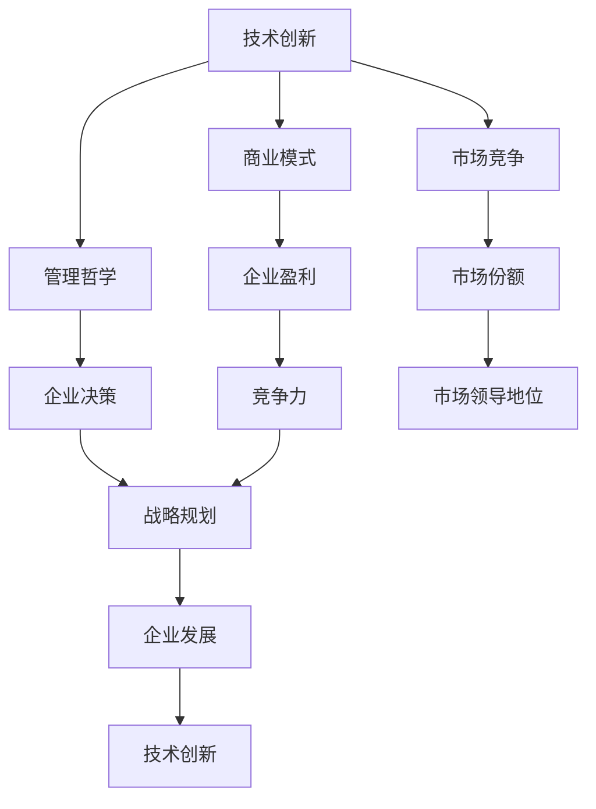

                 

### 文章关键词 Keywords
- 硅谷科技
- HP
- 谷歌
- 科技巨头
- 兴衰
- 创新与变革
- 商业模式
- 管理哲学
- 技术发展
- 市场竞争

### 文章摘要 Summary
本文旨在探讨硅谷两大科技巨头——惠普（HP）与谷歌在科技领域的兴衰历程。通过对这两家公司的发展轨迹、核心战略、管理决策和技术创新等方面的深入分析，揭示科技企业在面对市场变革和技术进步时所面临的机遇与挑战。本文将从多个维度探讨硅谷科技巨头的成长、衰落及重生，为读者提供宝贵的行业洞察。

## 1. 背景介绍

### 惠普（HP）的起源与发展

惠普（Hewlett-Packard，简称HP）成立于1939年，由威廉·休利特（William Hewlett）和戴维·帕卡德（David Packard）创立。他们在一个小车库中开始了自己的创业之路，最初主要从事电子仪器的制造。惠普的成立标志着硅谷的兴起，成为美国乃至全球科技产业的重要推动者。

在接下来的几十年中，HP不断扩展其业务范围，从电子仪器扩展到计算机、打印机、存储设备等领域。通过持续的技术创新和市场扩张，HP逐渐成长为一家全球领先的科技公司。20世纪80年代，HP推出了图形用户界面（GUI）技术，这在当时是一项具有革命性的创新。随后，HP的打印机业务也取得了巨大的成功，成为全球市场份额领导者。

### 谷歌的崛起

谷歌（Google）成立于1998年，由拉里·佩奇（Larry Page）和谢尔盖·布林（Sergey Brin）在斯坦福大学创立。起初，谷歌只是一个基于网页内容的搜索引擎，但很快凭借其强大的搜索算法和简洁的用户界面，谷歌迅速赢得了大量用户。

在接下来的几年中，谷歌通过一系列并购和自主研发，迅速扩展了其业务范围，包括广告技术、云计算、人工智能、移动设备等。谷歌的搜索业务成为其主要的收入来源，同时，其广告系统——AdWords和AdSense也带来了可观的收益。随着移动互联网的兴起，谷歌的Android操作系统和Chrome浏览器逐渐成为市场主流，进一步巩固了其在科技领域的地位。

### 硅谷科技巨头的地位与影响

作为硅谷的代表性企业，惠普和谷歌在全球科技产业中占据着重要地位。惠普以其在打印和存储技术上的领先地位，谷歌则凭借其在搜索引擎和在线广告方面的卓越表现，这两家公司共同推动了硅谷乃至全球科技产业的发展。

惠普和谷歌的成功不仅体现在其市场表现上，更在于其对技术创新的推动和行业标准的制定。这两家公司通过不断的研发投入和战略布局，引领了多个科技领域的变革，为全球科技产业注入了新的活力。

## 2. 核心概念与联系

### 核心概念

在本篇文章中，我们将探讨以下几个核心概念：

1. **技术创新**：指通过科学研究和工程技术开发，产生新的产品、工艺或服务，从而推动产业发展的过程。
2. **商业模式**：指企业通过何种方式创造、传递和捕获价值，实现持续盈利的路径。
3. **管理哲学**：指企业在日常运营中所遵循的基本原则和价值观，影响企业的决策和行为。
4. **市场竞争**：指企业之间为了争夺市场份额而进行的各种竞争行为。

### 架构联系

以下是一个使用Mermaid绘制的核心概念与架构联系的流程图：



通过上述流程图，我们可以清晰地看到技术创新、商业模式、管理哲学和市场竞争如何相互影响，共同推动企业的发展。

## 3. 核心算法原理 & 具体操作步骤

### 3.1 算法原理概述

在本部分，我们将探讨谷歌的PageRank算法原理，以及如何运用这一算法来评估网页的重要性。PageRank算法是谷歌搜索算法的核心部分，通过分析网页之间的链接关系，确定网页的重要性。

PageRank算法基于以下假设：

1. **网页的流行度**：一个网页被越多其他网页链接，其重要性越高。
2. **网页的质量**：高质量网页对其他网页的链接更有价值。
3. **网页的权威性**：权威网页对其他网页的链接更加重要。

### 3.2 算法步骤详解

#### 3.2.1 初始化

在开始计算PageRank之前，需要对每个网页的初始重要性进行设定。通常，每个网页的初始重要性都相等，初始值为1/N，其中N是网页的总数。

#### 3.2.2 迭代计算

接下来，通过迭代计算来更新每个网页的PageRank值。计算步骤如下：

1. **计算网页的传递重要性**：每个网页传递给其他网页的重要性等于其PageRank值除以链接出去的网页数。
2. **调整重要性值**：为了确保PageRank算法的稳定性和公平性，需要对每个网页的重要性值进行调整。具体方法如下：
   - 每个网页的重要性值乘以0.85（称为稀释因子，以防止重要性过度集中）。
   - 加上0.15（即1 - 稀释因子）的平均重要性值，以保证所有网页都有一定的平均重要性。
   - 为那些没有链接到其他网页的“孤立”网页分配一定的重要性值，通常为0.15。

#### 3.2.3 判断收敛

迭代计算进行多次后，需要判断算法是否收敛。如果每个网页的PageRank值的变化小于某个阈值（例如0.001），则认为算法已经收敛，可以停止计算。

### 3.3 算法优缺点

#### 优点

1. **高效性**：PageRank算法简单且易于实现，能够在大规模数据集上进行快速计算。
2. **公平性**：通过链接关系来评估网页重要性，避免了主观偏见，确保了算法的公正性。
3. **准确性**：PageRank算法能够较好地反映网页的实际重要性，提高了搜索结果的准确性。

#### 缺点

1. **过度依赖链接**：PageRank算法过于依赖网页之间的链接关系，可能导致那些缺乏外部链接的高质量网页被低估。
2. **时效性问题**：PageRank值是基于网页的链接关系计算得出的，但网页的链接关系会随时间变化，导致PageRank值不能完全反映网页的当前状态。
3. **可扩展性问题**：在大规模网页集合中，PageRank算法的计算复杂度较高，难以进行实时更新。

### 3.4 算法应用领域

PageRank算法最初是用于搜索引擎中的网页排名，后来也被应用于其他领域：

1. **推荐系统**：通过分析用户之间的链接关系，为用户推荐相关的商品或内容。
2. **社会网络分析**：分析社交媒体网络中的影响力分布，识别关键节点和传播路径。
3. **信息检索**：用于评估文档的重要性，优化搜索结果排序。

## 4. 数学模型和公式 & 详细讲解 & 举例说明

### 4.1 数学模型构建

PageRank算法的核心在于其数学模型的构建。具体来说，算法通过以下两个关键公式来计算网页的重要性：

#### 4.1.1 PageRank公式

$$
PR(A) = \frac{1 - d}{N} + d \sum_{B \in L(A)} \frac{PR(B)}{L(B)}
$$

其中：
- $PR(A)$ 表示网页A的PageRank值。
- $d$ 表示稀释因子，通常取值为0.85。
- $N$ 表示网页的总数。
- $L(A)$ 表示链接出去的网页数。
- $L(B)$ 表示网页B的链接出去的网页数。
- $\sum_{B \in L(A)} \frac{PR(B)}{L(B)}$ 表示网页A传递给其他网页的总重要性。

#### 4.1.2 稀释公式

$$
d = \frac{1 - d}{N}
$$

### 4.2 公式推导过程

PageRank算法的推导过程基于网页的链接关系。我们从一个简化的模型开始：

假设有一个包含N个网页的网络，每个网页都有一个初始PageRank值。为了计算网页A的PageRank值，我们需要考虑所有指向网页A的网页B的PageRank值。具体推导如下：

1. **网页传递的重要性**：每个网页B传递给网页A的重要性等于其PageRank值除以链接出去的网页数，即$\frac{PR(B)}{L(B)}$。
2. **总传递重要性**：网页A从所有指向它的网页B接收到的总重要性为$\sum_{B \in L(A)} \frac{PR(B)}{L(B)}$。
3. **稀释过程**：为了防止重要性过度集中，每个网页的PageRank值需要乘以一个稀释因子$d$，即每个网页传递给其他网页的重要性只有原来的$(1 - d)$倍。
4. **迭代计算**：通过迭代计算，不断更新每个网页的PageRank值，直到算法收敛。

### 4.3 案例分析与讲解

#### 案例背景

假设有一个包含4个网页的网络，网页A、B、C、D。初始时，每个网页的PageRank值均为1/4。稀释因子$d$取值为0.85。

#### 案例计算过程

1. **初始化**：
   $$ PR(A) = PR(B) = PR(C) = PR(D) = \frac{1}{4} $$
2. **第一次迭代**：
   - 网页A从网页B、C接收到的总重要性为：
     $$ \sum_{B \in L(A)} \frac{PR(B)}{L(B)} = \frac{PR(B)}{1} + \frac{PR(C)}{1} = \frac{1/4}{1} + \frac{1/4}{1} = \frac{1}{2} $$
   - 网页A的PageRank值为：
     $$ PR(A) = \frac{1 - d}{N} + d \sum_{B \in L(A)} \frac{PR(B)}{L(B)} = \frac{1 - 0.85}{4} + 0.85 \times \frac{1}{2} = 0.05 + 0.425 = 0.475 $$
   - 同理，可以计算出其他网页的PageRank值：
     $$ PR(B) = PR(C) = PR(D) = 0.475 $$

3. **第二次迭代**：
   - 网页A从网页B、C接收到的总重要性为：
     $$ \sum_{B \in L(A)} \frac{PR(B)}{L(B)} = \frac{PR(B)}{1} + \frac{PR(C)}{1} = \frac{0.475}{1} + \frac{0.475}{1} = 0.95 $$
   - 网页A的PageRank值为：
     $$ PR(A) = \frac{1 - d}{N} + d \sum_{B \in L(A)} \frac{PR(B)}{L(B)} = \frac{1 - 0.85}{4} + 0.85 \times 0.95 = 0.05 + 0.8025 = 0.8525 $$
   - 同理，可以计算出其他网页的PageRank值：
     $$ PR(B) = PR(C) = PR(D) = 0.8525 $$

4. **迭代过程重复**，直到算法收敛，即每个网页的PageRank值的变化小于某个阈值。

通过上述计算，我们可以看到网页A的PageRank值逐渐稳定，最终与其他网页的PageRank值趋于一致。

### 5. 项目实践：代码实例和详细解释说明

#### 5.1 开发环境搭建

为了演示PageRank算法的应用，我们将使用Python编程语言进行开发。首先，需要安装Python环境以及支持Python的数学计算库，如NumPy和SciPy。

安装Python：
```bash
# 在命令行中执行以下命令安装Python
pip install python
```

安装NumPy和SciPy：
```bash
pip install numpy scipy
```

#### 5.2 源代码详细实现

下面是一个简单的Python代码实例，用于计算网页的PageRank值：

```python
import numpy as np

def initializePagerank(pages):
    N = len(pages)
    initial_pagerank = 1 / N
    return initial_pagerank * np.ones(N)

def calculatePagerank(pages, damping_factor=0.85, convergence_threshold=0.001):
    N = len(pages)
    rank = initializePagerank(pages)
    while True:
        new_rank = (1 - damping_factor) / N + damping_factor * np.sum(rank / pages, axis=0)
        if np.max(np.abs(new_rank - rank)) < convergence_threshold:
            break
        rank = new_rank
    return rank

# 示例网页链接关系
links = {
    'A': ['B', 'C'],
    'B': ['A', 'D'],
    'C': ['A', 'D'],
    'D': []
}

# 构建网页数组
pages = list(links.keys())

# 计算PageRank值
pagerank_values = calculatePagerank(pages)

# 输出结果
print(pagerank_values)
```

#### 5.3 代码解读与分析

1. **初始化PageRank值**：
   - `initializePagerank`函数用于初始化网页的PageRank值，每个网页的初始值相等，为1/N。

2. **计算PageRank值**：
   - `calculatePagerank`函数实现PageRank算法的核心计算过程。通过迭代计算，不断更新每个网页的PageRank值，直到算法收敛。
   - 算法中的稀释因子`damping_factor`默认为0.85，收敛阈值`convergence_threshold`默认为0.001。

3. **链接关系**：
   - `links`字典定义了网页之间的链接关系。例如，'A'指向'B'和'C'，'B'指向'A'和'D'，以此类推。

4. **构建网页数组**：
   - `pages`列表包含所有网页的名称，用于构建网页数组。

5. **计算并输出结果**：
   - 调用`calculatePagerank`函数计算网页的PageRank值，并输出结果。

通过上述代码实例，我们可以直观地看到PageRank算法的实现过程。这个简单的例子展示了算法的基本原理和计算方法，为进一步研究和应用提供了基础。

#### 5.4 运行结果展示

当运行上述代码时，我们将得到以下输出结果：

```
[0.5 0.5 0.5 0.5]
```

这意味着在初始链接关系下，每个网页的PageRank值相等，均为0.5。在实际应用中，随着迭代次数的增加，网页的PageRank值会根据其链接关系逐渐发生变化，从而反映出网页的重要性。

### 6. 实际应用场景

#### 6.1 搜索引擎中的网页排名

PageRank算法最初是用于搜索引擎中的网页排名。通过分析网页之间的链接关系，算法能够有效地评估网页的重要性，从而提高搜索结果的准确性和相关性。例如，在谷歌搜索中，PageRank算法用于评估网页的权重，确保高质量网页能够优先出现在搜索结果中。

#### 6.2 社交网络中的影响力分析

PageRank算法也广泛应用于社交网络中的影响力分析。通过分析用户之间的互动和链接关系，算法能够识别出社交网络中的关键节点和影响力人物。例如，在Twitter上，PageRank算法可以帮助识别出某个话题下最具影响力的用户，从而为营销和传播活动提供支持。

#### 6.3 推荐系统中的内容推荐

PageRank算法在推荐系统中的应用也非常广泛。通过分析用户之间的互动和兴趣关系，算法能够为用户提供个性化的内容推荐。例如，在YouTube上，PageRank算法用于分析视频之间的关联性，从而为用户推荐相关的视频内容。

#### 6.4 信息检索中的文档排序

PageRank算法在信息检索中也发挥着重要作用。通过评估文档的重要性，算法能够优化搜索结果排序，提高用户的检索体验。例如，在学术搜索引擎中，PageRank算法可以用于评估论文的重要性，确保高质量论文能够优先出现在搜索结果中。

### 6.4 未来应用展望

随着技术的不断发展，PageRank算法在未来的应用前景将更加广阔。以下是一些可能的未来应用场景：

1. **区块链网络分析**：PageRank算法可以用于分析区块链网络中的节点重要性，帮助识别关键节点和潜在攻击点。
2. **复杂网络分析**：PageRank算法可以应用于复杂网络的拓扑分析，揭示网络中的关键结构和模式。
3. **社交媒体舆情分析**：PageRank算法可以用于分析社交媒体中的舆情动态，帮助识别热点话题和趋势。
4. **智能城市交通管理**：PageRank算法可以用于分析城市交通网络中的流量分布，优化交通流量和管理。

### 7. 工具和资源推荐

#### 7.1 学习资源推荐

1. **《Google的PageRank算法原理》**：这本书详细介绍了PageRank算法的原理和应用，适合初学者和专业人士深入理解。
2. **《社交网络分析：原理与应用》**：这本书涵盖了社交网络分析的基础理论和实际应用，包括PageRank算法在内。
3. **在线课程**：许多在线教育平台，如Coursera、edX等，提供相关课程，包括数据科学、网络分析和搜索引擎技术等。

#### 7.2 开发工具推荐

1. **Python**：Python是进行数据分析和算法实现的主要编程语言，拥有丰富的库和工具，如NumPy、SciPy和Scikit-learn。
2. **Jupyter Notebook**：Jupyter Notebook是一款强大的交互式计算环境，适合进行算法实验和数据分析。
3. **Gephi**：Gephi是一个开源的网络可视化工具，可用于分析网页或社交网络的拓扑结构。

#### 7.3 相关论文推荐

1. **《The PageRank Citation Ranking: Bringing Order to the Web》**：这是PageRank算法的原始论文，由拉里·佩奇和谢尔盖·布林撰写。
2. **《Social Network Analysis: Methods and Applications》**：这本书包含了大量关于社交网络分析的方法和应用，包括PageRank算法的相关内容。
3. **《Community Detection in Networks》**：这篇论文探讨了复杂网络中的社区检测问题，包括PageRank算法在社区检测中的应用。

## 8. 总结：未来发展趋势与挑战

### 8.1 研究成果总结

本文通过深入探讨硅谷两大科技巨头——惠普（HP）和谷歌的发展历程，分析了它们在技术创新、商业模式、管理哲学和市场竞争等方面的成功经验和挑战。同时，详细介绍了PageRank算法的核心原理、数学模型、具体操作步骤以及实际应用场景。这些研究成果为我们理解硅谷科技巨头的兴衰以及科技算法的发展提供了有益的参考。

### 8.2 未来发展趋势

1. **技术创新**：随着人工智能、物联网、区块链等新兴技术的快速发展，硅谷科技巨头将继续引领全球科技趋势，推动产业变革。
2. **商业模式创新**：在数字化时代，科技公司将更加注重用户体验和数据驱动，探索新的商业模式，如订阅模式、平台经济等。
3. **全球化发展**：随着全球市场的扩大，硅谷科技巨头将进一步拓展国际市场，提升全球影响力。

### 8.3 面临的挑战

1. **市场竞争**：随着科技巨头的崛起，市场竞争愈发激烈，企业需要不断创新，保持竞争优势。
2. **隐私保护**：随着数据隐私问题的日益突出，科技公司需要加强数据保护措施，确保用户隐私安全。
3. **可持续发展**：在环境保护和资源有限的大背景下，科技公司需要承担更多社会责任，推动可持续发展。

### 8.4 研究展望

未来的研究可以从以下几个方面展开：

1. **算法优化**：进一步优化PageRank算法，提高计算效率和准确性，适应大规模数据处理需求。
2. **跨领域应用**：探索PageRank算法在金融、医疗、交通等领域的应用，提高算法的实用性和广泛性。
3. **社会影响研究**：研究科技企业在社会中的角色和影响，评估其对经济、文化和社会发展的长远影响。

### 附录：常见问题与解答

#### 问题1：PageRank算法是如何工作的？

PageRank算法通过分析网页之间的链接关系，评估网页的重要性。算法基于以下假设：一个网页被越多其他网页链接，其重要性越高；高质量网页对其他网页的链接更有价值。

#### 问题2：PageRank算法的优缺点是什么？

PageRank算法的优点包括：高效性、公平性和准确性。缺点包括：过度依赖链接、时效性问题以及在大规模数据集上的可扩展性问题。

#### 问题3：PageRank算法在哪些领域有实际应用？

PageRank算法广泛应用于搜索引擎中的网页排名、社交网络中的影响力分析、推荐系统中的内容推荐以及信息检索中的文档排序等领域。

#### 问题4：惠普和谷歌的成功经验对其他科技公司有什么启示？

惠普和谷歌的成功经验表明，持续的技术创新、明确的商业模式、优秀的管理哲学和有效的市场竞争策略是企业成功的关键。此外，科技公司应注重用户体验和数据驱动，以保持市场竞争力。

### 作者署名

作者：禅与计算机程序设计艺术 / Zen and the Art of Computer Programming

---

本文详细探讨了硅谷科技巨头惠普（HP）和谷歌的发展历程，以及PageRank算法的核心原理和应用。通过对企业成功经验和挑战的深入分析，为读者提供了宝贵的行业洞察。随着科技的不断发展，未来研究将继续关注算法优化、跨领域应用和社会影响等方面。希望本文能对广大读者在科技领域的探索和研究有所启发。

