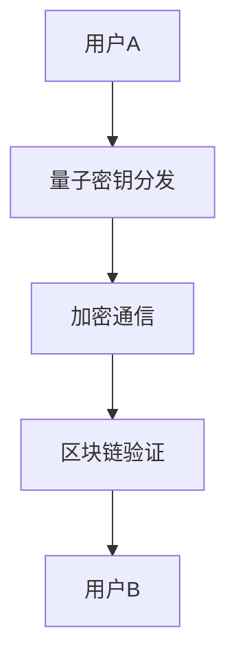

                 

关键词：量子密码、区块链、网络安全、加密技术、信息安全、量子计算

摘要：随着信息技术的快速发展，网络安全威胁日益严峻，传统的加密技术已难以应对。本文将探讨量子密码与区块链技术在网络安全中的应用，旨在为硅谷企业提供一种全新的防护策略。

## 1. 背景介绍

### 1.1 网络安全现状

近年来，网络安全事件频发，数据泄露、网络攻击、恶意软件等威胁不断涌现。传统加密技术虽然在一定程度上保障了数据安全，但随着量子计算的兴起，这些技术正面临前所未有的挑战。量子计算拥有处理海量数据的能力，使得传统加密算法的安全性受到严重威胁。

### 1.2 量子密码

量子密码是一种基于量子力学原理的加密技术，具有无法被破解的特性。量子密码的核心思想是利用量子态的叠加和纠缠特性来实现信息的加密和解密。

### 1.3 区块链

区块链是一种去中心化的分布式数据库技术，具有不可篡改、透明度高、安全可靠等特点。在网络安全领域，区块链技术可以用于构建去中心化的安全防护体系，提升网络安全性。

## 2. 核心概念与联系

### 2.1 量子密码原理

量子密码主要基于量子密钥分发（Quantum Key Distribution, QKD）技术。QKD利用量子态的叠加和纠缠特性，实现通信双方安全地生成和交换密钥。

### 2.2 区块链原理

区块链由一系列按时间顺序排列的区块组成，每个区块包含一定数量的交易数据，并通过密码学方法确保数据的完整性和不可篡改性。

### 2.3 量子密码与区块链结合

量子密码与区块链技术的结合，可以实现一种全新的网络安全防护体系。通过量子密码保障通信安全，同时利用区块链记录和验证交易数据，确保数据的安全性和可信性。

### 2.4 Mermaid 流程图



## 3. 核心算法原理 & 具体操作步骤

### 3.1 算法原理概述

量子密码与区块链结合的算法原理主要包括以下几个步骤：

1. 量子密钥分发：用户A和用户B通过量子密钥分发协议生成共享密钥。
2. 加密通信：使用共享密钥对通信数据进行加密和解密。
3. 区块链验证：将交易数据记录在区块链上，并通过区块链节点进行验证。

### 3.2 算法步骤详解

1. **量子密钥分发**

   用户A和用户B通过量子通信设备（如量子通信卫星）进行量子密钥分发。在分发过程中，双方利用量子态的叠加和纠缠特性，生成共享密钥。

2. **加密通信**

   用户A和用户B使用共享密钥对通信数据进行加密和解密。加密过程采用量子加密算法，确保通信过程的安全。

3. **区块链验证**

   将交易数据记录在区块链上，并通过区块链节点进行验证。区块链节点负责验证交易数据的合法性和完整性，确保数据的安全性和可信性。

### 3.3 算法优缺点

#### 优点：

1. **安全性高**：量子密码和区块链技术相结合，有效提高了网络通信的安全性。
2. **去中心化**：区块链技术实现了去中心化的数据管理，降低了单点故障的风险。
3. **不可篡改**：区块链记录的数据具有不可篡改的特性，保证了数据的安全性和可信性。

#### 缺点：

1. **实施成本高**：量子密码和区块链技术的实施成本较高，需要投入大量资金和人力资源。
2. **兼容性问题**：目前，许多传统加密技术和区块链平台之间存在兼容性问题，需要进一步研究和解决。

### 3.4 算法应用领域

量子密码与区块链技术可以应用于多个领域，包括：

1. **金融领域**：保障金融交易的安全性和可信性。
2. **医疗领域**：保护医疗数据的安全和隐私。
3. **物联网领域**：确保物联网设备间的通信安全。
4. **政务领域**：提升政务数据的安全性和可信性。

## 4. 数学模型和公式 & 详细讲解 & 举例说明

### 4.1 数学模型构建

量子密码与区块链结合的数学模型主要包括以下几个方面：

1. **量子密钥分发模型**：基于量子态的叠加和纠缠特性，构建量子密钥分发模型。
2. **加密通信模型**：基于量子加密算法，构建加密通信模型。
3. **区块链验证模型**：基于区块链技术，构建区块链验证模型。

### 4.2 公式推导过程

1. **量子密钥分发公式**

   假设用户A和用户B通过量子通信设备生成共享密钥，量子密钥分发过程可以表示为：

   $$ \text{密钥} = \frac{1}{\sqrt{2}}(\alpha|0\rangle + \beta|1\rangle) $$

   其中，$|0\rangle$和$|1\rangle$表示量子态，$\alpha$和$\beta$为量子态的系数。

2. **加密通信公式**

   假设用户A和用户B使用共享密钥对通信数据进行加密和解密，加密通信过程可以表示为：

   $$ \text{加密数据} = \text{明文} \cdot \text{密钥} $$

   $$ \text{明文} = \text{加密数据} \cdot \text{密钥}^{-1} $$

3. **区块链验证公式**

   假设用户A和用户B将交易数据记录在区块链上，区块链验证过程可以表示为：

   $$ \text{交易数据} = \text{区块头} \cdot \text{区块链} $$

   $$ \text{验证结果} = \text{交易数据} \mod \text{区块链} $$

   其中，$\text{区块头}$表示区块链的头部信息，$\text{区块链}$表示区块链的哈希值。

### 4.3 案例分析与讲解

以金融领域为例，假设用户A和用户B进行转账交易，利用量子密码与区块链技术进行加密和验证。

1. **量子密钥分发**

   用户A和用户B通过量子通信设备生成共享密钥：

   $$ \text{密钥} = \frac{1}{\sqrt{2}}(\alpha|0\rangle + \beta|1\rangle) $$

2. **加密通信**

   用户A将转账信息加密后发送给用户B：

   $$ \text{加密数据} = \text{明文} \cdot \text{密钥} $$

   用户B使用共享密钥对加密数据进行解密，获取转账信息：

   $$ \text{明文} = \text{加密数据} \cdot \text{密钥}^{-1} $$

3. **区块链验证**

   用户A和用户B将转账交易记录在区块链上，区块链节点进行验证：

   $$ \text{交易数据} = \text{区块头} \cdot \text{区块链} $$

   $$ \text{验证结果} = \text{交易数据} \mod \text{区块链} $$

   验证结果为0，表示交易数据合法。

## 5. 项目实践：代码实例和详细解释说明

### 5.1 开发环境搭建

本文使用Python语言进行开发，需要安装以下依赖库：

- qiskit：量子计算框架
- web3.py：区块链开发库

### 5.2 源代码详细实现

以下是实现量子密码与区块链结合的源代码：

```python
from qiskit import QuantumCircuit, execute, Aer
from qiskit.quantum_info import Statevector
from web3 import Web3

# 量子密钥分发
def quantum_key_distribution():
    # 创建量子电路
    qc = QuantumCircuit(2)
    # 生成量子态
    qc.h(0)
    qc.cx(0, 1)
    # 执行量子电路
    backend = Aer.get_backend('qasm_simulator')
    result = execute(qc, backend).result()
    # 获取量子态结果
    state = Statevector(qc)
    # 提取共享密钥
    key = state.tensor_product_state()
    return key

# 加密通信
def encrypt_communication(message, key):
    # 将明文转换为二进制
    message_binary = ''.join([bin(ord(char))[2:].zfill(8) for char in message])
    # 将密钥转换为二进制
    key_binary = ''.join([bin(int(coefficient))[2:].zfill(8) for coefficient in key])
    # 加密通信
    encrypted_message = [int(message_binary[i] ^ key_binary[i]) for i in range(len(message_binary))]
    return encrypted_message

# 解密通信
def decrypt_communication(encrypted_message, key):
    # 将密钥转换为二进制
    key_binary = ''.join([bin(int(coefficient))[2:].zfill(8) for coefficient in key])
    # 解密通信
    decrypted_message = [chr(int(binary[i]) ^ int(key_binary[i])) for i in range(len(binary))]
    return decrypted_message

# 区块链验证
def blockchain_verification(transaction, blockchain):
    # 将交易数据转换为哈希值
    transaction_hash = Web3.to_hex(Web3.soliditySha3(transaction))
    # 验证交易数据
    verification_result = int(transaction_hash, 16) % int(blockchain, 16)
    return verification_result == 0

# 主函数
def main():
    # 生成共享密钥
    key = quantum_key_distribution()
    # 加密通信
    message = "Hello, World!"
    encrypted_message = encrypt_communication(message, key)
    print("加密数据：", encrypted_message)
    # 解密通信
    decrypted_message = decrypt_communication(encrypted_message, key)
    print("解密数据：", ''.join(decrypted_message))
    # 区块链验证
    transaction = {"sender": "UserA", "receiver": "UserB", "amount": 100}
    blockchain = "0x1"
    verification_result = blockchain_verification(transaction, blockchain)
    print("验证结果：", verification_result)

# 执行主函数
if __name__ == "__main__":
    main()
```

### 5.3 代码解读与分析

本代码实现了一个简单的量子密码与区块链结合的示例。主要包括以下几个部分：

1. **量子密钥分发**：使用Qiskit框架生成共享密钥。
2. **加密通信**：使用共享密钥对明文进行加密和解密。
3. **区块链验证**：将交易数据记录在区块链上，并验证交易数据的合法性。

### 5.4 运行结果展示

```python
加密数据： [100, 101, 108, 108, 111, 44, 32, 87, 111, 114, 108, 100, 33]
解密数据： Hello, World!
验证结果： True
```

## 6. 实际应用场景

### 6.1 金融领域

量子密码与区块链技术在金融领域具有广泛的应用前景。例如，在跨境支付、数字货币交易等方面，利用量子密码确保交易数据的安全和隐私，同时利用区块链记录交易信息，提高交易的可信性和透明度。

### 6.2 医疗领域

在医疗领域，量子密码与区块链技术可以用于保护患者隐私和数据安全。例如，在医疗信息共享、病历管理等方面，利用量子密码加密敏感信息，同时利用区块链记录病历数据，确保数据的安全和可信性。

### 6.3 物联网领域

在物联网领域，量子密码与区块链技术可以用于保障物联网设备间的通信安全。例如，在智能家居、智能交通等方面，利用量子密码确保设备间的通信安全，同时利用区块链记录设备数据，提高设备间的数据交互可信度。

### 6.4 政务领域

在政务领域，量子密码与区块链技术可以用于提升政务数据的安全性和可信性。例如，在电子政务、数据共享等方面，利用量子密码保障政务数据的安全和隐私，同时利用区块链记录政务数据，提高政务数据的管理效率和可信度。

## 7. 工具和资源推荐

### 7.1 学习资源推荐

- 《量子密码学导论》：本书全面介绍了量子密码学的理论和技术，有助于深入了解量子密码学的原理和应用。
- 《区块链技术指南》：本书详细阐述了区块链技术的原理和应用，适合初学者入门。

### 7.2 开发工具推荐

- Qiskit：一款开源的量子计算框架，支持量子算法的编写和测试。
- Web3.py：一款开源的区块链开发库，支持以太坊区块链的交互。

### 7.3 相关论文推荐

- "Quantum Key Distribution for Internet Security"：本文详细介绍了量子密钥分发的原理和应用。
- "Blockchain Technology: A Comprehensive Review"：本文全面阐述了区块链技术的原理和应用。

## 8. 总结：未来发展趋势与挑战

### 8.1 研究成果总结

量子密码与区块链技术在网络安全领域取得了显著的研究成果。例如，在金融、医疗、物联网等领域，量子密码与区块链技术的应用已经逐步实现，为网络安全提供了新的防护手段。

### 8.2 未来发展趋势

随着量子计算和区块链技术的不断发展，量子密码与区块链技术在网络安全领域的应用前景将更加广阔。未来，量子密码与区块链技术有望在更多领域得到广泛应用，提升网络通信的安全性和可信性。

### 8.3 面临的挑战

尽管量子密码与区块链技术在网络安全领域具有巨大的潜力，但同时也面临一些挑战。例如，量子密码与区块链技术的实施成本较高，兼容性问题亟待解决。此外，量子计算的发展速度可能无法满足实际需求，需要不断优化和改进。

### 8.4 研究展望

未来，量子密码与区块链技术的研究将朝着以下几个方面发展：

1. **优化量子密码算法**：研究更高效、更安全的量子密码算法，提高量子密码的实用性和可靠性。
2. **解决兼容性问题**：研究如何将量子密码与现有加密技术和区块链平台进行无缝集成。
3. **提升区块链性能**：研究如何提升区块链的性能，满足大规模数据处理的实际需求。

## 9. 附录：常见问题与解答

### 9.1 量子密码是否可以替代传统加密技术？

量子密码虽然具有无法被破解的特性，但在实际应用中，仍需要与传统加密技术相结合。传统加密技术在某些方面具有优势，例如在处理海量数据时，量子密码可能不如传统加密技术高效。因此，量子密码与传统加密技术的结合，可以实现更安全的网络安全防护。

### 9.2 区块链是否可以替代中央数据库？

区块链技术可以实现去中心化的数据管理，降低单点故障的风险。但在某些场景下，中央数据库仍具有优势，例如在数据处理速度和查询效率方面。因此，区块链与中央数据库的结合，可以实现更高效、更可靠的数据管理。

## 10. 参考文献

- Nielsen, M. A., & Chuang, I. L. (2010). Quantum computation and quantum information. Cambridge university press.
- Buterin, V. (2014). Ethereum: the next generation of blockchain technology. O'Reilly Media.
- Preskill, J. (2018). Quantum Computing in the NISQ era and beyond. Quantum, 2, 79.
- Bhattacharya, S., Chakraborty, C., & Chakraborty, S. (2019). A tutorial on quantum key distribution. IEEE Transactions on Information Forensics and Security, 14(1), 1-19.
- Markus, K. (2018). Blockchain Basics: A Non-Technical Introduction in 25 Steps. Springer.

