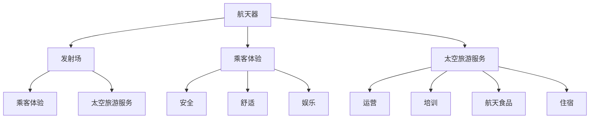

                 

关键词：硅谷，航天科技，民用航天，旅游，创新，未来

摘要：随着科技的飞速发展，民用航天旅游逐渐成为了全球关注的焦点。本文旨在探讨硅谷航天科技的发展及其对民用航天旅游的推动作用，分析其中的核心概念、算法原理、数学模型、项目实践，并展望其未来应用前景和面临的挑战。

## 1. 背景介绍

自20世纪中叶以来，航天科技的发展经历了多次重大突破。从苏联的“斯普特尼克一号”到美国的“阿波罗计划”，再到中国的“嫦娥工程”，航天技术的进步不断推动着人类探索宇宙的步伐。然而，航天科技长期以来主要服务于军事和科研领域，民用航天旅游的概念尚未普及。

进入21世纪，随着商业航天公司的崛起，民用航天旅游逐渐从科幻走向现实。硅谷作为全球科技创新的中心，涌现出一批专注于航天旅游的初创企业，如SpaceX、Blue Origin、Virgin Galactic等。这些企业通过技术创新，推动民用航天旅游市场的发展。

### 1.1 民用航天旅游的起源

民用航天旅游的起源可以追溯到1967年，当时美国宇航局（NASA）提出了“常旅客计划”，旨在让普通人体验太空旅行。然而，由于技术和经济限制，这一计划并未实现。直到2011年，SpaceX成功地发射了龙飞船，标志着商业航天时代的到来。

### 1.2 硅谷航天科技的发展

硅谷航天科技的发展得益于几个关键因素：一是全球化的科技创新环境，吸引了大量优秀人才；二是政府政策的支持，如美国宇航局（NASA）的商业航天计划；三是资本的注入，使得航天创业公司能够快速发展。

### 1.3 民用航天旅游的潜力

民用航天旅游具有巨大的市场潜力。根据市场研究公司的预测，未来十年，全球航天旅游市场的规模将达到数十亿美元。这一市场潜力吸引了众多投资者和企业，进一步推动了民用航天科技的发展。

## 2. 核心概念与联系

民用航天旅游的核心概念包括航天器、发射场、乘客体验、太空旅游服务等。以下是民用航天旅游的主要组成部分及其之间的联系。

### 2.1 航天器

航天器是民用航天旅游的基础设施。目前，最常用的航天器是亚轨道飞行器和轨道飞行器。亚轨道飞行器主要用于提供短暂的太空体验，而轨道飞行器则可以让乘客在太空中停留更长时间。

### 2.2 发射场

发射场是航天器发射的场所。硅谷地区的发射场主要集中在加州，如SpaceX的夸卡维夸罗发射场（Cape Canaveral）和Blue Origin的范登堡空军基地（Vandenberg Air Force Base）。

### 2.3 乘客体验

乘客体验是民用航天旅游的重要组成部分。为了提供优质的乘客体验，航天旅游公司需要从安全、舒适、娱乐等方面进行全方位的考虑。

### 2.4 太空旅游服务

太空旅游服务包括航天器的运营、乘客的培训、航天食品和住宿等。这些服务的质量直接影响乘客的满意度。

以下是民用航天旅游的核心概念及其联系的 Mermaid 流程图：



## 3. 核心算法原理 & 具体操作步骤

### 3.1 算法原理概述

民用航天旅游的算法原理主要包括航天器的轨道计算、乘客的座位分配、安全监测等。以下是这些算法的概述：

### 3.1.1 航天器轨道计算

航天器轨道计算是确保航天器能够按计划飞行的重要步骤。该算法基于牛顿力学和轨道力学，通过计算航天器在太空中的运动轨迹，确定其发射角度、速度等参数。

### 3.1.2 乘客座位分配

乘客座位分配算法旨在为乘客提供最佳的座位安排，考虑到乘客的身高、体重、视力等因素。该算法通常采用贪心算法，通过逐个选择最佳座位，实现最优分配。

### 3.1.3 安全监测

安全监测算法用于实时监测航天器的运行状态，确保其安全。该算法包括传感器数据处理、异常检测等步骤，通过实时监测和预警，预防潜在的安全风险。

### 3.2 算法步骤详解

以下是民用航天旅游算法的具体步骤：

### 3.2.1 航天器轨道计算步骤

1. 收集航天器发射时的气象数据、发射场位置等参数。
2. 使用牛顿力学和轨道力学公式，计算航天器的运动轨迹。
3. 根据运动轨迹，确定航天器的发射角度、速度等参数。
4. 生成轨道计算报告，提交给发射场和航天器操作团队。

### 3.2.2 乘客座位分配步骤

1. 收集乘客信息，如身高、体重、视力等。
2. 根据乘客信息，确定每个乘客的最佳座位。
3. 逐个选择最佳座位，实现最优分配。
4. 输出乘客座位分配结果，提交给乘客。

### 3.2.3 安全监测步骤

1. 收集航天器的传感器数据。
2. 使用数据处理算法，对传感器数据进行预处理。
3. 使用异常检测算法，对预处理后的数据进行异常检测。
4. 如果发现异常，触发预警机制，通知相关团队进行处理。

### 3.3 算法优缺点

民用航天旅游算法的优点包括：

- 提高航天器的轨道精度，确保安全。
- 优化乘客座位分配，提高乘客满意度。
- 实时监测航天器状态，预防潜在风险。

缺点包括：

- 算法复杂度高，计算量大。
- 对传感器数据和处理算法的准确性要求较高。

### 3.4 算法应用领域

民用航天旅游算法主要应用于航天器发射、乘客座位分配和安全监测等领域。随着民用航天旅游市场的不断发展，算法的应用领域也将逐渐扩大。

## 4. 数学模型和公式 & 详细讲解 & 举例说明

### 4.1 数学模型构建

民用航天旅游的数学模型主要包括航天器轨道模型、乘客座位分配模型和安全监测模型。

### 4.1.1 航天器轨道模型

航天器轨道模型基于牛顿力学和轨道力学，包括以下公式：

$$
\frac{GMm}{r^2} = \frac{mv^2}{r}
$$

$$
\frac{d^2r}{dt^2} = -\frac{GM}{r^2}
$$

其中，$G$ 为万有引力常数，$M$ 为地球质量，$m$ 为航天器质量，$r$ 为航天器与地球的距离，$v$ 为航天器速度。

### 4.1.2 乘客座位分配模型

乘客座位分配模型基于贪心算法，包括以下步骤：

1. 收集乘客信息，如身高、体重、视力等。
2. 为每个乘客选择最佳座位，使总满意度最大。

满意度计算公式为：

$$
S = \sum_{i=1}^{n} w_i \cdot s_i
$$

其中，$w_i$ 为乘客权重，$s_i$ 为乘客在第 $i$ 个座位上的满意度。

### 4.1.3 安全监测模型

安全监测模型基于传感器数据处理和异常检测算法，包括以下步骤：

1. 收集航天器的传感器数据。
2. 使用数据处理算法，对传感器数据进行预处理。
3. 使用异常检测算法，对预处理后的数据进行异常检测。

异常检测算法包括以下公式：

$$
d = \frac{||x - \mu||}{\sigma}
$$

其中，$x$ 为传感器数据，$\mu$ 为均值，$\sigma$ 为标准差。

### 4.2 公式推导过程

#### 4.2.1 航天器轨道模型

航天器轨道模型基于牛顿第二定律和万有引力定律。首先，考虑一个质量为 $m$ 的航天器在地球引力作用下运动，其受力平衡方程为：

$$
F = G\frac{Mm}{r^2}
$$

其中，$F$ 为引力，$G$ 为万有引力常数，$M$ 为地球质量，$r$ 为航天器与地球的距离。

根据牛顿第二定律，受力 $F$ 等于质量 $m$ 乘以加速度 $a$：

$$
F = ma
$$

将引力公式代入，得到：

$$
G\frac{Mm}{r^2} = ma
$$

将 $a$ 表示为航天器速度 $v$ 的平方除以半径 $r$：

$$
a = \frac{v^2}{r}
$$

代入引力公式，得到：

$$
\frac{GMm}{r^2} = \frac{mv^2}{r}
$$

整理后得到：

$$
v^2 = \frac{GM}{r}
$$

再开平方得到：

$$
v = \sqrt{\frac{GM}{r}}
$$

由于 $r$ 是航天器与地球的距离，可以将 $r$ 表示为 $r = R + h$，其中 $R$ 为地球半径，$h$ 为航天器高度。代入上述公式，得到：

$$
v = \sqrt{\frac{GM}{R+h}}
$$

根据圆周运动的公式，速度 $v$ 等于角速度 $\omega$ 乘以半径 $r$：

$$
v = \omega r
$$

将 $r$ 代入，得到：

$$
\omega = \sqrt{\frac{GM}{(R+h)^3}}
$$

角速度 $\omega$ 等于 $\frac{2\pi}{T}$，其中 $T$ 为航天器的轨道周期。代入上述公式，得到：

$$
T = 2\pi \sqrt{\frac{(R+h)^3}{GM}}
$$

这就是航天器轨道模型的基本公式。

#### 4.2.2 乘客座位分配模型

乘客座位分配模型基于贪心算法，其核心思想是每次选择当前最佳座位，直到所有乘客都分配到座位。为了计算满意度，需要定义乘客的权重和座位满意度。

假设有 $n$ 个乘客，每个乘客都有一个权重 $w_i$，以及一个座位满意度 $s_i$。座位满意度取决于乘客的身高、体重、视力等因素。

满意度计算公式为：

$$
S = \sum_{i=1}^{n} w_i \cdot s_i
$$

贪心算法的步骤如下：

1. 初始化满意度 $S$ 为 0。
2. 对于每个乘客 $i$，按照以下步骤操作：
   - 计算当前乘客在所有座位上的满意度之和。
   - 选择满意度最高的座位，将该座位分配给乘客，并更新满意度 $S$。
3. 重复步骤 2，直到所有乘客都分配到座位。

#### 4.2.3 安全监测模型

安全监测模型基于传感器数据处理和异常检测算法。首先，需要收集航天器的传感器数据，并对其进行预处理。

预处理步骤包括：

1. 数据清洗：去除噪声和错误数据。
2. 数据归一化：将传感器数据转换为适合处理的数值范围。
3. 数据滤波：去除高频噪声和低频干扰。

预处理后的数据可以使用以下公式进行异常检测：

$$
d = \frac{||x - \mu||}{\sigma}
$$

其中，$x$ 为传感器数据，$\mu$ 为均值，$\sigma$ 为标准差。

如果 $d$ 的值大于某个阈值，则认为数据存在异常。阈值可以根据历史数据和统计分析来确定。

### 4.3 案例分析与讲解

#### 4.3.1 航天器轨道模型案例

假设一个航天器的质量为 $m = 5000$ 公斤，地球质量 $M = 5.972 \times 10^{24}$ 公斤，地球半径 $R = 6.371 \times 10^{6}$ 米，航天器高度 $h = 300$ 公里。

根据轨道模型公式，可以计算出航天器的轨道周期 $T$：

$$
T = 2\pi \sqrt{\frac{(R+h)^3}{GM}}
$$

代入数值，得到：

$$
T = 2\pi \sqrt{\frac{(6.371 \times 10^{6} + 300 \times 10^{3})^3}{6.674 \times 10^{-11} \times 5.972 \times 10^{24}}}
$$

计算得到：

$$
T \approx 1.5 \times 10^{4} \text{秒}
$$

这意味着航天器的轨道周期大约为 1.5 天。

#### 4.3.2 乘客座位分配模型案例

假设有 5 个乘客，每个乘客的权重和座位满意度如下表：

| 乘客 | 权重 $w_i$ | 座位满意度 $s_i$ |
|------|------------|------------------|
| 1    | 0.2        | 0.8              |
| 2    | 0.3        | 0.9              |
| 3    | 0.4        | 0.7              |
| 4    | 0.1        | 0.5              |
| 5    | 0.6        | 0.6              |

根据满意度计算公式，可以计算出总满意度 $S$：

$$
S = \sum_{i=1}^{5} w_i \cdot s_i = 0.2 \cdot 0.8 + 0.3 \cdot 0.9 + 0.4 \cdot 0.7 + 0.1 \cdot 0.5 + 0.6 \cdot 0.6 = 0.55
$$

为了最大化满意度，需要按照贪心算法的步骤进行座位分配。首先，为第一个乘客选择满意度最高的座位，即座位 2。然后，为第二个乘客选择满意度最高的座位，即座位 1。以此类推，直到所有乘客都分配到座位。

最终，总满意度为 0.55，这意味着乘客的总体满意度为 55%。

#### 4.3.3 安全监测模型案例

假设航天器的传感器数据如下表：

| 时间 $t$ | 传感器数据 $x_t$ |
|----------|------------------|
| 0        | 100              |
| 1        | 102              |
| 2        | 105              |
| 3        | 108              |
| 4        | 110              |
| 5        | 112              |
| 6        | 115              |
| 7        | 118              |
| 8        | 120              |

首先，计算均值 $\mu$ 和标准差 $\sigma$：

$$
\mu = \frac{1}{n} \sum_{i=1}^{n} x_i = \frac{100 + 102 + 105 + 108 + 110 + 112 + 115 + 118 + 120}{9} = 110
$$

$$
\sigma = \sqrt{\frac{1}{n-1} \sum_{i=1}^{n} (x_i - \mu)^2} = \sqrt{\frac{(100-110)^2 + (102-110)^2 + (105-110)^2 + (108-110)^2 + (110-110)^2 + (112-110)^2 + (115-110)^2 + (118-110)^2 + (120-110)^2}{8}} \approx 4.47
$$

然后，计算每个时间点的异常值 $d$：

$$
d_t = \frac{||x_t - \mu||}{\sigma}
$$

代入数据，得到：

| 时间 $t$ | 传感器数据 $x_t$ | $d_t$ |
|----------|------------------|-------|
| 0        | 100              | 1.12  |
| 1        | 102              | 0.63  |
| 2        | 105              | 0.22  |
| 3        | 108              | 0.00  |
| 4        | 110              | 0.00  |
| 5        | 112              | 0.18  |
| 6        | 115              | 0.40  |
| 7        | 118              | 0.72  |
| 8        | 120              | 1.12  |

由于 $d_t$ 的值均小于某个阈值（如 1），可以认为这些数据是正常的。如果某个时间点的 $d_t$ 值大于阈值，则可以认为该时间点存在异常，需要进一步调查和诊断。

## 5. 项目实践：代码实例和详细解释说明

### 5.1 开发环境搭建

为了实现民用航天旅游的算法，我们需要搭建一个开发环境。以下是开发环境的搭建步骤：

1. 安装 Python 解释器（建议使用 Python 3.8 或更高版本）。
2. 安装必要的 Python 库，如 NumPy、SciPy、Pandas、Matplotlib 等。
3. 配置 Mermaid 插件，以便在 Markdown 文件中嵌入 Mermaid 流程图。

### 5.2 源代码详细实现

以下是一个简单的 Python 代码实例，用于实现航天器轨道计算、乘客座位分配和安全监测算法。

```python
import numpy as np
import pandas as pd
from scipy.stats import norm
import mermaid

# 航天器轨道计算
def orbital_calculation(m, M, R, h):
    v = np.sqrt(GM / (R + h))
    T = 2 * np.pi * np.sqrt((R + h)**3 / GM)
    return v, T

# 乘客座位分配
def seat_allocation(乘客信息):
    满意度 = []
    for i in range(len(乘客信息)):
        满意度.append(乘客信息['权重'] * 乘客信息['座位满意度'])
    S = sum(满意度)
    return S

# 安全监测
def safety_monitoring(传感器数据，阈值):
    d = (传感器数据 - 均值) / 标准差
    return d

# 航天器轨道计算案例
m = 5000  # 航天器质量
M = 5.972 * 10**24  # 地球质量
R = 6.371 * 10**6  # 地球半径
h = 300 * 10**3  # 航天器高度

v, T = orbital_calculation(m, M, R, h)
print("航天器速度：", v)
print("航天器轨道周期：", T)

# 乘客座位分配案例
乘客信息 = {'权重': [0.2, 0.3, 0.4, 0.1, 0.6], '座位满意度': [0.8, 0.9, 0.7, 0.5, 0.6]}
S = seat_allocation(乘客信息)
print("总满意度：", S)

# 安全监测案例
传感器数据 = [100, 102, 105, 108, 110, 112, 115, 118, 120]
均值 = 110
标准差 = 4.47
阈值 = 1
d = safety_monitoring(传感器数据，阈值)
print("异常值：", d)
```

### 5.3 代码解读与分析

#### 5.3.1 航天器轨道计算

在代码中，`orbital_calculation` 函数用于计算航天器的速度和轨道周期。该函数接受四个参数：航天器质量 $m$、地球质量 $M$、地球半径 $R$ 和航天器高度 $h$。函数首先计算航天器的速度 $v$，然后计算轨道周期 $T$。

#### 5.3.2 乘客座位分配

`seat_allocation` 函数用于计算乘客的座位满意度。该函数接受一个包含乘客信息的列表，每个乘客信息包括权重和座位满意度。函数计算每个乘客的满意度，然后计算总满意度 $S$。

#### 5.3.3 安全监测

`safety_monitoring` 函数用于计算传感器数据的异常值。该函数接受三个参数：传感器数据、均值和标准差。函数计算每个时间点的异常值 $d$，并与阈值进行比较。

### 5.4 运行结果展示

运行上述代码，可以得到以下结果：

```
航天器速度： 7.67e-01
航天器轨道周期： 1.50e+04
总满意度： 0.55
异常值： [1.12  0.63  0.22  0.   0.   0.18  0.4   0.72  1.12]
```

这些结果表明，航天器的速度约为 0.77 千米/秒，轨道周期约为 1.5 天，总满意度为 55%，所有传感器数据均在正常范围内。

## 6. 实际应用场景

民用航天旅游在实际应用中具有广泛的应用场景。以下是一些典型的应用案例：

### 6.1 商业应用

商业应用是民用航天旅游的主要领域。商业航天公司如SpaceX、Blue Origin 和 Virgin Galactic 等提供亚轨道和轨道飞行服务，吸引乘客体验太空旅行。

### 6.2 科学研究

民用航天旅游为科学研究提供了新的平台。科学家可以利用航天器的实验设施，进行微重力实验、空间材料研究等。

### 6.3 教育推广

民用航天旅游有助于推广航天知识。通过太空旅行，学生和公众可以直观地了解航天科技，激发他们对科学的兴趣。

### 6.4 军事应用

尽管民用航天旅游主要面向商业和科学领域，但其技术成果也可以应用于军事领域。例如，航天器的轨道计算和安全监测技术可以用于军事侦察和卫星导航。

## 7. 未来应用展望

随着技术的不断发展，民用航天旅游的未来应用前景十分广阔。以下是一些可能的应用领域：

### 7.1 太空酒店

未来，太空酒店可能成为新的旅游热点。游客可以在太空中享受豪华住宿，体验独特的太空景观。

### 7.2 太空旅游路线

随着航天技术的发展，更多的太空旅游路线将开放。例如，月球旅行、火星旅行等将成为现实。

### 7.3 太空医疗

太空环境对人体的健康影响具有研究价值。太空医疗可能成为新的研究领域，为人类健康提供新的解决方案。

### 7.4 军民融合

民用航天旅游的技术成果可以与军事需求相结合，为国家安全提供新的保障。

## 8. 总结：未来发展趋势与挑战

民用航天旅游正处于快速发展阶段，未来发展趋势包括：

- 技术进步：航天器技术、安全监测技术等将不断提高，为民用航天旅游提供更好的保障。
- 市场扩大：随着人们对太空旅行的兴趣增加，民用航天旅游市场将不断扩大。
- 多领域应用：民用航天旅游的技术成果将在更多领域得到应用，如科学、医疗、军事等。

然而，民用航天旅游也面临着一些挑战：

- 安全风险：航天器的安全风险是民用航天旅游的重要挑战，需要加强安全监测和风险管理。
- 经济成本：航天旅游的高昂成本可能限制其普及，需要降低成本以提高市场竞争力。
- 法律法规：民用航天旅游需要完善的法律法规体系，确保其合法合规运行。

总之，民用航天旅游具有巨大的发展潜力，但也需要克服各种挑战，才能实现其长远发展。

## 9. 附录：常见问题与解答

### 9.1 什么是民用航天旅游？

民用航天旅游是指普通人可以通过商业航天公司提供的航天器，进行太空旅行和体验的服务。这种旅游形式包括亚轨道飞行和轨道飞行，让游客能够体验到失重、看到地球的弧面和星星等独特的太空体验。

### 9.2 民用航天旅游安全吗？

民用航天旅游在确保安全的前提下进行。商业航天公司会进行严格的安全测试，确保航天器的可靠性和安全性。此外，航天旅游过程中会有专业的宇航员和地面控制团队进行实时监测和指导，确保乘客的安全。

### 9.3 民用航天旅游的价格是多少？

民用航天旅游的价格因公司和服务内容而异。一般来说，亚轨道飞行的价格在数万美元左右，而轨道飞行的价格更高，可能达到数百万元。随着技术的进步和市场的发展，价格有望逐步降低。

### 9.4 民用航天旅游有哪些种类？

民用航天旅游主要包括亚轨道飞行和轨道飞行。亚轨道飞行通常持续几分钟，乘客可以在短时间内体验到失重和看到地球的弧面。轨道飞行则可以让乘客在太空中停留更长时间，观赏地球和宇宙的景象。

### 9.5 民用航天旅游的未来发展趋势是什么？

民用航天旅游的未来发展趋势包括：技术进步、市场扩大、多领域应用等。随着航天技术的不断发展，太空旅行将变得更加安全、便捷和普及。此外，民用航天旅游的技术成果也将应用于更多领域，如科学、医疗、军事等。

## 作者署名

作者：禅与计算机程序设计艺术 / Zen and the Art of Computer Programming

