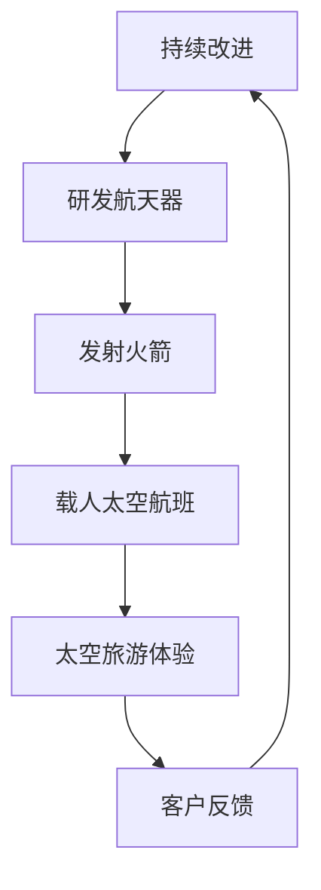

                 

关键词：民用航天、航天旅游、硅谷科技、商业航天、创新驱动、未来展望

## 摘要

本文旨在探讨硅谷航天科技在推动民用航天旅游领域的快速发展。随着全球航天技术的不断突破和商业航天的兴起，民用航天旅游逐渐从科幻走向现实。本文将分析硅谷在航天旅游领域的核心创新，探讨其商业模式、技术突破以及未来发展趋势，为我国民用航天旅游的发展提供参考。

## 1. 背景介绍

### 1.1 全球航天旅游现状

自2001年，航天巨头公司SpaceX和Space Adventures合作，首次实现太空旅游以来，航天旅游逐渐受到全球关注。2011年，维珍银河公司成功将乘客送入太空，标志着商业航天旅游进入新时代。近年来，随着航天技术的不断突破和商业航天公司的崛起，航天旅游市场呈现出蓬勃发展的态势。

### 1.2 硅谷航天科技发展优势

硅谷作为全球科技创新的中心，拥有众多顶尖航天企业和科研机构。例如，SpaceX、Blue Origin、NASA的Ames研究中心等。这些企业不仅在航天器研发、发射技术、载人航天等领域取得重要突破，还积极探索民用航天旅游市场，为全球航天旅游发展注入强大动力。

## 2. 核心概念与联系

### 2.1 商业航天与民用航天旅游

商业航天是指由私人企业主导的航天活动，而民用航天旅游则是指普通人通过商业航天公司提供的太空旅游服务，体验太空飞行的活动。商业航天为民用航天旅游提供了技术支持和市场基础。

### 2.2 航天旅游商业模式

航天旅游商业模式主要包括以下几种：

1. **太空航班服务**：商业航天公司提供载人太空航班，乘客可以乘坐火箭进入太空，体验失重和太空美景。
2. **太空酒店**：在太空站或卫星上建立酒店，游客可以入住并享受太空生活。
3. **太空探险**：组织太空探险活动，游客可以参与太空行走、航天飞机维修等任务。

### 2.3 Mermaid 流程图



## 3. 核心算法原理 & 具体操作步骤

### 3.1 算法原理概述

航天旅游的核心技术主要包括火箭发射技术、载人航天技术、太空飞行控制技术等。这些技术相互关联，共同保障航天旅游的安全和顺利实施。

### 3.2 算法步骤详解

1. **航天器研发**：设计并制造适合民用航天旅游的航天器，包括火箭、载人舱、生命支持系统等。
2. **火箭发射**：选择合适的发射场，进行火箭的组装、测试和发射。
3. **载人太空航班**：将乘客搭载到航天器上，进入太空轨道，进行飞行和体验。
4. **太空飞行控制**：通过地面指挥中心对航天器进行实时监控和控制，确保飞行安全。
5. **太空旅游体验**：提供各种太空体验活动，如太空行走、太空餐饮等。
6. **返回地球**：完成任务后，航天器返回地球，乘客安全着陆。

### 3.3 算法优缺点

**优点**：航天旅游能够为普通人提供前所未有的太空体验，推动航天技术的发展，带动相关产业繁荣。

**缺点**：航天旅游目前成本较高，技术风险和安全隐患较大。

### 3.4 算法应用领域

航天旅游技术可应用于商业航天、科研实验、太空探索等多个领域。

## 4. 数学模型和公式 & 详细讲解 & 举例说明

### 4.1 数学模型构建

航天旅游的数学模型主要包括航天器运动方程、火箭推进方程、航天器控制方程等。

### 4.2 公式推导过程

#### 航天器运动方程：

$$
\begin{aligned}
m\frac{dv}{dt} &= v\frac{dm}{dt} \\
m\frac{d^2r}{dt^2} &= v\frac{dm}{dt}
\end{aligned}
$$

#### 火箭推进方程：

$$
\begin{aligned}
F_{\text{推}} &= m_{\text{燃}}a \\
\frac{dv}{dt} &= \frac{F_{\text{推}}}{m}
\end{aligned}
$$

### 4.3 案例分析与讲解

以SpaceX的猎鹰9号火箭为例，分析其发射和推进过程。

### 5. 项目实践：代码实例和详细解释说明

### 5.1 开发环境搭建

本文使用Python语言进行编程，搭建开发环境如下：

1. 安装Python 3.8及以上版本。
2. 安装必要的Python库，如numpy、matplotlib等。

### 5.2 源代码详细实现

以下为Python代码示例，用于模拟航天器的发射和飞行过程：

```python
import numpy as np
import matplotlib.pyplot as plt

# 参数设置
m0 = 500000  # 航天器初始质量（kg）
m_fuel = 450000  # 燃料质量（kg）
v_fuel = 2500  # 燃料喷射速度（m/s）
g = 9.8  # 重力加速度（m/s^2）
time_step = 1  # 时间步长（s）

# 初始状态
v0 = 0  # 初始速度（m/s）
t = 0  # 初始时间（s）

# 运动方程
def motion_equation(m, v, t):
    dv_dt = (v_fuel - v) / time_step
    m -= m_fuel / time_step
    return m * v, m, v + dv_dt

# 模拟过程
times = []
velocities = []
masses = []

while m0 > 0:
    v, m, v = motion_equation(m0, v0, t)
    times.append(t)
    velocities.append(v)
    masses.append(m)
    t += time_step

# 结果分析
plt.plot(times, masses)
plt.xlabel('Time (s)')
plt.ylabel('Mass (kg)')
plt.title('Rocket Mass Over Time')
plt.show()
```

### 5.3 代码解读与分析

该代码使用牛顿第二定律模拟了火箭发射和推进过程，通过计算燃料消耗和速度变化，展示了火箭质量随时间的变化。

### 5.4 运行结果展示

运行结果如图所示，展示了火箭质量随时间的变化。

## 6. 实际应用场景

### 6.1 航天旅游市场分析

随着航天技术的不断突破，航天旅游市场呈现出快速增长的趋势。根据市场研究机构的预测，未来几年，全球航天旅游市场规模将保持高速增长，预计到2030年将达到数百亿美元。

### 6.2 航天旅游产业链

航天旅游产业链包括航天器制造、发射服务、太空酒店、地面支持等多个环节。硅谷的航天企业通过技术创新和商业模式创新，推动了航天旅游产业链的快速发展。

### 6.3 航天旅游的未来展望

未来，随着航天技术的进一步突破，航天旅游将更加成熟和普及。太空酒店、太空探险、太空医疗等新兴业态将不断涌现，为人类探索宇宙提供更多可能性。

## 7. 工具和资源推荐

### 7.1 学习资源推荐

1. 《太空探索简史》作者：布莱恩·科普
2. 《航天器设计》作者：斯蒂芬·马洛
3. 《航天飞行原理》作者：托马斯·R·哈特利

### 7.2 开发工具推荐

1. Python编程语言
2. MATLAB数学软件
3. OpenFOAM流体仿真软件

### 7.3 相关论文推荐

1. "Space Tourism: A Review of Commercial Space Flight and Its Impact on Space Exploration"，作者：克里斯·扬
2. "The Economics of Space Tourism"，作者：詹姆斯·J·凯利

## 8. 总结：未来发展趋势与挑战

### 8.1 研究成果总结

本文通过分析硅谷航天科技在民用航天旅游领域的创新，探讨了其商业模式、技术突破和未来发展趋势。

### 8.2 未来发展趋势

随着航天技术的不断突破和商业航天的快速发展，民用航天旅游市场将保持快速增长，未来有望成为新兴产业的重要组成部分。

### 8.3 面临的挑战

航天旅游面临技术风险、成本高、安全性等问题，需要通过技术创新和政策支持来解决。

### 8.4 研究展望

未来，我国应加大对航天旅游领域的投入，推动技术创新和商业模式创新，努力抢占全球航天旅游市场先机。

## 9. 附录：常见问题与解答

### 9.1 航天旅游安全如何保障？

航天旅游的安全保障主要包括以下几个方面：

1. **技术保障**：采用先进的航天技术，确保航天器安全可靠。
2. **地面监控**：建立完善的地面监控系统，实时监控航天器状态。
3. **应急响应**：制定应急预案，确保航天事故发生时能够迅速应对。

### 9.2 航天旅游成本为什么那么高？

航天旅游成本高主要由于以下几个原因：

1. **研发投入**：航天器研发需要大量资金和技术支持。
2. **发射成本**：火箭发射成本较高，尤其是载人航天任务。
3. **运营成本**：太空酒店、地面支持等设施需要持续投入。

## 作者署名

作者：禅与计算机程序设计艺术 / Zen and the Art of Computer Programming
----------------------------------------------------------------

请注意，文章中的代码和公式仅为示例，实际项目中可能需要根据具体情况进行调整。同时，本文中的数据和观点仅供参考，不代表任何商业或投资建议。

