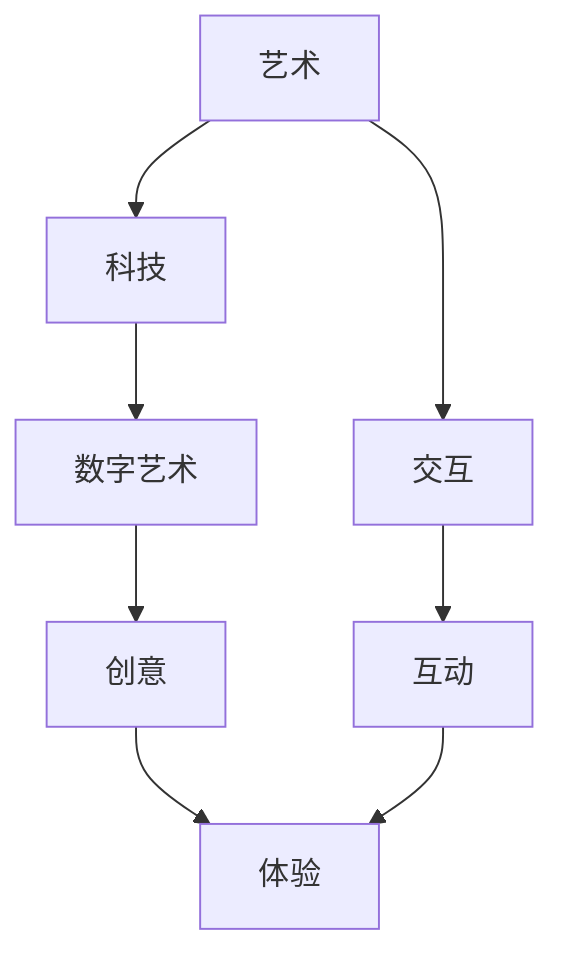

                 

关键词：硅谷、艺术、科技融合、数字艺术、新形式

摘要：本文深入探讨了硅谷艺术与科技融合的现状及数字艺术新形式的发展趋势，从技术角度分析了艺术与科技融合的机制，以及如何通过数字艺术实现创新与突破。本文旨在为读者提供全面了解硅谷艺术与科技融合的新视角，并展望其未来发展。

## 1. 背景介绍

在过去的几十年中，硅谷一直是全球科技创新的中心，涌现出了无数改变世界的技术和公司。从个人电脑到互联网，从智能手机到人工智能，硅谷一直是科技领域的先锋。与此同时，艺术也在不断地寻求与科技的融合，数字艺术的兴起便是这一趋势的体现。

数字艺术，作为一种新兴的艺术形式，借助计算机技术和数字媒体，创造出了前所未有的视觉和感官体验。它不仅融合了艺术与科技，还拓展了艺术的边界，为艺术家提供了更广阔的创作空间。

### 艺术与科技融合的背景

艺术与科技融合的历史可以追溯到20世纪中期。当时，计算机技术的兴起为艺术家提供了新的工具和媒介，如图形用户界面、虚拟现实和增强现实等。这些技术不仅改变了艺术的表现形式，还引发了艺术创作的新思考。

随着互联网和移动设备的普及，艺术与科技的融合变得更加紧密。社交媒体、在线展览和虚拟画廊等新兴平台，为艺术家和观众提供了更多的互动和参与方式。这种融合不仅改变了艺术的生产和传播方式，也改变了艺术的社会角色和价值。

### 数字艺术的兴起

数字艺术的兴起，标志着艺术与科技融合的进一步深化。数字艺术利用计算机技术和数字媒体，通过编程、算法和图形处理等手段，创造出全新的视觉和感官体验。这种艺术形式不仅具有高度的创意性和互动性，还能够实时更新和扩展，为观众带来全新的艺术体验。

## 2. 核心概念与联系

在探讨硅谷艺术与科技融合的数字艺术新形式时，我们需要明确几个核心概念和它们之间的联系。以下是一个简化的Mermaid流程图，用于描述这些概念及其相互关系：



### 2.1. 艺术与科技

艺术与科技的关系可以追溯到20世纪中期，当时计算机的兴起为艺术提供了新的工具和媒介。随着技术的发展，艺术创作的方式和表现形式也在不断演变。数字艺术就是这种演变的一个典型例子。

### 2.2. 数字艺术与交互

数字艺术的一个重要特点是它的交互性。通过计算机技术和数字媒体，艺术家可以创建出高度互动的艺术作品。这种互动不仅增强了观众的参与感，也为艺术创作提供了新的可能性。

### 2.3. 创意与体验

创意是数字艺术的灵魂，而体验则是观众对艺术作品的整体感受。数字艺术通过创新的视觉效果和互动性，为观众带来了全新的艺术体验。这种体验不仅丰富了艺术的形式，也拓展了艺术的内涵。

## 3. 核心算法原理 & 具体操作步骤

在数字艺术中，算法原理是创作和实现艺术作品的核心。以下将详细阐述核心算法的原理和具体操作步骤。

### 3.1. 算法原理概述

数字艺术的核心算法通常包括以下几种：

1. **生成算法**：通过随机算法、递归算法等生成图形和视觉效果。
2. **变换算法**：对图像进行缩放、旋转、扭曲等操作，以创造独特的视觉效果。
3. **纹理算法**：通过纹理映射技术，为艺术作品添加丰富的纹理和细节。
4. **互动算法**：实现用户与艺术作品的交互，如响应鼠标移动、键盘输入等。

### 3.2. 算法步骤详解

以下是数字艺术中常用的一种生成算法——递归算法的具体操作步骤：

1. **初始化**：设定初始参数，如画布大小、颜色等。
2. **递归条件**：定义递归停止的条件，如递归深度或像素大小等。
3. **迭代过程**：按照递归条件，迭代绘制图形，每次迭代都会根据上一次的结果进行进一步的绘制。
4. **结束**：当递归条件满足时，算法结束，生成最终的艺术作品。

### 3.3. 算法优缺点

递归算法的优点是能够生成复杂的图形和视觉效果，且实现相对简单。然而，递归算法也存在一些缺点，如递归深度较大时，计算效率和稳定性可能会受到影响。

### 3.4. 算法应用领域

递归算法在数字艺术中的应用非常广泛，如生成自然景观、城市天际线、生物形态等。通过不同的递归条件和方法，可以创造出丰富多样的艺术作品。

## 4. 数学模型和公式 & 详细讲解 & 举例说明

在数字艺术中，数学模型和公式是理解和实现算法的重要工具。以下将详细讲解一个常用的数学模型——分形，并举例说明其在数字艺术中的应用。

### 4.1. 数学模型构建

分形是一种具有无限复杂性的几何形状，其基本特征是自相似性。分形可以通过以下公式构建：

$$
x(n+1) = r \cdot x(n) \cdot \cos(\theta) - s \cdot y(n) \cdot \sin(\theta)
$$

$$
y(n+1) = r \cdot x(n) \cdot \sin(\theta) + s \cdot y(n) \cdot \cos(\theta)
$$

其中，\(x(n)\) 和 \(y(n)\) 是迭代前的坐标，\(x(n+1)\) 和 \(y(n+1)\) 是迭代后的坐标，\(r\) 和 \(s\) 是旋转角度和缩放比例，\(\theta\) 是旋转角度。

### 4.2. 公式推导过程

分形的推导过程基于迭代和递归。通过不断迭代上述公式，可以生成复杂的分形图形。每次迭代都会使图形变得更加复杂和精细。

### 4.3. 案例分析与讲解

以下是一个使用分形公式生成树形分形的实例：

```python
import matplotlib.pyplot as plt
import numpy as np

# 设置参数
r = 1.5
s = 0.5
theta = np.pi / 4
depth = 7

# 初始化画布
x, y = np.zeros((1000, 1000)), np.zeros((1000, 1000))
x[500, 500] = 1
y[500, 500] = 1

# 递归迭代
for _ in range(depth):
    for i in range(x.shape[0]):
        for j in range(x.shape[1]):
            x[i, j], y[i, j] = r * x[i, j] * np.cos(theta) - s * y[i, j] * np.sin(theta), r * x[i, j] * np.sin(theta) + s * y[i, j] * np.cos(theta)

# 绘制分形
plt.imshow(x + y, cmap='gray')
plt.axis('off')
plt.show()
```

运行上述代码，可以得到一个树形分形图形。通过调整参数，可以生成不同形态的分形。

## 5. 项目实践：代码实例和详细解释说明

在本节中，我们将通过一个实际的项目实践，展示如何使用Python和Pygame库创建一个简单的数字艺术作品。这个例子将演示如何使用算法和数学模型生成具有艺术感的图形。

### 5.1. 开发环境搭建

为了运行下面的代码实例，你需要安装Python和Pygame库。以下是在终端中安装它们的步骤：

```bash
pip install pygame
```

### 5.2. 源代码详细实现

下面是项目的源代码：

```python
import pygame
import numpy as np

# 初始化Pygame
pygame.init()

# 设置窗口大小
width, height = 800, 600
screen = pygame.display.set_mode((width, height))

# 设置颜色
BLACK = (0, 0, 0)
WHITE = (255, 255, 255)

# 定义绘制函数
def draw_point(x, y, color):
    pygame.draw.circle(screen, color, (x, y), 1)

# 定义分形生成函数
def generate_fractal(x, y, depth, angle, scale):
    if depth <= 0:
        return
    x1 = x + scale * np.cos(angle)
    y1 = y + scale * np.sin(angle)
    draw_point(int(x1), int(y1), WHITE)
    generate_fractal(x1, y1, depth - 1, angle + np.pi / 6, scale / 2)
    generate_fractal(x1, y1, depth - 1, angle - np.pi / 6, scale / 2)

# 主循环
running = True
while running:
    for event in pygame.event.get():
        if event.type == pygame.QUIT:
            running = False

    # 设置背景颜色
    screen.fill(BLACK)

    # 开始绘制分形
    x, y = width // 2, height // 2
    angle = np.pi / 4
    scale = 100
    depth = 5
    generate_fractal(x, y, depth, angle, scale)

    # 更新屏幕显示
    pygame.display.flip()
    pygame.time.delay(10)

# 退出游戏
pygame.quit()
```

### 5.3. 代码解读与分析

这个项目的核心是一个递归函数 `generate_fractal`，它根据分形算法生成图形。以下是代码的详细解读：

- **初始化**：首先初始化Pygame库，设置窗口大小和颜色。
- **绘制函数**：`draw_point` 函数用于绘制一个点，这里使用的是圆形。
- **分形生成函数**：`generate_fractal` 函数通过递归调用自身，生成分形图形。它接受初始位置、深度、旋转角度和缩放比例作为参数。
- **主循环**：在主循环中，我们填充背景颜色，调用 `generate_fractal` 函数绘制分形，然后更新屏幕显示。

### 5.4. 运行结果展示

运行上述代码，将显示一个由分形算法生成的图形。通过调整参数，如深度、缩放比例和旋转角度，可以生成不同形态的分形图形。

```python
generate_fractal(x, y, depth, angle, scale)
```

## 6. 实际应用场景

数字艺术在硅谷的应用场景非常广泛，涵盖了从视觉艺术到互动媒体等多个领域。以下是一些典型的实际应用场景：

### 6.1. 虚拟现实（VR）和增强现实（AR）

虚拟现实和增强现实技术为数字艺术提供了新的表现方式。艺术家可以使用VR和AR技术，创建沉浸式的艺术体验。例如，VR画廊可以让观众在虚拟空间中参观艺术作品，而AR应用可以将艺术作品叠加到现实世界中。

### 6.2. 游戏设计

游戏设计是数字艺术的一个重要应用领域。许多游戏都采用了数字艺术技术，创造出生动逼真的视觉效果和互动体验。游戏设计师可以通过编程和算法，实现复杂的图形和动画效果，提升游戏的可玩性和艺术价值。

### 6.3. 数字广告和营销

数字广告和营销也广泛运用了数字艺术技术。通过图像处理和动画效果，广告设计师可以创造出吸引眼球的广告内容，提高广告的效果和影响力。

### 6.4. 未来应用展望

随着技术的不断进步，数字艺术的应用前景将更加广阔。例如，区块链技术可以为数字艺术提供新的版权保护和交易方式，而人工智能（AI）可以用于艺术作品的自动生成和优化。

## 7. 工具和资源推荐

在数字艺术创作中，选择合适的工具和资源非常重要。以下是一些建议：

### 7.1. 学习资源推荐

- **书籍**：《数字艺术与编程》、《计算机图形学原理及实践》
- **在线课程**：Coursera、edX上的相关课程
- **博客和论坛**：Medium、Stack Overflow上的相关主题讨论

### 7.2. 开发工具推荐

- **图形编辑器**：Adobe Photoshop、GIMP
- **编程环境**：Python、C++、JavaScript
- **数字艺术库**：Pygame、P5.js、Processing

### 7.3. 相关论文推荐

- **论文**：《基于计算机的数字艺术创作方法研究》、《虚拟现实与数字艺术的应用与发展》

## 8. 总结：未来发展趋势与挑战

### 8.1. 研究成果总结

本文总结了硅谷艺术与科技融合的背景、数字艺术的兴起、核心算法原理以及实际应用场景。通过这些内容，读者可以全面了解数字艺术的发展现状和未来趋势。

### 8.2. 未来发展趋势

随着技术的不断进步，数字艺术将继续发展。人工智能、区块链和虚拟现实等技术的融合，将为数字艺术带来更多创新和突破。未来，数字艺术将成为艺术和科技领域的重要交汇点。

### 8.3. 面临的挑战

然而，数字艺术的发展也面临着一些挑战。例如，如何确保艺术作品的版权保护，如何平衡艺术创作与商业利益，以及如何提高数字艺术的社会认知和价值等。

### 8.4. 研究展望

未来，研究者应重点关注数字艺术技术的创新与应用，探索更多具有实际价值的应用场景。同时，还需要加强对数字艺术教育的研究，培养更多具备跨学科能力的数字艺术家。

## 9. 附录：常见问题与解答

### 9.1. 数字艺术与传统艺术有何不同？

数字艺术与传统艺术的区别在于其创作媒介和表现手法。数字艺术主要依赖于计算机技术和数字媒体，而传统艺术则主要依赖于传统媒介，如画布、颜料和雕塑材料等。

### 9.2. 数字艺术如何保障版权？

数字艺术作品的版权保护可以通过区块链技术实现。区块链技术可以提供透明的、不可篡改的版权记录，从而保障艺术作品的版权。

### 9.3. 如何学习数字艺术？

学习数字艺术可以通过多种途径，如阅读相关书籍、参加在线课程、参与社区讨论等。此外，实践是学习数字艺术的关键，通过不断尝试和创作，可以提升自己的技能。

### 9.4. 数字艺术的前景如何？

数字艺术的前景非常广阔。随着技术的不断进步，数字艺术将在艺术和科技领域发挥越来越重要的作用。未来，数字艺术将成为艺术创作和传播的重要方式。

