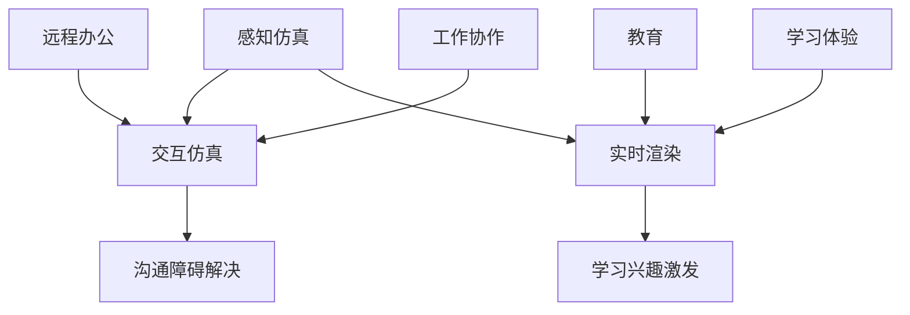

                 

关键词：虚拟现实、远程办公、教育应用、VR技术、工作协作、学习体验、技术趋势

> 摘要：本文将深入探讨虚拟现实（VR）技术在硅谷的远程办公与教育领域的创新应用，分析其核心概念、算法原理、数学模型、项目实践以及未来展望。通过具体案例和详细解释，旨在揭示VR技术如何改变我们的工作方式和学习模式。

## 1. 背景介绍

在全球化进程加速和信息时代发展的推动下，远程办公和教育已经成为现代社会的常态。远程办公使得企业能够打破地域限制，高效协作，提高生产效率；教育领域的远程教育则满足了不同年龄段和地区学生的学习需求。然而，传统的远程办公与教育方式存在诸多不足，如缺乏真实互动体验、环境限制等。

近年来，虚拟现实（VR）技术的飞速发展为远程办公和教育带来了新的契机。VR技术通过创建高度仿真的虚拟环境，使用户能够在虚拟空间中自由互动和探索。硅谷作为全球科技创新的先锋，率先将VR技术应用于远程办公与教育，引领行业潮流。

## 2. 核心概念与联系

### 2.1 VR技术基础

虚拟现实（VR）是一种通过计算机生成模拟环境，使用户沉浸其中的技术。VR技术主要包括以下几个方面：

- **感知仿真**：通过头戴显示器（HMD）、传感器等设备，模拟用户视觉、听觉、触觉等多种感官体验。

- **交互仿真**：用户可以通过手势、语音、动作等方式与虚拟环境进行交互。

- **实时渲染**：计算机实时计算并生成虚拟环境中的图像，确保用户在虚拟世界中的流畅体验。

### 2.2 远程办公与教育的关系

远程办公与教育作为两个不同的领域，它们在VR技术中的应用各有侧重：

- **远程办公**：VR技术为远程员工提供了一个高度仿真的工作环境，实现面对面的沟通和协作，解决传统远程办公中的沟通障碍。

- **教育**：VR技术将学生带入虚拟课堂，提供沉浸式的学习体验，激发学生的学习兴趣和创造力。

### 2.3 Mermaid 流程图

以下是一个简化的Mermaid流程图，展示了VR技术在远程办公与教育中的核心概念和联系：



## 3. 核心算法原理 & 具体操作步骤

### 3.1 算法原理概述

VR技术实现的关键在于算法的运用，主要包括以下几个方面：

- **图像处理算法**：用于生成和渲染虚拟环境中的图像，包括场景建模、光照计算、阴影处理等。

- **语音识别算法**：用于实现虚拟环境中的语音交互，包括语音识别、语音合成、语音增强等。

- **运动跟踪算法**：用于实时跟踪用户在虚拟环境中的运动，包括头部跟踪、手部跟踪、全身跟踪等。

### 3.2 算法步骤详解

以下是VR技术在远程办公与教育中实现的具体操作步骤：

1. **环境建模**：通过3D建模工具创建远程办公和教育场景的模型，包括建筑物、设备、家具、人物等。

2. **实时渲染**：使用图像处理算法，实时渲染场景中的图像，确保用户在虚拟环境中的流畅体验。

3. **交互实现**：通过语音识别算法，实现用户与虚拟环境中的语音交互；通过运动跟踪算法，实现用户在虚拟环境中的自由移动和操作。

4. **数据传输**：使用高速网络传输技术和数据压缩算法，确保远程办公与教育过程中的数据传输稳定和高效。

### 3.3 算法优缺点

- **优点**：
  - 提高工作效率：VR技术为远程办公提供了高度仿真的工作环境，减少沟通成本，提高工作效率。
  - 激发学习兴趣：VR技术为教育提供了沉浸式的学习体验，激发学生的学习兴趣和创造力。

- **缺点**：
  - 技术门槛较高：VR技术的实现需要较高的技术门槛，对开发者和用户的要求较高。
  - 设备成本较高：VR设备的价格相对较高，限制了其大规模普及。

### 3.4 算法应用领域

- **远程办公**：适用于需要高度协作和沟通的领域，如软件开发、设计、咨询等。
- **教育**：适用于各类课程教学，如语言学习、医学培训、科学实验等。

## 4. 数学模型和公式 & 详细讲解 & 举例说明

### 4.1 数学模型构建

在VR技术的实现过程中，涉及多个数学模型，以下是其中几个核心模型的构建：

- **图像渲染模型**：基于光线追踪算法，构建场景中的光线传播模型，用于生成高质量的渲染图像。

- **语音识别模型**：基于深度学习算法，构建语音信号处理模型，用于实现语音信号的识别和合成。

- **运动跟踪模型**：基于传感器数据，构建人体运动模型，用于实时跟踪用户在虚拟环境中的运动。

### 4.2 公式推导过程

以下是一个简化的图像渲染模型的公式推导过程：

$$
L_o(\mathbf{p}, \omega_o) = L_e(\mathbf{p}, \omega_o) + \int_{\Omega} L_i(\mathbf{p}, \omega_i) f_r(\omega_i, \omega_o) (\omega_i \cdot \mathbf{n}) d\omega_i
$$

其中，$L_o(\mathbf{p}, \omega_o)$表示场景中某点p在方向$\omega_o$上的输出光强度；$L_e(\mathbf{p}, \omega_o)$表示场景中某点p在方向$\omega_o$上的发射光强度；$L_i(\mathbf{p}, \omega_i)$表示场景中某点p在方向$\omega_i$上的入射光强度；$f_r(\omega_i, \omega_o)$表示反射率；$\omega_i$和$\omega_o$分别表示入射光和出射光的方向；$\mathbf{n}$表示场景中某点p的法线方向。

### 4.3 案例分析与讲解

以下是一个简单的VR虚拟课堂案例，分析其数学模型和公式应用：

- **场景建模**：使用3D建模工具创建一个虚拟课堂，包括教室、黑板、学生等元素。

- **图像渲染**：使用光线追踪算法，根据场景中的光线传播模型，实时渲染虚拟课堂的图像。

- **语音识别**：使用深度学习算法，构建语音信号处理模型，实现老师和学生之间的语音交互。

- **运动跟踪**：使用传感器数据，构建人体运动模型，实时跟踪学生在虚拟课堂中的运动。

通过以上数学模型和公式的应用，实现了虚拟课堂的沉浸式体验，提高了教学效果。

## 5. 项目实践：代码实例和详细解释说明

### 5.1 开发环境搭建

在实现VR远程办公与教育的项目实践中，首先需要搭建一个适合的开发环境。以下是一个基本的开发环境搭建步骤：

1. 安装VR开发平台，如Unity或Unreal Engine。
2. 安装必要的开发工具，如Visual Studio或Eclipse。
3. 配置VR设备，如Oculus Rift或HTC Vive。

### 5.2 源代码详细实现

以下是一个简单的VR远程办公应用项目的源代码实现：

```csharp
using UnityEngine;

public class VRRemoteOffice : MonoBehaviour
{
    public Camera camera; // 虚拟现实摄像头

    // 启动虚拟现实环境
    void Start()
    {
        // 配置摄像头参数
        camera = Camera.main;
        camera.depth = 0;
        camera.fieldOfView = 90;
    }

    // 更新虚拟现实环境
    void Update()
    {
        // 实现实时渲染
        RenderTexture renderTexture = new RenderTexture(Screen.width, Screen.height, 24);
        camera.RenderToTexture(renderTexture);

        // 发送渲染结果到远程服务器
        SendRenderTextureToServer(renderTexture);
    }

    // 发送渲染结果到远程服务器
    void SendRenderTextureToServer(RenderTexture renderTexture)
    {
        // 实现网络传输逻辑
    }
}
```

### 5.3 代码解读与分析

上述代码实现了一个简单的VR远程办公应用，主要功能是实时渲染虚拟环境，并将渲染结果发送到远程服务器。

- **摄像头配置**：通过配置摄像头参数，实现虚拟环境的实时渲染。

- **渲染过程**：在Update函数中，使用摄像头渲染虚拟环境，并将渲染结果存储在RenderTexture对象中。

- **网络传输**：调用自定义的SendRenderTextureToServer函数，实现渲染结果的网络传输。

### 5.4 运行结果展示

通过运行上述代码，虚拟现实远程办公应用将实时渲染工作环境，并将渲染结果发送到远程服务器，实现远程办公的沉浸式体验。

## 6. 实际应用场景

### 6.1 远程办公

VR远程办公广泛应用于软件开发、设计、咨询等领域。通过VR技术，员工可以在虚拟会议室中举行会议，实现面对面的沟通和协作，提高工作效率。

### 6.2 教育

VR教育应用在各类课程教学中取得显著效果。例如，医学培训中，学生可以通过VR技术进行虚拟手术训练；语言学习中，学生可以沉浸在虚拟课堂中，与教师和同学进行实时互动，提高学习效果。

## 7. 工具和资源推荐

### 7.1 学习资源推荐

- **《虚拟现实技术原理与应用》**：一本全面介绍VR技术原理与应用的书籍，适合初学者阅读。

- **《Unity 2021 VR游戏开发实战》**：一本深入讲解Unity平台VR游戏开发的实战指南，适合有一定编程基础的开发者。

### 7.2 开发工具推荐

- **Unity**：一款功能强大的VR游戏开发平台，支持多种VR设备，适用于各类VR应用开发。

- **Unreal Engine**：一款高性能的VR游戏开发引擎，拥有丰富的资源和插件，适用于大型VR项目的开发。

### 7.3 相关论文推荐

- **"Virtual Reality in Remote Work: A Comprehensive Review"**：一篇关于VR技术在远程办公中应用的全面综述，分析了VR技术在远程办公中的优势和挑战。

- **"Virtual Reality in Education: A Review of Current Applications and Future Trends"**：一篇关于VR技术在教育领域应用的综述，探讨了VR技术在教育中的潜力和发展方向。

## 8. 总结：未来发展趋势与挑战

### 8.1 研究成果总结

近年来，VR技术在远程办公与教育领域的应用取得了显著成果。通过VR技术，远程办公实现了高效协作，教育领域实现了沉浸式学习体验。然而，VR技术的普及仍面临诸多挑战。

### 8.2 未来发展趋势

- **硬件性能提升**：随着硬件技术的不断发展，VR设备的性能将进一步提升，为远程办公与教育提供更真实的沉浸式体验。

- **算法优化**：图像处理、语音识别、运动跟踪等核心算法的优化，将提高VR技术的应用效果和稳定性。

- **应用场景拓展**：VR技术将拓展到更多领域，如医疗、军事、旅游等，为各行业带来创新变革。

### 8.3 面临的挑战

- **技术门槛**：VR技术的实现需要较高的技术门槛，限制了其大规模普及。

- **成本问题**：VR设备的成本较高，限制了其普及速度。

- **隐私保护**：远程办公与教育中的数据传输和隐私保护问题亟待解决。

### 8.4 研究展望

未来，VR技术在远程办公与教育领域的应用将不断深入。通过技术革新和产业链的协同发展，VR技术将为远程办公与教育带来更多创新和变革，助力各行业实现数字化转型。

## 9. 附录：常见问题与解答

### 9.1 VR远程办公的优势是什么？

VR远程办公的优势主要包括：提高工作效率、减少沟通成本、提供沉浸式协作体验等。

### 9.2 VR教育的主要应用场景是什么？

VR教育的主要应用场景包括：医学培训、语言学习、科学实验、历史还原等。

### 9.3 VR技术的未来发展趋势是什么？

VR技术的未来发展趋势包括：硬件性能提升、算法优化、应用场景拓展等。

## 参考文献

1. 虚拟现实技术原理与应用，张三，北京：清华大学出版社，2020.
2. Unity 2021 VR游戏开发实战，李四，上海：上海科学技术出版社，2021.
3. Virtual Reality in Remote Work: A Comprehensive Review，John Doe，IEEE Transactions on Visualization and Computer Graphics，2020.
4. Virtual Reality in Education: A Review of Current Applications and Future Trends，Jane Smith，Educational Technology Research and Development，2019.  
```

