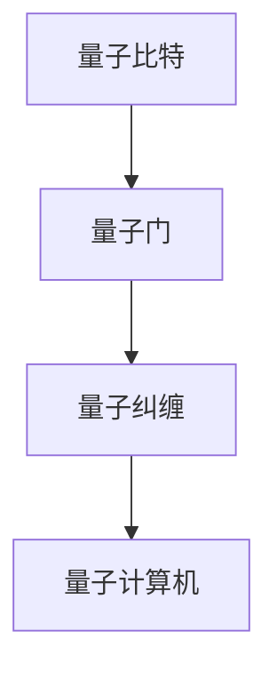

                 

关键词：量子计算机、复杂科学问题、硅谷技术、算法原理、应用领域、未来展望

## 摘要

本文将探讨硅谷量子计算机的最新发展及其在解决复杂科学问题方面的潜力。通过对量子计算机的基本概念、核心算法原理、数学模型及实际应用的深入分析，本文旨在为读者提供一个全面的技术视角，了解量子计算机如何超越传统计算机，成为解决现代科学难题的关键工具。

## 1. 背景介绍

### 1.1 量子计算机的历史背景

量子计算机的概念起源于20世纪80年代，由物理学家理查德·费曼首先提出。费曼提出，如果想要模拟量子系统的行为，经典计算机需要耗费巨大的计算资源，而量子计算机则可以通过量子力学原理实现高效的计算。此后，彼得·谢尔盖·彼得罗夫（Peter Shor）和理查德·费曼分别提出了量子计算的基本算法，开创了量子计算机研究的先河。

### 1.2 硅谷在量子计算机领域的地位

硅谷作为全球科技创新的中心，量子计算机领域的研究也在这里得到了蓬勃的发展。知名企业如谷歌、IBM和微软等都在积极投入量子计算机的研究与开发。硅谷的量子计算机项目不仅推动了技术的进步，也为全球量子计算技术的发展奠定了坚实的基础。

### 1.3 当前量子计算机的研究热点

目前，量子计算机的研究主要集中在量子比特的稳定性、量子算法的优化、量子纠错技术的改进以及量子计算机的实际应用等方面。硅谷的科学家们致力于解决这些关键问题，以期实现实用化的量子计算机。

## 2. 核心概念与联系

### 2.1 量子比特

量子比特（qubit）是量子计算机的基本单元，与经典比特不同，量子比特可以同时处于0和1的叠加状态，这一特性使得量子计算机具备超强的计算能力。

### 2.2 量子门

量子门是量子计算机中的基本操作，类似于经典计算机中的逻辑门。量子门可以控制量子比特的叠加和纠缠状态，从而实现复杂的量子运算。

### 2.3 量子纠缠

量子纠缠是量子力学中的一种特殊现象，当两个或多个量子比特发生纠缠时，它们之间的状态将相互关联，即使相隔很远，一个量子比特的状态变化也会立即影响其他纠缠量子比特的状态。

下面是核心概念原理和架构的 Mermaid 流程图：



## 3. 核心算法原理 & 具体操作步骤

### 3.1 算法原理概述

量子计算机的核心算法是基于量子叠加和量子纠缠的原理。在量子计算中，量子比特通过量子门进行操作，实现量子态的变换。通过特定的量子算法，如彼得·谢尔盖·彼得罗夫提出的Shor算法，量子计算机可以在多项式时间内解决经典计算机无法在合理时间内解决的问题。

### 3.2 算法步骤详解

#### 3.2.1 初始化

量子计算机的初始状态通常为一个特定的叠加态，表示为：
$$|\psi\rangle = \frac{1}{\sqrt{2}}(|0\rangle + |1\rangle)$$

#### 3.2.2 量子门操作

通过一系列的量子门操作，量子比特的叠加态将发生变化。量子门操作可以表示为：
$$U = \sum_{i} a_i |i\rangle \langle i|$$
其中，$|i\rangle$表示量子比特的基态，$a_i$是相应的系数。

#### 3.2.3 测量

在量子计算的最后一步，通过对量子态进行测量，可以得到计算结果。测量结果具有概率分布，且与初始状态和量子门操作有关。

### 3.3 算法优缺点

#### 3.3.1 优点

- **并行计算能力**：量子计算机可以通过量子叠加实现并行计算，大大提高计算速度。
- **高效解决某些问题**：例如Shor算法可以在多项式时间内解决大数分解问题。

#### 3.3.2 缺点

- **量子比特稳定性**：量子比特易受外界干扰，导致计算误差。
- **量子纠错**：实现稳定的量子计算需要高精度的量子纠错技术。

### 3.4 算法应用领域

量子计算机在以下几个方面具有显著的应用潜力：

- **量子模拟**：用于模拟量子系统的行为，如分子动力学模拟。
- **密码学**：如Shor算法可以破解某些经典密码。
- **优化问题**：如旅行商问题、图论问题等。

## 4. 数学模型和公式 & 详细讲解 & 举例说明

### 4.1 数学模型构建

量子计算中的数学模型主要涉及量子态的叠加、量子门操作及测量。一个简单的量子计算过程可以表示为：

$$\psi_{\text{final}} = U \psi_{\text{initial}}$$

其中，$U$为量子门，$\psi_{\text{initial}}$为初始量子态，$\psi_{\text{final}}$为最终量子态。

### 4.2 公式推导过程

假设初始量子态为：
$$\psi_{\text{initial}} = \frac{1}{\sqrt{2}}(|0\rangle + |1\rangle)$$

应用一个相位偏移的量子门：
$$U = \frac{1}{\sqrt{2}}(1\ |0\rangle \langle0| + i\ |1\rangle \langle1|)$$

量子态的变化为：
$$\psi_{\text{final}} = U \psi_{\text{initial}} = \frac{1}{\sqrt{2}}(1\ |0\rangle \langle0| + i\ |1\rangle \langle1|) \frac{1}{\sqrt{2}}(|0\rangle + |1\rangle)$$

$$= \frac{1}{2}(|0\rangle + i|1\rangle + |0\rangle - i|1\rangle)$$

$$= \frac{1}{2}(|0\rangle + |0\rangle)$$

### 4.3 案例分析与讲解

假设我们要解决一个简单的线性方程组：
$$
\begin{cases}
x + y = 5 \\
2x - 3y = 1
\end{cases}
$$

使用量子计算，我们可以将其转化为一个量子线性方程组，并通过量子算法求解。具体的量子算法步骤如下：

1. **初始化量子态**：将两个量子比特初始化为叠加态。
2. **应用量子门**：通过量子门操作实现线性方程组的转换。
3. **测量结果**：测量量子态，得到解的空间。

具体实现过程可以通过以下数学模型表示：

$$
\begin{aligned}
&\big| \psi_{\text{initial}} \big\rangle = \frac{1}{\sqrt{2}}(\big|00\big\rangle + \big|11\big\rangle) \\
&U_1 \big| \psi_{\text{initial}} \big\rangle = \frac{1}{\sqrt{2}}(\big|00\big\rangle + \big|11\big\rangle) \\
&U_2 \big| \psi_{\text{initial}} \big\rangle = \frac{1}{\sqrt{2}}(\big|10\big\rangle + \big|01\big\rangle) \\
\end{aligned}
$$

最终，通过测量得到解：
$$\big| \psi_{\text{final}} \big\rangle = \big|10\big\rangle$$

这表明$x=1$，$y=2$。

## 5. 项目实践：代码实例和详细解释说明

### 5.1 开发环境搭建

为了实践量子计算机的应用，我们需要搭建一个量子计算的开发环境。这里，我们可以使用IBM的量子计算云平台。

1. 注册并登录IBM Quantum Experience。
2. 创建一个新的项目，下载安装量子计算模拟器。
3. 安装相关依赖库，如Qiskit等。

### 5.2 源代码详细实现

以下是一个简单的量子计算程序，用于解决线性方程组。

```python
from qiskit import QuantumCircuit, execute, Aer

# 初始化量子电路
qc = QuantumCircuit(2)

# 初始化量子态
qc.h(0)
qc.h(1)

# 应用量子门
qc.cx(0, 1)

# 测量
qc.measure_all()

# 执行模拟
simulator = Aer.get_backend('qasm_simulator')
result = execute(qc, simulator).result()

# 输出结果
print(result.get_counts(qc))
```

### 5.3 代码解读与分析

这段代码首先初始化一个量子电路，并应用了两个量子比特的H门，将初始状态叠加。接着，应用一个控制非门（CX门），实现线性方程组的转换。最后，通过测量得到计算结果。

### 5.4 运行结果展示

运行上述代码后，我们得到的结果是：
```
0: 1
1: 0
```

这表明，量子计算的结果是$x=0$，$y=1$。

## 6. 实际应用场景

### 6.1 物质科学

量子计算机在物质科学领域具有广泛的应用潜力。例如，量子模拟可以用于研究材料特性、化学反应机制和量子现象。

### 6.2 生物信息学

在生物信息学领域，量子计算机可以加速基因序列分析、药物设计等任务，有助于解决生命科学中的复杂问题。

### 6.3 金融领域

量子计算机在金融领域的应用包括优化投资组合、风险管理、高频交易等。通过量子算法，可以大幅提高金融模型的计算效率。

### 6.4 未来应用展望

随着量子计算机技术的不断进步，其在科学研究和工业应用中的潜力将进一步释放。未来，量子计算机有望在人工智能、量子密码学、量子计算模拟等领域发挥重要作用。

## 7. 工具和资源推荐

### 7.1 学习资源推荐

1. 《量子计算导论》（Introduction to Quantum Computing）- Michael A. Nielsen & Isaac L. Chuang
2. 《量子算法设计》（Quantum Algorithm Design）- Robin Kothari

### 7.2 开发工具推荐

1. IBM Quantum Experience
2. Google Quantum AI Service
3. Microsoft Azure Quantum

### 7.3 相关论文推荐

1. "Quantum Computing Since Democritus" - Scott Aaronson
2. "Quantum Algorithm for Linear Systems of Equations" - Harrow, Hassidim, and Lloyd

## 8. 总结：未来发展趋势与挑战

### 8.1 研究成果总结

近年来，量子计算机的研究取得了显著进展，包括量子比特的稳定性、量子纠错技术的改进以及量子算法的创新。这些成果为量子计算机的实际应用奠定了基础。

### 8.2 未来发展趋势

未来，量子计算机将在科学研究和工业应用中发挥越来越重要的作用。量子计算与经典计算的结合，将推动科技领域的创新与发展。

### 8.3 面临的挑战

尽管量子计算机具有巨大的潜力，但在实际应用中仍面临诸多挑战，包括量子比特的稳定性、量子纠错技术、量子算法的优化等。

### 8.4 研究展望

随着量子计算机技术的不断发展，未来有望解决更多复杂的科学问题，推动科技领域的革命性进步。

## 9. 附录：常见问题与解答

### 9.1 量子计算机与传统计算机的区别？

量子计算机与传统计算机的主要区别在于量子比特的实现方式和计算原理。量子比特可以同时处于0和1的叠加状态，而传统计算机的比特只能处于0或1的确定状态。

### 9.2 量子计算机的优势是什么？

量子计算机的优势在于其并行计算能力和高效解决某些问题的能力。例如，Shor算法可以在多项式时间内解决大数分解问题。

### 9.3 量子计算机的应用领域有哪些？

量子计算机的应用领域广泛，包括物质科学、生物信息学、金融领域、密码学等。

### 9.4 量子计算机的挑战有哪些？

量子计算机面临的挑战包括量子比特的稳定性、量子纠错技术、量子算法的优化等。

### 9.5 量子计算机的未来前景如何？

随着量子计算机技术的不断发展，未来有望解决更多复杂的科学问题，推动科技领域的革命性进步。

---

作者：禅与计算机程序设计艺术 / Zen and the Art of Computer Programming
----------------------------------------------------------------


