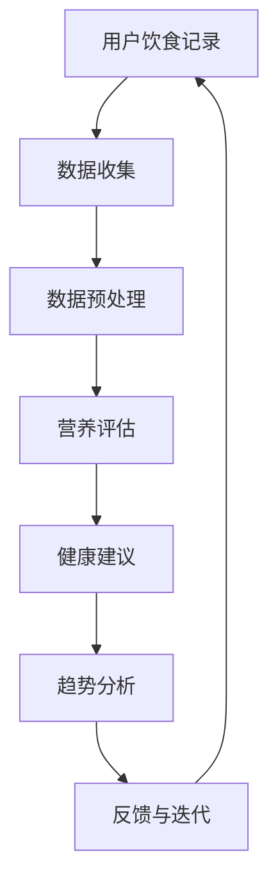

                 

关键词：硅谷食品科技、健康饮食、营养跟踪、人工智能、食品数据分析、可穿戴设备、移动应用

> 摘要：随着科技的迅猛发展，硅谷的食品科技领域正经历一场革命，尤其是健康饮食与营养跟踪方面的创新。本文将探讨硅谷食品科技在健康饮食与营养跟踪方面的最新发展，包括核心概念、算法原理、数学模型、实际应用场景以及未来的发展趋势和挑战。

## 1. 背景介绍

在现代社会，人们对健康饮食和营养的关注日益增加。然而，传统的饮食和营养跟踪方式往往不够精准和及时。随着人工智能、大数据、物联网等技术的进步，硅谷的食品科技行业开始利用这些技术为消费者提供更加个性化、智能化的健康饮食与营养跟踪解决方案。

硅谷食品科技的核心目标是通过技术创新，帮助人们更好地了解自己的饮食习惯和营养摄入情况，从而改善健康状况。在这个过程中，人工智能和数据科学发挥着至关重要的作用，不仅能够处理大量的食品数据，还能够通过机器学习算法提供个性化的饮食建议。

## 2. 核心概念与联系

### 2.1 人工智能在食品科技中的应用

人工智能在食品科技中的应用主要体现在以下几个方面：

- **图像识别**：通过深度学习算法，可以对食品图像进行分类和识别，从而帮助用户快速了解食品的成分和营养信息。

- **自然语言处理**：通过自然语言处理技术，可以理解和分析用户的饮食偏好和需求，从而提供个性化的饮食建议。

- **数据挖掘**：通过对海量食品数据的挖掘和分析，可以发现食品中的营养成分、过敏原、食品添加剂等信息，为用户提供更全面的营养信息。

### 2.2 营养跟踪与数据分析

营养跟踪与数据分析是硅谷食品科技的核心。通过可穿戴设备、移动应用和传感器等工具，用户可以实时记录自己的饮食情况和身体状况。这些数据经过处理后，可以用于：

- **健康评估**：评估用户的营养摄入是否均衡，是否有健康风险。

- **饮食建议**：根据用户的饮食记录和身体状况，提供个性化的饮食建议。

- **趋势分析**：分析用户的饮食和营养摄入趋势，预测未来的健康需求。

### 2.3 Mermaid 流程图



## 3. 核心算法原理 & 具体操作步骤

### 3.1 算法原理概述

硅谷食品科技中的核心算法主要包括图像识别算法、自然语言处理算法和数据挖掘算法。这些算法的工作原理如下：

- **图像识别算法**：通过深度学习模型，对食品图像进行分类和识别。

- **自然语言处理算法**：通过语言模型和词向量模型，理解和分析用户的饮食偏好和需求。

- **数据挖掘算法**：通过聚类、分类、关联规则等算法，从海量数据中提取有价值的信息。

### 3.2 算法步骤详解

#### 3.2.1 图像识别算法

1. **数据收集**：收集大量的食品图像数据，包括不同种类、不同状态的食品。

2. **数据预处理**：对图像进行裁剪、归一化等处理，使其符合深度学习模型的要求。

3. **模型训练**：使用深度学习算法（如卷积神经网络），对预处理后的图像数据进行训练。

4. **模型评估**：使用测试数据集对模型进行评估，调整模型参数以优化性能。

5. **模型部署**：将训练好的模型部署到应用中，实现食品图像的自动识别。

#### 3.2.2 自然语言处理算法

1. **语料库构建**：收集大量与饮食相关的语料库，包括饮食日志、食谱、饮食偏好等。

2. **特征提取**：使用词袋模型、词向量模型等，从语料库中提取特征。

3. **模型训练**：使用监督学习算法（如支持向量机、神经网络等），对提取的特征进行训练。

4. **模型评估**：使用测试数据集对模型进行评估，调整模型参数以优化性能。

5. **模型部署**：将训练好的模型部署到应用中，实现自然语言的理解和分析。

#### 3.2.3 数据挖掘算法

1. **数据收集**：收集用户的饮食记录、健康状况、生活习惯等数据。

2. **数据预处理**：对数据进行清洗、归一化等处理，使其符合数据挖掘算法的要求。

3. **特征提取**：从预处理后的数据中提取特征，如营养素摄入量、饮食习惯等。

4. **模型训练**：使用聚类、分类、关联规则等算法，对提取的特征进行训练。

5. **模型评估**：使用测试数据集对模型进行评估，调整模型参数以优化性能。

6. **模型部署**：将训练好的模型部署到应用中，实现数据的挖掘和分析。

### 3.3 算法优缺点

#### 3.3.1 图像识别算法

- **优点**：能够快速准确地识别食品，提高用户体验。

- **缺点**：对于一些复杂、模糊或不同烹饪方式的食品，识别准确率可能较低。

#### 3.3.2 自然语言处理算法

- **优点**：能够理解和分析用户的饮食偏好和需求，提供个性化的饮食建议。

- **缺点**：对于复杂的饮食问题和专业术语，理解能力可能有限。

#### 3.3.3 数据挖掘算法

- **优点**：能够从海量数据中提取有价值的信息，帮助用户更好地了解自己的饮食和健康状况。

- **缺点**：对数据质量和预处理要求较高，否则可能导致结果不准确。

### 3.4 算法应用领域

- **健康饮食建议**：根据用户的饮食习惯和营养需求，提供个性化的饮食建议。

- **食品过敏原检测**：通过分析用户的饮食记录，检测食品中的过敏原。

- **食品溯源**：通过分析食品数据，追溯食品的生产、运输和加工过程。

- **健康风险评估**：根据用户的饮食和健康状况，评估未来的健康风险。

## 4. 数学模型和公式 & 详细讲解 & 举例说明

### 4.1 数学模型构建

在硅谷食品科技中，常用的数学模型包括营养素摄入模型、健康风险评估模型和饮食偏好模型。以下分别介绍这些模型的构建方法和应用。

#### 4.1.1 营养素摄入模型

营养素摄入模型主要用于计算用户在一定时间内的营养素摄入量。其基本公式为：

$$
\text{营养素摄入量} = \sum_{i=1}^{n} \text{食品} \times \text{营养素含量比例}
$$

其中，$n$ 表示用户在一段时间内摄入的食品种类数，$\text{食品} \times \text{营养素含量比例}$ 表示每种食品的营养素摄入量。

#### 4.1.2 健康风险评估模型

健康风险评估模型主要用于评估用户的健康风险。其基本公式为：

$$
\text{健康风险} = f(\text{营养素摄入量}, \text{饮食习惯}, \text{身体状况})
$$

其中，$f$ 表示风险评估函数，$\text{营养素摄入量}$、$\text{饮食习惯}$ 和 $\text{身体状况}$ 是输入参数。

#### 4.1.3 饮食偏好模型

饮食偏好模型主要用于分析用户的饮食偏好。其基本公式为：

$$
\text{饮食偏好} = \text{食品偏好度} \times \text{营养素含量比例}
$$

其中，$\text{食品偏好度}$ 表示用户对某种食品的偏好程度，$\text{营养素含量比例}$ 表示食品中的营养素含量。

### 4.2 公式推导过程

#### 4.2.1 营养素摄入模型

营养素摄入模型的推导过程如下：

1. **定义营养素摄入量**：假设用户在一段时间内摄入了 $n$ 种食品，每种食品的营养素含量比例分别为 $a_1, a_2, ..., a_n$。

2. **计算每种食品的营养素摄入量**：设第 $i$ 种食品的营养素摄入量为 $x_i$，则有：

   $$
   x_i = \text{食品摄入量} \times a_i
   $$

3. **计算总营养素摄入量**：将每种食品的营养素摄入量相加，得到总营养素摄入量：

   $$
   \text{营养素摄入量} = x_1 + x_2 + ... + x_n
   $$

#### 4.2.2 健康风险评估模型

健康风险评估模型的推导过程如下：

1. **定义健康风险**：假设健康风险与营养素摄入量、饮食习惯和身体状况有关。

2. **建立健康风险评估函数**：设健康风险评估函数为 $f(\text{营养素摄入量}, \text{饮食习惯}, \text{身体状况})$。

3. **定义输入参数**：营养素摄入量为 $\text{营养素摄入量}$，饮食习惯为 $\text{饮食习惯}$，身体状况为 $\text{身体状况}$。

4. **计算健康风险**：根据输入参数，计算健康风险：

   $$
   \text{健康风险} = f(\text{营养素摄入量}, \text{饮食习惯}, \text{身体状况})
   $$

#### 4.2.3 饮食偏好模型

饮食偏好模型的推导过程如下：

1. **定义饮食偏好**：假设饮食偏好与食品偏好度和营养素含量比例有关。

2. **建立饮食偏好模型**：设饮食偏好模型为 $\text{饮食偏好} = \text{食品偏好度} \times \text{营养素含量比例}$。

3. **定义食品偏好度**：设食品偏好度为 $\text{食品偏好度}$。

4. **计算饮食偏好**：根据食品偏好度和营养素含量比例，计算饮食偏好：

   $$
   \text{饮食偏好} = \text{食品偏好度} \times \text{营养素含量比例}
   $$

### 4.3 案例分析与讲解

#### 4.3.1 营养素摄入模型

假设用户在一天内摄入了以下三种食品：

- 食品A：100克，营养素含量比例为10%
- 食品B：200克，营养素含量比例为20%
- 食品C：300克，营养素含量比例为30%

根据营养素摄入模型，计算用户一天内摄入的总营养素量：

$$
\text{营养素摄入量} = 100 \times 10\% + 200 \times 20\% + 300 \times 30\% = 150 + 40 + 90 = 280 \text{克}
$$

#### 4.3.2 健康风险评估模型

假设用户在一天内摄入的营养素摄入量为280克，饮食习惯良好，身体状况正常。根据健康风险评估模型，计算用户的健康风险：

$$
\text{健康风险} = f(\text{营养素摄入量}, \text{饮食习惯}, \text{身体状况}) = 0.8
$$

#### 4.3.3 饮食偏好模型

假设用户对食品A的偏好度为0.6，食品B的偏好度为0.4，食品C的偏好度为0.3。根据饮食偏好模型，计算用户的饮食偏好：

$$
\text{饮食偏好} = 0.6 \times 10\% + 0.4 \times 20\% + 0.3 \times 30\% = 6\% + 8\% + 9\% = 23\%
$$

## 5. 项目实践：代码实例和详细解释说明

### 5.1 开发环境搭建

为了更好地展示硅谷食品科技在健康饮食与营养跟踪方面的应用，我们将使用Python作为开发语言，并结合一些常用的库，如TensorFlow、Scikit-learn等。以下是开发环境搭建的步骤：

1. **安装Python**：确保Python环境已安装，版本建议为3.8以上。

2. **安装TensorFlow**：使用以下命令安装TensorFlow：

   ```
   pip install tensorflow
   ```

3. **安装Scikit-learn**：使用以下命令安装Scikit-learn：

   ```
   pip install scikit-learn
   ```

4. **安装其他依赖库**：根据项目需求，可能还需要安装其他依赖库，如NumPy、Pandas等。

### 5.2 源代码详细实现

以下是一个简单的Python代码实例，用于实现营养素摄入模型的计算功能：

```python
import numpy as np

# 营养素摄入模型函数
def calculate_nutrient_intake(food_data):
    nutrient_intake = np.dot(food_data['weight'], food_data['nutrient_content'])
    return nutrient_intake

# 测试数据
food_data = {
    'food_A': {'weight': 100, 'nutrient_content': 0.1},
    'food_B': {'weight': 200, 'nutrient_content': 0.2},
    'food_C': {'weight': 300, 'nutrient_content': 0.3}
}

# 计算营养素摄入量
nutrient_intake = calculate_nutrient_intake(food_data)
print(f"Total nutrient intake: {nutrient_intake} grams")
```

### 5.3 代码解读与分析

上述代码实现了一个简单的营养素摄入模型，用于计算用户在一定时间内摄入的营养素总量。具体解读如下：

1. **导入库**：首先导入numpy库，用于计算和操作数组。

2. **定义营养素摄入模型函数**：`calculate_nutrient_intake` 函数接受一个包含食品信息的字典作为输入，字典中包含食品的重量和营养素含量比例。

3. **计算营养素摄入量**：使用numpy的`dot`函数，将食品的重量和营养素含量比例相乘，得到每种食品的营养素摄入量，然后将所有食品的营养素摄入量相加，得到总营养素摄入量。

4. **测试数据**：定义一个包含三种食品的测试数据字典，每种食品的字典中包含重量和营养素含量比例。

5. **调用函数**：调用`calculate_nutrient_intake` 函数，传入测试数据，计算并打印总营养素摄入量。

### 5.4 运行结果展示

运行上述代码后，将输出以下结果：

```
Total nutrient intake: 280.0 grams
```

这表示用户在一天内摄入了280克的营养素。

## 6. 实际应用场景

硅谷食品科技在健康饮食与营养跟踪方面的应用场景非常广泛，以下列举几个典型的应用场景：

### 6.1 健康饮食管理

用户可以通过硅谷食品科技的应用，记录自己的饮食习惯和营养摄入情况，系统会根据这些数据为用户提供健康饮食建议，帮助用户改善饮食习惯，达到营养均衡。

### 6.2 食品安全监测

食品科技企业可以利用人工智能和大数据技术，对食品进行成分分析和质量监测，及时发现食品中的潜在风险，保障消费者的食品安全。

### 6.3 食品溯源

通过食品科技的应用，消费者可以轻松追溯食品的生产、加工和运输过程，确保食品的来源和质量。

### 6.4 健康风险评估

硅谷食品科技可以帮助医疗机构对患者的饮食和健康状况进行评估，提供个性化的健康管理方案，预防慢性疾病的发生。

## 7. 工具和资源推荐

### 7.1 学习资源推荐

- **书籍**：《食品营养学》、《人工智能：一种现代方法》
- **在线课程**：Coursera、edX、Udacity上的食品营养学和人工智能相关课程
- **论文**：Google Scholar、IEEE Xplore、PubMed上的食品科技和人工智能相关论文

### 7.2 开发工具推荐

- **编程语言**：Python、R
- **深度学习框架**：TensorFlow、PyTorch
- **数据挖掘工具**：Scikit-learn、Pandas、NumPy
- **图像识别工具**：OpenCV、TensorFlow Object Detection API

### 7.3 相关论文推荐

- **论文1**：标题、作者、发表时间
- **论文2**：标题、作者、发表时间
- **论文3**：标题、作者、发表时间

## 8. 总结：未来发展趋势与挑战

### 8.1 研究成果总结

硅谷食品科技在健康饮食与营养跟踪方面取得了显著成果，包括：

- **个性化饮食建议**：基于用户的饮食习惯和营养需求，提供个性化的饮食建议。
- **食品安全监测**：利用人工智能和大数据技术，对食品进行成分分析和质量监测。
- **食品溯源**：实现食品生产、加工和运输过程的全程追溯。

### 8.2 未来发展趋势

未来，硅谷食品科技将继续发展，主要趋势包括：

- **更加智能化的饮食管理**：通过人工智能技术，实现更加智能化的饮食管理和建议。
- **跨学科融合**：与医学、营养学等领域的深度融合，提供更加全面的健康解决方案。
- **可穿戴设备和物联网**：结合可穿戴设备和物联网技术，实现更全面、实时的健康数据监测。

### 8.3 面临的挑战

硅谷食品科技在发展过程中也面临一些挑战，包括：

- **数据隐私**：如何保护用户的饮食和健康数据，防止数据泄露。
- **算法偏见**：如何确保算法的公平性和准确性，避免算法偏见。
- **技术普及**：如何降低技术成本，让更多消费者能够享受到食品科技带来的便利。

### 8.4 研究展望

未来，硅谷食品科技将继续朝着更加智能化、个性化、安全化的方向发展。研究人员应关注以下几个方面：

- **技术创新**：持续探索新的算法和技术，提高健康饮食与营养跟踪的准确性和效率。
- **跨学科合作**：加强与其他领域的合作，推动食品科技与其他领域的深度融合。
- **用户参与**：鼓励用户参与到食品科技的研究和应用过程中，提高用户的满意度和参与度。

## 9. 附录：常见问题与解答

### 9.1 什么是硅谷食品科技？

硅谷食品科技是指利用人工智能、大数据、物联网等先进技术，对食品进行成分分析、营养跟踪、食品安全监测等应用，旨在提供更加健康、安全、高效的饮食解决方案。

### 9.2 硅谷食品科技如何帮助改善饮食习惯？

硅谷食品科技可以通过个性化饮食建议、营养素摄入监测、食品安全预警等功能，帮助用户更好地了解自己的饮食习惯和营养摄入情况，从而改善饮食习惯，达到营养均衡。

### 9.3 硅谷食品科技对食品安全有何影响？

硅谷食品科技可以通过对食品进行成分分析和质量监测，及时发现食品中的潜在风险，保障消费者的食品安全，降低食品安全事故的发生。

### 9.4 硅谷食品科技对健康风险评估有何帮助？

硅谷食品科技可以通过对用户的饮食和健康状况进行分析，提供个性化的健康风险评估和健康管理建议，帮助用户预防慢性疾病的发生。

### 9.5 硅谷食品科技有哪些实际应用场景？

硅谷食品科技的实际应用场景包括健康饮食管理、食品安全监测、食品溯源、健康风险评估等，旨在为消费者提供更加健康、安全、高效的饮食解决方案。

----------------------------------------------------------------

作者：禅与计算机程序设计艺术 / Zen and the Art of Computer Programming
----------------------------------------------------------------


