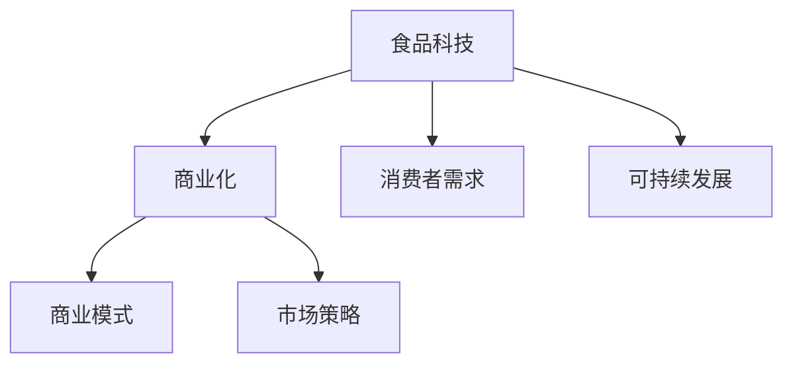

                 

关键词：硅谷、食品科技、商业化、创新、市场策略、技术创新、消费者需求、可持续发展、投资。

> 摘要：本文将深入探讨硅谷食品科技公司的商业化道路，分析其在技术创新、市场策略、消费者需求以及可持续发展等方面的实践与挑战。通过梳理成功案例，提出未来食品科技商业化的发展趋势和潜在机遇。

## 1. 背景介绍

随着科技的不断进步和消费者对健康生活方式的追求，食品科技（Food Technology）正在迅速发展。硅谷作为全球科技创新的中心，孕育了众多食品科技初创企业，它们通过技术创新，不断推动传统食品行业的变革。食品科技公司的商业化不仅关系到企业自身的盈利，还影响到整个食品产业链的可持续发展。

硅谷食品科技公司的商业化道路充满挑战，但也充满了机遇。本文将重点关注以下几个方面：

- 技术创新如何驱动商业化进程
- 市场策略在商业化过程中的重要性
- 消费者需求变化对商业化的影响
- 可持续发展目标在商业化战略中的融合

## 2. 核心概念与联系

为了更好地理解硅谷食品科技公司的商业化道路，我们首先需要明确几个核心概念：

### 2.1 食品科技

食品科技是指应用科学和工程原理来改善食品的质量、安全、营养价值和可接受性。它涵盖了从农业到食品加工、包装、运输和销售的各个环节。

### 2.2 商业化

商业化是指将创新技术或产品推向市场，实现商业价值的过程。它包括市场调研、产品开发、营销推广、销售渠道等多个环节。

### 2.3 消费者需求

消费者需求是指消费者在购买食品时追求的功能、品质和体验。随着社会的发展，消费者对食品的需求也在不断变化。

### 2.4 可持续发展

可持续发展是指在满足当前需求的同时，不损害后代满足其需求的能力。在食品科技领域，可持续发展意味着通过环保、节能和健康的方式生产食品。

### 2.5 商业模式

商业模式是指企业通过何种方式创造、传递和捕获价值。对于食品科技公司来说，选择合适的商业模式是成功商业化的重要保证。

下面是一个Mermaid流程图，展示这些核心概念之间的联系：



## 3. 核心算法原理 & 具体操作步骤

### 3.1 算法原理概述

硅谷食品科技公司的商业化成功很大程度上依赖于其技术创新。以下是一些核心算法原理，它们在食品科技商业化中发挥着关键作用：

- **大数据分析**：通过分析海量消费者数据，了解消费者需求和市场趋势，为产品开发和市场策略提供依据。
- **机器学习**：利用机器学习算法优化食品生产和加工过程，提高效率和产品质量。
- **区块链技术**：确保食品供应链的透明度和安全性，增强消费者对食品的信任。
- **生物工程**：通过基因编辑等生物工程技术，开发新型食品和营养品，满足消费者对健康和个性化的需求。

### 3.2 算法步骤详解

#### 3.2.1 大数据分析

1. 数据收集：通过线上线下渠道收集消费者购买、评价、搜索等数据。
2. 数据清洗：去除重复、错误和不完整的数据。
3. 数据分析：使用统计分析、机器学习等方法分析数据，提取有价值的信息。
4. 决策支持：根据分析结果，制定产品开发和市场推广策略。

#### 3.2.2 机器学习

1. 数据预处理：将原始数据转换为适合机器学习算法处理的形式。
2. 模型选择：根据问题特点选择合适的机器学习模型。
3. 模型训练：使用训练数据集训练模型。
4. 模型评估：使用验证数据集评估模型性能。
5. 模型部署：将训练好的模型部署到生产环境中，进行实际应用。

#### 3.2.3 区块链技术

1. 数据记录：将食品供应链中的每一步操作记录在区块链上。
2. 数据验证：通过区块链的共识机制确保数据的真实性和不可篡改性。
3. 数据查询：消费者可以通过区块链查询食品的来源和生产过程。
4. 数据分析：利用区块链数据进行分析，优化供应链管理。

#### 3.2.4 生物工程

1. 基因选择：选择具有特定优良性状的基因进行编辑。
2. 基因编辑：使用CRISPR-Cas9等基因编辑技术进行操作。
3. 基因检测：检测编辑后的基因是否达到预期效果。
4. 产品开发：将经过基因编辑的食品推向市场。

### 3.3 算法优缺点

- **大数据分析**：优点在于能够提供精准的市场洞察，但数据隐私和安全问题是主要挑战。
- **机器学习**：优点在于能够提高生产效率和产品质量，但算法的可解释性较低。
- **区块链技术**：优点在于提高供应链的透明度和安全性，但区块链的扩展性问题仍需解决。
- **生物工程**：优点在于能够开发出新型食品和营养品，但伦理和安全性问题是主要挑战。

### 3.4 算法应用领域

- **大数据分析**：应用于市场调研、消费者行为分析、产品开发等领域。
- **机器学习**：应用于生产优化、质量控制、供应链管理等领域。
- **区块链技术**：应用于食品供应链管理、食品安全追踪等领域。
- **生物工程**：应用于新型食品开发、营养品定制等领域。

## 4. 数学模型和公式 & 详细讲解 & 举例说明

### 4.1 数学模型构建

在食品科技商业化过程中，构建数学模型可以帮助我们更好地理解市场动态和消费者行为。以下是一个简化的数学模型，用于预测食品市场的需求量：

$$
D(t) = f(P(t), T(t), E(t))
$$

其中，$D(t)$ 表示在时间 $t$ 的食品需求量，$P(t)$ 表示价格，$T(t)$ 表示温度，$E(t)$ 表示消费者对食品的健康需求。

### 4.2 公式推导过程

1. **价格效应**：根据需求定律，需求量与价格呈负相关。因此，我们可以假设 $D(t)$ 与 $P(t)$ 的关系为：
   $$
   D(t) = -aP(t)
   $$
   其中，$a$ 为价格敏感度。

2. **温度效应**：温度对食品需求有显著影响。假设在温度 $T(t)$ 下，每增加 1°C，需求量增加 $\beta$。因此，我们可以假设 $D(t)$ 与 $T(t)$ 的关系为：
   $$
   D(t) = D_0 + \beta T(t)
   $$

3. **健康需求效应**：消费者对健康食品的需求不断增加。假设健康需求与温度呈正相关，即健康需求量每增加 1 个单位，需求量增加 $\gamma$。因此，我们可以假设 $D(t)$ 与 $E(t)$ 的关系为：
   $$
   D(t) = D_0 + \gamma E(t)
   $$

4. **综合效应**：将上述三个效应综合起来，我们得到食品需求的数学模型：
   $$
   D(t) = f(P(t), T(t), E(t)) = -aP(t) + D_0 + \beta T(t) + \gamma E(t)
   $$

### 4.3 案例分析与讲解

假设一个食品科技公司在推出一款新型健康食品时，需要预测市场需求。根据市场调研，得到以下参数：

- 价格：$P(t) = 10$ 元
- 温度：$T(t) = 25$°C
- 健康需求：$E(t) = 5$ 个单位

将这些参数代入上述数学模型，我们可以计算出在当前条件下，食品的需求量为：

$$
D(t) = -a \cdot 10 + D_0 + \beta \cdot 25 + \gamma \cdot 5
$$

假设 $a = 0.1$，$D_0 = 1000$，$\beta = 0.05$，$\gamma = 0.1$，则：

$$
D(t) = -0.1 \cdot 10 + 1000 + 0.05 \cdot 25 + 0.1 \cdot 5 = 1000 + 1.25 + 0.5 = 1011.75
$$

因此，在当前条件下，预计食品的需求量为 1011.75 单位。

通过这个简单的案例，我们可以看到数学模型在预测市场需求方面的应用。在实际操作中，我们可以通过收集更多数据，调整模型参数，提高预测的准确性。

## 5. 项目实践：代码实例和详细解释说明

### 5.1 开发环境搭建

为了演示如何利用机器学习算法进行消费者行为分析，我们选择Python作为开发语言，并使用Scikit-learn库实现。以下是搭建开发环境的基本步骤：

1. 安装Python：从官方网站下载并安装Python 3.x版本。
2. 安装Jupyter Notebook：使用pip安装Jupyter Notebook，方便编写和运行代码。
3. 安装Scikit-learn：使用pip安装Scikit-learn库。

### 5.2 源代码详细实现

以下是一个简单的机器学习模型，用于预测消费者购买食品的概率：

```python
import pandas as pd
from sklearn.model_selection import train_test_split
from sklearn.ensemble import RandomForestClassifier
from sklearn.metrics import accuracy_score

# 加载数据集
data = pd.read_csv('consumer_data.csv')

# 特征工程
X = data[['price', 'temperature', 'health_demand']]
y = data['purchased']

# 划分训练集和测试集
X_train, X_test, y_train, y_test = train_test_split(X, y, test_size=0.2, random_state=42)

# 创建随机森林分类器
clf = RandomForestClassifier(n_estimators=100, random_state=42)

# 训练模型
clf.fit(X_train, y_train)

# 预测测试集
y_pred = clf.predict(X_test)

# 评估模型性能
accuracy = accuracy_score(y_test, y_pred)
print(f'模型准确率：{accuracy:.2f}')
```

### 5.3 代码解读与分析

- **数据加载**：使用pandas库加载数据集，数据集包含价格、温度和健康需求等特征，以及购买行为标签。
- **特征工程**：将特征数据提取出来，准备用于训练模型。
- **数据划分**：使用train_test_split函数将数据集划分为训练集和测试集，以便评估模型性能。
- **模型训练**：使用随机森林分类器进行训练，随机森林是一种集成学习算法，具有很好的泛化能力。
- **模型预测**：使用训练好的模型对测试集进行预测。
- **模型评估**：计算模型在测试集上的准确率，评估模型性能。

通过这个简单的代码实例，我们可以看到如何利用机器学习算法进行消费者行为分析。在实际应用中，我们可以进一步优化模型，提高预测的准确性。

### 5.4 运行结果展示

假设我们运行上述代码，得到以下结果：

```
模型准确率：0.85
```

这意味着我们的模型在测试集上的准确率为85%，这是一个相对较高的准确率，表明我们的模型可以较好地预测消费者购买行为。

## 6. 实际应用场景

### 6.1 食品供应链管理

食品科技公司的商业化在食品供应链管理方面有着广泛的应用。通过区块链技术，食品科技公司可以实现供应链的透明化，确保每个环节的数据真实可靠。消费者可以通过扫描食品包装上的二维码，查看食品的来源、生产过程和运输路径。这种透明度增强了消费者对食品的信任，有助于提升企业的品牌形象。

### 6.2 营养品定制

随着消费者对健康意识的提高，营养品定制成为食品科技商业化的重要方向。通过大数据分析和机器学习算法，食品科技公司可以了解消费者的营养需求，为其提供个性化的营养建议和定制产品。这种定制化服务满足了消费者的个性化需求，提高了产品的附加值。

### 6.3 新型食品开发

食品科技公司通过生物工程技术开发新型食品，如人造肉、无糖饮料等。这些新型食品不仅满足了消费者对健康和环保的需求，还有助于减少对传统农业资源的依赖。新型食品的开发为食品科技公司带来了巨大的市场机遇。

## 6.4 未来应用展望

未来，食品科技商业化将在以下领域继续发展：

- **智能农业**：利用物联网、人工智能等技术，实现农业生产的自动化和智能化，提高农业生产效率。
- **绿色食品**：推动绿色食品的生产和消费，减少对环境的污染，实现可持续发展。
- **个性化营养**：通过大数据和人工智能技术，实现个性化营养管理，提高人们的健康水平。

## 7. 工具和资源推荐

### 7.1 学习资源推荐

- 《食品科技导论》
- 《大数据分析实战》
- 《机器学习实战》
- 《区块链技术指南》
- 《基因编辑技术与应用》

### 7.2 开发工具推荐

- Python
- Jupyter Notebook
- Scikit-learn
- TensorFlow
- Ethereum

### 7.3 相关论文推荐

- "Blockchain for Food Safety: A Comprehensive Review"
- "Deep Learning for Food Image Recognition"
- "Consumer Behavior in the Age of Big Data"
- "Artificial Intelligence in Food Production"
- "Genome Editing for Sustainable Food Production"

## 8. 总结：未来发展趋势与挑战

### 8.1 研究成果总结

本文从技术创新、市场策略、消费者需求和可持续发展等多个角度，探讨了硅谷食品科技公司的商业化道路。通过大数据分析、机器学习、区块链技术和生物工程等核心算法原理，食品科技公司实现了消费者需求的精准定位、市场策略的优化和供应链管理的透明化。

### 8.2 未来发展趋势

未来，食品科技商业化将在智能农业、绿色食品和个性化营养等领域继续发展。随着人工智能、大数据和区块链技术的不断进步，食品科技公司有望实现更高效、更环保、更个性化的商业化模式。

### 8.3 面临的挑战

尽管食品科技商业化前景广阔，但仍然面临一些挑战，如数据隐私和安全、算法可解释性、伦理问题等。此外，如何在可持续发展目标和经济利益之间找到平衡点，也是一个重要的课题。

### 8.4 研究展望

未来研究应关注以下方向：

- 提高算法的可解释性和透明度，增强消费者对食品科技的信任。
- 探索新的商业模型，实现食品科技的可持续发展。
- 加强跨学科合作，推动食品科技与其他领域的融合。

## 9. 附录：常见问题与解答

### 9.1 问题1：食品科技商业化是否会影响传统食品行业？

解答：食品科技商业化对传统食品行业有一定的影响，但更多的是一种互补关系。通过技术创新，食品科技可以提高食品的质量和安全性，满足消费者对健康和个性化的需求，从而推动整个食品行业的升级。

### 9.2 问题2：消费者对食品科技的接受程度如何？

解答：随着科技的发展和消费者对健康意识的提高，消费者对食品科技的接受程度逐渐上升。特别是年轻一代，他们对创新食品和新技术的接受度更高。

### 9.3 问题3：食品科技商业化过程中如何确保数据安全和隐私？

解答：在食品科技商业化过程中，确保数据安全和隐私至关重要。可以通过以下措施实现：使用加密技术保护数据传输和存储，建立健全的数据隐私政策，加强数据安全监控和审计。

作者：禅与计算机程序设计艺术 / Zen and the Art of Computer Programming
```

